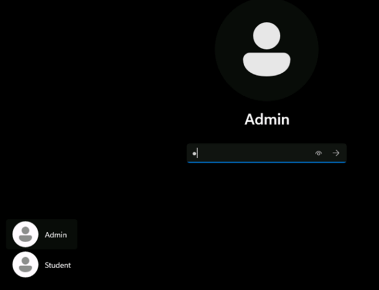
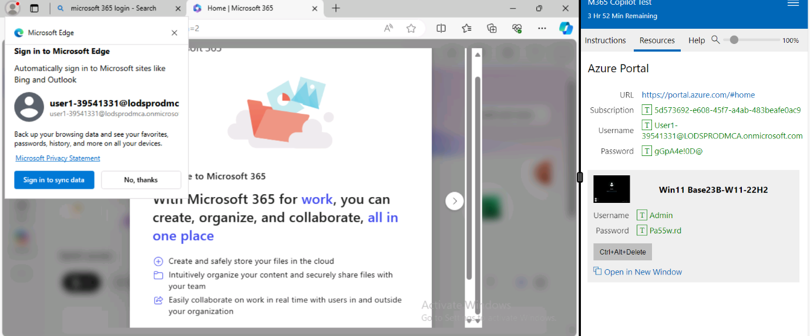
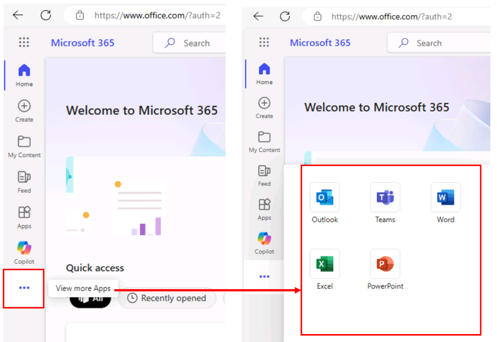
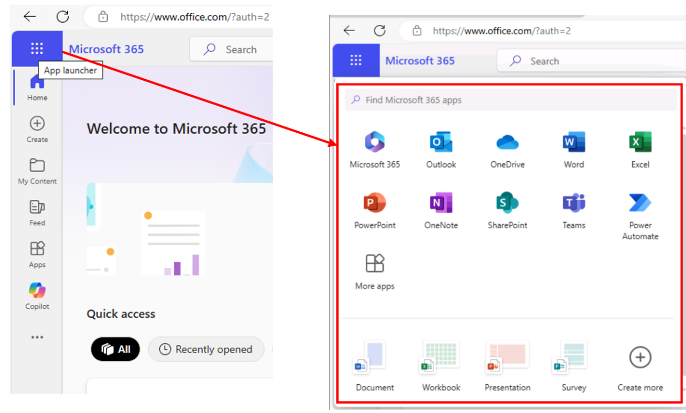

**ラボ 0: ラボ実行の準備**

**ラボ仮想マシンにログインします。**

ログイン画面で、画面の左下隅にある管理者アカウントを選択し、右側のリソースタブの
Win 11 Base23B-22H2
で提供された資格情報を使用してラボ仮想マシンにサインインします
(スクリーンショットを参照)。

注: 学生ログインは使用しないでください。

**Microsoft 365 サブスクリプションの設定を完了し、Copilot for Microsoft
365 にアクセスします**

1.  Edge ブラウザーで Microsoft 365
    タブを開いている場合は、それを選択します。開いていない場合は、新しいタブを開いて次の
    URL を入力します: +++https://portal.office.com+++

2.  右側の \[リソース\] タブの Azure Portal セクションで提供されている
    Microsoft 365 資格情報 (スクリーンショットを参照)
    を使用してサインインします。

これで、すべての Microsoft 365
アプリケーションにアクセスできるようになり、Copilot for Microsoft 365
にもアクセスできるようになります。

**Microsoft 365 アプリケーションにアクセスして起動する**

生産性向上アプリケーションには、次の場所からアクセスして起動できます。

- アプリアイコン（左側のナビゲーションパネル内）

- その他のアプリを表示リンク（左側のナビゲーションパネル内）

- アプリランチャー（左側のナビゲーションパネルのすぐ上、左上に表示）

1.  アプリアイコンからアプリケーションを起動するには:

左下のナビゲーション ウィンドウで、Appsアイコンを選択し、作業に必要な
Office アプリケーションを選択して開きます。

2.  「View more Apps」からアプリケーションを起動するには:

左下のナビゲーション ウィンドウで、\[View more Apps\] (省略記号...
アイコン) を選択し、作業に必要な Office
アプリケーションを選択して開きます。

3.  App launcherからアプリケーションを起動するには:

Microsoft 365
アプリランチャーは、ライセンスをお持ちのアプリとサービスのメニューで、Microsoft
365
ページでアプリランチャーアイコンを選択すると開きます。アプリランチャーを使用すると、最近使用したアプリがハイライト表示され、最近使用したオンライン
Office
ドキュメントに簡単にアクセスできるため、アプリの起動と切り替えが簡単になります。

**注:**
ポップアップにアプリケーションが見つからない場合は、\[その他のアプリ\]
アイコンを選択して同じものを選択します。

**ラボアセットを OneDrive にアップロードする**

このハンズオンラボセッションで使用するラボアセット（参照ドキュメント）は、C:\Lab
Files にあります。

注: Copilot プロンプトでファイル（Word 文書、Excel
ファイルなど）を参照する必要がある場合は、必ず OneDrive
アカウントに保存してください。PC
にローカルに保存されているファイルにリンクすることはできません。

1.  Microsoft 365 のナビゲーション ウィンドウで、OneDrive
    を選択して開きます。

2.  C:\Lab Files
    フォルダーを参照して、ドキュメントのコピーを選択し、OneDrive
    にアップロードします。

注:
すべてのドキュメントのコピーをアップロードするか、特定のラボに関連するドキュメントのみをアップロードするかを選択できます。

これで、Copilot for Microsoft 365 ラボで作業するためのドキュメントが
OneDrive に保存されます。
