# Laboratório 0: Preparando-se para a execução do laboratório

**1. Faça login na sua máquina virtual de laboratório**

Na tela de login, selecione Conta **Admin** no canto inferior esquerdo
da tela para fazer login na máquina virtual do laboratório usando as
credenciais fornecidas no **Win 11 Base23B-2H2** na **aba Resources** à
direita (veja a captura de tela).

**Nota**: Não utilize o login **Student.**

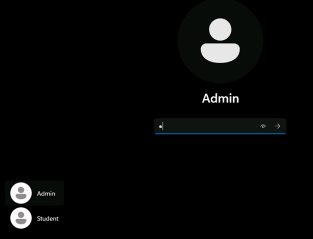

**Observação**: Os documentos de referência utilizados nos exercícios de
laboratório estão em **C:\LabFiles**. Ao iniciar o ambiente de
laboratório, você poderá ver a seguinte mensagem, conforme mostrado na
captura de tela. Clique no botão **Download Files** para concluir o
download dos documentos de referência.

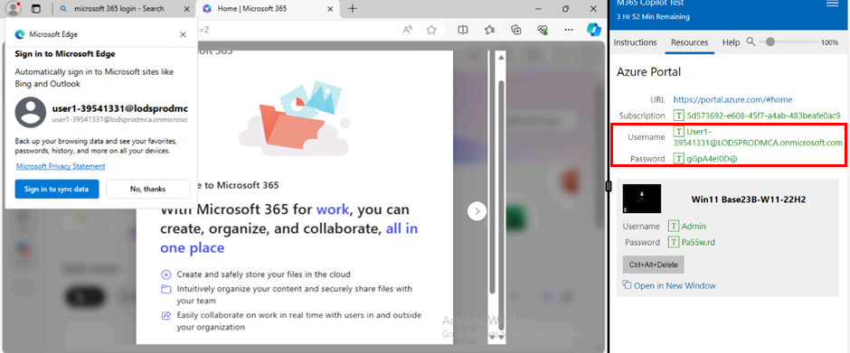

**2. Conclua a configuração da assinatura do Microsoft 365 e acesse o
Microsoft 365 Copilot**

1.  Abra o navegador Microsoft Edge e insira o seguinte URL:
    +++<https://m365.cloud.microsoft>+++

2.  Use as **credentials** fornecidas na seção Portal do Azure na **aba
    Resources** à direita (veja a captura de tela) para fazer login.

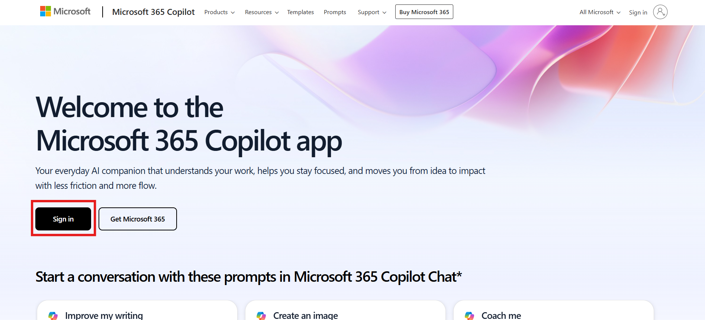

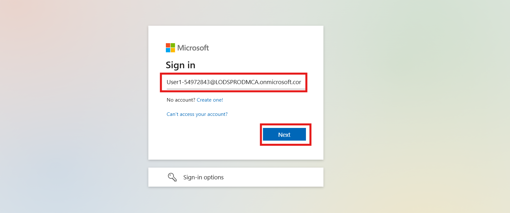

Agora você poderá acessar todos os aplicativos do Microsoft 365 e terá
acesso ao aplicativo Microsoft 365 Copilot e ao chat do Copilot.

**3. Acesse e inicie os aplicativos do Microsoft 365**

Você pode acessar e iniciar os aplicativos de produtividade a partir do
**ícone Apps** (no painel de navegação à esquerda)

1.  Para iniciar um aplicativo a partir do ícone **Apps**:

No painel de navegação no canto inferior esquerdo, clique no ícone
**Apps** para selecionar e abrir os aplicativos do office com os quais
você precisa trabalhar.

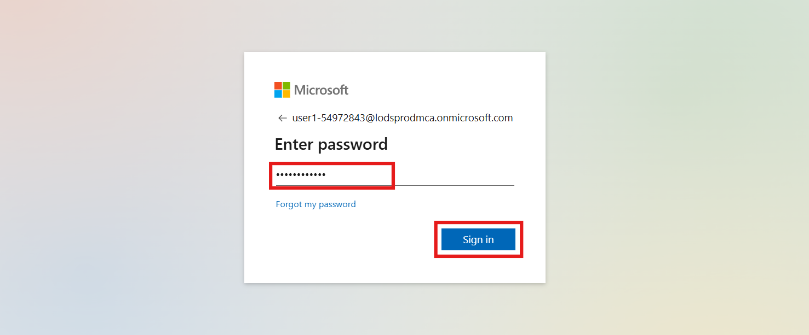

2.  Se você não encontrar um aplicativo, clique em **Install apps** ou
    **All apps** para selecioná-lo.

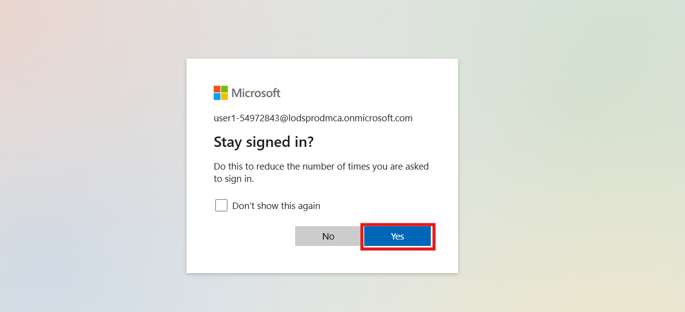

**4. Carregar os recursos do laboratório no OneDrive**

Os recursos de laboratório (documentos de referência) que você usará
nesta sessão de laboratório prático estão disponíveis em
**C:\LabFiles.**

**Observação**: Quando você precisar referenciar um arquivo (um
documento do Word, um arquivo do Excel, etc.) em um prompt do Copilot, o
arquivo DEVE ser salvo em uma conta do OneDrive. Não é possível vincular
a um arquivo armazenado localmente no seu PC.

1.  Na página **Apps**, selecione **OneDrive** para abri-lo.

2.  Selecione **My files**

 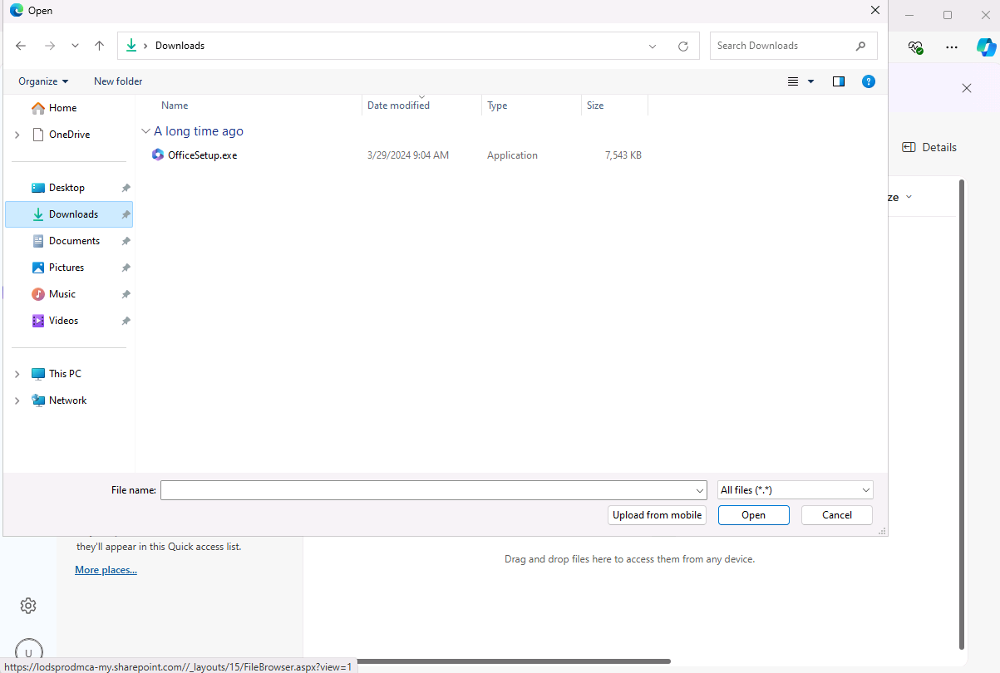

3.  Navegue até a pasta **C:\LabFiles\MS4019** para selecionar e
    carregar uma cópia do(s) documento(s) para o
    **OneDrive**.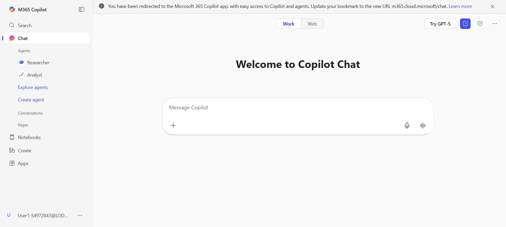

**Observação**: Você pode optar por enviar uma cópia de todos os
documentos ou dos documentos relacionados ao laboratório específico.

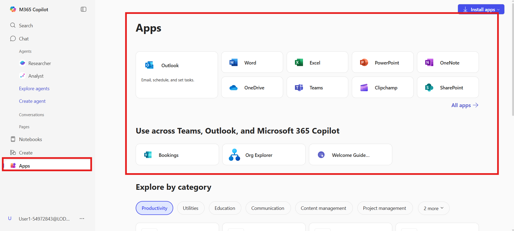

Agora você terá os documentos no **OneDrive** para trabalhar com os
laboratórios do **Microsoft 365 Copilot.**

**5. Crie uma biblioteca de documentos (canal do Teams) e carregue
fontes de conhecimento**

Você usará bibliotecas de documentos nos canais do Teams para carregar
recursos de conhecimento que serão usados como documentos de referência
na sessão de laboratório prático.

1.  Na página **Apps**, selecione **Teams**

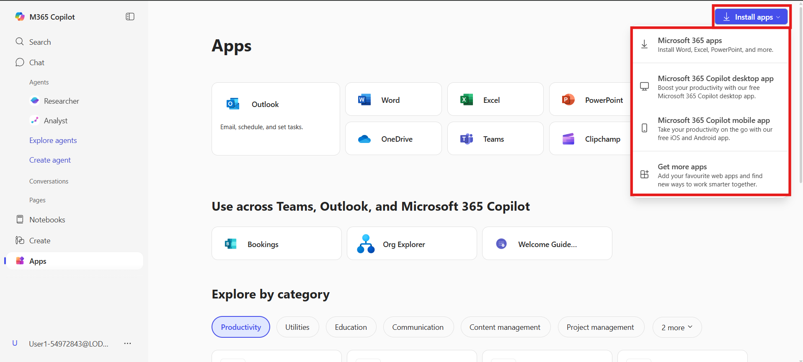

2.  Clique em **Get Started**

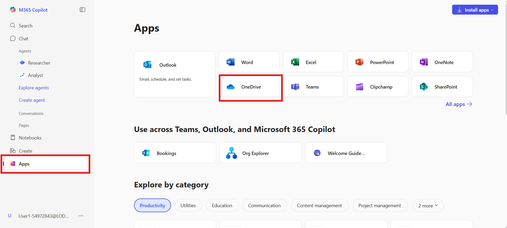

3.  Selecione **Teams** no painel de navegação à esquerda.

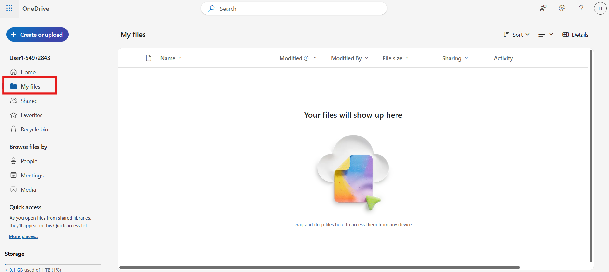

4.  Clique em **Join Team** em **Contoso Public**.

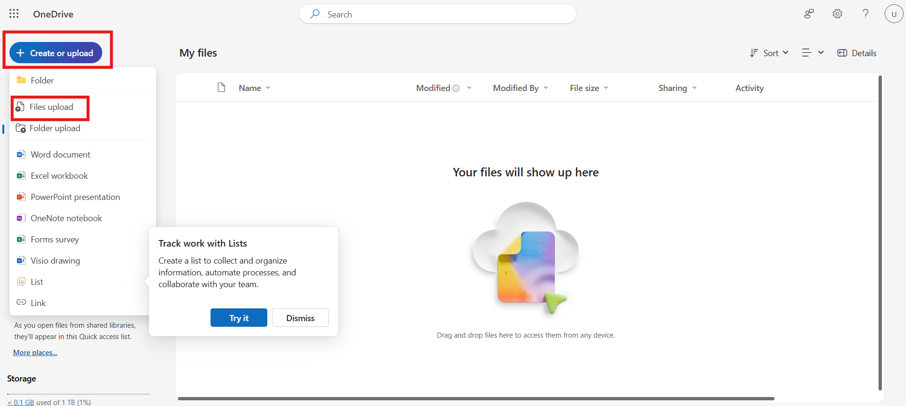

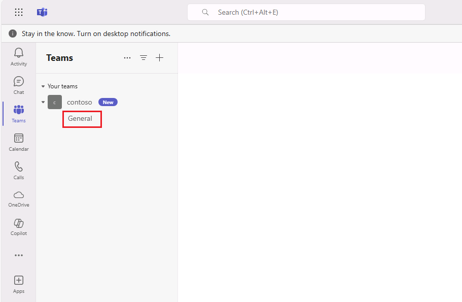

5.  Volte para a seção **Teams** e selecione **General**. Esta é a
    biblioteca de documentos onde os documentos de referência serão
    carregados.

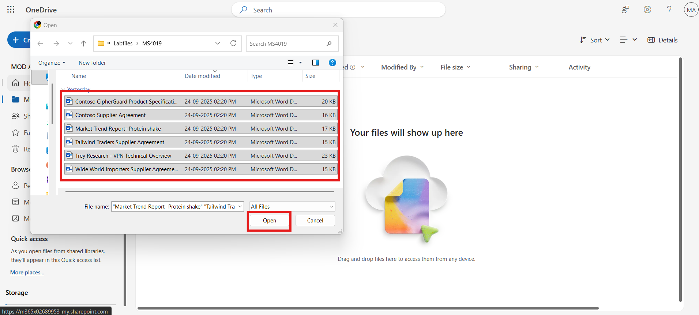

**Observação**: Aguarde um pouco para que os arquivos sejam enviados
automaticamente. Se os arquivos estiverem visíveis, prossiga para o
**Lab 01**.

Se você não visualizar nenhum arquivo, prossiga para a **etapa 6.**

6.  Selecione **Files**.

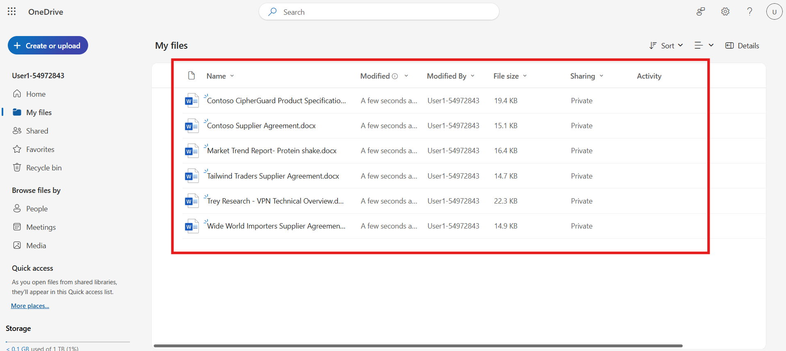

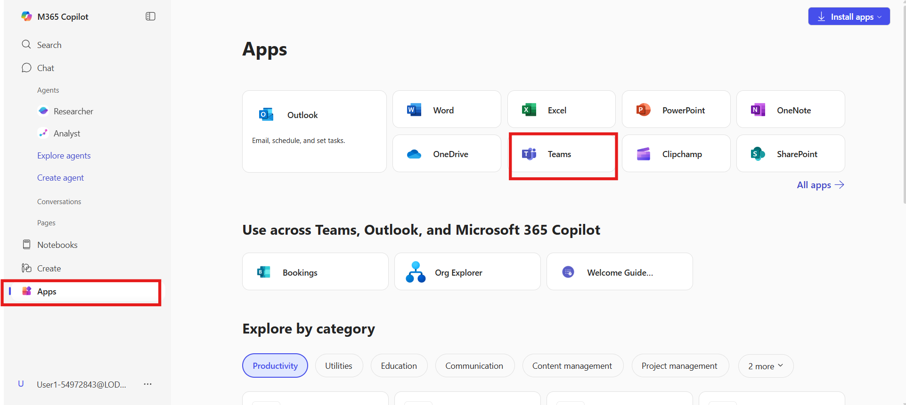

7.  Clique em **Upload** e selecione **Files**.

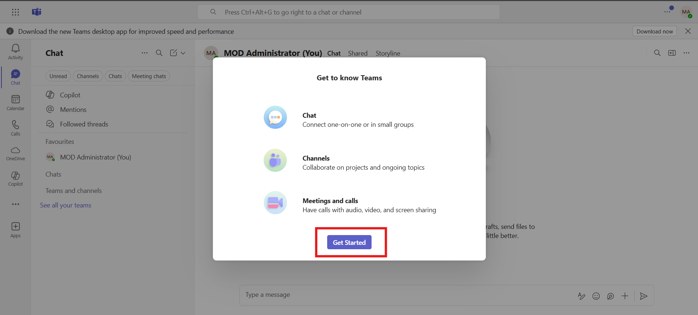

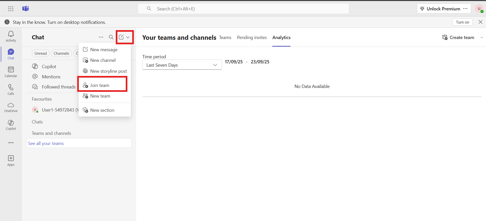

8.  Navegue até **C:\LabFiles\MS4019**

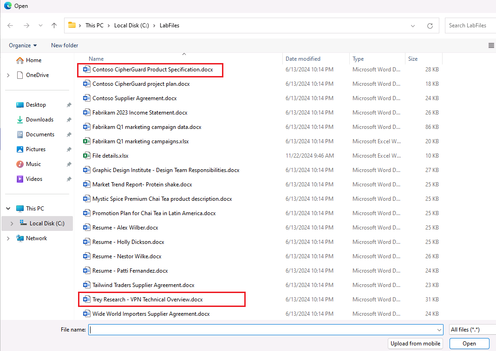

9.  Selecione **Contoso CipherGuard Product Specification** e **Trey
    Research - VPN Technical Overview** e carregue na biblioteca de
    documentos.

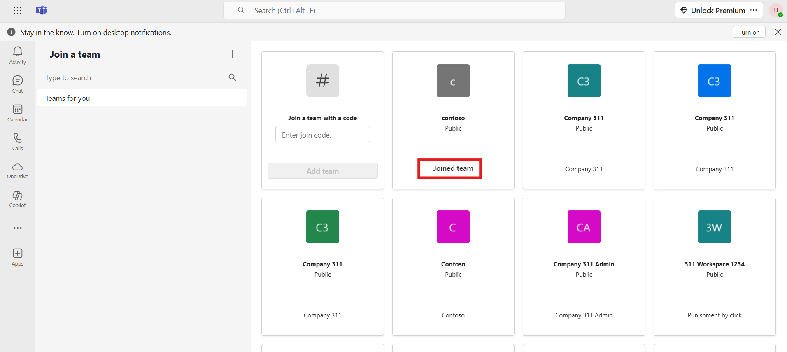

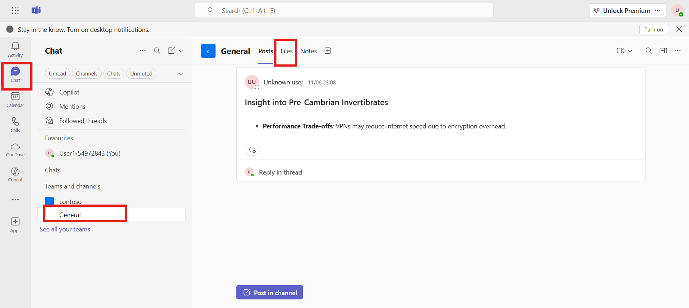

Agora você criou a biblioteca de documentos e carregou os documentos de
referência para serem usados como fonte de conhecimento.
