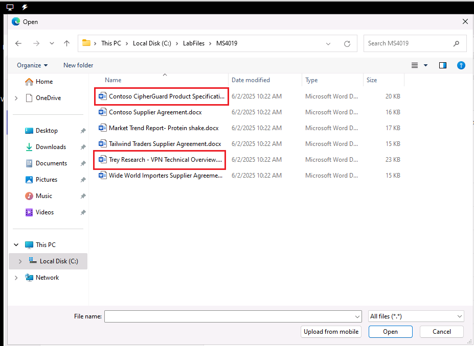

# Lab 0: Preparing for the lab execution

## Introduction

This lab serves as a foundation for the hands-on exercises that follow.
It ensures participants are fully prepared by setting up the lab
environment, logging into the virtual machine, configuring Microsoft 365
subscription, and gaining access to Microsoft 365 Copilot. In addition,
participants will upload essential lab assets to OneDrive and Teams,
creating a shared document library that will be used as knowledge
sources during subsequent labs.

## Exercise 1: Log into your Lab Virtual Machine

On the Log-in screen, select **Admin** account in the lower left corner
of the screen to sign-in to the lab virtual machine using the
credentials provided under **Win 11 Base23B-22H2** in the **Resources
tab** on the right (see screenshot).

**Note**: Do not use the **student** login.

**Note**: Reference documents used by the lab exercises are
in **C:\LabFiles**. When launching the lab environment, you may
sometimes see the following message as shown in the screenshot. Click
Download Files button to finish downloading the reference documents.

## Exercise 2: Complete setting up Microsoft 365 subscription and access Microsoft 365 Copilot

1.  Open Microsoft Edge browser and enter the following
    URL: +++https://m365.cloud.microsoft+++. Click on the **Sign in**
    button.

    

2.  Enter the **User tenant** provided in the **Resources tab** and then
    click on the **Next** button to proceed.

    

3.  Enter the **Password** provided in the **Resources tab** and then
    click on the **Sign in** button.

    

4.  Click on the **Yes** to stay signed in.

    

5.  Click on the **Cross icon** **(X)** to close the popup.

    

6.  You will now be able to access all the Microsoft 365 applications
    and will have access to Microsoft 365 Copilot app and Copilot chat.

    

## Exercise 3: Access and launch Microsoft 365 applications

1.  In the navigation pane on the lower left, select **Apps** icon to
    select and open the office applications you need to work with.

    

2.  If you do not find an application, then click **Install apps** to
    install the applications.

    

## Exercise 4: Upload lab assets to OneDrive

The lab assets (Reference documents) that you will be using in this
hands-on lab session are available in **C:\LabFiles.**

> **Note**: When you need to reference a file (a Word document, an Excel
file, etc) into a Copilot prompt, the file MUST be saved in a OneDrive
account. You can't link to a locally stored file on your PC.

1.  On the **Apps** page, select **OneDrive** to open it.

    

2.  On the one drive window, from the left-hand side Select **My files**
    option. Currently, there is no file in My files folder.

    

3.  From the top left side of the widow, click on the **Create or
    upload** option and then select **File upload** option.

    

4.  Browse to the **C:\LabFiles\MS4019** folder to select and upload a
    copy of the document(s) to **OneDrive**.

    

5.  Select all file available in the folder and the click on the
    **Open** button to upload the files.

    

    > **Note**: You can either choose to upload a copy of all the documents
    or the document(s) related to the particular lab.

6.  Now you will have the document(s) in **OneDrive** to work
    with **Microsoft 365 Copilot** labs.

    

## Exercise 5: Create document library (Teams channel) and upload knowledge sources

You will be using document libraries in Teams channels to upload
knowledge resources to be used as reference documents in the hands-on
lab session.

1.  Navigate back to Microsoft 365 tab and on the **Apps** page,
    select **Teams.**

    

2.  If required, sign in with your tenant and then click on **Get
    Started.**

    

3.  Click on the **drop-down** arrow from the top next to **Chat** and
    then select **Join team**.

    

4.  Click **Join Team** under **Contoso Public**.

    

    

5.  Get back to **Chat** section and select **General** under Teams and
    channels. Click on the **Files**. This is the document library where
    the reference documents will be uploaded.

    

    > **Note**: Wait for some time for the files to get uploaded
    automatically. If the files are visible, please proceed to **Lab 01**.
    If you don't see any files, then proceed to **Exercise 6.**

## Exercise 6: Upload Lab Assets to Contoso Team 

1.  On the Contoso General section, select **Files**, click on the
    upload button and then select **Files** option.

    

2.  Browse to **C:\LabFiles\MS4019**

    

3.  Select **Contoso CipherGuard Product Specification** and **Trey
    Research - VPN Technical Overview** and upload to the document
    library.

    

    

You have now created the document library and uploaded the reference
documents to be used as knowledge source.

### Conclusion  
By completing this preparation lab, participants have successfully set
up their virtual environment, configured Microsoft 365 applications, and
organized reference documents in OneDrive and Teams. This setup ensures
that all necessary tools and resources are in place to work smoothly
with Microsoft 365 Copilot in the upcoming lab sessions.
