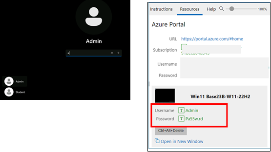

# Lab 0: Preparing for the lab execution

## Log into your Lab Virtual Machine

On the Log-in screen, select **Admin** account in the lower left
corner of the screen to sign-in to the lab virtual machine using the
credentials provided under **Win 11 Base23B-22H2** in the **Resources
tab** on the right (see screenshot).
 
**Note**: Do not use the **Student** login.

## Complete setting up Microsoft 365 subscription and access Copilot for Microsoft 365

1.  If you have a Microsoft 365 tab open in your Edge browser, then
    select it now; otherwise, open a new tab and enter the following
    URL: +++https://portal.office.com+++
    
2.  Use the **Microsoft 365 Credentials** provided under Azure Portal section in the **Resources tab** on     the right (see screenshot) to sign-in.

    

    

    You will now be able to access all the Microsoft 365 applications and
    will have access to Copilot for Microsoft 365.

## Access and launch Microsoft 365 applications

You can access and launch the productivity applications from:

- **Apps icon** (in the navigation pane on the left)

- **View more Apps** link (in the navigation pane on the left)

- **App Launcher** (available in the top left just above the left navigation
  pane)

1.  To launch an application from **Apps** icon:

    In the navigation pane on the lower left, select **Apps** icon to select and open the office applications you
    need to work with.

    
    
2.  To launch an application from **View more Apps:**:

    In the navigation pane on the lower left, select **View more Apps**
    (ellipsis **…** icon) to select and open the office applications you
    need to work with.

    

3.  To launch an application from **App launcher**:

    The Microsoft 365 app launcher is a menu of apps and services that you
    are licensed for, and opens when you select the app launcher icon on
    Microsoft365 page. The App launcher makes opening and switching
    between your apps easy by highlighting your recently used apps, and
    providing quick access to your recent online Office documents.

    

    **Note**: If you do not find an application in the pop-up, then select
    **More apps** icon to select the same.

## Upload lab assets to OneDrive

The lab assets (Reference documents) that you will be using in this
hands-on lab session are available in **C:\LabFiles.**
    
**Note**: When you need to reference a file (a Word
document, an Excel file, etc) into a Copilot prompt, the file MUST be
saved in a OneDrive account. You can't link to a locally stored file
on your PC.

1.  On the Microsoft 365 navigation pane, select OneDrive to open it.
    
2.  Browse to the **C:\LabFiles** folder to select and upload a copy of
    the document(s) to OneDrive. 

    **Note**: You can either choose to upload a copy of all the documents or the document(s) related to the
    particular lab.

    
        

    
        

    

    Now you will have the document(s) in **OneDrive** to work with
    **Copilot for Microsoft 365** labs.
