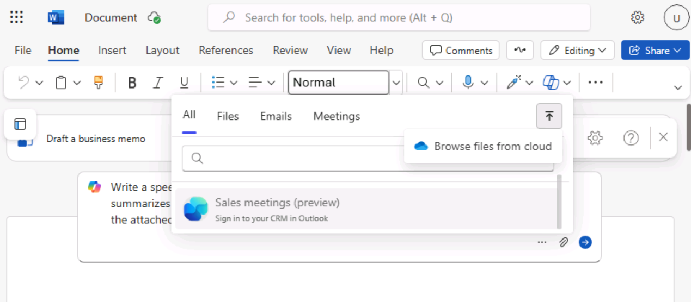
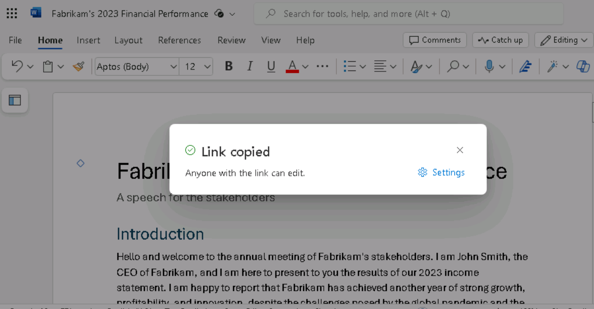
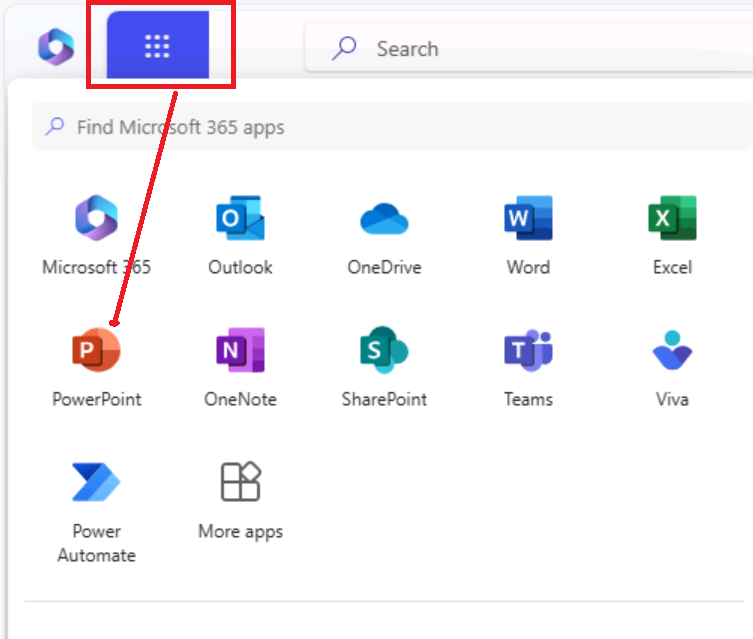
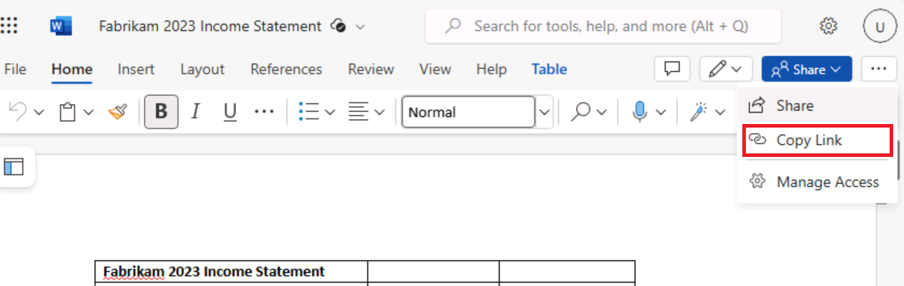
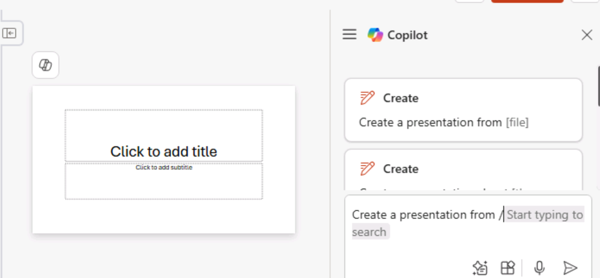
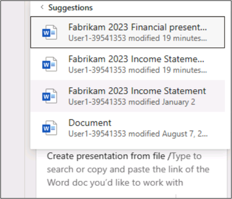
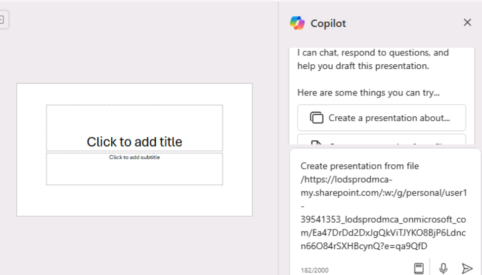
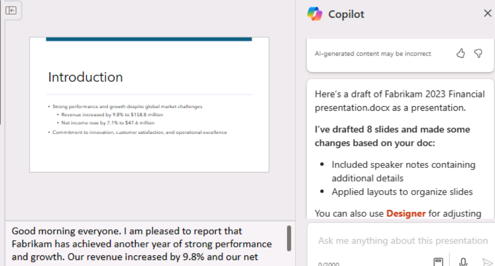

**Lab 01: Potenzia la tua forza lavoro - Copilot - Dirigenti**

In questo laboratorio, si

- Usa Copilot in Word per creare un discorso che intendi tenere agli
  azionisti dell'azienda.

- Utilizzare Copilot in PowerPoint per creare una presentazione
  PowerPoint basata sul discorso creato.

**Esercizio #1: Creare un discorso utilizzando Copilot in Word**

In questo esercizio, si indica a Copilot in Word di scrivere un discorso
per l'utente in base al conto economico dell'azienda, che viene
archiviato come documento di Word. Questo esercizio illustra una serie
di suggerimenti che è possibile utilizzare per fare in modo che Copilot
in Word generi il discorso e quindi lo aggiorni in base alle modifiche
suggerite.

**Nota**: quando è necessario fare riferimento a un file (ad esempio il
conto economico dell'azienda) in un prompt di Copilot, il file DEVE
essere salvato in un account OneDrive. Non è possibile collegarsi a un
file archiviato localmente nel PC.

È possibile fare riferimento/collegare un file al prompt di Copilot
utilizzando uno dei seguenti metodi:

- Selezionare il file dall'elenco dei file utilizzati più di recente.

- Apri il file e copia il suo percorso utilizzando l' opzione **Share**,
  quindi incolla il percorso nel prompt seguendo la barra (/).

- Copia il percorso del file da Esplora file e incollalo nel prompt dopo
  la barra (/).

In questo esercizio, si seleziona il conto economico della società
dall'elenco dei file MRU.

Eseguirai i seguenti passaggi per fare in modo che Copilot in Word crei
un discorso per te in base al conto economico della tua azienda:

1.  Se hai una scheda di Microsoft 365 aperta nel browser Edge,
    selezionala ora; in caso contrario, apri una nuova scheda e
    inserisci il seguente URL:
    +++[https://www.office.com+++](https://www.office.com+++/) per
    andare alla **home page di** Microsoft 365.

**Nota**: è necessario accedere (se richiesto) utilizzando le di
**Microsoft 365 Credentials** fornite nella scheda **Resources** a
destra.

Dopo l'accesso, se viene visualizzata una pagina Web confusa della home
page di **Microsoft 365**, fare clic su **Refresh** nella barra dei menu
del browser

Fai clic sull'icona di **App Launcher** (del **Candy box menu** icon -
matrice di punti 3 per 3) in alto a sinistra per espandere il menu App e
selezionare **OneDrive**.

Fare clic sulla freccia per continuare.

2.  Nel riquadro di navigazione, seleziona l' icona **+** e seleziona
    **Files upload** per aprirlo.

3.  Passare alla cartella **C:\LabFiles** per selezionare e caricare una
    copia del documento di **Fabrikam 2023 Income Statement** in
    **OneDrive**.

**Nota**: se sono già state caricate tutte le risorse lab in OneDrive,
come suggerito in **Preparing for the lab execution (Lab 0),** è
possibile ignorare questo passaggio.

4.  Apri e chiudi il file documento di **Fabrikam 2023 Income
    Statement** (che hai caricato su OneDrive) per inserirlo nell'elenco
    dei file utilizzati più di recente (MRU).
    

**Nota**: quando apri il documento **Fabrikam 2023 Income Statement**,
vedrai un popup come mostrato nello screenshot. Fare clic su **Next** e
selezionare **Try Copilot**.

Chiudi il browser con il documento di **Fabrikam 2023 Income
Statement**.

5.  In Microsoft 365 aprire **Microsoft Word** e quindi aprire un nuovo
    documento vuoto.

6.  Nella finestra **Draft with Copilot** visualizzata nella parte
    superiore del documento vuoto, immettere il seguente messaggio di
    richiesta:

+++ Write a speech for the Fabrikam stakeholders that summarizes the
results of the company's 2023 income statement found in the attached
file.+++

7.  Nella finestra **Draft with Copilot**, selezionare il pulsante
    **Reference your content**. Nella finestra pop-up visualizzata,
    selezionare il
    file. 

Se, per qualche motivo, il file non viene visualizzato, fare clic su
**Browse files from cloud** nella finestra pop-up.

8.  Nella finestra **Pick a file** visualizzata, nell' elenco **Recent
    file**, selezionare il file **Fabrikam 2023 Income Statement.docx**
    e quindi selezionare il pulsante **Attach**.
    

9.  Si noti come il file viene visualizzato nel prompt. Selezionare
    **Generate**.
    

**Nota**: se, per qualche motivo, continui a ricevere l'errore
**Something went wrong** quando fai clic sul pulsante **Generate** dopo
aver allegato il documento di riferimento, elimina l'errore e procedi
con il passaggio successivo.

Apri il file in un browser e copia il suo percorso utilizzando l'opzione
Condividi, quindi incolla il percorso nel prompt seguendo la barra (/).

**Importante**: anche dopo aver provato con l'opzione alternativa, se
vedi la stessa eccezione "**something went wrong**", invece di
utilizzare il client Web di Word prova a utilizzare la versione desktop
di Word.

Se funziona quando si utilizza la versione desktop di Word, seguire lo
stesso nei prossimi laboratori quando viene visualizzata l'eccezione
"something went wrong" mentre si fa clic sul pulsante **Generate.**

10. A questo punto, Copilot estrae i risultati finanziari dal Conto
    Economico e redige un discorso.

11. Dopo aver esaminato il discorso, decidi che è un buon punto di
    partenza, anche se ci sono alcune aree che vuoi modificare. Nella
    finestra Copilot alla fine del discorso, selezionare il pulsante
    **Keep it**.

12. Si desidera iniziare esaminando tutte le modifiche suggerite
    dall'editor di Copilot. Seleziona l' icona **Editor** che appare
    nella barra dei menu nella parte superiore della pagina.
    

**Nota**: Sarai in grado di vedere l' icona dell **Editor**, nella barra
multifunzione classica di **Microsoft Word**. Nella barra multifunzione
a riga singola, non sarà visibile nel livello di zoom predefinito del
browser del 100%. Seleziona l'icona con i di **ellipsis** (3 punti
orizzontali) e scorri verso il basso per selezionare **Editor**.

13. Nel riquadro **Editor** visualizzato, prendere nota delle categorie
    visualizzate nelle sezioni **Corrections** o **Refinements** che
    visualizzano un numero (che indica il numero di problemi per tale
    categoria). Questi problemi sono spesso legati al tono dello stile
    di scrittura utilizzato nel documento.

Sotto l'**Editor Score** c'è un campo che permette di selezionare il
tono utilizzato durante la scrittura del discorso. Attualmente viene
visualizzata la **Formal writing**, che è il tono predefinito utilizzato
da Copilot durante la stesura di questo discorso. Quando non si indica
lo stile di scrittura da utilizzare nel prompt, la **Formal writing** è
il tono predefinito utilizzato da Copilot. Seleziona questo campo per
visualizzare le opzioni. Preferisci un tono dal suono professionale,
quindi seleziona **Professional** dal menu a discesa. Prendere nota se
il punteggio dell' **Editor Score** cambia.

14. Nelle categorie visualizzate nelle sezioni **Corrections** o
    **Refinements**, è possibile esaminare le modifiche apportate alle
    categorie in base alla modifica dello stile di scrittura da Formale
    a Professionale. Selezionare ogni categoria che visualizza un numero
    (che indica il numero di problemi per quella categoria). In questo
    modo è possibile esaminare i suggerimenti in tutto il documento per
    tale categoria. Per ogni suggerimento, selezionare la modifica
    suggerita o selezionare **Ignore**. Ripetere questa procedura fino a
    quando tutte le categorie non visualizzano un segno di spunta.

Cambia lo stile di scrittura in **Casual** e controlla se il punteggio
dell'**Editor Score** cambia. Se una categoria mostra un numero, esamina
la categoria e guarda cosa ha segnalato l'editor. Si desidera mantenere
lo stile di scrittura come Professionale, quindi selezionare **Ignore**
tutte le modifiche suggerite. Esamina tutte le modifiche suggerite per
vedere le differenze che sono state segnalate tra gli stili Professional
e Casual.

15. Il file verrà salvato nel tuo account OneDrive. In alto a sinistra
    del documento di Word, fai clic sul nome del file per evidenziarlo e
    rinomina il file come +++Fabrikam 2023 Financial
    presentation.docx+++. Nell' esercizio successivo viene utilizzato
    questo documento.

**Importante**: Nell'esercizio successivo verrà utilizzato Copilot in
PowerPoint per creare una presentazione di diapositive basata su questo
documento. Il documento deve essere in OneDrive per consentire a Copilot
di accedervi.

16. Chiudi la scheda contenente questo documento nel browser Microsoft
    Edge.

**Esercizio \#2: Creare una presentazione di diapositive utilizzando
Copilot in PowerPoint**

In questo esercizio, utilizzerai Copilot in PowerPoint per creare una
presentazione di diapositive basata sul tuo discorso (agli azionisti in
base al conto economico) che hai creato utilizzando Copilot in Word per
scrivere il tuo discorso.

Nell'esercizio precedente, è stato effettuato l'accesso al conto
economico dell'azienda in Copilot accedendo al file dall'elenco dei file
utilizzati più di recente (MRU). In questo esercizio, acquisirai
esperienza nell'accesso a un file utilizzando un processo diverso.
Invece di utilizzare l'elenco MRU, si prevede di accedere al discorso
copiando il collegamento al file **Fabrikam 2023 Financial
presentation.docx** creato nell'esercizio precedente.

Eseguirai i seguenti passaggi per fare in modo che Copilot in PowerPoint
crei una bozza della tua presentazione:

1.  Se hai una scheda di Microsoft 365 aperta nel tuo browser Edge,
    selezionala ora; in caso contrario, apri una nuova scheda e
    inserisci il seguente URL:
    +++[https://www.office.com+++](https://www.office.com+++/) per
    andare alla home page **di Microsoft 365**.

**Nota**: è necessario accedere (se richiesto) utilizzando le di
**Microsoft 365 Credentials** fornite nella scheda **Resources** a
destra.

2.  Nel riquadro di spostamento di **Microsoft 365**, selezionare
    **Word** per aprire Word.

3.  Nella pagina del file in **Word**, scorri verso il basso fino
    all'elenco dei file recenti e seleziona **Fabrikam 2023 Financial
    presentation.docx** per aprirlo in una nuova scheda nel browser
    Microsoft Edge.

4.  Copia l'URL del documento selezionando il pulsante **Share**
    nell'angolo in alto a destra, sopra la barra multifunzione e
    selezionando **Copy Link** dal menu a discesa visualizzato.

**Nota**: a volte potresti riscontrare problemi nell'utilizzo dell'URL
dalla barra degli indirizzi. Copia il link dalla barra di condivisione
per ottenere i migliori risultati

5.  Chiudere la finestra di dialogo **Link Copied** visualizzata in
    Word.

6.  Chiudi questa scheda del documento nel browser Microsoft Edge.
    Questo ti riporta alla **Word \|** Scheda **Microsoft 365**.

7.  Nella pagina del file di Word, seleziona l' icona di **PowerPoint**
    nel riquadro **App Launcher** in alto a sinistra.

8.  In **PowerPoint** aprire una nuova presentazione vuota.

9.  Seleziona l'icona **Copilot** (evidenziata in rosso come mostrato
    nello screenshot).

10. Nel riquadro **Copilot** visualizzato, sono disponibili diversi
    prompt predefiniti tra cui scegliere.

11. Seleziona il prompt **Create presentation from file**.

**Nota**: Nell'esercizio precedente, è stato collegato un file a un
prompt selezionando il file dall'elenco MRU. In questo esercizio si
acquisirà esperienza nel collegamento di un file in un prompt
utilizzando un altro
metodo. 

12. Sopra il campo del prompt nella parte inferiore del riquadro di
    **Copilot**, viene visualizzata una finestra **Suggestions** che
    contiene i tre file utilizzati più di recente. Normalmente,
    selezioneresti il file desiderato se apparisse in questa finestra.
    Tuttavia, in questo esercizio di formazione, anche se il **Fabrikam
    2023 Financial** **presentation.docx** compare nell'elenco MRU,
    supponiamo che non lo sia. Pertanto, è necessario incollare il
    collegamento al file nel campo del prompt.

13. Nel campo del prompt, Copilot digita automaticamente **Create
    presentation from file /**. Posiziona il cursore dopo la barra e
    inserisci **Ctrl+V** per incollare il collegamento a questo
    documento nel prompt.

14. Seleziona l'icona **Send**.

15. Questo prompt attiva Copilot per creare una presentazione di
    diapositive basata sul documento. In tal modo, visualizza lo schema
    della presentazione e un elenco di funzionalità incluse nella
    presentazione. Queste funzionalità possono includere note del
    relatore, immagini, layout per organizzare le diapositive e
    un'etichetta di riservatezza generale.

16. Ora sei libero di rivedere le diapositive e apportare gli
    aggiornamenti necessari. È possibile utilizzare lo strumento
    **Designer** per regolare i layout.

17. Mentre esamini le diapositive, fai attenzione ai riferimenti a "the
    speaker" o a qualsiasi altro elemento che potresti dover modificare.

Attenzione: fai attenzione al riferimento a "The speaker" insieme alla
seconda frase che inizia con "The presentation will summarize...". che
possono essere creati da Copilot.

**Esempio**: il relatore introduce una presentazione sui punti salienti
del conto economico 2023 di Fabrikam, riportando una forte performance e
crescita nonostante le sfide della pandemia globale e del mercato
competitivo. La presentazione riassumerà i principali risultati e
spiegherà come si allineano con la visione strategica e gli obiettivi
dell'azienda.

Dovresti rimuovere questi tipi di riferimenti in quanto sono più
applicabili come note del relatore piuttosto che come testo destinato al
pubblico.

18. Esaminare le note del relatore che Copilot ha aggiunto alla
    presentazione. Verifica che richiamino i punti che vuoi sottolineare
    durante la presentazione.

19. Prova a utilizzare Copilot per aggiornare la presentazione. Ad
    esempio, immettere il seguente messaggio di richiesta:

+++Add a new slide after slide 1. This slide should have an image of a
mountain peak in the Alps. Towards the bottom of the slide, add a text
box that says: Fabrikam's company motto - "We overcome every obstacle."
Add speaker notes to this new slide that talk about how Fabrikam works
diligently to solve every customer's request, never letting any obstacle
stand in its way of success.+++

Esaminare la nuova diapositiva creata. Anche se gli esercizi di
laboratorio rimanenti non utilizzano questa presentazione, puoi
eliminarla o salvarla se lo desideri per riferimento futuro.

**Sommario**

In questo laboratorio, hai

- Utilizzo delle funzionalità di Microsoft Copilot in Word per redigere
  un discorso completo che include la generazione di contenuti che
  comunicano in modo efficace i messaggi chiave e gli aggiornamenti
  aziendali.

- Ha sfruttato Microsoft Copilot in PowerPoint per trasformare il
  discorso creato in Word in una presentazione visivamente coinvolgente
  e informativa, creando diapositive che evidenziano i punti principali
  del discorso, utilizzando Copilot per garantire coerenza e chiarezza
  nel formato della presentazione.
