# Lab 01: Empower your workforce – Copilot - Executives

In this lab, you will

- Use Copilot in Word to create a speech you plan to deliver to company
  shareholders.

- Use Copilot in PowerPoint to create a PowerPoint presentation based on
  the speech you created.

Exercise \#1: Create a speech using Copilot in Word

In this exercise, you direct Copilot in Word to write a speech for you
based on your company's Income Statement, which is stored as a Word
document. This exercise walks you through a series of prompts that you
can use to have Copilot in Word generate your speech and then update it
based on your suggested changes.

**Note**: When you need to reference a file (such as
your company's Income Statement) into a Copilot prompt, the file MUST be
saved in a OneDrive account. You can't link to a locally stored file on
your PC.

You can reference/link a file into the Copilot prompt
using one of the following methods:

- Select the file from the Most Recently Used (MRU)
  file list.

- Open the file and copy its path using
  the **Share** option, then paste the path into the prompt following
  the forward slash (/).

- Copy the file's path from File Explorer and paste
  it into the prompt following the forward slash (/).

In this exercise, you select the company's Income
Statement from the MRU file list.

  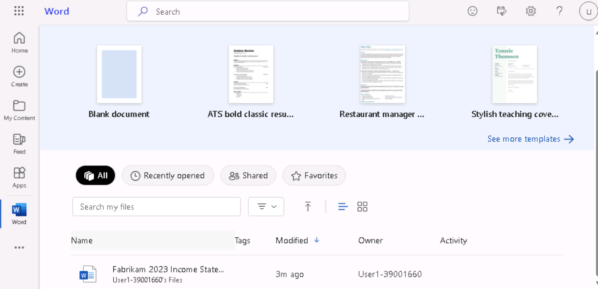

You will perform the following steps to have Copilot in Word create a
speech for you based on your company's Income Statement:

1.  Open a new browser tab in the lab VM. Right click the following link
    to copy and paste it in the browser window. [Fabrikam's 2023 Income
    Statement](https://edxinteractivepage.blob.core.windows.net/ms-4004/Fabrikam%202023%20Income%20Statement.docx)

    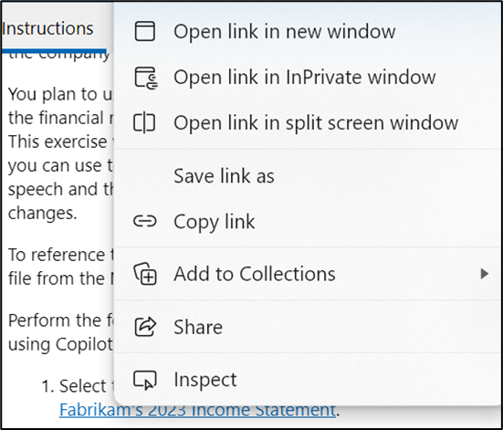

2.  Select “Download” to download the file to the Lab VM.

    **Important**: Please do not use **Save a copy to One Drive** option
    since you may encounter sign-in error.

    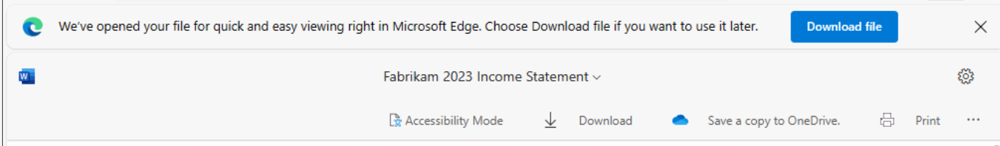

    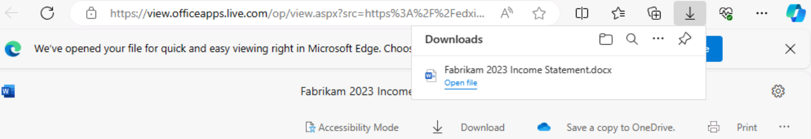

3.  If you have a Microsoft 365 tab open in your Edge browser, then
    select it now; otherwise, open a new tab and enter the following
    URL: <https://www.office.com>**.**

4.  On the Microsoft 365 navigation pane, select OneDrive to open it.

   
   
5.  Browse to the **Downloads** folder to select and upload a copy of
    Fabrikam's 2023 Income Statement document to OneDrive.

    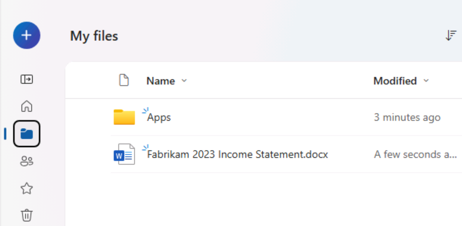

    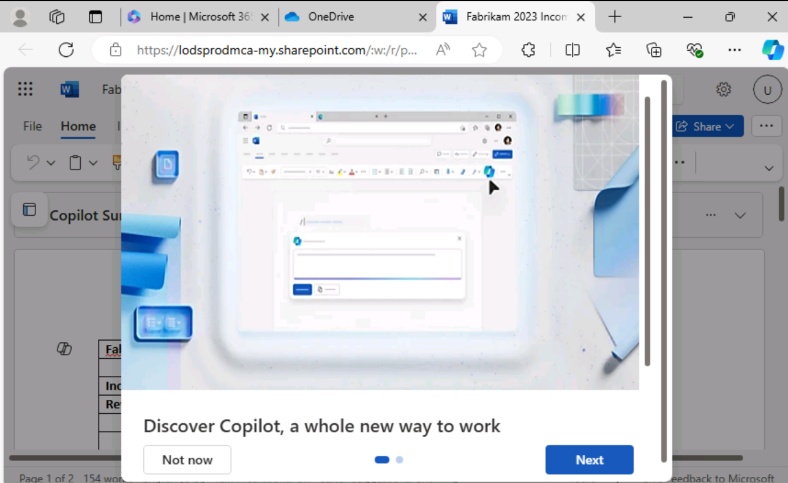

6.  In Microsoft 365, open Microsoft Word, and then open a new blank
    document.

    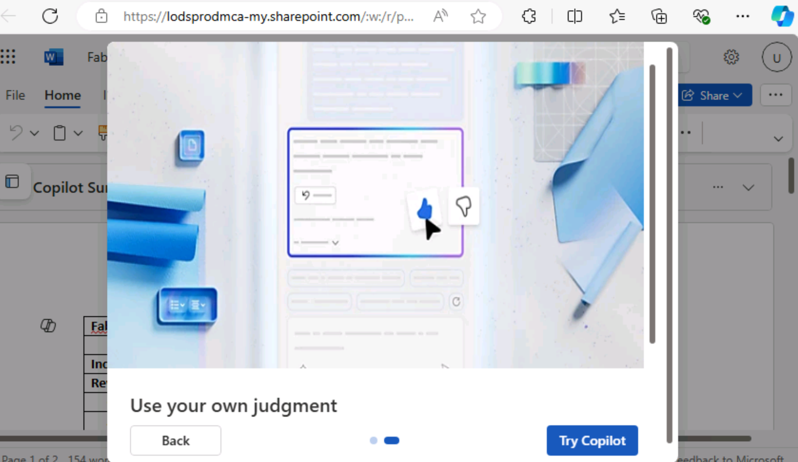
   
8.  In the **Draft with Copilot** window that appears at the top of the
    blank document, enter the following prompt:

    **Write a speech for the Fabrikam stakeholders that
    summarizes the results of the company's 2023 income statement found in
    the attached file**.

9.  In the **Draft with Copilot** window, select the **Reference your
    content** button. In the pop-up window that appears, select the
    file.

    If, for some reasons the file is not displayed, click **Browse files
    from cloud** in the pop-up window.
    
   

10. In the **Pick a file** window that appears, under
    the **Recent** file list, select the **Fabrikam 2023 Income
    Statement.docx** file and then select the **Attach** button.

    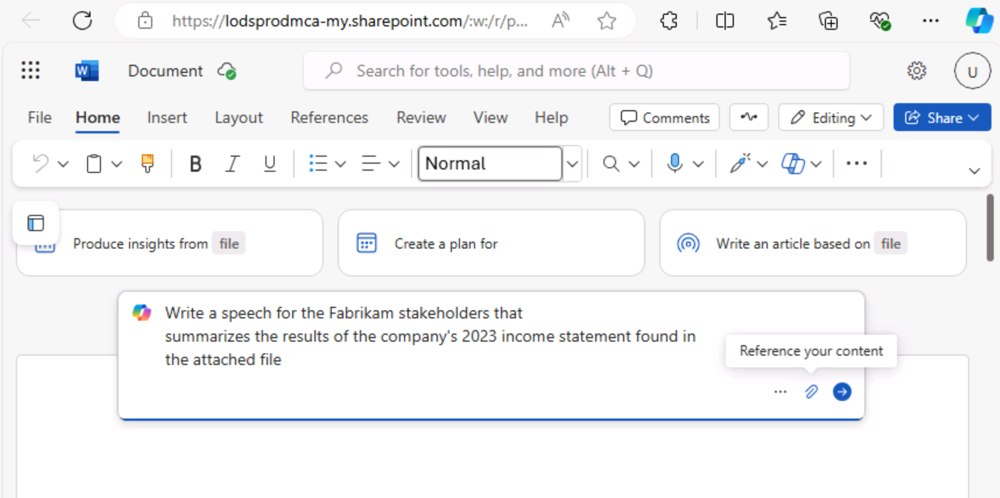

11. Note how the file is displayed in the prompt. Select **Generate**.

    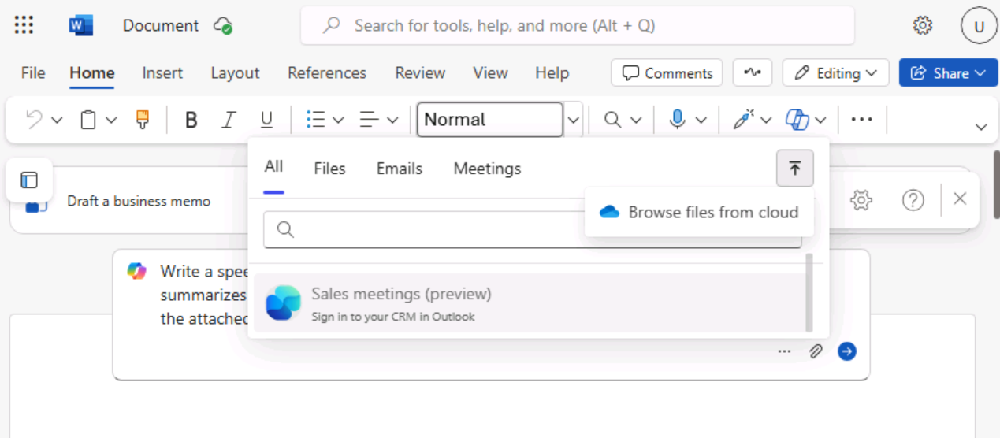

12. At this point, Copilot extracts the financial results from the
    Income Statement and drafts a speech.

    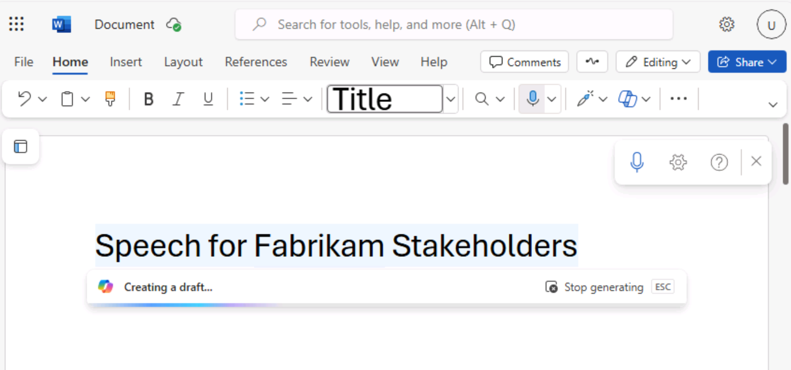

13. After reviewing the speech, you decide that it's a good starting
    point, although there are a few areas that you want to modify. In
    the Copilot window at the end of the speech, select the **Keep
    it** button.

14. You want to begin by reviewing any changes suggested by the Copilot
    Editor. Select the **Editor** icon that appears in the menu bar at
    the top of the page.

    **Note**: You will be able to see the **Editor**
    icon, in the Classic Ribbon and not in the Single line ribbon.

    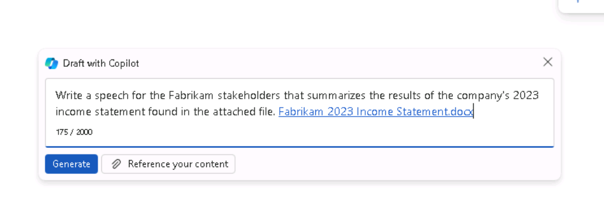

15. In the **Editor** pane that appears, note the categories that appear
    under the **Corrections** or **Refinements** sections that display a
    number (indicating the number of issues for that category). These
    issues are often linked to the tone of the writing style used in the
    document.

    Below the **Editor Score** is a field that allows you to select the
    tone used when writing the speech. It currently displays **Formal
    writing**, which is the default tone that Copilot used when writing
    this speech. When you don't indicate what writing style to use in your
    prompt, **Formal writing** is the default tone that Copilot uses.
    Select this field to see your options. You prefer a professional
    sounding tone, so select **Professional** from the drop-down menu.
    Note whether the **Editor Score** changes.

16. In the categories that appear under
    the **Corrections** or **Refinements** sections, you can review the
    changes that occurred in the categories based on changing the
    writing style from Formal to Professional. Select each category that
    displays a number (indicating the number of issues for that
    category). Doing so enables you to review the suggestions throughout
    the document for that category. For each suggestion, select either
    the suggested change or select **Ignore**. Repeat this process until
    all categories display a check mark.

    Change the writing style to **Casual** and check whether the **Editor
    Score** changes. If any categories display a number, review the
    category and see what the Editor has flagged. You want to keep the
    writing style as Professional, so select **Ignore** any suggested
    changes. Review all the suggested changes to see the differences that
    were flagged between Professional and Casual styles.

    

17. Save the file to your OneDrive account with the following file
    name: **Fabrikam 2023 Financial presentation.docx**. The next
    exercise uses this document.

    

    **Important**: Ensure that you save the file to your OneDrive rather
    than your local PC. In the next exercise, you use Copilot in
    PowerPoint to create a slide presentation based on this document. The
    document must be in OneDrive for Copilot to access it.

18. Close the tab containing this document in your Microsoft Edge
    browser.

# Exercise \#2: Create a slide presentation using Copilot in PowerPoint

In this exercise, you will use Copilot in PowerPoint to create a slide
presentation based on your speech (to the shareholders based on the
Income Statement) that you created using Copilot in Word to write your
speech.

In the prior exercise, you accessed the company's Income Statement in
Copilot by accessing the file from the Most Recently Used (MRU) file
list. In this exercise, you're going to gain experience accessing a file
using a different process. Instead of using the MRU list, you plan to
access the speech by copying the link to the **Fabrikam 2023 Financial
presentation.docx** file that you created in the prior exercise.

You will perform the following steps to have Copilot in PowerPoint
create a draft of your presentation:

1.  If you have a Microsoft 365 tab open in your Edge browser, then
    select it now; otherwise, open a new tab and enter the following
    URL: [**https://www.office.com**](https://www.office.com/)

2.  On the **Microsoft 365** navigation pane, select **Word** to open
    the Word file page.

3.  On the file page in **Word**, scroll down to the list of recent
    files and select **Fabrikam 2023 Financial presentation.docx** to
    open it in a new tab in your Microsoft Edge browser.

    

4.  Copy the URL of the document by selecting the **Share** button in
    the upper-right corner, above the ribbon and selecting **Copy
    Link** from the drop-down menu that appears.

    

    **Note**: You may occasionally come across trouble using the URL from
    your address bar. Copy the link from the Share tray for best results

5.  Close the **Link copied** dialog box that appears in Word.

    

6.  Close this document tab in your Microsoft Edge browser. This return
    you to the **Word \| Microsoft 365** tab.

7.  On the Word file page, select the **PowerPoint** icon in the
    navigation pane on the left.

    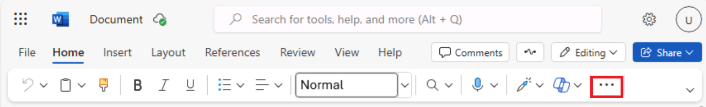

8.  In **PowerPoint**, open a new blank presentation.

9.  Select the **Copilot** option on the right side of the ribbon.

10. In the **Copilot** pane that appears, several predefined prompts are
    available for you to choose from.

11. Select the **Create presentation from file** prompt.

    **Note**: In the prior exercise, you linked a file into a prompt by
    selecting the file from the MRU list. In this exercise, you will gain
    experience linking a file into a prompt using another method.

12. Above the prompt field at the bottom of the **Copilot** pane,
    a **Suggestions** window appears that contains the three most
    recently used files. Normally, you would select your desired file if
    it appeared in this window. However, in this training exercise, even
    if the **Fabrikam 2023 Financial presentation.docx** appears in the
    MRU list, let's assume that it didn't. As such, you must paste the
    link to the file into the prompt field.

    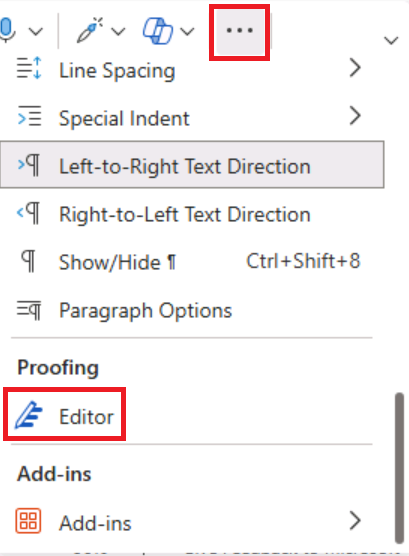

13. In the prompt field, Copilot automatically types in **Create
    presentation from file /**. Place your cursor after the forward
    slash and enter **Ctrl+V** to paste the link to this document into
    the prompt.

    

12. Select the **Send** icon.

13. This prompt triggers Copilot to create a slide presentation based on
    the document. In doing so, it displays the outline of the
    presentation and a list of features included in the presentation.
    These features may include speaker notes, images, layouts to
    organize slides, and a General sensitivity label.

    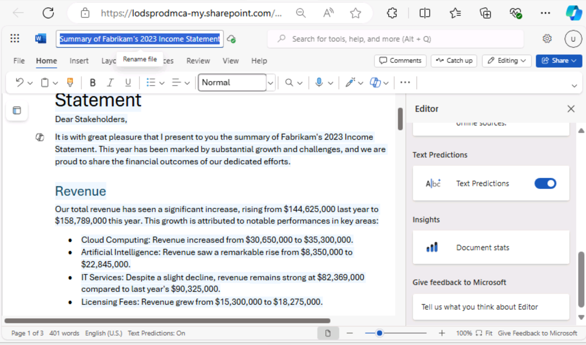

14. You're now free to review the slides and make any necessary updates.
    You can use the **Designer** tool to adjust the layouts.

    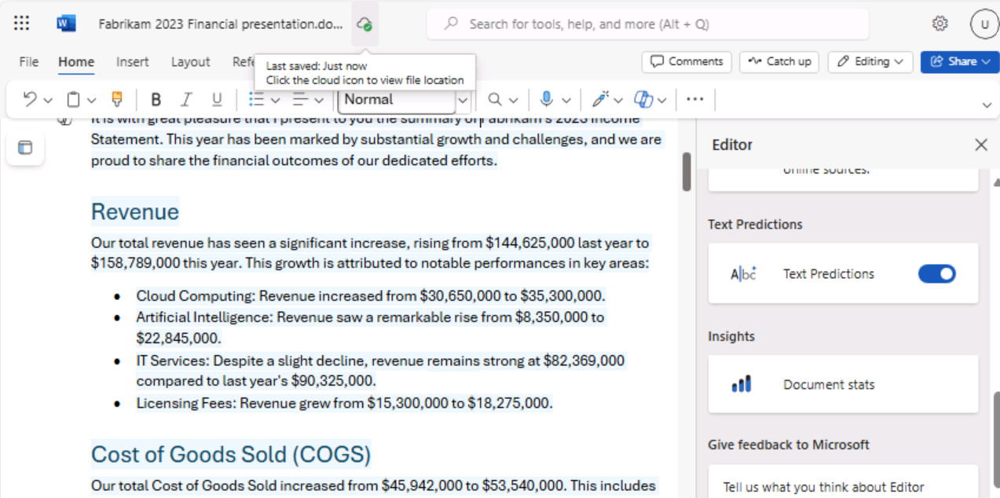

15. As you review the slides, be on the lookout for references to "the
    speaker" or any other items that you may need to change.
    

    Warning: Look out for the reference to "The speaker" along with the
    second sentence that begins with "The presentation will summarize...".
    that may be created by Copilot.

    **Example**: The speaker introduces a presentation on Fabrikam's 2023
    income statement highlights, reporting strong performance and growth
    despite challenges from the global pandemic and competitive market.
    The presentation will summarize the main results and explain how they
    align with the company's strategic vision and goals.

    You should remove these types of references as they're more applicable
    as speaker notes rather than text intended for audiences.

16. Review the speaker notes that Copilot added to the presentation.
    Verify they call out the points that you want to make during the
    presentation.

    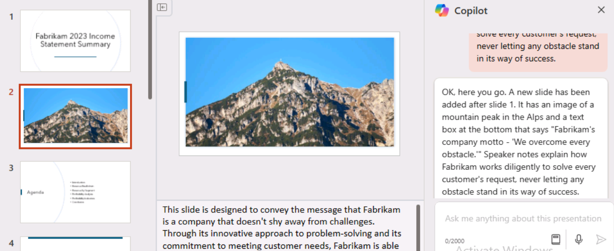

17. Try using Copilot to update the presentation. For example, enter the
    following prompt:

    **Add a new slide after slide 1. This slide should have an image of a
    mountain peak in the Alps. Towards the bottom of the slide, add a text
    box that says: Fabrikam's company motto - "We overcome every
    obstacle." Add speaker notes to this new slide that talk about how
    Fabrikam works diligently to solve every customer's request, never
    letting any obstacle stand in its way of success**.

    Review the new slide that was created. While the remaining lab
    exercises don't use this presentation, you can either discard it or
    save it if you want for future reference.
