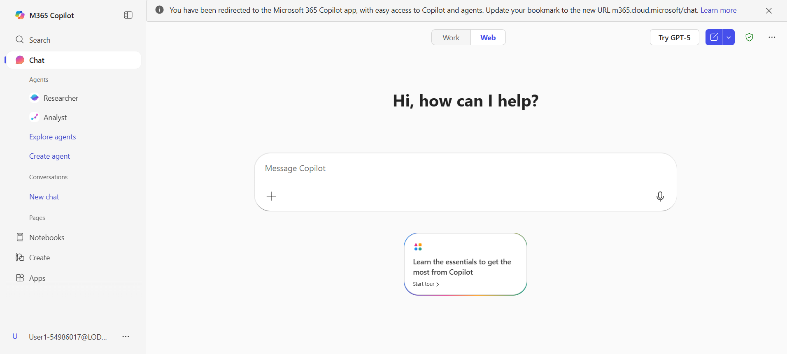

# Lab 01 - Drive event planning with Microsoft 365 Copilot Chat

**Objective:**

This lab introduces how Microsoft 365 Copilot Chat can support event
planning activities for Contoso Client Innovation Summit. As an event
planning consultant, you will use Copilot Chat in web mode to research
market trends, brainstorm session ideas, build an agenda, create
visuals, and develop a planning brief. The lab demonstrates how
AI-powered tools can streamline research, enhance creativity, and
simplify document collaboration for impactful event execution.

## Exercise 1: Research market trends for 2025\*\*

In this exercise you will ground the summit content relevant to 2025
innovation trends. You will use Microsoft 365 Copilot Chat in web mode.

1.  Open a Microsoft Edge browser and enter the following URL:
    +++https://m365.cloud.microsoft+++ to go to the **Microsoft 365 Copilot app** (formerly office) home page.

    > **Note**: You need to sign-in (if prompted) using
    the **Credentials** provided under the **Resources** tab on the right.

2.  **Copilot Chat** page will open.

    

3.  If, for some reason, “**Something went wrong”** message appears,
    click **Try again** (twice) to open Copilot Chat.

    

    > **Note**: Copilot Chat user interface may appear different when you
    are executing this lab (since Microsoft has rolled out new and updated
    features along with UI changes as part of Microsoft Build-2025 event).

4.  Enter the following prompt and click **Submit** arrow.

    +++What are the top three innovation trends in the consumer goods
    industry for 2025, and how can these shape the agenda for a client
    innovation summit?+++

    

5.  You will see the Copilot output with a short, insightful summary of
    three trends, e.g., “AI in Supply Chain,” “Sustainable Packaging,”
    and “Hyper-personalized Customer Experience.”

    

    

    You have now completed researching the 2025 market trends. Next you
    will turn these trends into a compelling event agenda that resonates
    with both the C-suite and client innovation teams.

## Exercise 2: Brainstorm and Draft Session Ideas

In this exercise you will create a compelling event agenda based on the
trends generated in the previous exercise.

1.  To start with you will be creating session titles and descriptions
    based on the trends. Use the following prompt and click **Submit**.

    +++Based on these trends, suggest 5 session titles and short,
    energizing descriptions for a 1-day innovation summit+++

    

2.  Copilot will generate the session titles and descriptions as shown
    below.

    

3.  You will now make the descriptions more engaging. Use the following
    prompt and click Submit.

    +++Make these descriptions more engaging using an energetic, professional
    tone.+++

    

    

    

    Next you will use Copilot Chat to create the agenda with timeline and
    logo .

## Exercise 3: Create Agenda Timeline & Logo

In this exercise you will enrich the agenda adding event day with time
slots and create a simple visual identity for the summit handouts.

1.  To start with you will create a timed agenda. Use the following
    prompt and click Submit.

    +++Create a 1-day event agenda with sessions at 9:00 AM, 11:00 AM, 1:30
    PM, and 3:00 PM. Include a welcome, lunch at noon, and breaks.+++

    

2.  You will get a professionally structured 1-day innovation summit
    agenda as shown below.

    

    

3.  Now you will add a relevant logo. Use the following prompt and click
    Submit.

    +++Design a modern logo concept for the Contoso Client Innovation Summit
    2025.+++

    

4.  Copilot will start generating the logo with Microsoft Designer.

    

    

    You can also try creating a variation of the generated logo.

    Next you will compile a planning brief combining the outcomes from all
    the previous exercises.

## Exercise 4: Draft Planning Document

In this exercise you will combine all the outputs generated from the
previous exercises.

1.  You will now start compiling a 1-page planning brief combining the
    outputs generated from the previous exercises. Use the following
    prompt and click Submit.

    +++Create a PDF 1-page planning brief for the Contoso Client Innovation
    Summit including: objectives, audience, session themes, and planning
    milestones.+++

    

2.  You can now download by clicking on the file and view the compiled
    output.

    

    

3.  Next you will add success metrics and expected outcomes to the draft
    planning brief document. Use the following prompt and click Submit.

    +++Add success metrics and expected outcomes.+++

    

4.  Once the updated planning brief is generated, you can download and
    view the updated document.

    

    

    

5.  You now have the professional planning document ready for review.
    You will use this as a reference document in the next exercise.

## Exercise 5: Upload and Improve the Plan

Before presenting the plan to leadership, you want to provide additional
recommendations based on the draft.

1.  You will now upload the planning brief document to OneDrive so as to
    use it as a reference document.

2.  Click the folder icon to check if the Planning brief document is in
    the **Downloads** folder.

    

3.  Navigate to Apps and open **OneDrive** from the Microsoft 365
    Copilot navigation pane.

    

4.  Select **My files** menu and click **Create or Upload** button.

    

5.  Select **Files upload** menu and locate the latest Planning brief
    document and upload it to OneDrive.

    

    

6.  You have now uploaded the latest Planning brief document to
    OneDrive.

    

7.  You will now analyse the planning brief document using Copilot. Use
    the following prompt, attach the reference document (from OneDrive)
    and click Submit.

    +++Analyze this planning brief and suggest improvements or missing elements that could make the event more impactful.+++

    

    

    

    

8.  You will now see the actionable recommendations (e.g., add keynote
    speaker details, customer testimonial opportunities, or
    sustainability efforts) generated by Copilot.

    

9.  You will ask Copilot to update the planning brief document with the
    actionable recommendations.

    

    

10. Once Copilot finishes updating the planning brief document with the
    actionable recommendations, you can download and view the enhanced
    planning brief document.

    

    

    

**Try Yourself:**

Play around with pre-built prompts and the suggested prompts

- Can you provide a summary of the key changes made?

- What are some potential sponsors for this event?

- Would you like a branded version with your logo and visual design
  next?

    

    

## Conclusion

By completing this lab, you experienced how Microsoft 365 Copilot Chat
can transform event planning into a more efficient, collaborative, and
insightful process. You explored market trends, designed session
content, built a branded agenda, and refined a professional planning
brief with AI-driven recommendations. This hands-on practice highlights
the value of Copilot in delivering high-quality, well-structured
outcomes that align with strategic business goals.
