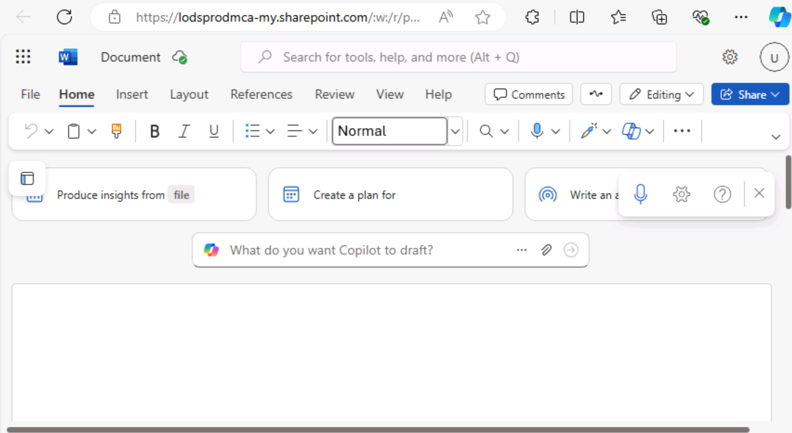
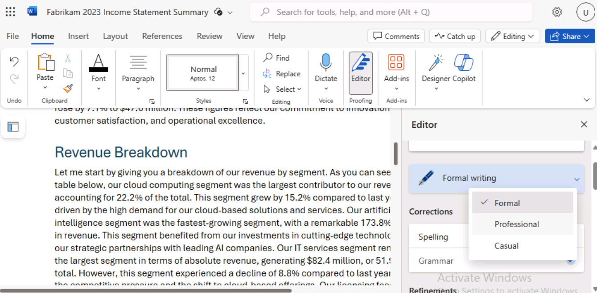

**實驗室 01：增強您的員工能力 – Copilot - 高管**

在本實驗中，您將

- 在 Word 中使用 Copilot 創建您計劃向公司股東發表的演講。

- 在 PowerPoint 中使用 Copilot 根據您創建的語音創建 PowerPoint
  演示文稿。

**練習 #1：在 Word 中使用 Copilot 創建語音**

在本練習中，您將指示 Word 中的 Copilot
根據公司的損益表為您編寫語音，該損益表存儲為 Word
文檔。本練習將引導您完成一系列提示，您可以使用這些提示讓 Word 中的
Copilot 生成您的語音，然後根據您建議的更改對其進行更新。

**注意：**當您需要將文件（例如您公司的損益表）引用到 Copilot
提示符中時，該文件必須保存在 OneDrive 帳戶中。您無法鏈接到 PC
上本地存儲的文件。

您可以使用以下方法之一將文件引用/鏈接到 Copilot 提示符中：

- 從 Most Recently Used （MRU） 文件列表中選擇文件。

- 打開文件並使用 **Share** 選項複製其路徑，然後將路徑粘貼到正斜杠 （/）
  後面的提示符中。

- 從文件資源管理器中複製文件的路徑，並將其粘貼到正斜杠 （/）
  後面的提示符中。

在本練習中，您將從 MRU 文件列表中選擇公司的 Income Statement。

您將執行以下步驟，讓 Word 中的 Copilot 根據您公司的損益表為您創建語音：

1.  如果您在 Edge 瀏覽器中打開了 Microsoft 365
    選項卡，請立即選擇它;否則，請打開一個新選項卡並輸入以下 URL：
    +++[https://www.office.com+++](https://www.office.com+++/) 以轉到
    **Microsoft 365** 主頁。

**注意：**您需要使用右側 “**Resources**” 選項卡下提供的 **Microsoft 365
憑據**登錄（如果出現提示）。

登錄後，如果您碰巧看到 **Microsoft 365**
主頁的朦朧網頁，請單擊瀏覽器菜單欄中的 **Refresh**
 

單擊左上角的 **App launcher** （**糖果盒菜單**圖標 - 3 x 3
點矩陣）以展開應用程序菜單並選擇
**OneDrive**。 

單擊箭頭以繼續。 

2.  在導航窗格中，選擇 **+** 圖標，然後選擇 **Files upload** 將其打開。

3.  瀏覽到 **C：\LabFiles** 文件夾，選擇 **Fabrikam 2023
    損益表**文檔的副本並將其上傳到 **OneDrive**。

**注意：**如果已按照**準備實驗室執行 （實驗室 0）**
中的建議將所有實驗室資產上傳到 OneDrive，則可以跳過此步驟。

4.  打開並關閉文件 **Fabrikam 2023 損益表**文檔（已上傳到
    OneDrive），以將其放入最近使用的 （MRU）
    文件列表中。 
    

**注意：**當您打開 **Fabrikam 2023
損益表**文檔時，您將看到一個彈出窗口，如屏幕截圖所示。單擊 **Next**
，然後選擇 **Try
Copilot。** 

關閉包含 **Fabrikam 2023 Income Statement** 文檔的瀏覽器。

5.  在 Microsoft 365 中，打開 **Microsoft
    Word**，然後打開一個新的空白文檔。

6.  在空白文檔頂部顯示的 **Draft with Copilot** （使用 Copilot 起草）
    窗口中，輸入以下提示：

+++Write a speech for the Fabrikam stakeholders that summarizes the
results of the company's 2023 income statement found in the attached
file.+++

7.  在 **Draft with Copilot** 口中，選擇**Reference your content**
    按鈕。在出現的彈出窗口中，選擇文件。 
    

如果由於某些原因文件未顯示，請在彈出窗口中單擊 **Browse files from
cloud**。

8.  在出現的 **Pick a file** 窗口中的 **Recent** 使用的文件 列表下，選擇
    **Fabrikam 2023 Income Statement.docx**文件，然後選擇 **Attach**
    按鈕。 
    

9.  請注意文件在提示符中的顯示方式。選擇 **Generate**
    （生成）。 
    

**注：** 如果由於某些原因，您在附加引用文檔後單擊 **Generate**
按鈕時不斷收到 **Something went wrong**
錯誤，請忽略該錯誤並繼續下一步。 

在瀏覽器中打開文件，並使用 Share 選項複製其路徑，然後將路徑粘貼到正斜杠
（/） 後面的提示符中。

**重要說明：**即使在嘗試使用備用選項後，如果您看到相同的“出現問題”異常，請嘗試使用
Word 的桌面版本，而不是使用 Word 的 Web 客戶端。

如果它在使用 Word 桌面版本時有效，請在即將到來的實驗中單擊
“**Generate**” 按鈕時看到 “出錯” 異常。

10. 此時，Copilot 從損益表中提取財務結果並起草演講稿。

11. 在查看語音後，您認為這是一個很好的起點，儘管您想要修改一些區域。在語音結束時的
    Copilot 窗口中，選擇 **Keep it** （保留） 按鈕。

12. 首先，您需要查看 Copilot Editor
    建議的任何更改。選擇頁面頂部菜單欄中顯示的 **Editor**
    圖標。 
    

**注意：**您將能夠在 **Microsoft Word** 的經典功能區中看到 **Editor**
圖標。在 Single line （單線） 功能區中，它在默認瀏覽器縮放級別 100%
中不可見。選擇 **ellipsis** 號（3 個水平點）圖標，然後向下滾動以選擇
**Editor**。

13. 在出現的 **Editor** 窗格中，請注意 **Corrections** 或
    **Refinements**
    部分下顯示的類別，這些類別顯示一個數字（表示該類別的期刊數量）。這些問題通常與文檔中使用的寫作風格的語氣有關。

**Editor Score**
下方是一個字段，允許您選擇編寫語音時使用的語氣。它當前顯示 **Formal
writing**，這是 Copilot
在編寫此語音時使用的默認語氣。如果您未指明要在提示中使用哪種書寫樣式，則
**Formal writing** 是 Copilot
使用的默認語氣。選擇此字段可查看您的選項。您更喜歡專業的音調，因此請從下拉菜單中選擇
**Professional**。注意 **Editor Score** 是否發生變化。

14. 在 **Corrections** （更正） 或 **Refinements** （優化）
    部分下顯示的類別中，您可以根據將寫作風格從 Formal （正式） 更改為
    Professional （專業）
    來查看類別中發生的更改。選擇顯示數字（表示該類別的期刊數）的每個類別。這樣，您就可以查看整個文檔中針對該類別的建議。對於每個建議，請選擇建議的更改或選擇
    **Ignore** （忽略）。重複此過程，直到所有類別都顯示複選標記。

將 Casual 修改為 **Casual** 並檢查 **Editor Score**
是否有變化。如果任何類別顯示數字，請查看該類別並查看 Editor
標記的內容。您希望將寫作風格保持為 Professional（專業），因此請選擇
**Ignore** any suggested
changes（忽略任何建議的更改）。查看所有建議的更改，以查看 Professional
和 Casual 樣式之間標記的差異。

15. 該文件將保存在您的 OneDrive 帳戶中。在 Word
    文檔的左上角，單擊文件名以突出顯示它，然後將文件重命名為 +++Fabrikam
    2023 Financial presentation.docx+++。下一個練習將使用此文檔。

**重要說明：**在下一個練習中，您將使用 PowerPoint 中的 Copilot
基於此文檔創建幻燈片演示文稿。該文檔必須位於 OneDrive 中，Copilot
才能訪問它。

16. 在 Microsoft Edge 瀏覽器中關閉包含此文檔的選項卡。

**練習 \#2：在 PowerPoint 中使用 Copilot 創建幻燈片演示文稿**

在本練習中，您將使用 PowerPoint 中的 Copilot 根據您在 Word 中使用
Copilot
創建的演講（根據損益表對股東）創建幻燈片演示文稿，以編寫您的演講。

在前面的練習中，您通過從 Most Recently Used （MRU）
文件列表中訪問文件，在 Copilot
中訪問了公司的損益表。在本練習中，您將獲得使用其他進程訪問文件的經驗。您計劃通過複製您在上一個練習中創建的
**Fabrikam 2023 Financial
presentation.docx**文件的鏈接來訪問語音，而不是使用 MRU 列表。

您將執行以下步驟，讓 PowerPoint 中的 Copilot 創建演示文稿的草稿：

1.  如果您在 Edge 瀏覽器中打開了 Microsoft 365
    選項卡，請立即選擇它;否則，請打開一個新選項卡並輸入以下
    URL： +++[https://www.office.com+++](https://www.office.com+++/) 以轉到
    **Microsoft 365** 主頁。

**注意：**您需要使用右側 “**Resources**” 選項卡下提供的 **Microsoft 365
憑據**登錄（如果出現提示）。

2.  在 **Microsoft 365** 導航窗格中，選擇 **Word** 以打開 Word。

3.  在 **Word** 的文件頁面上，向下滾動到最近使用的文件列表，然後選擇
    **Fabrikam 2023 Financial presentation.docx** 在 Microsoft Edge
    瀏覽器的新選項卡中打開它。

4.  通過選擇功能區上方右上角的 **Share**
    按鈕，然後從顯示的下拉菜單中選擇 **Copy Link** 來複製文檔的 URL。

**注意：**使用地址欄中的 URL
時，您有時可能會遇到問題。從共享託盤複製鏈接以獲得最佳效果

5.  關閉 Word 中顯示的 **Link copied** （鏈接已複製） 對話框。

6.  在 Microsoft Edge 瀏覽器中關閉此文檔選項卡。這讓你回到了 **Word
    \|Microsoft 365** 選項卡。

7.  在 Word 文件頁面上，選擇左上角的 **App Launcher** 窗格中的
    **PowerPoint** 圖標。

8.  在 **PowerPoint** 中，打開一個新的空白演示文稿。

9.  選擇 **Copilot** 圖標（以紅色突出顯示，如屏幕截圖所示）。

10. 在顯示的 **Copilot** 窗格中，有幾個預定義的提示可供您選擇。

11. 選擇 **Create presentation from file** 提示。

**注：** 在上一個練習中，您通過從 MRU
列表中選擇文件，將文件鏈接到提示中。在本練習中，您將獲得使用其他方法將文件鏈接到提示的經驗**。** 

12. 在 **Copilot** 窗格底部的提示字段上方，將顯示一個 **建議**
    窗口，其中包含最近使用的三個文件。通常，如果它出現在此窗口中，您會選擇所需的文件。但是，在此培訓練習中，即使
    **Fabrikam 2023 Financial presentation.docx**出現在 MRU
    列表中，我們也假設它沒有。因此，您必須將文件的鏈接粘貼到提示字段中。

13. 在提示字段中，Copilot 會自動鍵入 **Create presentation from file
    /**。將光標放在正斜杠後面，然後按 **Ctrl+V**
    將指向此文檔的鏈接粘貼到提示符中。

14. 選擇 **Send** 圖標。

15. 此提示會觸發 Copilot
    根據文檔創建幻燈片演示文稿。在此過程中，它會顯示演示文稿的大綱和演示文稿中包含的功能列表。這些功能可能包括演講者備註、圖像、用於組織幻燈片的佈局以及常規敏感度標簽。

16. 您現在可以自由地查看幻燈片並進行任何必要的更新。您可以使用
    **Designer** 工具調整佈局。

17. 在查看幻燈片時，請留意對 “the speaker”
    的引用或您可能需要更改的任何其他項目。

警告：請留意對 “The speaker” 的引用以及以 “The presentation will
summarize...” 開頭的第二句。可能由 Copilot 創建。

**示例：**演講者介紹了 Fabrikam 的 2023
年損益表亮點，報告稱，儘管面臨全球疫情和競爭市場的挑戰，但仍實現了強勁的業績和增長。該演示文稿將總結主要結果，並解釋它們如何與公司的戰略願景和目標保持一致。

您應該刪除這些類型的引用，因為它們更適合作為演講者注釋，而不是面向受眾的文本。

18. 查看 Copilot
    添加到演示文稿中的演講者備註。驗證他們指出了您希望在演示過程中提出的觀點。

19. 嘗試使用 Copilot 更新演示文稿。例如，輸入以下提示：

+++Add a new slide after slide 1. This slide should have an image of a
mountain peak in the Alps. Towards the bottom of the slide, add a text
box that says: Fabrikam's company motto - "We overcome every obstacle."
Add speaker notes to this new slide that talk about how Fabrikam works
diligently to solve every customer's request, never letting any obstacle
stand in its way of success.+++

查看已創建的新幻燈片。雖然其餘的實驗練習不使用此演示文稿，但如果需要，您可以丟棄它或保存它以備將來參考。

**總結**

在本實驗中，您擁有

- 利用 Microsoft Copilot 在 Word
  中的功能起草一份全面的演講，其中包括生成可有效傳達關鍵信息和公司更新的內容。

- 利用 PowerPoint 中的 Microsoft Copilot 將 Word
  中創建的語音轉換為視覺上引人入勝且信息豐富的演示文稿，創建突出演講要點的幻燈片，使用
  Copilot 確保演示文稿格式的一致性和清晰度。
