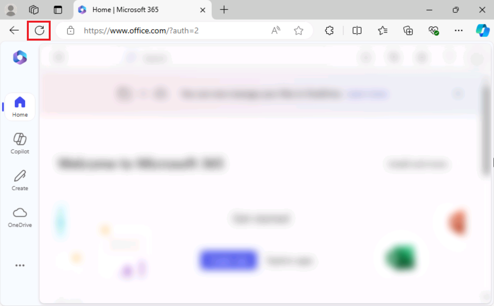
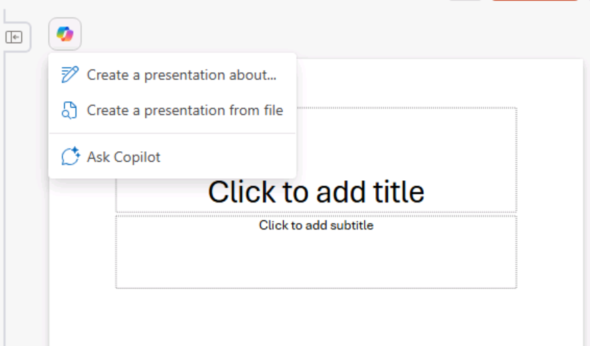
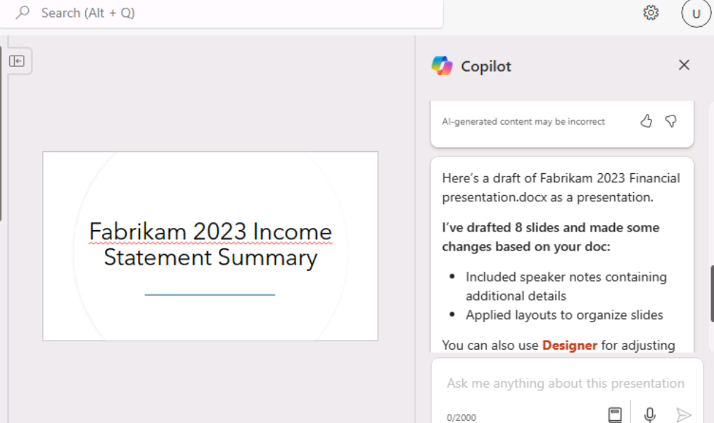

**ラボ 01: 従業員のエンパワーメント - Copilot - エグゼクティブ**

このラボでは、

- Copilot in Word を使用して、会社の株主に発表するスピーチを作成します。

- Copilot in PowerPoint を使用して、作成したスピーチに基づいた
  PowerPoint プレゼンテーションを作成します。

**エクササイズ#1: Copilot in Wordを使ってスピーチを作成する**

この演習では、Word
文書として保存されている会社の損益計算書に基づいて、Word の Copilot
にスピーチを作成させます。この演習では、Word の Copilot
にスピーチを生成させ、提案された変更に基づいてスピーチを更新させるための一連のプロンプトを順に説明します。

注: Copilot
プロンプトでファイル（会社の損益計算書など）を参照する必要がある場合、そのファイルは
OneDrive アカウントに保存されている必要があります。PC
にローカルに保存されているファイルにリンクすることはできません。

次のいずれかの方法を使用して、Copilot
プロンプトにファイルを参照/リンクできます。

- Most Recently Used（MRU）リストからファイルを選択します。

- ファイルを開き、「共有」オプションを使用してパスをコピーし、プロンプトのスラッシュ（/）に続けて貼り付けます。

- ファイルエクスプローラーからファイルのパスをコピーし、プロンプトのスラッシュ（/）に続けて貼り付けます。

この演習では、MRU ファイル リストから会社の損益計算書を選択します。

会社の損益計算書に基づいて、Word の Copilot
を使用してスピーチを作成するには、次の手順を実行します。

1.  Edge ブラウザーで Microsoft 365
    タブを開いている場合は、それを選択します。開いていない場合は、新しいタブを開き、次の
    URL を入力します: +++https://www.office.com+++ して、Microsoft 365
    ホームページに移動します。

注: 右側の「リソース」タブに表示される Microsoft 365
の資格情報を使用してサインインする必要があります（要求された場合）。

サインイン後、Microsoft 365 ホームページの Web
ページがぼやけている場合は、ブラウザーのメニューバーで \[更新\]
をクリックしてください。 

左上にあるApp launcher (キャンディー ボックス メニュー アイコン - 3 x 3
のドット マトリックス) をクリックしてアプリ メニューを展開し、OneDrive
を選択します。 

続行するには矢印をクリックしてください。

2.  ナビゲーション ペインで + iconを選択し、\[Files upload\]
    を選択して開きます。

3.  C:\Lab Files フォルダーを参照して、Fabrikam 2023
    損益計算書ドキュメントのコピーを選択し、OneDrive
    にアップロードします。

注:「ラボ実行の準備 (ラボ 0)」で提案されているように、すべてのラボ
アセットを OneDrive
に既にアップロードしている場合は、この手順をスキップできます。

4.  OneDriveにアップロードしたFabrikam 2023 Income
    Statement文書を開いて閉じ、最近使用したファイル（MRU）に追加します。 
    

注：Fabrikam
2023年度損益計算書を開くと、スクリーンショットのようなポップアップが表示されます。「Next」をクリックし、「Try
Copilot」を選択してください。 

Fabrikam 2023 損益計算書ドキュメントを表示したブラウザを閉じます。

5.  Microsoft 365 で Microsoft Word
    を開き、新しい空白のドキュメントを開きます。

6.  空白のドキュメントの上部に表示される \[Draft with Copilot\]
    ウィンドウで、次のプロンプトを入力します。

+++添付ファイルにある同社の 2023
年度損益計算書の結果を要約した、Fabrikam
の利害関係者向けのスピーチを作成してください。+++

7.  「Draft with Copilot」ウィンドウで、「Reference your
    content」ボタンを選択します。表示されるポップアップウィンドウで、ファイルを選択します。 
    

何らかの理由でファイルが表示されない場合は、ポップアップ ウィンドウで
\[Browse files from cloud\] をクリックします。

8.  表示される \[Pick a file\] ウィンドウの \[Recent file\]
    リストで、Fabrikam 2023 Income Statement.docx
    ファイルを選択し、\[Attach\]
    ボタンを選択します。 
    

9.  プロンプトにファイルがどのように表示されるかを確認します。「Generate」を選択します。 

注意:
何らかの理由で、参照文書を添付した後に生成ボタンをクリックしたときに「Something
went
wrong」というエラーが引き続き発生する場合は、エラーを無視して次の手順に進みます。 

ブラウザでファイルを開き、\[Share\]
オプションを使用してパスをコピーし、スラッシュ (/)
に続くプロンプトにパスを貼り付けます。

重要: 代替オプションを試した後でも同じ「something went
wrong」という例外が表示される場合は、Word の Web
クライアントではなく、デスクトップ版の Word を使用してみてください。

デスクトップ版の Word
で問題が解決した場合は、今後のラボで「Generate」ボタンをクリックしたときに「something
went wrong」という例外が表示された場合にも同じ手順に従ってください。

10. この時点で、Copilot
    は損益計算書から財務結果を抽出し、スピーチの下書きを作成します。

11. スピーチをレビューした後、いくつか修正したい箇所はあるものの、良い出発点だと判断しました。スピーチの最後に表示されるコパイロットウィンドウで、「Keep
    it」ボタンを選択します。

12. まず、コパイロットエディターが提案する変更点を確認します。ページ上部のメニューバーに表示されるエディターアイコンを選択します。 

注: Microsoft
Wordのクラシックリボンにはエディターアイコンが表示されます。シングルラインリボンでは、ブラウザのデフォルトのズームレベル（100%）では表示されません。省略記号（横に3つの点）アイコンを選択し、下にスクロールしてエディターを選択してください。

13. 表示されるエディターパネルで、「Corrections」または「Refinements」セクションの下に表示されるカテゴリに注目してください。数字は、そのカテゴリに該当する問題点の数を示しています。これらの問題点は、多くの場合、文書で使用されている文体のトーンに関連しています。

エディタースコアの下には、スピーチ作成時のトーンを選択できるフィールドがあります。現在「Formal
writing」と表示されていますが、これはCopilotがこのスピーチ作成時に使用したデフォルトのトーンです。プロンプトで使用するライティングスタイルを指定しない場合は、「Formal
writing」がCopilotのデフォルトのトーンになります。このフィールドを選択すると、オプションが表示されます。プロフェッショナルなトーンが好みなので、ドロップダウンメニューから「Professional」を選択してください。エディタースコアが変化するかどうかを確認してください。

14. 「Corrections」または「Refinements」セクションの下に表示されるカテゴリでは、文体を「Formal」から「Professional」に変更したことで、各カテゴリで発生した変更を確認できます。数字（そのカテゴリの問題数を示します）が表示されているカテゴリを選択してください。これにより、そのカテゴリの文書全体における提案を確認できます。提案ごとに、提案された変更を選択するか、「Ignore」を選択します。すべてのカテゴリにチェックマークが表示されるまで、このプロセスを繰り返します。

ライティングスタイルを「Casual」に変更し、エディタースコアが変化するかどうかを確認します。いずれかのカテゴリに数字が表示されている場合は、そのカテゴリを確認し、エディターがどのようなフラグを付けたかを確認します。ライティングスタイルは「Professional」のままにしておきたいので、「Ignore
any suggested
changes」を選択します。提案された変更をすべて確認し、プロフェッショナルスタイルとカジュアルスタイルの間でフラグが付けられた違いを確認します。

15. ファイルはOneDriveアカウントに保存されます。Word文書の左上にあるファイル名をクリックしてハイライト表示し、ファイル名を「+++Fabrikam
    2023 Financial
    presentation.docx+++」に変更します。次の演習ではこのドキュメントを使用します。

重要：次の演習では、PowerPointでCopilotを使用して、このドキュメントに基づいたスライドプレゼンテーションを作成します。Copilotがアクセスするには、ドキュメントがOneDriveに保存されている必要があります。

16. Microsoft Edge ブラウザでこのドキュメントを含むタブを閉じます。

**エクササイズ#2: Copilot in PowerPoint を使用してスライド
プレゼンテーションを作成する**

この演習では、Word の Copilot
を使用して作成したスピーチ（損益計算書に基づく株主向けスピーチ）に基づいて、PowerPoint
の Copilot を使用してスライド プレゼンテーションを作成します。

前の演習では、最近使用したファイル (MRU)
リストからファイルにアクセスして、Copilot
で会社の損益計算書にアクセスしました。この演習では、別のプロセスを使用してファイルにアクセスする方法を学習します。MRU
リストを使用する代わりに、前の演習で作成した Fabrikam 2023 Financial
presentation.docx
ファイルへのリンクをコピーして、スピーチにアクセスします。

PowerPoint の Copilot
を使用してプレゼンテーションの下書きを作成するには、次の手順を実行します。

1.  Edge ブラウザーで Microsoft 365
    タブを開いている場合は、それを選択します。開いていない場合は、新しいタブを開き、次の
    URL を入力します: +++https://www.office.com+++ と入力して、Microsoft
    365 ホームページに移動します。

注: 右側の \[リソース\] タブに表示される Microsoft 365
資格情報を使用してサインインする必要があります (要求された場合)。

2.  Microsoft 365 のナビゲーション ウィンドウで、\[Word\] を選択して
    Word を開きます。

3.  Word のファイル
    ページで、最近使用したファイルの一覧まで下にスクロールし、\[Fabrikam
    2023 Financial presentation.docx\] を選択して、Microsoft Edge
    ブラウザーの新しいタブで開きます。

4.  リボンの上にある右上隅の \[Share\]
    ボタンを選択し、表示されるドロップダウン メニューから \[Copy link\]
    を選択して、ドキュメントの URL をコピーします。

注:
アドレスバーからURLを入力すると、問題が発生する場合があります。共有トレイからリンクをコピーすると、よりスムーズに操作できます。

5.  Word に表示される「Link copied」ダイアログ ボックスを閉じます。

6.  Microsoft Edge ブラウザでこのドキュメントタブを閉じます。Word \|
    Microsoft 365 タブに戻ります。

7.  Word ファイルページで、左上のアプリランチャーペインから PowerPoint
    アイコンを選択します。

8.  PowerPoint で、新しい空白のプレゼンテーションを開きます。

9.  Copilot アイコン (スクリーンショットに示すように赤くハイライト表示)
    を選択します。

10. 表示される Copilot
    ペインでは、いくつかの定義済みプロンプトから選択できます。

11. 「Create presentation from file」プロンプトを選択します。

注:
前の演習では、MRUリストからファイルを選択してプロンプトにファイルをリンクしました。この演習では、別の方法でプロンプトにファイルをリンクする手順を学習します。 

12. Copilot
    ペイン下部のプロンプトフィールドの上に、最近使用したファイル3件を含む候補ウィンドウが表示されます。通常、このウィンドウに目的のファイルが表示されている場合は選択します。ただし、このトレーニング演習では、Fabrikam
    2023 Financial presentation.docx
    がMRUリストに表示されていても、表示されないものと仮定します。そのため、ファイルへのリンクをプロンプトフィールドに貼り付ける必要があります。

13. プロンプトフィールドには、Copilot が自動的に「Create presentation
    from file /」と入力します。スラッシュの後にカーソルを置き、Ctrl+V
    を押すと、このドキュメントへのリンクがプロンプトに貼り付けられます。

14. Sendアイコンを選択します。

15. このプロンプトにより、Copilot
    はドキュメントに基づいてスライドプレゼンテーションを作成します。その際、プレゼンテーションの概要と、プレゼンテーションに含まれる機能のリストが表示されます。これらの機能には、発表者メモ、画像、スライドを整理するためのレイアウト、および「一般」機密ラベルなどが含まれます。

16. これでスライドを確認し、必要に応じて更新できます。デザイナーツールを使用してレイアウトを調整できます。

17. スライドを確認する際は、「the
    speaker」への言及や、変更が必要な可能性のあるその他の項目に注意してください。

注意：Copilot
によって作成された可能性のある「講演者」への言及と、「プレゼンテーションでは…を要約します」で始まる2番目の文にご注意ください。

例：講演者は、Fabrikam
の2023年度損益計算書のハイライトに関するプレゼンテーションを紹介し、世界的なパンデミックと競争の激しい市場環境による課題にもかかわらず、堅調な業績と成長を報告します。プレゼンテーションでは、主要な業績を要約し、それらが会社の戦略的ビジョンと目標とどのように一致しているかを説明します。

このような言及は、聴衆向けのテキストというよりも、講演者メモとしての方が適切であるため、削除する必要があります。

18. Copilot
    がプレゼンテーションに追加したスピーカーノートを確認します。プレゼンテーション中に強調したいポイントが明確に示されていることを確認します。

19. Copilotを使ってプレゼンテーションを更新してみましょう。例えば、次のプロンプトを入力します。

+++スライド1の後に新しいスライドを追加します。このスライドには、アルプスの山頂の画像を配置します。スライドの下部に、「Fabrikamの企業モットー -
私たちはあらゆる障害を乗り越えます」というテキストボックスを追加します。この新しいスライドに、Fabrikamがあらゆる顧客の要望に真摯に取り組み、成功への道を阻むいかなる障害にも屈しないことを説明するスピーカーノートを追加します。+++

作成された新しいスライドを確認してください。残りのラボ演習ではこのプレゼンテーションは使用しませんが、必要に応じて破棄するか、後で参照できるように保存しておくことができます。

まとめ

このラボでは、

- Word で Microsoft Copilot
  の機能を活用し、主要なメッセージや会社の最新情報を効果的に伝えるコンテンツの作成を含む包括的なスピーチを作成しました。

- PowerPoint で Microsoft Copilot を活用し、Word
  で作成したスピーチを視覚的に魅力的で情報豊富なプレゼンテーションに変換しました。スピーチの要点を強調するスライドを作成し、Copilot
  を使用することでプレゼンテーション形式の一貫性と明瞭性を確保しました。
