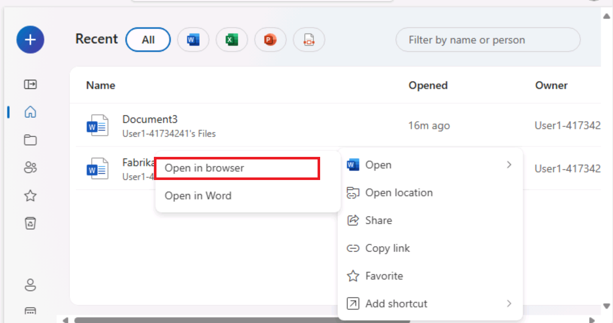

**实验室 01：增强您的员工能力 – Copilot - 高管**

在本实验中，您将

- 在 Word 中使用 Copilot 创建您计划向公司股东发表的演讲。

- 在 PowerPoint 中使用 Copilot 根据您创建的语音创建 PowerPoint
  演示文稿。

**练习 \#1：在 Word 中使用 Copilot 创建语音**

在本练习中，您将指示 Word 中的 Copilot
根据公司的损益表为您编写语音，该损益表存储为 Word
文档。本练习将引导您完成一系列提示，您可以使用这些提示让 Word 中的
Copilot 生成您的语音，然后根据您建议的更改对其进行更新。

**注意：**当您需要将文件（例如您公司的损益表）引用到 Copilot
提示符中时，该文件必须保存在 OneDrive 帐户中。您无法链接到 PC
上本地存储的文件。

您可以使用以下方法之一将文件引用/链接到 Copilot 提示符中：

- 从 Most Recently Used （MRU） 文件列表中选择文件。

- 打开文件并使用 **Share** 选项复制其路径，然后将路径粘贴到正斜杠 （/）
  后面的提示符中。

- 从文件资源管理器中复制文件的路径，并将其粘贴到正斜杠 （/）
  后面的提示符中。

在本练习中，您将从 MRU 文件列表中选择公司的 Income Statement。

您将执行以下步骤，让 Word 中的 Copilot 根据您公司的损益表为您创建语音：

1.  如果您在 Edge 浏览器中打开了 Microsoft 365
    选项卡，请立即选择它;否则，请打开一个新选项卡并输入以下 URL：
    +++[https://www.office.com+++](https://www.office.com+++/) 以转到
    **Microsoft 365** 主页。

**注意：**您需要使用右侧 “**Resources**” 选项卡下提供的 **Microsoft 365
凭据**登录（如果出现提示）。

登录后，如果您碰巧看到 **Microsoft 365**
主页的朦胧网页，请单击浏览器菜单栏中的 **Refresh**

单击左上角的 **App launcher** （**糖果盒菜单**图标 - 3 x 3
点矩阵）以展开应用程序菜单并选择 **OneDrive**。 

单击箭头以继续。 

2.  在导航窗格中，选择 **+** 图标，然后选择 **Files upload** 将其打开。

3.  浏览到 **C：\LabFiles** 文件夹，选择 **Fabrikam 2023
    损益表**文档的副本并将其上传到 **OneDrive**。

**注意：**如果已按照**准备实验室执行 （实验室 0）**
中的建议将所有实验室资产上传到 OneDrive，则可以跳过此步骤。

4.  打开并关闭文件 **Fabrikam 2023 损益表**文档（已上传到
    OneDrive），以将其放入最近使用的 （MRU）
    文件列表中。 
    

**注意：**当您打开 **Fabrikam 2023
损益表**文档时，您将看到一个弹出窗口，如屏幕截图所示。单击 **Next**
，然后选择 **Try Copilot。** 

关闭包含 **Fabrikam 2023 Income Statement** 文档的浏览器。

5.  在 Microsoft 365 中，打开 **Microsoft
    Word**，然后打开一个新的空白文档。

6.  在空白文档顶部显示的 **Draft with Copilot** （使用 Copilot 起草）
    窗口中，输入以下提示：

+++Write a speech for the Fabrikam stakeholders that summarizes the
results of the company's 2023 income statement found in the attached
file.+++

7.  在 **Draft with Copilot** 口中，选择**Reference your content**
    按钮。在出现的弹出窗口中，选择文件。 
    

如果由于某些原因文件未显示，请在弹出窗口中单击 **Browse files from
cloud**。

8.  在出现的 **Pick a file** 窗口中的 **Recent** 使用的文件 列表下，选择
    **Fabrikam 2023 Income Statement.docx**文件，然后选择 **Attach**
    按钮。 
    

9.  请注意文件在提示符中的显示方式。选择 **Generate**
    （生成）。 
    

**注：** 如果由于某些原因，您在附加引用文档后单击 **Generate**
按钮时不断收到 **Something went wrong**
错误，请忽略该错误并继续下一步。 

在浏览器中打开文件，并使用 Share 选项复制其路径，然后将路径粘贴到正斜杠
（/） 后面的提示符中。

**重要说明：**即使在尝试使用备用选项后，如果您看到相同的“出现问题”异常，请尝试使用
Word 的桌面版本，而不是使用 Word 的 Web 客户端。

如果它在使用 Word 桌面版本时有效，请在即将到来的实验中单击
“**Generate**” 按钮时看到 “出错” 异常。

10. 此时，Copilot 从损益表中提取财务结果并起草演讲稿。

11. 在查看语音后，您认为这是一个很好的起点，尽管您想要修改一些区域。在语音结束时的
    Copilot 窗口中，选择 **Keep it** （保留） 按钮。

12. 首先，您需要查看 Copilot Editor
    建议的任何更改。选择页面顶部菜单栏中显示的 **Editor**
    图标。 
   

**注意：**您将能够在 **Microsoft Word** 的经典功能区中看到 **Editor**
图标。在 Single line （单线） 功能区中，它在默认浏览器缩放级别 100%
中不可见。选择 **ellipsis** 号（3 个水平点）图标，然后向下滚动以选择
**Editor**。

13. 在出现的 **Editor** 窗格中，请注意 **Corrections** 或
    **Refinements**
    部分下显示的类别，这些类别显示一个数字（表示该类别的期刊数量）。这些问题通常与文档中使用的写作风格的语气有关。

**Editor Score**
下方是一个字段，允许您选择编写语音时使用的语气。它当前显示 **Formal
writing**，这是 Copilot
在编写此语音时使用的默认语气。如果您未指明要在提示中使用哪种书写样式，则
**Formal writing** 是 Copilot
使用的默认语气。选择此字段可查看您的选项。您更喜欢专业的音调，因此请从下拉菜单中选择
**Professional**。注意 **Editor Score** 是否发生变化。

14. 在 **Corrections** （更正） 或 **Refinements** （优化）
    部分下显示的类别中，您可以根据将写作风格从 Formal （正式） 更改为
    Professional （专业）
    来查看类别中发生的更改。选择显示数字（表示该类别的期刊数）的每个类别。这样，您就可以查看整个文档中针对该类别的建议。对于每个建议，请选择建议的更改或选择
    **Ignore** （忽略）。重复此过程，直到所有类别都显示复选标记。

将 Casual 修改为 **Casual** 并检查 **Editor Score**
是否有变化。如果任何类别显示数字，请查看该类别并查看 Editor
标记的内容。您希望将写作风格保持为 Professional（专业），因此请选择
**Ignore** any suggested
changes（忽略任何建议的更改）。查看所有建议的更改，以查看 Professional
和 Casual 样式之间标记的差异。

15. 该文件将保存在您的 OneDrive 帐户中。在 Word
    文档的左上角，单击文件名以突出显示它，然后将文件重命名为 +++Fabrikam
    2023 Financial presentation.docx+++。下一个练习将使用此文档。

**重要说明：**在下一个练习中，您将使用 PowerPoint 中的 Copilot
基于此文档创建幻灯片演示文稿。该文档必须位于 OneDrive 中，Copilot
才能访问它。

16. 在 Microsoft Edge 浏览器中关闭包含此文档的选项卡。

**练习 \#2：在 PowerPoint 中使用 Copilot 创建幻灯片演示文稿**

在本练习中，您将使用 PowerPoint 中的 Copilot 根据您在 Word 中使用
Copilot
创建的演讲（根据损益表对股东）创建幻灯片演示文稿，以编写您的演讲。

在前面的练习中，您通过从 Most Recently Used （MRU）
文件列表中访问文件，在 Copilot
中访问了公司的损益表。在本练习中，您将获得使用其他进程访问文件的经验。您计划通过复制您在上一个练习中创建的
**Fabrikam 2023 Financial
presentation.docx**文件的链接来访问语音，而不是使用 MRU 列表。

您将执行以下步骤，让 PowerPoint 中的 Copilot 创建演示文稿的草稿：

1.  如果您在 Edge 浏览器中打开了 Microsoft 365
    选项卡，请立即选择它;否则，请打开一个新选项卡并输入以下
    URL： +++[https://www.office.com+++](https://www.office.com+++/) 以转到
    **Microsoft 365** 主页。

**注意：**您需要使用右侧 “**Resources**” 选项卡下提供的 **Microsoft 365
凭据**登录（如果出现提示）。

2.  在 **Microsoft 365** 导航窗格中，选择 **Word** 以打开 Word。

3.  在 **Word** 的文件页面上，向下滚动到最近使用的文件列表，然后选择
    **Fabrikam 2023 Financial presentation.docx** 在 Microsoft Edge
    浏览器的新选项卡中打开它。

4.  通过选择功能区上方右上角的 **Share**
    按钮，然后从显示的下拉菜单中选择 **Copy Link** 来复制文档的 URL。

**注意：**使用地址栏中的 URL
时，您有时可能会遇到问题。从共享托盘复制链接以获得最佳效果

5.  关闭 Word 中显示的 **Link copied** （链接已复制） 对话框。

6.  在 Microsoft Edge 浏览器中关闭此文档选项卡。这让你回到了 **Word
    \|Microsoft 365** 选项卡。

7.  在 Word 文件页面上，选择左上角的 **App Launcher** 窗格中的
    **PowerPoint** 图标。

8.  在 **PowerPoint** 中，打开一个新的空白演示文稿。

9.  选择 **Copilot** 图标（以红色突出显示，如屏幕截图所示）。

10. 在显示的 **Copilot** 窗格中，有几个预定义的提示可供您选择。

11. 选择 **Create presentation from file** 提示。

**注：** 在上一个练习中，您通过从 MRU
列表中选择文件，将文件链接到提示中。在本练习中，您将获得使用其他方法将文件链接到提示的经验**。** 

12. 在 **Copilot** 窗格底部的提示字段上方，将显示一个 **建议**
    窗口，其中包含最近使用的三个文件。通常，如果它出现在此窗口中，您会选择所需的文件。但是，在此培训练习中，即使
    **Fabrikam 2023 Financial presentation.docx**出现在 MRU
    列表中，我们也假设它没有。因此，您必须将文件的链接粘贴到提示字段中。

13. 在提示字段中，Copilot 会自动键入 **Create presentation from file
    /**。将光标放在正斜杠后面，然后按 **Ctrl+V**
    将指向此文档的链接粘贴到提示符中。

14. 选择 **Send** 图标。

15. 此提示会触发 Copilot
    根据文档创建幻灯片演示文稿。在此过程中，它会显示演示文稿的大纲和演示文稿中包含的功能列表。这些功能可能包括演讲者备注、图像、用于组织幻灯片的布局以及常规敏感度标签。

16. 您现在可以自由地查看幻灯片并进行任何必要的更新。您可以使用
    **Designer** 工具调整布局。

17. 在查看幻灯片时，请留意对 “the speaker”
    的引用或您可能需要更改的任何其他项目。

警告：请留意对 “The speaker” 的引用以及以 “The presentation will
summarize...” 开头的第二句。可能由 Copilot 创建。

**示例：**演讲者介绍了 Fabrikam 的 2023
年损益表亮点，报告称，尽管面临全球疫情和竞争市场的挑战，但仍实现了强劲的业绩和增长。该演示文稿将总结主要结果，并解释它们如何与公司的战略愿景和目标保持一致。

您应该删除这些类型的引用，因为它们更适合作为演讲者注释，而不是面向受众的文本。

18. 查看 Copilot
    添加到演示文稿中的演讲者备注。验证他们指出了您希望在演示过程中提出的观点。

19. 尝试使用 Copilot 更新演示文稿。例如，输入以下提示：

+++Add a new slide after slide 1. This slide should have an image of a
mountain peak in the Alps. Towards the bottom of the slide, add a text
box that says: Fabrikam's company motto - "We overcome every obstacle."
Add speaker notes to this new slide that talk about how Fabrikam works
diligently to solve every customer's request, never letting any obstacle
stand in its way of success.+++

查看已创建的新幻灯片。虽然其余的实验练习不使用此演示文稿，但如果需要，您可以丢弃它或保存它以备将来参考。

**总结**

在本实验中，您拥有

- 利用 Microsoft Copilot 在 Word
  中的功能起草一份全面的演讲，其中包括生成可有效传达关键信息和公司更新的内容。

- 利用 PowerPoint 中的 Microsoft Copilot 将 Word
  中创建的语音转换为视觉上引人入胜且信息丰富的演示文稿，创建突出演讲要点的幻灯片，使用
  Copilot 确保演示文稿格式的一致性和清晰度。
