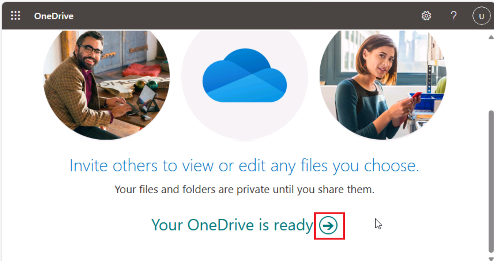

**Lab 01: Stärken Sie Ihre Belegschaft – Copilot - Executives**

In diesem Lab werden Sie:

1.  Verwenden Sie Copilot in Word, um eine Rede zu erstellen, die Sie
    vor den Aktionären des Unternehmens halten möchten.

2.  Verwenden Sie Copilot in PowerPoint, um eine PowerPoint-Präsentation
    basierend auf der von Ihnen erstellten Rede zu erstellen.

**Übung \#1: Erstellen einer Rede mit Copilot in Word**

In dieser Übung weisen Sie Copilot in Word an, eine Rede für Sie zu
schreiben, die auf der Gewinn- und Verlustrechnung Ihres Unternehmens
basiert, die als Word-Dokument gespeichert ist. Diese Übung führt Sie
durch eine Reihe von Eingabeaufforderungen, die Sie verwenden können,
damit Copilot in Word Ihre Rede generiert und dann basierend auf den
vorgeschlagenen Änderungen aktualisiert.

**Hinweis**: Wenn Sie in einer Copilot-Eingabeaufforderung auf eine
Datei (z. B. die Gewinn- und Verlustrechnung Ihres Unternehmens)
verweisen müssen, MUSS die Datei in einem OneDrive-Konto gespeichert
werden. Sie können keine Verknüpfung zu einer lokal gespeicherten Datei
auf Ihrem PC herstellen.

Sie können eine Datei mit einer der folgenden Methoden in der
Copilot-Eingabeaufforderung referenzieren/verknüpfen:

1.  Wählen Sie die Datei aus der Liste der zuletzt verwendeten Dateien
    (MRU) aus.

2.  Öffnen Sie die Datei, kopieren Sie den Pfad mit der Option **Share**
    und fügen Sie den Pfad dann nach dem Schrägstrich (/) in die
    Eingabeaufforderung ein.

3.  Kopieren Sie den Pfad der Datei aus dem Datei-Explorer, und fügen
    Sie ihn in die Eingabeaufforderung nach dem Schrägstrich (/) ein.

In dieser Übung wählen Sie die Gewinn- und Verlustrechnung des
Unternehmens aus der Liste der MRU-Dateien aus.

Sie führen die folgenden Schritte aus, damit Copilot in Word eine Rede
für Sie erstellt, die auf der Gewinn- und Verlustrechnung Ihres
Unternehmens basiert:

1.  Wenn Sie ein Microsoft 365-Tab in Ihrem Edge-Browser geöffnet haben,
    wählen Sie ihn jetzt aus. Andernfalls öffnen Sie einen neuen Tab,
    und geben Sie die folgende URL ein:
    +++[https://www.office.com+++](https://www.office.com+++/), um zur
    **Microsoft 365-Startseite** zu gelangen.

**Hinweis**: Sie müssen sich (wenn Sie dazu aufgefordert werden) mit den
**Microsoft 365-Anmeldeinformationen** anmelden, die auf der
Registerkarte **Resources** auf der rechten Seite bereitgestellt werden.

Wenn Sie nach der Anmeldung eine verschwommene Webseite **Microsoft
365-Startseite** sehen, klicken Sie im Browsermenü auf **Refresh.**

Klicken Sie oben links auf das **App-Launcher** (Menüsymbol für die
**Candy box menu**– 3 x 3 Punkte), um das App-Menü zu erweitern, und
wählen Sie **OneDrive** aus.

Klicken Sie auf den Pfeil, um
fortzufahren.

2.  Wählen Sie im Navigationsbereich das Symbol **+** und dann **Files
    uploaded** aus, um es zu öffnen.

1.  Navigieren Sie zum **Ordner C:\LabFiles**, um eine Kopie des
    Dokuments **Fabrikam 2023 Income Statement** auszuwählen und auf
    **OneDrive** hochzuladen.

**Hinweis**: Wenn Sie bereits alle Lab-Objekte auf OneDrive hochgeladen
haben, wie unter **Preparing for the lab execution (Lab 0)**
vorgeschlagen**,** Sie können diesen Schritt überspringen.

3.  Öffnen und schließen Sie die Datei **Fabrikam 2023 Income
    Statement** Document (die Sie auf OneDrive hochgeladen haben), um
    sie in Ihrer Liste der zuletzt verwendeten Dateien (MRU) zu
    erhalten.
    

**Hinweis**: Wenn Sie das Dokument **Fabrikam 2023 Income Statement**
öffnen, wird ein Popup angezeigt, wie im Screenshot gezeigt. Klicken Sie
auf **Next** und wählen Sie **Try** **Copilot** aus.

Schließen Sie den Browser mit dem **Fabrikam 2023 Income Statement**.

4.  Öffnen Sie in Microsoft 365 **Microsoft Word**, und öffnen Sie dann
    ein neues leeres Dokument.

5.  Geben Sie im Fenster **Draft with Copilot**, das am oberen Rand des
    leeren Dokuments angezeigt wird, die folgende Eingabeaufforderung
    ein:

+++Write a speech for the Fabrikam stakeholders that summarizes the
results of the company's 2023 income statement found in the attached
file.+++

6.  Wählen Sie im Fenster **Draft with Copilot** die Schaltfläche
    **Reference your content**. Wählen Sie im angezeigten Popup-Fenster
    die Datei
    aus. 
    

Wenn die Datei aus irgendeinem Grund nicht angezeigt wird, klicken Sie
im Popup-Fenster auf **Browse files from cloud**.

7.  Wählen Sie im angezeigten Fenster **Pick a file** unter der Liste
    **Recent file** die Datei **Fabrikam 2023 Income Statement.docx**
    aus**,** und klicken Sie dann auf die Schaltfläche
    **Attach.** 
    
    

8.  Beachten Sie, wie die Datei in der Eingabeaufforderung angezeigt
    wird. Wählen Sie **Generate** aus.
    

**Hinweis**: Wenn Sie aus irgendeinem Grund immer wieder die
Fehlermeldung **Something went wrong** erhalten, wenn Sie nach dem
**Anhängen** des referenzierten Dokuments auf die Schaltfläche
**Generate** klicken, schließen Sie den Fehler und fahren Sie mit dem
nächsten Schritt fort.

Öffnen Sie die Datei in einem Browser, kopieren Sie den Pfad mit der
Option Share und fügen Sie den Pfad dann in die Eingabeaufforderung nach
dem Schrägstrich (/) ein.

**Wichtig**: Auch wenn Sie es mit der alternativen Option versucht haben
und die gleiche Ausnahme " something went wrong " angezeigt wird,
versuchen Sie es nicht mit dem Webclient von Word, sondern mit der
Desktopversion von Word.

Wenn es funktioniert, wenn Sie die Desktop-Version von Word verwenden,
befolgen Sie dies in den kommenden Übungen, wenn Sie die Ausnahme "
something went wrong " sehen, während Sie auf die Schaltfläche
**Generate** klicken.

9.  An dieser Stelle extrahiert Copilot die Finanzergebnisse aus der
    Gewinn- und Verlustrechnung und entwirft eine Rede.

10. Nachdem Sie die Rede überprüft haben, entscheiden Sie, dass dies ein
    guter Ausgangspunkt ist, obwohl es einige Bereiche gibt, die Sie
    ändern möchten. Wählen Sie im Copilot-Fenster am Ende der Rede die
    Schaltfläche **Keep It** aus.

11. Sie möchten zunächst alle vom Copilot-Editor vorgeschlagenen
    Änderungen überprüfen. Wählen Sie das **Editor**-Symbol aus, das in
    der Menüleiste oben auf der Seite angezeigt wird.
    

**Hinweis**: Sie können das Editor-Symbol in der klassischen
Multifunktionsleiste von **Microsoft Word** sehen. Im einzeiligen
Menüband wird es in der standardmäßigen Browser-Zoomstufe von 100 %
nicht angezeigt. Wählen Sie das **Auslassungszeichen** (3 horizontale
Punkte) aus und scrollen Sie nach unten, um den **Editor** auszuwählen.

12. Notieren Sie sich im angezeigten Editorbereich die Kategorien, die
    in den Abschnitten **Corrections** oder **Refinements** angezeigt
    werden, in denen eine Zahl angezeigt wird (die die Anzahl der
    Probleme für diese Kategorie angibt). Diese Probleme hängen oft mit
    dem Ton des Schreibstils zusammen, der im Dokument verwendet wird.

Unterhalb des **Editor-Scores** befindet sich ein Feld, in dem Sie den
Ton auswählen können, der beim Schreiben der Rede verwendet wird.
Derzeit wird **Formal Writing** angezeigt, was der Standardton ist, den
Copilot beim Schreiben dieser Rede verwendet hat. Wenn Sie nicht
angeben, welchen Schreibstil Sie in Ihrer Eingabeaufforderung verwenden
sollen, ist **Formal Writing** der Standardton, den Copilot verwendet.
Wählen Sie dieses Feld aus, um Ihre Optionen anzuzeigen. Wenn Sie einen
professionell klingenden Ton bevorzugen, wählen Sie daher Professional
aus dem Dropdown-Menü. Beachten Sie, ob sich die **Editor
Score** ändert.

1.  In den Kategorien, die in den Abschnitten
    **Corrections** oder **Refinements** angezeigt werden, können Sie
    die Änderungen überprüfen, die in den Kategorien auf der Grundlage
    der Änderung des Schreibstils von "Formell" in "Professionell"
    aufgetreten sind. Wählen Sie jede Kategorie aus, in der eine Zahl
    angezeigt wird (die die Anzahl der Probleme für diese Kategorie
    angibt). Auf diese Weise können Sie die Vorschläge im gesamten
    Dokument für diese Kategorie überprüfen. Wählen Sie für jeden
    Vorschlag entweder die vorgeschlagene Änderung aus, oder wählen Sie
    **Ignore** aus. Wiederholen Sie diesen Vorgang, bis alle Kategorien
    mit einem Häkchen versehen sind.

Ändern Sie den Schreibstil auf **Casual** und prüfen Sie, ob sich der
**Editor-Score** ändert. Wenn in Kategorien eine Zahl angezeigt wird,
überprüfen Sie die Kategorie, und sehen Sie nach, was der Editor
gemeldet hat. Wenn Sie den Schreibstil als Professionell beibehalten
möchten, wählen Sie daher Alle vorgeschlagenen Änderungen **ignorieren
(Ignore)** aus. Überprüfen Sie alle vorgeschlagenen Änderungen, um die
Unterschiede zu sehen, die zwischen den Stilen "Professional" und
"Casual" gekennzeichnet wurden.

1.  Die Datei wird in Ihrem OneDrive-Konto gespeichert. Klicken Sie oben
    links im Word-Dokument auf den Dateinamen, um ihn zu markieren und
    die Datei wie folgt umzubenennen+++Fabrikam 2023 Financial
    presentation.docx+++. In der nächsten Übung wird dieses Dokument
    verwendet.

**Wichtig**: In der nächsten Übung verwenden Sie Copilot in PowerPoint,
um eine Folienpräsentation basierend auf diesem Dokument zu erstellen.
Das Dokument muss sich in OneDrive befinden, damit Copilot darauf
zugreifen kann.

1.  Schließen Sie die Registerkarte mit diesem Dokument in Ihrem
    Microsoft Edge-Browser.

**Übung \#2: Erstellen einer Folienpräsentation mit Copilot in
PowerPoint**

In dieser Übung verwenden Sie Copilot in PowerPoint, um eine
Folienpräsentation basierend auf Ihrer Rede (für die Aktionäre auf der
Grundlage der Gewinn- und Verlustrechnung) zu erstellen, die Sie mit
Copilot in Word erstellt haben, um Ihre Rede zu schreiben.

In der vorherigen Übung haben Sie auf die Gewinn- und Verlustrechnung
des Unternehmens in Copilot zugegriffen, indem Sie auf die Datei aus der
Liste der zuletzt verwendeten Dateien (MRU) zugegriffen haben. In dieser
Übung sammeln Sie Erfahrungen mit dem Zugriff auf eine Datei mit einem
anderen Prozess. Anstatt die MRU-Liste zu verwenden, planen Sie, auf die
Rede zuzugreifen, indem Sie den Link zur **Fabrikam 2023 Financial**
**presentation.docx-Datei** kopieren, die Sie in der vorherigen Übung
erstellt haben.

Führen Sie die folgenden Schritte aus, damit Copilot in PowerPoint einen
Entwurf Ihrer Präsentation erstellt:

1.  Öffnen Sie eine Microsoft 365-Registerkarte in Ihrem Edge-Browser,
    und wählen Sie sie jetzt aus. Andernfalls öffnen Sie eine neue
    Registerkarte, und geben Sie die folgende URL ein:
    +++[https://www.office.com+++](https://www.office.com+++/), um zur
    **Microsoft 365-Home** zu gelangen.

**Hinweis**: Sie müssen sich (falls Sie dazu aufgefordert werden) mit
den **Microsoft 365 Credentials** anmelden, die auf der Registerkarte
**Resources** auf der rechten Seite bereitgestellt werden.

2.  Wählen Sie im **Microsoft 365-**Navigationsbereich **Word** aus**,**
    um Word zu öffnen.

3.  Scrollen Sie auf der Dateiseite in **Word** nach unten zur Liste der
    zuletzt verwendeten Dateien, und wählen Sie **Fabrikam 2023
    Financial presentation.docx** aus, um sie auf einer neuen
    Registerkarte in Ihrem Microsoft Edge-Browser zu öffnen.

4.  Kopieren Sie die URL des Dokuments, indem Sie in der oberen rechten
    Ecke über dem Menüband auf die Schaltfläche Share klicken und im
    angezeigten Dropdown-Menü die Option **Copy Link** auswählen.

**Hinweis**: Gelegentlich kann es zu Problemen bei der Verwendung der
URL in der Adressleiste kommen. Kopieren Sie den Link aus der
Freigabeleiste, um die besten Ergebnisse zu erzielen

5.  Schließen Sie das Dialogfeld **Link Copied**, das in Word angezeigt
    wird.

6.  Schließen Sie diese Dokumentregisterkarte in Ihrem Microsoft
    Edge-Browser. Dadurch gelangen Sie zurück zur Seite **Word \|
    "Microsoft 365**".

7.  Wählen Sie auf der Seite Word-Datei oben links im Bereich **App
    Launcher** das **PowerPoint-Symbol** aus.

8.  Öffnen Sie in **PowerPoint** eine neue leere Präsentation.

9.  Wählen Sie das **Copilot-**Symbol aus (rot hervorgehoben, wie im
    Screenshot gezeigt).

10. Im angezeigten **Copilot-Bereich** stehen mehrere vordefinierte
    Eingabeaufforderungen zur Auswahl**.**

11. Wählen Sie die Eingabeaufforderung **Create presentation from
    file** aus.

**Hinweis**: In der vorherigen Übung haben Sie eine Datei mit einer
Eingabeaufforderung verknüpft, indem Sie die Datei aus der MRU-Liste
ausgewählt haben. In dieser Übung sammeln Sie Erfahrungen mit dem
Verknüpfen einer Datei mit einer Eingabeaufforderung mit einer anderen
Methode. 

12. Über dem Eingabeaufforderungsfeld am unteren Rand des
    **Copilot-Bereichs** wird ein Fenster **Suggestions** angezeigt, das
    die drei zuletzt verwendeten Dateien enthält. Normalerweise würden
    Sie die gewünschte Datei auswählen, wenn sie in diesem Fenster
    angezeigt wird. Selbst wenn die **Fabrikam 2023 Financial
    presentation.docx** in dieser Schulung in der MRU-Liste angezeigt
    wird, gehen wir jedoch davon aus, dass dies nicht der Fall ist.
    Daher müssen Sie den Link zu der Datei in das
    Eingabeaufforderungsfeld einfügen.

13. In das Eingabeaufforderungsfeld gibt Copilot automatisch **Create
    presentation from file /**. ein**.** Platzieren Sie den Cursor
    hinter dem Schrägstrich, und geben Sie **Strg+V** ein, um den Link
    zu diesem Dokument in die Eingabeaufforderung einzufügen.

14. Wählen Sie das Symbol **Send** aus.

15. Diese Eingabeaufforderung löst Copilot aus, eine Folienpräsentation
    basierend auf dem Dokument zu erstellen. Dabei zeigt es den Umriss
    der Präsentation und eine Liste der in der Präsentation enthaltenen
    Funktionen an. Zu diesen Funktionen können Vortragsnotizen, Bilder,
    Layouts zum Organisieren von Folien und eine
    Vertraulichkeitsbezeichnung General gehören.

16. Sie können jetzt die Folien überprüfen und alle erforderlichen
    Aktualisierungen vornehmen. Sie können das **Designer** Tool
    verwenden, um die Layouts anzupassen.

17. Achten Sie beim Durchsehen der Folien auf Verweise auf "the speaker"
    oder andere Elemente, die Sie möglicherweise ändern müssen.

Warnung: Achten Sie auf den Hinweis „The Speaker" zusammen mit dem
zweiten Satz, der mit "The presentation will summarize..." beginnt. die
von Copilot erstellt werden können.

**Beispiel**: Der Referent stellt eine Präsentation über die Höhepunkte
der Gewinn- und Verlustrechnung 2023 von Fabrikam vor und berichtet von
einer starken Leistung und einem starken Wachstum trotz der
Herausforderungen durch die globale Pandemie und den
wettbewerbsintensiven Markt. In der Präsentation werden die wichtigsten
Ergebnisse zusammengefasst und erläutert, wie sie mit der strategischen
Vision und den Zielen des Unternehmens übereinstimmen.

Sie sollten diese Art von Verweisen entfernen, da sie eher als
Vortragsnotizen als als Text für Zuhörer geeignet sind.

18. Überprüfen Sie die Sprechernotizen, die Copilot der Präsentation
    hinzugefügt hat. Stellen Sie sicher, dass sie die Punkte nennen, die
    Sie während der Präsentation ansprechen möchten.

19. Versuchen Sie, die Präsentation mit Copilot zu aktualisieren. Geben
    Sie z. B. die folgende Eingabeaufforderung ein:

+++Add a new slide after slide 1. This slide should have an image of a
mountain peak in the Alps. Towards the bottom of the slide, add a text
box that says: Fabrikam's company motto - "We overcome every obstacle."
Add speaker notes to this new slide that talk about how Fabrikam works
diligently to solve every customer's request, never letting any obstacle
stand in its way of success.+++

Überprüfen Sie die neue Folie, die erstellt wurde. In den verbleibenden
Lab-Übungen wird diese Präsentation zwar nicht verwendet, aber Sie
können sie entweder verwerfen oder speichern, wenn Sie später darauf
zurückgreifen möchten.

**Zusammenfassung**

In diesem Lab haben Sie:

- Nutzung der Funktionen von Microsoft Copilot in Word, um eine
  umfassende Rede zu verfassen, die die Generierung von Inhalten
  umfasst, die wichtige Botschaften und Unternehmensaktualisierungen
  effektiv kommunizieren.

- Nutzung von Microsoft Copilot in PowerPoint, um die in Word erstellte
  Rede in eine visuell ansprechende und informative Präsentation
  umzuwandeln, indem Folien erstellt wurden, die die wichtigsten Punkte
  der Rede hervorheben, und Copilot verwendet wurde, um Konsistenz und
  Klarheit im Präsentationsformat zu gewährleisten.
