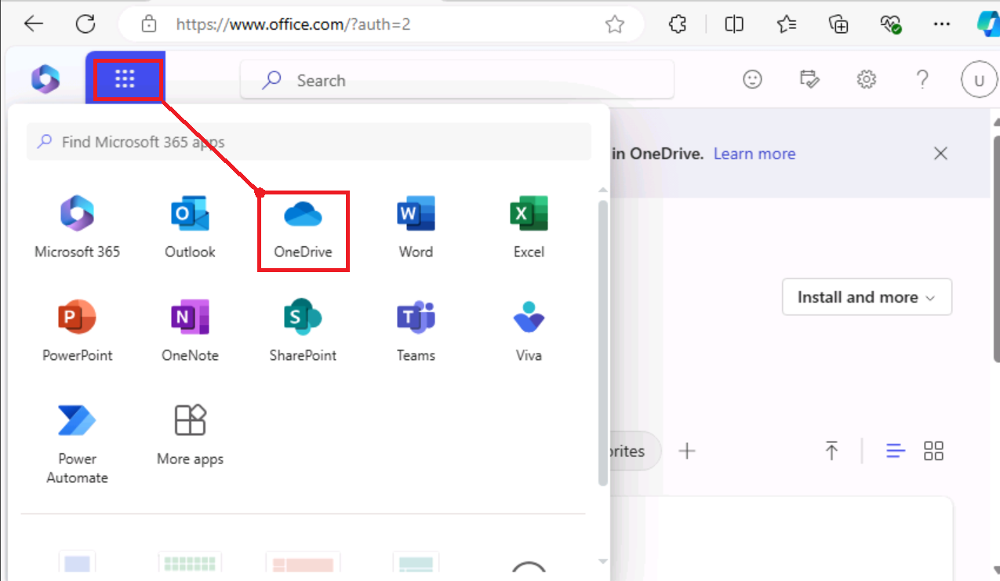
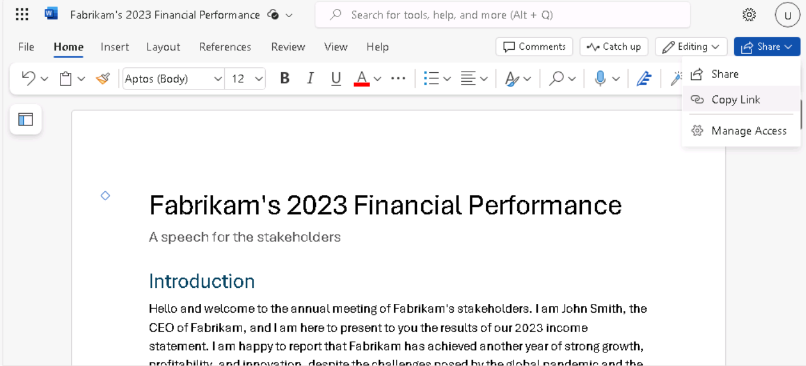
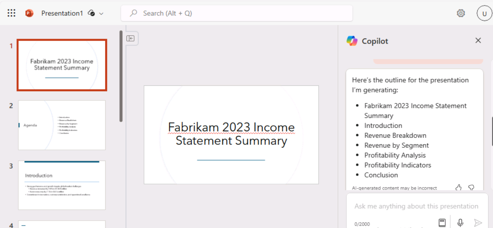

**Laboratório 01: Capacite sua força de trabalho – Copilot -
Executivos**

Neste laboratório, você

- Irá usar o Copilot no Word para criar um discurso que você planeja
  fazer aos acionistas da empresa.

- Irá usar o Copilot no PowerPoint para criar uma apresentação do
  PowerPoint com base no discurso que você criou.

**Exercício 1: Criar um discurso usando o Copilot no Word**

Neste exercício, você orienta o Copilot no Word para escrever um
discurso com base na Demonstração de Resultados da sua empresa, que está
armazenada como um documento do Word. Este exercício conduz você por uma
série de prompts que podem ser usados para gerar seu discurso e depois
atualizá-lo com base nas suas sugestões.

**Observação**: quando precisar referenciar um arquivo (como a
Demonstração de Resultados da sua empresa) em um prompt do Copilot, o
arquivo DEVE estar salvo em uma conta do OneDrive. Não é possível
vincular um arquivo armazenado localmente no seu PC.

Você pode referenciar/vincular um arquivo ao prompt do Copilot usando um
dos seguintes métodos:

- Selecione o arquivo na lista de arquivos Most Recently Used (MRU).

- Abra o arquivo e copie seu caminho usando a opção **Share**, depois
  cole o caminho no prompt após a barra (/)..

- Copie o caminho do arquivo do Explorador de Arquivos e cole-o no
  prompt após a barra (/).

Neste exercício, você seleciona a Demonstração de resultados da empresa
na lista de arquivos MRU.

Você executará as seguintes etapas para que o Copilot no Word crie um
discurso para você com base na Demonstração de Resultados da sua
empresa:

1.  Se você tiver uma guia do Microsoft 365 aberta no navegador Edge,
    selecione-a agora; caso contrário, abra uma nova guia e insira a
    seguinte URL:
    +++[https://www.office.com+++](https://www.office.com+++/) para
    acessar a página inicial do **Microsoft 365**.

**Observação**: você precisa fazer login (se solicitado) usando as
**credenciais do Microsoft 365** fornecidas na guia **Resources** à
direita.

Após o login, se a página inicial do **Microsoft 365** aparecer
embaçada, clique em **Refresh** no menu do navegador.

Clique no **App launcher** (ícone do **Candy box menu** - matriz de
pontos 3 x 3) no canto superior esquerdo para expandir o menu de
Aplicativos e selecione **OneDrive**.

Clique na seta para
continuar.

2.  No painel de navegação, selecione o ícone + e selecione **Files
    upload** para abri-lo.

3.  Navegue até a pasta **C:\LabFiles** para selecionar e carregar uma
    cópia do documento **Fabrikam 2023 Income Statement** no
    **OneDrive**.

**Observação**: Se você já carregou todos os ativos do laboratório no
OneDrive, conforme sugerido em **Preparando-se para a execução do
laboratório (Laboratório 0),** ignore esta etapa.

4.  Abra e feche o arquivo **Fabrikam 2023 Income Statement**  (que você
    carregou no OneDrive) para que ele apareça na sua lista de arquivos
    Most Recently Used (MRU).
    

**Observação**: Ao abrir o documento **Fabrikam 2023 Income Statement**,
você verá um pop-up conforme mostrado na captura de tela. Clique em
**Next** e selecione **Try Copilot**.

Feche o navegador com o documento **Fabrikam 2023 Income Statement**.

5.  No Microsoft 365, abra o **Microsoft Word** e abra um novo documento
    em branco.

6.  Na janela **Draft with Copilot** que aparece no topo do documento em
    branco, digite o seguinte prompt:

+++Write a speech for the Fabrikam stakeholders that summarizes the
results of the company's 2023 income statement found in the attached
file.+++

7.  Na janela **Draft with Copilot**, selecione o botão **Reference your
    content**. Na janela pop-up exibida, selecione o
    arquivo. 

Se, por algum motivo, o arquivo não for exibido, clique em **Browse
files from cloud** na janela pop-up.

8.  Na janela **Pick a file** que aparece, na lista de arquivo
    **Recent**, selecione o arquivo **Fabrikam 2023 Income
    Statement.docx** e depois clique no botão **Attach.**
    

9.  Observe como o arquivo é exibido no prompt. Selecione **Generate**.
    

**Observação**: Se, por algum motivo, você continuar recebendo o erro
**"Something went wrong"** ao clicar no botão **"Generate"** após anexar
o documento referenciado, ignore o erro e prossiga para a próxima etapa.

Abra o arquivo em um navegador e copie seu caminho usando a opção
Compartilhar e, em seguida, cole o caminho no prompt após a barra (/).

**Importante**: Mesmo depois de tentar a opção alternativa, se você
continuar vendo a exceção "something went wrong", então, em vez de usar
o cliente web do Word, tente utilizar a versão desktop do Word.

Se funcionar ao usar a versão desktop do Word, siga o mesmo procedimento
nos próximos laboratórios quando encontrar a exceção "something went
wrong" ao clicar no botão **Generate**.

10. Nesse ponto, o Copilot extrai os resultados financeiros da
    Demonstração de Resultados e elabora um discurso.

11. Após revisar o discurso, você decide que é um bom ponto de partida,
    embora haja algumas áreas que deseja modificar. Na janela do
    Copilot, ao final do discurso, selecione o botão **Keep it**.

12. Você deseja começar revisando quaisquer alterações sugeridas pelo
    Editor do Copilot. Selecione o ícone **Editor**, que aparece na
    barra de menu na parte superior da página.
    

**Observação**: Você poderá ver o ícone **Editor** na Faixa de Opções
Clássica do **Microsoft Word**. Na faixa de opções de linha única, ele
não ficará visível no nível padrão de zoom do navegador, que é 100%.
Selecione o ícone **reticências** (3 pontos horizontais) e role para
baixo para selecionar **Editor**

13. No **Editor** exibido, observe as categorias que aparecem nas seções
    **Corrections** ou **Refinements**, que exibem um número (indicando
    o número de problemas para essa categoria). Esses problemas
    geralmente estão relacionados ao tom do estilo de escrita usado no
    documento.

Abaixo de **Editor Score** há um campo que permite selecionar o tom
usado ao escrever o discurso. Atualmente, ele exibe a **Formal
writing**, que é o tom padrão usado pelo Copilot ao escrever este
discurso. Quando você não indica qual estilo de escrita usar em seu
prompt, a **Formal writing** é o tom padrão que o Copilot usa. Selecione
este campo para ver suas opções. Você prefere um tom de som
profissional, então selecione **Profissional** no menu suspenso. Observe
se o **Editor Score** muda.

14. Nas categorias que aparecem nas seções
    **Corrections** ou **Refinements**, você pode revisar as alterações
    que ocorreram nessas categorias com base na alteração do estilo de
    escrita de Formal para Profissional. Selecione cada categoria que
    exibe um número (indicando o número de problemas para essa
    categoria). Isso permite revisar as sugestões ao longo do documento
    para essa categoria. Para cada sugestão, selecione a mudança
    sugerida ou selecione **Ignore**. Repita este processo até que todas
    as categorias exibam uma marca de seleção.

Mude o estilo de escrita para **Casual** e verifique se o **Editor
Score** muda. Se alguma categoria exibir um número, revise a categoria e
veja o que o Editor destacou. Como você deseja manter o estilo de
escrita como Professional, selecione **Ignore** para qualquer mudança
sugerida. Revise todas as mudanças sugeridas para ver as diferenças
destacadas entre os estilos Professional e Casual.

15. O arquivo será salvo na sua conta do OneDrive. No canto superior
    esquerdo do documento do Word, clique no nome do arquivo para
    destacá-lo e renomeie o arquivo como Fabrikam 2023 Financial
    presentation.docx. O próximo exercício usará este documento.

**Importante**: No próximo exercício, você usará o Copilot no PowerPoint
para criar uma apresentação de slides com base neste documento. O
documento deve estar no OneDrive para que o Copilot para acessá-lo.

16. Feche a guia que contém este documento no seu navegador Microsoft
    Edge.

**Exercício 2: Crie uma apresentação de slides usando o Copilot no
PowerPoint**

Neste exercício, você usará o Copilot no PowerPoint para criar uma
apresentação de slides com base em seu discurso (para os acionistas com
base na Demonstração de Resultados) que você criou usando o Copilot no
Word para escrever seu discurso.

No exercício anterior, você acessou a Demonstração de Resultados da
empresa no Copilot  através da lista de arquivos Most Recently Used
(MRU). Neste exercício, você ganhará experiência acessando um arquivo
usando um processo diferente. Em vez de usar a lista MRU, você planeja
acessar o discurso copiando o link **Fabrikam 2023 Financial
presentation.docx** que você criou no exercício anterior.

Você executará as seguintes etapas para que o Copilot no PowerPoint crie
um rascunho da sua apresentação:

1.  Se você tiver uma guia do Microsoft 365 aberta no navegador Edge,
    selecione-a agora; caso contrário, abra uma nova guia e digite a
    seguinte URL:
    +++[https://www.office.com+++](https://www.office.com+++/) para
    acessar a página inicial do **Microsoft 365**.

**Observação**: você precisa fazer login (se solicitado) usando as
**Microsoft 365 Credentials** fornecidas na g **Resources**, à direita.

2.  No painel de navegação do **Microsoft 365**, selecione **Word** para
    abrir o Word.

3.  Na página de arquivo no **Word**, role para baixo até a lista de
    arquivos recentes e selecione **Fabrikam 2023 Financial
    presentation.docx** para abri-lo em uma nova guia no navegador
    Microsoft Edge.

4.  Copie a URL do documento selecionando o botão **Share** no canto
    superior direito, acima da faixa de opções e selecionando **Copy
    link** no menu suspenso exibido.

**Observação**: ocasionalmente, você pode encontrar problemas ao usar o
URL da barra de endereço. Copie o link da área de compartilhamento para
obter melhores resultados

5.  Feche a caixa de diálogo **Link copied** que aparece no Word.

6.  Feche a guia deste documento no navegador Microsoft Edge. Isso o
    levará de volta à guia **Word \| Microsoft 365**.

7.  Na página Arquivo do Word, selecione o ícone do **PowerPoint** no
    App Launcher no canto superior esquerdo.

8.  No **PowerPoint**, abra uma nova apresentação em branco.

9.  Selecione o ícone **Copilot** (destacado em vermelho, conforme
    mostrado na captura de tela).

10. No painel **Copilot** exibido, vários prompts predefinidos estão
    disponíveis para você escolher.

11. Selecione o prompt **Create presentation from file**.

**Observação**: no exercício anterior, você vinculou um arquivo a um
prompt selecionando o arquivo na lista MRU. Neste exercício, você
ganhará experiência vinculando um arquivo ao prompt usando outro
método. 

12. Acima do campo de prompt, na parte inferior do painel do
    **Copilot**, uma janela de **Suggestions** aparece, contendo os três
    arquivos mais recentemente usados. Normalmente, você selecionaria o
    arquivo desejado se ele estivesse nessa janela. No entanto, neste
    exercício de treinamento, mesmo que o **Fabrikam 2023 Financial
    presentation.docx** apareça na lista **MRU**, vamos assumir que não
    apareceu. Sendo assim, você deve colar o link do arquivo no campo de
    prompt.

13. No campo de prompt, o Copilot digita automaticamente **Create
    presentation from file /**. Coloque o cursor após a barra e digite
    **Ctrl+V** para colar o link para este documento no prompt.

14. Selecione o ícone **Send**.

15. Este prompt faz com que o Copilot crie uma apresentação de slides
    com base no documento. Ao fazer isso, ele exibe o esboço da
    apresentação e uma lista de recursos incluídos na apresentação.
    Esses recursos podem incluir anotações do instrutor, imagens,
    layouts para organizar slides e um rótulo de confidencialidade
    geral.

16. Agora você pode revisar os slides e fazer as atualizações
    necessárias. Você pode usar a **Designer** tool para ajustar os
    layouts.

17. Ao revisar os slides, fique atento a referências ao "instrutor" ou
    quaisquer outros elementos que precisem ser alterados.

Aviso: Fique atento às referências a "O instrutor" juntamente com a
segunda frase que começa com "A apresentação irá resumir...". que pode
ter sido gerada pelo **Copilot**.

**Exemplo**: o instrutor introduz uma apresentação sobre os destaques da
Fabrikam's 2023 income statement, relatando um forte desempenho e
crescimento, apesar dos desafios da pandemia global e do mercado
competitivo. A apresentação irá resumir os principais resultados e
explicará como eles se alinham à visão estratégica e aos objetivos da
empresa.

Você deve remover esses tipos de referências, pois elas são mais
aplicáveis como notas do instrutor do que como texto destinado ao
público.

18. Revise as notas do instrutor adicionadas Copilot à apresentação.
    Verifique se elas destacam os pontos que você deseja enfatizar
    durante a apresentação.

19. Experimente usar o Copilot para atualizar a apresentação. Por
    exemplo, insira o seguinte prompt:

+++Add a new slide after slide 1. This slide should have an image of a
mountain peak in the Alps. Towards the bottom of the slide, add a text
box that says: Fabrikam's company motto - "We overcome every obstacle."
Add speaker notes to this new slide that talk about how Fabrikam works
diligently to solve every customer's request, never letting any obstacle
stand in its way of success.+++

Revise o novo slide criado. Como os exercícios restantes do laboratório
não utilizam esta apresentação, você pode optar por descartá-la ou
salvá-la para referência futura.

**Resumo**

Neste laboratório, você:

- **Utilizou Microsoft Copilot** no **Word** para redigir um **discurso
  abrangente**, gerando conteúdo que comunica de forma eficaz as
  **mensagens principais** e as **atualizações da empresa**.

- Aproveitei o Microsoft Copilot no PowerPoint para transformar o
  discurso criado em Word em uma apresentação visualmente envolvente e
  informativa, criando slides que destacam os principais pontos do
  discurso, usando o Copilot para garantir consistência e clareza no
  formato da apresentação.
