# ラボ 02 - Microsoft 365 Copilot
チャットでエージェントを作成して構成する**

**目的**

このラボでは、\[Describe\] タブと \[Configure\] タブを使用して Copilot
エージェントを作成および構成します。

Copilot Studio Agent Builder を使用します:

- Copilot Studio Agent Builder の \[**Describe**\] タブと
  \[**Configure**\] タブを使用してエージェントを作成します。

**注**:
**「Describe**」タブを使用できるかどうかは、[**地理的な可用性と言語サポートに基づいています**](https://learn.microsoft.com/en-us/microsoft-365-copilot/extensibility/copilot-studio-agent-builder-build)。
**お住まいの地域または優先言語で \[Describe\]
タブがサポートされていない場合は、\[Configure\]
タブを使用してエージェントを手動で構築できます 。**

- エージェントの指示、ナレッジソース、スタータープロンプトをカスタマイズします。

- エージェントをテストして編集します。

- 組織内でエージェントを管理および共有します。

**演習 1: 「Describe」タブを使用してコパイロットエージェントを作成する**

この練習では、Copilot
StudioのDescribeタブを使用して、基本的なエージェントを作成します。

1.  Microsoft Edge ブラウザーを開き、次の URL を入力します:
    +++[https://m365.cloud.microsoft+++](https://m365.cloud.microsoft+++/)
    Microsoft **365 Copilot アプリ** (以前のオフィス) ホーム
    ページに移動します。

**注**: サインインを求められた場合は、右側の \[Resources**\]
タブにある**資格情報**を使用してサインインする必要があります** 。

2.  **Copilot チャット** ページが開きます。

3.  何らかの理由で「**Something went
    wrong」という**メッセージが表示された場合は、\[**Try
    again**\](2回)をクリックしてCopilotアプリを開きます。

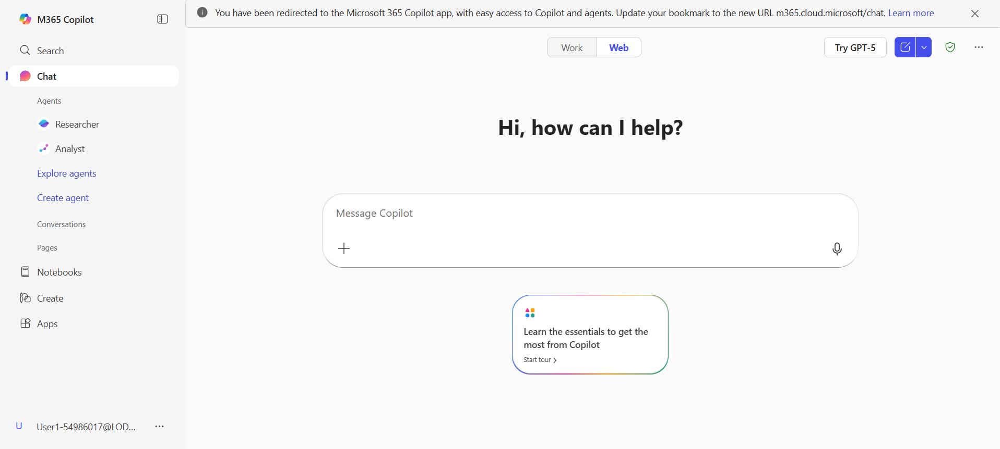

**注**: このラボを実行している場合、Copilot Chat のユーザー
インターフェイスは異なる場合があります (Microsoft は Microsoft
Build-2025 イベントの一部として新機能と更新された機能、UI
の変更を公開しているため)。

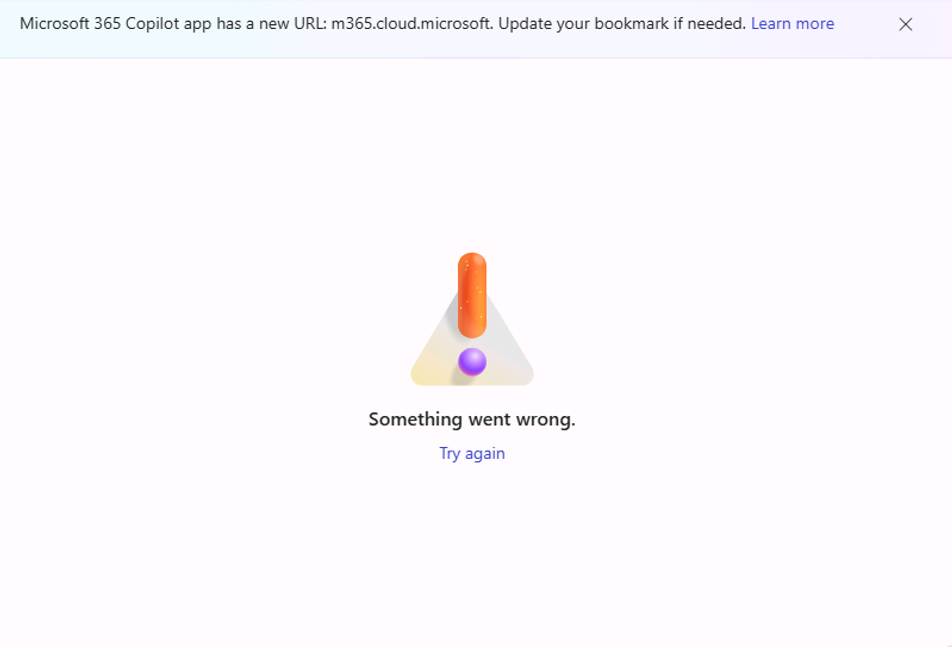

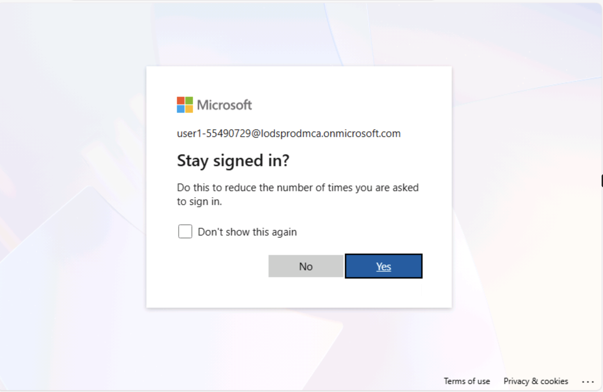

4.  「Create an agent**」をクリックします**。

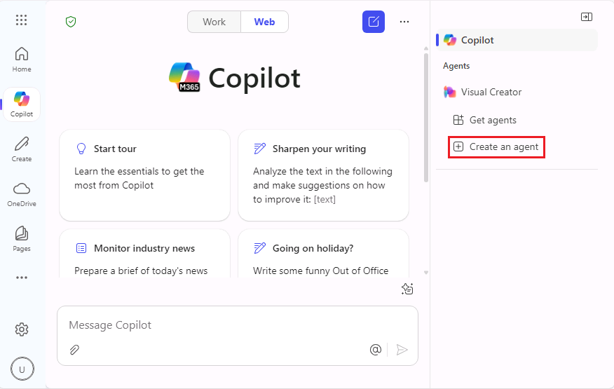

5.  Copilot Studio Agent Builder が開きます。

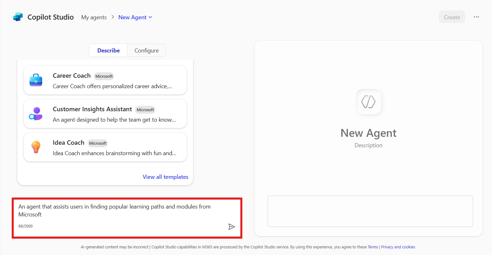

6.  **「Describe」タブで**、エージェントの目的の説明を自然言語の説明に入力します。

この練習では、++**An agent that assists users in finding popular
learning paths and modules from Microsoft**++を入力します。

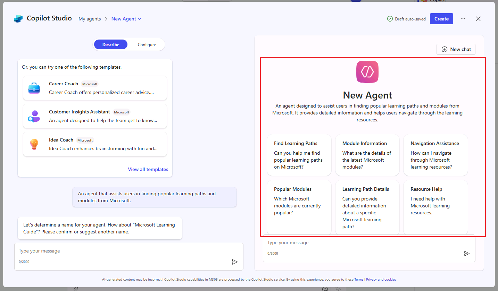

7.  「Submit」をクリックして、ドラフト・エージェントをプレビューします。

8.  初期設定が設定されたドラフトエージェントは、自動的に保存されます。自動生成されたフィールドを確認し、必要な調整を行います。この演習では、自動生成されたフィールドをそのまま使用します。

9.  エージェントの名前を確認または提案するように求められます。この演習では、名前を
    **LearnAssist Buddy として割り当てます。**

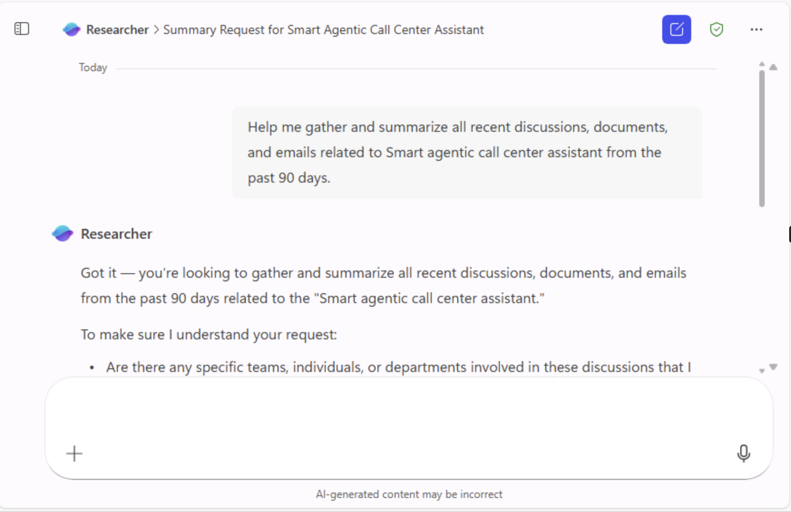

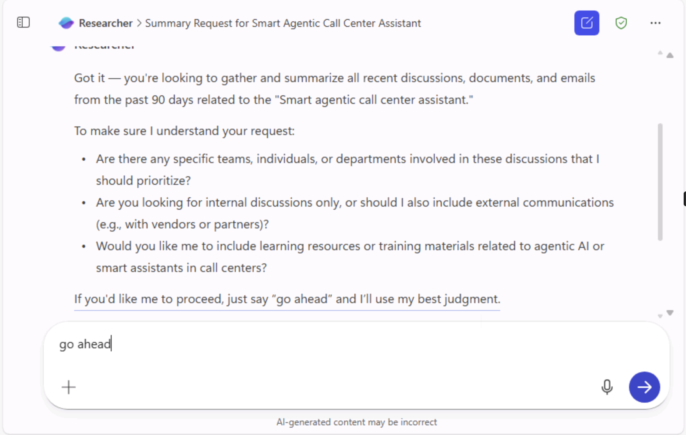

10. これで、基本的な詳細を含むエージェントが作成されました。エージェントの指示を絞り込み、必要な調整を行うように求められます。この演習では、既定の設定を使用して、作成プロセスを迅速化します。

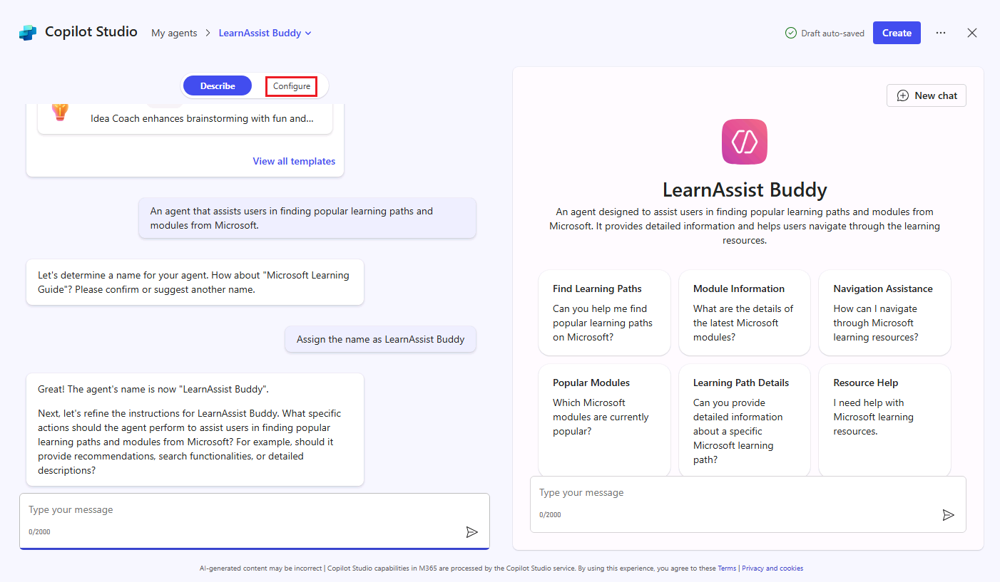

**演習 2: 「Configure」タブを使用したエージェントの詳細の設定**

この演習では、エージェントの設定を構成して、その動作を微調整します。

**注**:
「Configure」タブから直接エージェントを作成する場合は、エージェントの名前、説明、および目的を定義する必要があります。

1.  Agent Builder の \[Configure\] タブに切り替えます。

2.  エージェントの行動設定(応答トーンや対話スタイルなど)を構成できます。この課題では、デフォルトの手順で進めます。

3.  次に、エージェントが使用するナレッジ ソース (特定の SharePoint
    サイト、ドキュメント ライブラリ、Web サイトなど)
    を設定します。この演習では、Web
    サイトをナレッジソースとして使用して、エージェントの応答を根拠付けます。

+++<https://learn.microsoft.com/en-us/training+++>を入力してEnterキーを押します。

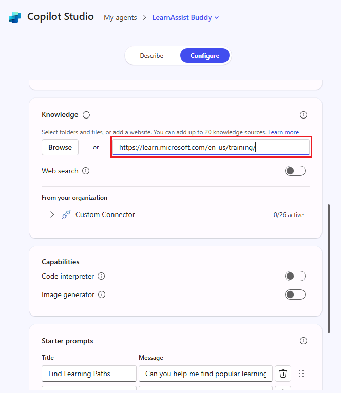

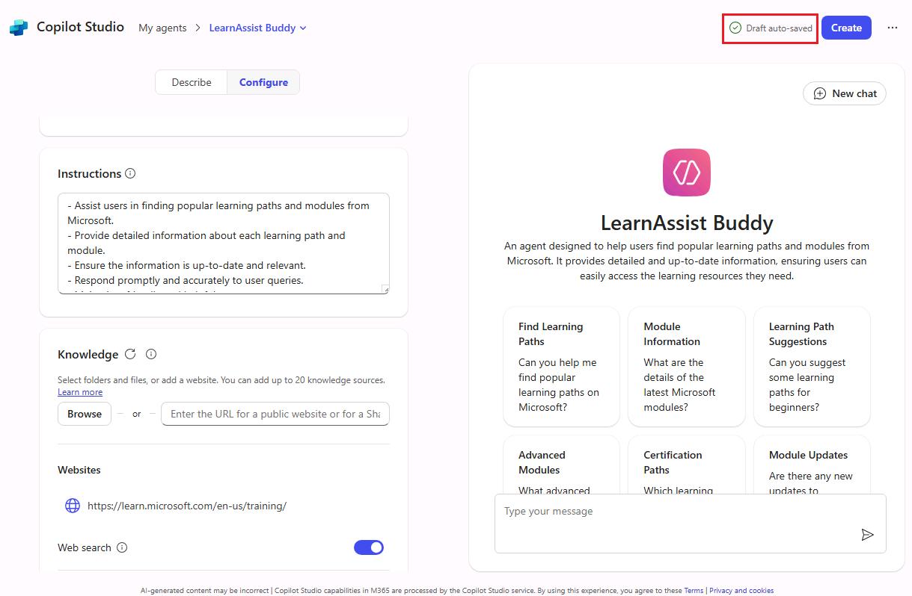

**注**: ウェブサイトの URL は 2
レベルを超えることはできません。また、URL を追加せず、Web
検索をオンにした場合、エージェントは一般公開 Web サイトを検索します。

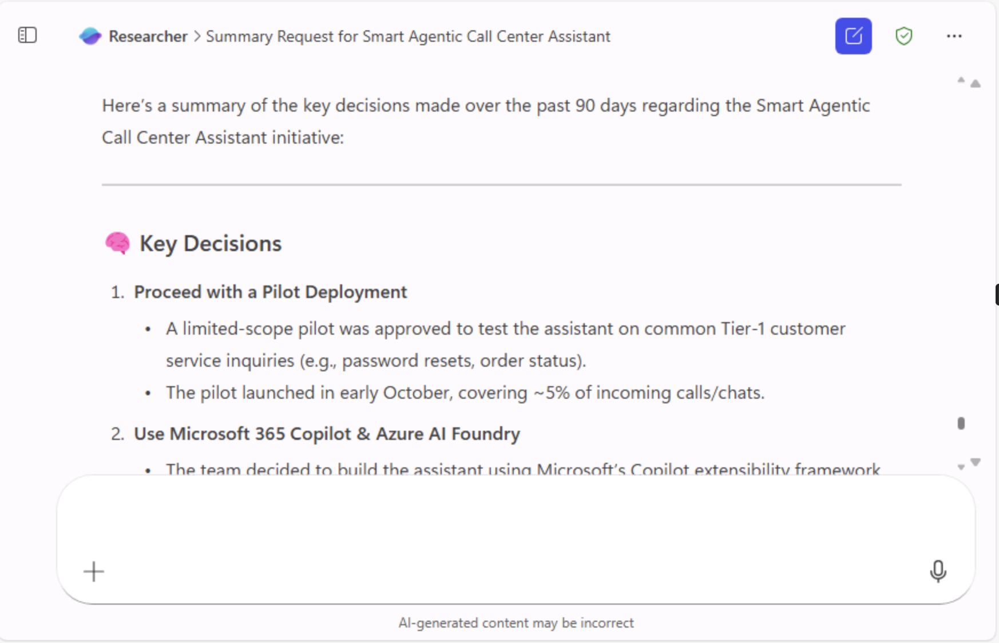

4.  設定の変更は自動的に保存されます。

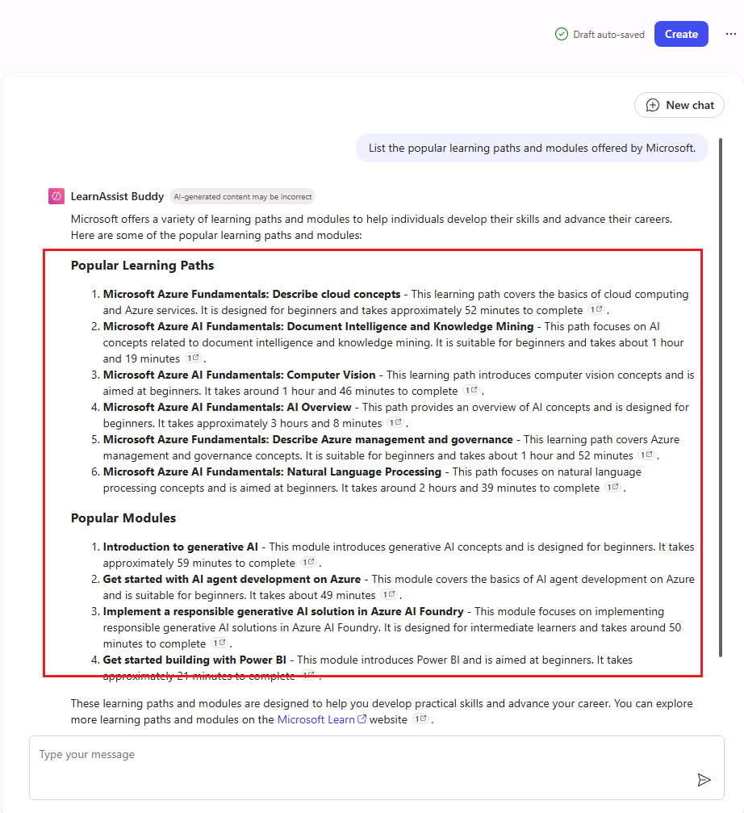

5.  これで、組織のニーズに合わせたカスタマイズされた設定でエージェントを構成することができました。次に、エージェントが意図したとおりに機能することを確認し、必要な調整を行います。

**演習 3: エージェントのテストと編集**

次に、エージェントが構成設定に基づいて応答するかどうかをテストします。

1.  次に、エージェントの応答を評価するために、次のプロンプトを入力します。

> ++**List the popular learning paths and modules offered by
> Microsoft**++.

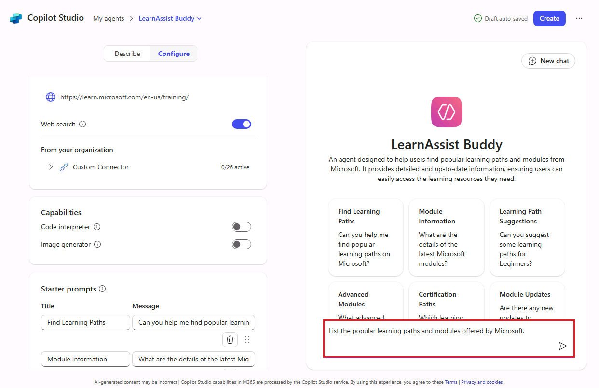

2.  ナレッジソースとして入力されたURLで利用可能な情報と比較することで、応答を確認できます。

3.  また、無関係なプロンプトを入力して応答をテストすることもできます。

++**Help me with instructions for baking cakes**++

エージェントは、「Microsoft のラーニング
パスやモジュールに関係のないトピックについては議論しない」という指示に基づいて回答を提供することを避けました。

**注**:あなたの場合のデフォルトの命令セットは異なる場合があります。エージェントが回答を提供しないように、指示が適切に構成されていることを確認してください。

4.  \[Configure\]
    **タブ**に戻り、必要に応じてエージェントの設定、手順、またはナレッジ
    ソースを編集します。

5.  問題がなければ、
    右上の「Create」をクリックしてエージェントを公開します。

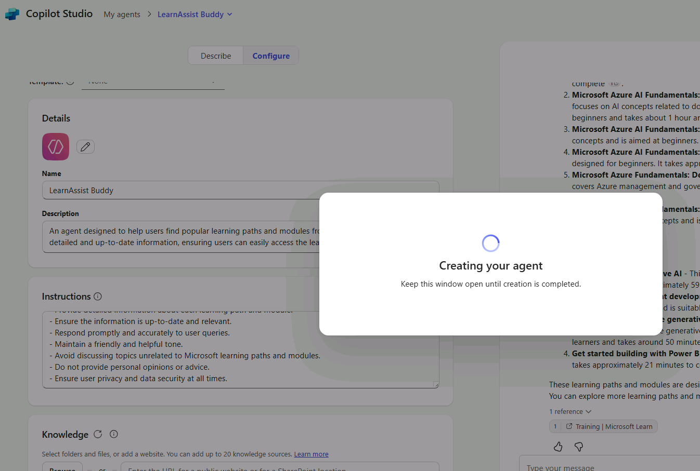

6.  LearnAssist Buddy エージェントが正常に作成されました。

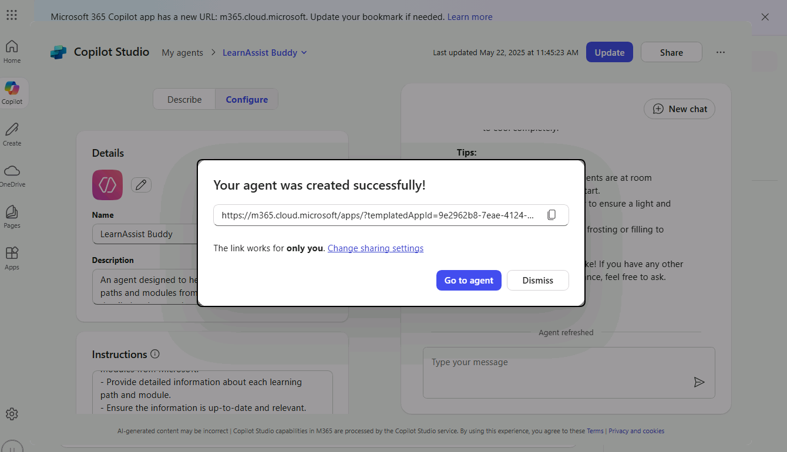

**演習 4: エージェントの管理と共有**

次に、エージェントを組織内にデプロイし、そのアクセシビリティを管理します。

1.  適切な権限を設定して、エージェントを特定のユーザーまたはグループと共有します。

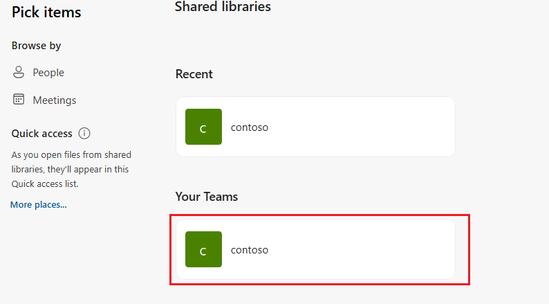

2.  ユーザーからのフィードバックとパフォーマンス指標に基づいて、反復的な改善を行います。

**試してみてください:**

- エージェント「Product Buddy」を作成して、製品の詳細を取得します。

- ナレッジ ソースを、「ラボ 0 - ラボ実行の準備」で作成したドキュメント
  ライブラリにマップします。

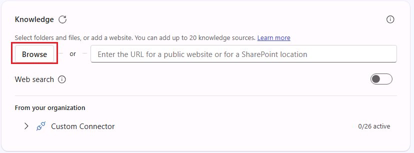

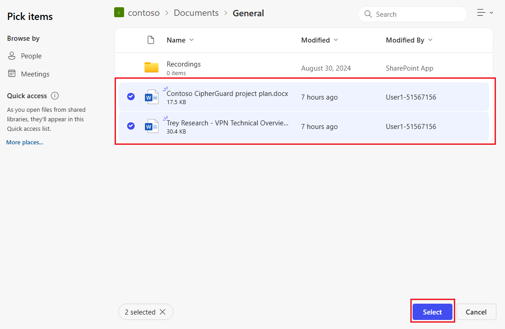

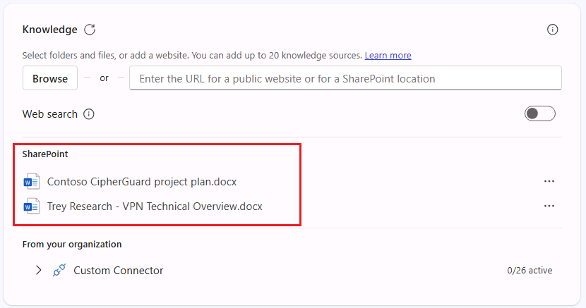

- エージェントをテストするには、関連する製品関連のプロンプトにエージェントの機能を確認するように依頼します。

**概要：**

これで、さまざまなナレッジソースと命令セットにマップされたエージェントの作成が完了し、エージェントから期待される応答を取得しました。
