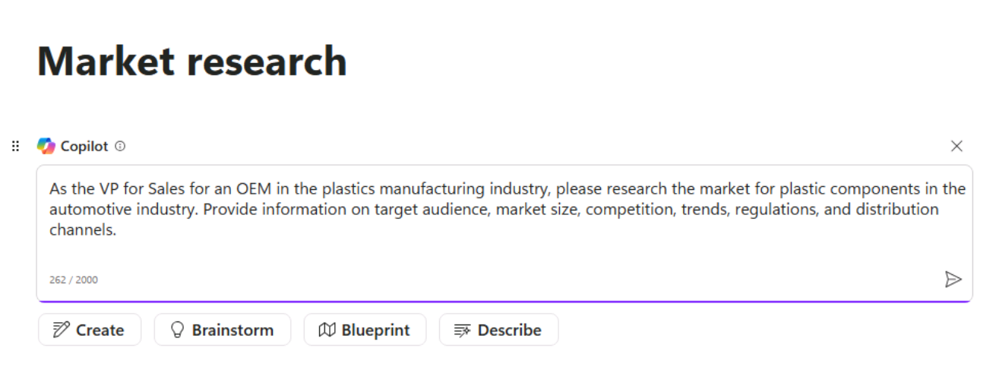

**ラボ 02: 従**業員の力を高める – Copilot - セールス

Copilot for Microsoft 365は、AIを活用したライティングアシスタントです。文脈を理解し、適切なフレーズを提案し、コンテンツの作成をサポートすることで、文章の質を高めます。このラボでは、

- Loop で Copilot を使用して市場調査レポートを作成します。

- PowerPoint で Copilot
  を使用して営業プレゼンテーションを作成およびカスタマイズします。

- Word で Copilot を使用して 3
  つのサプライヤー契約を比較し、相違点を特定して推奨アクションを提案します。

**エクササイズ #1: Copilot in Loop を使用して市場調査レポートを作成する**

あなたは、プラスチック部品のOEMメーカーであるVanArsdel
Ltdの営業担当副社長です。主要市場は農業機械業界です。しかし、経営陣は自動車市場への進出を検討しています。この分野を既に独占している既存のプラスチックメーカーとの激しい競争を考えると、貴社が生き残れる余地があるかどうかを判断する必要があります。

この演習では、Copilot in Loop を使用して、

- 自社製品の潜在的な新規販売市場を調査し、調査結果をまとめた市場調査レポートを作成します。

- レポートの形式を変更し、内容を表形式にします。

- 自社がその市場に参入すべきかどうかについて、最終的な提言を行います。

1.  Microsoft
    365で、左側のナビゲーションウィンドウに「Loop」が表示されている場合は選択します。表示されない場合は、Microsoft
    365ナビゲーションウィンドウのすぐ上にある左上の「App
    Launcher」を選択します。

注: アプリ ページに Loop が表示されない場合は、\[More apps\]
を選択します。 

2.  「Apps」ページで下にスクロールして「Loop」を見つけて選択します。

3.  \[Sign in\] ボタンが表示された場合は、\[Resources\] タブの
    \[Microsoft 365 資格情報\]
    で提供されている資格情報を使用してサインインします。

注: サインイン後、Loop ブラウザ ウィンドウを閉じて、アプリ
ページからもう一度 Loop を開きます。

4.  Microsoft Loop
    では、デフォルトで「Workspaces」タブが表示されます。このプロジェクト用に新しいワークスペースを作成するには、「Getting
    started」の横にある左上の「+」を選択し、「+ New
    workspace」ボタンをクリックします。

5.  \[Create a new workspace\]
    ウィンドウで、ワークスペース名として「+++VanArsdel
    research+++」と入力し、表示される \[Continue\] または \[Create\]
    ボタンを選択します (Loop のバージョンによって異なります)。

6.  \[Add files to your workspace\] ウィンドウ (Loop
    のバージョンによっては、このウィンドウに \[ワークスペース
    スイッチャー\] と表示されることがあります) で、\[Create\]
    を選択します。

7.  新しいワークスペースの最初のページが表示されました。ページ名は現在「Untitled」です。左側のナビゲーションペインにもページ（「Untitled」）が表示されています。ページのメイン部分で、「Untitled」フィールドを選択し、ページ名を「Market
    research」に変更します。ナビゲーションペインのページ名が自動的に更新されるのを確認してください。

8.  \[Just start typing...\] フィールドにスラッシュ (/) を入力します。

9.  表示されるドロップダウンメニューの、メニュー上部にある「Copilot」セクションで、「Draft
    page content」を選択します。

10. 表示される Copilot
    ウィンドウのプロンプトフィールドの下に表示されるボタンの列に注目してください。各ボタンを選択してください。選択すると、プロンプトフィールドに、Copilot
    が支援できるタスクの種類の例が事前に入力されていることに注意してください。

11. 次に、独自のプロンプトを入力します。プロンプトフィールドに次のプロンプトを入力し、「Submit」アイコンを選択します。

+++プラスチック製造業界のOEMの営業担当副社長として、自動車業界におけるプラスチック部品の市場調査をお願いします。ターゲット顧客、市場規模、競合状況、トレンド、規制、流通チャネルに関する情報を提供してください。+++

12. 問題が発生したというエラーが表示された場合は、前のプロンプトをコピーして貼り付け、再度送信してください。

13. 生成されたレポートを確認します。すべての情報を段落形式で表示するのではなく、表にまとめることをお勧めします。表示されるCopilotペインで、「Rewrite
    with
    Copilot」フィールドに次のプロンプトを入力し、「Submit」アイコンを選択します。

+++情報を表にまとめてレポートを書き直します。+++

14. Copilotによってレポートの書式がどのように変更されたかに注目してください。VanArsdelにとってこの市場への参入が現実的な選択肢であるかどうかについて、Copilotに最終的な推奨を依頼します。次のプロンプトを入力します。

+++市場に参入すべきかどうかについての推奨事項をレポートの最後に追加します。+++

15. レポートの一番下までスクロールして、Copilot の推奨事項を確認します。

**エクササイズ #2: Copilot in PowerPoint を使用してセールスプレゼンテーションを作成する**

PowerPointのCopilotを使用すると、デザインとフォーマットはツールが処理するため、営業担当者はプレゼンテーションの内容に集中できます。

- 既存の文書を、スピーカーノートや資料を含むプレゼンテーション資料に変換します。

- 簡単なプロンプトまたはアウトラインから新しいプレゼンテーションを開始します。

- プレゼンテーションの要点を箇条書きでまとめ、プレゼンテーションの内容を素早く理解したり、主要なアイデアをチームと共有したりすることで、プレゼンテーションの要約を支援します。

Contoso社の営業・マーケティングディレクターとして、あなたは営業チームに対し、同社のベストセラー商品であるContoso
Protein
Plusシェイクについてプレゼンテーションを行う必要があります。プレゼンテーションでは、マーケティングチームが同製品について作成した市場動向レポートを分析する必要があります。

この演習では、PowerPointのCopilotを使用して、提供されているリンクからダウンロードしたMarket
Trend Report - Protein
Shake.docxファイルの情報に基づいてスライドプレゼンテーションを作成します。

1.  Microsoft Edge ブラウザーで Microsoft 365
    タブを開いている場合は、それを選択します。開いていない場合は、新しいタブを開き、次の
    URL を入力します: +++https://www.office.com+++ して、Microsoft 365
    ホームページに移動します。

注: 右側の \[Resources\] タブに表示される Microsoft 365
資格情報を使用してサインインする必要があります (要求された場合)。

2.  C:\Lab Files フォルダを参照して、Market Trend Report - Protein Shake
    のコピーを選択し、OneDrive にアップロードします。

注: ラボ実行の準備セクション (ラボ 0) の指示に従って、すべてのラボ
アセットを既に OneDrive
にアップロードしている場合は、この手順をスキップできます。

3.  OneDriveにアップロードしたファイル「Market Trend Report - Protein
    Shake.docx」を開いて閉じ、最近使用したファイル（MRU）リストに追加します。

4.  Microsoft 365 のナビゲーション
    ウィンドウで「PowerPoint」を選択します。PowerPoint
    で、新しい空のプレゼンテーションを開きます。

5.  Copilot
    アイコン（スクリーンショットの赤くハイライトされた部分）を選択します。表示される
    Copilot
    ウィンドウで、いくつかの定義済みプロンプトから選択できます。「Create
    presentation from file
    prompt」プロンプトを選択します。 
    

Copilotパネル下部のプロンプトフィールドの上に、最近使用した3つのファイルを含む候補ウィンドウが表示される場合があります。「Market
Trend Report - Protein
Shake.docx」ファイルがMRUリストに表示されたら、それを選択します。

6.  それ以外の場合は、スクリーンショットに示すように、「Attach cloud
    files」オプションを使用して参照ドキュメントを添付できます。 
    

    

注:
ドキュメントへのリンクを使用して参照ドキュメントを添付することもできます。リンクを取得するには、Wordでファイルを開き、リボンの上にある「Share」ボタンを選択し、ドロップダウンメニューから「Copy
Link」オプションを選択します。次に、PowerPointのCopilotペインのこのプロンプトフィールドに、スラッシュ（ファイルからプレゼンテーションを作成
/）に続くリンクを貼り付けます。「Submit」アイコンを選択します。

7.  このプロンプトにより、Copilot
    はドキュメントに基づいてスライドプレゼンテーションを作成しました。その際、まずプレゼンテーションのアウトラインが表示され、次に別のウィンドウに、ドキュメントに基づいてプレゼンテーションに加えられた変更の一部が箇条書きで表示されました。

8.  Copilot
    がプレゼンテーションの作成を完了したら、スライドを確認します。発表者ノートを確認するには、「View」タブを選択し、「Note」ボタンがまだ選択されていない場合は選択します。すでに選択されていてノートが表示されていない場合は、スライドウィンドウの下部を上にドラッグしてノートを表示します。発表者ノートに、プレゼンテーションで伝えたい重要なポイントが含まれていることを確認してください。

9.  「Home」タブを選択し、「Copilot」ボタンの左側にある「Designer」ボタンを選択します。「Designer」ペインには、現在表示中のスライドの様々なデザインのサンプルが表示されます。プレゼンテーション内の別のスライドに切り替えて、そのスライドに合わせて「Designer」ペインでどのように異なるデザインオプションが生成されるかを確認してください。

10. デザインオプションのいずれかを選択すると、PowerPoint
    で現在のスライドが新しいデザインに置き換えられます。この機能は
    Copilot とは関係ありません。Microsoft 365
    サブスクリプションをお持ちの場合、PowerPoint でご利用いただけます。

11. では、Copilot で他に何ができるのか見てみましょう。Copilot
    ボタンを選択して、Copilot ペインを開きます。Copilot ペインで、「Here
    are some things you can
    try」というセクションに注目してください。Copilot
    には、プレゼンテーションでいくつかのタスクを実行するために使用できる、あらかじめ用意されたプロンプトが用意されています。「View
    Prompts」アイコンを選択し、「Organize your
    thoughts」（赤くハイライトされている部分）を選択します。注:
    プロンプトを見つけるには、ゆっくりと下にスクロールする必要があります（スクリーンショットを参照）。

12. Copilot
    がプレゼンテーションをどのように整理したかを確認します。例えば、スライドをセクションにグループ化し、新しいセクションタイトルスライドを追加した可能性があります。その場合は、作成された新しいスライドを見つけて確認してください。

13. プロンプトフィールドの上に、Copilotはプレゼンテーションに関連する質問を表示します。これらの質問の目的は2つあります。

    - 質問を選択し、Copilot
      で回答を生成して、該当するスライドの発表者ノートにコピーして貼り付けることができます。

    - 質疑応答 (Q&A)
      スライドを作成し、これらの質問すべてに対する回答をコピーして発表者ノートに貼り付けます。

これらの質問と回答は、プレゼンテーションの質疑応答の準備に役立ちます。例えば、「Contoso
Protein Plus
の需要が高まった理由は何ですか？」といった質問のボタンや、「Contoso
Protein Plus
の人気が高まっている主な要因は何ですか？」といった質問が表示されるかもしれません。表示される質問を確認し、いずれかを選択して、何が起こるか確認してみましょう。

14. これらの質問のいずれかを選択すると、Copilot
    は質問に対する回答を生成し、回答ウィンドウの下部に「Copy」オプションを表示します。「Copy」オプションを選択すると、この回答を、このテキストが適切なメモとなるスライドのスピーカーノートに貼り付けることができます。さあ、試してみてください。質問を選択し、回答をコピーしたら、適切なスライドに移動し、スピーカーノートで
    Ctrl+V を入力してメモを貼り付けます。

15. 提案された質問とプロンプトフィールドの間に表示される「Refresh」ボタンに注目してください。この「Refresh」ボタンを選択してください。

この操作を行うと、Copilot
が新しい質問セットをどのように生成したかに注目してください。プレゼンテーションで取り上げたい質問が表示されるまで、「更新」ボタンを選択することで、質問を更新し続けることができます。その後、質問を選択し、Copilot
が生成した回答をコピーして、選択したスライドの発表者ノートに貼り付けます。Copilot
が新しい質問を思いつかなくなると、質問リストの最初から繰り返し表示されます。

16. プレゼンテーションの最後にQ&Aセッション用のスライドを作成するようにCopilotを設定します。以下のプロンプトを入力し、送信アイコンを選択します。

+++プレゼンテーションの最後に質疑応答用のスライドを追加します。+++

注意: Copilot では以下のような例外が表示される場合があります。

プロンプトを言い換えるか、以下のような提案されたプロンプトを使用してください。

17. \[Add a slide\] コマンドを選択し、プレゼンテーションの最後に次の Q&A
    を追加します (スクリーンショットを参照)。

18. 「Send」をクリックして、何が起こるかを確認します。

Copilot は指示に従って Q&A スライドを追加しました。Copilot が作成した
Q&A スライドを確認してください。

19. Copilot が作成した Q&A スライドを確認します。最後にもう 1
    つ試してみましょう。Q&A
    セッションで想定される質問のリストを作成することにしました。次のプロンプトを入力すると、Copilot
    が提案したすべての質問を Q&A
    スライドのスピーカーノートに追加できるかどうかを確認できます。

+++作成した Q&A スライドのスピーカー
ノートに、このプレゼンテーションに関して尋ねられる可能性のある質問のリストを追加します。+++

20. Copilotからスライドを生成できなかったというメッセージが返された場合は、プロンプトを再度入力してください。Copilotがタスクを完了できない場合は、リクエストを再度入力することをお勧めします。

Copilot
がこのタスクを完了できない場合、それは現時点では必要なすべてのタスクを完了できない可能性があることを示しているだけです。このシナリオは、Copilot
の制限事項を理解しておく必要があるベストプラクティスのもう一つの例です。

21. では、この回避策を試してみましょう。質問リストを生成するための次のプロンプトを入力します。

+++Q&Aセッション中に参加者はどのような質問をすると思いますか?+++

22. Copilot
    が作成した質問を確認します。ウィンドウ下部の「Copy」ボタンを選択し、Q&A
    スライドのスピーカーノートに貼り付けます（Ctrl+V）。

注: Copilot に例外が表示される場合があります。手順 16
に記載されている推奨プロンプトをお試しください。

このモジュールの残りのトレーニング演習ではこのプレゼンテーションは使用しませんが、破棄するか、将来の参照用にコピーを保存する場合は保存してください。

**エクササイズ \#3: Copilot in Word
を使用してサプライヤー契約を比較する**

営業担当者は、顧客との強固な関係を構築し、インサイトに基づいて行動し、より迅速に商談を成立させるために、適切な情報を適切なタイミングで必要としています。Word
の Copilot
は、他の文書から特定の情報をコンテンツに取り込んだり、要約を作成したり、文書に関する質問を行ったり、特定のトピックに関するアイデアを提供したり、テキストを表に変換したり、コンテンツの書き換え方法を提案したりするのに役立ちます。

あなたは、様々な食料品や飲料製品を販売する Northwind Traders
社の新しい営業マネージャーです。あなたは、Northwind
社の主要顧客数社と現在締結しているサプライヤー契約について懸念を抱いています。これらの契約は前任者が交渉したため、以前これらの顧客と合意した契約条件をよく知りません。

この演習では、次のことを行います

- 3つのサプライヤー契約書類をWord形式でCopilotに提供します。

- 各顧客と交渉した契約条件を比較するレポートを作成するよう依頼します。

- 各契約の再交渉に関する推奨事項をCopilotに提示するよう依頼します。

1.  Microsoft Edge ブラウザーで Microsoft 365
    タブを開いている場合は、それを選択します。そうでない場合は、新しいタブを開いて次の
    URL を入力します: +++https://www.office.com+++ 、Microsoft 365
    ホームページに移動します。

> 注: 右側の \[リソース\] タブの下にある Microsoft 365
> 資格情報を使用してサインインする必要があります (求められた場合)。

2.  C:\Lab Files
    フォルダーを参照して、次のドキュメントのコピーを選択し、OneDrive
    にアップロードします。

    - Contoso サプライヤー契約

    - Tailwind Traders サプライヤー契約

    - Wide World Importers サプライヤー契約

> 注: すべてのドキュメントのコピー (ラボ 0 の指示に従って C:\ラボFiles
> からこのハンズオン ラボ セッションで使用するもの)
> をすでにアップロードしている場合は、この手順をスキップできます。

3.  この演習では、「Most Recently Used
    file」リストからドキュメントにアクセスします。ファイルを「Most
    Recently Used
    file」リストに表示するには、各ドキュメントを開いてから閉じます。OneDriveアカウント内の3つのファイルをそれぞれ開いて閉じてください。

4.  Microsoft 365 で Microsoft Word を開き、新しい空白の文書を開きます。

5.  空白の文書の上部に表示される「Draft with
    Copilot」ウィンドウで、次のプロンプトを入力します。

+++私は、様々な食料品や飲料製品を取り扱うノースウィンド・トレーダーズの営業部長です。3社のお客様とのサプライヤー契約を比較したレポートを作成してください。ノースウィンド・トレーダーズにとってより有利な条件で契約を更新できるよう、契約更新に関する推奨事項をご提示ください。3社のお客様とのサプライヤー契約書は添付しております。よろしくお願いいたします。+++

次に、3つのサプライヤー契約をプロンプトに添付する必要があります。「Draft
with
Copilot」ウィンドウで、「コンテンツを参照」ボタンを選択します。表示されるドロップダウンメニューで、ファイル一覧にContosoサプライヤー契約が表示されている場合は選択します。表示されていない場合は、「クラウドからファイルを参照」を選択し、「最近使用したファイル」リストからContosoサプライヤー契約を選択して、「添付」ボタンを選択します。ファイルがプロンプトにどのように表示されるかを確認してください。

Tailwind Tradersサプライヤー契約とWide World
Importersサプライヤー契約の両方について、前の手順を繰り返します。この時点で、3つのファイルすべてへのリンクがプロンプトに含まれるはずです。

6.  「Generate」を選択します。この時点で、Copilot は 3
    つのサプライヤー契約から関連情報を抽出し、それらを比較するレポートを作成します。

7.  比較ドキュメントを確認しましたが、結果に満足できません。Copilot
    で再度新しいバージョンを生成してみます。ドキュメントの最後に表示される
    Copilot ウィンドウで、「Keep
    it」ボタンの横にある「Regenerate」ボタンを選択します。Copilot
    が承認するバージョンのレポートを作成するまで、この手順を必要な回数だけ繰り返すことができます。この演習では、この手順を数回繰り返して、Copilot
    が生成するさまざまな形式を確認します。また、あるバージョンのレポートには含まれている情報が、他のバージョンには含まれていない場合があることにも注意してください。

8.  レポートのバージョンに満足したら、「Keep it」ボタンを選択します。

9.  このドキュメントの作成が完了したら、OneDrive に保存して、Microsoft
    Edge ブラウザーでこのタブを閉じます。

**概要:**

このラボでは、AIを活用したライティングアシスタントであるCopilot for
Microsoft 365の機能について学習し、

- Copilot in
  Loopを活用し、データの整理、インサイトの生成、そして一貫性と情報量に富んだレポートの作成を含む詳細な市場調査レポートを作成しました。

- Copilot in
  PowerPointを活用し、魅力的な営業プレゼンテーションをデザインしました。スライドの作成、コンテンツのカスタマイズを行い、プレゼンテーションで主要な営業メッセージを効果的に伝えることができました。

- Copilot in
  Wordを使用し、3つのサプライヤー契約を分析・比較して、契約間の相違点を特定し、比較に基づいて推奨アクションを提示しました。
