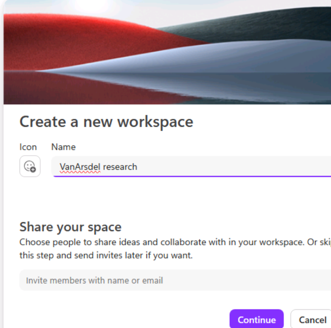
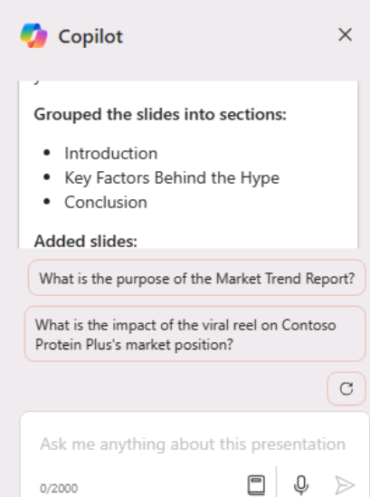

**Laboratorio 02: Empodere a su fuerza de trabajo – Copilot - Ventas**

Copilot para Microsoft 365 funciona como un asistente de escritura
impulsado por inteligencia artificial. Comprende el contexto, sugiere
frases y ayuda a generar contenido, todo lo cual puede mejorar la
calidad de su trabajo. En este laboratorio, usted va a

- Utilizar Copilot en Loop para crear un informe de investigación de
  mercado.

- Utilizar Copilot en PowerPoint para crear y personalizar una
  presentación de ventas.

- Utilizar Copilot en Word para comparar tres acuerdos con proveedores,
  identificar las diferencias y recomendar medidas.

**Ejercicio \#1: Crear un informe de investigación de mercado con
Copilot en Loop**

Usted es el vicepresidente de ventas de VanArsdel Ltd, un fabricante de
componentes de plástico, cuyo mercado principal es la industria de
equipos agrícolas. Sin embargo, la alta dirección está interesada en
introducirse posiblemente en el mercado de la automoción. Dada la fuerte
competencia de los fabricantes de plástico existentes que ya monopolizan
este sector, necesita determinar si hay un espacio disponible para que
su empresa se convierta en un actor viable.

En este ejercicio, utilizará Copilot en Loop para

- Investigar un nuevo mercado potencial de ventas para los productos de
  su empresa y crear un informe de investigación de mercado que describa
  sus conclusiones.

- Cambiar el formato del informe colocando el contenido en una tabla.

- Hacer una recomendación final sobre si su empresa debe entrar en ese
  mercado.

1.  En **Microsoft 365**, seleccione **Loop** si aparece en el panel de
    navegación izquierdo. Si no aparece ahí, entonces seleccione **App
    Launcher** en la parte superior izquierda justo encima del panel de
    navegación de **Mocrosoft 365**.

**Nota**: Si no ve **Loop** en la lista de la página Apps,
seleccione **More
apps**. 

2.  En la página **Apps**, desplácese hacia abajo para
    localizar **Loop** y luego selecciónelo.

3.  Si ve el botón **Sign-in**, inicie sesión utilizando las
    credenciales proporcionadas en la pestaña **Resources** en las
    **credenciales de** **Microsoft 365**.

**Nota**: Después de iniciar sesión, cierre la ventana del navegador
Loop y abra de nuevo Loop desde la página Apps.

4.  En **Microsoft Loop**, la pestaña **Workspaces** aparece por
    defecto. Si desea crear un nuevo workspace para este proyecto,
    seleccione **+** en la parte superior izquierda junto a **Getting
    started**, y luego seleccione el botón **+New workspace**.

5.  En la ventana **Create a new workspace**, ingrese +++VanArsdel
    research+++ como nombre de su workspace y, a continuación seleccione
    el botón **Continue** o **Create** que aparece (dependiendo de su
    versión de Loop).

6.  En la ventana **Add files to your workspace** (dependiendo de su
    versión de Loop, esta ventana puede decir **Workspace Switcher**),
    seleccione **Create**.

7.  Ahora se encuentra en la primera página de su nuevo workspace. El
    nombre de la página es actualmente **Untitled**. Observe que la
    página (Untitled) también aparece en el panel de navegación
    izquierdo. En el cuerpo principal de la página, seleccione el
    campo **Untitled** y cambie el nombre de la página a **Market
    research**. Observe cómo el nombre de la página se actualiza
    automáticamente en el panel de navegación.

8.  En el campo **Just start typing...** ingrese una barra
    diagonal **(/)**.

9.  En el menú desplegable que aparece, en la sección **Copilot**, en la
    parte superior del menú, seleccione **Draft page content**.

10. En la ventana **Copilot** que aparece, observe la fila de botones
    que aparece debajo del campo del prompt. Seleccione cada botón. Al
    hacerlo, observe cómo se rellena el campo del prompt con un ejemplo
    del tipo de tarea en la que Copilot puede ayudarle.

11. Ahora va a ingresar su propio prompt. En el campo prompt, ingrese el
    siguiente prompt y seleccione el icono **Submit**:

+++As the VP for Sales for an OEM in the plastics manufacturing
industry, please research the market for plastic components in the
automotive industry. Provide information on target audience, market
size, competition, trends, regulations, and distribution channels.+++

12. Si recibe un mensaje de error indicando que se ha producido un
    error, copie y pegue el mensaje anterior en el prompt y envíelo de
    nuevo.

13. Revise el informe generado. En lugar de tener toda la información en
    forma de párrafos, prefiere resumirla en una tabla. En el panel
    **Copilot** que aparece, ingrese el siguiente prompt en el campo
    **Rewrite with Copilot** y seleccione el icono **Submit**:

+++Rewrite the report by placing the information in a table.+++

14. Observe cómo Copilot ha cambiado el formato del informe. Ahora desea
    que Copilot haga una recomendación final sobre si entrar en este
    mercado es una opción viable para VanArsdel. Ingrese el siguiente
    prompt:

+++Add a recommendation to the end of the report as to whether we should
move into the market.+++

15. Desplácese hasta la parte inferior del informe y revise la
    recomendación de Copilot.

**Ejercicio \#2: Crear una presentación de ventas utilizando Copilot en
PowerPoint**

Con Copilot en PowerPoint, los profesionales de ventas pueden centrarse
en el contenido de sus presentaciones, mientras que la herramienta se
encarga del diseño y el formato. Puede

- Transformar documentos escritos existentes en presentaciones completas
  con notas para el ponente y fuentes.

- Iniciar una nueva presentación desde un simple prompt o esquema.

- Ayudar a resumir presentaciones, proporcionando un resumen con viñetas
  de los puntos clave para comprender rápidamente el contenido de una
  presentación o compartir las ideas principales con el equipo.

Como director de ventas y marketing de Contoso, Ltd., debe realizar una
presentación ante su equipo de ventas sobre el producto más vendido de
la empresa, el batido Contoso Protein Plus. La presentación debe
analizar el informe sobre las tendencias del mercado que ha elaborado el
equipo de marketing para el producto.

En este ejercicio utilizará Copilot en PowerPoint para crear una
presentación de diapositivas basada en la información del
archivo **Market Trend Report - Protein Shake.docx**, que puede
descargar utilizando el enlace proporcionado.

1.  Si tiene abierta una pestaña de Microsoft 365 en su navegador
    Microsoft Edge, selecciónela ahora; de lo contrario, abra una nueva
    pestaña e ingrese la siguiente URL:
    +++[https://www.office.com+++](https://www.office.com+++/) para ir a
    la página de inicio de Microsoft 365.

**Nota**: Debe iniciar sesión (si se le solicita) utilizando
las **credenciales de Microsoft 365** proporcionadas en la
pestaña **Resources** a la derecha.

2.  Vaya a la carpeta **C:\LabFiles** para seleccionar y cargar una
    copia de **Market Trend Report - Protein Shake** a **OneDrive .**

**Nota**: Si ya ha subido todos los recursos del laboratorio
a **OneDrive** tal y como se indica en la sección **Preparación para la
ejecución del laboratorio** (**Laboratorio 0**), puede omitir este paso.

3.  Abra y cierre el archivo **Market Trend Report - Protein
    Shake.docx** (que ha subido a OneDrive) para que aparezca en la
    lista de archivos usados recentemente (MRU).

4.  En el panel de navegación de **Microsoft 365**,
    seleccione **PowerPoint**. En PowerPoint, abra una nueva
    presentación en blanco.

5.  Seleccione el icono **Copilot** (resaltado en rojo, como se muestra
    en la captura de pantalla). En el panel **Copilot** que aparece, hay
    varios prompts predefinidos entre los que puede elegir. Seleccione
    el prompt **Create presentation from file.**

>  

Por encima del campo de prompt en la parte inferior del
panel **Copilot**, puede aparecer una ventana
denominada **Suggestions** que contiene los tres archivos usados
recientemente. Si el archivo **Market Trend Report - Protein
Shake.docx** aparece en la lista MRU, selecciónelo.

6.  De lo contrario, puede adjuntar el documento de referencia
    utilizando la opción Attach the reference document, como se muestra
    en la captura de
    pantalla. 

**Nota**: También puede adjuntar el documento de referencia mediante el
vínculo al documento. Para obtener el vínculo, abra el archivo
en **Word**, seleccione el botón **Share** situado encima de la cinta,
seleccione la opción **Copy Link** en el menú desplegable y, a
continuación, en este campo de prompt del
panel **Copilot** de **PowerPoint**, pegue el vínculo siguiendo la barra
inclinada (**Create presentation from file /**). Seleccione el
icono **Send**.

7.  Este prompt hizo que Copilot creara una presentación de diapositivas
    basada en el documento. Al hacerlo, primero mostró el esquema de la
    presentación. A continuación, mostró una ventana separada con una
    lista con viñetas de algunos de los cambios que había realizado en
    la presentación basándose en el documento.

8.  Revise las diapositivas una vez que Copilot haya terminado de crear
    la presentación. Para revisar las notas del ponente, seleccione la
    pestaña **View** y, a continuación, seleccione el botón **Notes** si
    aún no está seleccionado. Si ya está seleccionado y no puede ver las
    notas, arrastre la parte inferior de la ventana de la diapositiva
    hacia arriba para mostrarlas. Verifique que las notas del ponente
    incluyen los puntos clave que desea destacar durante la
    presentación.

9.  Seleccione la pestaña **Home** y, a continuación, seleccione el
    botón **Designer**, que aparece a la izquierda del
    botón **Copilot**. El panel **Designer** ofrece ejemplos de
    diferentes diseños para la diapositiva actual que se está mostrando.
    Cambie a una diapositiva diferente de la presentación y observe cómo
    el panel **Designer** genera diferentes opciones de diseño para esa
    diapositiva.

10. Seleccione una de las opciones de diseño para que PowerPoint
    reemplace la diapositiva actual con el nuevo diseño. Esta
    característica no está relacionada con Copilot. Está disponible en
    PowerPoint si tiene una suscripción a Microsoft 365.

11. Ahora veamos qué más puede hacer Copilot. Seleccione el
    botón **Copilot** para abrir el panel **Copilot**. En el
    panel **Copilot**, observe la sección que dice **Here are some
    things you can try**. Copilot proporciona prompts predefinidos que
    puede utilizar para realizar varias tareas en la presentación.
    Seleccione el icono **Ver prompts** y seleccione **Organize your
    thoughts** (resaltado en rojo). **Nota**: Debe desplazarse
    lentamente hacia abajo para localizar el prompt (que se muestra en
    la captura de pantalla).

12. Revise lo que ha hecho Copilot al organizar la presentación. Por
    ejemplo, puede que haya agrupado las diapositivas en secciones y
    luego haya añadido algunas diapositivas nuevas con títulos de
    sección. Si es así, localice las diapositivas nuevas que ha creado y
    revíselas.

13. Por encima del campo del prompt, Copilot muestra preguntas
    relacionadas con la presentación. El propósito de estas preguntas es
    doble. Puede

    - Seleccione una pregunta y Copilot generará una respuesta, que
      podrá copiar y pegar en las notas del orador para la diapositiva
      correspondiente.

    - Cree una diapositiva de preguntas y respuestas (Q&A) y copie y
      pegue las respuestas a todas estas preguntas en las notas del
      ponente.

Al hacerlo, puede utilizar estas preguntas y respuestas para prepararse
para la parte de preguntas y respuestas de la presentación. Por ejemplo,
puede tener un botón que pregunte algo como: ¿Qué causó el aumento de la
demanda de Contoso Protein Plus? O puede preguntar algo como: ¿Cuáles
son los factores clave detrás del éxito de Contoso Protein Plus? Revise
las preguntas que ve y seleccione una de ellas para ver qué sucede.

14. Al seleccionar cualquiera de estas preguntas, Copilot genera una
    respuesta y ofrece la opción **Copy** en la parte inferior de la
    ventana de respuesta. De este modo, puede seleccionar la
    opción **Copy** y pegar la respuesta en las notas del ponente de
    cualquier diapositiva en la que este texto resulte apropiado.
    Pruébelo ahora. Seleccione una pregunta, copie la respuesta, vaya a
    la diapositiva adecuada y, en las notas del ponente,
    presione **Ctrl+V** para pegarla en la nota.

15. Observe el botón **Refresh** que aparece entre las preguntas
    sugeridas y el campo del prompt. Seleccione este botón **Refresh**.

Al hacerlo, observe cómo Copilot ha generado un nuevo conjunto de
preguntas. Puede continuar actualizando las preguntas seleccionando el
botón **Refresh** hasta que vea una pregunta que desee abordar en la
presentación. A continuación, puede seleccionar la pregunta, copiar la
respuesta generada por Copilot y pegarla en las notas del ponente de la
diapositiva que elija. Una vez que Copilot no pueda pensar en ninguna
pregunta nueva que ofrecer, comenzará a repetir la lista de preguntas
desde el principio.

16. Ahora desea que Copilot cree una diapositiva al final de la
    presentación para una sesión de preguntas y respuestas. Ingrese el
    siguiente prompt y seleccione el icono **Send**:

+++Add a slide at the end of the presentation for Q&A.+++

**Nota**: Copilot puede mostrar alguna excepción como la siguiente.

Por favor, intente reformular el prompt o utilice los prompts sugeridos,
como el que aparece a continuación:

17. Seleccione el commando **Add a slide about** e inserte la siguientes
    preguntas y respuestas (Q&A) al final de la presentación (como se
    muestra en la captura de pantalla).

18. Haga clic en **Send** para comprobar qué ocurre.

Copilot ha añadido una diapositive de preguntas y respuestas tal y como
se le ha indicado. Revise la diapositive de preguntas y respuestas que
ha creado Copilot.

19. Revise la diapositiva de preguntas y respuestas que ha creado
    Copilot. Ahora, intente una última cosa. Decida compilar una lista
    de posibles preguntas para las que pueda prepararse durante la
    sesión de preguntas y respuestas (Q&A). Ingrese el siguiente prompt
    para ver si Copilot puede agregar todas las preguntas sugeridas a
    las notas del ponente en la diapositiva de preguntas y respuestas
    (Q&A):

+++In the speaker notes of the Q&A slide that you just created, add a
list of possible questions that may be asked regarding this
presentation.+++

20. Si Copilot muestra un mensaje indicando que no ha podido generar la
    diapositiva, intente introducir el prompt de nuevo. A veces, cuando
    Copilot no puede completar una tarea, es recomendable repetir la
    solicitud.

Si Copilot no puede completar esta tarea, simplemente mostrará un
mensaje indicando que quizá no sea capaz de realizar todo lo solicitado
en este momento. Este escenario es otro ejemplo de una buena práctica
que debe tener presente: comprender las limitaciones de Copilot.

21. Ahora, pruebe esta solución alternativa. Ingrese el siguiente prompt
    que solicita generar una lista de preguntas:

+++What kind of questions do you think participants may ask during the
Q&A session?+++

22. Revise las preguntas creadas por Copilot. Seleccione el
    botón **Copy** en la parte inferior de la ventana y, a continuación,
    péguelas (**Ctrl+V**) en las notas del ponente de la diapositiva de
    preguntas y respuestas (Q&A).

**Nota**: Copilot puede mostrar alguna excepción. Por favor, inténtelo
utilizando los prompts sugeridos en el **paso \#16.**

Aunque los ejercicios restantes de este módulo no utilizan esta
presentación, puede descartarla o guardarla si desea conservar una copia
como referencia futura.

**Ejercicio \#3: Compare los acuerdos con proveedores utilizando Copilot
en Word**

Los vendedores necesitan la información correcta en el momento adecuado
para construir relaciones sólidas con sus clientes, tomar acciones
basadas en datos concretos y cerrar tratos más rápidamente. Copilot en
Word puede ayudarlos incorporando información específica de otros
documentos a su contenido, generando resúmenes, respondiendo preguntas
sobre sus documentos, proporcionando ideas sobre temas específicos, y
transformando texto en tablas u ofreciendo sugerencias para reescribir
contenido.

Usted es el nuevo gerente de ventas de Northwind Traders, proveedor de
diversos productos de abarrotes y bebidas. Le preocupan los acuerdos con
proveedores actualmente vigentes con varios de los principales clientes
de Northwind. Como su predecesor negoció estos acuerdos, no está
familiarizado con los términos y condiciones previamente acordados con
estos clientes.

En este ejercicio, usted va

- Proporcionar Copilot en Word con tres documentos de acuerdo con
  proveedores.

- Solicitar la creación de un informe que compare los términos y
  condiciones negociados con cada cliente.

- Solicitar a Copilot que le proporcione recomendaciones para renegociar
  cada acuerdo.

1.  Si tiene abierta una pestaña de Microsoft 365 en su navegador
    Microsoft Edge, selecciónela ahora; de lo contrario, abra una nueva
    pestaña e ingrese la siguiente
    URL:+++[https://www.office.com+++](https://www.office.com+++/) para
    ir a la página de inicio de Microsoft 365.

> **Nota**: Debe iniciar sesión (si se le solicita) utilizando
> las **credenciales de Microsoft 365** proporcionadas en la
> pestaña **Resources** a la derecha.

2.  Vaya a la carpeta **C:\LabFiles** para seleccionar y cargar una
    copia de los siguientes documentos en OneDrive.

    - **Contoso Supplier Agreement**

    - **Tailwind Traders Supplier Agreement**

    - **Wide World Importers Supplier Agreement**

> **Nota**: Puede omitir este paso si ya ha cargado una copia de todos
> los documentos (que utilizará en esta sesión práctica de laboratorio
> desde **C:\LabFiles**, tal y como se indica en el **Laboratorio 0**).

3.  En este ejercicio, accederá a los documentos desde la lista de
    archivos usados recientemente. Para que los archivos aparezcan en la
    lista MRU, abra cada documento y, a continuación, ciérrelo. Abra y
    cierre cada uno de los tres archivos de su cuenta de OneDrive.

4.  En **Microsoft 365**, y, a continuación **Microsoft Word,** abra un
    nuevo documento en blanco.

5.  En la ventana **Draft with Copilot** que aparece en la parte
    superior del documento en blanco, ingrese el siguiente prompt:

+++I'm the Sales Manager for Northwind Traders, a supplier of various
grocery and beverage products. Please create a report that compares the
supplier agreements for three of our customers. Provide a recommendation
on contract renewals that can provide Northwind Traders with more
favorable terms. The supplier agreements for these three customers are
attached. Thank you!+++

Ahora debe adjuntar los tres acuerdos de proveedor al prompt. En la
ventana **Draft with Copilot**, seleccione el botón **Reference your
content**. En el menú desplegable que aparece, si **Contoso Supplier
Agreement **aparece en la lista de archivos, selecciónelo. De lo
contrario, seleccione **Browse files from cloud**, seleccione **Contoso
Supplier Agreement** en la lista de archivos **Recent** y, a
continuación, seleccione el botón **Attach**. Observe cómo se muestra el
archivo en el prompt.

Repita el paso anterior tanto para **Tailwind Traders Supplier
Agreement** como para **Wide World Importers Supplier Agreement**. En
este punto, los enlaces a los tres archivos deberían aparecer en el
prompt.

6.  Seleccione **Generate**. En este punto, Copilot extrae la
    información pertinente de los tres borradores de los acuerdos con
    los proveedores y redacta un informe en el que los compara.

7.  Después de revisar el documento comparativo, no está satisfecho con
    los resultados. Le gustaría que Copilot lo intentara de nuevo y
    generara una nueva versión. En la ventana de Copilot que aparece al
    final del documento, seleccione el botón **Regenerate**, que aparece
    junto al botón **Keep it**. Puede repetir este paso tantas veces
    como sea necesario hasta que Copilot cree una versión de este
    informe que usted apruebe. Para este ejercicio, repita este paso
    varias veces para ver los distintos formatos que ofrece Copilot.
    Observe también cómo cierta información puede aparecer en una
    versión del informe y no en otras.

Cuando esté satisfecho con una versión del informe, seleccione el
botón **Keep it**.

8.  Una vez que haya terminado con este documento, guárdelo en
    su **OneDrive** para poder cerrar esta pestaña en su navegador
    Microsoft Edge.

**Resumen:**

En este laboratorio, ha explorado las características de Copilot para
Microsoft 365 como asistente de redacción con inteligencia artificial y

- Utilizó Copilot en Loop para redactar un informe detallado de
  investigación de mercado que implicaba organizar datos, generar ideas
  y crear un informe coherente e informativo.

- Aprovechó Copilot en PowerPoint para diseñar una presentación de
  ventas atractiva con el fin de generar diapositivas, personalizar el
  contenido y garantizar que la presentación comunicara eficazmente los
  mensajes clave de ventas.

- Utilizó Copilot en Word para analizar y comparar tres acuerdos con
  proveedores con el fin de identificar las diferencias entre ellos y
  proporcionar recomendaciones basadas en la comparación.
