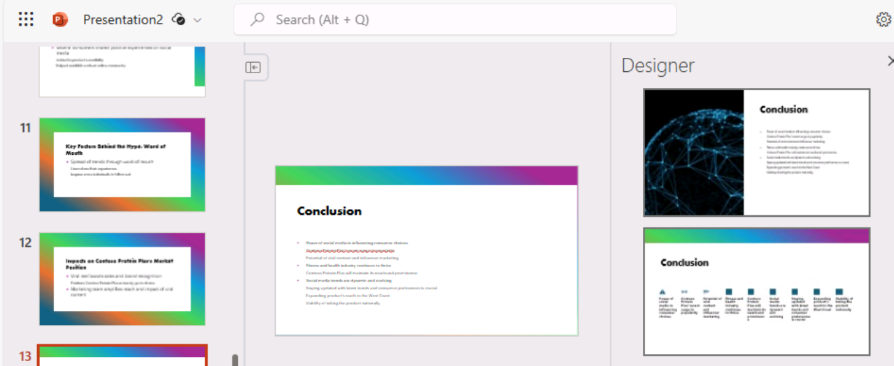
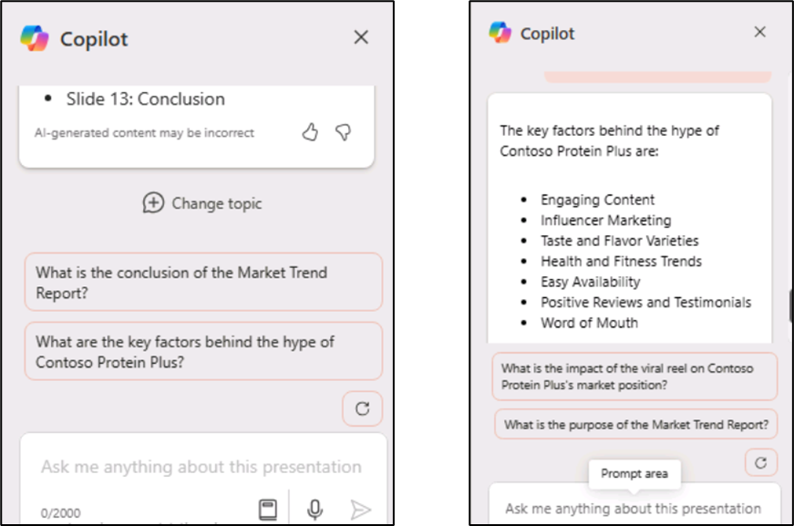
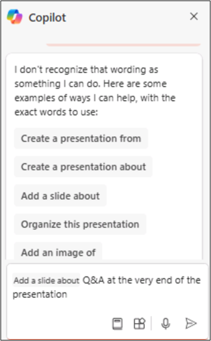

**實驗 02：增強您的員工能力 – Copilot – 銷售**

適用於 Microsoft 365 的 Copilot 用作 AI
驅動的寫作助手。它理解上下文、建議短語並幫助生成內容，所有這些都可以提高您的工作質量。在本實驗中，您將

- 使用 Copilot in Loop 創建市場研究報告。

- 在 PowerPoint 中使用 Copilot 創建和自定義銷售演示文稿。

- 在 Word 中使用 Copilot 比較三個供應商協議，確定差異並提供建議的作。

**練習 \#1：使用 Copilot in Loop 創建市場研究報告**

您是 VanArsdel Ltd 的銷售副總裁，這是一家塑料部件
OEM，其主要市場是農業設備行業。然而，高級領導層對可能進入汽車市場感興趣。鑒於來自已經壟斷該行業的現有塑料製造商的激烈競爭，您需要確定您的公司是否有空間成為可行的參與者。

在本練習中，您將使用 Copilot in Loop 來

- 為您公司的產品研究潛在的新銷售市場，並創建一份市場研究報告來概述其發現。

- 通過將內容放在表中來更改報告的格式。

- 就您的公司是否應該進入該市場提出最終建議。

1.  在 **Microsoft 365** 中，如果它出現在左側導航窗格中，請選擇
    **Loop**。如果它沒有出現在那裡，請選擇 **Mocrosoft 365**
    導航窗格上方左上角的 **App Launcher**,

**注意：**如果您在 Apps 頁面中沒有看到 **Loop** 列出，請選擇 **More apps**。 

2.  在 **Apps** （應用程序） 頁面中，向下滾動以找到 **Loop**
    （循環），然後選擇它。

3.  如果您看到 **Sign-in** （登錄） 按鈕，請使用 **Resources** （資源）
    選項卡中的 **Microsoft 365 Credentials** （365 憑據）
    下提供的憑據登錄。

**注意：**登錄後，關閉 Loop 瀏覽器窗口，然後再次從 Apps 頁面打開 Loop。

4.  在 **Microsoft Loop** 中，默認情況下會顯示 **Workspaces**
    選項卡。要為此項目創建新工作區，請選擇 “**Getting started**”
    旁邊的左上角的 “+” ，然後選擇 **“+New workspace**” 按鈕。

5.  在 **Create a new workspace** （創建新工作區） 窗口中，輸入
    +++VanArsdel research+++ 作為工作區名稱，然後選擇顯示的 **Continue**
    （繼續） 或 **Create** （創建） 按鈕（具體取決於您的 Loop 版本）。

6.  在 **Add files to your workspace** （將文件添加到工作區）
    窗口中（根據您的 Loop 版本，此窗口可能會顯示 **Workspace
    Switcher**），選擇 **Create** （創建）。

7.  您現在位於新工作區的第一頁。頁面名稱當前為
    **Untitled**。請注意，頁面 （Untitled）
    也顯示在左側導航窗格中。在頁面的主體中，選擇 **Untitled**
    字段，然後將頁面名稱更改為 **Market
    research**。請注意頁面名稱在導航窗格中的自動更新方式。

8.  在 **Just start typing...**字段中，輸入正斜杠 **（/）**。

9.  在顯示的下拉菜單中，在菜單頂部的 **Copilot** 部分下，選擇 **Draft
    page content**。

10. 在出現的 **Copilot**
    窗口中，請注意提示字段下方顯示的一行按鈕。選擇每個按鈕。執行此作時，請注意它如何使用
    Copilot 可以協助的任務類型的示例預填充提示字段。

11. 您現在要輸入自己的提示符。在提示字段中，輸入以下提示，然後選擇
    **Submit** 圖標：

+++As the VP for Sales for an OEM in the plastics manufacturing
industry, please research the market for plastic components in the
automotive industry. Provide information on target audience, market
size, competition, trends, regulations, and distribution channels.+++

12. 如果您收到一條錯誤消息，指出出現問題，請複製並粘貼之前的提示，然後再次提交。

13. 查看生成的報告。與其以段落形式顯示所有信息，不如將其匯總到表格中。在顯示的
    **Copilot** 窗格中，在 **Rewrite with Copilot**
    字段中輸入以下提示，然後選擇 **Submit** 圖標：

+++Rewrite the report by placing the information in a table.+++

14. 請注意 Copilot 如何更改報告的格式。您現在希望 Copilot
    就進入這個市場是否是 VanArsdel
    的可行選擇提出最終建議。輸入以下提示：

+++Add a recommendation to the end of the report as to whether we should
move into the market.+++

15. 滾動到報告底部並查看 Copilot 的建議。

**練習 \#2：在 PowerPoint 中使用 Copilot 創建銷售演示文稿**

使用 PowerPoint 中的
Copilot，銷售專業人員可以專注於他們的演示文稿內容，而該工具則負責設計和格式設置。它可以

- 將現有的書面文檔轉換為演示文稿，並配有演講者筆記和來源

- 從簡單的提示或大綱開始新的演示文稿。

- 幫助總結演示文稿，提供關鍵點的項目符號摘要，以便快速理解演示文稿的內容或與團隊分享主要思想。

作為 Contoso， Ltd.
的銷售和營銷總監，您需要向您的銷售團隊介紹該公司最暢銷的產品 Contoso
Protein Plus
奶昔。該演示文稿應分析您的營銷團隊為產品創建的市場趨勢報告。

在本練習中，您將使用 PowerPoint 中的 Copilot 根據 **Market Trend
Report - Protein Shake.docx**
文件中的信息創建幻燈片演示文稿，您可以使用提供的鏈接下載該文件。

1.  如果您在 Microsoft Edge 瀏覽器中打開了 Microsoft 365
    選項卡，請立即選擇它; 否則，請打開一個新選項卡並輸入以下 URL：
    +++[https://www.office.com+++](https://www.office.com+++/) 以轉到
    Microsoft 365 主頁。

**注意：**您需要使用右側 “**Resources**” 選項卡下提供的 **Microsoft 365
憑據**登錄（如果出現提示）。

2.  瀏覽到 C：\LabFiles 文件夾以選擇 **Market Trend Report - Protein
    Shake** 的副本並將其上傳到 **OneDrive**

**注意：**如果您已按照**準備實驗室執行**部分**（實驗
0）**中的說明將所有實驗室資產上傳到 **OneDrive，**則可以跳過此步驟。

3.  打開並關閉文件 **Market Trend Report - Protein
    Shake.docx**（已上傳到 OneDrive），將其放入 Most Recently Used
    （MRU） 文件列表中

4.  在 **Microsoft 365** 導航窗格中，選擇 **PowerPoint**。在 PowerPoint
    中，打開一個新的空白演示文稿。

5.  選擇 **Copilot** 圖標（以紅色突出顯示，如屏幕截圖所示）。在顯示的
    **Copilot** 窗格中，有幾個預定義的提示可供您選擇。選擇 **Create
    presentation from file** 提示。 
    

    

    

在 **Copilot** 窗格底部的提示字段上方，可能會出現一個 **建議**
窗口，其中包含最近使用的三個文件。如果 **Market Trend Report - Protein
Shake.docx** 文件顯示在 MRU 列表中，然後選擇它。

6.  否則，您可以使用 Attach cloud files
    選項附加參考文檔，如屏幕截圖所示。 
    

    

**注：** 您也可以使用文檔鏈接附加參考文檔。若要獲取鏈接，請在 **Word**
中打開文件，選擇功能區上方的**“Share”**按鈕，從下拉菜單中選擇**“Copy
Link ”**選項，然後在 **PowerPoint** 的 **Copilot**
窗格的此提示字段中，粘貼正斜杠後面的鏈接**（Create presentation from
file /）。**選擇 **Send** 圖標。

7.  此提示觸發 Copilot
    根據文檔創建幻燈片演示文稿。在此過程中，它首先顯示演示文稿的大綱。然後，它顯示一個單獨的窗口，其中顯示了它根據文檔對演示文稿所做的一些更改的項目符號列表。

8.  Copilot 完成創建演示文稿後查看幻燈片。要查看演講者備註，請選擇
    **View** （查看） 選項卡，然後選擇 **Notes** （備註）
    按鈕（如果尚未選擇）。如果已選中該窗口，但您看不到注釋，則向上拖動幻燈片窗口的底部以顯示注釋。驗證演講者注釋是否包含您希望在演示期間提出的關鍵點。

9.  選擇 “**Home**” 選項卡，然後選擇 “**Designer**” 按鈕，該按鈕顯示在
    **Copilot** 按鈕的左側。**Designer** （設計器）
    窗格為當前顯示的幻燈片提供不同設計的示例。在演示文稿中更改為其他幻燈片，並注意
    **Designer** 窗格如何為該幻燈片生成不同的設計選項。

10. 選擇其中一個設計選項，讓 PowerPoint
    將當前幻燈片替換為新設計。此功能與 Copilot 無關。當您擁有 Microsoft
    365 訂閱時，它會在 PowerPoint 中可用。

11. 現在讓我們看看 Copilot 還可以做什麼。選擇 **Copilot** 按鈕以打開
    **Copilot** 窗格。在 **Copilot** 窗格中，請注意 **Here are some
    things you can try** 的部分。Copilot
    提供預構建的提示，您可以使用這些提示在演示文稿上執行多項任務。選擇
    **View Prompts** 圖標，然後選擇 **Organize your thoughts** （in red
    highlight） 。**請注意**：
    您需要慢慢向下滾動才能找到提示（如屏幕截圖所示）

12. 回顧一下 Copilot
    在組織演示時所做的工作。例如，它可能已將幻燈片分組為多個部分，然後添加了一些新的部分標題幻燈片。如果是這樣，請找到它創建的新幻燈片並查看它們。

13. 在提示字段上方，Copilot
    顯示與演示文稿相關的問題。這些問題的目的有兩個。您可以

    - 選擇一個問題並讓 Copilot
      生成答案，然後您可以將其複製並粘貼到適用幻燈片的演講者備註中。

    - 創建問題與答案 （Q&A）
      幻燈片，並在演講者備註中複製並粘貼所有這些問題的答案。

在此過程中，您可以使用這些問題和答案來準備演示文稿的 Q&A
部分。例如，它可能有一個按鈕，詢問如下內容：**What caused the rise in
demand for Contoso Protein Plus?** 或者它可能會問這樣的事情：**What are
the key factors behind the hype of Contoso Protein Plus?**
查看您看到的問題，然後選擇其中一個問題以查看會發生什麼。

14. 當您選擇這些問題中的任何一個時，Copilot
    會生成問題的答案，並在答案窗口底部提供 **Copy**
    選項。為此，您可以選擇 **Copy** （複製）
    選項，然後將此答案粘貼到任何幻燈片的演講者備註中，此文本將在其中作為適當的備註。現在就試試吧。選擇一個問題，複製答案，然後轉到相應的幻燈片，然後在演講者備註中輸入
    **Ctrl+V** 以粘貼到備註中。

15. 請注意顯示在建議問題和提示字段之間的 **Refresh** （刷新）
    按鈕。選擇此 **Refresh** （刷新） 按鈕。

在此過程中，請注意 Copilot 如何生成一組新問題。您可以通過選擇
**Refresh** （刷新）
按鈕繼續刷新問題，直到您在演示文稿中看到要解決的問題。然後，您可以選擇問題，複製
Copilot 生成的答案，並將其粘貼到您選擇的幻燈片的演講者備註中。一旦
Copilot 想不出任何新問題可以提供，它就會從頭開始重複問題列表。

16. 您現在希望 Copilot
    在演示文稿結束時為問答環節創建一張幻燈片。輸入以下提示，然後選擇
    **Send** 圖標：

+++Add a slide at the end of the presentation for Q&A.+++

**注意：**Copilot 可能會顯示一些異常，如下所示。

請嘗試改寫提示或使用建議的提示，如下所示：

17. 選擇命令 **Add a slide about** 並在演示文稿的最後附加以下
    Q&A（如屏幕截圖所示）。

18. 單擊 **Send** 以檢查會發生什麼。

Copilot 已按照說明添加了 Q&A 幻燈片。查看 Copilot 創建的問答幻燈片。

19. 查看 Copilot
    創建的問答幻燈片。現在嘗試最後一件事。您決定編制一份潛在問題列表，以便在
    Q&A 會話期間準備這些問題。輸入以下提示，查看 Copilot
    是否可以將其所有建議的問題添加到問答幻燈片上的演講者備註中：

+++In the speaker notes of the Q&A slide that you just created, add a
list of possible questions that may be asked regarding this
presentation.+++

20. 如果 Copilot
    返回一條消息，指示它無法生成幻燈片，請嘗試再次輸入提示。有時，當
    Copilot 無法完成任務時，一個好的做法是重複請求。

如果 Copilot
無法完成此任務，則它只是表明它此時可能無法完成您想要的所有任務。此方案是您需要注意的最佳實踐的另一個示例：瞭解
Copilot 的限制。

21. 現在嘗試此解決方法。輸入以下提示，要求它生成問題列表：

+++What kind of questions do you think participants may ask during the
Q&A session?+++

22. 查看 Copilot 創建的問題。選擇窗口底部的 **Copy**
    按鈕，然後將它們粘貼 （**Ctrl+V**） 到 Q&A 幻燈片的演講者備註中。

**注意：**Copilot 可能會顯示一些異常。請嘗試使用**步驟 \#16**
中建議的提示

雖然本模塊中的其餘訓練練習不使用此演示文稿，但您可以放棄它或保存它（如果您保留副本以備將來參考）。

**練習 \#3：在 Word 中使用 Copilot 比較供應商協議**

銷售人員需要在正確的時間獲得正確的信息，以便與客戶建立牢固的關係，根據洞察採取行動，並更快地達成交易。Word
中的 Copilot
可以幫助他們將其他文檔中的特定信息引入其內容、生成摘要、詢問有關其文檔的問題、提供有關特定主題的想法以及將文本轉換為表格，或提供重寫內容的方法建議。

您是 Northwind Traders 的新銷售經理，Northwind Traders
是各種雜貨和飲料產品的供應商。您擔心目前與 Northwind
的幾個頂級客戶簽訂的供應商協議。您的前任協商了這些協議，因此您不熟悉之前與這些客戶商定的條款和條件。

在本練習中，您將

- 在 Word 中向 Copilot 提供三份供應商協議文檔。

- 請 IT 部門創建一份報告，以比較與每位客戶協商的條款和條件。

- 要求 Copilot 為重新協商每個協議提供建議。

1.  如果您在 Microsoft Edge 瀏覽器中打開了 Microsoft 365
    選項卡，請立即選擇它; 否則，請打開一個新選項卡並輸入以下
    URL：+++[https://www.office.com+++](https://www.office.com+++/) 以轉到
    Microsoft 365 主頁。

> **注意：**您需要使用右側 “**Resources**” 選項卡下提供的 **Microsoft
> 365 憑據**登錄（如果出現提示）。

2.  瀏覽到 **C：\LabFiles** 文件夾，選擇以下文檔的副本並將其上傳到
    OneDrive。

    - **Contoso 供應商協議**

    - **Tailwind Traders 供應商協議**

    - **Wide World Importers 供應商協議**

> **注意：**如果您已經上傳了所有文檔的副本（您將按照**實驗室 0**
> 中的說明從 **C：\LabFiles** 進行此動手實驗會話），則可以跳過此步驟。

3.  在本練習中，您將從 Most Recently Used file （最近使用的文件）
    列表中訪問文檔。若要使文件顯示在 MRU
    列表中，請打開每個文檔，然後將其關閉。打開和關閉 OneDrive
    帳戶中的三個文件。

4.  在 **Microsoft 365** 中，打開 **Microsoft
    Word**，然後打開一個新的空白文檔。

5.  在空白文檔頂部顯示的 **Draft with Copilot** （使用 Copilot 起草）
    窗口中，輸入以下提示：

+++I'm the Sales Manager for Northwind Traders, a supplier of various
grocery and beverage products. Please create a report that compares the
supplier agreements for three of our customers. Provide a recommendation
on contract renewals that can provide Northwind Traders with more
favorable terms. The supplier agreements for these three customers are
attached. Thank you!+++

現在，您必須將 3 個供應商協議附加到提示符中。在 **Draft with
Copilot**窗口中，選擇 **Reference your content**
按鈕。在顯示的下拉菜單中，如果 **Contoso Supplier Agreement** （Contoso
供應商協議） 顯示在文件列表中，請選擇它。否則，請選擇“**Browse files
from cloud**”，從“**最近**使用的文件”列表中選擇“**Contoso Supplier
Agreement**”，然後選擇“**Attach**
”按鈕。請注意文件在提示符中的顯示方式。

對 **Tailwind Traders 供應商協議**和 **Wide World Importers
供應商協議**重複上一步。此時，提示符中應包含指向所有三個文件的鏈接。

6.  選擇 **Generate** （生成）。此時，Copilot
    從三個供應商協議中提取相關信息，起草一份報告進行比較。

7.  查看比較文檔後，您對結果不滿意。您希望看到 Copilot
    重試並生成新版本。在文檔末尾顯示的 Copilot
    窗口中，選擇“**Regenerate**”按鈕，該按鈕顯示在“**Keep
    it**”按鈕旁邊。您可以根據需要多次重複此步驟，直到 Copilot
    創建您批准的此報告版本。對於本練習，請多次重複此步驟以查看 Copilot
    提供的各種格式。另請注意，某些信息可能包含在一個版本的報表中，而其他版本中沒有。

對報表的某個版本感到滿意後，請選擇 **Keep it** （保留） 按鈕。

8.  完成此文檔後，將其保存到 **OneDrive**，以便您可以在 Microsoft Edge
    瀏覽器中關閉此選項卡。

**總結:**

在本實驗中，您探索了 Copilot for Microsoft 365 作為 AI
驅動的寫作助手的功能，以及

- 利用 Copilot in Loop
  起草了一份詳細的市場研究報告，其中包括組織數據、生成見解以及創建有凝聚力且信息豐富的報告。

- 利用 PowerPoint 中的 Copilot
  設計引人注目的銷售演示文稿，以生成幻燈片、自定義內容並確保演示文稿有效地傳達關鍵銷售信息。

- 在 Word 中使用 Copilot
  分析和比較三個供應商協議，以確定協議之間的差異，並根據比較提供建議的作。
