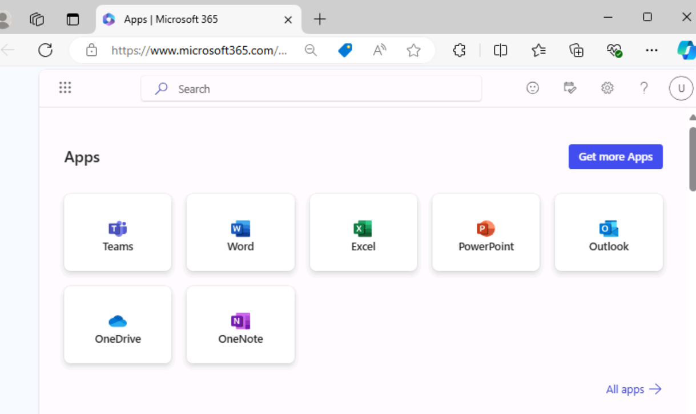
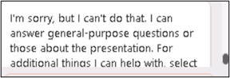
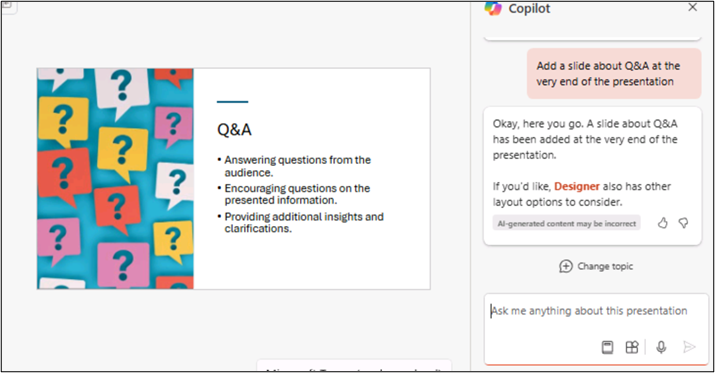
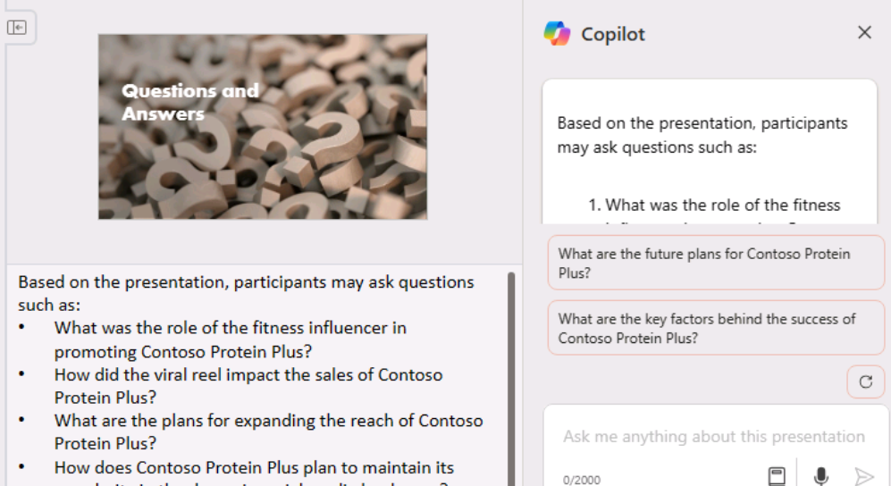

**Lab 02 : Responsabilisez votre personnel – Copilot - Ventes**

Copilot pour Microsoft 365 sert d'assistant d'écriture alimenté par
l'IA. Il comprend le contexte, suggère des phrases et aide à générer du
contenu, ce qui peut améliorer la qualité de votre travail. Dans cet
atelier, vous allez

- Utilisez Copilot in Loop pour créer un rapport d'étude de marché.

- Utilisez Copilot dans PowerPoint pour créer et personnaliser une
  présentation commerciale.

- Utilisez Copilot dans Word pour comparer trois contrats de
  fournisseurs, identifier les différences et fournir des actions
  recommandées.

**Exercice \#1 : Créer un rapport d'étude de marché à l'aide de Copilot
in Loop**

Vous êtes le Vice-Président des ventes de VanArsdel Ltd, un
équipementier de composants en plastique, dont le marché principal est
l'industrie de l'équipement agricole. Cependant, la haute direction est
intéressée par un éventuel passage au marché de l'automobile. Compte
tenu de la forte concurrence des fabricants de plastique existants qui
monopolisent déjà ce secteur, vous devez déterminer s'il y a un espace
disponible pour que votre entreprise devienne un acteur viable.

Dans cet exercice, vous allez utiliser Copilot in Loop pour

- Recherchez un nouveau marché de vente potentiel pour les produits de
  votre entreprise et créez un rapport d'étude de marché qui décrit ses
  conclusions.

- Modifiez le format du rapport en plaçant le contenu dans un tableau.

- Faites une recommandation finale quant à savoir si votre entreprise
  devrait s'implanter sur ce marché.

1.  Dans **Microsoft 365**, sélectionnez **Loop** s'il apparaît dans le
    volet de navigation de gauche. S'il n'y apparaît pas, sélectionnez
    **App Launcher** en haut à gauche, juste au-dessus du volet de
    navigation **de Mocrosoft 365**,

**Remarque** : Si vous ne voyez pas **Loop** répertoriée dans la page
Applications, sélectionnez **More Apps**.

2.  Sur la page **Apps**, faites défiler l'écran vers le bas pour
    localiser **Loop**, puis sélectionnez-le.

3.  Si vous voyez le bouton **Sign-in,** sign-in à l'aide des
    informations d'identification fournies sous **Microsoft 365
    Credentials** dans l'onglet **Resources**.

**Remarque** : Une fois connecté, fermez la fenêtre du navigateur Loop
et ouvrez à nouveau Loop à partir de la page Applications.

4.  Dans **Microsoft Loop**, l'onglet **Workspaces** s'affiche par
    défaut. Vous souhaitez créer un espace de travail pour ce projet,
    sélectionnez **+** en haut à gauche à côté de **Getting started**,
    puis sélectionnez le bouton **+ New workspace**.

5.  Dans la fenêtre **Create a new workspace**, entrez +++VanArsdel
    research+++ pour le nom de votre espace de travail, puis
    sélectionnez le bouton **Continue** ou **Create** qui s'affiche
    (selon votre version de Loop).

6.  Dans la fenêtre **Add files to your workspace** (selon votre version
    de Loop, cette fenêtre peut indiquer **Workspace Switcher**),
    sélectionnez **Create**.

7.  Vous êtes maintenant sur la première page de votre nouvel espace de
    travail. Le nom de la page est actuellement **Untitled**. Notez que
    la page (Sans titre) apparaît également dans le volet de navigation
    de gauche. Dans le corps principal de la page, sélectionnez dans le
    champ **Untitled** et remplacez le nom de la page par **Market
    research**. Notez que le nom de la page est automatiquement mis à
    jour dans le volet de navigation.

8.  Dans la section **Just start typing...**, entrez une barre oblique
    **(/).**

9.  Dans le menu déroulant qui s'affiche, sous la section **Copilot** en
    haut du menu, sélectionnez **Draft page content**.

10. Dans la fenêtre **Copilot** qui s'affiche, notez la rangée de
    boutons qui apparaît sous le champ d'invite. Sélectionnez chaque
    bouton. Ce faisant, notez comment il pré-remplit le champ d'invite
    avec un exemple du type de tâche pour laquelle Copilot peut aider.

11. Vous allez maintenant entrer votre propre invite. Dans le champ
    d'invite, entrez l'invite suivante et sélectionnez l'icône
    **Submit** :

+++As the VP for Sales for an OEM in the plastics manufacturing
industry, please research the market for plastic components in the
automotive industry. Provide information on target audience, market
size, competition, trends, regulations, and distribution
channels.+++

12. Si vous recevez un message d'erreur indiquant que quelque chose
    s'est mal passé, copiez et collez l'invite précédente et
    soumettez-la à nouveau.

13. Examinez le rapport généré. Plutôt que d'avoir toutes les
    informations sous forme de paragraphe, vous préférez les résumer
    dans un tableau. Dans le volet **Copilot** qui s'affiche, entrez
    l'invite suivante dans le champ **Rewrite with Copilot** et
    sélectionnez l'icône **Submit** :

+++Rewrite the report by placing the information in a table.+++

14. Notez comment Copilot a modifié la mise en forme du rapport. Vous
    souhaitez maintenant que Copilot fasse une recommandation finale
    quant à savoir si l'entrée sur ce marché est une option viable pour
    VanArsdel. Entrez l'invite suivante :

+++Add a recommendation to the end of the report as to whether we should
move into the market.+++

15. Faites défiler vers le bas du rapport et passez en revue la
    recommandation de Copilot.

**Exercice \#2 : Créer une présentation de vente à l'aide de Copilot
dans PowerPoint**

Avec Copilot dans PowerPoint, les professionnels de la vente peuvent se
concentrer sur le contenu de leurs présentations, tandis que l'outil
s'occupe de la conception et de la mise en forme. C'est possible :

- Transformez des documents écrits existants en présentations complètes
  avec des notes du présentateur et des sources

- Démarrez une nouvelle présentation à partir d'une simple invite ou
  d'un plan.

- Aidez à résumer les présentations, en fournissant un résumé à puces
  des points clés pour comprendre rapidement le contenu d'une
  présentation ou partager les idées principales avec l'équipe.

En tant que directeur des ventes et du marketing chez Contoso, Ltd.,
vous devez faire une présentation à votre équipe commerciale concernant
le produit le plus vendu de l'entreprise, le shake Contoso Protein Plus.
La présentation doit analyser le rapport sur les tendances du marché que
votre équipe marketing a créé pour le produit.

Dans cet exercice, vous allez utiliser Copilot dans PowerPoint pour
créer votre diaporama basé sur les informations du fichier **Market
Trend Report - Protein Shake.docx**, que vous téléchargez à l'aide du
lien fourni.

1.  Si un onglet Microsoft 365 est ouvert dans votre navigateur
    Microsoft Edge, sélectionnez-le maintenant ; sinon, ouvrez un nouvel
    onglet et entrez l'URL suivante :
    +++[https://www.office.com+++++](https://www.office.com+++/) pour
    accéder à la page d'accueil de Microsoft 365.

**Remarque** : Vous devez vous connecter (si vous y êtes invité) à
l'aide des **Microsoft 365 Credentials** fournies sous l'onglet
**Resources** à droite.

2.  Accédez au dossier **C:\LabFiles** pour sélectionner et télécharger
    une copie de **Market Trend Report - Protein Shake** sur
    **OneDrive**

**Remarque** : Si vous avez déjà téléchargé toutes les ressources de
labo sur **OneDrive** comme indiqué dans la section **Preparing for the
lab execution** (**Lab 0**), vous pouvez ignorer cette étape.

3.  Ouvrez et fermez le fichier **Market Trend Report - Protein
    Shake.docx** (que vous avez téléchargé sur OneDrive) pour l'obtenir
    dans votre liste de fichiers les plus récemment utilisés (MRU)

4.  Dans le volet de navigation **Microsoft 365**, sélectionnez
    **PowerPoint**. Dans PowerPoint, ouvrez une nouvelle présentation
    vierge.

5.  Sélectionnez l'icône **Copilot** (en surbrillance rouge comme
    indiqué dans la capture d'écran). Dans le volet **Copilot** qui
    s'affiche, vous pouvez choisir parmi plusieurs invites prédéfinies.
    Sélectionnez l’invite **Create presentation from file**.
    

Au-dessus du champ d'invite en bas du volet **Copilot**, une fenêtre
**Suggestions** peut s'afficher et contenir les trois derniers fichiers
utilisés. Si le fichier **Market Trend Report - Protein Shake.docx**
apparaît dans la liste MRU, sélectionnez-le.

6.  Sinon, vous pouvez joindre le document de référence à l'aide de
    l'option Joindre des fichiers cloud, comme indiqué dans la capture
    d'écran.
    

**Remarque** : Vous pouvez également joindre le document de référence en
utilisant le lien vers le document. Pour obtenir le lien, ouvrez le
fichier dans **Word**, sélectionnez le bouton **Partager** au-dessus du
ruban, sélectionnez l'option **Copy Link** dans le menu déroulant, puis
dans ce champ d'invite dans le volet **Copilot** de **PowerPoint**,
collez le lien suivant la barre oblique (**Create presentation from file
/**). Sélectionnez l'icône **Send**.

7.  Cette invite a incité Copilot à créer une présentation de
    diapositives basée sur le document. Ce faisant, il a d'abord affiché
    les grandes lignes de la présentation. Ensuite, il a affiché une
    fenêtre distincte montrant une liste à puces de certaines des
    modifications qu'il a apportées à la présentation en fonction du
    document.

8.  Passez en revue les diapositives une fois que Copilot a terminé de
    créer la présentation. Pour consulter les notes du présentateur,
    sélectionnez l’onglet **View**, puis le bouton **Notes** s'il n'est
    pas déjà sélectionné. S'il est déjà sélectionné et que vous ne
    pouvez pas voir les notes, faites glisser le bas de la fenêtre de la
    diapositive vers le haut pour afficher les notes. Vérifiez que les
    notes du présentateur incluent les points clés que vous souhaitez
    aborder pendant la présentation.

9.  Sélectionnez l’onglet **Home**, puis le bouton **Designer**, qui
    apparaît à gauche du bouton **Copilot**. Le volet **Designer**
    propose des exemples de différents modèles pour la diapositive
    actuelle affichée. Passez à une autre diapositive de la présentation
    et notez comment le volet **Designer** génère différentes options de
    conception pour cette diapositive.

10. Sélectionnez l'une des options de conception pour que PowerPoint
    remplace la diapositive actuelle par la nouvelle conception. Cette
    fonctionnalité n'est pas liée à Copilot. Il est disponible dans
    PowerPoint lorsque vous disposez d'un abonnement Microsoft 365.

11. Voyons maintenant ce que Copilot peut faire d'autre. Sélectionnez le
    bouton **Copilot** pour ouvrir le volet **Copilot**. Dans le volet
    **Copilot**, notez la section qui indique **Here are some things you
    can try**. Copilot fournit des invites prédéfinies que vous pouvez
    utiliser pour effectuer plusieurs tâches sur la présentation.
    Sélectionnez l’icône **View Prompts**, puis sélectionnez **Organize
    your thoughts** (en surbrillance rouge). **Remarque** : Vous devez
    faire défiler lentement vers le bas pour localiser l'invite
    (illustrée dans la capture d'écran)

12. Passez en revue ce que Copilot a fait pour organiser la
    présentation. Par exemple, il peut avoir regroupé les diapositives
    en sections, puis ajouté de nouvelles diapositives de titre de
    section. Si c'est le cas, localisez les nouvelles diapositives qu'il
    a créées et examinez-les.

13. Au-dessus du champ d'invite, Copilot affiche les questions liées à
    la présentation. L'objectif de ces questions est double. Vous pouvez

    - Sélectionnez une question et demandez à Copilot de générer une
      réponse, que vous pouvez ensuite copier et coller dans les notes
      du présentateur pour une diapositive applicable.

    - Créez une diapositive de questions et réponses (Q&R) et
      copiez-collez les réponses à toutes ces questions dans les notes
      du présentateur.

Ce faisant, vous pouvez utiliser ces questions et réponses pour vous
préparer à la partie questions-réponses de la présentation. Par exemple,
il peut comporter un bouton qui demande par exemple : **What caused the
rise in demand for Contoso Protein Plus**? Il peut également poser la
question suivante : **What caused the rise in demand for Contoso Protein
Plus**? Passez en revue les questions que vous voyez et sélectionnez-en
une pour voir ce qui se passe.

14. Lorsque vous sélectionnez l'une de ces questions, Copilot génère une
    réponse à la question et propose une option **Copy** en bas de la
    fenêtre de réponse. Ce faisant, vous pouvez sélectionner l'option
    **Copy,** puis coller cette réponse dans les notes du présentateur
    pour toute diapositive dans laquelle ce texte ferait une note
    appropriée. Essayez-le maintenant. Sélectionnez une question, copiez
    la réponse, puis accédez à une diapositive appropriée et, dans les
    notes du présentateur, entrez **Ctrl+V** pour coller la note.

15. Notez le bouton **Refresh** qui apparaît entre les questions
    suggérées et le champ d'invite. Sélectionnez ce bouton **Refresh**.

Ce faisant, notez comment Copilot a généré une nouvelle série de
questions. Vous pouvez continuer à actualiser les questions en
sélectionnant le bouton **Refresh** jusqu'à ce que vous voyiez une
question que vous souhaitez aborder dans la présentation. Vous pouvez
ensuite sélectionner la question, copier la réponse générée par Copilot
et la coller dans les notes du présentateur de la diapositive de votre
choix. Une fois que Copilot ne trouve plus de nouvelles questions à
proposer, il commence à répéter la liste de questions depuis le début.

16. Vous souhaitez maintenant que Copilot crée une diapositive à la fin
    de la présentation pour une session de questions-réponses. Entrez
    l'invite suivante et sélectionnez l'icône **Send:**

+++Add a slide at the end of the presentation for
Q&A.+++

**Remarque** : Copilot peut afficher une exception comme celle
ci-dessous.

Veuillez essayer de reformuler l'invite ou d'utiliser les invites
suggérées comme celle ci-dessous :

17. Sélectionnez la commande **Add a slide about** et ajoutez les
    questions-réponses suivantes à la toute fin de la présentation
    (comme indiqué dans la capture d'écran).

18. Cliquez sur **Send** pour vérifier ce qui se passe.

Copilot a ajouté une diapositive de questions-réponses comme indiqué.
Passez en revue la diapositive de questions-réponses créée par Copilot.

19. Passez en revue la diapositive de questions-réponses créée par
    Copilot. Essayez maintenant une dernière chose. Vous décidez de
    compiler une liste de questions potentielles auxquelles vous pouvez
    vous préparer lors de la session de questions-réponses. Entrez
    l'invite suivante pour voir si Copilot peut ajouter toutes ses
    questions suggérées aux notes du présentateur sur la diapositive de
    questions-réponses :

+++In the speaker notes of the Q&A slide that you just created, add a
list of possible questions that may be asked regarding this
presentation.+++

20. Si Copilot renvoie un message indiquant qu'il n'a pas pu générer la
    diapositive, essayez de saisir à nouveau l'invite. Parfois, lorsque
    Copilot ne peut pas terminer une tâche, il est recommandé de répéter
    la demande.

Si Copilot n'est pas en mesure d'effectuer cette tâche, cela montre
simplement qu'il n'est peut-être pas en mesure de terminer tout ce que
vous voulez à ce stade. Ce scénario est un autre exemple de la bonne
pratique dont vous devez être conscient : Comprendre les limites de
Copilot.

21. Essayez maintenant cette solution de contournement. Entrez l'invite
    suivante qui lui demande de générer une liste de questions :

+++What kind of questions do you think participants may ask during the
Q&A session?+++

22. Passez en revue les questions créées par Copilot. Sélectionnez le
    bouton **Copy** en bas de la fenêtre, puis collez-les (**Ctrl+V**)
    dans les notes du présentateur de la diapositive Q&R.

**Remarque** : Copilot peut présenter une exception. Veuillez essayer
d'utiliser les invites suggérées comme à l'**étape \#16**

Bien que les autres exercices de formation de ce module n'utilisent pas
cette présentation, vous pouvez soit la supprimer, soit l'enregistrer si
vous souhaitez en conserver une copie pour référence future.

**Exercice \#3 : Comparer les contrats fournisseurs à l'aide de Copilot
dans Word**

Les commerciaux ont besoin des bonnes informations au bon moment pour
établir des relations solides avec leurs clients, prendre des mesures
basées sur des informations et conclure des affaires plus rapidement.
Copilot dans Word peut les aider à intégrer des informations spécifiques
provenant d'autres documents dans leur contenu, à générer des résumés, à
poser des questions sur leur document, à fournir des idées sur des
sujets spécifiques et à transformer du texte en tableaux, ou à fournir
des suggestions sur les façons de réécrire le contenu.

Vous êtes le nouveau directeur des ventes de Northwind Traders, un
fournisseur de divers produits d'épicerie et de boissons. Vous êtes
préoccupé par les ententes de fournisseurs qui sont actuellement en
place avec plusieurs des principaux clients de Northwind. Votre
prédécesseur a négocié ces accords, de sorte que vous n'êtes pas
familier avec les conditions générales qui ont été convenues
précédemment avec ces clients.

Dans cet exercice, vous allez

- Fournissez à Copilot dans Word trois documents d'accord de
  fournisseur.

- Demandez-lui de créer un rapport qui compare les termes et conditions
  négociés avec chaque client.

- Demandez à Copilot de vous fournir des recommandations pour la
  renégociation de chaque accord.

1.  Si vous avez un onglet Microsoft 365 ouvert dans votre navigateur
    Microsoft Edge, sélectionnez-le maintenant ; sinon, ouvrez un nouvel
    onglet et entrez l'URL suivante
    :+++[https://www.office.com+++++](https://www.office.com+++/) pour
    accéder à la page d'accueil de Microsoft 365.

> **Remarque** : Vous devez vous connecter (si vous y êtes invité) à
> l'aide des **Microsoft 365 Credentials** fournies sous l'onglet
> **Resources** à droite.

2.  Accédez au dossier **C :\LabFiles** pour sélectionner et télécharger
    une copie des documents suivants sur OneDrive.

    - **Contoso Supplier Agreement**

    - **Tailwind Traders Supplier Agreement**

    - **Wide World Importers Supplier Agreement**

> **Remarque** : Vous pouvez ignorer cette étape si vous avez déjà
> téléchargé une copie de tous les documents (que vous utiliserez dans
> cette session de laboratoire pratique à partir de **C :\LabFiles**
> comme indiqué dans **le Lab 0**).

3.  Dans cet exercice, vous allez accéder aux documents à partir de la
    liste des fichiers les plus récemment utilisés. Pour que les
    fichiers apparaissent dans la liste MRU, ouvrez chaque document,
    puis fermez-le. Ouvrez et fermez chacun des trois fichiers de votre
    compte OneDrive.

4.  Dans **Microsoft 365**, ouvrez **Microsoft Word**, puis ouvrez un
    nouveau document vierge.

5.  Dans la fenêtre **Draft with Copilot** qui s'affiche en haut du
    document vierge, entrez l'invite suivante :

+++I'm the Sales Manager for Northwind Traders, a supplier of various
grocery and beverage products. Please create a report that compares the
supplier agreements for three of our customers. Provide a recommendation
on contract renewals that can provide Northwind Traders with more
favorable terms. The supplier agreements for these three customers are
attached. Thank you!+++

Vous devez maintenant joindre les trois contrats de fournisseur à
l'invite. Dans la fenêtre **Draft with Copilot**, sélectionnez le bouton
**Reference your content**. Dans le menu déroulant qui s'affiche, si
**Contoso Supplier Agreement** apparaît dans la liste des fichiers,
sélectionnez-le. Sinon, sélectionnez **Browse files from cloud**,
sélectionnez le **Contoso Supplier Agreement** dans la liste fichiers
**Recent**, puis sélectionnez le bouton **Attach**. Notez comment le
fichier s'affiche dans l'invite.

Répétez l'étape précédente pour **Tailwind Traders Supplier Agreement**
et **Wide World Importers Supplier Agreement**. À ce stade, les liens
vers les trois fichiers doivent être inclus dans l'invite.

6.  Sélectionnez **Generate**. À ce stade, Copilot extrait les
    informations pertinentes des trois accords fournisseurs et rédige un
    rapport les comparant.

7.  Après avoir examiné le document de comparaison, vous n'êtes pas
    satisfait des résultats. Vous souhaitez voir Copilot réessayer et
    générer une nouvelle version. Dans la fenêtre Copilot qui s'affiche
    à la fin du document, sélectionnez le bouton **Regenerate**, qui
    s'affiche en regard du bouton **Keep it**. Vous pouvez répéter cette
    étape autant de fois que nécessaire jusqu'à ce que Copilot crée une
    version de ce rapport que vous approuvez. Pour cet exercice, répétez
    cette étape plusieurs fois pour voir les différents formats proposés
    par Copilot. Notez également que certaines informations peuvent être
    incluses dans une version du rapport alors qu'elles ne le sont pas
    dans d'autres.

Une fois que vous êtes satisfait d'une version du rapport, sélectionnez
le bouton **Keep it**.

8.  Une fois que vous avez terminé avec ce document, enregistrez-le sur
    votre **OneDrive**, afin de pouvoir fermer cet onglet dans votre
    navigateur Microsoft Edge.

**Résumé :**

Dans cet atelier, vous avez exploré les fonctionnalités de Copilot pour
Microsoft 365 en tant qu'assistant d'écriture alimenté par l'IA et

- Utilisation de Copilot in Loop pour rédiger un rapport d'étude de
  marché détaillé impliquant l'organisation des données, la génération
  d'informations et la création d'un rapport cohérent et informatif.

- Utilisation de Copilot dans PowerPoint pour concevoir une présentation
  de vente convaincante afin de générer des diapositives, de
  personnaliser le contenu et de s'assurer que la présentation
  communique efficacement les messages de vente clés.

- Utilisation de Copilot dans Word pour analyser et comparer trois
  contrats de fournisseurs afin d'identifier les différences entre les
  accords et de fournir des actions recommandées en fonction de la
  comparaison.
