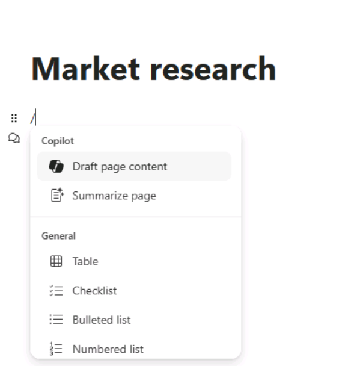

**실습 02: 직원 역량 강화 – Copilot – 영업**

Microsoft 365용 Copilot은 AI 기반 쓰기 도우미 역할을 합니다. 컨텍스트를
이해하고, 문구를 제안하고, 콘텐츠를 생성하는 데 도움이 되며 이 모든 것이
작업의 품질을 향상시킬 수 있습니다. 이 실습에서는 다음을 수행할 것입니다

- Loop의 Copilot를 사용하여 시장 조사 보고서를 생성하기.

- PowerPoint에서 Copilot을 사용하여 영업 프레젠테이션을 생성하고 사용자
  지정하기.

- Word에서 Copilot을 사용하여 세 가지 공급업체 계약을 비교하고, 차이점을
  식별하고, 권장 조치를 제공하기.

**연습 #1: Loop의 Copilot를 사용하여 시장 조사 보고서를 작성하기**

플라스틱 부품 OEM인 VanArsdel Ltd의 영업 부사장은 농업 장비 산업을 주요
시장으로 삼고 있습니다. 그러나 고위 경영진은 자동차 시장으로의 진출
가능성에 관심이 있습니다. 이미 이 부문을 독점하고 있는 기존 플라스틱
제조업체와의 치열한 경쟁을 감안할 때 회사가 실행 가능한 플레이어가 될 수
있는 공간이 있는지 확인해야 합니다.

이 연습에서는 Loop의Copilot을 사용하여 다음을 수행합니다.

- 회사 제품에 대한 잠재적인 신규 판매 시장을 조사하고 그 결과를 요약한
  시장 조사 보고서를 작성하기.

<!-- -->

- 테이블에 내용을 배치하여 보고서의 형식을 변경하기.

- 귀사가 해당 시장으로 이동해야 하는지 여부에 대한 최종 권장 사항을
  제시하기.

1.  In **Microsoft 365**에서 왼쪽 탐색 창에 표시되는 경우 **Loop**를
    선택하세요. 표시되지 않으면 **Microsoft 365** 탐색 창 바로 위의
    상단에서 **App Launcher**를 선택하세요,

**참고**: Apps 페이지에 **Loop**가 표시되지 않으면 **More apps**를

2.  **Apps** 페이지에서 아래로 스크롤하여 **Loop**를 찾은 후 선택하세요.

3.  **Sign-in** 버튼이 표시되면 **Resources** 탭의 **Microsoft 365
    Credentials**에 제공된 자격 증명을 사용하여 로그인하세요.

**참고**: 로그인한 후 Loop 브라우저 창을 닫고 Apps 페이지에서 Loop를
다시 여세요.

4.  **Microsoft Loop**에서 **Workspaces** 탭은 기본적으로 표시됩니다. 이
    프로젝트에 대한 새 작업 공간을 생성하려면 **Getting started**에서
    **+**를 선택한 후 **+New workspace** 버튼을 선택하세요.

5.  **Create a new workspace** 창에서 작업 공간을 +++VanArsdel
    research+++로 입력하고 나타나는 (Loop 버전을 따라)
    **Continue** 또는 **Create** 버튼을 선택하세요.

6.  **Add files to your workspace** 창에 (Loop 버전에 따라 이
    차에 **Workspace Switcher**가 표시될 수 있습니다) **Create**를
    선택하세요.

7.  이제 새 workspace의 첫 번째 페이지에 있습니다. 페이지 이름은
    현재 **Untitled**입니다. 페이지 (Untitled)는 왼쪽 탐색 창에도
    나타납니다. 페이지 본문에서 **Untitled** 필드를 선택하고 페이지
    이름을 **Market research**로 변경하세요. 탐섹 창에서 페이지 이름이
    자동으로 업데이트되는 방식을 확인하세요.

8.  **Just start typing...** 필드에서 슬래시 **(/)**를 입력하세요.

9.  표시되는 드롭다운 메뉴의 메뉴 맨 위에 있는 **Copilot** 섹션에서
    **Draft page content**를 선택하세요.

10. 표시되는 **Copilot** 창에서 프롬프트 필드 아래에 나타나는 버튼 행을
    확인하세요. 각 버튼을 선택하세요. 이 경우 Copilot이 지원할 수 있는
    작업 유형의 예로 프롬프트 필드를 미리 채우는 방법에 유의하세요.

11. 이제 고유한 프롬프트를 입력하게 됩니다. 프롬프트 필드에 다음
    프롬프트를 입력하고 **Submit**아이콘을 선택하세요:

+++As the VP for Sales for an OEM in the plastics manufacturing
industry, please research the market for plastic components in the
automotive industry. Provide information on target audience, market
size, competition, trends, regulations, and distribution channels.+++

12. something went wrong다는 오류가 발생하면 이전 프롬프트를 복사하여
    붙여넣고 다시 제출하세요.

13. 생성된 보고서를 검토하세요. 모든 정보를 닥락 형식으로 포함하는
    것보다 표로 요약하는 것을 선호합니다. 표시되는 **Copilot** 창에서
    **Rewrite with Copilot** 필드에 다음 프롬프트를 입력하고 **Submit**
    아이콘을 선택하세요:

+++Rewrite the report by placing the information in a table.+++

14. Copilot이 보고서의 서식을 어떻게 변경했는지 확인하세요. 이제
    Copilot이 이 시장으로 이전하는 것이 VanArsdel에 실행 가능한
    옵션인지에 대한 최종 권장 사항을 제시하기를 원합니다. 다음
    프롬프트를 입력하세요:

+++Add a recommendation to the end of the report as to whether we should
move into the market.+++

15. 보고서 맨 아래로 스크롤하여 Copilot의 권장 사항을 검토하세요.

**연습 \#2: PowerPoint에서 Copilot을 사용하여 영업 프레젠테이션을
생성하기**

PowerPoint의 Copilot을 사용하면 영업 전문가는 프레젠테이션 내용에 집중할
수 있으며 도구는 디자인과 서식을 처리합니다. 다음을 수행할 수 있습니다

- 기존 서면 문서를 발표자 노트와 출처가 포함된 프레젠테이션 데크로
  변환하기

- 간단한 프롬프트나 개요에서 새 프레젠테이션을 시작하기.

- 프레젠테이션을 요약하는 데 도움이 되며, 프레젠테이션의 내용을 빠르게
  이해하거나 주요 아이디어를 팀과 공유할 수 있도록 핵심 상항에 대한
  글머리 기호 요약을 제공.

Contoso, Ltd.의 영업 및 마케팅 이사는 회사에서 가장 인기 있는 판매
제품인 Contoso Protein Plus 쉐이크에 대해 영업 팀에 프레젠테이션을 해야
합니다. 이 발표는 마케팅 팀이 제품에 대한 작성한 시장 동향 보고서를
분석해야 합니다.

이 연습에서는PowerPoint의 Copilot을 사용하여 제공된 링크를 사용하여
다운로드한 **Market Trend Report - Protein Shake.docx** 파일의 정보를
기반으로 슬라이드 프레젠테이션을 생성할 것입니다.

1.  Microsoft Edge 브라우저에서 Microsoft 365 탭이 열려 있는 경우 지금
    선택하세요; 그렇지 않으면 새 탭을 열고 다음URL:
    +++https://www.office.com+++ 을 입력하여Microsoft 365 홈페이지로
    이동하세요.

**참고**: 오른쪽의 **Resources** 탭 아래에 제공된 **Microsoft 365
Credentials**을 사용하여 로그인 (메시지가 표시되는 경우)해야 합니다.

2.  **C:\LabFiles** 폴더로 이동하여 **Market Trend Report - Protein
    Shake** 복사본을 선택하고 **OneDrive**에 업로드하세요

**참고**: **Preparing for the lab execution** 섹션 (**실습 0**)의 지침에
따라 모든 실습 자산을 **OneDrive**에 이미 업로드한 경우 이 단계를 건너뛸
수 있습니다.

3.  **Market Trend Report - Protein Shake.docx** (OneDrive에 업로드된)
    파일을 열고 닫아 Most Recently Used (MRU) 파일 목록에 추가하세요

4.  **Microsoft 365** 탐섹 창에서 **PowerPoint**를 선택하세요.
    PowerPoint에서 비어 있는 새 프레젠테이션을 여세요.

5.  **Copilot** 아이콘 (스크린샷과 같이 빨간색으로 강조 표시됩니다)을
    선택하세요. 표시되는 **Copilot** 창에서 선택할 수 있는 몇 가지 미리
    정의된 프롬프트를 사용할 수 있습니다. **Create presentation from
    file** 프롬프트를
    선택하세요. 
    

**Copilot** 창 아래쪽의 프롬프트 필드 위에 가장 최근에 사용한 세 개의
파일이 포함된 **Suggestions** 창이 나타날 수 있습니다. **Market Trend
Report - Protein Shake.docx** 파일이MRU 목록에 나타나면 선택하세요.

6.  그렇지 않으면 스크린샷과 같이 Attach cloud files 옵션을 사용하여
    참조 문서를 첨부할 수
    있습니다. 
    

**참고**: 문서에 대한 링크를 사용하여 참조 문서를 첨부할 수도 있습니다.
링크를 가져와서**Word**에서 파일을 열려면 리본 메뉴 위의
**Share** 버튼을 선택하고 드롭다운 메뉴에서 **Copy Link** 옵션을 선택한
후 **PowerPoint**의 **Copilot** 창에 있는 이 프롬프트 필드에서 슬래시
(**Create presentation from file /**)다음에 있는 링크를 붙여넣으세요.
**Send** 아이콘을 선택하세요.

7.  이 프롬프트는 Copilot이 문서를 기반으로 슬라이드 프레젠테이션을
    생성하도록 트리거했습니다. 이 과정에서 먼저 프레젠테이션의 개요가
    표시되었습니다. 문서를 기반으로 프레젠테이션에 대한 몇 가지 변경
    사항의 글머리 기호 목록을 보여주는 별도의 창을 표시했습니다.

8.  Copilot이 프레젠테이션 작성을 완료한 후 슬라이드을 검토하세요. To
    review the speaker notes, select the발표자 노트를
    검토하려면 **View** 탭을 선택한 후 아직 선택하지 않은 경우
    **Notes** 버튼을 선택하세요. 이미 선택되어 있고 메모를 볼 수 없는
    경우 슬라이드 창의 아래쪽을 위로 드래그하여 메모를 표시하세요.
    발표자 노트에 프레젠테이션 중에 전달하려는 요점이 포함되어 있는지
    확인하세요

9.  **Home** 탭을 선택한 후 **Copilot** 버튼 위쪽에 표시되는
    **Designer** 버튼을 선택하세요. **Designer** 창은 현재 표시되는
    슬라이드에 대한 다양한 디자인의 샘플을 제공합니다. 프레젠테이션에서
    다른 슬라이드로 변경하고 **Designer** 창에서 해당 슬라이드에 대해
    어떻게 다른 디자인 옵션을 생성하는지 확인하세요.

10. PowerPoint에 현재 슬라이드를 새 디자인으로 바꾸려면 디자인 옵션 중
    하나를 선택하세요. 이 기능은 Copilot과 관련이 없습니다. Microsoft
    365 구독이 있는 경우 PowerPoint에서 사용할 수 있습니다.

11. 이제 Copilot이 무엇을 할 수 있는지 봅시다. **Copilot** 창을 열기
    위해 **Copilot** 버튼을 선택하세요. **Copilot** 창에서 **Here are
    some things you can try** 섹션을 확인하세요. Copilot은
    프레젠테이션에서 여러 작업을 수행하는 데 사용할 수 있는 사전 빌드된
    프롬프트를 제공합니다. **View Prompts** 아이콘을 선택하고 **Organize
    your thoughts** (빨간색 하이라이트)을 선택하세요. **참고**:
    프롬프트를 찾으려면 천천히 아래로 스크롤해야 합니다 (스크린샷 참조)

12. Copilot이 프레젠테이션을 구성하는 데 어떤 작업을 수행했는지
    검토하세요. 예를 들어, 슬라이드를 섹션으로 그룹화한 후 몇 가지
    새로운 섹션 제목 슬라이드를 추가할 수 있습니다. 그렇다면 생성된 새
    슬라이드를 찾아 검토하세요.

13. 프롬프트 필드 위에 Copilot은 프레젠테이션과 관련된 질문을
    표시합니다. 이러한 질문의 목적은 두 가지입니다. 다음을 수행할 수
    있습니다

    - 질문을 선택하고 Copilot이 답변을 생성하도록 한 후 해당 슬라이드의
      발표자 노트에 복사하여 붙여넣을 수 있습니다.

    - Question and Answer (Q&A) 슬라이드를 생성하고 발표자 노트의 있는
      모든 질문에 대한 답변을 복사하여 붙여넣으세요.

이때 이러한 질문과 답변을 사용하여 프레젠테이션의 Q&A 부분을 준비할 수
있습니다. 예를 들어, 다음과 같은 것을 묻는 버튼이 있을 수
있습니다: **What caused the rise in demand for Contoso Protein Plus**?
또는 다음과 같은 것을 요청할 수 있습니다: **What are the key factors
behind the hype of Contoso Protein Plus**? 표시되는 질문을 검토하고 그
중 하니를 선택하여 어떤 결과가 나타나는지 확인하세요.

14. 이러한 질문 중 하나를 선택하면 Copilot이 질문에 대한 답변을 생성하고
    답변 창 하단에 **Copy** 옵션을 제공합니다. In doing so, you can
    select the 이렇게 하면 **Copy** 옵션을 선택한 후 이 텍스트가 적절한
    메모를 생성할 수 있는 모든 슬라이드의 발표자 노트에 이 답변을
    붙여넣을 수 있습니다. 지금 시도해 보세요. 질문을 선택하고 답변을
    복사한 후 해당 슬라이드로 이동하여 발표자 노트에서 **Ctrl+V**를
    입력하여 노트에 붙여넣으세요.

15. 제안된 질문과 프롬프트 필드 사이에 나타나는 **Refresh** 버튼을
    확인하세요. 이 **Refresh** 버튼을 선택하세요.

이 과정에서 Copilot이 어떻게 새로운 질문 세트를 생성했는지 주목하세요.
프레젠테이션에서 해결하려는 질문이 표시될 때까지 **Refresh** 버튼을
선택하여 질문을 계속 새로 고칠 수 있습니다. 질문은 선택하고 Copilot에서
생성한 답변을 복사하여 선택한 슬라이드의 발표자 노트에 붙여넣을 수
있습니다. Copilot은 제공한 새로운 질문을 생각할 수 없으면 처음부터 질문
목록을 반복하기 시작합니다.

16. 이제 Copilot이 프레젠테션 끝에 Q&A 세션을 위한 슬라이드를 생성하도록
    하려고 합니다. 다음 프롬프트를 입력하고 **Send** 아이콘을
    선택하세요:

+++Add a slide at the end of the presentation for Q&A.+++

**참고**: Copilot은 아래와 같은 몇 가지 예외를 표시할 수 있습니다.

프롬프트를 바꾸거나 아래와 같이 제안된 프롬프트를 사용해 보세요:

17. **Add a slide about** 명령을 선택하고 프레젠테이션 맨 끝에 다음
    Q&A를 추가하세요 (스크린샷에서 볼 수 있습니다).

18. 무슨 일이 일어나는지 확인하기 위해 **Send**를 클릭하세요.

Copilot은 지시에 따라 Q&A 슬라이드를 추가했습니다. Copilot이 생성한 Q&A
슬라이드를 검토하세요.

19. Copilot이 생성한 Q&A 슬라이드를 검토하세요. 이제 마지막으로 한
    가지를 시도해 보세요. Q&A 세션 중에 준비할 수 있는 잠재적 질문
    목록을 작성하기로 결정하세요. 다음 프롬프트를 입력하여 Copilot이 Q&A
    슬라이드의 발표자 노트에 제안된 모든 질문을 추가할 수 있는지
    확인하세요:

+++In the speaker notes of the Q&A slide that you just created, add a
list of possible questions that may be asked regarding this
presentation.+++

20. Copilot이 슬라이드를 생성할 수 없다는 메시지를 반환하면 프롬프트를
    다시 입력해 보세요. 때때로 Copilot이 작업을 완료할 수 없는 경우
    요청을 반복하는 것이 좋습니다.

Copilot이 이 작업을 완료할 수 없는 경우 이 시점에서 원하는 모든 작업을
완료하지 못할 수도 있음을 보여줍니다. 이 시나리오는 알아야 할 모범
사례의 또 다른 예입니다. Copilot의 제한 사항 이해.

21. 이제 이 해결 방법을 시도해 보세요. 질문 목록을 생성하도록 요청하는
    다음 프롬프트를 입력하세요:

+++What kind of questions do you think participants may ask during the
Q&A session?+++

22. Copilot에서 생성한 질문을 검토하세요. 창 아래쪽에 있는 **Copy**
    버튼을 선택한 후 Q&A 슬라이드의 발표자 노트에 붙여 넣으세요
    (**Ctrl+V**).

**참고**: Copilot은 일부 예외를 표시할 수 있습니다. **\#16단계**와 같이
제안된 프롬프트를 사용해 보세요.

이 모듈의 나머지 교육 실습에서는 이 프레젠테이션을 사용하지 않지만,
나중에 참조할 수 있도록 사본을 보관하기 위해 이 프레젠테이션을 버리거나
저장할 수 있습니다.

**연습 \#3: Word에서 Copilot을 사용하여 공급업체 계약 비교하기**

영업 사원은 고객과 강력한 관계를 구축하고, 인사이트를 기반으로 조치를
취하고, 거래를 더 빨리 성사시키기 위해 적시에 올바른 정보가 필요합니다.
Word의 Copilot는 다른 문서의 특정 정보를 콘텐츠로 가져오거나, 요약을
생성하거나, 문서에 대해 질문하거나, 특정 주제에 대한 아이디어를
제공하고, 텍스트를 표로 변환하거나, 콘텐츠를 다시 작성하는 방법에 대한
제안을 제공하는 데 도움이 될 수 있습니다.

여러분은 다양한 식료품 및 음료 제품 공급업체인 Northwind Traders의
새로운 영업 관리자입니다. 현재 Northwind의 주요 고객 중 몇 명과 체결
중인 공급업체 계약에 대해 우려하고 계십니다. 전임자가 이러한 계약을
협상했기 때문에 이전에 이러한 고객과 합의한 사용 약관에 익숙하지
않습니다.

이 연습에서는 다음을 수행합니다

- Word의 Copilot에 세 가지 공급업체 계약 문서를 제공하기.

- 각 고객과 협상한 이용 약관을 비교하는 보고서를 작성하도록 요청하기.

- Copilot에게 각 계약 재협상을 위한 권장 사항을 제공하도록 요청하기.

1.  Microsoft Edge 브라우저에서 Microsoft 365 탭이 열려 있는 경우 지금
    선택하세요; 그렇지 않으면 다음URL:+++https://www.office.com+++ 를
    입력하고 Microsoft 365 홈페이지로 이동하세요.

> **참고**: 오른쪽의 **Resources** 아래에 제공된 **Microsoft 365
> Credential**을 사용하여 로그인(메시지가 표시되는 경우)해야 합니다.

2.  **C:\LabFiles** 폴더로 이동하여 다음 문서의 복사본을 선택하고
    OneDrive에 업로드하세요.

    - **Contoso Supplier Agreement**

    - **Tailwind Traders Supplier Agreement**

    - **Wide World Importers Supplier Agreement**

> **참고**: 모든 문서의 복사본을 이미 업로드한 경우 이 단계를 건너뛸 수
> 있습니다 (**실습 0**의 지시에 따라 **C:\LabFiles**의 이 실습 랩
> 세션에서 사용할 것입니다).

3.  이 연습에서는 Most Recently Used 파일 목록에서 문서에 액세스합니다.
    파일을 MRU 목록에 표시하려면 각 문서를 연 후 닫으세요. OneDrive
    계정에 있는 세 개의 파일을 각각 열고 닫으세요.

4.  **Microsoft 365**에서 **Microsoft Word**를 열고 비어 있는 새 문서를
    여세요.

5.  빈 문서의 맨 위에 표시되는 **Draft with Copilot** 창에서 다음
    프롬프트를 입력하세요:

+++I'm the Sales Manager for Northwind Traders, a supplier of various
grocery and beverage products. Please create a report that compares the
supplier agreements for three of our customers. Provide a recommendation
on contract renewals that can provide Northwind Traders with more
favorable terms. The supplier agreements for these three customers are
attached. Thank you!+++

이제 세 개의 공급업체 계약을 프롬프트에 첨부해야 합니다. **Draft with
Copilot** 창에서 **Reference your content** 버튼을 선택하세요. 표시되는
드롭다운 메뉴에서 **Contoso Supplier Agreement**가 파일 목록에 나타나면
선택하세요. 그렇지 않으면 **Browse files from cloud**를 선택하고,
**Recent** 파일 목록에서 **Contoso Supplier Agreement** 을 선택한 후
**Attach** 버튼을 선택하세요. 파일이 프롬프트에 어떻게 표시되는지
확인하세요.

**Tailwind Traders Supplier Agreement**과 **Wide World Importers
Supplier Agreement**모두에 대해 이전 단계를 반복하세요. 이 시점에서 세
파일 모두에 대한 링크가 프롬프트에 포함되어야 합니다.

6.  **Generate**를 선택하세요. At 이 시점에서 Copilot은 세 가지 공급업체
    계약에서 관련 정보를 추출하고 이를 비교하는 보고서 초안을
    작성합니다.

7.  비교 문서를 검토한 후 결과가 만족스럽지 않습니다. Copilot이 다시
    시도하고 새 버전을 생성하는 것을 보고 싶습니다. 문서 끝에 표시되는
    Copilot 창에서 **Keep it** 버튼 옆에 표시되는 **Regenerate** 버튼을
    선택하세요. Copilot이 승인하는 이 보고서 버전을 만들 때까지 필요한
    만큼 이 단계를 반복할 수 있습니다. 이 연습에서는 이 단계를 여러 번
    반복하여 Copilot이 제공하는 다양한 형식을 확인하세요. 또한 보고서의
    한 버전에는 포함되지 않은 일부 정보가 다른 버전에는 포함되지 않을 수
    있습니다.

보고서 버전이 만족스러우면 **Keep it** 버튼을 선택하세요.

8.  이 문서를 모두 사용했으면 **OneDrive**에 저장하여 Microsoft Edge
    브라우저에서 이 탭을 닫을 수 있습니다.

**요약:**

이 실습에서는 AI 기반 쓰기 도우미로서 Microsoft 365용 Copilot의 기능을
살펴보았습니다.

- Loop에서 Copilot를 활용하여 데이터 구성, 인사이트 생성, 응집력 있고
  유익한 보고서 작성과 관련된 상세한 시장 조사 보고서 초안을
  작성했습니다.

- PowerPoint에서 Copilot을 활용하여 슬라이드를 생성하고, 콘텐츠를 사용자
  지정하고, 프레젠테이션이 주요 영업 메시지를 효과적으로 전달할 수
  있도록 매력적인 영업 프레젠테이션을 디자인했습니다.

- Word에서 Copilot을 사용하여 3개의 공급업체 계약을 분석 및 비교하여
  계약 간의 차이점을 식별하고 비교를 기반으로 권장 조치를 제공했습니다.
