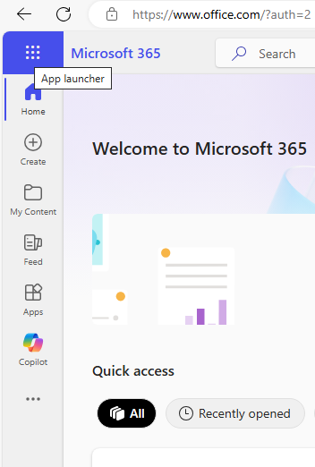
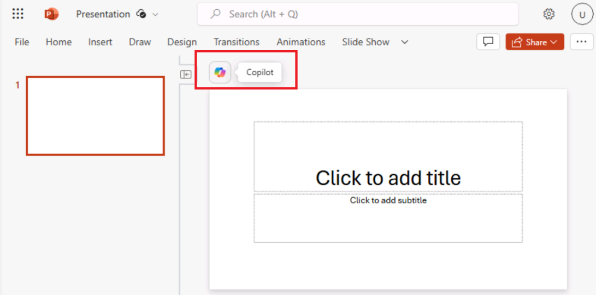

**Laboratório 02: Capacite sua força de trabalho - Copilot - Vendas**

O Copilot for Microsoft 365 funciona como um assistente de redação
alimentado por AI. Ele entende o contexto, sugere frases e ajuda a gerar
conteúdo, tudo isso para aprimorar a qualidade do seu trabalho. Neste
laboratório, você irá:

- Usar o Copilot in Loop para criar um relatório de pesquisa de mercado.

- Usar o Copilot no PowerPoint para criar e personalizar uma
  apresentação de vendas.

- Usar o Copilot no Word para comparar três contratos de fornecedores,
  identificar as diferenças e fornecer ações recomendadas.

**Exercício 1: Crie um relatório de pesquisa de mercado usando o Copilot
in Loop**

Você é o vice-presidente de vendas da VanArsdel Ltd, um OEM de
componentes plásticos, cujo principal mercado é o setor de equipamentos
agrícolas. No entanto, a liderança sênior está interessada na
possibilidade de expandir para o mercado automotivo. Dada o alto nível
de concorrência de fabricantes de plástico que já monopolizam esse
setor, você precisa determinar se há espaço disponível para que sua
empresa se torne um competidor viável.

Neste exercício, você usará o Copilot in Loop para:

- Pesquisar um novo mercado potencial de vendas para os produtos de sua
  empresa e criar um relatório de pesquisa de mercado que descreva suas
  descobertas.

- Alterar o formato do relatório, organizando o conteúdo em uma tabela.

- Fazer uma recomendação final sobre se sua empresa deve entrar nesse
  mercado.

1.  No **Microsoft 365**, selecione **Loop** se ele aparecer no painel
    de navegação à esquerda. Caso contrário, selecione **App Launcher**
    no canto superior esquerdo, logo acima do painel de navegação do
    **Microsoft 365**.

**Observação**: Se você não vir o **Loop** listado na página
Aplicativos, selecione **More apps**.

2.  Na página **Apps**, role para baixo até localizar **Loop** e, em
    seguida, selecione-o.

3.  Se você vir o botão Sign-in, entre usando as credenciais fornecidas
    nas Credenciais do Microsoft 365 na guia Resources.

**Observação**: Depois de fazer login, feche a janela do navegador do
Loop e abra novamente o Loop na página Aplicativos.

4.  No **Microsoft Loop**, a guia **Workspaces** é exibida por padrão.
    Se quiser criar um novo workspace para este projeto, selecione + no
    canto superior esquerdo, ao lado de **Getting started** e, em
    seguida, selecione o botão **+New workspace**.

5.  Na janela  **Create a new workspace**, digite +++VanArsdel
    research+++ como nome do workspace e, em seguida, selecione o botão
    **Continue** ou **Create** que aparece (dependendo da versão do
    Loop).

6.  Na janela **dd files to your workspace** (dependendo da sua versão
    do Loop, essa janela pode exibir **Workspace Switcher**), selecione
    **Create**.

7.  Agora você está na primeira página do seu novo workspace. O nome da
    página atualmente é **Untitled**. Observe que a página (Untitled)
    também aparece no painel de navegação esquerdo. No corpo principal
    da página, selecione o campo **Untitled** e altere o nome da página
    para **Market research**. Observe como o nome da página é
    automaticamente atualizado no painel de navegação.
    

8.  No campo **Just start typing**... (Comece a digitar...), digite uma
    barra (/).

9.  No menu suspenso que aparece, na seção **Copilot,** localizada na
    parte superior do menu, selecione **Draft page content**.

10. Na janela do **Copilot** que aparece, observe a linha de botões que
    aparece abaixo do campo de prompt. Selecione cada botão. Ao fazer
    isso, observe como ele preenche automaticamente o campo de prompt
    com um exemplo do tipo de tarefa que o Copilot pode ajudar a
    executar.

11. Agora você vai inserir seu próprio prompt. No campo de prompt,
    digite o seguinte prompt e selecione o ícone **Submit**:

+++As the VP for Sales for an OEM in the plastics manufacturing
industry, please research the market for plastic components in the
automotive industry. Provide information on target audience, market
size, competition, trends, regulations, and distribution channels.+++

12. Se você receber um erro informando que algo deu errado, copie e cole
    o prompt anterior e envie-o novamente.

13. Revise o relatório gerado. Em vez de ter todas as informações em
    forma de parágrafo, você prefere resumi-las em uma tabela. No painel
    do **Copilot** que aparece, digite o seguinte prompt no campo
    **Rewrite with Copilot** e selecione o ícone **Submit**:

+++Rewrite the report by placing the information in a table.+++ 

14. Observe como o Copilot alterou a formatação do relatório. Agora você
    quer que o Copilot faça uma recomendação final sobre se a entrada
    nesse mercado é uma opção viável para a VanArsdel. Digite o seguinte
    prompt:

+++Add a recommendation to the end of the report as to whether we should
move into the market.+++ 

15. Role até o final do relatório e revise a recomendação do Copilot.

**Exercício 2: Criar uma apresentação de vendas usando o Copilot no
PowerPoint**

Com o Copilot no PowerPoint, os profissionais de vendas podem se
concentrar no conteúdo de suas apresentações, enquanto a ferramenta
cuida do design e da formatação. O Copilot pode:

- Transformar documentos escritos existentes em apresentações completas
  com anotações do instrutor e fontes

- Iniciar uma nova apresentação a partir de um prompt simples ou um
  esboço.

- Resumir apresentações, fornecendo um resumo em tópicos dos principais
  pontos para entender rapidamente o conteúdo ou compartilhar as ideias
  principais com a equipe.

Como diretor de vendas e marketing da Contoso, Ltd., você precisa
preparar uma apresentação para sua equipe de vendas sobre o produto mais
vendido da empresa, o shake Contoso Protein Plus. A apresentação deve
analisar o relatório de tendências de mercado que sua equipe de
Marketing criou para o produto.

Neste exercício, você usará o Copilot no PowerPoint para criar sua
apresentação de slides com base nas informações do arquivo **Market
Trend Report - Protein Shake.docx**, que você baixou usando o link
fornecido.

1.  Se você tiver uma guia do Microsoft 365 aberta no navegador
    Microsoft Edge, selecione-a agora; caso contrário, abra uma nova
    guia e digite a seguinte URL: +++<u>https://www.office.com+++</u> 
    para acessar a página inicial do Microsoft 365.

**Observação**: Você precisa fazer login (se solicitado) usando as
**Credenciais do Microsoft 365** fornecidas na guia **Resources** à
direita.

2.  Navegue até a pasta **C:\LabFiles** para selecionar e carregar uma
    cópia do arquivo **Market Trend Report - Protein Shake** para o
    **OneDrive**

**Observação**: Se você já carregou todos os ativos do laboratório para
o **OneDrive**, conforme instruído na seção **Preparing for the lab
execution** (**Lab 0**), você pode pular esta etapa.

3.  Abra e feche o arquivo **Market Trend Report - Protein Shake.docx**
    (que você carregou no OneDrive) para que ele apareça na lista de
    arquivos Most Recently Used (MRU)

4.  No painel de navegação do **Microsoft 365**, selecione
    **PowerPoint**. No PowerPoint, abra uma nova apresentação em branco.

5.  Selecione o ícone do **Copilot** (destacando em vermelho, conforme
    mostrado na captura de tela). No painel **Copilot** que aparece,
    vários prompts predefinidos estão disponíveis para você escolher.
    Selecione selecione o prompt **Create presentation from file**.
     
    

Acima do campo de prompt na parte inferior do painel do **Copilot**, uma
janela **Suggestions** pode aparecer, contendo os três arquivos usados
mais recentemente. Se o arquivo **Market Trend Report - Protein
Shake.docx** aparecer na lista MRU, selecione-o.

6.  Caso contrário, você pode anexar o documento de referência usando a
    opção Attach cloud files, conforme mostrado na captura de
    tela. 

**Observação**: Você também pode anexar o documento de referência usando
o link para o documento. Para obter o link, abra o arquivo no **Word**,
selecione o botão **Share** acima da **faixa de opções**, escolha a
opção **Copy Link** no menu suspenso e, em seguida, cole o link no campo
de prompt do painel do **Copilot** no **PowerPoint**, logo após a barra
(**Create presentation from file /**). Selecione o ícone **Send**.

7.  O Copilot acionou a criação da apresentação de slides com base no
    documento. Primeiro, ele exibiu o esboço da apresentação. Em
    seguida, mostrou uma janela separada com uma lista em tópicos
    destacando algumas das alterações feitas na apresentação, tomando
    como base o documento.

8.  Revise os slides quando o Copilot terminar de criar a apresentação.
    Para revisar as anotações do palestrante, selecione a guia  **View**
    e, em seguida, selecione o botão **Notes**, se ele ainda não estiver
    selecionado. Se ele já estiver selecionado e você não puder ver as
    anotações, arraste a parte inferior da janela do slide para cima
    para mostrar as anotações. Verifique se as anotações do palestrante
    incluem os pontos principais que você deseja abordar durante a
    apresentação.

9.  Selecione a guia **Home** e, em seguida, selecione o botão
    **Designer**, que aparece à esquerda do botão Copilot. O painel
    **Designer** oferece amostras de diferentes designs para o slide
    atual que está sendo exibido. Mude para um slide diferente na
    apresentação e observe como o painel **Designer** gera diferentes
    opções de design para esse slide.

10. Selecione uma das opções de design para que o PowerPoint substitua o
    slide atual pelo novo design. Esse recurso não está relacionado ao
    Copilot. Ele está disponível no PowerPoint quando você tem uma
    assinatura do Microsoft 365.

11. Agora vamos ver o que mais o Copilot pode fazer. Selecione o botão
    **Copilot** para abrir o painel **Copilot**. No painel **Copilot**,
    observe a seção que diz **Here are some things you can try**. O
    Copilot fornece prompts predefinidos que você pode usar para
    executar várias tarefas na apresentação. Selecione o ícone **View
    Prompts** e selecione **Organize your thoughts** (destacado em
    vermelho). **Observação:** Você precisa rolar lentamente para baixo
    para localizar o prompt (mostrado na captura de tela).

12. Analise o que o Copilot fez ao organizar a apresentação. Por
    exemplo, ele pode ter agrupado os slides em seções e, em seguida,
    adicionado alguns novos slides de título de seção. Nesse caso,
    localize os novos slides que ele criou e revise-os.

13. Acima do campo de prompt, o Copilot exibe perguntas relacionadas à
    apresentação. A finalidade dessas perguntas é dupla. Você pode:

    - Selecionar uma pergunta, permitindo que o Copilot gere uma
      resposta, a qual você pode copiar e colar nas anotações do
      instrutor para um slide aplicável.

    - Criar um slide de perguntas e respostas (Q&A) e copiar e colar
      todas as respostas dessas perguntas nas anotações do palestrante.

Ao fazer isso, você pode usar estas perguntas e respostas para se
preparar para a sessão de perguntas e respostas durante a apresentação.
Por exemplo, pode haver um botão com perguntas como: **What caused the
rise in demand for Contoso Protein Plus?** Ou ele pode perguntar algo
como: **What are the key factors behind the hype of Contoso Protein
Plus?** Revise as perguntas exibidas e selecione uma delas para ver o
que acontece.

14. Ao selecionar uma dessas perguntas, o Copilot gera uma resposta para
    a pergunta e fornece a opção **Copy** na parte inferior da janela de
    resposta. Dessa forma, você pode selecionar a opção **Copy** e
    depois colar essa resposta nas anotações do palestrante para
    qualquer slide em que esse texto seja uma anotação apropriada.
    Experimente agora. Selecione uma pergunta, copie a resposta gerada,
    vá para um slide apropriado e, nas anotações do palestrante,
    pressione **Ctrl+V** para colar a anotação.

15. Observe o botão **Refresh** que aparece entre as perguntas sugeridas
    e o campo de prompt. Selecione esse botão **Refresh**.

Ao fazer isso, observe como o Copilot gerou um novo conjunto de
perguntas. Você pode continuar atualizando as perguntas selecionando o
botão **Refresh** até encontrar uma questão que deseja abordar na
apresentação. Depois, você pode selecionar a pergunta, copiar a resposta
gerada pelo Copilot, e colá-la nas anotações do instrutor no slide de
sua escolha. Quando o Copilot não conseguir gerar novas perguntas, ele
começará a repetir a lista de perguntas desde o início.

16. Agora, você quer que o Copilot crie um slide no final da
    apresentação para uma sessão de Perguntas e Respostas. Digite o
    seguinte prompt e selecione o ícone **Send**:

+++Add a slide at the end of the presentation for Q&A.+++

**Observação**: O Copilot pode exibir alguma exceção, como a que está
abaixo.

Tente reformular o prompt ou use os prompts sugeridos, como o abaixo:

17. Selecione o comando **Add a slide about** e anexe as seguintes
    perguntas e respostas no final da apresentação (conforme mostrado na
    captura de tela).

18. Clique em **Send** para ver o que acontece.

O Copilot adicionou um slide de perguntas e respostas conforme as
instruções. Revise o slide de perguntas e respostas que o Copilot criou.

19. Revise o slide de perguntas e respostas que o Copilot criou. Agora
    tente uma última coisa. Você decide compilar uma lista de possíveis
    perguntas que podem ser feitas durante a sessão de perguntas e
    respostas. Digite o prompt a seguir para ver se o Copilot consegue
    adicionar todas as perguntas sugeridas às anotações do instrutor no
    slide de perguntas e respostas:

+++In the speaker notes of the Q&A slide that you just created, add a
list of possible questions that may be asked regarding this
presentation.+++ 

20. Se o Copilot retornar uma mensagem indicando que não conseguiu gerar
    o slide, tente digitar o prompt novamente. Às vezes, quando o
    Copilot não consegue concluir uma tarefa, uma boa prática é repetir
    a solicitação.

Se o Copilot não conseguir concluir essa tarefa, isso apenas mostra que
ele pode não ser capaz de concluir tudo o que você deseja nesse momento.
Esse cenário é outro exemplo da prática recomendada da qual você precisa
estar ciente: Compreender as limitações do Copilot.

21. Agora tente esta solução alternativa. Digite o prompt a seguir que
    solicita a geração de uma lista de perguntas:

+++What kind of questions do you think participants may ask during the
Q&A session?+++ 

22. Revise as perguntas que o Copilot criou. Selecione o botão **Copy**
    na parte inferior da janela e, em seguida, vá até o slide de
    perguntas e respostas, pressione (Ctrl+V) para colar nas anotações
    do instrutor.

**Observação**: O Copilot pode exibir alguma exceção. Tente usar os
prompts sugeridos na etapa 16

Embora os exercícios de treinamento restantes neste módulo não usem essa
apresentação, você pode descartá-la ou salvá-la se quiser manter uma
cópia para referência futura.

**Exercício 3: Comparar contratos de fornecedores usando o Copilot no
Word**

Os vendedores precisam das informações certas no momento certo para
construir relacionamentos sólidos com seus clientes, tomar medidas
baseadas em insights e fechar negócios mais rapidamente. O Copilot in
Word pode ajudar trazendo informações específicas de outros documentos
para o seu conteúdo, gerando resumos, respondendo perguntas sobre seu
documento, fornecendo ideias sobre tópicos específicos, transformando
textos em tabelas, e sugerindo formas de reescrever o conteúdo.

Você é o novo Gerente de Vendas da Northwind Traders, um fornecedor de
produtos de mercearia e bebidas. Você está preocupado com os acordos com
fornecedores atualmente vigentes com os principais clientes da empresa.
Seu antecessor negociou esses contratos, e você não está familiarizado
com os termos e condições previamente acordados com esses clientes.

Neste exercício, você deverá:

- Fornecer ao Copilot no Word três documentos de contratos com
  fornecedores.

- Solicitar um relatório que compare os termos e condições negociados
  com cada cliente.

- Pedir recomendações ao Copilot para renegociar cada acordo.

1.  Se você tiver uma guia do Microsoft 365 aberta no navegador
    Microsoft Edge, selecione-a agora; caso contrário, abra uma nova
    guia e digite o seguinte
    [URL:+++https://www.office.com](URL:+++https://www.office.com)<u>+++</u>
    para acessar a página inicial do Microsoft 365.

> **Observação**: Você precisa fazer login (se solicitado) usando as
> **Credenciais do Microsoft 365** fornecidas na guia **Resources** à
> direita.

2.  Navegue até a pasta **C:\LabFiles** para selecionar e carregar uma
    cópia dos seguintes documentos no OneDrive.

    - **Contoso Supplier Agreement **

    - **Tailwind Traders Supplier Agreement **

    - **Wide World Importers Supplier Agreement **

> **Observação**: Você pode pular esta etapa se já tiver feito upload de
> uma cópia de todos os documentos (que serão usados nesta sessão de
> laboratório prático em **C:\LabFiles**, conforme instruído no
> **Laboratório 0**).

3.  Para acessar os documentos na lista de arquivos Most Recently Used
    (MRU), abra e feche cada um dos três arquivos no seu OneDrive.

4.  No **Microsoft 365**, abra o **Microsoft Word** e, em seguida, abra
    um novo documento em branco.

5.  Na janela **Draft with Copilot** que aparece na parte superior do
    documento em branco, digite o seguinte prompt:

+++I'm the Sales Manager for Northwind Traders, a supplier of various
grocery and beverage products. Please create a report that compares the
supplier agreements for three of our customers. Provide a recommendation
on contract renewals that can provide Northwind Traders with more
favorable terms. The supplier agreements for these three customers are
attached. Thank you!+++

Anexe os três documentos de acordos ao prompt. Na janela **Draft with
Copilot**, selecione **Reference your content**. No menu suspenso que
aparece, se o arquivo **Contoso Supplier Agreement** estiver na lista de
arquivos, selecione-o. Caso contrário, escolha **Browse files from
cloud**, selecione **Contoso Supplier Agreement** na lista **Recent**, e
clique no botão **Attach**. Observe como o arquivo é exibido no prompt.

Repita este passo para os arquivos **Tailwind Traders Supplier
Agreement** e **Wide World Importers Supplier Agreement**. Neste ponto,
os links para os três arquivos devem estar incluídos no prompt..

6.  Selecione **Generate** para que o Copilot extraia as informações
    pertinentes dos três acordos e redija um relatório comparativo.

7.  Agora que você revisou o documento comparativo, percebeu que os
    resultados não atenderam às suas expectativas. Você gostaria que o
    Copilot tentasse novamente e gerasse uma nova versão. Na janela do
    Copilot que aparece no final do documento, selecione o botão
    **Regenerate**, que aparece ao lado do botão **Keep it**. Você pode
    repetir essa etapa quantas vezes forem necessárias até que o Copilot
    crie uma versão desse relatório que você aprove. Para este
    exercício, repita essa etapa várias vezes para ver os vários
    formatos que o Copilot fornece. Observe também como algumas
    informações podem estar incluídas em uma versão do relatório que não
    está em outras.

Quando estiver satisfeito com uma versão do relatório, selecione o botão
**Keep it**.

8.  Quando terminar de ler o documento, salve-o no **OneDrive** para
    poder fechar essa guia no navegador Microsoft Edge.

**Resumo:**

Neste laboratório, você explorou as capacidades do Copilot for Microsoft
365 como um assistente de escrita com AI, incluindo:

- Utilização do Copilot in Loop para criar um relatório detalhado de
  pesquisa de mercado, organizando dados, gerando insights e criando um
  relatório informativo e coeso.

- Aproveitamento do Copilot in PowerPoint para desenvolver uma
  apresentação de vendas impactante, gerando slides, personalizando o
  conteúdo e garantindo que a apresentação comunique efetivamente as
  principais mensagens de vendas.

- Uso do Copilot in Word para analisar e comparar três acordos de
  fornecedores, identificando as diferenças entre os contratos e
  fornecendo ações recomendadas para renegociação.
