**Laboratorio 03: Empodere a su fuerza de trabajo – Copilot-IT**

**Objetivo:**

Copilot para Microsoft 365 es un asistente de redacción con inteligencia
artificial que comprende el contexto, sugiere frases y ayuda a generar
contenido, lo que mejora la calidad de su trabajo. En este laboratorio,
utilizará:

- Microsoft Copilot para resumir la información de las especificaciones
  de un producto y crear un plan de proyecto para implementar el
  producto.

- Copilot en PowerPoint para crear una presentación basada en el plan de
  proyecto que ha creado.

- Copilot en Word para modificar un informe de especificaciones
  técnicas.

**Ejercicio \#1: Crear un plan de proyecto utilizando Microsoft
Copilot**

Microsoft Copilot, integrado nativamente en Microsoft 365, proporciona a
los profesionales de IT una plataforma sólida para optimizar la
colaboración, intercambiar conocimientos y agilizar soluciones técnicas.
Facilita la conexión inmediata entre equipos, el intercambio de
información y la coordinación eficaz de actividades.

Como gerente de IT de Adatum Corporation, ha estado revisando un informe
de especificaciones del producto Contoso CipherGuard Sentinel X7 para la
seguridad de redes. Tiene previsto instalar este producto, que
proporciona una protección de seguridad avanzada muy superior a la que
Adatum tiene actualmente.

En este ejercicio utilizará Microsoft Copilot en Bing para:

- Analizar un informe de especificaciones de un nuevo producto de
  seguridad de red que planea instalar.

- Actualizar el plan del proyecto con la información del informe de
  especificaciones del producto.

**Nota**: Al finalizar este ejercicio, debe guardar el plan del proyecto
en su cuenta de OneDrive. El siguiente ejercicio utiliza este archivo.

1.  Si tiene abierta una pestaña de Microsoft 365 en el navegador
    Microsoft Edge, selecciónela ahora; de lo contrario, abra una nueva
    pestaña e ingrese la siguiente URL:
    +++[https://www.office.com+++](https://www.office.com+++/) para ir a
    la página de inicio de **Microsoft 365**.

**Nota**: Debe iniciar sesión (si se le solicita) utilizando
las **credenciales de Microsoft 365** proporcionadas en la **pestaña
Resources** a la derecha.

2.  Abra **OneDrive**. Vaya a la carpeta **C:\LabFiles** para
    seleccionar y cargar una copia del archivo **Contoso CipherGuard
    Product Specification report.docx** en **OneDrive**.

**Nota**: Puede omitir este paso si ya ha cargado una copia de todos los
documentos (que utilizará en esta sesión práctica de laboratorio
desde **C:\LabFiles**, tal y como se indica en el **Laboratorio 0**).

3.  Abra y cierre el archivo **Contoso CipherGuard Product Specification
    report.docx** (que ha subido a **OneDrive**) para que aparezca en la
    lista de archivos usados recientemente (MRU).

4.  En **Microsoft Edge**, acceda a Microsoft Bing ingresando la
    siguiente
    URL: +++[https://bing.com+++](https://github.com/technofocus-pte/m365cpltdeplextdepth/blob/m365cpltdeplextdepth-Dec2K24/Instructions/Lab%2003/media/image15.png).

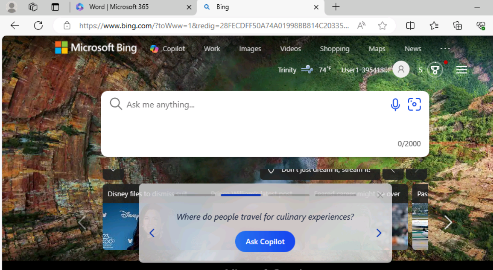

5.  En la **página de inicio de Microsoft Bing**, en la lista de
    pestañas que aparece en la parte superior de la página,
    seleccione **Copilot**. Al hacerlo, se abrirá **Microsoft Copilot**.

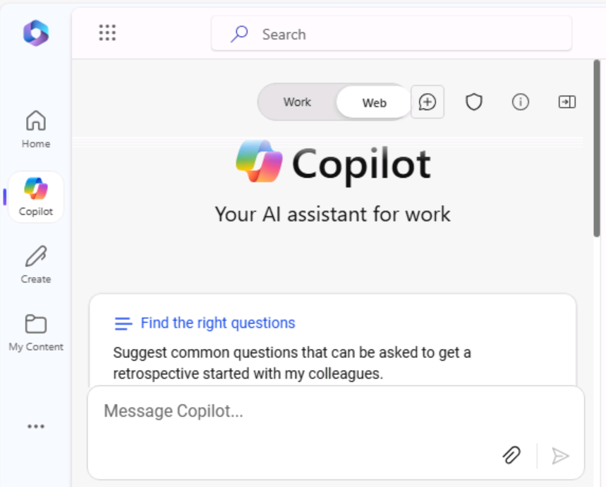

**Nota:** Si no ve la lista de pestañas en la parte superior de la
página, siga los pasos que se indican a continuación para verla.

- Asegúrese de haber iniciado sesión con las **credenciales de Microsoft
  365** (disponibles en la pestaña **Resources**).

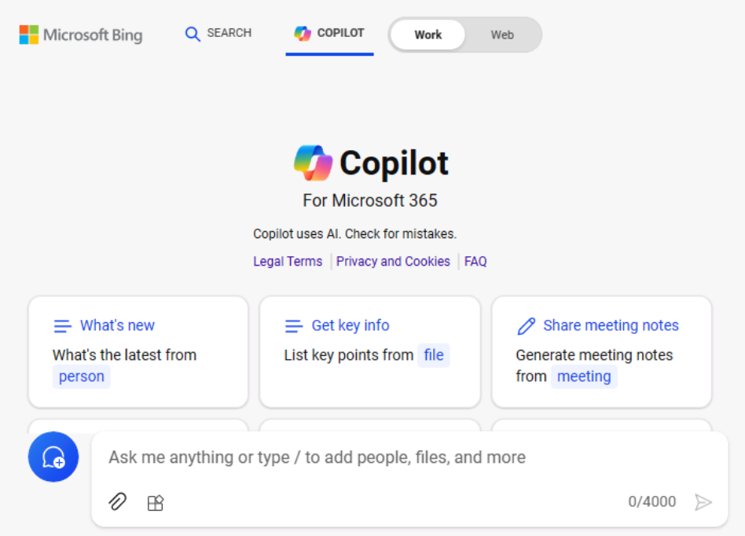

- Active la opción **Show menu bar** (resaltada en rojo).

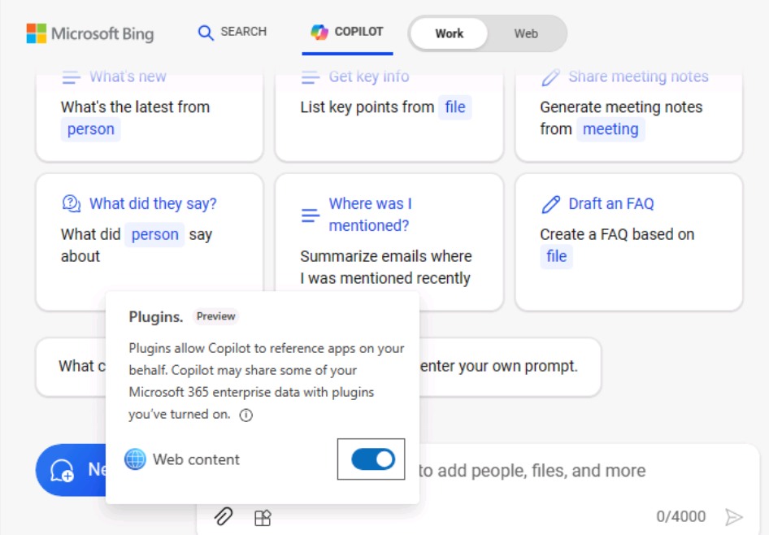

6.  Ahora seleccione **Copilot**. Al hacerlo, se abrirá Microsoft
    Copilot.

7.  En la página **Copilot**, en el conmutador **Work/Web** situado en
    la parte superior de la página, seleccione **Work**.

8.  De forma predeterminada, la opción **Work** limita el alcance de
    Copilot a los datos de su organización de Microsoft 365. Sin
    embargo, dado que también desea que Copilot acceda a las directrices
    web públicas sobre la instalación de un producto de seguridad de red
    corporativa, debe habilitar el complemento **Web content**. Para
    ello, en el campo de prompt situado en la parte inferior de la
    página, verá dos iconos: el icono del clip, que sirve para adjuntar
    archivos, y un icono de bloques apilados. Este último icono es el
    icono de Plugins.

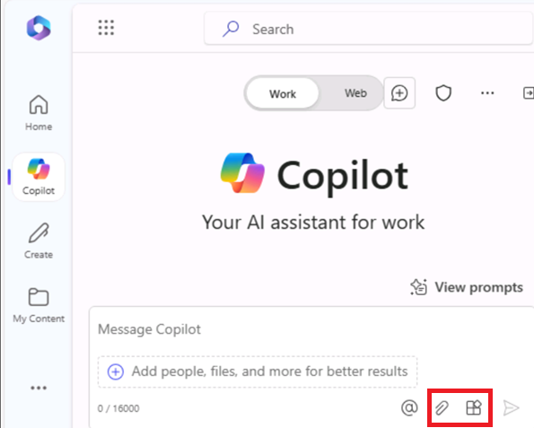

9.  Seleccione este icono de **Plugins** y active el plugin **Web
    content**.

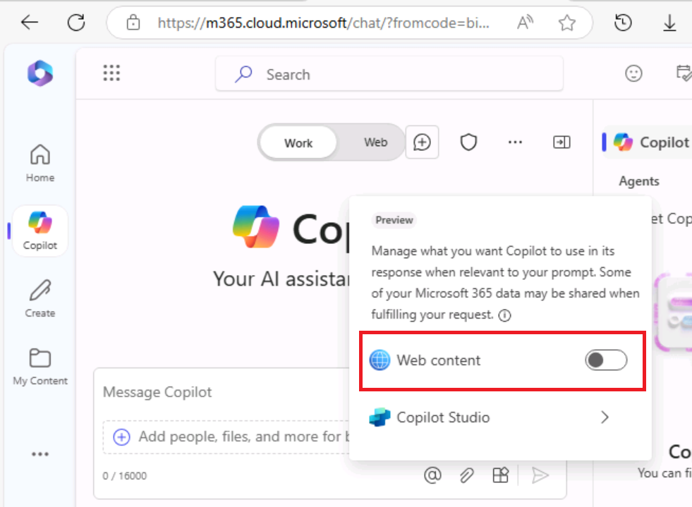

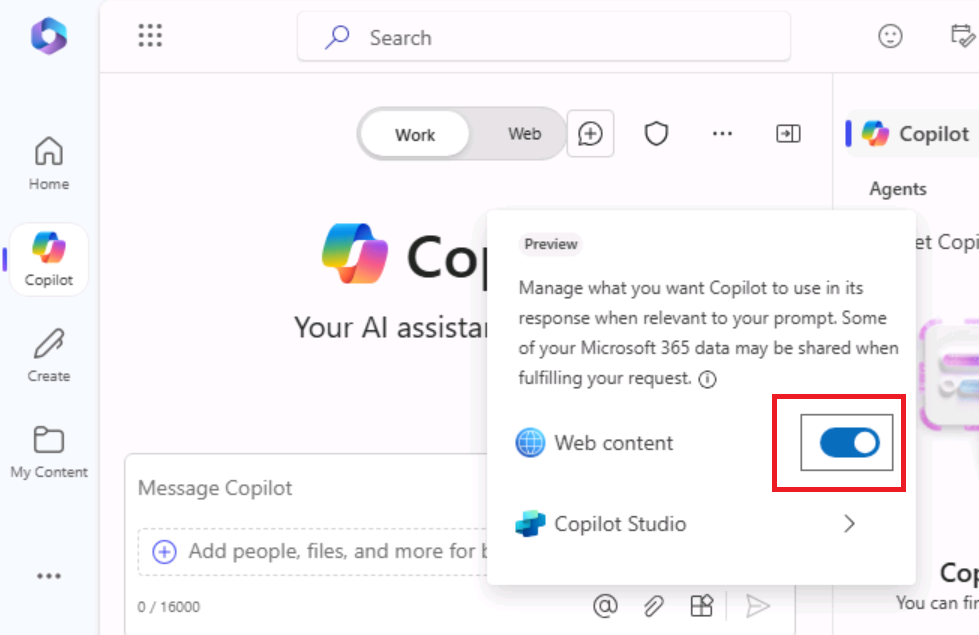

10. Ya está listo para utilizar Copilot. Ingrese el siguiente prompt,
    que indica a Copilot que acceda a datos web públicos a través del
    plugin **Web content** de Microsoft Copilot, y luego seleccione la
    flecha **Submit** en la esquina inferior del campo del prompt:

++**I'm the Director of IT at Adatum Corporation. Create a project plan
for installing a new network security product into a corporate network.
Base this plan on IT industry guidelines for installing network security
products**.++

11. Revise el plan del proyecto creado por Copilot.

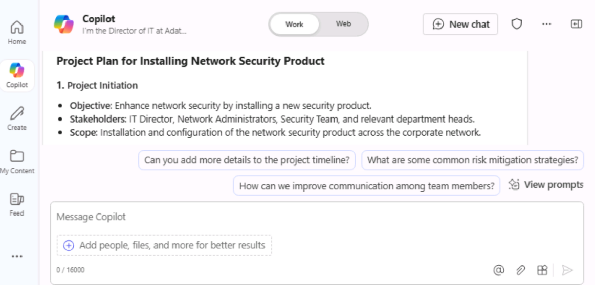

12. No está satisfecho con que abarque todas las áreas que debería.
    Ingrese el siguiente prompt para que modifique su plan e incluya
    áreas de interés específico para usted. Si alguna de las áreas
    incluidas en este prompt ya se encuentra en la respuesta anterior de
    Copilot, elimínela de este prompt para que Copilot no la duplique:

++**While that was a good start, I feel like it's missing important
areas. Please add the following items to the existing list: testing and
QA, training, communication, document and reporting, stakeholder
analysis, project timeline, and risk assessment and mitigation**.++

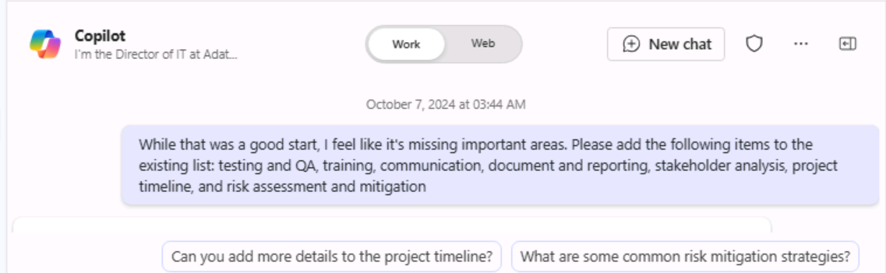

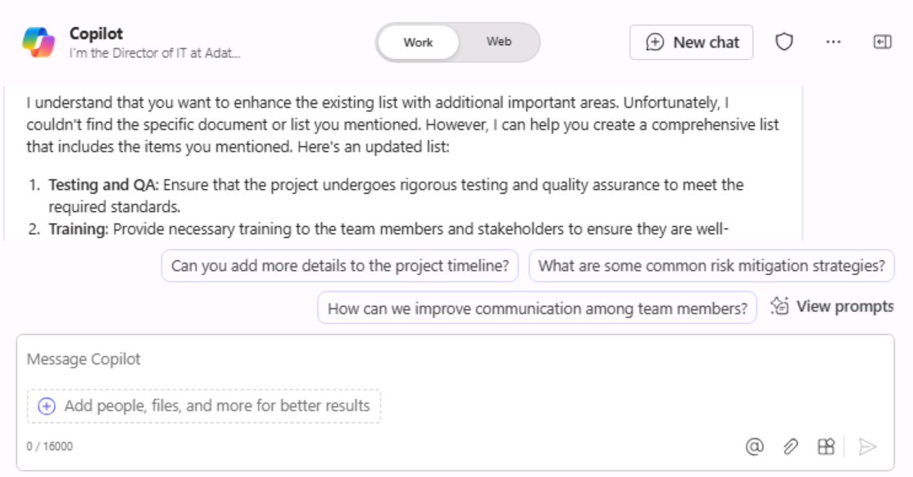

13. Revise el plan del proyecto modificado. Está satisfecho con la
    amplitud de los temas tratados, por lo que ahora desea que Copilot
    actualice el plan con información de las especificaciones del
    producto de seguridad Contoso CipherGuard Sentinel X7. Escriba el
    siguiente prompt, pero no lo envíe todavía, ya que primero debe
    vincular el archivo al prompt en el siguiente paso:

++**This version looks better. Please review the attached file, which is
a product specification for the Contoso CipherGuard Sentinel X7 security
product, and update your project plan with information from this product
spec**.++

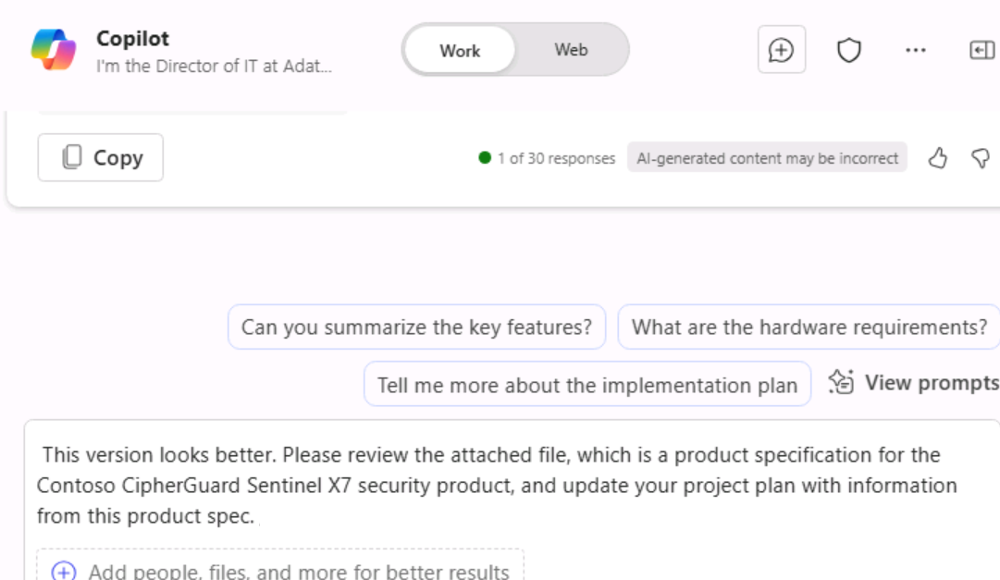

14. En el campo del prompt, ingrese un espacio después del prompt y
    luego escriba una barra diagonal (/). Debe ingresar el espacio antes
    de la barra diagonal para que Copilot lo reconozca como una
    solicitud para adjuntar algo al prompt. El siguiente paso depende de
    si Copilot abre una ventana para que seleccione el archivo:

    - Si Copilot abre una ventana después de introducir la barra
      diagonal (/), seleccione la pestaña **Files**. Al hacerlo, se
      mostrará la lista de archivos MRU. Seleccione el archivo **Contoso
      CipherGuard Product Specification** y, a continuación, seleccione
      el icono **Submit**.

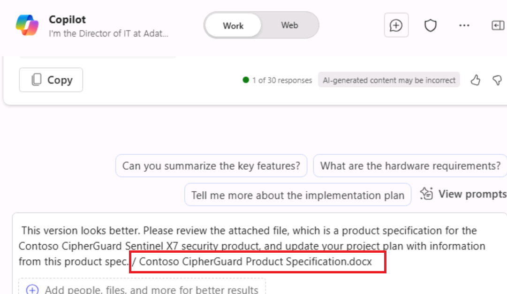

- Si Copilot no ha realizado ninguna acción después de introducir la
  barra diagonal (/), deberá copiar y pegar el enlace al
  archivo **Contoso CipherGuard Product Specification**. Para ello,
  localice el archivo en su cuenta de OneDrive, ábralo en **Word**,
  seleccione el botón **Share** que aparece encima de la cinta de Word,
  seleccione **Copy link** en el menú desplegable que aparece y, a
  continuación, vuelva a este campo de prompt, pegue el enlace después
  de la barra diagonal y seleccione el icono **Submit**.

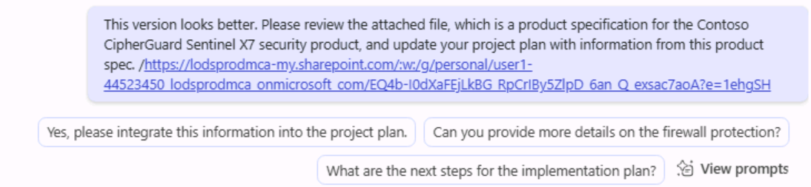

**Nota**: Si Copilot no puede acceder directamente a los documentos ni
revisarlos, cierre la sesión del usuario que ha iniciado sesión, vuelva
a iniciar sesión y continúe desde el **paso 9**.

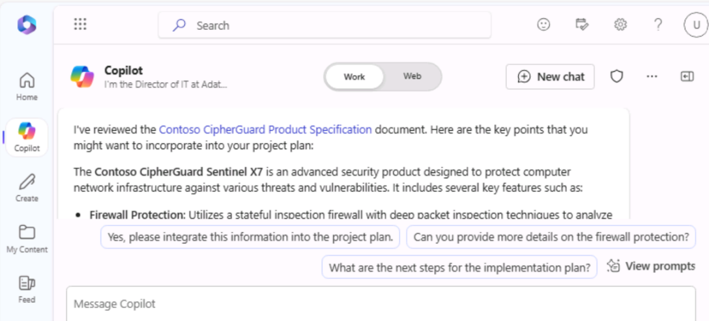

**Nota**: Si no puede ver ni consultar el documento **Contoso
CipherGuard Product Specification**, continúe con el siguiente
ejercicio. El documento del plan del proyecto está disponible para que
pueda continuar con el resto de la actividad de laboratorio.

15. Revise cómo Copilot ha insertado las características de las
    especificaciones del producto en el plan del proyecto.

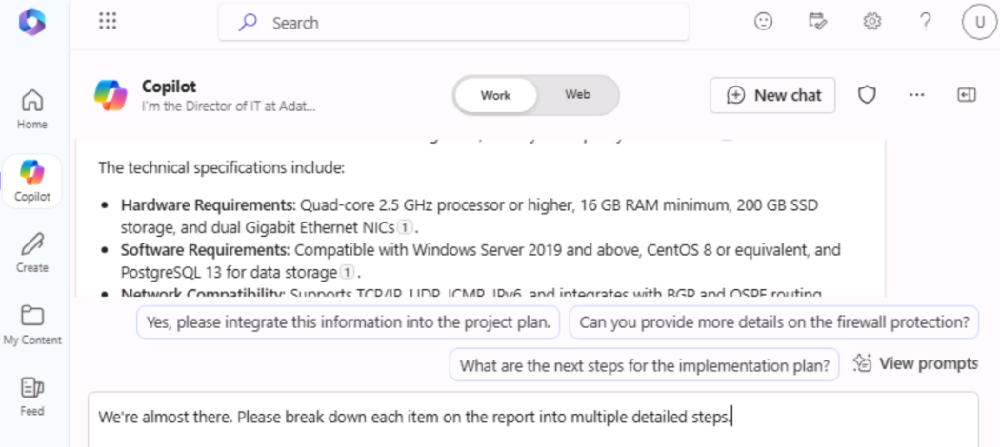

16. Aunque esto parece adecuado, usted considera que el plan del
    proyecto carece de detalles específicos. Para resolver este
    problema, ingrese el siguiente prompt:

++**We're almost there. Please break down each item on the report into
multiple detailed steps**.++

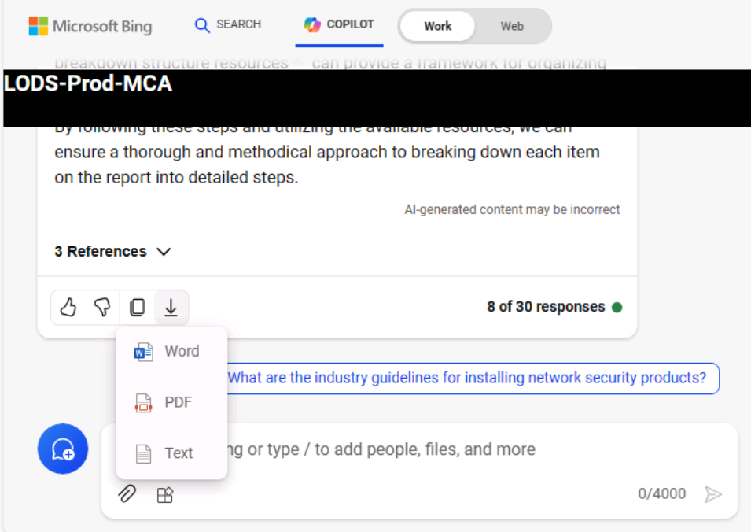

17. Revise los resultados.

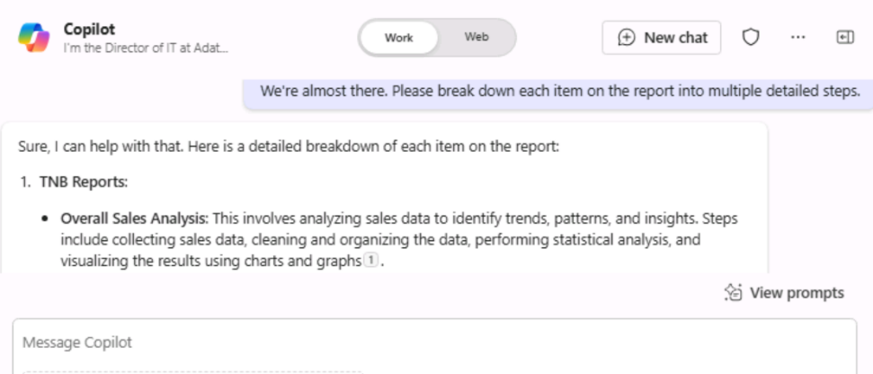

18. Ahora que ha creado el plan del proyecto, es imprescindible que lo
    guarde en un documento de Word. **Este documento del plan del
    proyecto lo utilizará en el próximo ejercicio**. En la parte
    inferior de la respuesta final de Copilot, seleccione el botón
    **Copy** para copiar el contenido.

**Nota**: Verá un botón **Edit in Pages** que ofrece más funcionalidades
y facilita la colaboración en equipo. No utilizaremos **Edit in
Pages** en este ejercicio. Se incluye un ejercicio de laboratorio
independiente en el Laboratorio
\#06. 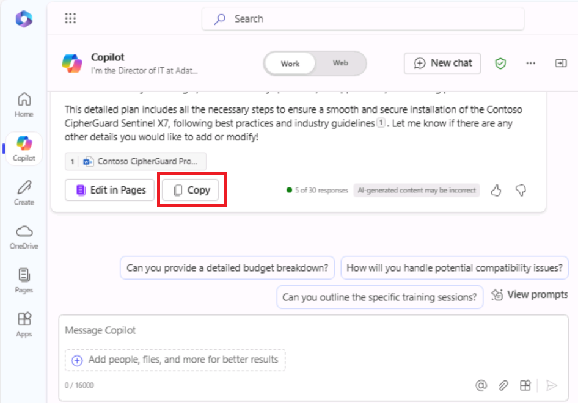

Abra un documento de **Word** en blanco en un navegador y pegue la
respuesta.

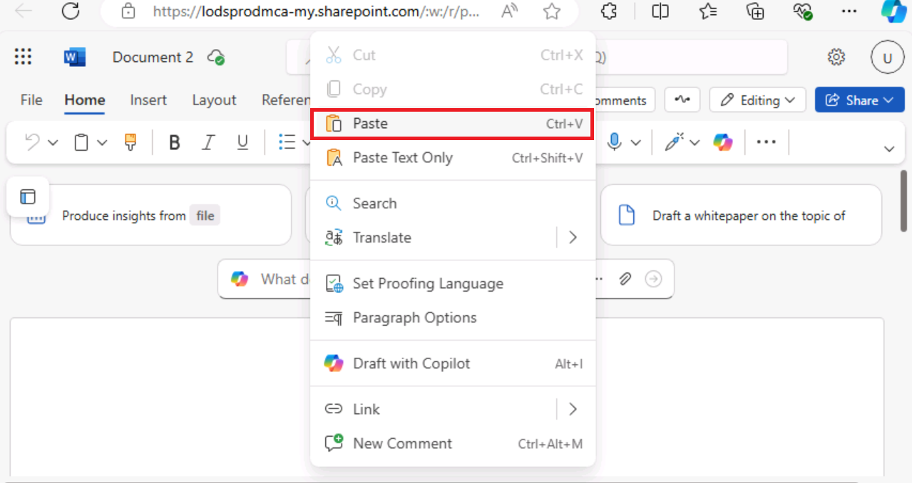

Una vez pegado el contenido copiado, aparecerá el menú
contextual **Paste options**. Puede utilizar **Keep Source
formatting**. 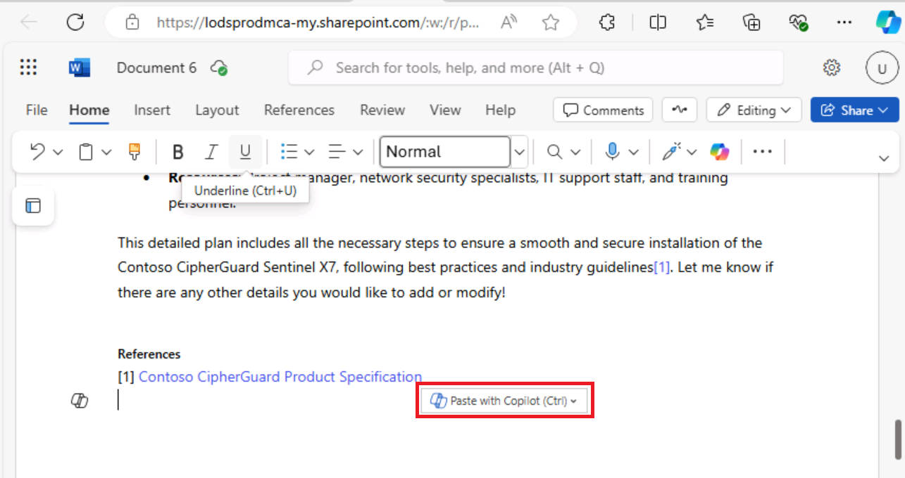

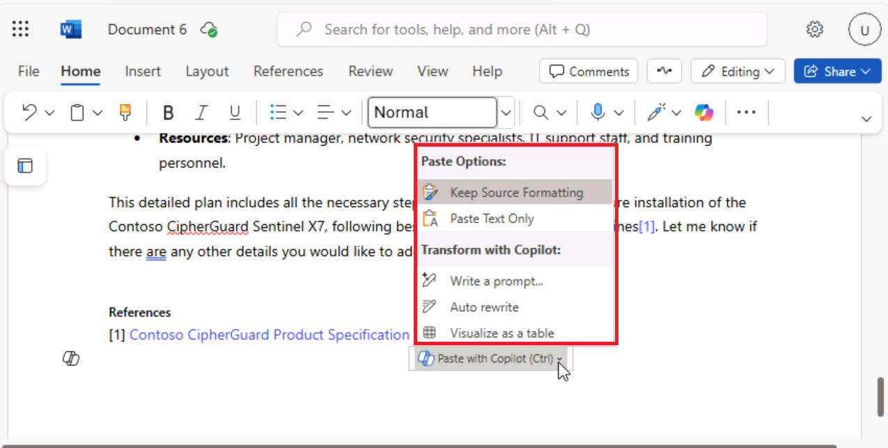

19. Haga clic en el campo del nombre del archivo en la parte superior
    izquierda (como se muestra en la captura de pantalla) y cambie el
    nombre del archivo a +++Contoso CipherGuard project plan.docx+++ en
    su **OneDrive**. Utilizará este archivo en el siguiente ejercicio.

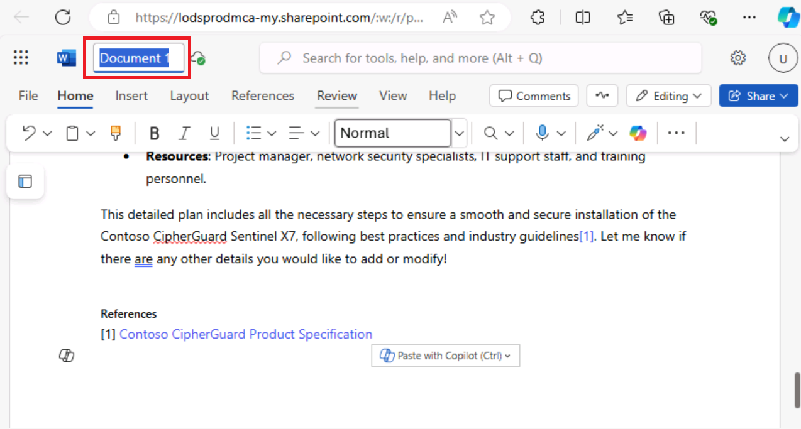

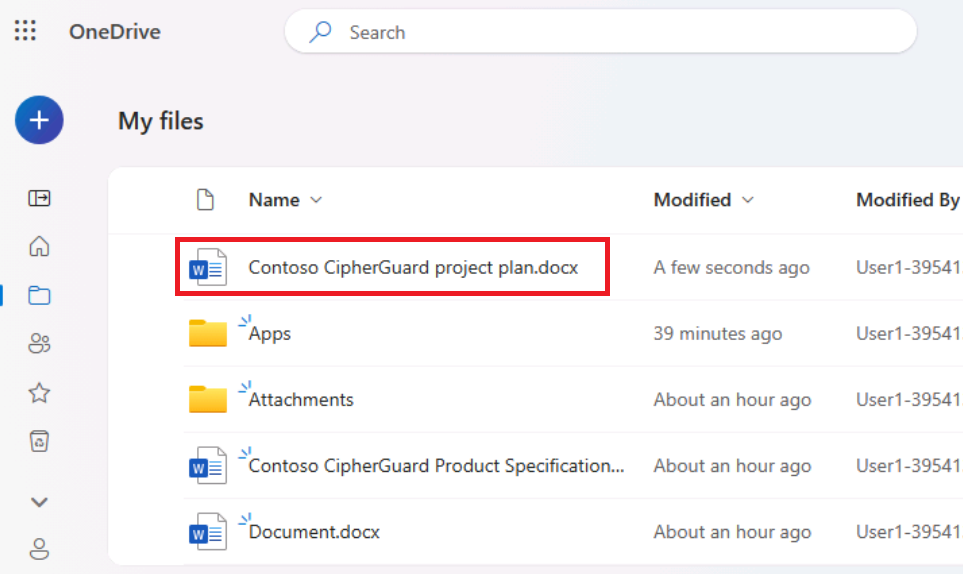

**Ejercicio \#2: Crear una presentación del plan de un proyecto
utilizando Copilot en PowerPoint**

Copilot en PowerPoint actúa como un colaborador inteligente, ofreciendo
sugerencias y mejoras en tiempo real mientras los profesionales de IT
elaboran sus presentaciones para:

- Presentar sus ideas o propuestas a su equipo o a la dirección.

- Capacitar a nuevos empleados o realizar demostraciones de nuevo
  software o hardware a los clientes.

- Explicar conceptos técnicos complejos a personas sin conocimientos
  técnicos, como partes interesadas o inversores.

- Mostrar su trabajo o promocionar sus servicios a clientes potenciales.

Con Copilot en PowerPoint, puede crear una presentación a partir de un
documento de Word existente. Cuando proporciona a Copilot en PowerPoint
el enlace a su documento de Word, este puede generar diapositivas,
aplicar diseños y elegir un tema por usted.

En este ejercicio, utilizará Copilot en PowerPoint para crear una
presentación de diapositivas basada en el plan de proyecto que creó en
el ejercicio anterior. Desea utilizar esta presentación para explicar el
plan de proyecto a su personal de IT y, en última instancia, a la
dirección de la empresa.

**Nota**: Si ha completado el ejercicio anterior y ha creado un
archivo **Contoso CipherGuard project plan.docx**, asegúrese de haberlo
guardado en su cuenta de OneDrive y continúe con el paso siguiente. Sin
embargo, si no ha podido crear este plan de proyecto en el ejercicio
anterior, cargue una copia del documento **Contoso CipherGuard project
plan.docx** disponible en **C:\LabFiles**.

1.  Si tiene una pestaña de Microsoft 365 abierta en su navegador Edge,
    selecciónela ahora; de lo contrario, abra una nueva pestaña e
    ingrese la siguiente URL:
    +++[https://www.office.com+++](https://github.com/technofocus-pte/m365cpltdeplextdepth/blob/m365cpltdeplextdepth-Dec2K24/Instructions/Lab%2003/media/image22.png) para
    ir a la página de inicio de **Microsoft 365**.

2.  Abra y cierre el archivo **Contoso CipherGuard project
    plan.docx** (que guardó en **OneDrive**) para que aparezca en la
    lista de archivos usados recientemente (MRU).

3.  En el panel de navegación de **Microsoft 365**,
    seleccione **PowerPoint**. En PowerPoint, abra una nueva
    presentación en blanco.

4.  Seleccione el icono **Copilot** (resaltado en rojo, tal y como se
    muestra en la captura de pantalla). En el panel **Copilot** que
    aparece, hay varios prompts predefinidos entre los que puede elegir.

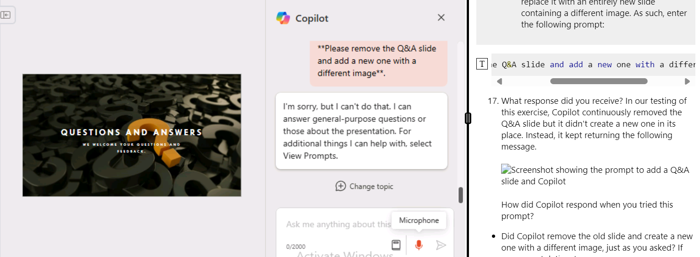

5.  Seleccione el prompt **Create presentation from file**.

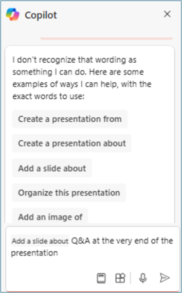

6.  En el campo de prompt situado en la parte inferior del
    panel **Copilot**, Copilot introduce automáticamente el
    texto: **Create presentation from file /**. La barra diagonal es el
    indicador universal de Copilot para introducir un vínculo a un
    archivo. En este caso, hace que Copilot abra una
    ventana **Suggestions** que muestra tres de los archivos usados
    recientemente.

    - Si su archivo aparece aquí, selecciónelo ahora y continúe con el
      siguiente paso.

    - Si el archivo no se encuentra entre los tres que se muestran,
      seleccione la flecha derecha (**\>**) en la esquina superior
      derecha de la ventana **Suggestions** para ver una lista ampliada
      de archivos MRU. Si el archivo aparece aquí, selecciónelo ahora y
      continúe con el siguiente paso.

    - Si no ve su archivo en la lista MRU ampliada, debe copiar el
      enlace al informe y pegarlo en el campo prompt. Para hacer esto:

a\. Seleccione la pestaña del navegador **Microsoft 365** y
seleccione **Word** en el panel de navegación.

b\. En la página de inicio de **Word**, en la lista de archivos
recientes, seleccione el informe para abrirlo en Word.

c\. En el informe en Word, en el extremo superior derecho de la cinta,
seleccione el botón **Share**. En el menú desplegable que aparece,
seleccione **Copy Link**. Espere a que aparezca la ventana **Link
copied**, que le garantiza que el enlace al archivo se ha copiado en el
portapapeles.

d\. Cambie a la pestaña **PowerPoint** y, en la parte inferior del
panel **Copilot**, el campo de prompt debería seguir mostrando **Create
presentation from file /**. Coloque el cursor después de la barra
diagonal (**/**) y pegue (**Ctrl+V**) el enlace al informe.

7.  Observe cómo aparece el archivo en el campo de prompt. Seleccione el
    icono **Send** en el campo del prompt. Este prompt ha activado
    Copilot para crear una presentación de diapositivas basada en el
    documento. Al hacerlo, primero ha mostrado el esquema de la
    presentación. A continuación, ha mostrado una ventana separada con
    una lista con viñetas de algunos de los cambios que ha realizado en
    la presentación basándose en el documento.

8.  Ahora puede revisar las diapositivas y realizar las actualizaciones
    necesarias. Preste especial atención a los cambios que Copilot ha
    realizado basándose en el documento. Puede utilizar la
    herramienta **Designer** para ajustar los diseños.

9.  Observe que no hay una diapositiva al final para una sesión de
    preguntas y respuestas (Q&A). Para corregir este descuido, ingrese
    el siguiente prompt:

+++Add a Q&A slide at the very end of the presentation with an
appropriate image.+++

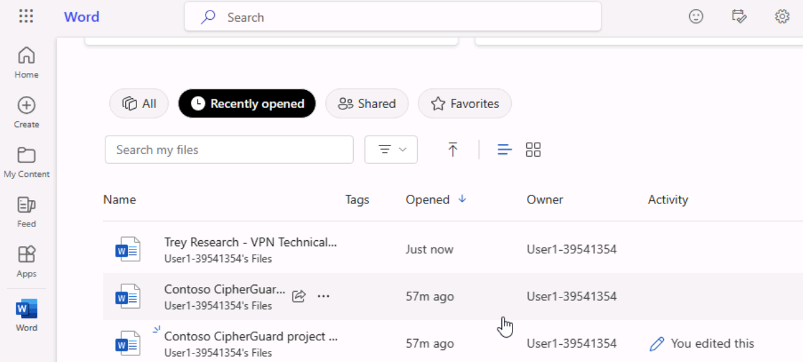

10. Revise la nueva diapositiva que se ha creado. No le gusta la imagen
    que Copilot ha utilizado para esta diapositiva, así que ingrese el
    siguiente prompt solicitando a Copilot que cambie la imagen:

+++I don't like the image you used on the Q&A slide. Please replace it
with a different image.+++

11. ¿Qué respuesta recibió? En ocasiones, Copilot no sustituyó la imagen
    y mostró el siguiente mensaje.

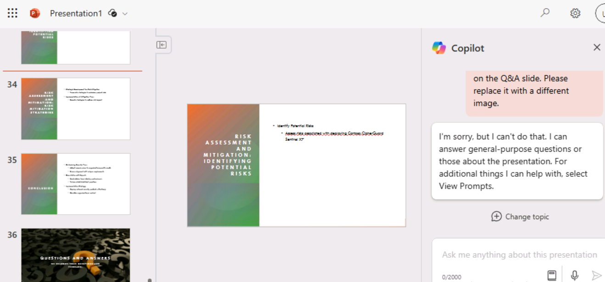

**Nota:** Copilot puede mostrar alguna excepción (recuerde que Copilot
aún se encuentra en fase de desarrollo) como la anterior.

12. Por favor, intente reformular el prompt o utilice los prompts
    sugeridos, como el que aparece a continuación.

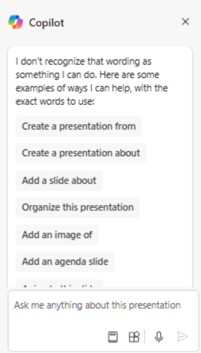

13. Seleccione el comando **Add a slide about** y añada lo siguiente al
    final de la presentación: +++Q&A at the very end of the
    presentation+++ (tal y como se muestra en la captura de pantalla).

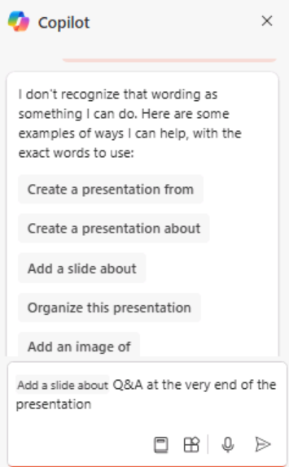

14. Haga clic en Send para comprobar qué sucede. Copilot ha añadido una
    diapositiva de preguntas y respuestas (Q&A) tal y como se le ha
    indicado.

15. Ahora inténtelo con otro prompt:

**Añada una diapositiva sobre **lo que el público podría preguntar
acerca de la presentación.

16. Una vez finalizada la presentación final, puede guardarla para
    futuras consultas o descartarla.

17. Independientemente de cómo hayan ido los últimos pasos al tratar la
    diapositiva de preguntas y respuestas (Q&A), decide seguir adelante
    e intentar una última cosa. Al revisar la presentación, decide que
    desea cambiar el tema de la presentación por otro más apropiado
    debido a la naturaleza técnica del tema. Ingrese el siguiente
    prompt:

+++Change the theme of this presentation to something more technical+++ 

18. Observe la respuesta de Copilot.

Este escenario es una de esas situaciones en las que conviene recordar
la práctica recomendada para los prompts: **comprenda las limitaciones
de Copilot**. En este caso, no se trata tanto de comprender una
limitación como de comprender cómo funciona Copilot. En este caso,
Copilot le indica una característica existente de PowerPoint en lugar de
duplicar lo que hace esa característica.

19. Aunque los ejercicios de formación restantes de este módulo no
    utilizan esta presentación, puede descartarla o guardarla si desea
    consultarla en el futuro.

**Ejercicio \#3: Actualizar un informe técnico utilizando Copilot en
Word**

Copilot en Word puede ayudar a los profesionales de IT a ahorrar tiempo
y esfuerzo al crear documentos. Puede ayudarle a generar contenido,
reescribir texto y ofrecer sugerencias útiles. Con su asistencia de
redacción basada en IA, Copilot puede ayudarle a crear documentos de
forma más eficiente y efectiva.

Cuando crea un documento nuevo o trabaja en uno existente, Copilot puede
ayudarle de diferentes maneras.

- En un documento nuevo en blanco o cuando desee agregar contenido a un
  documento existente, puede indicarle a Copilot sobre qué desea
  escribir y este generará el contenido en consecuencia.

- En un documento con contenido existente, Copilot puede ayudarle a
  transformar el contenido. Puede reescribir el contenido seleccionado o
  incluso transformarlo en una tabla.

En este ejercicio, utilizará Copilot en Word para actualizar un
documento existente. Indicará a Copilot que añada texto nuevo, reescriba
el texto existente y transforme el texto en una tabla.

1.  Si tiene abierta una pestaña de Microsoft 365 en su navegador
    Microsoft Edge, selecciónela ahora; de lo contrario, abra una nueva
    pestaña e ingrese la siguiente
    URL: +++[https://www.office.com/+++](https://github.com/technofocus-pte/m365cpltdeplextdepth/blob/m365cpltdeplextdepth-Dec2K24/Instructions/Lab%2003/media/image13.png) para
    ir a la página de inicio de **Microsoft 365**.

**Nota**: Debe iniciar sesión (si se le solicita) utilizando
las **credenciales de Microsoft 365** proporcionadas en la **pestaña
Resources** a la derecha.

2.  Navegue hasta la carpeta **C:\LabFiles** para seleccionar y cargar
    una copia de **Trey Research - VPN Technical
    Overview.docx** en **OneDrive**.

**Nota**: Puede omitir este paso si ya ha cargado una copia de todos los
documentos (que utilizará en esta sesión práctica de laboratorio)
desde **C:\LabFiles**, tal y como se indica en el **Laboratorio 0**.

3.  Abra y cierre el archivo **Trey Research - VPN Technical
    Overview.docx** (que ha subido a **OneDrive**) para que aparezca en
    la lista de archivos usados recientemente (MRU).

4.  En **Microsoft 365**, abra **Microsoft Word**.

5.  Abra el archivo **Trey Research - VPN Technical Overview.docx**.

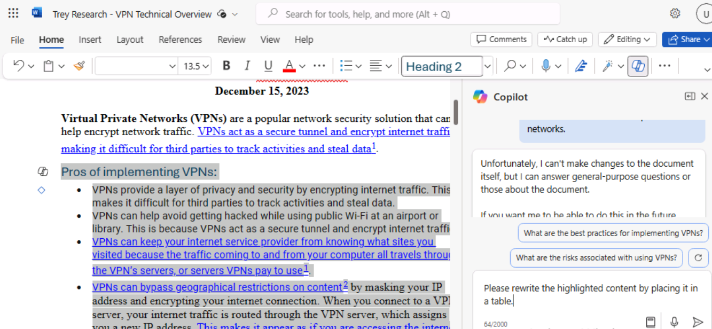

6.  En la cinta de **Word**, seleccione el botón **Copilot** para abrir
    el panel Copilot.

7.  En el panel **Copilot**, ingrese el siguiente prompt y, a
    continuación, seleccione el icono de fecha (**Send**):

+++Write a new section for this document about the types of VPNs.
Discuss the pros and cons of each type. This content is for a technical
audience, so please provide specific details+++

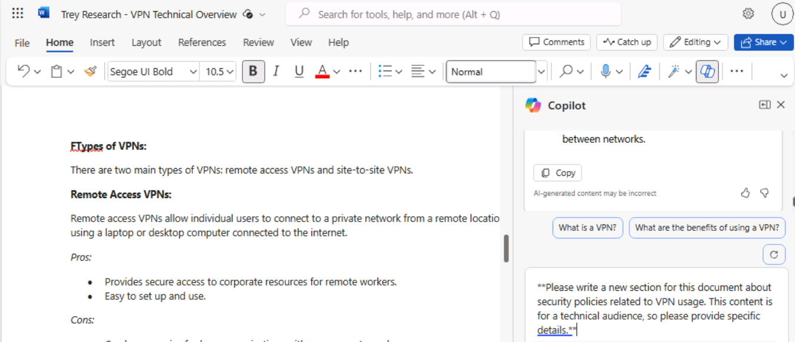

8.  Copilot no añade contenido nuevo directamente en un documento.
    Muestra el contenido en una ventana de respuesta en el panel
    Copilot. Sin embargo, proporciona un botón **Copy** en la parte
    inferior de cada ventana de respuesta, por lo que debe seleccionar
    el botón **Copy** para copiar su contenido al portapapeles. Al
    examinar el documento, decide pegar el contenido debajo del párrafo
    inicial. Pegue el contenido ahora.

**Consejo:** Al seleccionar el botón** Copy **en una ventana de
respuesta, se copia TODO el contenido, incluidos los comentarios de
Copilot dirigidos a usted. Este tipo de comentarios suelen aparecer al
principio y al final de la respuesta. Asegúrese de eliminar estos
comentarios una vez que pegue la respuesta en su documento. Es probable
que el tipo y el tamaño de la fuente del nuevo contenido no coincidan
con los utilizados en el resto del documento. Por lo tanto, deberá
modificarlos para que coincidan.

9.  Después de revisar más detenidamente, observa que no se mencionan
    las políticas de seguridad relacionadas con el uso de VPN. Este tema
    es un área clave que desea incluir, por lo que debe introducir el
    siguiente prompt:

+++Please write a new section for this document about security policies
related to VPN usage. This content is for a technical audience, so
please provide specific details.+++

10. Copie y pegue el contenido de esta respuesta en el documento.
    Colóquelo justo antes de la sección **Risks and mitigations** y, a
    continuación, edite el contenido según sea necesario. Si es
    necesario, añada un encabezado para esta sección titulado **Security
    policies related to VPN usage**.

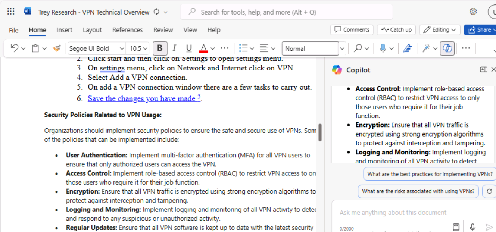

11. Al revisar el informe, también ha identificado un área del contenido
    que considera que debe reescribirse. En la sección sobre **Risks and
    mitigations**, el primer punto abarca tanto las VPN domésticas como
    las empresariales. Desea que solo se refiera a las VPN
    empresariales. Sin embargo, dada la forma en que está redactado el
    contenido, no parece que sea una solución sencilla. Decide pedir a
    Copilot que reescriba el contenido por usted.

**Consejo:** Para que Copilot reescriba contenido, primero debe resaltar
el contenido que desea que Copilot reescriba.

12. Resalte el contenido de la primera viñeta de la sección **Risks and
    mitigation** y, a continuación, ingrese el siguiente mensaje:

+++The highlighted content discusses the risks of using VPNs in both
home and enterprise networks. Remove the content related to home
networks and focus solely on the risks of VPNs in enterprise networks+++

13. Verifique la respuesta de Copilot. En ocasiones, esta función de
    reescritura no ha funcionado. Cuando no ha funcionado, Copilot ha
    devuelto la siguiente respuesta. Si se presenta esta situación,
    copie y pegue en su indicador e inténtelo de nuevo (recuerde,
    repita, repita, repita).

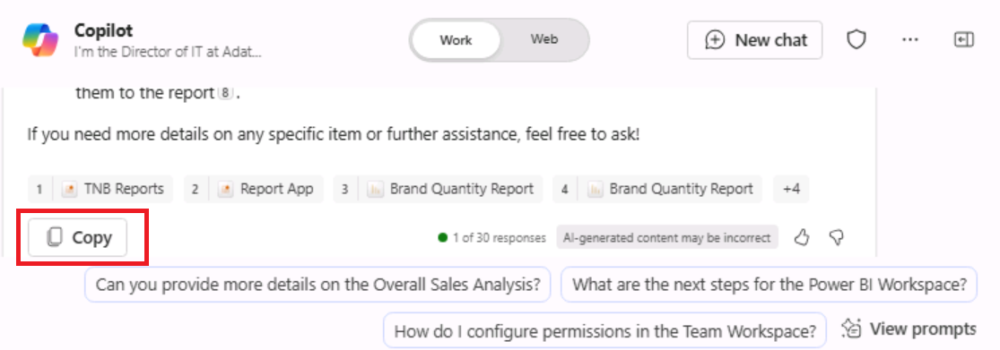

14. Después de realizar una revisión final del documento, decide que las
    secciones sobre las ventajas y desventajas de implementar VPN se
    verían mejor en una tabla en lugar de en una lista con viñetas. Como
    ha resaltado una sección para reescribir, decide resaltar estas dos
    secciones. Resalte ambas secciones y, a continuación, ingrese el
    siguiente prompt:

+++Please rewrite the highlighted content by placing it in a table.+++

15. Tenga en cuenta la respuesta del Copilot.

16. Reformatear contenido en una tabla es diferente a reescribirlo. En
    lugar de resaltar el contenido que desea colocar en una tabla, debe
    describir en su indicación qué secciones de contenido desea incluir
    en la tabla. Esta vez, ingrese el siguiente prompt:

+++Place the content from the Pros and Cons of implementing VPNs into a
table.+++

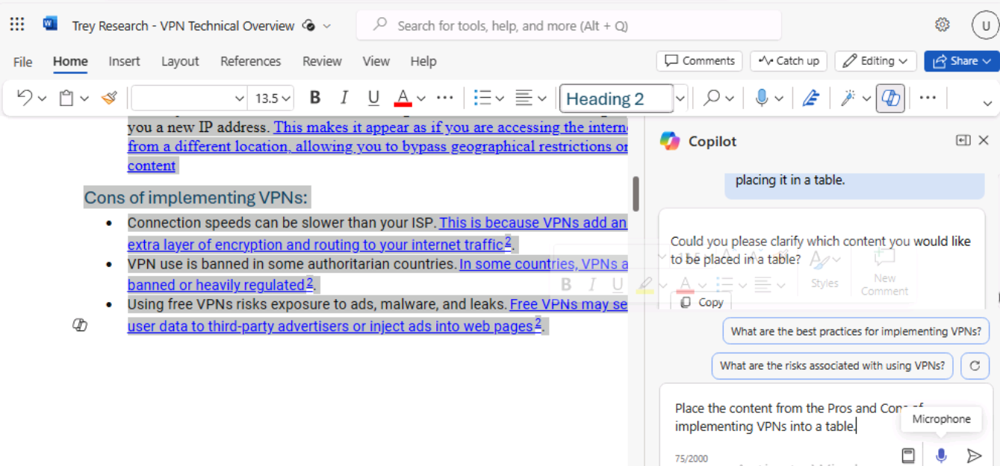

17. Observe la respuesta de Copilot. En lugar de reescribir o sustituir
    el contenido existente en el documento por una tabla, muestra la
    tabla en su respuesta. Depende de usted sustituir el contenido
    copiando y pegando la tabla en el documento. En la respuesta,
    seleccione el botón **Copy **y, a continuación, en el documento,
    resalte las secciones Pros y Cons y péguelas en la tabla. Asegúrese
    de añadir un encabezado de sección antes de la tabla que
    diga: **Pros and Cons of implementing VPNs.** Es probable que
    también tenga que cambiar el tipo y el tamaño de la fuente del
    contenido de la tabla para que coincida con el tipo y el tamaño de
    fuente utilizados en todo el documento.

18. En este punto, considera que el documento está completo. Sin
    embargo, para mayor seguridad, decide preguntar a Copilot si cree
    que el documento debería incluir alguna otra información. Ingrese el
    siguiente prompt:

+++Is there anything missing in this document that you would recommend
adding?+++

19. Observe la respuesta de Copilot. En nuestras pruebas, nos indicó que
    no faltaba nada. Inténtelo de nuevo para ver si Copilot proporciona
    una respuesta diferente.

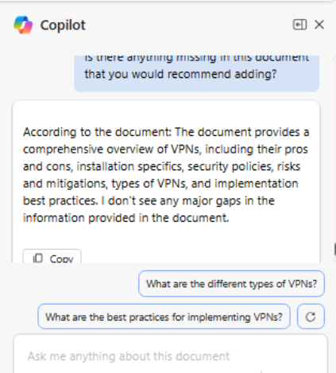

20. Si Copilot le recomienda añadir más contenido a su documento, cree
    una indicación que le solicite hacerlo. A continuación, puede copiar
    y pegar el nuevo contenido en su documento.

**Resumen:**

En este laboratorio, ha explorado cómo Copilot para Microsoft 365 mejora
la calidad de su trabajo al

- Utilizar Microsoft Copilot para extraer la información clave de un
  documento de especificaciones de producto y desarrollar un plan de
  proyecto integral para implementar el producto.

- Aprovechar Copilot en PowerPoint para diseñar una presentación basada
  en el plan de proyecto que ha creado, asegurándose de que sea
  visualmente atractiva y comunique eficazmente los detalles del plan.

- Utilizar Copilot en Word para revisar y mejorar un informe de
  especificaciones técnicas, mejorando la claridad, la coherencia y la
  calidad en general.
