# Laboratorio 03 – Automatización de asistencia de conocimiento mediante Microsoft 365 Copilot Agents

# Objetivo: 

En este laboratorio, creará y configurará un agente de Copilot mediante
las pestañas Describe y Configure.

Usará Copilot Studio Agent Builder para:

- Crear un agente mediante las pestañas Describe y Configure en Copilot
  Studio Agent Builder.

**Nota**: La disponibilidad de la pestaña **Describe** depende de la
[**disponibilidad geográfica y del soporte de
idioma**](https://learn.microsoft.com/en-us/microsoft-365-copilot/extensibility/copilot-studio-agent-builder-build).
Si la pestaña **Describe** no es compatible en su región o idioma
preferido, puede crear el agente manualmente mediante la pestaña
**Configure**.

- Personalizar las instrucciones del agente, la fuente de conocimiento y
  los starter prompts.

- Probar y editar su agente.

- Administrar y compartir su agente dentro de su organización.

# Ejercicio 1: Crear un Copilot Agent mediante la pestaña Describe 

En este ejercicio, usará la pestaña Describe en Copilot Studio para
crear un agente básico.

1.  Abra un navegador Microsoft Edge e ingrese la siguiente URL:
    +++<https://www.office.com>+++ para ir a la página principal de la
    **aplicación Microsoft 365 Copilot** (anteriormente Office).

> **Nota**: Debe iniciar sesión (si se le solicita) usando las
> **credenciales** proporcionadas en la pestaña **Resources** del lado
> derecho.
>
> 
>
> 

2.  Seleccione **Copilot** **Chat** en el panel de navegación izquierdo.

> ota: En ocasiones, la página de **Copilot** **Chat** se abre de forma
> predeterminada. En ese caso, vaya al paso \#4.
>
> 
>
> 

3.  Si por alguna razón aparece el mensaje **“Something went wrong”**,
    seleccione **Refresh** para abrir la aplicación Copilot.

> 
>
> 

4.  Seleccione **Create an agent** en el panel de navegación izquierdo
    de la página principal de Copilot.

> 

5.  Se abrirá Copilot Studio Agent Builder.

> 

6.  En la **pestaña** **Describe**, ingrese la descripción del propósito
    del agente usando lenguaje natural.

> En este ejercicio, ingrese+++ **An agent that assists users in finding
> popular learning paths and modules from Microsoft** +++.
>
> 
>
> 
>
> **Nota:** En este paso no se especifica un nombre para el agente. Por
> lo tanto, Agent Builder asignará automáticamente un nombre
> predeterminado. También puede proporcionar cualquier nombre de su
> preferencia.

7.  Haga clic en el botón **Create** en la parte superior derecha de la
    ventana de Agent Builder para enviar el agente.

> 

8.  Una vez que el agente se haya creado correctamente, seleccione Go to
    agent para comenzar la interacción con el agente.

**Nota**: En este ejercicio, usará la configuración predeterminada para
agilizar el proceso de creación.

> 

9.  De forma predeterminada, el agente se llama **Custom Insights
    Assistant agent.**

> 
>
> 

**Nota**: Si no ve el nombre del agente en la ventana de chat del
agente, puede actualizar la página o seleccionar el agente desde el
panel de navegación izquierdo de la ventana de chat del agente.

10. Ahora ha creado un agente con detalles básicos. Se le pedirá que
    refine las instrucciones del agente y realice los ajustes
    necesarios. En este ejercicio, usará la configuración predeterminada
    para agilizar el proceso de creación.

> 
>
> 

## Probar su agente

Ahora probará si el agente responde según la configuración establecida.

1.  Ingrese el siguiente prompt para evaluar la respuesta del agente.

> +++**List the popular learning paths and modules offered by
> Microsoft**+++
>
> 
>
> 
>
> 

2.  Puede verificar la respuesta comparándola con la información
    disponible en la URL proporcionada como fuente de conocimiento.

> 
>
> 

3.  También puede probar la respuesta ingresando un prompt irrelevante.

> +++**Help me with instructions for baking cakes**+++
>
> 

4.  De forma predeterminada, el agente evita proporcionar respuestas
    basadas en información no relacionada con los learning paths, lo que
    demuestra su precisión y confiabilidad al basarse en la experiencia
    predeterminada. 

**Tip:** Puede explorar más sobre Microsoft learning paths seleccionando
el icono **View** Prompts ubicado en la parte inferior derecha de la
ventana de chat de Copilot.

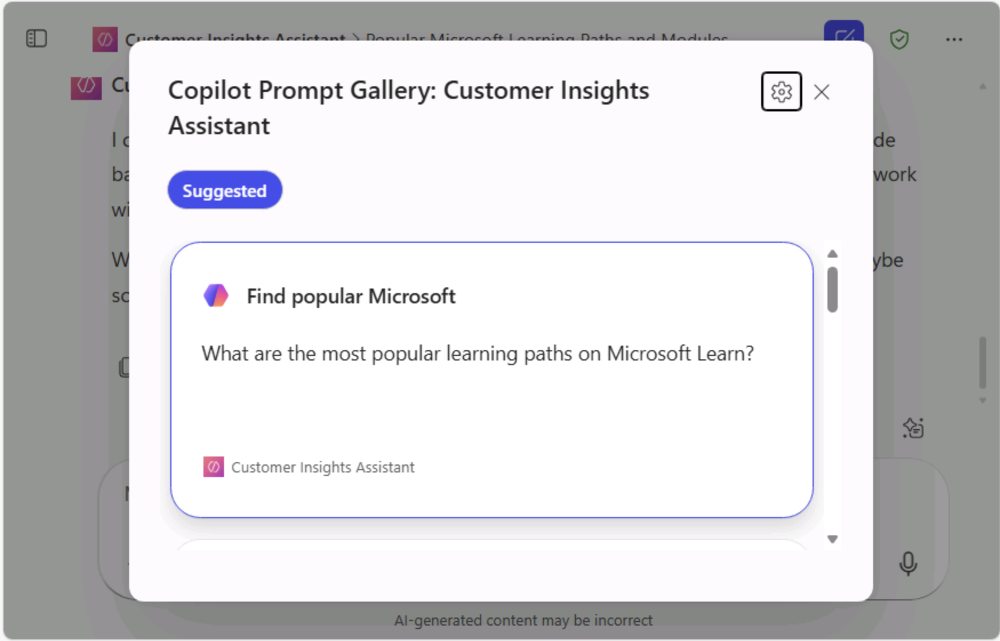

# Ejercicio 2: Configurar los detalles del agente mediante la pestaña Configure

En este ejercicio, configurará los ajustes del agente para ajustar su
comportamiento.

**Nots**: Si crea un agente directamente desde la pestaña Configure,
debe definir el nombre, la descripción y el propósito del agente.

1.  En el panel de navegación izquierdo, seleccione el agente **Custom
    Insights Assistant** que se creó con la configuración
    predeterminada. Seleccione el **icono de tres puntos (⋯)** junto a
    él y luego **Edit**.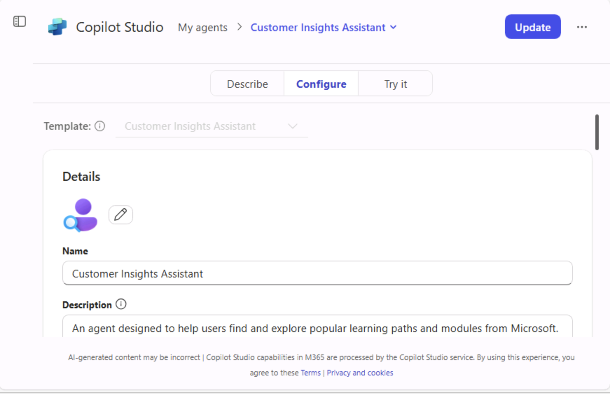

2.  En la vista de edición, puede modificar el **nombre del agente, la
    descripción,** definir **instrucciones para el comportamiento del
    agente** y agregar **fuentes de conocimiento personalizadas**.

- **New Agent Name:** *LearnAssistantBussy*

- **Instruction:** Updated

- **Knowledge Source:** Added

> 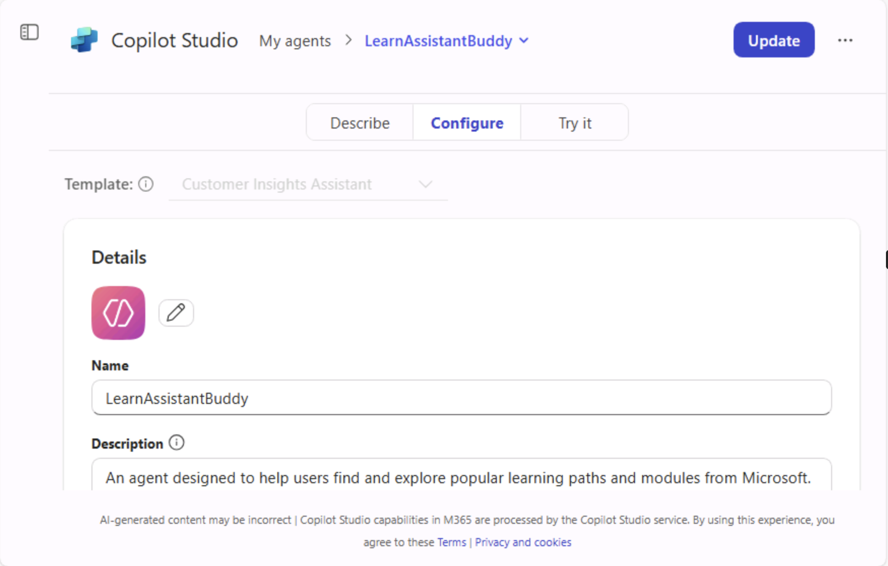

3.  Puede configurar los ajustes de comportamiento del agente, incluido
    el tono de respuesta y el estilo de interacción. En este ejercicio,
    procederá con las instrucciones predeterminadas.

> 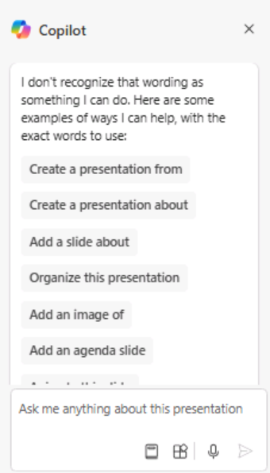

4.  Cargue los archivos, carpetas o sitios recomendados de su
    organización en la **Knowledge** **Source** del agente.  
    Seleccione el icono **Upload** (**☁️⬆️)** para agregar archivos
    directamente desde **OneDrive**.

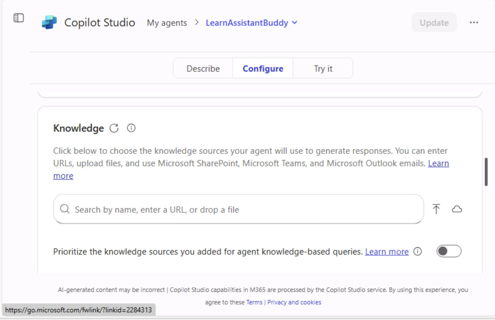

5.  Configurar ahora las fuentes de conocimiento que usará el agente,
    como sitios específicos de SharePoint, bibliotecas de documentos y
    sitios web. En este ejercicio, usará un sitio web como fuente de
    conocimiento para fundamentar las respuestas del agente.

> Ingrese +++**https://learn.microsoft.com/en-us/training/**+++ y
> presione enter.
>
> 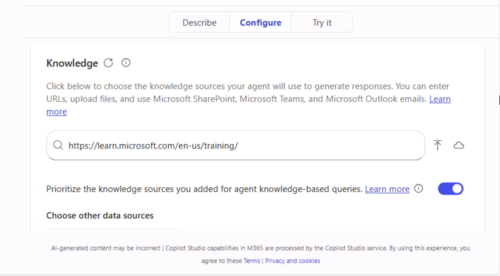
>
> **Nota**: La URL del sitio web no puede tener más de dos niveles de
> profundidad. Además, el agente buscará en sitios web públicos si no
> agrega una URL y tiene activada la búsqueda web.
>
> 

6.  Los cambios de configuración se guardan automáticamente a medida que
    edita. Para finalizar y aplicar todas las actualizaciones,
    seleccione el botón **Update** ubicado en la parte superior derecha.

> 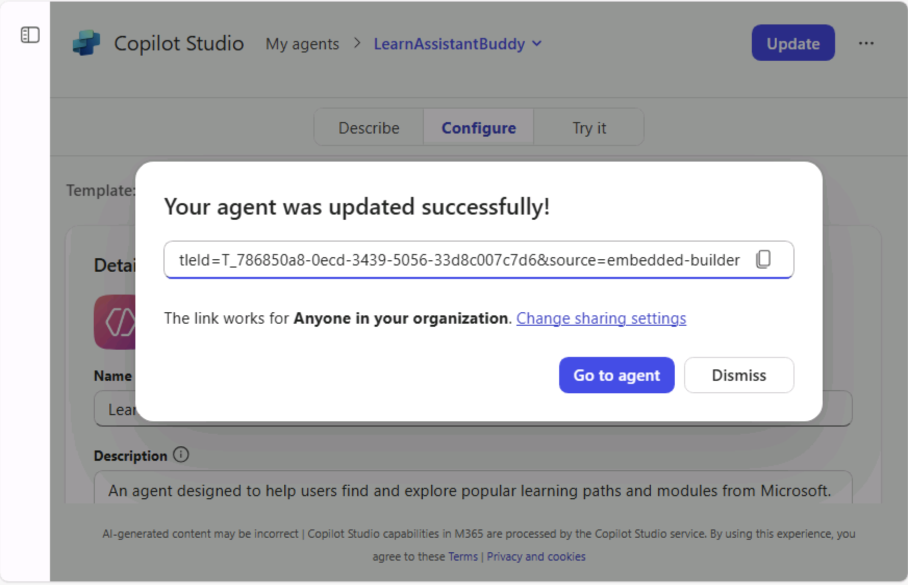

7.  Ha completado la configuración del agente con ajustes personalizados
    adaptados a las necesidades de su organización.

8.  Seleccione **Go to agent** para ver las actualizaciones en la
    ventana de chat de Copilot, verificar que el agente funcione según
    lo esperado y realizar los ajustes necesarios.

> 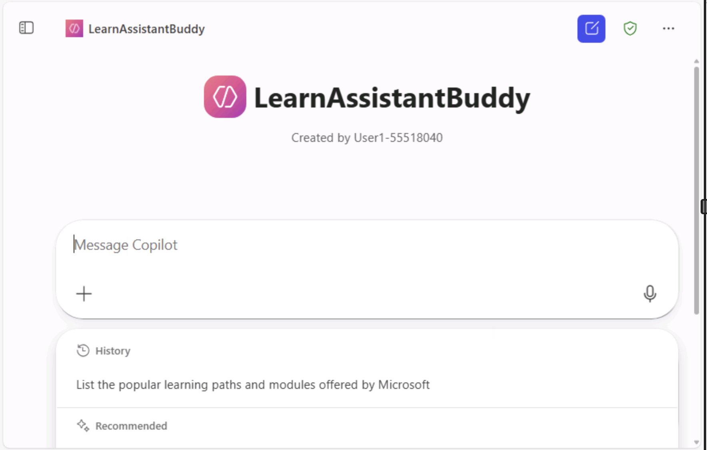

## Probar su agente personalizado

Pruebe su agente personalizado para verificar que las configuraciones
aplicadas, las fuentes de conocimiento y los ajustes de comportamiento
funcionen según lo esperado.

1.  Ingrese el siguiente prompt para evaluar la respuesta del agente. 

> +++**List the popular learning paths and modules offered by
> Microsoft**+++ 
>
> 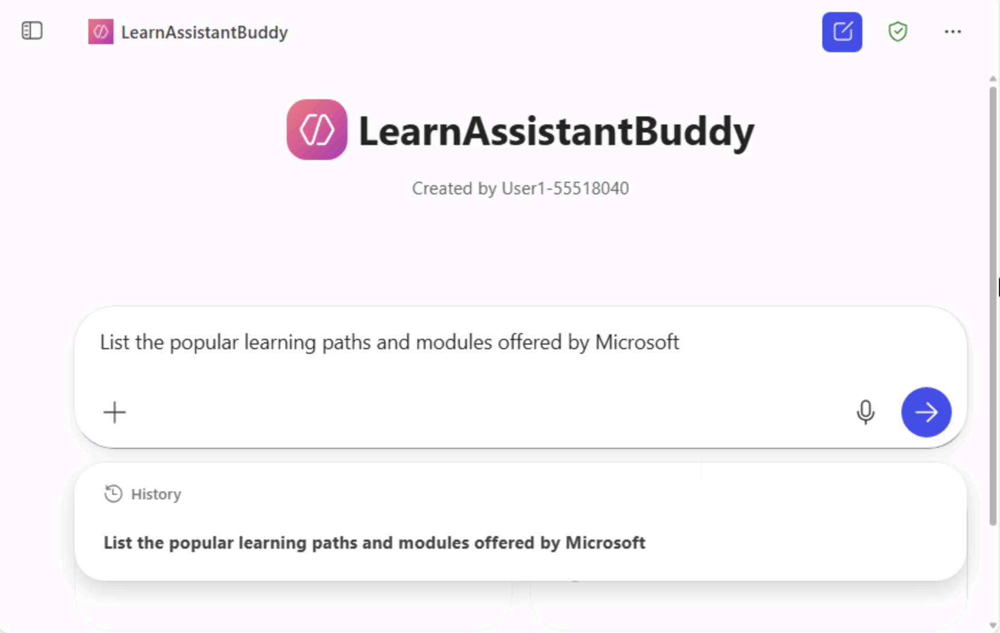
>
> 

2.  Puede verificar la respuesta comparándola con la información
    disponible en la URL ingresada como fuente de conocimiento. 

>  
>
>  

3.  También puede probar la respuesta ingresando un prompt irrelevante. 

> Prompt: +++**Find out the top 10 tourist places in India** +++ 
>
> **Nota**: El agente evitó proporcionar una respuesta según la
> instrucción “Avoid discussing topics unrelated to Microsoft learning
> paths and modules”. 

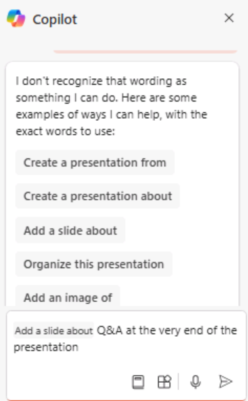

> **Nota**: El conjunto de instrucciones predeterminado en su caso puede
> ser diferente. Asegúrese de que las instrucciones estén configuradas
> correctamente para que el agente evite proporcionar respuestas no
> relacionadas. 

# Ejercicio 4: Administración y uso compartido del agente

Ahora implementará el agente dentro de su organización y administrará su
accesibilidad.

1.  Comparta el agente con usuarios o grupos específicos estableciendo
    los permisos adecuados.

2.  En el panel de navegación izquierdo, vaya al agente **Custom
    Insights Assistant**. Seleccione el **menú de tres puntos (⋯)**
    junto a él y luego **Share**.

> 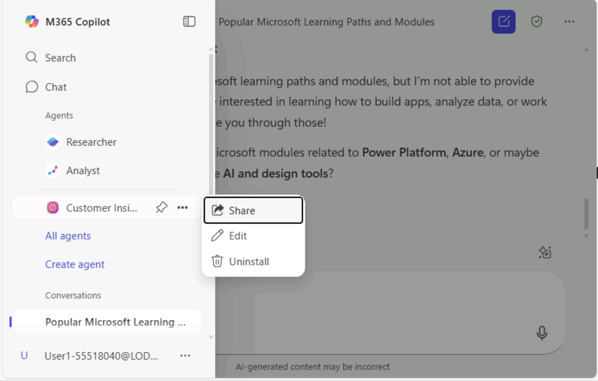

3.  En el cuadro de diálogo **Share “Customer Insights Assistant”**,
    seleccione cómo desea compartir el agente.

- Seleccione **Anyone in your organization** para que el agente esté
  disponible para todos los usuarios.

- Como alternativa, seleccione **Specific users in your organization** o
  **Only you** según su preferencia de uso compartido.

- Seleccione **Save** para confirmar su selección.

> 

4.  En este caso, se seleccionó la primera opción **Anyone in my
    organisation** para que el agente esté disponible para todos y tenga
    acceso rápido.

> 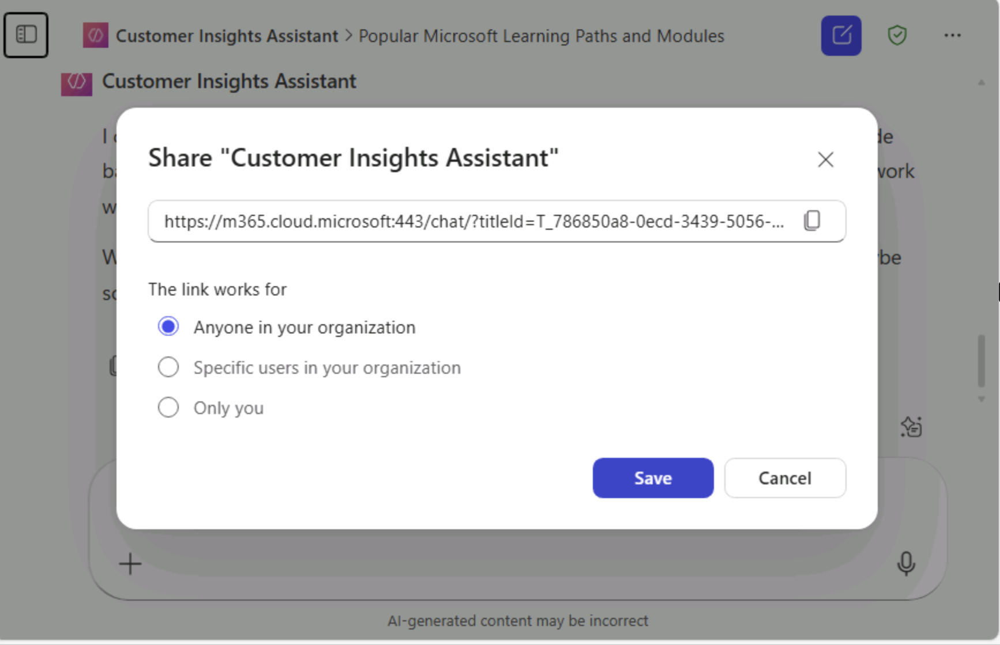

5.  Después de seleccionar **Save**, copie el enlace generado y
    compártalo con los miembros de su equipo para que puedan acceder al
    agente **Custom** **Insights** **Assistant**.

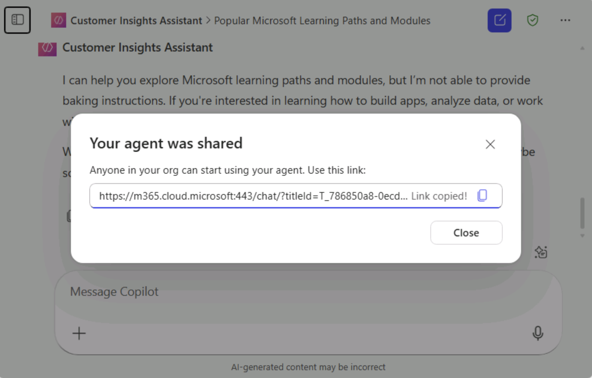

**  
**

# Inténtelo usted mismo: 

- Cree un agente llamado “Product Buddy” para obtener detalles de
  productos.

- Asigne la fuente de conocimiento a la biblioteca de documentos que
  creó en “Lab 0 - Preparing for lab execution”.

- Pruebe el agente realizando prompts relacionados con productos para
  validar su funcionamiento.

# Resumen

Al completar este laboratorio, adquirió experiencia práctica en el
diseño, la personalización y la implementación de Copilot agents que
proporcionan asistencia contextual alineada con el conocimiento y los
objetivos de la organización.
