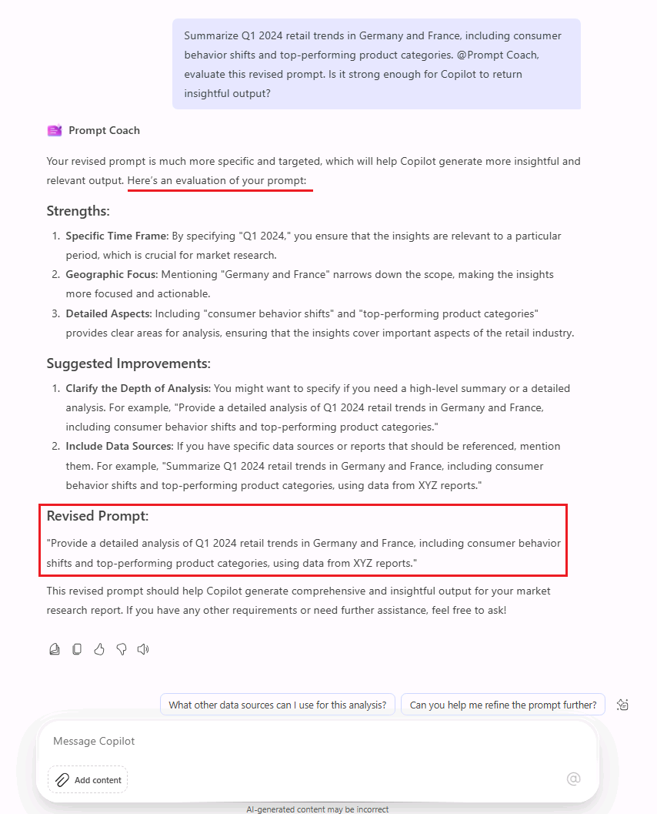

# Lab 03 - Enhance employee productivity with pre-built agents

**Objective**

You are a communications strategist working with Contoso Shoppee, a
global leader in consumer goods distribution. The company is preparing
an internal Innovation Readiness Workshop aimed at aligning teams on
digital transformation goals, improving productivity tools adoption, and
generating new ideas for customer engagement initiatives. You are asked
to showcase prebuilt agents in Microsoft 365 Copilot Chat (Prompt Coach,
Writing Coach, and Idea Coach) to the workshop participants to improve
productivity across writing, ideation, and prompt development tasks.

In this lab you will use Microsoft 365 Copilot Chat to:

- Craft and refine high-quality prompts using Prompt Coach

- Receive detailed writing feedback and enhancement tips from Writing
  Coach

- Generate and organize creative ideas with Idea Coach

- Improve prompt effectiveness for various business use cases

- Collaborate with Copilot Chat to produce polished drafts and
  structured content

## Exercise 1: Explore and Interact with Prebuilt Agents via Copilot Chat

In this exercise you will show how to access and interact with prebuilt
Copilot agents (Prompt Coach, Writing Coach, and Idea Coach) using
Microsoft 365 Copilot Chat, and understand their unique capabilities for
enhancing productivity.

1.  Open a Microsoft Edge browser and enter the following URL:
    +++[https://m365.cloud.microsoft+++](https://m365.cloud.microsoft+++/) to
    go to the **Microsoft 365 Copilot app** (formerly office) home page.

    > **Note**: You need to sign-in (if prompted) using
    the **Credentials** provided under the **Resources** tab on the right.

2.  **Copilot chat** page will open.

    

3.  If, for some reason, “**Something went wrong”** message appears,
    click **Try again** (twice) to open Copilot Chat.

    

    > **Note**: Copilot Chat user interface may appear different  when you are executing this lab (since Microsoft has rolled out
    new and updated features along with UI changes as part of Microsoft
    Build-2025 event).

4.  Click **Create Agent** in the navigation pane depending on the
    landing page in your case.

    

5.  Copilot Studio Agent Builder will open. Wait for some time for the
    pre-built agents list to load. Click **View all templates**.

    

    

6.  Scroll through the list to locate the declarative agents **(Prompt
    Coach and Writing Coach)** that you will use to improve Prompt
    Quality and Refine Writing.

7.  Select **Prompt Coach**

    

    > **Note**: You can use these declarative agents as templates and
    customize them suiting your needs.

8.  In this lab You will use the Prompt coach as-is without making any
    customizations. Click **Create** on the top right to create Prompt
    Coach agent.

    

    

    You now completed creating the **Prompt Coach**. Click **Go to
    agent** to open Prompt Coach agent.

    

    Next you will use the Prompt coach to improve your prompt quality.

## Exercise 2: Improve Prompt Quality with Prompt Coach in Copilot Chat

In this exercise you will generate a more targeted Copilot prompt for a
market research report.

1.  You will now enter a draft prompt:  
    +
    ++@Prompt Coach, review this prompt: “Give me insights on European
    retail industry.”+++

    

2.  You can ask Copilot: +++How can I make this prompt more specific and
    actionable?+++

    

3.  Copilot responds with the sample of how the prompt could be made
    more specific and actionable.

    

4.  If you ignore and try with another blunt prompt, Copilot will insist
    you to clarify with more details. Check the Copilot output with the
    following prompt and click **Submit**.

    +++I am trying to generate a more targeted Copilot prompt for a market
    research report.+++

    

5.  You will now use the suggestions to revise your prompt and ask

    @Prompt Coach, evaluate this revised prompt. Is it strong enough for
    Copilot to return insightful output?

    +++“Summarize Q1 2024 retail trends in Germany and France, including
    consumer behavior shifts and top-performing product categories.”
    @Prompt Coach, evaluate this revised prompt. Is it strong enough for
    Copilot to return insightful output?+++

    

6.  Copilot responds with the evaluation remarks and provides you with
    suggestions. The response might be little bit different from what
    you see in the following screenshots.

    

7.  Now try with the following prompt and click Submit.

    +++What other data sources can I use for this analysis?+++

    

8.  Copilot responds with details about the common data sources.

    

9.  You can try with the following prompt and click Submit.

    +++How can I access these reports?+++

    

10. Based on the evaluation remarks and data source suggestions,
    rephrase the prompt.

    Try with the following prompt and check the output:

    +++Provide a detailed analysis of Q1 2024 retail trends in Germany and
    France, including consumer behavior shifts and top-performing product
    categories, using data from German Retail Federation (HDE) and the
    French Federation of Retailers (FCD).+++

    

11. Check the Copilot generated response.

    Now try with the following prompt and check the output:

    +++Provide a detailed analysis of Q1 2024 retail trends in Germany and
    France, including consumer behavior shifts and top-performing product
    categories, using data
    from https://www.nielson.com+++

    

    

    You have now completed generating the report on market trends with 
    help from Prompt Coach by crafting and refining the prompts.

**Try yourself:**

**Exercise 2: Refine Writing using Writing Coach in Copilot Chat**

In this exercise, you will use Microsoft 365 Copilot Chat to:

- Create an agent using Wring Coach as a template.

- Refine tone, clarity, and impact of internal communication

- Rephrase key messages for specific audiences (e.g., executive
  leadership, frontline employees)

- Apply Writing Coach suggestions to make content more inspirational,
  professional, or concise

**Task 1: Create an agent using Writing coach as the template.**

**Task 2: Provide the agent with a sample sentence given below and ask
it to rephrase the tagline**

- Sample: “The new employee wellness program starts next week. It’s
  really cool and we hope everyone enjoys it.”

- Ask:  
  @Writing Coach, improve this message for tone, clarity, and executive
  audience.

- Then try:  
  @Writing Coach, rephrase this to be inspirational and concise.  
  @Writing Coach, explain how you improved the sentence.

**Task 3: Provide your own draft (email or LinkedIn post), and use the
agent to fine-tune the writeup.**

- Ask:

  @Writing Coach, how can I make this sound more confident and
  professional?

- Ask Writing Coach agent to turn your revised version into a formatted
  message (e.g., add header, summary, call to action).

## Conclusion

By completing this lab, you explored how prebuilt agents in Microsoft
365 Copilot Chat can significantly improve employee productivity and
communication outcomes. You practiced crafting stronger prompts,
refining messages for different audiences, and generating creative ideas
with structured guidance. These hands-on exercises highlight how
Copilot’s specialized agents can streamline everyday tasks, support
digital transformation goals, and empower teams to work more efficiently
and effectively.
