# 실습 03 - 사전 구축된 에이전트를 활용한 직원 생산성 향상하기

**목표**

소비재 유통 분야의 글로벌 리더인 Contoso Shoppee에서 근무하는
커뮤니케이션 전략가입니다. Contoso Shoppee는 디지털 혁신 목표 달성을
위한 팀 간 협력, 생산성 도구 도입률 향상, 고객 참여 이니셔티브를 위한
새로운 아이디어 도출을 목표로 사내 혁신 준비 워크숍을 준비하고 있습니다.
워크숍 참가자들에게 Microsoft 365 Copilot Chat(Prompt Coach, Writing
Coach, Idea Coach)에서 사전 구축된 에이전트를 소개하여 글쓰기, 아이디어
구상, 프롬프트 개발 작업 전반의 생산성을 향상시키도록 합니다.

이 실습에서는 Microsoft 365 Copilot Chat을 사용하여 다음을 수행합니다:

- Prompt Coach를 사용하여 고품질 프롬프트를 작성하고 개선하기

- Writing Coach로부터 상세한 글쓰기 피드백과 개선 팁을 받기

- Idea Coach를 사용하여 창의적인 아이디어를 구상하고 정리하기.

- 다양한 비즈니스 활용 사례에서 프롬프트의 효과를 개선하기

- Copilot Chat과 협업하여 다듬어진 초안과 체계적인 콘텐츠를 제작하기

**연습 1: Copilot Chat을 통해 미리 구축된 에이전트 살펴보기 및 상호
작용하기**

이 연습에서는 Microsoft 365 Copilot Chat을 사용하여 미리 구축된 Copilot
에이전트(Prompt Coach, Writing Coach, Idea Coach)에 액세스하고 상호
작용하는 방법을 알아보고, 생산성 향상을 위한 고유한 기능을 이해합니다.

1.  Microsoft Edge 브라우저를 열고 다음 URL을 입력하세요.
    +++[https://m365.cloud.microsoft+++](https://m365.cloud.microsoft+++/)
    **Microsoft 365 Copilot 앱**(이전 Office) 홈페이지로 이동합니다.

**참고**: 오른쪽 **Resources** 탭에 제공된 **자격 증명**을 사용하여
로그인해야 합니다(메시지가 표시되면).

2.  **Copilot chat** 페이지가 열립니다.

3.  어떤 이유로든 " **Something went wrong** " 메시지가 나타나면 " **Try
    again** "를 두 번 클릭하여 Copilot 채팅을 엽니다.

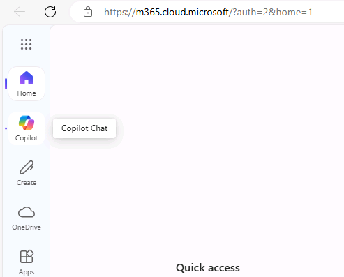

**참고**: 이 실습을 실행할 때 Copilot Chat 사용자 인터페이스가 다르게
나타날 수 있습니다(4단계 참조). Microsoft는 Microsoft Build-2025
이벤트의 일환으로 UI 변경과 함께 새 기능과 업데이트된 기능을 출시했기
때문입니다.

4.  사례의 랜딩 페이지에 따라 탐색 창에서 **Create Agent** 를
    클릭합니다.

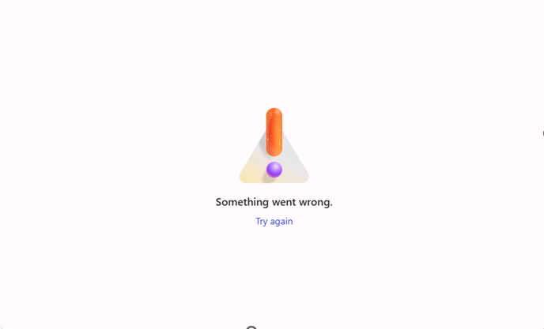

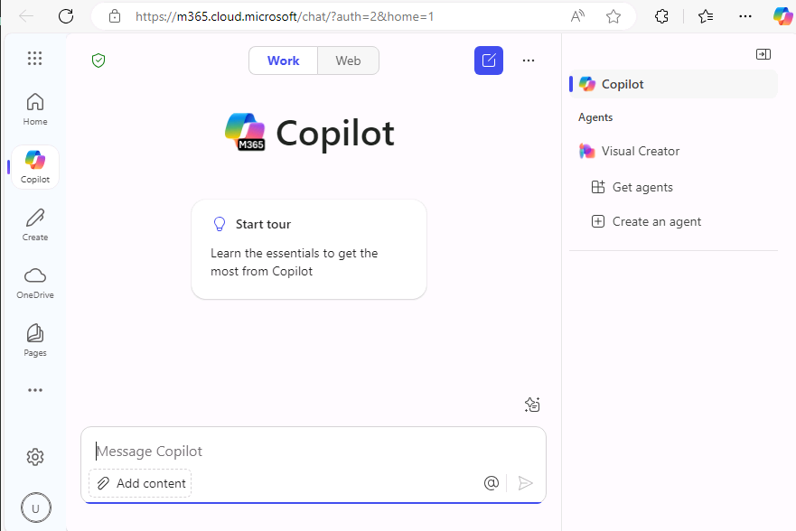

5.  Copilot Studio Agent Builder가 열립니다. 미리 작성된 에이전트 목록이
    로드될 때까지 잠시 기다리세요. **View all templates** 를 클릭합니다.

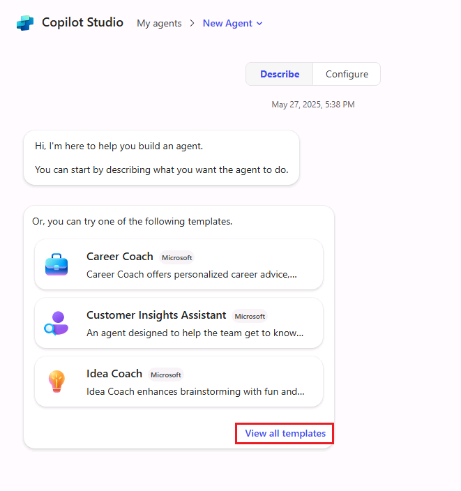

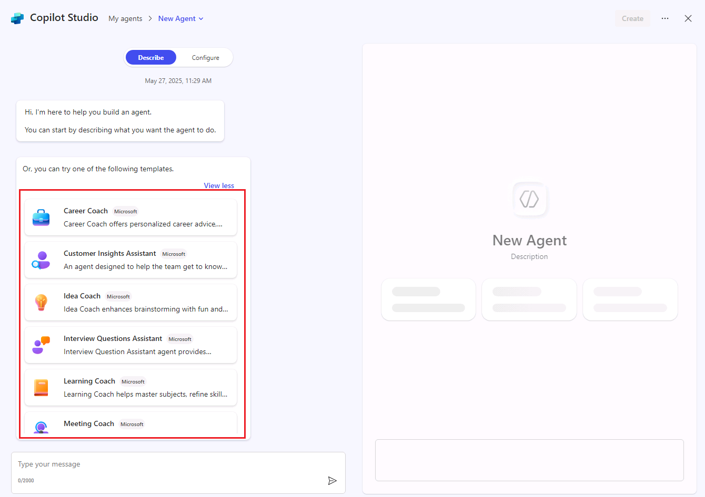

6.  목록을 스크롤하여 프롬프트 품질을 개선하고 글쓰기를 다듬는 데 사용할
    선언적 에이전트(프롬프트 코치 및 글쓰기 코치)를 찾습니다.

7.  Prompt Coach를 선택합니다.

**참고**: 이러한 선언적 에이전트를 템플릿으로 사용하여 필요에 맞게
사용자 지정할 수 있습니다.

8.  이 실습에서는 프롬프트 코치를 사용자 지정하지 않고 그대로
    사용합니다. 오른쪽 상단의 **Create**를 클릭하여 프롬프트 코치
    에이전트를 만듭니다.

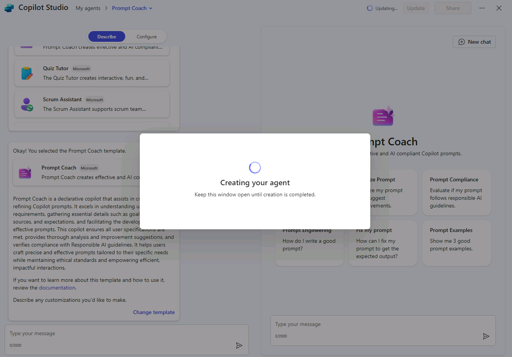

이제 **Prompt Coach**생성이 완료되었습니다. **Go to agent** 을 클릭하여
프롬프트 코치 에이전트를 엽니다.

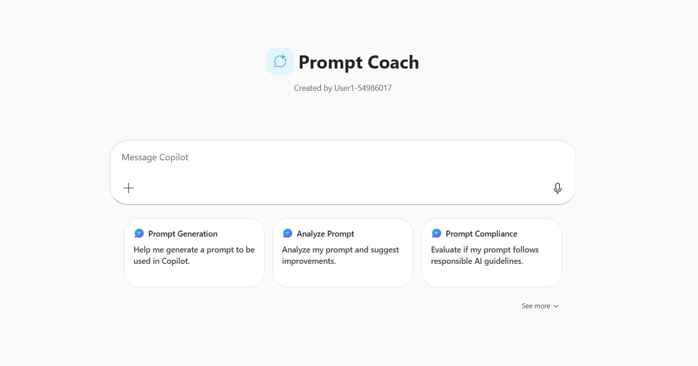

다음으로 프롬프트 코치를 사용하여 프롬프트 품질을 향상시켜 보겠습니다.

**연습 2: Copilot Chat에서 프롬프트 코치를 사용하여 프롬프트 품질
향상하기**

이 연습에서는 시장 조사 보고서를 위한 더욱 구체적인 Copilot 프롬프트를
생성합니다.

1.  이제 프롬프트 초안을 입력합니다:  
    ++@Prompt Coach, review this prompt: “Give me insights on European
    retail industry.”++

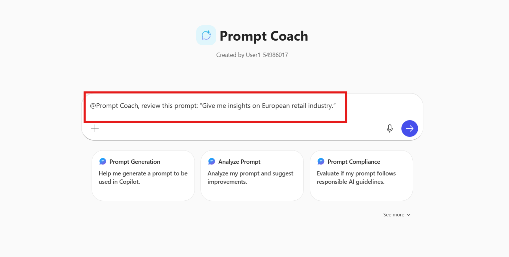

2.  시작하려면 Copilot에서 다음 세부 정보를 제공해야 합니다.:

- **목표:** Copilot을 통해 달성하고자 하는 바람직한 결과는 무엇입니까?

- **맥락:** 프롬프트와 관련된 배경 정보나 구체적인 세부 정보가
  무엇입니까?

- **출처:** 포함하고 싶은 구체적인 출처나 예시가 있습니까?

- **기대 사항:** 프롬프트의 형식이나 구조에 대한 선호 사항이 있습니까?

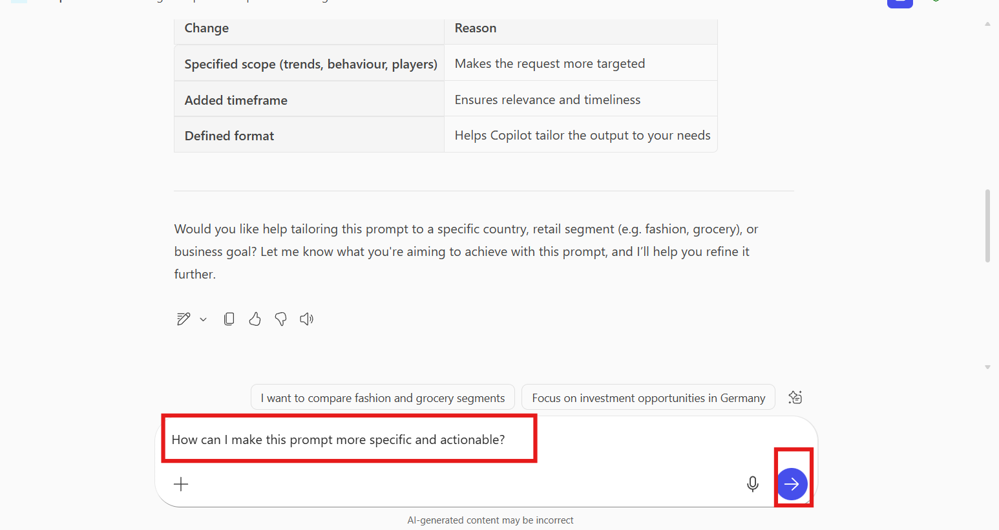

3.  Copilot에게 이렇게 질문해 보세요: How can I make this prompt more
    specific and actionable?

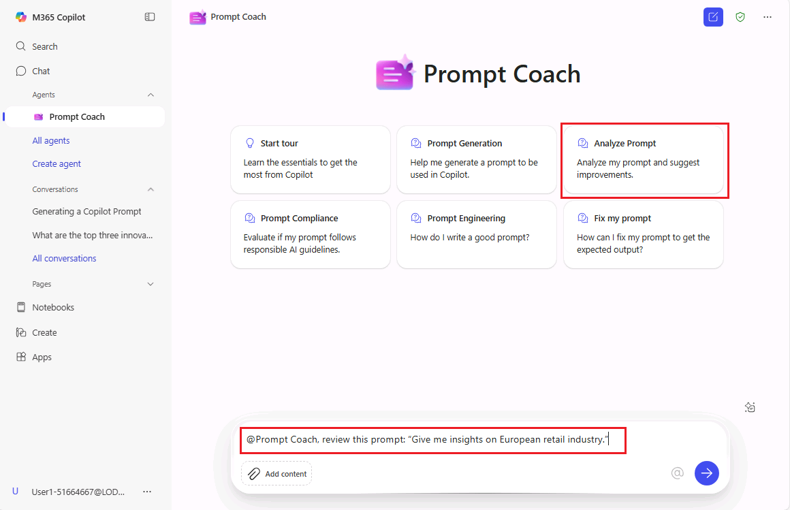

4.  Copilot는 프롬프트를 더 구체적이고 실행 가능하게 만드는 방법에 대한
    샘플을 제공합니다.

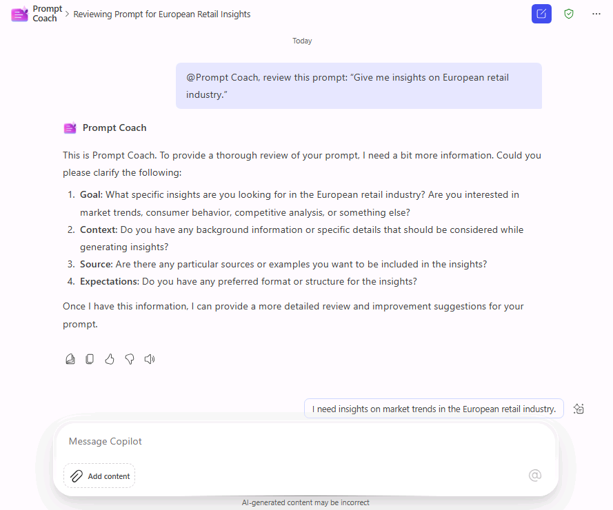

5.  무시하고 다른 명확한 프롬프트로 시도하면 Copilot에서 더 자세한
    내용을 요구합니다. 다음 프롬프트로 Copilot 출력을 확인하고
    **Submit**을 클릭합니다.

++I am trying to generate a more targeted Copilot prompt for a market
research report.++

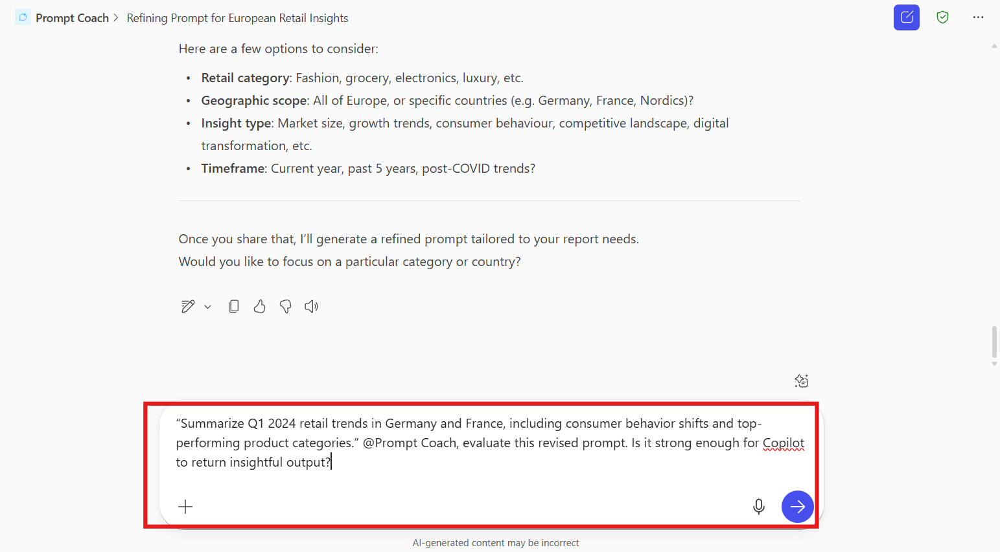

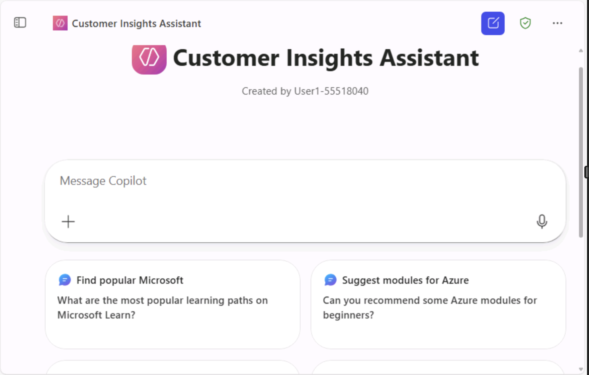

6.  6\. 이제 제안을 사용하여 프롬프트를 수정하고 질문합니다.

@Prompt Coach님, 수정된 프롬프트를 평가해 주세요. Copilot이 통찰력 있는
결과를 낼 수 있을 만큼 충분히 강력한가요?

++“Summarize Q1 2024 retail trends in Germany and France, including
consumer behavior shifts and top-performing product categories.” @Prompt
Coach, evaluate this revised prompt. Is it strong enough for Copilot to
return insightful output?++

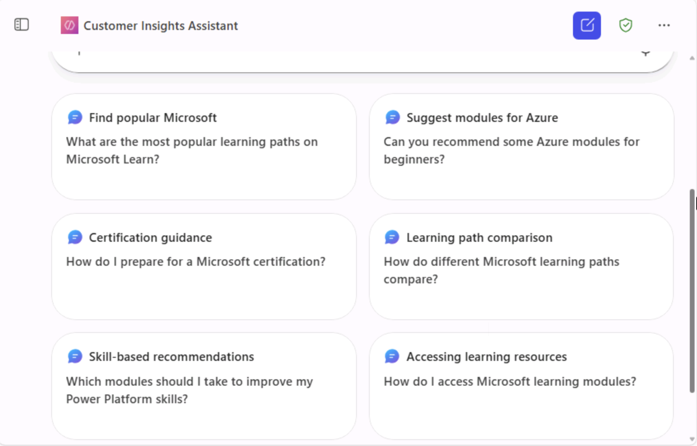

7.  Copilot이 평가 내용과 함께 제안을 제공합니다. 이 답변은 다음
    스크린샷에 보이는 내용과 약간 다를 수 있습니다.

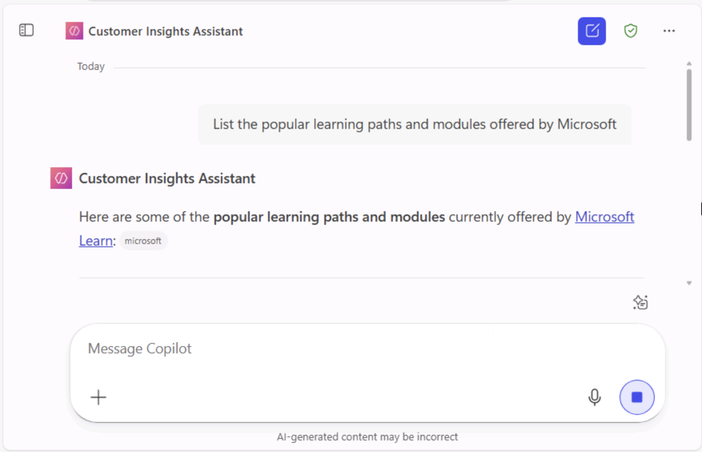

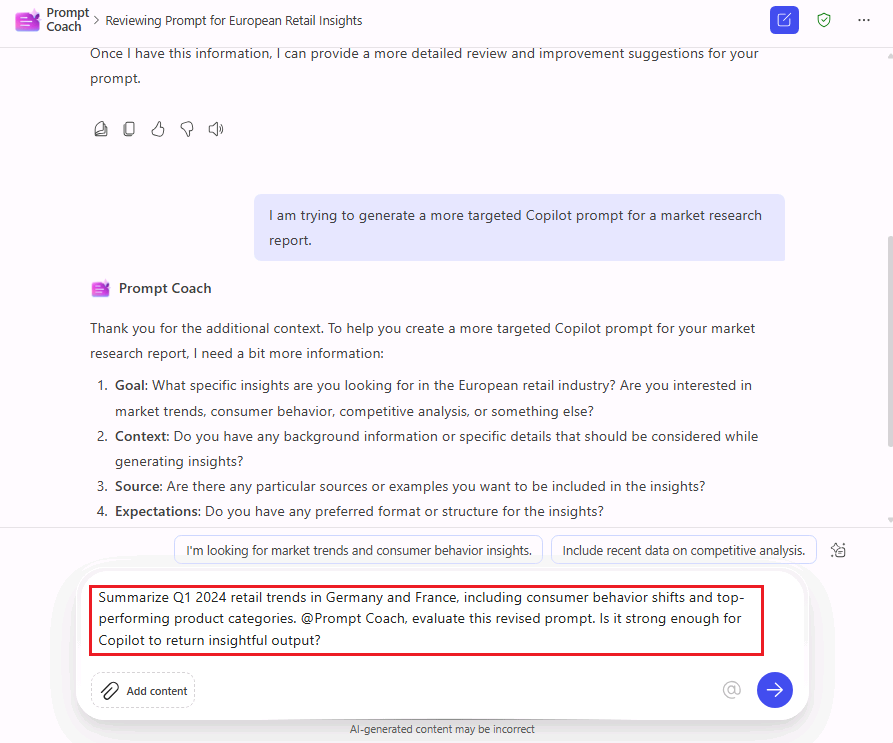

8.  이제 다음 프롬프트를 시도하고 submit을 클릭합니다.

++What other data sources can I use for this analysis?++

9.  Copilot responds with details about the common data sources.

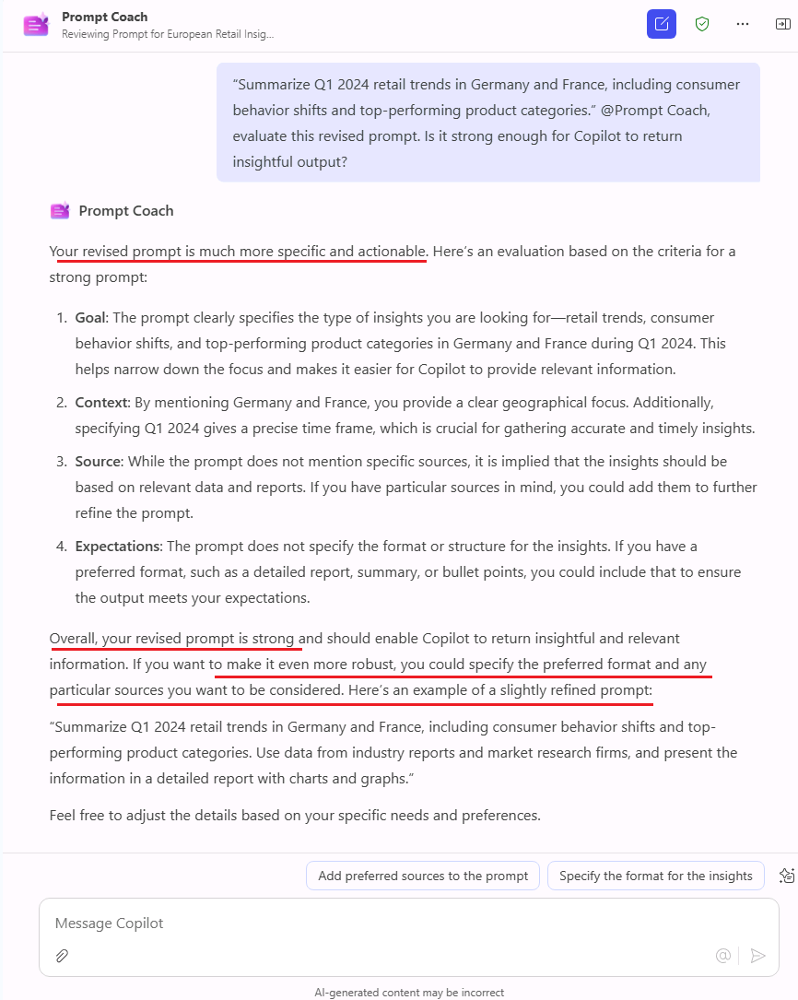

10. 다음 프롬프트를 시도하고 submit을 클릭합니다.

++How can I access these reports?++

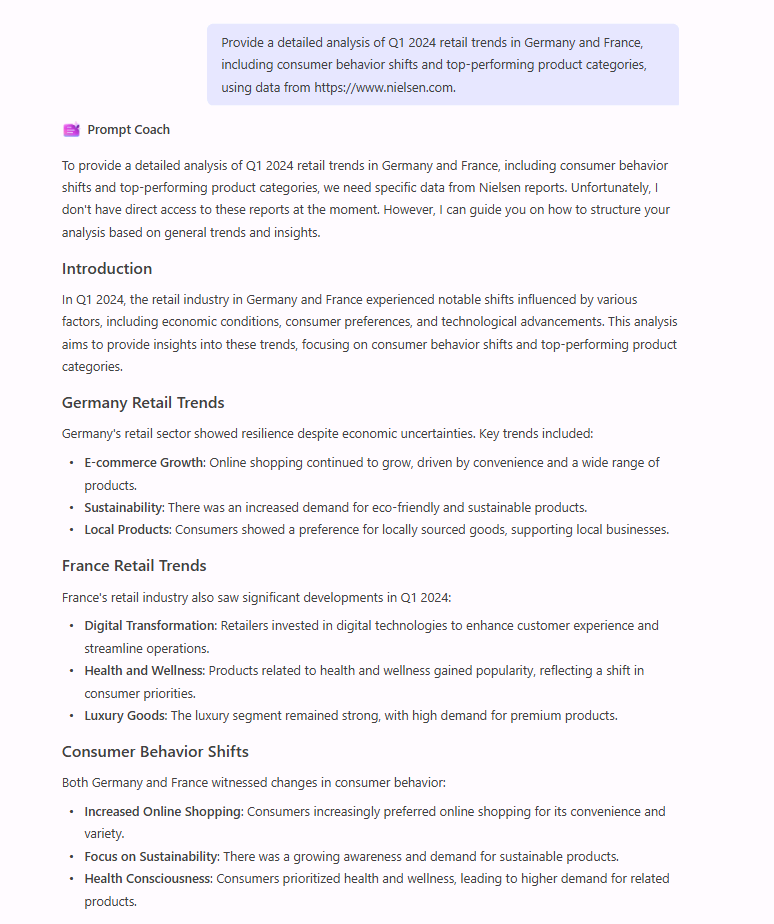

11. 평가 설명과 데이터 소스 제안을 바탕으로 프롬프트를 다시 작성해
    봅니다.

다음 프롬프트로 시도해 보고 출력을 확인해 보세요:

++Provide a detailed analysis of Q1 2024 retail trends in Germany and
France, including consumer behavior shifts and top-performing product
categories, using data from German Retail Federation (HDE) and the
French Federation of Retailers (FCD).++

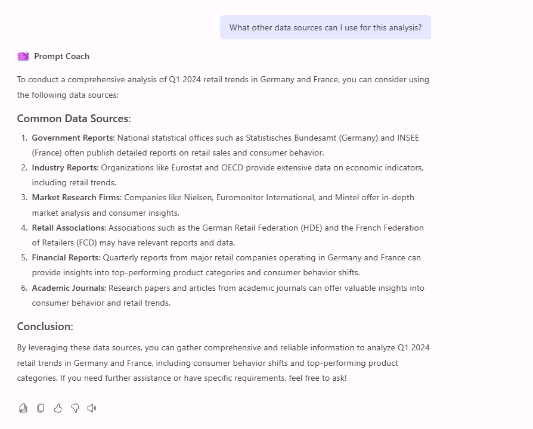

12. Copilot에서 생성된 응답을 확인합니다.

다음 프롬프트로 시도해 보고 출력을 확인해 보세요.:

++Provide a detailed analysis of Q1 2024 retail trends in Germany and
France, including consumer behavior shifts and top-performing product
categories, using data
from [https://www.nielson.com++](https://www.nielson.com++/)

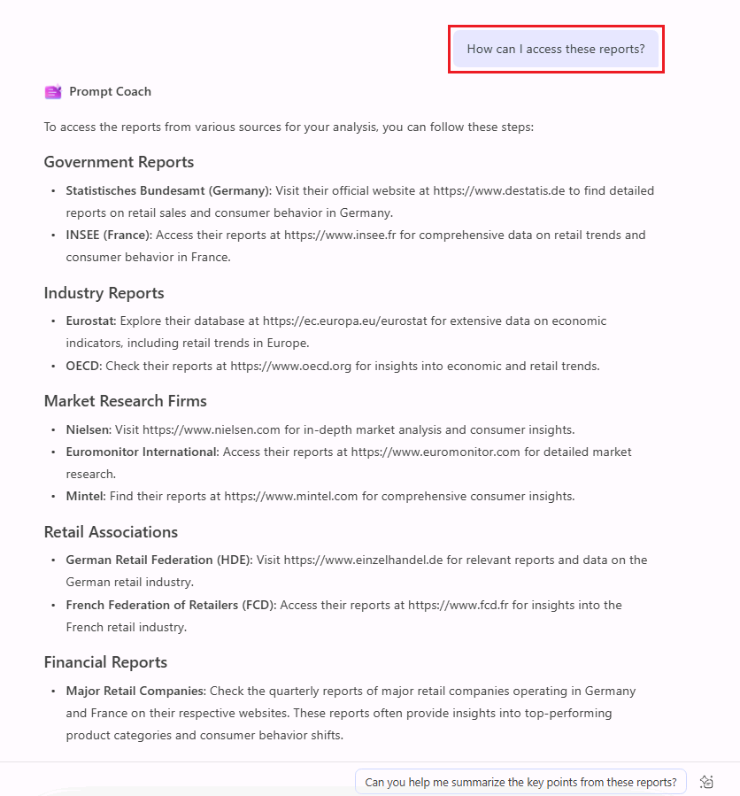

이제 Prompt Coach의 도움을 받아 프롬프트를 작성하고 개선하여 시장 동향
보고서 작성을 완료했습니다.

직접 해 보세요:

**연습 2: Copilot Chat의 Writing Coach를 사용하여 글쓰기 개선하기**

이 연습에서는 Microsoft 365 Copilot Chat을 사용하여 다음을 수행합니다.:

- Writing Coach를 템플릿으로 사용하여 에이전트를 만듭니다.

- 내부 커뮤니케이션의 어조, 명확성 및 효과를 개선합니다.

- 특정 대상(예: 경영진, 현장 직원)에 맞춰 핵심 메시지를 재구성합니다.

- Writing Coach의 제안을 적용하여 콘텐츠를 더욱 영감을 주고, 전문적이며,
  간결하게 만듭니다.

**과제 \#1: Writing coach를 템플릿으로 사용하여 에이전트를 만들기**

**과제 \#2: 에이전트에게 아래 예시 문장을 제공하고 태그라인을 다시
표현하도록 요청하기**

- 예시: "신입 사원 웰니스 프로그램이 다음 주에 시작됩니다. 정말 멋지고
  모두가 즐기셨으면 좋겠습니다."

- 질문:

> @Writing Coach, 이 메시지의 어조, 명확성, 그리고 경영진의 독자층을
> 고려하여 개선해 주세요.

- 다음으로 다음을 시도해 보세요.

> @Writing Coach, 이 메시지를 영감을 주고 간결하게 다시 표현해 주세요.
>
> @Writing Coach, 문장을 어떻게 개선했는지 설명해 주세요.

**과제 \#3: 직접 초안(이메일 또는 LinkedIn 게시물)을 작성하고,
담당자에게 문의하여 수정하기**

- 질문:

> @Writing Coach님, 어떻게 하면 더 자신감 있고 전문적으로 들리게 할 수
> 있을까요?

- Writing Coach 담당자에게 수정된 버전을 정형화된 메시지로 만들어 달라고
  요청하세요(예: 머리글, 요약, 행동 유도 추가)
