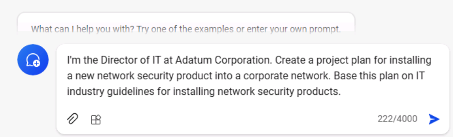
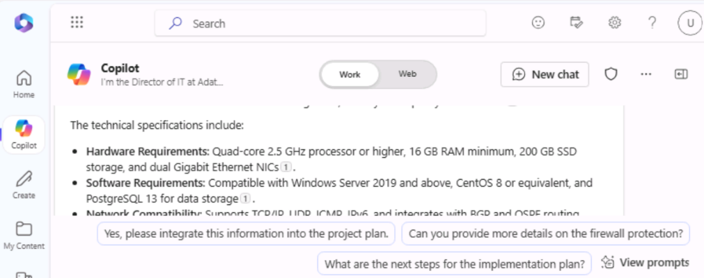

**ラボ 03: 従業員のエンパワーメント – Copilot-IT**

**目的:**

Copilot for Microsoft 365 は、AI
を活用したライティングアシスタントとして機能します。文脈を理解し、適切なフレーズを提案し、コンテンツの作成を支援します。これらはすべて、あなたの作品の質を高めるのに役立ちます。このラボでは、以下のツールを使用します。

- Microsoft Copilot
  を使用して、製品仕様書の情報を要約し、製品実装のためのプロジェクト計画を作成します。

- Copilot in PowerPoint
  を使用して、作成したプロジェクト計画に基づいてプレゼンテーションを作成します。

- Copilot in Word を使用して、技術仕様書レポートを編集します。

**エクササイズ \#1: Microsoft Copilot
を使用してプロジェクト計画を作成する**

Microsoft Copilot は Microsoft 365 とシームレスに統合され、IT
プロフェッショナルがチームワークを強化し、洞察を共有し、IT
エコシステム内で問題解決を加速するための堅牢なプラットフォームを提供します。これにより、IT
プロフェッショナルは瞬時に連携し、情報を共有し、効率的に連携することができます。

Adatum Corporation の IT ディレクターとして、あなたは Contoso
CipherGuard Sentinel X7 ネットワーク
セキュリティ製品の製品仕様レポートを確認しています。Adatum
が現在提供しているセキュリティ保護をはるかに超える高度なセキュリティ保護を提供するこの製品を導入する予定です。

この演習では、Bing で Microsoft Copilot を使用します。

- 導入予定の新しいネットワークセキュリティ製品の製品仕様レポートを分析します。

- 製品仕様レポートの情報を使用してプロジェクト計画を更新します。

注: この演習の最後に、プロジェクト計画を OneDrive
アカウントに保存する必要があります。次の演習ではこのファイルを使用します。

1.  Microsoft Edge ブラウザーで Microsoft 365
    タブを開いている場合は、それを選択します。開いていない場合は、新しいタブを開き、次の
    URL を入力します: +++https://www.office.com+++ して、Microsoft 365
    ホームページに移動します。

注: 右側の \[Resources\] タブに表示される Microsoft 365
資格情報を使用してサインインする必要があります (要求された場合)。

2.  OneDriveを開きます。C:\Lab Files フォルダーを参照し、「Contoso
    CipherGuard Product Specific report.docx」のコピーを選択して
    OneDrive にアップロードします。

注: すべてのドキュメントのコピー (ラボ 0 の指示に従って C:\Lab Files
からこのハンズオン ラボ セッションで使用するもの)
をすでにアップロードしている場合は、この手順をスキップできます。

3.  OneDriveにアップロードしたContoso
    CipherGuard製品仕様レポート.docxファイルを開いて閉じ、最近使用したファイル（MRU）リストに追加します。

4.  Microsoft Edge で、次の URL を入力して Microsoft Bing に移動します:
    +++https://bing.com+++。

5.  Microsoft
    Bingのホームページで、ページ上部に表示されるタブの一覧から「Copilot」を選択します。Microsoft
    Copilotが開きます。

注:
ページ上部にタブのリストが表示されない場合は、以下の手順に従ってタブのリストを表示してください。

- Microsoft 365 資格情報 (\[Resources\] タブで利用可能)
  を使用してサインインしていることを確認します。

- Show menu barオプションを有効にする（赤でハイライト表示）

6.  次に「Copilot」を選択します。Microsoft Copilot が開きます。

7.  「Copilot」ページで、ページ上部の「Work/Web」トグルスイッチから「Work」を選択します。

8.  デフォルトでは、「Work」オプションを選択すると、Copilot
    のアクセス範囲は Microsoft 365
    組織データに制限されます。ただし、企業ネットワークセキュリティ製品のインストールに関する公開
    Web ガイドラインにも Copilot がアクセスできるようにしたいため、Web
    コンテンツ プラグインを有効にする必要があります。Web コンテンツ
    プラグインを有効にするには、ページ下部のプロンプト フィールドに 2
    つのアイコンが表示されます。1 つはファイルを添付するためのクリップ
    アイコン、もう 1
    つはブロックが積み重なったアイコンです。後者のアイコンはプラグイン
    アイコンです。

9.  このプラグイン アイコンを選択し、Web Content
    プラグインを有効にします。

10. これでCopilotを使用する準備が整いました。以下のプロンプトを入力し、Microsoft
    CopilotのWebコンテンツプラグインを介して公開WebデータにアクセスするようCopilotに指示します。プロンプトフィールドの下部にある「送信」矢印を選択します。

++私はAdatum社のITディレクターです。企業ネットワークに新しいネットワークセキュリティ製品を導入するためのプロジェクト計画を作成してください。この計画は、ネットワークセキュリティ製品のインストールに関するIT業界のガイドラインに基づいて作成してください。++

11. Copilot が作成したプロジェクト計画を確認します。

12. 必要な領域がすべて網羅されているという満足感が得られていません。次のプロンプトを入力すると、特に関心のある領域を追加して計画を修正できます。このプロンプトに含まれる領域が、Copilot
    の以前の回答に既に含まれていた場合は、重複しないようにこのプロンプトから削除してください。

++良いスタートではありますが、重要な部分が欠けているように感じます。既存のリストに、テストとQA、トレーニング、コミュニケーション、ドキュメントとレポート、ステークホルダー分析、プロジェクトタイムライン、リスク評価と軽減という項目を追加してください。++

13. 修正されたプロジェクト計画を確認します。カバーされているトピックの幅広さに満足しているので、Contoso
    CipherGuard Sentinel X7
    セキュリティ製品の製品仕様の情報を使用して、Copilot
    で計画を更新します。次のプロンプトを入力しますが、次のステップでファイルをプロンプトにリンクする必要があるため、まだ送信しないでください。

++こちらのバージョンの方が良さそうです。添付ファイル（Contoso
CipherGuard Sentinel
X7セキュリティ製品の製品仕様）をご確認いただき、この製品仕様の情報に基づいてプロジェクト計画を更新してください。++

14. プロンプトフィールドで、プロンプトの後にスペースを入れ、スラッシュ
    (/) を入力します。スラッシュの前にスペースを入れることで、Copilot
    はこれをプロンプトに何かを添付する要求として認識します。次の手順は、Copilot
    がファイルを選択するためのウィンドウを開くかどうかによって異なります。

    - スラッシュ (/) を入力した後に Copilot
      がウィンドウを開いた場合は、「File」タブを選択してください。MRU
      ファイルの一覧が表示されます。Contoso CipherGuard
      製品仕様ファイルを選択し、「Submit」アイコンを選択してください。

- スラッシュ (/) を入力しても Copilot が何もしない場合は、Contoso
  CipherGuard
  製品仕様ファイルへのリンクをコピーして貼り付ける必要があります。これを行うには、OneDrive
  アカウントでファイルを見つけ、Word で開き、Word リボンの上に表示される
  \[共有\] ボタンを選択します。表示されるドロップダウン メニューで
  \[Copy link\] を選択します。その後、このプロンプト
  フィールドに戻り、スラッシュの後のリンクを貼り付けて \[Submit\]
  アイコンを選択します。

注意: Copilot
がドキュメントに直接アクセスしたりレビューしたりできない場合は、ログインしているユーザーからサインアウトし、もう一度サインインして、手順
9 からもう一度続行してください。

注: Contoso CipherGuard
製品仕様書を表示・参照できない場合は、次の演習に進んでください。プロジェクト計画書は、ラボの残りのアクティビティを進めるために用意されています。

15. Copilot
    が製品仕様の機能をプロジェクト計画にどのように挿入したかを確認します。

16. 一見良さそうですが、プロジェクト計画には具体的な詳細が欠けていると感じます。この問題を解決するには、次のプロンプトを入力してください。

++もうすぐ終わりです。レポートの各項目を複数の詳細なステップに分解してください。++

17. 結果を確認します。

18. プロジェクト計画書が完成したら、Word文書に保存してください。このプロジェクト計画書は次の演習で使用します。Copilotの最終回答の下部にある「Copy」ボタンを選択して、内容をコピーしてください。

注: より多くの機能を提供し、チームのコラボレーションを促進する \[Edit in
Pages\] ボタンが表示されます。この演習では、「Edit in
Pages」は使用しません。別のラボ演習がラボに含まれています
\#06. 

ブラウザで空白の Word 文書を開き、応答を貼り付けます。

コピーしたコンテンツを貼り付けると、貼り付けオプションのコンテキストメニューが表示されます。「Keep
Source
formatting」を選択できます。

19. 左上のファイル名フィールド（スクリーンショット参照）をクリックし、OneDriveでファイル名を「+++Contoso
    CipherGuard project
    plan.docx+++」に変更します。このファイルは次の演習で使用します。

**エクササイズ \#2: PowerPoint で Copilot
を使用してプロジェクト計画プレゼンテーションを作成する**

Copilot in PowerPoint はインテリジェントな共同作業者として機能し、IT
プロフェッショナルがプレゼンテーションを作成する際に、次のようなリアルタイムの提案や機能強化を提供します。

- チームや経営陣にアイデアや提案を提示する。

- 新入社員の研修や、顧客への新しいソフトウェアやハードウェアのデモンストレーションを行う。

- ステークホルダーや投資家など、技術者以外の対象者に複雑な技術的概念を説明する。

- 潜在顧客に自分の仕事内容を紹介したり、サービスを宣伝したりする。

PowerPoint の Copilot を使用すると、既存の Word
文書からプレゼンテーションを作成できます。PowerPoint の Copilot に Word
文書へのリンクを提供すると、スライドの生成、レイアウトの適用、テーマの選択が自動的に行われます。

この演習では、PowerPoint の Copilot
を使用して、前の演習で作成したプロジェクト計画に基づいたスライド
プレゼンテーションを作成します。このプレゼンテーションを使用して、IT
スタッフ、そして最終的には経営陣にプロジェクト計画を説明します。

注: 前の演習を完了し、Contoso CipherGuard project plan.docx
ファイルを作成した場合は、そのファイルを OneDrive
アカウントに保存してから次の手順に進みます。ただし、前の演習でこのプロジェクト計画を作成できなかった場合は、C:\Lab
Files にある Contoso CipherGuard project plan.docx
ドキュメントのコピーをアップロードしてください。

1.  Edge ブラウザーで Microsoft 365
    タブを開いている場合は、今すぐ選択します。そうでない場合は、新しいタブを開き、次の
    URL を入力します: +++https://www.office.com+++ で Microsoft 365
    ホームページに移動します。

2.  OneDrive に保存したファイル Contoso CipherGuard project plan.docx
    を開いて閉じ、最近使用したファイル (MRU) リストに追加します。

3.  Microsoft 365 ナビゲーション ウィンドウで、PowerPoint
    を選択します。PowerPoint
    で、新しい空白のプレゼンテーションを開きます。

4.  Copilot アイコン
    (スクリーンショットに示すように、赤くハイライト表示されています)
    を選択します。表示される Copilot
    ウィンドウで、いくつかの定義済みプロンプトから選択できます。

5.  Create presentation from file作成するプロンプトを選択します。

6.  Copilot パネルの下部にあるプロンプトフィールドに、Copilot
    は自動的に「Create presentation from file
    /」というテキストを入力します。スラッシュは、Copilot
    でファイルへのリンクを入力する際に​​よく使われる一般的なインジケーターです。この例では、スラッシュを入力すると、最近使用したファイルのうち
    3 つが表示される「Suggestions」ウィンドウが開きます。

    - ここにファイルが表示されている場合は、今すぐ選択して次の手順に進みます。

    - 表示されている3つのファイルのいずれにもファイルが表示されない場合は、「Suggestions」ウィンドウの右上隅にある右矢印
      (\>)
      を選択して、展開されたMRUファイルリストを表示します。ここにファイルが表示されている場合は、今すぐ選択して次の手順に進みます。

    - 展開されたMRUリストにファイルが表示されない場合は、レポートへのリンクをコピーしてプロンプトフィールドに貼り付ける必要があります。手順は次のとおりです。

a\. Microsoft 365
ブラウザータブを選択し、ナビゲーションウィンドウで「Word」を選択します。

b\. Word
のホームページの最近使用したファイルの一覧で、レポートを選択して Word
で開きます。

c\. Word
のレポートで、リボンの右上にある「Share」ボタンを選択します。表示されるドロップダウンメニューで「Copy
Link」を選択します。「Link
copied」ウィンドウが表示されるまで待ちます。これで、ファイルへのリンクがクリップボードにコピーされたことが確認できます。

d\. PowerPoint タブに切り替えると、Copilot
ウィンドウの下部にあるプロンプトフィールドに「Create presentation from
file /」と表示されたままになります。スラッシュ (/)
の後にカーソルを置き、レポートへのリンクを貼り付けます (Ctrl+V)。

7.  プロンプトフィールドにファイルがどのように表示されるかを確認してください。プロンプトフィールドの送信アイコンを選択してください。このプロンプトにより、Copilot
    はドキュメントに基づいてスライドプレゼンテーションを作成します。その際、まずプレゼンテーションのアウトラインが表示され、次に別のウィンドウに、ドキュメントに基づいてプレゼンテーションに加えられた変更の一部が箇条書きで表示されます。

8.  これでスライドを確認し、必要な更新を行うことができます。Copilotがドキュメントに基づいて行った変更に特に注意してください。Designerツールを使用してレイアウトを調整できます。

9.  最後に質疑応答（Q&A）用のスライドがないことに気が付きました。この見落としを修正するには、次のプロンプトを入力してください。

+++プレゼンテーションの最後に適切な画像を含む Q&A
スライドを追加します。+++

10. 作成された新しいスライドを確認します。このスライドにCopilotが使用した画像が気に入らないので、次のプロンプトを入力して、画像を変更するように指示します。

+++Q&Aスライドで使用された画像が気に入りません。別の画像に差し替えてください。+++

11. どのような応答がありましたか? Copilot
    が画像を置き換えず、次のメッセージを返すことがありました。

注意: Copilot では、上記のような例外が表示される場合があります (Copilot
はまだ開発中であることに注意してください)。

12. プロンプトを言い換えるか、以下のような提案されたプロンプトを使用してください。

13. 「Add a slide」コマンドを選択し、次の +++Q&A
    をプレゼンテーションの最後に追加します+++（スクリーンショットを参照）

14. 「Send」をクリックして、何が起こるか確認します。Copilot が指示通りに
    Q&A スライドを追加しました。

15. 別のプロンプトを試してみましょう。

プレゼンテーションに関して聴衆が質問する可能性のある内容についてのスライドを追加します。

16. 最終プレゼンテーションが完成したら、今後の参考のために保存するか、破棄するかを選択できます。

17. Q&Aスライドの最後の数ステップがどうだったかはさておき、先に進み、最後にもう1つ試してみることにしました。プレゼンテーションをレビューしたところ、トピックの技術的な性質上、プレゼンテーションのテーマをより適切なものに変更したいと考えました。次のプロンプトを入力します。

+++このプレゼンテーションのテーマをより技術的なものに変更します+++ 

18. Copilotの応答に注意してください。

このシナリオは、プロンプトのベストプラクティスを思い出すべき状況の一つです。「Understand
Copilot's
limitations」ということです。この場合、制限事項を理解するというよりも、Copilot
の仕組みを理解することが重要です。この場合、Copilot は既存の PowerPoint
機能と同じ機能を実行するのではなく、その機能の使用方法をユーザーに示します。

19. このモジュールの残りのトレーニング演習ではこのプレゼンテーションは使用されませんが、後で参照する必要がある場合は破棄するか保存しておくことができます。

**エクササイズ \#3:Copilot in Word を使用して技術レポートを更新する**

Copilot in Word は、IT
プロフェッショナルがドキュメント作成にかかる時間と労力を削減するのに役立ちます。コンテンツの作成、テキストの書き換え、役立つ提案などを支援します。AI
を活用したライティング支援機能により、Copilot
はドキュメントをより効率的かつ効果的に作成できます。

新しいドキュメントを作成するときも、既存のドキュメントを編集するときも、Copilot
はさまざまな方法でサポートします。

- 新しい空白のドキュメントを作成する場合、または既存のドキュメントにコンテンツを追加する場合、Copilot
  に書きたい内容を伝えると、それに応じたコンテンツが生成されます。

- 既存のコンテンツがあるドキュメントでは、Copilot
  がコンテンツの変換をサポートします。選択したコンテンツを書き換えたり、選択したコンテンツを表に変換したりすることも可能です。

この演習では、Copilot in
Wordを使用して既存の文書を更新します。Copilotに新しいテキストの追加、既存のテキストの書き換え、テキストを表に変換するよう指示します。

1.  Microsoft Edge ブラウザーで Microsoft 365
    タブを開いている場合は、それを選択します。開いていない場合は、新しいタブを開き、次の
    URL を入力します: +++https://www.office.com/+++ して、Microsoft 365
    ホームページに移動します。

注: 右側の \[Resources\] タブに表示される Microsoft 365
資格情報を使用してサインインする必要があります (要求された場合)。

2.  C:\Lab Files フォルダーを参照して、Trey Research - VPN Technical
    Overview.docx のコピーを選択し、OneDrive にアップロードします。

注: すべてのドキュメントのコピー (ラボ 0 の指示に従って C:\Lab Files
からこのハンズオン ラボ セッションで使用するもの)
をすでにアップロードしている場合は、この手順をスキップできます。

3.  OneDrive にアップロードしたファイル「Trey Research - VPN Technical
    Overview.docx」を開いて閉じ、最近使用したファイル (MRU)
    リストに追加します。

4.  Microsoft 365 で Microsoft Word を開きます。

5.  「Trey Research - VPN Technical Overview.docx」ファイルを開きます。

6.  Word リボンで \[Copilot\] ボタンを選択して \[Copilot\]
    ウィンドウを開きます。

7.  Copilot ペインで次のプロンプトを入力し、矢印 (送信)
    アイコンを選択します。

+++このドキュメントにVPNの種類に関する新しいセクションを追加し、それぞれの種類の長所と短所を説明してください。このコンテンツは技術者向けですので、具体的な詳細を記載してください。+++

8.  Copilot
    は、新しいコンテンツをドキュメントに直接追加しません。コンテンツは
    Copilot
    パネルの回答ウィンドウに表示されます。ただし、各回答ウィンドウの下部にはコピーボタンが用意されているので、コピーボタンを選択すると、そのコンテンツがクリップボードにコピーされます。ドキュメントを確認しながら、最初の段落の下にコンテンツを貼り付けることにしました。それでは、コンテンツを貼り付けましょう。

ヒント：回答ウィンドウで「コピー」ボタンを選択すると、Copilot
があなた宛てに作成したコメントを含むすべてのコンテンツがコピーされます。これらのコメントは通常、回答の冒頭と末尾に表示されます。回答をドキュメントに貼り付けたら、これらのコメントを必ず削除してください。新しいコンテンツのフォントとフォントサイズは、ドキュメント全体で使用されている既存のフォントとサイズと一致しない可能性があります。そのため、一致するように変更する必要があります。

9.  さらに確認してみると、VPNの使用に関するセキュリティポリシーについて言及されていないことに気づきました。このトピックは必ず含めたい重要な領域なので、次のプロンプトを入力してください。

+++このドキュメントに、VPNの使用に関するセキュリティポリシーに関する新しいセクションを追加してください。このコンテンツは技術者向けですので、具体的な詳細を記載してください。+++

10. この回答の内容をコピーして文書に貼り付けます。「Risks and
    mitigations」セクションの直前に配置し、必要に応じて内容を編集します。必要に応じて、このセクションに「Security
    policies related to VPN usage」という見出しを追加します。

11. レポートをレビューした際に、書き直しが必要だと感じる箇所が1つありました。「Risks
    and
    mitigations」のセクションの最初の箇条書きは、家庭用VPNと企業用VPNの両方を対象としています。あなたはこれを企業用VPNのみに絞りたいと考えています。しかし、レポートの内容から判断すると、簡単には修正できないようです。そこで、Copilotを使って書き直しを依頼することにしました。

ヒント: Copilot でコンテンツを書き換えるには、まず Copilot
で書き換えるコンテンツをハイライト表示する必要があります。

12. 「Risks and
    mitigation」セクションの最初の箇条書きの内容を強調表示し、次のプロンプトを入力します。

+++ハイライト表示されているコンテンツでは、家庭ネットワークと企業ネットワークの両方でVPNを使用するリスクについて説明しています。家庭ネットワークに関するコンテンツを削除し、企業ネットワークにおけるVPNのリスクのみに焦点を当ててください。+++

13. Copilot
    のレスポンスを確認します。この書き換え機能が動作しない場合があります。動作しない場合は、Copilot
    から以下のレスポンスが返されます。このような状況が発生した場合は、プロンプトにコピー＆ペーストしてもう一度試してみてください（繰り返し、繰り返し、繰り返し）。

14. 文書を最終確認した後、VPN導入のメリットとデメリットに関するセクションは、箇条書きではなく表にした方が見やすいと判断しました。書き直しが必要なセクションを強調表示したので、この2つのセクションを強調表示することにしました。両方のセクションを強調表示し、次のプロンプトを入力します。

+++Please rewrite the highlighted content by placing it in a table.+++

15. Copilotの応答に注意してください。

16. .
    コンテンツを表形式に再フォーマットすることは、コンテンツの書き換えとは異なります。表に配置したいコンテンツを強調表示するのではなく、プロンプトで表に含めるコンテンツのセクションを指定する必要があります。今回は、次のプロンプトを入力してください。

+++VPN 実装のメリットとデメリットの内容を表にまとめます。+++

17. Copilot
    のレスポンスに注目してください。ドキュメント内の既存のコンテンツを表で書き換えたり置き換えたりするのではなく、レスポンスに表が表示されています。表をコピーしてドキュメントに貼り付けることで、コンテンツを置き換えることができます。レスポンスで「Copy」ボタンを選択し、ドキュメント内で「Pros」と「Cons」のセクションをハイライト表示して、表を貼り付けます。表の前に「Pros
    and Cons of implementing
    VPNs」というセクション見出しを追加してください。また、ドキュメント全体で使用されている既存のフォントとサイズに合わせて、表のフォントとサイズを変更する必要がある場合もあります。

18. この時点でドキュメントは完成したと感じます。しかし、念のため、Copilot
    にドキュメントに他に何か必要な情報があるかどうか確認してみることにしました。次のプロンプトを入力します。

+++このドキュメントに不足しているものがあり、追加することをお勧めしますか?+++

19. Copilotの応答に注目してください。テストでは、何も欠けていないと表示されました。もう一度試して、Copilotの応答が異なるかどうか確認してください。

20. Copilot
    がドキュメントにコンテンツを追加するよう推奨した場合は、それを促すプロンプトを作成します。その後、新しいコンテンツをコピーしてドキュメントに貼り付けることができます。

**概要:**

このラボでは、Copilot for Microsoft 365
がどのように仕事の質を高めるのかを学びました。

- Microsoft Copilot
  を使用して、製品仕様書から重要な情報を抽出し、製品実装のための包括的なプロジェクト計画を策定します。

- Copilot in PowerPoint
  を活用し、作成したプロジェクト計画に基づいてプレゼンテーションをデザインします。視覚的に魅力的で、計画の詳細を効果的に伝えることができます。

- Copilot in Word
  を活用し、技術仕様レポートを改訂・強化し、明瞭性、一貫性、全体的な品質を向上させます。
