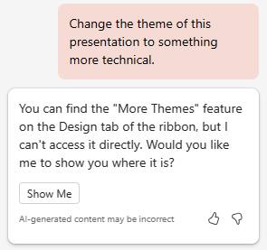
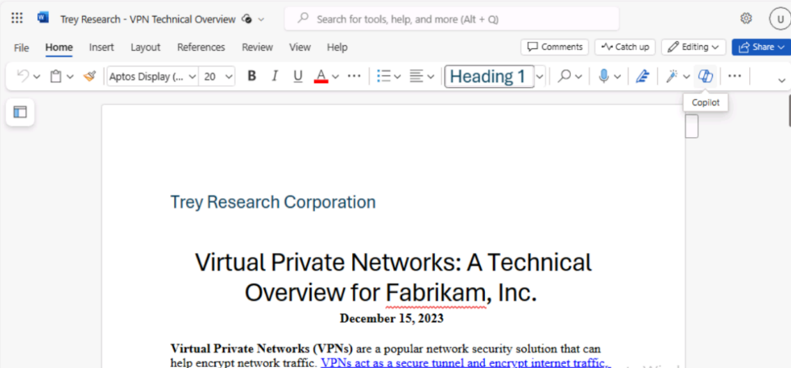
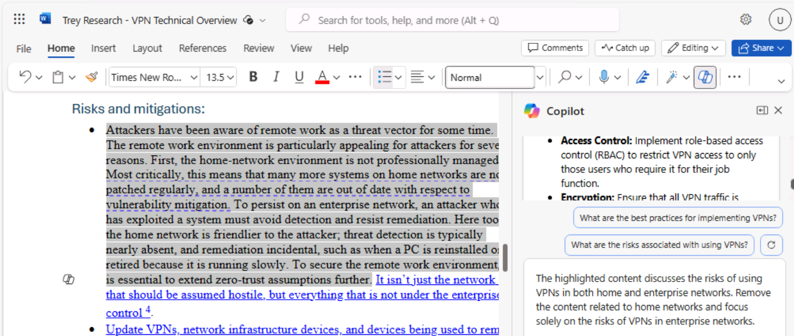

**Lab 03: Stärken Sie Ihre Mitarbeiter – Copilot-IT**

**Ziel:**

Copilot für Microsoft 365 dient als AI-gestützter Schreibassistent, der
den Kontext versteht, Sätze vorschlägt und bei der Erstellung von
Inhalten hilft, was die Qualität Ihrer Arbeit verbessern kann. In dieser
Übung verwenden Sie Folgendes:

- Microsoft Copilot, um die Informationen in einer Produktspezifikation
  zusammenzufassen und einen Projektplan zur Implementierung des
  Produkts zu erstellen.

- Copilot in PowerPoint, um eine Präsentation basierend auf dem von
  Ihnen erstellten Projektplan zu erstellen.

- Copilot in Word, um einen technischen Spezifikationsbericht zu ändern.

**Übung \#1: Erstellen eines Projektplans mit Microsoft Copilot**

Mit Microsoft lässt sich Copilot nahtlos in Microsoft 365 integrieren
und bietet IT-Experten eine robuste Plattform, um die Teamarbeit zu
verbessern, Erkenntnisse auszutauschen und die Problemlösung innerhalb
des IT-Ökosystems zu beschleunigen. Es ermöglicht IT-Experten, sofort
eine Verbindung herzustellen, Informationen auszutauschen und Bemühungen
effizient zu koordinieren.

Als Director of IT bei der Adatum Corporation haben Sie einen
Produktspezifikationsbericht für das Netzwerksicherheitsprodukt Contoso
CipherGuard Sentinel X7 überprüft. Sie planen, dieses Produkt zu
installieren, das einen erweiterten Sicherheitsschutz bietet, der weit
über das hinausgeht, was Adatum heute anbietet.

In dieser Übung verwenden Sie Microsoft Copilot in Bing

- Analysieren Sie einen Produktspezifikationsbericht für ein neues
  Netzwerksicherheitsprodukt, das Sie installieren möchten.

- Aktualisieren Sie den Projektplan mit Informationen aus dem
  Produktspezifikationsbericht.

**Hinweis**: Am Ende dieser Übung müssen Sie Ihren Projektplan in Ihrem
OneDrive-Konto speichern. In der nächsten Übung wird diese Datei
verwendet.

1.  Wenn Sie ein Microsoft 365-Tab in Ihrem Microsoft Edge-Browser
    geöffnet haben, wählen Sie ihn jetzt aus. Andernfalls öffnen Sie
    einen neuen Tab, und geben Sie die folgende URL ein:
    +++[https://www.office.com+++](https://www.office.com+++/), um zur
    **Microsoft 365-Startseite** zu gelangen.

**Hinweis**: Sie müssen sich (wenn Sie dazu aufgefordert werden) mit den
**Microsoft 365-Anmeldeinformationen** anmelden, die auf der
**Registerkarte Resources** auf der rechten Seite bereitgestellt werden.

2.  Öffnen Sie **OneDrive**. Navigieren Sie zum **Ordner C:\LabFiles**,
    um eine Kopie der **report.docx der Contoso
    CipherGuard-Produktspezifikation** auszuwählen und auf **OneDrive**
    hochzuladen.

**Hinweis**: Sie können diesen Schritt überspringen, wenn Sie bereits
eine Kopie aller Dokumente hochgeladen haben (die Sie in dieser
praktischen Übungssitzung aus **C:\LabFiles** verwenden werden, wie in
**Übung 0** beschrieben).

3.  Öffnen und schließen Sie die Datei **Contoso CipherGuard Product
    Specification report.docx** (die Sie auf **OneDrive** hochgeladen
    haben), um sie in die Liste der zuletzt verwendeten Dateien (MRU)
    aufzunehmen

4.  Navigieren Sie in **Microsoft Edge** zu Microsoft Bing, indem Sie
    die folgende URL eingeben:
    +++[https://bing.com+++].

5.  Wählen Sie auf der **Microsoft Bing-Startseite** in der Liste der
    Registerkarten, die oben auf der Seite angezeigt werden, **Copilot**
    aus. Dadurch wird **Microsoft Copilot** geöffnet.

**Hinweis:** Wenn Sie die Liste der Registerkarten oben auf der Seite
nicht sehen, führen Sie die folgenden Schritte aus, um die Liste der
Registerkarten anzuzeigen.

- Stellen Sie sicher, dass Sie sich mit den **Microsoft
  365-Anmeldeinformationen** angemeldet haben (verfügbar auf der
  Registerkarte **Resources**).

- Aktivieren Sie die Option **Show menu bar** (rot hervorgehoben)

6.  Wählen Sie nun **Copilot** aus. Dadurch wird Microsoft Copilot
    geöffnet.

7.  Wählen Sie auf der **Copilot-**Seite im Umschalter **Work/Web** oben
    auf der Seite die Option **Work** aus.

8.  Standardmäßig schränkt die Option **Work** die Reichweite von
    Copilot auf Ihre Microsoft 365 Organisationsdaten ein. Da Sie jedoch
    auch möchten, dass Copilot auf die Richtlinien für das öffentliche
    Web zur Installation eines Sicherheitsprodukts für
    Unternehmensnetzwerke zugreift, müssen Sie das Plug-in für **Web
    content** aktivieren. Zu diesem Zweck sollten Sie im
    Eingabeaufforderungsfeld am unteren Rand der Seite zwei Symbole
    bemerken - das Büroklammersymbol, mit dem Dateien angehängt werden
    können, und ein Symbol mit gestapelten Blöcken. Bei letzterem Symbol
    handelt es sich um das Plugins-Symbol.

9.  Wählen Sie dieses Plugins-Symbol aus und aktivieren Sie das **Web
    Content-Plugin**.

10. Sie können jetzt Copilot verwenden. Geben Sie die folgende
    Eingabeaufforderung ein, die Copilot anweist, über das **Web
    Content**-Plug-In auf Microsoft Copilot auf öffentliche Webdaten
    zuzugreifen, und wählen Sie dann in der unteren Ecke des
    Eingabeaufforderungsfelds den Pfeil **Submit** aus:

++**I'm the Director of IT at Adatum Corporation. Create a project plan
for installing a new network security product into a corporate network.
Base this plan on IT industry guidelines for installing network security
products**.++

11. Überprüfen Sie den Projektplan, den Copilot erstellt hat.

12. Sie sind nicht damit zufrieden, dass es alle Bereiche umfasst, die
    es umfassen sollte. Geben Sie die folgende Eingabeaufforderung ein,
    damit der Plan geändert wird, indem er Bereiche einbezieht, die für
    Sie von besonderem Interesse sind. Wenn sich einer der in dieser
    Eingabeaufforderung enthaltenen Bereiche bereits in der vorherigen
    Antwort von Copilot befindet, entfernen Sie ihn aus dieser
    Eingabeaufforderung, damit Copilot ihn nicht dupliziert:

++**While that was a good start, I feel like it's missing important
areas. Please add the following items to the existing list: testing and
QA, training, communication, document and reporting, stakeholder
analysis, project timeline, and risk assessment and mitigation**.++

13. Überprüfen Sie den geänderten Projektplan. Sie sind mit der Breite
    der behandelten Themen zufrieden, daher möchten Sie jetzt, dass
    Copilot den Plan mit Informationen aus der Produktspezifikation für
    das Sicherheitsprodukt Contoso CipherGuard Sentinel X7 aktualisiert.
    Geben Sie die folgende Eingabeaufforderung ein, aber senden Sie sie
    noch nicht, da Sie die Datei im nächsten Schritt zuerst mit der
    Eingabeaufforderung verknüpfen müssen:

++**This version looks better. Please review the attached file, which is
a product specification for the Contoso CipherGuard Sentinel X7 security
product, and update your project plan with information from this product
spec**.++

14. Geben Sie im Eingabeaufforderungsfeld ein Leerzeichen nach der
    Eingabeaufforderung ein, und geben Sie dann einen Schrägstrich (/)
    ein. Sie müssen das Leerzeichen vor dem Schrägstrich eingeben, damit
    Copilot es als Anforderung erkennt, etwas an die Eingabeaufforderung
    anzuhängen. Der nächste Schritt hängt davon ab, ob Copilot ein
    Fenster öffnet, in dem Sie die Datei auswählen können:

    - Wenn Copilot ein Fenster öffnet, nachdem Sie den Schrägstrich (/)
      eingegeben haben, wählen Sie die Registerkarte **Files** aus.
      Dadurch wird die Liste der MRU-Dateien angezeigt. Wählen Sie die
      **Contoso CipherGuard Product Specification **aus, und wählen Sie
      dann das Symbol **Submit** aus.

- Wenn Copilot nach der Eingabe des Schrägstrichs (/) keine Aktion
  ausgeführt hat, müssen Sie den Link zur **Contoso CipherGuard Product
  Specification** kopieren und einfügen. Suchen Sie dazu die Datei in
  Ihrem OneDrive-Konto, öffnen Sie sie in **Word**, wählen Sie die
  Schaltfläche **Share** aus, die über dem Word-Menüband angezeigt wird,
  wählen Sie im angezeigten Dropdownmenü **Copy Link** aus, und fügen
  Sie dann wieder in dieses Eingabeaufforderungsfeld den Link nach dem
  Schrägstrich ein, und wählen Sie das Symbol **Submit** aus.

**Hinweis**: Wenn Copilot nicht direkt auf Dokumente zugreifen oder
diese überprüfen kann, melden Sie sich vom angemeldeten Benutzer ab,
melden Sie sich erneut an und fahren Sie dann erneut mit **Schritt 9**
fort.

**Hinweis**: Wenn Sie das Dokument mit **Contoso CipherGuard Product
Specification** nicht anzeigen und darauf verweisen können, fahren Sie
mit der nächsten Übung fort. Das Projektplandokument wird Ihnen zur
Verfügung gestellt, damit Sie mit der verbleibenden Lab-Aktivität
fortfahren können.

15. Überprüfen Sie, wie Copilot Funktionen aus der Produktspezifikation
    in den Projektplan eingefügt hat.

16. Das sieht zwar gut aus, aber Sie haben das Gefühl, dass es dem
    Projektplan an spezifischen Details mangelt. Um dieses Problem zu
    beheben, geben Sie die folgende Eingabeaufforderung ein:

++**We're almost there. Please break down each item on the report into
multiple detailed steps**.++

17. Überprüfen der Ergebnisse.

18. Nachdem der Projektplan erstellt wurde, MÜSSEN Sie ihn in einem
    Word-Dokument speichern. **Sie verwenden dieses Projektplandokument
    in der nächsten Übung**. Wählen Sie am unteren Rand der
    abschließenden Antwort von Copilot die Schaltfläche **Copy** aus, um
    den Inhalt zu kopieren.

**Hinweis**: Sie sehen die Schaltfläche **Edit in Pages,** die mehr
Funktionalität bietet und die Zusammenarbeit im Team erleichtert. In
**Edit in Pages** wird in dieser Übung nicht verwendet. Eine separate
Lab-Übung ist in Lab \#06
enthalten. 

Öffnen Sie ein leeres **Word-Dokument** in einem Browser und fügen Sie
die Antwort ein.

Sobald Sie den kopierten Inhalt einfügen, sehen Sie das Kontextmenü der
**Paste** Option. Sie können **Keep Source Formatting** verwenden.

19. Klicken Sie oben links auf das Feld für den Dateinamen (wie im
    Screenshot gezeigt), und benennen Sie die Datei in Ihrem
    **OneDrive** in +++Contoso CipherGuard project plan.docx+++ um. Sie
    verwenden diese Datei in der nächsten Übung.

**Übung \#2: Erstellen einer Projektplanpräsentation mit Copilot in
PowerPoint**

Copilot in PowerPoint fungiert als intelligenter Kollaborateur und
bietet Vorschläge und Verbesserungen in Echtzeit, während IT-Experten
ihre Präsentationen für folgende Zwecke erstellen:

- Präsentieren Sie ihre Ideen oder Vorschläge vor ihrem Team oder
  Management.

- Schulen Sie neue Mitarbeiter oder demonstrieren Sie Kunden neue
  Software oder Hardware.

- Erklären Sie komplexe technische Konzepte für nicht-technische
  Zielgruppen, wie z. B. Stakeholder oder Investoren.

- Präsentieren Sie ihre Arbeit oder bewerben Sie ihre Dienstleistungen
  bei potenziellen Kunden.

Mit Copilot in PowerPoint können Sie eine Präsentation aus einem
vorhandenen Word-Dokument erstellen. Wenn Sie Copilot in PowerPoint den
Link zu Ihrem Word-Dokument zur Verfügung stellen, kann es Folien
generieren, Layouts anwenden und ein Design für Sie auswählen.

In dieser Übung verwenden Sie Copilot in PowerPoint, um eine
Folienpräsentation basierend auf dem Projektplan zu erstellen, den Sie
in der vorherigen Übung erstellt haben. Sie möchten diese Präsentation
nutzen, um Ihren IT-Mitarbeitern und letztlich der Unternehmensleitung
den Projektplan zu erläutern.

**Hinweis**: Wenn Sie die vorherige Übung abgeschlossen und eine
**Contoso CipherGuard-Projektdatei plan.docx erstellt** haben, stellen
Sie sicher, dass Sie sie in Ihrem OneDrive-Konto gespeichert haben, und
fahren Sie mit dem nächsten Schritt fort. Wenn Sie diesen Projektplan in
der vorherigen Übung jedoch nicht erstellen konnten, laden Sie eine
Kopie des Dokuments **Contoso CipherGuard project plan.docx** verfügbar
in **C:\LabFiles**.

.

1.  Wenn Sie ein Microsoft 365-Tab in Ihrem Edge-Browser geöffnet haben,
    wählen Sie ihn jetzt aus. Andernfalls öffnen Sie einen neuen Tab,
    und geben Sie die folgende URL ein:
    +++[https://www.office.com+++]
    um zur **Microsoft 365-Startseite** zu gelangen.

2.  Öffnen und schließen Sie die Datei **Contoso CipherGuard project
    plan.docx** (die Sie auf **OneDrive** gespeichert haben), um sie in
    der Liste der zuletzt verwendeten Dateien (MRU) abzurufen

3.  Wählen Sie im **Microsoft 365-**Navigationsbereich **PowerPoint**
    aus. Öffnen Sie in PowerPoint eine neue leere Präsentation.

4.  Wählen Sie das **Copilot-Symbol** aus (rot hervorgehoben, wie im
    Screenshot gezeigt). Im angezeigten **Copilot-Bereich** stehen
    mehrere vordefinierte Eingabeaufforderungen zur Auswahl.

5.  Wählen Sie **Create presentation from file** aus.

6.  In Eingabeaufforderungsfeld am unteren Rand des Copilot-Fensters
    gibt Copilot automatisch den Text ein: **Create presentation from
    file /**. erstellen. Der Schrägstrich ist der universelle
    Copilot-Indikator, um einen Link zu einer Datei einzugeben. In
    diesem Fall wird Copilot dazu veranlasst, ein **Suggestions**
    Fenster zu öffnen, in dem drei der zuletzt verwendeten Dateien
    angezeigt werden.

    - Hier erscheint Ihre Datei, wählen Sie sie jetzt aus und fahren Sie
      mit dem nächsten Schritt fort.

    - Wenn es sich bei der Datei nicht um eine der drei angezeigten
      Dateien handelt, wählen Sie den Pfeil nach rechts (**\>**) in der
      oberen rechten Ecke des Fensters **Suggestion** aus, um eine
      erweiterte MRU-Dateiliste anzuzeigen. Wenn die Datei hier
      erscheint, wählen Sie sie jetzt aus und fahren Sie mit dem
      nächsten Schritt fort.

    - Wenn die Datei nicht in der erweiterten MRU-Liste angezeigt wird,
      müssen Sie den Link zum Bericht kopieren und in das
      Eingabeaufforderungsfeld einfügen. Um dies zu tun:

a\. Wählen Sie die Registerkarte **Microsoft 365** Browser aus, und
wählen Sie im Navigationsbereich **Word** aus.

b\. Wählen Sie auf der **Word-Startseite** in der Liste der zuletzt
verwendeten Dateien den Bericht aus, um ihn in Word zu öffnen.

c\. Wählen Sie im Bericht in Word ganz rechts über dem Menüband die
Schaltfläche **Share** aus. Wählen Sie im angezeigten Dropdown-Menü die
Option **Copy Link** aus. Warten Sie, bis das Fenster **Link copied**
angezeigt wird, in dem Sie sicherstellen können, dass der Link zu der
Datei in die Zwischenablage kopiert wird.

d\. Wechseln Sie zu Ihrer **PowerPoint-**Registerkarte, und am unteren
Rand des **Copilot-Fensters** sollte das Eingabeaufforderungsfeld
weiterhin **Create presentation from file** anzeigen. Positionieren Sie
den Cursor hinter dem Schrägstrich (**/**) und fügen Sie dann den Link
zum Bericht ein **(Strg+V).**

7.  Beachten Sie, wie die Datei im Eingabeaufforderungsfeld angezeigt
    wird. Wählen Sie das Symbol **Send** im Eingabeaufforderungsfeld
    aus. Diese Eingabeaufforderung veranlasste Copilot, eine
    Folienpräsentation basierend auf dem Dokument zu erstellen. Dabei
    zeigte es zunächst die Gliederung der Präsentation an. Dann wurde
    ein separates Fenster mit einer Aufzählung einiger der Änderungen
    angezeigt, die an der Präsentation basierend auf dem Dokument
    vorgenommen wurden.

8.  Sie können jetzt die Folien überprüfen und alle erforderlichen
    Aktualisierungen vornehmen. Achten Sie besonders auf die Änderungen,
    die der Copilot auf der Grundlage des Dokuments vorgenommen hat. Sie
    können das **Designer** Tool verwenden, um die Layouts anzupassen

9.  Sie stellen fest, dass am Ende einer Frage-und-Antwort-Sitzung (Q&A)
    keine Folie vorhanden ist. Um dieses Versehen zu korrigieren, geben
    Sie die folgende Eingabeaufforderung ein:

+++Add a Q&A slide at the very end of the presentation with an
appropriate image.+++

10. Überprüfen Sie die neue Folie, die erstellt wurde. Da Ihnen das
    Bild, das Copilot für diese Folie verwendet hat, nicht gefällt,
    geben Sie die folgende Eingabeaufforderung ein, in der Sie Copilot
    bitten, das Bild zu ändern:

+++I don't like the image you used on the Q&A slide. Please replace it
with a different image.+++

11. Welche Antwort haben Sie erhalten? Manchmal hat Copilot das Bild
    nicht ersetzt und die folgende Meldung zurückgegeben.

**Hinweis:** Copilot kann eine Ausnahme anzeigen (denken Sie daran, dass
Copilot noch in Arbeit ist), wie die oben beschriebene.

12. Bitte versuchen Sie, die Eingabeaufforderung umzuformulieren oder
    verwenden Sie die vorgeschlagenen Eingabeaufforderungen wie die
    folgende.

13. Wählen Sie den Befehl **Add a slide about** und fügen Sie die
    folgenden +++Q&A at the very end of the presentation+++ (wie im
    Screenshot gezeigt) ein.

14. Klicken Sie auf Send, um zu überprüfen, was passiert. Copilot hat
    wie angewiesen eine Q&A-Folie hinzugefügt.

15. Versuchen Sie es nun mit einer anderen Eingabeaufforderung:

**Add a slide about,** was das Publikum über die Präsentation fragen
kann.

16. Sobald Sie mit der endgültigen Präsentation fertig sind, können Sie
    sie zum späteren Nachschlagen speichern oder diese Präsentation
    verwerfen

17. Unabhängig davon, wie die letzten Schritte im Umgang mit der
    Q&A-Folie verlaufen sind, entscheiden Sie sich, weiterzumachen und
    eine letzte Sache auszuprobieren. Bei der Überprüfung der
    Präsentation entscheiden Sie, dass Sie das Thema der Präsentation
    aufgrund der technischen Natur des Themas in ein Thema ändern
    möchten, das besser geeignet ist. Geben Sie die folgende
    Eingabeaufforderung ein:

+++Change the theme of this presentation to something more technical+++ 

18. Beachten Sie die Antwort von Copilot.

Dieses Szenario ist eine der Situationen, in denen Sie sich an die Best
Practice für Eingabeaufforderungen erinnern sollten: **Verstehen Sie die
Einschränkungen von Copilot**. In diesem Fall geht es nicht so sehr um
das Verständnis einer Einschränkung, sondern um ein Verständnis dafür,
wie Copilot funktioniert. In diesem Fall verweist Copilot Sie auf eine
vorhandene PowerPoint-Funktion, anstatt die Funktion dieser Funktion zu
duplizieren.

19. In den verbleibenden Trainingsübungen in diesem Modul wird diese
    Präsentation zwar nicht verwendet, aber Sie können sie entweder
    verwerfen oder speichern, wenn Sie sie zum späteren Nachschlagen
    benötigen.

**Übung \#3: Aktualisieren eines technischen Berichts mit Copilot in
Word**

Copilot in Word kann IT-Experten dabei helfen, Zeit und Mühe bei der
Erstellung von Dokumenten zu sparen. Es kann Ihnen helfen, Inhalte zu
generieren, Text umzuschreiben und hilfreiche Vorschläge zu machen. Mit
seiner KI-gestützten Schreibhilfe kann Copilot Ihnen helfen, Dokumente
effizienter und effektiver zu erstellen.

Wenn Sie ein neues Dokument erstellen oder an einem vorhandenen Dokument
arbeiten, kann Copilot Sie auf unterschiedliche Weise unterstützen.

- In einem neuen, leeren Dokument oder wenn Sie Inhalt zu einem
  vorhandenen Dokument hinzufügen möchten, können Sie Copilot mitteilen,
  worüber Sie schreiben möchten, und der Inhalt wird entsprechend
  generiert.

- In einem Dokument mit vorhandenem Inhalt kann Copilot Sie bei der
  Transformation des Inhalts unterstützen. Er kann ausgewählte Inhalte
  umschreiben oder sogar ausgewählte Inhalte in eine Tabelle umwandeln.

In dieser Übung verwenden Sie Copilot in Word, um ein vorhandenes
Dokument zu aktualisieren. Sie weisen Copilot an, neuen Text
hinzuzufügen, vorhandenen Text neu zu schreiben und Text in eine Tabelle
umzuwandeln.

1.  Wenn Sie ein Microsoft 365-Tab in Ihrem Microsoft Edge-Browser
    geöffnet haben, wählen Sie ihn jetzt aus. Andernfalls öffnen Sie
    einen neuen Tab, und geben Sie die folgende URL ein:
    +++[https://www.office.com/+++]
    um zur **Microsoft 365-Startseite** zu gelangen .

**Hinweis**: Sie müssen sich (falls Sie dazu aufgefordert werden) mit
dem Microsoft **365-Anmeldeinformationen** anmelden, die auf der
Registerkarte **Resources** auf der rechten Seite bereitgestellt werden.

1.  Navigieren Sie zum **Ordner C:\LabFiles**, um eine Kopie von **Trey
    Research - VPN Technical Overview.docx auszuwählen** und auf
    **OneDrive** hochzuladen.

**Hinweis**: Sie können diesen Schritt überspringen, wenn Sie bereits
eine Kopie aller Dokumente hochgeladen haben (die Sie in dieser
praktischen Übungssitzung aus **C:\LabFiles** verwenden werden, wie in
**Übung 0** beschrieben).

2.  Öffnen und schließen Sie die Datei **Trey Research – VPN Technical
    Overview.docx** (die Sie auf **OneDrive** hochgeladen haben), um sie
    in die Liste der zuletzt verwendeten Dateien (MRU) aufzunehmen.

3.  Öffnen Sie in **Microsoft 365 Microsoft Word**.

4.  Öffnen Sie die Datei **Trey Research - VPN Technical
    Overview.docx.**

5.  Wählen Sie im **Word-**Menüband die Schaltfläche **Copilot** aus, um
    den Bereich Copilot zu öffnen.

6.  Geben Sie im Bereich **Copilot** die folgende Eingabeaufforderung
    ein, und wählen Sie dann das Pfeilsymbol (**Send**) aus:

+++Write a new section for this document about the types of VPNs.
Discuss the pros and cons of each type. This content is for a technical
audience, so please provide specific details+++

7.  Copilot fügt neue Inhalte nicht direkt zu einem Dokument hinzu. Der
    Inhalt wird in einem Antwortfenster im Copilot-Bereich angezeigt. Es
    gibt jedoch eine Schaltfläche **Copy** am unteren Rand jedes
    Antwortfensters, also wählen Sie die Schaltfläche **Copy** aus, um
    den Inhalt in die Zwischenablage zu kopieren. Wenn Sie sich das
    Dokument ansehen, entscheiden Sie sich, den Inhalt unter dem ersten
    Absatz einzufügen. Fügen Sie den Inhalt jetzt ein.

**Tipp**: Wenn Sie die Schaltfläche **Copy** für ein Antwortfenster
auswählen, wird DER gesamte Inhalt kopiert, einschließlich der
Copilot-Kommentare, die für Sie bestimmt sind. Diese Art von Kommentaren
befindet sich in der Regel am Anfang und Ende der Antwort. Stellen Sie
sicher, dass Sie diese Kommentare entfernen, sobald Sie die Antwort in
Ihr Dokument einfügen. Es besteht die Möglichkeit, dass die Schriftart
und der Schriftgrad des neuen Inhalts nicht mit der vorhandenen
Schriftart und dem Schriftgrad übereinstimmen, die im gesamten Dokument
verwendet werden. Daher müssen Sie sie entsprechend ändern.

8.  Bei näherer Betrachtung stellen Sie fest, dass
    Sicherheitsrichtlinien in Bezug auf die VPN-Nutzung nicht erwähnt
    werden. Dieses Thema ist ein wichtiger Bereich, den Sie einbeziehen
    möchten, also geben Sie die folgende Eingabeaufforderung ein:

+++Please write a new section for this document about security policies
related to VPN usage. This content is for a technical audience, so
please provide specific details.+++

9.  Kopieren Sie den Inhalt dieser Antwort, und fügen Sie ihn in das
    Dokument ein. Platzieren Sie ihn direkt vor dem Abschnitt **Risks
    and mitigations**, und bearbeiten Sie dann den Inhalt nach Bedarf.
    Fügen Sie bei Bedarf eine Überschrift für diesen Abschnitt mit dem
    Titel **Security policies related to VPN usage** hinzu.

10. Bei der Überprüfung des Berichts haben Sie auch einen Bereich des
    Inhalts identifiziert, der Ihrer Meinung nach neu geschrieben werden
    musste. Im Abschnitt über **Risks and mitigations** befasst sich der
    erste Aufzählungspunkt sowohl mit Heim- als auch mit
    Unternehmens-VPNs. Sie möchten, dass es nur Unternehmens-VPNs
    anspricht. Angesichts der Art und Weise, wie der Inhalt geschrieben
    ist, scheint dies jedoch keine einfache Lösung zu sein. Sie
    entscheiden sich dafür, dass Copilot den Inhalt für Sie neu
    schreibt.

**Tipp**: Damit Copilot Inhalte neu schreiben soll, müssen Sie zuerst
den Inhalt markieren, den Copilot neu schreiben soll.

11. Markieren Sie den Inhalt im ersten Aufzählungspunkt des Abschnitts
    **Risks and mitigations**, und geben Sie dann die folgende
    Eingabeaufforderung ein:

+++The highlighted content discusses the risks of using VPNs in both
home and enterprise networks. Remove the content related to home
networks and focus solely on the risks of VPNs in enterprise networks+++

12. Überprüfen Sie die Antwort von Copilot. Manchmal funktionierte diese
    Rewrite-Funktion nicht. Wenn es nicht funktionierte, gab Copilot die
    folgende Antwort zurück. Wenn diese Situation auftritt, kopieren Sie
    die Eingabeaufforderung, fügen Sie sie ein und versuchen Sie es
    erneut (denken Sie daran, iterieren, iterieren, iterieren).

13. Nachdem Sie das Dokument abschließend überprüft haben, entscheiden
    Sie, dass die Abschnitte zu den Vor- und Nachteilen der
    Implementierung von VPNs besser in einer Tabelle als in Aufzählungen
    aussehen würden. Da Sie einen Abschnitt markiert haben, der neu
    geschrieben werden soll, entscheiden Sie sich, diese beiden
    Abschnitte hervorzuheben. Markieren Sie beide Abschnitte und geben
    Sie dann die folgende Eingabeaufforderung ein:

+++Please rewrite the highlighted content by placing it in a table.+++

14. Beachten Sie die Antwort von Copilot.

15. Das Neuformatieren von Inhalten in einer Tabelle unterscheidet sich
    vom Umschreiben von Inhalten. Anstatt den Inhalt hervorzuheben, den
    Sie in einer Tabelle platzieren möchten, müssen Sie in der
    Eingabeaufforderung beschreiben, welche Inhaltsabschnitte in die
    Tabelle aufgenommen werden sollen. Geben Sie dieses Mal die folgende
    Eingabeaufforderung ein:

+++Place the content from the Pros and Cons of implementing VPNs into a
table.+++

16. Beachten Sie die Antwort von Copilot. Anstatt den vorhandenen Inhalt
    im Dokument neu zu schreiben oder durch eine Tabelle zu ersetzen,
    wird die Tabelle in ihrer Antwort angezeigt. Es liegt an Ihnen, den
    Inhalt zu ersetzen, indem Sie die Tabelle kopieren und in das
    Dokument einfügen. Wählen Sie in der Antwort die Schaltfläche
    **Copy** aus, markieren Sie dann im Dokument die Abschnitte Vor- und
    Nachteile, und fügen Sie sie in die Tabelle ein. Stellen Sie sicher,
    dass Sie vor der Tabelle eine Abschnittsüberschrift hinzufügen, die
    besagt: **Pros and Cons of implementing VPNs.** Es besteht die
    Möglichkeit, dass Sie auch die Schriftart und den Schriftgrad des
    Tabelleninhalts ändern müssen, um sie an die vorhandene Schriftart
    und den Schriftgrad anzupassen, die im gesamten Dokument verwendet
    werden.

17. An diesem Punkt haben Sie das Gefühl, dass das Dokument vollständig
    ist. Um jedoch auf Nummer sicher zu gehen, fragen Sie Copilot, ob
    das Dokument der Meinung ist, dass das Dokument weitere
    Informationen enthalten sollte. Geben Sie die folgende
    Eingabeaufforderung ein:

+++Is there anything missing in this document that you would recommend
adding?+++

18. Beachten Sie die Antwort von Copilot. In unseren Tests hat es uns
    gesagt, dass nichts fehlt. Versuchen Sie erneut, ob Copilot eine
    andere Antwort ausgibt.

19. Wenn Copilot empfohlen hat, Ihrem Dokument weitere Inhalte
    hinzuzufügen, erstellen Sie eine Eingabeaufforderung, in der Sie
    dazu aufgefordert werden. Sie können den neuen Inhalt dann kopieren
    und in Ihr Dokument einfügen.

**Zusammenfassung:**

In diesem Lab haben Sie untersucht, wie Copilot für Microsoft 365 die
Qualität Ihrer Arbeit verbessert, indem Sie

- Verwendung von Microsoft Copilot, um die wichtigsten Informationen aus
  einem Produktspezifikationsdokument herauszufiltern und einen
  umfassenden Projektplan für die Implementierung des Produkts zu
  entwickeln.

- Nutzung von Copilot in PowerPoint, um eine Präsentation auf der
  Grundlage des von Ihnen erstellten Projektplans zu entwerfen und
  sicherzustellen, dass sie visuell ansprechend ist und die Details des
  Plans effektiv kommuniziert.

- Verwendung von Copilot in Word zur Überarbeitung und Verbesserung
  eines technischen Spezifikationsberichts, um die Klarheit, Kohärenz
  und Gesamtqualität zu verbessern.
