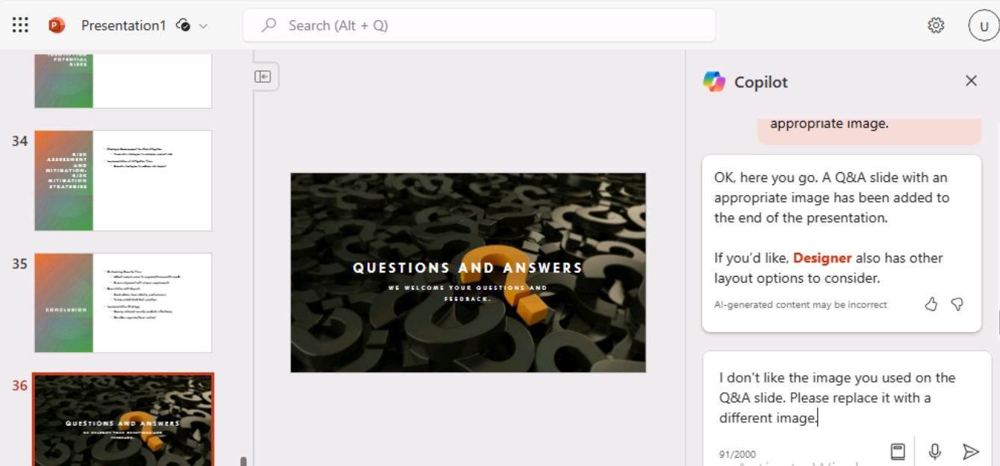

**實驗室 03：為您的員工賦能 – Copilot-IT**

**目的：**

適用於 Microsoft 365 的 Copilot 充當 AI
驅動的寫作助手，可理解上下文、建議短語並幫助生成內容，所有這些都可以提高您的工作質量。在本實驗中，您將使用：

- Microsoft Copilot 匯總產品規格中的信息並創建項目計劃來實施該產品。

- PowerPoint 中的 Copilot 根據您創建的項目計劃創建演示文稿。

- Word 中的 Copilot 修改技術規範報告。

**練習 #1：使用 Microsoft Copilot 創建項目計劃**

借助 Microsoft，Copilot 無縫集成到 Microsoft 365 中，並為 IT
專業人員提供了一個強大的平臺，以增強團隊合作、共享見解並加速 IT
生態系統中的問題解決。它使 IT
專業人員能夠即時連接、共享信息並有效地協調工作。

作為 Adatum Corporation 的 IT 總監，您一直在查看 Contoso CipherGuard
Sentinel X7
網絡安全產品的產品規格報告。您計劃安裝此產品，它提供的高級安全保護遠遠超出
Adatum 目前所擁有的任何產品。

在本練習中，您將在必應中使用 Microsoft Copilot

- 分析您計劃安裝的新網絡安全產品的產品規格報告。

- 使用產品規格報告中的信息更新項目計劃。

**注意：**在本練習結束時，您必須將項目計劃保存到 OneDrive
帳戶。下一個練習將使用此文件。

1.  如果您在 Microsoft Edge 瀏覽器中打開了 Microsoft 365
    選項卡，請立即選擇它; 否則，請打開一個新選項卡並輸入以下
    URL： +++[https://www.office.com+++](https://www.office.com+++/) 以轉到
    **Microsoft 365** 主頁。

**注意：**您需要使用右側**“資源”選項卡**下提供的 **Microsoft 365
憑據**登錄（如果出現提示）。

2.  打開 **OneDrive**。瀏覽到 **C：\LabFiles** 文件夾，選擇 **Contoso
    CipherGuard Product Specification report.docx** 的副本並將其上傳到
    **OneDrive**。

**注意：**如果您已經上傳了所有文檔的副本（您將按照**實驗室 0**
中的說明從 **C：\LabFiles** 進行此動手實驗會話），則可以跳過此步驟。

3.  打開並關閉 **Contoso CipherGuard Product Specification report.docx**
    文件（已上傳到 **OneDrive**），將其放入最近使用的 （MRU） 文件列表中

4.  在 **Microsoft Edge** 中，輸入以下 URL 導航到 Microsoft
    Bing： +++[https://bing.com+++](https://github.com/technofocus-pte/m365cpltdeplextdepth/blob/m365cpltdeplextdepth-Dec2K24/Instructions/Lab%2003/media/image15.png)。

5.  在 **Microsoft Bing 主頁**上，在頁面頂部顯示的選項卡列表中，選擇
    **Copilot**。這樣做將打開 **Microsoft Copilot**。

**注意：**
如果您在頁面頂部沒有看到標簽頁列表，請按照以下步驟查看標簽頁列表。

- 確保您已使用 **Microsoft 365 憑據**（位於 **Resources** （資源）
  選項卡下） 登錄。

- 啟用選項 **Show menu bar** （以紅色高亮顯示）

6.  現在選擇 **Copilot**。這樣做將打開 Microsoft Copilot。

7.  在 **Copilot** 頁面上，在頁面頂部的 **Work/Web** 切換開關中，選擇
    **Work**。

8.  默認情況下，“**Work**”選項會限制 Copilot 對您的 Microsoft 365
    組織數據的訪問權限。但是，由於您還希望 Copilot
    訪問有關安裝公司網絡安全產品的公共 Web 指南，因此您必須啟用 **Web
    內容**插件。為此，在頁面底部的提示字段中，您應該注意到兩個圖標 -
    回形針圖標（用於附加文件）和堆疊塊圖標。後一個圖標是 Plugins 圖標。

9.  選擇此 **Plugins** 圖標並啟用 **Web 內容**插件。

10. 您現在可以使用 Copilot。輸入以下提示，該提示指示 Copilot 通過 **Web
    內容**插件訪問 Microsoft Copilot 的公共 Web
    數據，然後選擇提示字段下角的 “**Submit**” 箭頭：

++**I'm the Director of IT at Adatum Corporation. Create a project plan
for installing a new network security product into a corporate network.
Base this plan on IT industry guidelines for installing network security
products**.++

11. 查看 Copilot 創建的項目計劃。

12. 您不滿意它包含它應該包含的所有領域。輸入以下提示，讓它通過包含您特別感興趣的區域來修改其計劃。如果此提示中包含的任何區域已在
    Copilot 的上一個響應中，請從此提示中刪除它們，以便 Copilot
    不會複製它們：

++**While that was a good start, I feel like it's missing important
areas. Please add the following items to the existing list: testing and
QA, training, communication, document and reporting, stakeholder
analysis, project timeline, and risk assessment and mitigation**.++

13. 查看修改後的項目計劃。您對涵蓋的主題的廣度感到滿意，因此現在您希望
    Copilot 使用 Contoso CipherGuard Sentinel X7
    安全產品的產品規格中的信息更新計劃。輸入以下提示，但不要提交，因為您必須先在下一步中將文件鏈接到提示：

++**This version looks better. Please review the attached file, which is
a product specification for the Contoso CipherGuard Sentinel X7 security
product, and update your project plan with information from this product
spec**.++

14. 在提示字段中，在提示後輸入一個空格，然後鍵入正斜杠
    （/）。您必須在正斜杠之前輸入空格，以便 Copilot
    將其識別為將某些內容附加到提示符的請求。下一步取決於 Copilot
    是否打開一個窗口供您選擇文件：

    - 如果 Copilot 在您輸入正斜杠 （/） 後打開一個窗口，請選擇 “文件”
      選項卡。這樣做會顯示 MRU 文件的列表。選擇 **Contoso CipherGuard
      Product Specification** 文件，然後選擇 **Submit** 圖標。

- 如果 Copilot 在您輸入正斜杠 （/） 後未執行任何作，則必須複製並粘貼指向
  **Contoso CipherGuard Product Specification**
  文件的鏈接。為此，請在您的 OneDrive 帳戶中找到該文件，在 **Word**
  中打開它，選擇 Word 功能區上方顯示的
  “**Share**”按鈕，在出現的下拉菜單中選擇 “**Copy link**”
  ，然後返回此提示字段，粘貼正斜杠後面的鏈接，然後選擇 “**Submit**”
  圖標。

**注意：**如果 Copilot
無法直接訪問或查看文檔，請注銷已登錄用戶並再次登錄，然後再次從**步驟 9**
繼續。

**注意：**如果您無法查看和引用 **Contoso CipherGuard Product
Specification**
文檔，請繼續進行下一個練習。項目計劃文檔可供您繼續執行剩餘的實驗室活動。

15. 查看 Copilot 如何將產品規格中的功能插入到項目計劃中。

16. 雖然這看起來不錯，但您覺得項目計劃缺少具體細節。要解決此問題，請輸入以下提示：

++**We're almost there. Please break down each item on the report into
multiple detailed steps**.++

17. 查看結果。

18. 現在，項目計劃已創建，您必須將其保存到 Word
    文檔中。**您將在下一個練習中使用此項目計劃文檔**。在 Copilot
    最終響應的底部，選擇 “Copy ”按鈕以複製內容。

**注意：**您將看到一個 **Edit in Pages**
按鈕，該按鈕提供了更多功能並促進了團隊協作。在本練習中，我們不會使用
**Edit in Pages**。實驗室 \#06
中包括一個單獨的實驗室練習。 

在瀏覽器中打開一個空白的 **Word** 文檔 Word 文檔並粘貼響應。

粘貼複製的內容後，您將看到 **Paste options** 上下文菜單。您可以使用
**Keep Source
formatting**。 

19. 單擊左上角的文件名字段（如屏幕截圖所示），然後在 **OneDrive**
    中將文件重命名為 +++Contoso CipherGuard 項目
    plan.docx+++。您將在下一個練習中使用此文件。

**練習 \#2：在 PowerPoint 中使用 Copilot 創建項目計劃演示文稿**

PowerPoint 中的 Copilot 充當智能協作者，在 IT
專業人員製作演示文稿時提供實時建議和增強功能，以便：

- 向他們的團隊或管理層展示他們的想法或提案。

- 培訓新員工或向客戶演示新軟件或硬件。

- 向非技術受眾（如利益相關者或投資者）解釋複雜的技術概念。

- 向潛在客戶展示他們的工作或推廣他們的服務。

使用 PowerPoint 中的 Copilot，您可以從現有 Word 文檔創建演示文稿。當您在
PowerPoint 中為 Copilot 提供指向 Word
文檔的鏈接時，它可以生成幻燈片、應用佈局並為您選擇主題。

在本練習中，您將使用 PowerPoint 中的 Copilot
根據您在上一個練習中創建的項目計劃創建幻燈片演示文稿。您希望使用此演示文稿向
IT 員工解釋項目計劃，並最終向公司管理層解釋項目計劃。

**注意：**如果您完成了前面的練習並創建了 **Contoso CipherGuard project
plan.docx** 文件，請確保將其保存到您的 OneDrive
帳戶並繼續下一步。但是，如果您在前面的練習中無法創建此項目計劃，請上傳文檔
**Contoso CipherGuard project plan.docx** 的副本 C：\LabFiles 中可用。

1.  如果您在 Edge 瀏覽器中打開了 Microsoft 365
    選項卡，請立即選擇它;否則，請打開一個新選項卡並輸入以下
    URL：+++[https://www.office.com+++](https://github.com/technofocus-pte/m365cpltdeplextdepth/blob/m365cpltdeplextdepth-Dec2K24/Instructions/Lab%2003/media/image22.png) 以轉到
    **Microsoft 365** 主頁。

2.  打開並關閉 文件 **Contoso CipherGuard project plan.docx** （已保存到
    **OneDrive**），以將其放入最近使用的 （MRU） 文件列表中

3.  在 **Microsoft 365** 導航窗格中，選擇 **PowerPoint**。在 PowerPoint
    中，打開一個新的空白演示文稿。

4.  選擇 **Copilot** 圖標（以紅色突出顯示，如屏幕截圖所示）。在顯示的
    **Copilot** 窗格中，有幾個預定義的提示可供您選擇。

5.  選擇 **Create presentation from file** 提示。

6.  在 **Copilot** 窗格底部的提示字段中，Copilot
    會自動輸入文本：**Create presentation from file /**。正斜杠是通用的
    Copilot 指示器，用於輸入文件的鏈接。在這種情況下，它會觸發 Copilot
    打開一個 **Suggestions**窗口，其中顯示最近使用的三個文件。

    - 如果您的文件顯示在此處，請立即選擇它並繼續下一步。

    - 如果該文件不是顯示的三個文件之一，請選擇 **Suggestions** （建議）
      窗口右上角的向右箭頭 （\>） 以查看展開的 MRU
      文件列表。如果文件顯示在此處，請立即選擇它並繼續下一步。

    - 如果您在展開的 MRU
      列表中沒有看到您的文件，則必須複製報告的鏈接並將其粘貼到提示字段中。為此，請執行以下作：

a\. 選擇 **Microsoft 365** 瀏覽器選項卡，然後在導航窗格中選擇 **Word**。

b\. 在 **Word** 主頁的最近打開的文件列表中，選擇報表以在 Word 中打開它。

c\. 在 Word 的報表中，在功能區上方的最右側，選擇 “**Share**”
按鈕。在顯示的下拉菜單中，選擇 **Copy Link**。等待 **Link copied**
（鏈接已複製） 窗口出現，這是您確保文件的鏈接已複製到剪貼板的保證。

d\. 切換到 **PowerPoint** 選項卡，在 **Copilot**
窗格的底部，提示字段應仍顯示 “**Create presentation from file /**”
。將光標置於正斜杠 （**/**） 之後，然後粘貼到 （**Ctrl+V**）
報表的鏈接。

7.  請注意文件在提示字段中的顯示方式。選擇提示字段中的 **Send**
    圖標。此提示觸發 Copilot
    根據文檔創建幻燈片演示文稿。在此過程中，它首先顯示演示文稿的大綱。然後，它顯示一個單獨的窗口，其中顯示了它根據文檔對演示文稿所做的一些更改的項目符號列表。

8.  您現在可以自由地查看幻燈片並進行任何必要的更新。請特別注意 Copilot
    根據文檔所做的更改。您可以使用 **Designer** 工具調整佈局

9.  您注意到，問答 （Q&A）
    會話的末尾沒有幻燈片。要更正此疏忽，請輸入以下提示：

+++Add a Q&A slide at the very end of the presentation with an
appropriate image.+++

10. 查看已創建的新幻燈片。您不喜歡 Copilot
    用於此幻燈片的圖像，因此輸入以下提示，要求 Copilot 更改圖像：

+++I don't like the image you used on the Q&A slide. Please replace it
with a different image.+++

11. 您收到了什麼回復？有時 Copilot 沒有替換圖像，它會返回以下消息。

**注意：**Copilot 可能會顯示一些異常（請記住，Copilot
仍在進行中），如上所示。

12. 請嘗試改寫提示或使用建議的提示，如下所示。

13. 選擇命令 **Add a slide about** 並在演示文稿的末尾附加以下
    +++Q&A+（如屏幕截圖所示）

14. 單擊 Send 以檢查會發生什麼。Copilot 已按照說明添加了 Q&A 幻燈片。

15. 現在嘗試使用另一個提示：

**Add a slide about** what the audience may ask about the presentation.

16. 完成最終演示後，您可以保存以備將來參考或放棄此演示文稿

17. 無論處理 Q&A
    幻燈片的最後幾個步驟如何，您都決定繼續嘗試最後一件事。在審閱演示文稿時，由於主題的技術性質，您決定要將演示文稿的主題更改為更合適的主題。輸入以下提示：

+++Change the theme of this presentation to something more technical+++ 

18. 請注意 Copilot 的回應。

此方案是需要記住提示最佳實踐的情況之一：**瞭解 Copilot
的限制**。在這種情況下，與其說是對限制的理解，不如說是對 Copilot
工作原理的理解。在這種情況下，Copilot 會將您指向現有的 PowerPoint
功能，而不是複製該功能的功能。

19. 雖然本模塊中的其餘訓練練習不使用此演示文稿，但如果需要，您可以丟棄或保存它以備將來參考。

**練習 \#3：在 Word 中使用 Copilot 更新技術報告**

Word 中的 Copilot 可以幫助 IT
專業人員在創建文檔時節省時間和精力。它可以幫助您生成內容、重寫文本並提供有用的建議。憑藉其
AI 驅動的寫作輔助，Copilot 可以幫助您更高效地創建文檔。

當您創建新文檔或處理現有文檔時，Copilot 可以以不同的方式為您提供幫助。

- 在新的空白文檔中或當您想向現有文檔添加內容時，您可以告訴 Copilot
  您要寫什麼，它會相應地生成內容。

- 在包含現有內容的文檔中，Copilot
  可以幫助您轉換內容。它可以重寫所選內容，甚至可以將所選內容轉換為表格。

在本練習中，您將在 Word 中使用 Copilot 來更新現有文檔。您指示 Copilot
添加新文本、重寫現有文本並將文本轉換為表格。

1.  如果您在 Microsoft Edge 瀏覽器中打開了 Microsoft 365
    選項卡，請立即選擇它;否則，請打開一個新選項卡並輸入以下
    URL： +++[https://www.office.com/+++](https://github.com/technofocus-pte/m365cpltdeplextdepth/blob/m365cpltdeplextdepth-Dec2K24/Instructions/Lab%2003/media/image13.png) 以轉到
    **Microsoft 365** 主頁。

**注意：**您需要使用右側**“資源”選項卡**下提供的 **Microsoft 365
憑據**登錄（如果出現提示）。

2.  瀏覽到 **C：\LabFiles** 文件夾以選擇 **Trey Research - VPN Technical
    Overview.docx** 的副本並將其上傳到 **OneDrive**。

**注意：**如果您已經上傳了所有文檔的副本（您將按照**實驗室 0**
中的說明從 **C：\LabFiles** 進行此動手實驗會話），則可以跳過此步驟。

3.  打開並關閉文件 **Trey Research - VPN Technical Overview.docx**
    （已上傳到 **OneDrive**） ，以將其放入最近使用的 （MRU）
    文件列表中。

4.  在 **Microsoft 365** 中，打開 **Microsoft Word**。

5.  打開 **Trey Research - VPN Technical Overview.docx** 文件。

6.  在 **Word** 功能區上，選擇 **Copilot** 按鈕以打開 Copilot 窗格。

7.  在 **Copilot** 窗格中，輸入以下提示，然後選擇箭頭 （**Send**）
    圖標：

+++Write a new section for this document about the types of VPNs.
Discuss the pros and cons of each type. This content is for a technical
audience, so please provide specific details+++

8.  Copilot 不會將新內容直接添加到文檔中。它在 Copilot
    窗格的響應窗口中顯示內容。但是，它確實在每個響應窗口的底部提供了一個
    **Copy** 按鈕，因此請選擇 **Copy**
    按鈕將其內容複製到剪貼板。在查看文檔時，您決定將內容粘貼到開始段落的下方。現在粘貼內容。

**提示：** 當您選擇響應窗口的 “**Copy**” 按鈕時，它會複製所有內容，包括
Copilot
的評論，這些評論是面向您的。這些類型的注釋通常位於響應的開頭和結尾。確保在將響應粘貼到文檔中後刪除這些注釋。新內容的字體和字體大小可能與整個文檔中使用的現有字體和大小不匹配。因此，您必須更改它們以匹配。

9.  進一步查看後，您注意到沒有提到與 VPN
    使用相關的安全策略。此主題是要包含的關鍵區域，因此請輸入以下提示：

+++Please write a new section for this document about security policies
related to VPN usage. This content is for a technical audience, so
please provide specific details.+++

10. 將此響應中的內容複製並粘貼到文檔中。將其放在 **Risks and
    mitigations** （風險和緩解措施）
    部分之前，然後根據需要編輯內容。如有必要，請為標題為 **Security
    policies related to VPN usage** 的部分添加標題。

11. 在查看報告時，您還發現了一個您認為需要重寫的內容區域。在 **Risks and
    mitigations** 部分中，第一項涵蓋家庭和企業 VPN。您希望它僅處理企業
    VPN。但是，考慮到內容的編寫方式，這似乎不是一個容易的解決方案。您決定讓
    Copilot 為您重寫內容。

**提示：** 要讓 Copilot 重寫內容，您必須首先突出顯示您希望 Copilot
重寫的內容。

12. 突出顯示 **Risks and mitigation** （風險和緩解）
    部分的第一個項目符號中的內容，然後輸入以下提示：

+++The highlighted content discusses the risks of using VPNs in both
home and enterprise networks. Remove the content related to home
networks and focus solely on the risks of VPNs in enterprise networks+++

13. 檢查 Copilot
    的回復。有時這種重寫功能不起作用。當它不起作用時，Copilot
    返回以下響應。如果出現這種情況，請複製並粘貼您的提示，然後重試（記住、迭代、迭代、迭代）。

14. 在對文檔進行最終審閱後，您決定有關實施 VPN
    的利弊的部分在表格中看起來會更好，而不是作為項目符號列表。由於您突出顯示了要重寫的部分，因此您決定突出顯示這兩個部分。突出顯示這兩個部分，然後輸入以下提示：

+++Please rewrite the highlighted content by placing it in a table.+++

15. 請注意 Copilot 的響應。

16. 將內容重新格式化為表與重寫內容不同。您必須在提示中描述要包含在表中的內容部分，而不是突出顯示要放置在表中的內容部分。這一次，請輸入以下提示符：

+++Place the content from the Pros and Cons of implementing VPNs into a
table.+++

17. 請注意 Copilot
    的響應。它不會重寫文檔中的現有內容或將其替換為表格，而是在其響應中顯示表格。您可以通過將表格複製並粘貼到文檔中來替換內容。在響應中，選擇
    **Copy** 按鈕，然後在文檔中突出顯示 Pros 和 Cons
    部分並粘貼到表中。確保在表格之前添加一個部分標題，上面寫著：**Pros
    and Cons of implementing
    VPNs**。您可能還需要更改表格內容的字體和字體大小，以匹配整個文檔中使用的現有字體和大小。

18. 此時，您覺得文檔已完成。但是，為了安全起見，您決定詢問 Copilot
    是否認為該文件應包含任何其他信息。輸入以下提示：

+++Is there anything missing in this document that you would recommend
adding?+++

19. 請注意 Copilot
    的響應。在我們的測試中，它告訴我們沒有遺漏任何東西。請重試，查看
    Copilot 是否提供不同的響應。

20. 如果 Copilot
    建議您向文檔添加更多內容，請創建一個提示，要求它這樣做。然後，您可以將新內容複製並粘貼到文檔中。

**總結：**

在本實驗中，您探索了適用於 Microsoft 365 的 Copilot
如何通過以下方式提高您的工作質量

- 使用 Microsoft Copilot
  從產品規格文檔中提煉關鍵信息，並制定實施產品的綜合項目計劃。

- 利用 PowerPoint 中的 Copilot
  根據您創建的項目計劃設計演示文稿，確保它在視覺上具有吸引力並有效地傳達計劃的細節。

- 在 Word 中使用 Copilot
  來修訂和增強技術規範報告，從而提高清晰度、連貫性和整體質量。
