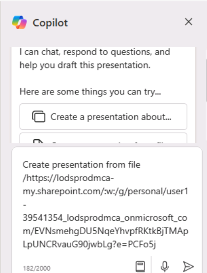
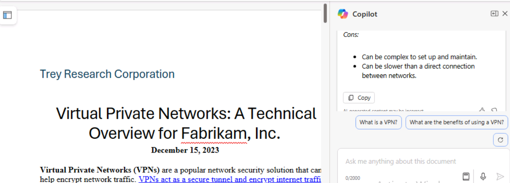
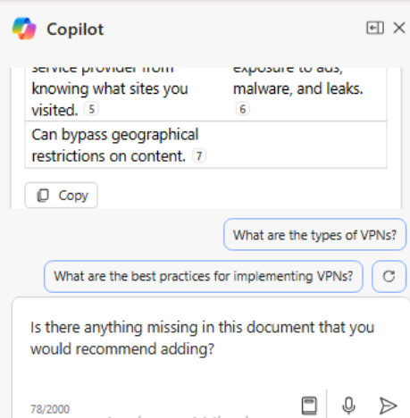

**实验室 03：为您的员工赋能 – Copilot-IT**

**目的：**

适用于 Microsoft 365 的 Copilot 充当 AI
驱动的写作助手，可理解上下文、建议短语并帮助生成内容，所有这些都可以提高您的工作质量。在本实验中，您将使用：

- Microsoft Copilot 汇总产品规格中的信息并创建项目计划来实施该产品。

- PowerPoint 中的 Copilot 根据您创建的项目计划创建演示文稿。

- Word 中的 Copilot 修改技术规范报告。

**练习 \#1：使用 Microsoft Copilot 创建项目计划**

借助 Microsoft，Copilot 无缝集成到 Microsoft 365 中，并为 IT
专业人员提供了一个强大的平台，以增强团队合作、共享见解并加速 IT
生态系统中的问题解决。它使 IT
专业人员能够即时连接、共享信息并有效地协调工作。

作为 Adatum Corporation 的 IT 总监，您一直在查看 Contoso CipherGuard
Sentinel X7
网络安全产品的产品规格报告。您计划安装此产品，它提供的高级安全保护远远超出
Adatum 目前所拥有的任何产品。

在本练习中，您将在必应中使用 Microsoft Copilot

- 分析您计划安装的新网络安全产品的产品规格报告。

- 使用产品规格报告中的信息更新项目计划。

**注意：**在本练习结束时，您必须将项目计划保存到 OneDrive
帐户。下一个练习将使用此文件。

1.  如果您在 Microsoft Edge 浏览器中打开了 Microsoft 365
    选项卡，请立即选择它; 否则，请打开一个新选项卡并输入以下
    URL： +++[https://www.office.com+++](https://www.office.com+++/) 以转到
    **Microsoft 365** 主页。

**注意：**您需要使用右侧**“资源”选项卡**下提供的 **Microsoft 365
凭据**登录（如果出现提示）。

2.  打开 **OneDrive**。浏览到 **C：\LabFiles** 文件夹，选择 **Contoso
    CipherGuard Product Specification report.docx** 的副本并将其上传到
    **OneDrive**。

**注意：**如果您已经上传了所有文档的副本（您将按照**实验室 0**
中的说明从 **C：\LabFiles** 进行此动手实验会话），则可以跳过此步骤。

3.  打开并关闭 **Contoso CipherGuard Product Specification report.docx**
    文件（已上传到 **OneDrive**），将其放入最近使用的 （MRU） 文件列表中

4.  在 **Microsoft Edge** 中，输入以下 URL 导航到 Microsoft
    Bing： +++[https://bing.com+++](https://github.com/technofocus-pte/m365cpltdeplextdepth/blob/m365cpltdeplextdepth-Dec2K24/Instructions/Lab%2003/media/image15.png)。

5.  在 **Microsoft Bing 主页**上，在页面顶部显示的选项卡列表中，选择
    **Copilot**。这样做将打开 **Microsoft Copilot**。

**注意：**
如果您在页面顶部没有看到标签页列表，请按照以下步骤查看标签页列表。

- 确保您已使用 **Microsoft 365 凭据**（位于 **Resources** （资源）
  选项卡下） 登录。

- 启用选项 **Show menu bar** （以红色高亮显示）

6.  现在选择 **Copilot**。这样做将打开 Microsoft Copilot。

7.  在 **Copilot** 页面上，在页面顶部的 **Work/Web** 切换开关中，选择
    **Work**。

8.  默认情况下，“**Work**”选项会限制 Copilot 对您的 Microsoft 365
    组织数据的访问权限。但是，由于您还希望 Copilot
    访问有关安装公司网络安全产品的公共 Web 指南，因此您必须启用 **Web
    内容**插件。为此，在页面底部的提示字段中，您应该注意到两个图标 -
    回形针图标（用于附加文件）和堆叠块图标。后一个图标是 Plugins 图标。

9.  选择此 **Plugins** 图标并启用 **Web 内容**插件。

10. 您现在可以使用 Copilot。输入以下提示，该提示指示 Copilot 通过 **Web
    内容**插件访问 Microsoft Copilot 的公共 Web
    数据，然后选择提示字段下角的 “**Submit**” 箭头：

++**I'm the Director of IT at Adatum Corporation. Create a project plan
for installing a new network security product into a corporate network.
Base this plan on IT industry guidelines for installing network security
products**.++

11. 查看 Copilot 创建的项目计划。

12. 您不满意它包含它应该包含的所有领域。输入以下提示，让它通过包含您特别感兴趣的区域来修改其计划。如果此提示中包含的任何区域已在
    Copilot 的上一个响应中，请从此提示中删除它们，以便 Copilot
    不会复制它们：

++**While that was a good start, I feel like it's missing important
areas. Please add the following items to the existing list: testing and
QA, training, communication, document and reporting, stakeholder
analysis, project timeline, and risk assessment and mitigation**.++

13. 查看修改后的项目计划。您对涵盖的主题的广度感到满意，因此现在您希望
    Copilot 使用 Contoso CipherGuard Sentinel X7
    安全产品的产品规格中的信息更新计划。输入以下提示，但不要提交，因为您必须先在下一步中将文件链接到提示：

++**This version looks better. Please review the attached file, which is
a product specification for the Contoso CipherGuard Sentinel X7 security
product, and update your project plan with information from this product
spec**.++

14. 在提示字段中，在提示后输入一个空格，然后键入正斜杠
    （/）。您必须在正斜杠之前输入空格，以便 Copilot
    将其识别为将某些内容附加到提示符的请求。下一步取决于 Copilot
    是否打开一个窗口供您选择文件：

    - 如果 Copilot 在您输入正斜杠 （/） 后打开一个窗口，请选择 “文件”
      选项卡。这样做会显示 MRU 文件的列表。选择 **Contoso CipherGuard
      Product Specification** 文件，然后选择 **Submit** 图标。

- 如果 Copilot 在您输入正斜杠 （/） 后未执行任何作，则必须复制并粘贴指向
  **Contoso CipherGuard Product Specification**
  文件的链接。为此，请在您的 OneDrive 帐户中找到该文件，在 **Word**
  中打开它，选择 Word 功能区上方显示的
  “**Share**”按钮，在出现的下拉菜单中选择 “**Copy link**”
  ，然后返回此提示字段，粘贴正斜杠后面的链接，然后选择 “**Submit**”
  图标。

**注意：**如果 Copilot
无法直接访问或查看文档，请注销已登录用户并再次登录，然后再次从**步骤 9**
继续。

**注意：**如果您无法查看和引用 **Contoso CipherGuard Product
Specification**
文档，请继续进行下一个练习。项目计划文档可供您继续执行剩余的实验室活动。

15. 查看 Copilot 如何将产品规格中的功能插入到项目计划中。

16. 虽然这看起来不错，但您觉得项目计划缺少具体细节。要解决此问题，请输入以下提示：

++**We're almost there. Please break down each item on the report into
multiple detailed steps**.++

17. 查看结果。

18. 现在，项目计划已创建，您必须将其保存到 Word
    文档中。**您将在下一个练习中使用此项目计划文档**。在 Copilot
    最终响应的底部，选择 “Copy ”按钮以复制内容。

**注意：**您将看到一个 **Edit in Pages**
按钮，该按钮提供了更多功能并促进了团队协作。在本练习中，我们不会使用
**Edit in Pages**。实验室 \#06
中包括一个单独的实验室练习。 

在浏览器中打开一个空白的 **Word** 文档 Word 文档并粘贴响应。

粘贴复制的内容后，您将看到 **Paste options** 上下文菜单。您可以使用
**Keep Source
formatting**。 

19. 单击左上角的文件名字段（如屏幕截图所示），然后在 **OneDrive**
    中将文件重命名为 +++Contoso CipherGuard 项目
    plan.docx+++。您将在下一个练习中使用此文件。

**练习 \#2：在 PowerPoint 中使用 Copilot 创建项目计划演示文稿**

PowerPoint 中的 Copilot 充当智能协作者，在 IT
专业人员制作演示文稿时提供实时建议和增强功能，以便：

- 向他们的团队或管理层展示他们的想法或提案。

- 培训新员工或向客户演示新软件或硬件。

- 向非技术受众（如利益相关者或投资者）解释复杂的技术概念。

- 向潜在客户展示他们的工作或推广他们的服务。

使用 PowerPoint 中的 Copilot，您可以从现有 Word 文档创建演示文稿。当您在
PowerPoint 中为 Copilot 提供指向 Word
文档的链接时，它可以生成幻灯片、应用布局并为您选择主题。

在本练习中，您将使用 PowerPoint 中的 Copilot
根据您在上一个练习中创建的项目计划创建幻灯片演示文稿。您希望使用此演示文稿向
IT 员工解释项目计划，并最终向公司管理层解释项目计划。

**注意：**如果您完成了前面的练习并创建了 **Contoso CipherGuard project
plan.docx** 文件，请确保将其保存到您的 OneDrive
帐户并继续下一步。但是，如果您在前面的练习中无法创建此项目计划，请上传文档
**Contoso CipherGuard project plan.docx** 的副本 C：\LabFiles 中可用。

1.  如果您在 Edge 浏览器中打开了 Microsoft 365
    选项卡，请立即选择它;否则，请打开一个新选项卡并输入以下
    URL：+++[https://www.office.com+++](https://github.com/technofocus-pte/m365cpltdeplextdepth/blob/m365cpltdeplextdepth-Dec2K24/Instructions/Lab%2003/media/image22.png) 以转到
    **Microsoft 365** 主页。

2.  打开并关闭 文件 **Contoso CipherGuard project plan.docx** （已保存到
    **OneDrive**），以将其放入最近使用的 （MRU） 文件列表中

3.  在 **Microsoft 365** 导航窗格中，选择 **PowerPoint**。在 PowerPoint
    中，打开一个新的空白演示文稿。

4.  选择 **Copilot** 图标（以红色突出显示，如屏幕截图所示）。在显示的
    **Copilot** 窗格中，有几个预定义的提示可供您选择。

5.  选择 **Create presentation from file** 提示。

6.  在 **Copilot** 窗格底部的提示字段中，Copilot
    会自动输入文本：**Create presentation from file /**。正斜杠是通用的
    Copilot 指示器，用于输入文件的链接。在这种情况下，它会触发 Copilot
    打开一个 **Suggestions**窗口，其中显示最近使用的三个文件。

    - 如果您的文件显示在此处，请立即选择它并继续下一步。

    - 如果该文件不是显示的三个文件之一，请选择 **Suggestions** （建议）
      窗口右上角的向右箭头 （\>） 以查看展开的 MRU
      文件列表。如果文件显示在此处，请立即选择它并继续下一步。

    - 如果您在展开的 MRU
      列表中没有看到您的文件，则必须复制报告的链接并将其粘贴到提示字段中。为此，请执行以下作：

a\. 选择 **Microsoft 365** 浏览器选项卡，然后在导航窗格中选择 **Word**。

b\. 在 **Word** 主页的最近打开的文件列表中，选择报表以在 Word 中打开它。

c\. 在 Word 的报表中，在功能区上方的最右侧，选择 “**Share**”
按钮。在显示的下拉菜单中，选择 **Copy Link**。等待 **Link copied**
（链接已复制） 窗口出现，这是您确保文件的链接已复制到剪贴板的保证。

d\. 切换到 **PowerPoint** 选项卡，在 **Copilot**
窗格的底部，提示字段应仍显示 “**Create presentation from file /**”
。将光标置于正斜杠 （**/**） 之后，然后粘贴到 （**Ctrl+V**）
报表的链接。

7.  请注意文件在提示字段中的显示方式。选择提示字段中的 **Send**
    图标。此提示触发 Copilot
    根据文档创建幻灯片演示文稿。在此过程中，它首先显示演示文稿的大纲。然后，它显示一个单独的窗口，其中显示了它根据文档对演示文稿所做的一些更改的项目符号列表。

8.  您现在可以自由地查看幻灯片并进行任何必要的更新。请特别注意 Copilot
    根据文档所做的更改。您可以使用 **Designer** 工具调整布局

9.  您注意到，问答 （Q&A）
    会话的末尾没有幻灯片。要更正此疏忽，请输入以下提示：

+++Add a Q&A slide at the very end of the presentation with an
appropriate image.+++

10. 查看已创建的新幻灯片。您不喜欢 Copilot
    用于此幻灯片的图像，因此输入以下提示，要求 Copilot 更改图像：

+++I don't like the image you used on the Q&A slide. Please replace it
with a different image.+++

11. 您收到了什么回复？有时 Copilot 没有替换图像，它会返回以下消息。

**注意：**Copilot 可能会显示一些异常（请记住，Copilot
仍在进行中），如上所示。

12. 请尝试改写提示或使用建议的提示，如下所示。

13. 选择命令 **Add a slide about** 并在演示文稿的末尾附加以下
    +++Q&A+（如屏幕截图所示）

14. 单击 Send 以检查会发生什么。Copilot 已按照说明添加了 Q&A 幻灯片。

15. 现在尝试使用另一个提示：

**Add a slide about** what the audience may ask about the presentation.

16. 完成最终演示后，您可以保存以备将来参考或放弃此演示文稿

17. 无论处理 Q&A
    幻灯片的最后几个步骤如何，您都决定继续尝试最后一件事。在审阅演示文稿时，由于主题的技术性质，您决定要将演示文稿的主题更改为更合适的主题。输入以下提示：

+++Change the theme of this presentation to something more technical+++ 

18. 请注意 Copilot 的回应。

此方案是需要记住提示最佳实践的情况之一：**了解 Copilot
的限制**。在这种情况下，与其说是对限制的理解，不如说是对 Copilot
工作原理的理解。在这种情况下，Copilot 会将您指向现有的 PowerPoint
功能，而不是复制该功能的功能。

19. 虽然本模块中的其余训练练习不使用此演示文稿，但如果需要，您可以丢弃或保存它以备将来参考。

**练习 \#3：在 Word 中使用 Copilot 更新技术报告**

Word 中的 Copilot 可以帮助 IT
专业人员在创建文档时节省时间和精力。它可以帮助您生成内容、重写文本并提供有用的建议。凭借其
AI 驱动的写作辅助，Copilot 可以帮助您更高效地创建文档。

当您创建新文档或处理现有文档时，Copilot 可以以不同的方式为您提供帮助。

- 在新的空白文档中或当您想向现有文档添加内容时，您可以告诉 Copilot
  您要写什么，它会相应地生成内容。

- 在包含现有内容的文档中，Copilot
  可以帮助您转换内容。它可以重写所选内容，甚至可以将所选内容转换为表格。

在本练习中，您将在 Word 中使用 Copilot 来更新现有文档。您指示 Copilot
添加新文本、重写现有文本并将文本转换为表格。

1.  如果您在 Microsoft Edge 浏览器中打开了 Microsoft 365
    选项卡，请立即选择它;否则，请打开一个新选项卡并输入以下
    URL： +++[https://www.office.com/+++](https://github.com/technofocus-pte/m365cpltdeplextdepth/blob/m365cpltdeplextdepth-Dec2K24/Instructions/Lab%2003/media/image13.png) 以转到
    **Microsoft 365** 主页。

**注意：**您需要使用右侧**“资源”选项卡**下提供的 **Microsoft 365
凭据**登录（如果出现提示）。

2.  浏览到 **C：\LabFiles** 文件夹以选择 **Trey Research - VPN Technical
    Overview.docx** 的副本并将其上传到 **OneDrive**。

**注意：**如果您已经上传了所有文档的副本（您将按照**实验室 0**
中的说明从 **C：\LabFiles** 进行此动手实验会话），则可以跳过此步骤。

3.  打开并关闭文件 **Trey Research - VPN Technical Overview.docx**
    （已上传到 **OneDrive**） ，以将其放入最近使用的 （MRU）
    文件列表中。

4.  在 **Microsoft 365** 中，打开 **Microsoft Word**。

5.  打开 **Trey Research - VPN Technical Overview.docx** 文件。

6.  在 **Word** 功能区上，选择 **Copilot** 按钮以打开 Copilot 窗格。

7.  在 **Copilot** 窗格中，输入以下提示，然后选择箭头 （**Send**）
    图标：

+++Write a new section for this document about the types of VPNs.
Discuss the pros and cons of each type. This content is for a technical
audience, so please provide specific details+++

8.  Copilot 不会将新内容直接添加到文档中。它在 Copilot
    窗格的响应窗口中显示内容。但是，它确实在每个响应窗口的底部提供了一个
    **Copy** 按钮，因此请选择 **Copy**
    按钮将其内容复制到剪贴板。在查看文档时，您决定将内容粘贴到开始段落的下方。现在粘贴内容。

**提示：** 当您选择响应窗口的 “**Copy**” 按钮时，它会复制所有内容，包括
Copilot
的评论，这些评论是面向您的。这些类型的注释通常位于响应的开头和结尾。确保在将响应粘贴到文档中后删除这些注释。新内容的字体和字体大小可能与整个文档中使用的现有字体和大小不匹配。因此，您必须更改它们以匹配。

9.  进一步查看后，您注意到没有提到与 VPN
    使用相关的安全策略。此主题是要包含的关键区域，因此请输入以下提示：

+++Please write a new section for this document about security policies
related to VPN usage. This content is for a technical audience, so
please provide specific details.+++

10. 将此响应中的内容复制并粘贴到文档中。将其放在 **Risks and
    mitigations** （风险和缓解措施）
    部分之前，然后根据需要编辑内容。如有必要，请为标题为 **Security
    policies related to VPN usage** 的部分添加标题。

11. 在查看报告时，您还发现了一个您认为需要重写的内容区域。在 **Risks and
    mitigations** 部分中，第一项涵盖家庭和企业 VPN。您希望它仅处理企业
    VPN。但是，考虑到内容的编写方式，这似乎不是一个容易的解决方案。您决定让
    Copilot 为您重写内容。

**提示：** 要让 Copilot 重写内容，您必须首先突出显示您希望 Copilot
重写的内容。

12. 突出显示 **Risks and mitigation** （风险和缓解）
    部分的第一个项目符号中的内容，然后输入以下提示：

+++The highlighted content discusses the risks of using VPNs in both
home and enterprise networks. Remove the content related to home
networks and focus solely on the risks of VPNs in enterprise networks+++

13. 检查 Copilot
    的回复。有时这种重写功能不起作用。当它不起作用时，Copilot
    返回以下响应。如果出现这种情况，请复制并粘贴您的提示，然后重试（记住、迭代、迭代、迭代）。

14. 在对文档进行最终审阅后，您决定有关实施 VPN
    的利弊的部分在表格中看起来会更好，而不是作为项目符号列表。由于您突出显示了要重写的部分，因此您决定突出显示这两个部分。突出显示这两个部分，然后输入以下提示：

+++Please rewrite the highlighted content by placing it in a table.+++

15. 请注意 Copilot 的响应。

16. 将内容重新格式化为表与重写内容不同。您必须在提示中描述要包含在表中的内容部分，而不是突出显示要放置在表中的内容部分。这一次，请输入以下提示符：

+++Place the content from the Pros and Cons of implementing VPNs into a
table.+++

17. 请注意 Copilot
    的响应。它不会重写文档中的现有内容或将其替换为表格，而是在其响应中显示表格。您可以通过将表格复制并粘贴到文档中来替换内容。在响应中，选择
    **Copy** 按钮，然后在文档中突出显示 Pros 和 Cons
    部分并粘贴到表中。确保在表格之前添加一个部分标题，上面写着：**Pros
    and Cons of implementing
    VPNs**。您可能还需要更改表格内容的字体和字体大小，以匹配整个文档中使用的现有字体和大小。

18. 此时，您觉得文档已完成。但是，为了安全起见，您决定询问 Copilot
    是否认为该文件应包含任何其他信息。输入以下提示：

+++Is there anything missing in this document that you would recommend
adding?+++

19. 请注意 Copilot
    的响应。在我们的测试中，它告诉我们没有遗漏任何东西。请重试，查看
    Copilot 是否提供不同的响应。

20. 如果 Copilot
    建议您向文档添加更多内容，请创建一个提示，要求它这样做。然后，您可以将新内容复制并粘贴到文档中。

**总结：**

在本实验中，您探索了适用于 Microsoft 365 的 Copilot
如何通过以下方式提高您的工作质量

- 使用 Microsoft Copilot
  从产品规格文档中提炼关键信息，并制定实施产品的综合项目计划。

- 利用 PowerPoint 中的 Copilot
  根据您创建的项目计划设计演示文稿，确保它在视觉上具有吸引力并有效地传达计划的细节。

- 在 Word 中使用 Copilot
  来修订和增强技术规范报告，从而提高清晰度、连贯性和整体质量。
