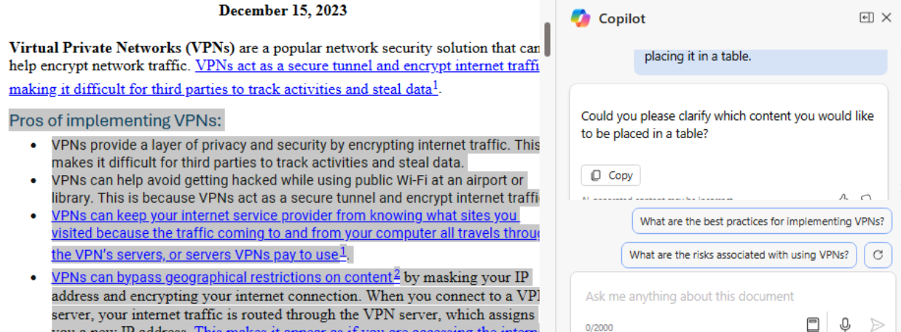

**Lab 03 : Responsabilisez votre personnel – Copilot-IT**

**Objectif :**

Copilot pour Microsoft 365 sert d'assistant d'écriture alimenté par l'IA
pour comprendre le contexte, suggérer des phrases et aider à générer du
contenu, ce qui peut améliorer la qualité de votre travail. Dans cet
atelier, vous allez utiliser :

- Microsoft Copilot pour résumer les informations dans une spécification
  de produit et créer un plan de projet pour mettre en œuvre le produit.

- Copilote dans PowerPoint pour créer une présentation basée sur le plan
  de projet que vous avez créé.

- Copilote dans Word pour modifier un rapport de spécification
  technique.

**Exercice \#1 : Créer un plan de projet à l'aide de Microsoft Copilot**

Avec Microsoft, Copilot s'intègre de manière transparente à Microsoft
365 et offre une plate-forme robuste aux professionnels de
l'informatique pour améliorer le travail d'équipe, partager des
informations et accélérer la résolution de problèmes au sein de
l'écosystème informatique. Il permet aux professionnels de
l'informatique de se connecter instantanément, de partager des
informations et de coordonner efficacement les efforts.

En tant que directeur informatique chez Adatum Corporation, vous avez
examiné un rapport de spécification de produit pour le produit de
sécurité réseau Contoso CipherGuard Sentinel X7. Vous prévoyez
d'installer ce produit, qui offre une protection de sécurité avancée qui
dépasse de loin tout ce qu'Adatum a aujourd'hui.

Dans cet exercice, vous allez utiliser Microsoft Copilot dans Bing

- Analysez un rapport de spécification de produit pour un nouveau
  produit de sécurité réseau que vous prévoyez d'installer.

- Mettez à jour le plan de projet avec les informations du rapport sur
  les spécifications du produit.

**Remarque** : À la fin de cet exercice, vous devez enregistrer votre
plan de projet dans votre compte OneDrive. L'exercice suivant utilise ce
fichier.

1.  Si vous avez un onglet Microsoft 365 ouvert dans votre navigateur
    Microsoft Edge, sélectionnez-le maintenant ; sinon, ouvrez un nouvel
    onglet et entrez l'URL suivante :
    +++[https://www.office.com+++++](https://www.office.com+++/) pour
    accéder à la page d'accueil de **Microsoft 365**.

**Remarque** : Vous devez vous connecter (si vous y êtes invité) à
l'aide des **Microsoft 365 Credentials** fournies sous l'onglet
**Resources** à droite.

2.  Ouvrez **OneDrive**. Accédez au dossier **C :\LabFiles** pour
    sélectionner et télécharger une copie de **Contoso CipherGuard
    Product Specification report.docx** sur **OneDrive**.

**Remarque** : Vous pouvez ignorer cette étape si vous avez déjà
téléchargé une copie de tous les documents (que vous utiliserez dans
cette session de laboratoire pratique à partir de **C :\LabFiles** comme
indiqué dans **le Lab 0**).

3.  Ouvrez et fermez le fichier **Contoso CipherGuard Product
    Specification report.docx** (que vous avez téléchargé sur
    **OneDrive**) pour l'obtenir dans votre liste de fichiers les plus
    récemment utilisés (MRU)

4.  Dans **Microsoft Edge**, accédez à Microsoft Bing en entrant l'URL
    suivante :
    +++[https://bing.com+++]

5.  Sur la **Microsoft Bing home page**, dans la liste des onglets qui
    s'affiche en haut de la page, sélectionnez **Copilot**. Cela ouvre
    **Microsoft Copilot**.

**Remarque :** Si vous ne voyez pas la liste des onglets en haut de la
page, veuillez suivre les étapes ci-dessous pour afficher la liste des
onglets.

- Assurez-vous d'être connecté à l'aide des **Microsoft 365
  Credentials** (disponibles sous l'onglet **Resources**).

- Activez l'option Afficher la **Show menu bar** (en surbrillance rouge)

6.  Sélectionnez maintenant **Copilot**. Cela ouvre Microsoft Copilot.

7.  Sur la page **Copilot**, dans le commutateur à bascule **Work/Web**
    en haut de la page, sélectionnez **Work**.

8.  Par défaut, l'option **Work** limite la portée de Copilot à vos
    données organisationnelles Microsoft 365. Toutefois, puisque vous
    souhaitez également que Copilot accède aux directives Web publiques
    relatives à l'installation d'un produit de sécurité de réseau
    d'entreprise, vous devez activer le plug-in de **Web content**. Pour
    ce faire, dans le champ d'invite en bas de la page, vous devriez
    remarquer deux icônes - l'icône du trombone, qui sert à joindre des
    fichiers, et une icône de blocs empilés. Cette dernière icône est
    l'icône des plugins.

9.  Sélectionnez cette icône **Plugins** et activez le plugin de **Web
    content**.

10. Vous êtes maintenant prêt à utiliser Copilot. Entrez l'invite
    suivante, qui indique à Copilot d'accéder aux données Web publiques
    via le plug-in de **Web content** à Microsoft Copilot, puis
    sélectionnez la flèche **Submit** dans le coin inférieur du champ
    d'invite :

++**I'm the Director of IT at Adatum Corporation. Create a project plan
for installing a new network security product into a corporate network.
Base this plan on IT industry guidelines for installing network security
products**.++

11. Passez en revue le plan de projet créé par Copilot.

12. Vous n'êtes pas satisfait qu'il englobe tous les domaines qu'il
    devrait. Entrez dans l'invite suivante pour qu'il modifie son plan
    en y incluant des secteurs qui vous intéressent particulièrement. Si
    l'une des zones incluses dans cette invite figure déjà dans la
    réponse précédente de Copilot, supprimez-la de cette invite afin que
    Copilot ne la duplique pas :

++**While that was a good start, I feel like it's missing important
areas. Please add the following items to the existing list: testing and
QA, training, communication, document and reporting, stakeholder
analysis, project timeline, and risk assessment and mitigation**.++

13. Examinez le plan de projet modifié. Vous êtes satisfait de l'étendue
    des sujets abordés, c'est pourquoi vous souhaitez maintenant que
    Copilot mette à jour le plan avec les informations de la
    spécification du produit de sécurité Contoso CipherGuard Sentinel
    X7. Entrez l'invite suivante, mais ne l'envoyez pas encore, car vous
    devez d'abord lier le fichier à l'invite à l'étape suivante :

++**This version looks better. Please review the attached file, which is
a product specification for the Contoso CipherGuard Sentinel X7 security
product, and update your project plan with information from this product
spec**.++

14. Dans le champ de l'invite, entrez un espace après l'invite, puis
    tapez une barre oblique (/). Vous devez entrer l'espace avant la
    barre oblique afin que Copilot le reconnaisse comme une demande
    d'attachement à l'invite. L'étape suivante dépend de l'ouverture ou
    non d'une fenêtre par Copilot pour vous permettre de sélectionner le
    fichier :

    - Si Copilot ouvre une fenêtre après avoir saisi la barre oblique
      (/), sélectionnez l'onglet **Files**. Cela affiche la liste des
      fichiers MRU. Sélectionnez le fichier de **Contoso CipherGuard
      Product Specification**, puis sélectionnez l' icône **Submit**.

- Si Copilot n'a rien fait après avoir entré la barre oblique (/), vous
  devez copier et coller le lien vers le fichier de **Contoso
  CipherGuard Product Specification**. Pour ce faire, recherchez le
  fichier dans votre compte OneDrive, ouvrez-le dans **Word**,
  sélectionnez le bouton **Share** qui apparaît au-dessus du ruban Word,
  sélectionnez **Copy Link** dans le menu déroulant qui s'affiche, puis
  de nouveau dans ce champ d'invite, collez le lien suivant la barre
  oblique et sélectionnez l'icône **Submit**.

**Remarque** : Si Copilot n'est pas en mesure d'accéder directement aux
documents ou de les consulter, déconnectez-vous de l'utilisateur
connecté et reconnectez-vous, puis revenez à l'**étape 9**.

**Remarque** : Si vous ne parvenez pas à afficher et à consulter le
document de **Contoso CipherGuard Product Specification**, passez à
l'exercice suivant. Le document de plan de projet est mis à votre
disposition pour que vous puissiez poursuivre les activités de
laboratoire restantes.

15. Examinez comment Copilot a inséré des fonctionnalités de la
    spécification du produit dans le plan de projet.

16. Bien que cela semble bien, vous avez l'impression que le plan de
    projet manque de détails spécifiques. Pour résoudre ce problème,
    entrez l'invite suivante :

++**We're almost there. Please break down each item on the report into
multiple detailed steps**.++

17. Examinez les résultats.

18. Maintenant que le plan de projet est créé, vous DEVEZ l'enregistrer
    dans un document Word. **Vous utiliserez ce document de plan de
    projet dans l'exercice suivant**. Au bas de la réponse finale de
    Copilot, sélectionnez le bouton **Copy** pour copier le contenu.

**Remarque** : Vous verrez un bouton **Edit in Pages** qui offre plus de
fonctionnalité et facilite la collaboration d'équipe. Nous n'utiliserons
pas **Edit in Pages** dans cet exercice. Un exercice de laboratoire
distinct est inclus dans le laboratoire #06. 

Ouvrez un document **Word** vierge dans un navigateur et collez la
réponse.

Une fois que vous collez le contenu copié, vous verrez le menu
contextuel **Paste options**. Vous pouvez utiliser **Keep Source
formatting**.

19. Cliquez sur le champ du nom de fichier en haut à gauche (comme
    illustré dans la capture d'écran) et renommez le fichier en
    +++Contoso CipherGuard project plan.docx+++ dans votre **OneDrive**.
    Vous utiliserez ce fichier dans l'exercice suivant.

**Exercice \#2 : Créer une présentation de plan de projet à l'aide de
Copilot dans PowerPoint**

Copilot dans PowerPoint sert de collaborateur intelligent, offrant des
suggestions et des améliorations en temps réel pendant que les
professionnels de l'informatique élaborent leurs présentations pour :

- Présenter leurs idées ou propositions à leur équipe ou à leur
  direction.

- Former de nouveaux employés ou faire la démonstration de nouveaux
  logiciels ou matériels aux clients.

- Expliquer des concepts techniques complexes à des publics non
  techniques, tels que des parties prenantes ou des investisseurs.

- Présenter leur travail ou promouvoir leurs services auprès de clients
  potentiels.

Avec Copilot dans PowerPoint, vous pouvez créer une présentation à
partir d'un document Word existant. Lorsque vous fournissez à Copilot
dans PowerPoint le lien vers votre document Word, il peut générer des
diapositives, appliquer des mises en page et choisir un thème pour vous.

Dans cet exercice, vous allez utiliser Copilot dans PowerPoint pour
créer une présentation de diapositives basée sur le plan de projet que
vous avez créé dans l'exercice précédent. Vous souhaitez utiliser cette
présentation pour expliquer le plan de projet à votre personnel
informatique et, en fin de compte, à la direction de l'entreprise.

**Remarque** : Si vous avez terminé l'exercice précédent et créé un
fichier **Contoso CipherGuard project plan.docx**, assurez-vous de
l'avoir enregistré dans votre compte OneDrive et de passer à l'étape
suivante. Toutefois, si vous n'avez pas été en mesure de créer ce plan
de projet lors de l'exercice précédent, téléchargez une copie du
document **Contoso CipherGuard project plan.docx** disponible dans
**C :\LabFiles**.

1.  Si vous avez un onglet Microsoft 365 ouvert dans votre navigateur
    Edge, sélectionnez-le maintenant ; sinon, ouvrez un nouvel onglet et
    entrez l'URL suivante :
    +++[https://www.office.com+++++]
    pour accéder à la page d'accueil de **Microsoft 365**.

2.  Ouvrez et fermez le fichier **Contoso CipherGuard project
    plan.docx** (que vous avez enregistré sur **OneDrive**) pour
    l'obtenir dans votre liste de fichiers les plus récemment utilisés
    (MRU)

3.  Dans le volet de navigation **Microsoft 365**, sélectionnez
    **PowerPoint**. Dans PowerPoint, ouvrez une nouvelle présentation
    vierge.

4.  Sélectionnez l'icône du **Copilot** (en surbrillance rouge comme
    indiqué dans la capture d'écran). Dans le volet **Copilot** qui
    s'affiche, vous pouvez choisir parmi plusieurs invites prédéfinies.

5.  Sélectionnez l’invite **Create presentation from file**.

6.  Dans le champ d'invite situé en bas du volet **Copilot**, Copilot
    saisit automatiquement le texte : **Create presentation from file
    /**. La barre oblique est l'indicateur universel du Copilot pour
    entrer un lien vers un fichier. Dans ce cas, il déclenche
    l'ouverture d’une fenêtre de **Suggestions** par Copilot qui affiche
    trois des derniers fichiers utilisés.

    - Si votre fichier apparaît ici, sélectionnez-le maintenant et
      passez à l'étape suivante.

    - Si le fichier n'est pas l'un des trois fichiers affichés,
      sélectionnez la flèche droite (**\>**) dans le coin supérieur
      droit de la fenêtre **Suggestions** pour afficher une liste de
      fichiers MRU développée. Si le fichier apparaît ici,
      sélectionnez-le maintenant et passez à l'étape suivante.

    - Si vous ne voyez pas votre fichier dans la liste MRU développée,
      vous devez copier le lien vers le rapport et le coller dans le
      champ d'invite. Pour ce faire :

a\. Sélectionnez l'onglet du navigateur **Microsoft 365** et
sélectionnez **Word** dans le volet de navigation.

b\. Dans la page d'accueil de **Word**, dans la liste des fichiers
récents, sélectionnez le rapport pour l'ouvrir dans Word.

c\. Dans le rapport dans Word, à l'extrême droite au-dessus du ruban,
sélectionnez le bouton **Share**. Dans le menu déroulant qui s'affiche,
sélectionnez **Copy link**. Attendez que la fenêtre **Link copied**
s'affiche, ce qui vous garantit que le lien vers le fichier est copié
dans votre presse-papiers.

d\. Basculez vers votre onglet **PowerPoint** et, en bas du volet
**Copilot**, le champ d'invite doit toujours afficher **Create
presentation from file /**. Placez votre curseur après la barre oblique
(**/**), puis collez (**Ctrl+V**) le lien vers le rapport.

7.  Notez comment le fichier apparaît dans le champ d'invite.
    Sélectionnez l’icône **Send** dans le champ d'invite. Cette invite a
    incité Copilot à créer une présentation de diapositives basée sur le
    document. Ce faisant, il a d'abord affiché les grandes lignes de la
    présentation. Ensuite, il a affiché une fenêtre distincte montrant
    une liste à puces de certaines des modifications qu'il a apportées à
    la présentation en fonction du document.

8.  Vous êtes maintenant libre d'examiner les diapositives et
    d'effectuer les mises à jour nécessaires. Portez une attention
    particulière aux modifications apportées par le Copilot sur la base
    du document. Vous pouvez utiliser l'outil **Designer** pour ajuster
    les mises en page

9.  Vous remarquez qu'il n'y a pas de diapositive à la fin pour une
    session de questions-réponses (Q&R). Pour corriger cet oubli, entrez
    l'invite suivante :

+++Add a Q&A slide at the very end of the presentation with an
appropriate image.+++

10. Examinez la nouvelle diapositive qui a été créée. Si vous n'aimez
    pas l'image que Copilot a utilisée pour cette diapositive, entrez
    l'invite suivante pour demander à Copilot de modifier l'image :

+++I don't like the image you used on the Q&A slide. Please replace it
with a different image.+++

11. Quelle réponse avez-vous reçue ? Parfois, Copilot ne remplaçait pas
    l'image et renvoyait le message suivant.

**Remarque :** Copilot peut afficher une exception (rappelez-vous que
Copilot est toujours un travail en cours) comme celle ci-dessus.

12. Veuillez essayer de reformuler l'invite ou d'utiliser les invites
    suggérées comme celle ci-dessous.

13. Sélectionnez la commande **Add a slide about** et ajoutez +++Q&A at
    the very end of the presentation+++ (comme indiqué dans la capture
    d'écran)

14. Cliquez sur Envoyer pour vérifier ce qui se passe. Copilot a ajouté
    une diapositive de questions-réponses comme indiqué.

15. Essayez maintenant avec une autre invite :

**Add a slide about** ce que le public peut demander à propos de la
présentation.

16. Une fois que vous avez terminé la présentation finale, vous pouvez
    l'enregistrer pour référence future ou supprimer cette présentation

17. Quelle que soit la façon dont les dernières étapes se sont déroulées
    pour traiter la diapositive de questions-réponses, vous décidez
    d'aller de l'avant et d'essayer une dernière chose. Lors de la
    révision de la présentation, vous décidez de changer le thème de la
    présentation pour quelque chose de plus approprié en raison de la
    nature technique du sujet. Entrez l'invite suivante :

+++Change the theme of this presentation to something more technical+++

18. Notez la réponse de Copilot.

Ce scénario est l'une de ces situations où il faut se rappeler la
meilleure pratique en matière d'invites : **Understand Copilot's
limitations**. Dans ce cas, il ne s'agit pas tant de comprendre une
limitation que de comprendre comment Copilot fonctionne. Dans ce cas,
Copilot vous dirige vers une fonctionnalité PowerPoint existante plutôt
que de dupliquer ce que fait cette fonctionnalité.

19. Bien que les autres exercices de formation de ce module n'utilisent
    pas cette présentation, vous pouvez soit la supprimer, soit
    l'enregistrer si vous le souhaitez pour référence future.

**Exercice \#3 : Mettre à jour un rapport technique à l'aide de Copilot
dans Word**

Copilot dans Word peut aider les professionnels de l'informatique à
économiser du temps et des efforts lors de la création de documents. Il
peut vous aider à générer du contenu, à réécrire du texte et à fournir
des suggestions utiles. Grâce à son aide à la rédaction alimentée par
l'IA, Copilot peut vous aider à créer des documents de manière plus
efficace.

Lorsque vous créez un nouveau document ou que vous travaillez sur un
document existant, Copilot peut vous aider de différentes manières.

- Dans un nouveau document vierge ou lorsque vous souhaitez ajouter du
  contenu à un document existant, vous pouvez indiquer à Copilot sur
  quoi vous voulez écrire, et il génère le contenu en conséquence.

- Dans un document avec du contenu existant, Copilot peut vous aider à
  transformer le contenu. Il peut réécrire le contenu sélectionné, ou
  même transformer le contenu sélectionné en tableau.

Dans cet exercice, vous allez utiliser Copilot dans Word pour mettre à
jour un document existant. Vous demandez à Copilot d'ajouter du texte,
de réécrire du texte existant et de transformer le texte en tableau.

1.  Si vous avez un onglet Microsoft 365 ouvert dans votre navigateur
    Microsoft Edge, sélectionnez-le maintenant ; sinon, ouvrez un nouvel
    onglet et entrez l'URL suivante :
    +++[https://www.office.com/+++++]
    pour accéder à la page d'accueil de **Microsoft 365**.

**Remarque** : Vous devez vous connecter (si vous y êtes invité) à
l'aide des **Microsoft 365 Credentials** fournies sous l'onglet
**Resources** à droite.

2.  Accédez au dossier **C :\LabFiles** pour sélectionner et télécharger
    une copie de **Trey Research - VPN Technical Overview.docx** sur
    **OneDrive**.

**Remarque** : Vous pouvez ignorer cette étape si vous avez déjà
téléchargé une copie de tous les documents (que vous utiliserez dans
cette session de laboratoire pratique à partir de **C :\LabFiles** comme
indiqué dans **le Lab 0**).

3.  Ouvrez et fermez le fichier **Trey Research - VPN Technical
    Overview.docx** (que vous avez téléchargé sur **OneDrive**) pour
    l'obtenir dans votre liste de fichiers les plus récemment utilisés
    (MRU).

4.  Dans **Microsoft 365**, ouvrez **Microsoft Word**.

5.  Ouvrez le fichier **Trey Research - VPN Technical Overview.docx**.

6.  Sur le ruban **Word**, sélectionnez le bouton **Copilot** pour
    ouvrir le volet Copilot.

7.  Dans le volet **Copilot**, entrez l'invite suivante, puis
    sélectionnez l'icône de flèche (**Send**) :

+++Write a new section for this document about the types of VPNs.
Discuss the pros and cons of each type. This content is for a technical
audience, so please provide specific details+++

8.  Copilot n'ajoute pas de nouveau contenu directement dans un
    document. Il affiche le contenu dans une fenêtre de réponse dans le
    volet Copilot. Cependant, il fournit un bouton **Copy** en bas de
    chaque fenêtre de réponse, alors sélectionnez le bouton **Copy**
    pour copier son contenu dans votre presse-papiers. En regardant le
    document, vous décidez de coller le contenu sous le paragraphe
    d'ouverture. Collez le contenu maintenant.

**Astuce** : Lorsque vous sélectionnez le bouton **Copy** pour une
fenêtre de réponse, il copie TOUT le contenu, y compris les commentaires
de Copilot qui vous sont destinés. Ces types de commentaires se trouvent
généralement au début et à la fin de la réponse. Veillez à supprimer ces
commentaires une fois que vous avez collé la réponse dans votre
document. Il est probable que la police et la taille du nouveau contenu
ne correspondent pas à la police existante et à la taille utilisée dans
l'ensemble du document. En tant que tel, vous devez les modifier pour
qu'ils correspondent.

9.  Après un examen plus approfondi, vous remarquerez qu'il n'y a aucune
    mention de politiques de sécurité liées à l'utilisation du VPN. Il
    s'agit d'une zone clé que vous souhaitez inclure, alors entrez
    l'invite suivante :

+++Please write a new section for this document about security policies
related to VPN usage. This content is for a technical audience, so
please provide specific details.+++

10. Copiez et collez le contenu de cette réponse dans le document.
    Placez-le juste avant la section **Risks and mitigations**, puis
    modifiez le contenu si nécessaire. Si nécessaire, ajoutez un titre
    pour cette section intitulé Politiques **Security policies related
    to VPN usage**.

11. Lorsque vous avez examiné le rapport, vous avez également identifié
    une partie du contenu qui, selon vous, devait être réécrite. Dans la
    section sur **Risks and mitigations**, le premier point couvre à la
    fois les VPN domestiques et d'entreprise. Vous voulez qu'il ne
    s'adresse qu'aux VPN d'entreprise. Cependant, compte tenu de la
    manière dont le contenu est écrit, cela ne semble pas être une
    solution facile. Vous décidez de demander à Copilot de réécrire le
    contenu pour vous.

**Astuce** : Pour que Copilot réécrive du contenu, vous devez d'abord
mettre en surbrillance le contenu que vous souhaitez que Copilot
réécrive.

12. Mettez le contenu en surbrillance dans la première puce de la
    section **Risks and mitigations**, puis entrez l'invite suivante :

+++The highlighted content discusses the risks of using VPNs in both
home and enterprise networks. Remove the content related to home
networks and focus solely on the risks of VPNs in enterprise networks+++

13. Vérifiez la réponse de Copilot. Parfois, cette fonctionnalité de
    réécriture ne fonctionnait pas. Lorsque cela n'a pas fonctionné,
    Copilot a renvoyé la réponse suivante. Si cette situation se
    produit, copiez et collez votre invite et réessayez-la (n'oubliez
    pas, itérez, itérez, itérez).

14. Après avoir effectué un examen final du document, vous décidez que
    les sections sur les avantages et les inconvénients de la mise en
    œuvre des VPN s'afficheraient mieux dans un tableau plutôt que sous
    forme de listes à puces. Puisque vous avez mis en évidence une
    section à réécrire, vous décidez de mettre en évidence ces deux
    sections. Mettez en surbrillance les deux sections, puis entrez
    l'invite suivante :

+++Please rewrite the highlighted content by placing it in a table.+++

15. Notez la réponse de Copilot.

16. La reformatage du contenu dans un tableau est différente de la
    réécriture du contenu. Au lieu de mettre en surbrillance le contenu
    que vous souhaitez placer dans un tableau, vous devez décrire dans
    votre invite les sections de contenu que vous souhaitez inclure dans
    le tableau. Cette fois, entrez l'invite suivante :

+++Place the content from the Pros and Cons of implementing VPNs into a
table.+++

17. Notez la réponse de Copilot. Au lieu de réécrire ou de remplacer le
    contenu existant du document par un tableau, il affiche le tableau
    dans sa réponse. C'est à vous de remplacer le contenu en copiant et
    collant le tableau dans le document. Dans la réponse, sélectionnez
    le bouton **Copy**, puis dans le document, mettez en surbrillance
    les sections Avantages et Inconvénients et collez-les dans le
    tableau. Assurez-vous d'ajouter un titre de section avant le tableau
    qui dit : **Pros and Cons of implementing VPNs.** Il est probable
    que vous deviez également modifier la police et la taille du contenu
    du tableau pour qu'elles correspondent à la police existante et à la
    taille utilisée dans l'ensemble du document.

18. À ce stade, vous estimez que le document est complet. Cependant,
    pour jouer la sécurité, vous décidez de demander à Copilot s'il
    pense que le document devrait inclure d'autres informations. Entrez
    l'invite suivante :

+++Is there anything missing in this document that you would recommend
adding?+++

19. Notez la réponse de Copilot. Lors de nos tests, il nous a dit que
    rien ne manquait. Essayez à nouveau de voir si Copilot fournit une
    réponse différente.

20. Si Copilot vous a recommandé d'ajouter plus de contenu à votre
    document, créez une invite qui lui demande de le faire. Vous pouvez
    ensuite copier et coller le nouveau contenu dans votre document.

**Résumé :**

Dans cet atelier, vous avez découvert comment Copilot pour Microsoft 365
améliore la qualité de votre travail en

- Utilisation de Microsoft Copilot pour distiller les informations clés
  d'un document de spécification de produit et élaborer un plan de
  projet complet pour la mise en œuvre du produit.

- Tirer parti de Copilot dans PowerPoint pour concevoir une présentation
  basée sur le plan de projet que vous avez créé, en vous assurant
  qu'elle est visuellement attrayante et qu'elle communique efficacement
  les détails du plan.

- Utilisation de Copilot dans Word pour réviser et améliorer un rapport
  de spécification technique, améliorant ainsi la clarté, la cohérence
  et la qualité globale.
