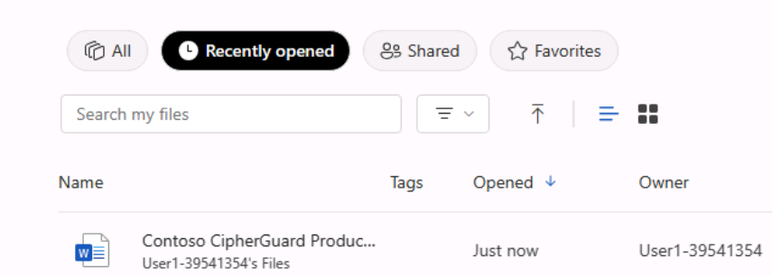
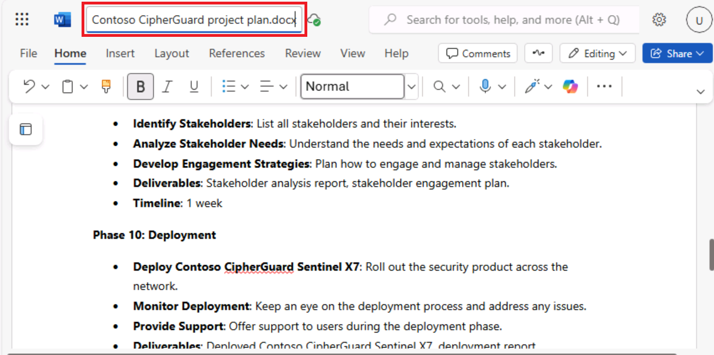

**Laboratório 03: Capacite sua força de trabalho - Copilot- TI**

**Objetivo:**

O Copilot para Microsoft 365 funciona como um assistente de redação com
tecnologia de IA que entende o contexto, sugere frases e ajuda a gerar
conteúdo, o que pode melhorar a qualidade do seu trabalho. Neste
laboratório, você usará:

- Microsoft Copilot para resumir as informações em uma especificação de
  produto e criar um plano de projeto para implementar o produto.

- Copilot no PowerPoint para criar uma apresentação com base no plano de
  projeto que você criou.

- Copilot no Word para modificar um relatório de especificação técnica.

**Exercício 1: Criar um plano de projeto usando o Microsoft Copilot**

O Microsoft Copilot integra-se perfeitamente ao Microsoft 365 e oferece
uma plataforma robusta para que os profissionais de TI aprimorem o
trabalho em equipe, compartilhem insights e acelerem a solução de
problemas no ecossistema de TI. Ele permite que os profissionais de TI
se conectem instantaneamente, compartilhem informações e coordenem
esforços com eficiência.

Como diretor de TI da Adatum Corporation, você está analisando um
relatório de especificação de produto para o produto de segurança de
rede Contoso CipherGuard Sentinel X7. Você planeja instalar esse
produto, que oferece uma proteção de segurança avançada que vai muito
além de tudo o que a Adatum tem hoje.

Neste exercício, você usará o Microsoft Copilot no Bing para:

- Analisar um relatório de especificação de produto para um novo produto
  de segurança de rede que você planeja instalar.

- Atualizar o plano do projeto com informações do relatório de
  especificações do produto.

**Observação**: Ao final deste exercício, você deve salvar o plano do
projeto na sua conta do OneDrive. O próximo exercício usará este
arquivo.

1.  Se você tiver uma guia do Microsoft 365 aberta no navegador
    Microsoft Edge, selecione-a agora; caso contrário, abra uma nova
    guia e digite o seguinte URL: +++<u>https://www.office.com+++</u> 
    para acessar a página inicial do **Microsoft 365**.

**Observação**: Você precisa fazer login (se solicitado) usando as
**Credenciais do Microsoft 365** fornecidas na guia **Resources** à
direita.

2.  Abra o **OneDrive**. Navegue até a pasta **C:\LabFiles** para
    selecionar e carregar uma cópia do **Contoso CipherGuard Product
    Specification report.docx** no **OneDrive**.

**Observação**: Você pode pular esta etapa se já tiver feito upload de
uma cópia de todos os documentos (que serão usados nesta sessão de
laboratório prático em **C:\LabFiles**, conforme instruído no
**Laboratório 0**).

3.  Abra e feche o arquivo **Contoso CipherGuard Product Specification
    report.docx** (que você carregou no **OneDrive**) para colocá-lo na
    sua lista de arquivos Most Recently Used (MRU) file list.

4.  No **Microsoft Edge**, navegue até o Microsoft Bing digitando a
    seguinte
    URL: +++[https://bing.com+++]

5.  Na **página inicial do Microsoft Bing**, na lista de guias que
    aparecem na parte superior da página, selecione **Copilot.** Ao
    fazer isso, o **Microsoft Copilot** será aberto.

**Observação:** Se você não vir a lista de guias na parte superior da
página, siga as etapas abaixo para visualizar a lista de guias.

- Verifique se você fez login usando as **credenciais do Microsoft 365**
  (disponíveis na guia **Resources**).

- Ative a opção **Show menu bar** (destacada em vermelho)

6.  Agora, selecione **Copilot.** Ao fazer isso, o **Microsoft Copilot**
    será aberto.

7.  Na página do **Copilot**, no botão de alternância **Work/Web** na
    parte superior da página, selecione **Work**.

8.  Por padrão, a opção **Work** limita o alcance do Copilot aos seus
    dados organizacionais do Microsoft 365. No entanto, como você também
    deseja que o Copilot acesse as diretrizes públicas da web sobre a
    instalação de um produto de segurança de rede corporativa, é
    necessário ativar o plug-in **Web content**. Para isso, no campo de
    prompt na parte inferior da página, você deve observar dois ícones:
    o ícone de clipe de papel, que serve para anexar arquivos, e um
    ícone de blocos empilhados. Esse último ícone é o ícone Plugins.

9.  Selecione o ícone **Plugins** e ative o plug-in **Web content**.

10. Agora você está pronto para usar o Copilot. Digite o prompt a
    seguir, que direciona o Copilot para acessar dados públicos da web
    por meio do plug-in **Web content** no Microsoft Copilot e, em
    seguida, selecione a seta **Submit** no canto inferior do campo de
    prompt:

**++I'm the Director of IT at Adatum Corporation. Create a project plan
for installing a new network security product into a corporate network.
Base this plan on IT industry guidelines for installing network security
products.++ **

11. Revise o plano de projeto que o Copilot criou.

12. Se você sente que o plano gerado pelo Copilot não abrange todas as
    áreas essenciais, você pode solicitar ajustes! Insira o seguinte
    prompt, pedindo ao Copilot para alterar seu plano e incluir áreas de
    interesse específico. Se alguma das áreas incluídas nesta
    solicitação já estiver na resposta anterior do Copilot remova essas
    áreas do prompt para evitar duplicações:

**++While that was a good start, I feel like it's missing important
areas. Please add the following items to the existing list: testing and
QA, training, communication, document and reporting, stakeholder
analysis, project timeline, and risk assessment and mitigation.++**

13. Revise o plano de projeto alterado. Você está satisfeito com a
    amplitude dos tópicos abordados, então agora você quer que o Copilot
    atualize o plano com informações da especificação do produto de
    segurança Contoso CipherGuard Sentinel X7. Digite o seguinte prompt,
    mas não o envie ainda, pois você deve primeiro vincular o arquivo ao
    prompt na próxima etapa:

**++This version looks better. Please review the attached file, which is
a product specification for the Contoso CipherGuard Sentinel X7 security
product, and update your project plan with information from this product
spec.++ **

14. No campo de prompt, insira um espaço após o prompt e, em seguida,
    digite uma barra (/). Você deve inserir o espaço antes da barra para
    que o Copilot reconheça que se trata de uma solicitação para anexar
    algo ao prompt. Seu próximo passo depende de Copilot abrir uma
    janela para você selecionar o arquivo:

    - Se o Copilot abrir uma janela após você inserir a barra (/), então
      selecione a aba **Files**. Ao fazer isso, será exibida a lista de
      arquivos MRU. Selecione o arquivo **Contoso CipherGuard Product
      Specification** e, em seguida, clique no ícone **Submit**.

- Se o Copilot não realizou nenhuma ação após você inserir a barra (/),
  então será necessário copiar e colar o link do arquivo **Contoso
  CipherGuard Product Specification**. Para fazer isso, localize o
  arquivo em sua conta do OneDrive, abra-o no **Word**, selecione o
  botão **Share** localizado acima da faixa de opções do Word, no menu
  suspenso, selecione **Copy link** e, em seguida, de volta a esse campo
  de prompt, cole o link após a barra e selecione o ícone **Submit**.

**Observação**: Se o Copilot não puder acessar ou revisar documentos
diretamente, saia do usuário conectado e entre novamente e, em seguida,
continue a partir da **etapa 9** mais uma vez.

**Observação**: Se você não conseguir visualizar e referenciar o
documento **Contoso CipherGuard Product Specification**, então prossiga
para o próximo exercício. O documento do plano de projeto está
disponível para que você continue com as próximas atividades do
laboratório.

15. Agora, revise como o Copilot inseriu as características do produto
    no plano de projeto.

16. Embora pareça bom, você acha que o plano do projeto carece de
    detalhes específicos. Para resolver esse problema, digite o seguinte
    prompt:

**++We're almost there. Please break down each item on the report into
multiple detailed steps.++**

17. Analise os resultados.

18. Agora que o plano do projeto foi criado, você DEVE salvá-lo em um
    documento do Word. **Você usará esse documento de plano de projeto
    no próximo exercício**. Na parte inferior da resposta final do
    Copilot, selecione o botão **Copy** para copiar o conteúdo.

**Observação**: Você verá um botão **Edit in Pages** que oferece mais
funcionalidades e facilita a colaboração da equipe. No entanto, não
usaremos o **Edit in Pages** neste exercício. Um exercício de
laboratório separado está incluído no Lab 06 para explorar essa
funcionalidade. 

Abra um documento do Word em branco em um navegador e cole a resposta.

Ao colar o conteúdo copiado, você verá o menu de contexto **Paste
options**. Você pode usar a opção **Keep Source formatting**.

19. Clique no campo de nome do arquivo no canto superior esquerdo
    (conforme mostrado na captura de tela) e renomeie o arquivo como
    +++Contoso CipherGuard project plan.docx+++ em seu **OneDrive**.
    Você usará esse arquivo no próximo exercício.

**Exercício 2: Criar uma apresentação de plano de projeto usando o
Copilot no PowerPoint**

O Copilot no PowerPoint atua como um colaborador inteligente, oferecendo
sugestões em tempo real e aperfeiçoamentos enquanto os profissionais de
TI criam suas apresentações para:

- Apresentar suas ideias ou propostas para sua equipe ou gerência.

- Treinar novos funcionários ou demonstrar novos softwares ou hardwares
  aos clientes.

- Explicar conceitos técnicos complexos para públicos não técnicos, como
  partes interessadas ou investidores.

- Exibir seu trabalho ou promover seus serviços para clientes em
  potencial.

Com o Copilot no PowerPoint, você pode criar uma apresentação a partir
de um documento existente do Word. Quando você fornece ao Copilot no
PowerPoint o link para o seu documento do Word, ele pode gerar slides,
aplicar layouts e escolher um tema para você.

Neste exercício, você usa o Copilot no PowerPoint para criar uma
apresentação de slides com base no plano de projeto que criou no
exercício anterior. Você deseja usar essa apresentação para explicar o
plano do projeto à sua equipe de TI e, por fim, à gerência corporativa.

**Observação**: Se você concluiu o exercício anterior e criou um arquivo
Contoso CipherGuard project plan.docx, certifique-se de que o salvou em
sua conta do OneDrive e prossiga para a próxima etapa. No entanto, se
você não conseguiu criar esse plano de projeto no exercício anterior,
carregue uma cópia do documento Contoso CipherGuard project plan.docx
disponível em C:\LabFiles.

1.  Se você tiver uma guia do Microsoft 365 aberta no navegador Edge,
    selecione-a agora; caso contrário, abra uma nova guia e digite a
    seguinte
    URL: +++[https://www.office.com+++] para acessar a página inicial do **Microsoft 365**.

2.  Abra e feche o arquivo **Contoso CipherGuard project plan.docx**
    (que você salvou no OneDrive) para colocá-lo na sua lista de
    arquivos Most Recently Used (MRU)

3.  No painel de navegação do **Microsoft 365**, selecione
    **PowerPoint**. No PowerPoint, abra uma nova apresentação em branco.

4.  Selecione o ícone do **Copilot** (destacado em vermelho, conforme
    mostrado na captura de tela). Na janela do **Copilot** que
    aparecerá, você verá vários prompts predefinidos disponíveis para
    escolha.

5.  Selecione o prompt **Create presentation from file**.

6.  No campo de prompt na parte inferior do painel do **Copilot**, o
    Copilot insere automaticamente o texto: **Criar apresentação a
    partir do arquivo /**. A barra é o indicador universal do Copilot
    para inserir um link para um arquivo. Nesse caso, ela aciona o
    Copilot para abrir uma janela **Suggestions** que exibe três dos
    arquivos usados mais recentemente.

    - Se o seu arquivo aparecer aqui, selecione-o agora e prossiga para
      a próxima etapa.

    - Se o arquivo não for um dos três que estão sendo exibidos,
      selecione a seta para a direita (\>) no canto superior direito da
      janela **Suggestions** para ver uma lista expandida de arquivos
      MRU. Se o arquivo aparecer nessa lista, selecione-o agora e
      prossiga para a próxima etapa.

    - Se você não visualizar seu arquivo na lista MRU expandida, será
      necessário copiar o link do relatório e colá-lo no campo de
      prompt. Para fazer isso:

a\. Selecione a guia do navegador do **Microsoft 365** no seu navegador
e clique em **Word** na barra de navegação.

b\. Na página inicial do **Word**, localize a lista de arquivos recentes
e abra o relatório.

c\. No relatório no Word, na extrema direita acima da faixa de opções,
selecione o botão **Share**. No menu suspenso, selecione **Copy Link**.
Aguarde até que a janela **Link copied** apareça—isso confirma que o
link foi copiado para sua área de transferência.

d\. Mude para a guia **PowerPoint** e, na parte inferior do painel
**Copilot**, o campo de prompt ainda deve estar exibindo **Create
presentation from file** /, posicione o cursor após a barra (/) e cole
(**Ctrl+V**) o link do relatório.

7.  Observe como o arquivo aparece no campo de prompt. Selecione o ícone
    **Send** no campo de prompt. Este prompt instruirá o Copilot a criar
    uma apresentação de slides baseada no documento. Primeiro, ele
    exibirá um esboço da apresentação e, em seguida, abrirá uma janela
    separada com uma lista de alterações feitas na apresentação, baseada
    no conteúdo do relatório**.**

8.  Agora você pode revisar os slides e fazer as atualizações
    necessárias. Preste especial atenção às mudanças que o Copilot
    realizou com base no documento. Você pode utilizar a ferramenta
    **Designer** para ajustar os layouts.

9.  Você percebe que não há um slide no final para uma sessão de
    Perguntas e Respostas (Q&A).

+++Add a Q&A slide at the very end of the presentation with an
appropriate image.+++ 

10. Revise o novo slide que foi criado. Você não gostou da imagem que o
    Copilot usou para esse slide, então digite o seguinte prompt
    solicitando ao Copilot para alterar a imagem:

+++I don't like the image you used on the Q&A slide. Please replace it
with a different image.+++ 

11. Qual foi a resposta que você recebeu? Às vezes, o Copilot não
    substituiu a imagem e retornou a seguinte mensagem:

**Observação:** O Copilot pode exibir alguma exceção (lembre-se de que o
Copilot ainda está em andamento), como mencionado acima.

12. Tente reformular o prompt ou use os prompts sugeridos, como o
    abaixo.

13. Selecione o comando **Add a slide about** e anexe as seguintes
    +++Q&A at the very end of the presentation+++ (conforme mostrado na
    captura de tela)

14. Clique em Send para ver o que acontece. O Copilot adicionou um slide
    de perguntas e respostas conforme as instruções.

15. Agora tente com outro prompt:

**Adicione um slide** sobre o que o público pode perguntar sobre a
apresentação.

16. Quando terminar a apresentação final, você poderá salvar para
    referência futura ou descartar essa apresentação

17. Independentemente de como foram as últimas etapas ao lidar com o
    slide de perguntas e respostas, você decide seguir adiante e tentar
    uma última coisa. Ao revisar a apresentação, você decide que deseja
    alterar o tema da apresentação para algo mais apropriado devido à
    natureza técnica do tópico. Digite o seguinte prompt:

+++Change the theme of this presentation to something more technical+++ 

18. Observe a resposta do copilot.

Neste cenário, é importante lembrar a melhor prática de prompts:
**Entender as limitações do Copilot**. Neste caso, não se trata apenas
de reconhecer uma limitação, mas sim de entender como o Copilot opera.
Em situações como essa, o Copilot pode direcioná-lo para um recurso
existente do PowerPoint, ao invés de replicar uma funcionalidade que já
está disponível no programa.

19. Embora os exercícios de treinamento restantes deste módulo não usem
    essa apresentação, você pode descartá-la ou salvá-la se quiser
    usá-la como referência futura.

**Exercício 3: Atualizar um relatório técnico usando o Copilot no Word**

O Copilot no Word pode ajudar os profissionais de TI a economizar tempo
e esforço na criação de documentos. Ele pode ajudá-lo a gerar conteúdo,
reescrever texto e fornecer sugestões úteis. Com sua assistência de
escrita alimentado por AI, o Copilot pode ajudá-lo a criar documentos
com mais eficiência e eficácia.

Quando você cria um novo documento ou trabalha em um documento
existente, o Copilot pode ajudá-lo de várias maneiras.

- Em um documento novo, em branco, ou quando quiser adicionar conteúdo a
  um documento existente, você pode informar ao Copilot sobre o que
  deseja escrever, e ele gera o conteúdo de acordo.

- Em um documento com conteúdo existente, o Copilot pode ajudá-lo a
  transformar o conteúdo. Ele pode reescrever o conteúdo selecionado ou
  até mesmo transformá-lo em uma tabela.

Neste exercício, você usará o Copilot no Word para atualizar um
documento existente. Você instrui o Copilot a adicionar novo texto,
reescrever o texto existente e transformar o texto em uma tabela.

1.  Se você tiver uma guia do Microsoft 365 aberta no navegador
    Microsoft Edge, selecione-a agora; caso contrário, abra uma nova
    guia e digite A seguinte URL: +++https://www.office.com/+++ para
    acessar a página inicial do **Microsoft 365**.

**Observação**: Você precisa fazer login (se solicitado) usando as
**Credenciais do Microsoft 365** fornecidas na guia **Resources** à
direita.

2.  Navegue até a pasta **C:\LabFiles** para selecionar e carregar uma
    cópia de **Trey Research - VPN Technical Overview.docx** no
    **OneDrive**.

**Observação**: Você pode pular esta etapa se já tiver feito upload de
uma cópia de todos os documentos (que serão usados nesta sessão de
laboratório prático em **C:\LabFiles**, conforme instruído no
**Laboratório 0**).

3.  Abra e feche o arquivo **Trey Research - VPN Technical
    Overview.docx** (que você carregou no **OneDrive**) para colocá-lo
    na lista de arquivos Most Recently Used (MRU).

4.  No **Microsoft 365**, abra o **Microsoft Word**.

5.  Abra o arquivo **Trey Research - VPN Technical Overview.docx.**

6.  Na faixa de opções do **Word**, selecione o botão **Copilot** para
    abrir o painel do Copilot.

7.  No painel do **Copilot**, digite o seguinte prompt e selecione o
    ícone de seta (**Send**):

+++Write a new section for this document about the types of VPNs.
Discuss the pros and cons of each type. This content is for a technical
audience, so please provide specific details+++

8.  O Copilot não adiciona novo conteúdo diretamente a um documento. Em
    vez disso, ele exibe o conteúdo em uma janela de resposta no painel
    do Copilot. No entanto, ele fornece um botão **Copy** na parte
    inferior de cada janela de resposta, selecione o botão **Copy** para
    copiar o conteúdo para sua área de transferência. Ao revisar o
    documento, você decide colar o conteúdo abaixo do parágrafo de
    abertura. Cole o conteúdo agora.

Dica: Ao selecionar o botão **Copy** em uma janela de resposta, ele
copia TODO o conteúdo, incluindo comentários do Copilot voltados para
você. Esses comentários geralmente aparecem no início e no final da
resposta. Certifique-se de remover esses comentários ao colar a resposta
no documento. Provavelmente, o tamanho e o tipo de fonte do novo
conteúdo podem não corresponder ao padrão usado no documento. Portanto,
ajuste-os para garantir consistência.

9.  Após uma análise mais detalhada, você percebe que não há menção às
    políticas de segurança relacionadas ao uso da VPN. Esse tópico é uma
    área importante que você deseja incluir, portanto, digite o seguinte
    prompt:

+++Please write a new section for this document about security policies
related to VPN usage. This content is for a technical audience, so
please provide specific details.+++ 

10. Copie e cole o conteúdo desta resposta no documento. Coloque-o logo
    antes da seção **Risks and mitigations** e, em seguida, edite o
    conteúdo conforme necessário. Se necessário, adicione um título para
    esta seção chamado **Security policies related to VPN usage**.

11. Ao revisar o relatório, você também identificou uma área de conteúdo
    que achava que precisava ser reescrita. Na seção sobre **Risks and
    mitigations**, o primeiro item abrange VPNs domésticas e
    corporativas. Você deseja que ele trate apenas das VPNs
    corporativas. Entretanto, dada a forma como o conteúdo está escrito,
    não parece ser uma solução fácil. Você decide solicitar ao Copilot
    que reescreva o conteúdo para você.

**Dica**: Para que o Copilot reescreva o conteúdo, você deve primeiro
destacar o conteúdo que deseja que o Copilot reescreva.

12. Destaque o conteúdo do primeiro item da seção **Risks and
    mitigations** e digite o seguinte prompt:

+++The highlighted content discusses the risks of using VPNs in both
home and enterprise networks. Remove the content related to home
networks and focus solely on the risks of VPNs in enterprise
networks+++ 

13. Verifique a resposta do Copilot. Às vezes, essa funcionalidade de
    reescrita não funciona. Quando não funcionar, o Copilot retornará a
    resposta a seguir. Se essa situação ocorrer, copie e cole em seu
    prompt e tente novamente (lembre-se, itere, itere, itere).

14. Após revisar o documento, você percebe que as seções sobre Prós e
    Contras da implementação de VPNs ficariam melhores em uma tabela do
    que em listas com marcadores. Como você já destacou uma seção para
    ser reescrita, decide destacar essas duas seções também. Destaque
    ambas as seções e, em seguida, insira o seguinte prompt:

+++Please rewrite the highlighted content by placing it in a table.+++ 

15. Observe a resposta do Copilot.

16. Reformatar o conteúdo em uma tabela é diferente de reescrever o
    conteúdo. Em vez de destacar o conteúdo que deseja colocar em uma
    tabela, você deve descrever no prompt quais seções de conteúdo
    deseja incluir na tabela. Dessa vez, digite o seguinte prompt:

+++Place the content from the Pros and Cons of implementing VPNs into a
table.+++ 

17. Observe a resposta do Copilot. Em vez de reescrever ou substituir o
    conteúdo existente no documento por uma tabela, ele exibe a tabela
    em sua resposta. Cabe a você substituir o conteúdo copiando e
    colando a tabela no documento. Na resposta, selecione o botão
    **Copy** e, em seguida, no documento, destaque as seções Prós e
    Contras e cole a tabela no documento. Certifique-se de adicionar um
    título de seção antes da tabela chamado: **Pros and Cons of
    implementing VPNs**. Provavelmente, você também precisará alterar a
    fonte e o tamanho da fonte do conteúdo da tabela para que
    correspondam à fonte e ao tamanho existentes usados em todo o
    documento.

18. Nesse ponto, você acha que o documento está completo. Entretanto,
    por segurança, você decide perguntar ao Copilot se ele acha que o
    documento deve incluir outras informações. Digite o seguinte prompt:

+++Is there anything missing in this document that you would recommend
adding?+++

19. Observe a resposta do Copilot. Em nossos testes, ele nos disse que
    nada estava faltando. Tente novamente para ver se o Copilot fornece
    uma resposta diferente.

20. Se o Copilot recomendar que você adicione mais conteúdo ao
    documento, crie um prompt que peça a ele para fazer isso. Em
    seguida, você pode copiar e colar o novo conteúdo no documento.

**Resumo:**

Neste laboratório, você explorou como o Copilot for Microsoft 365
melhora a qualidade do seu trabalho ao

- Usar o Microsoft Copilot para extrair as principais informações de um
  documento de especificação de produto e desenvolver um plano de
  projeto abrangente para a implementação do produto.

- Aproveitar o Copilot no PowerPoint para projetar uma apresentação com
  base no plano de projeto que você criou, garantindo que ela seja
  visualmente atraente e comunique efetivamente os detalhes do plano.

- Utilizar o Copilot no Word para revisar e aprimorar um relatório de
  especificação técnica, melhorando a clareza, a coerência e a qualidade
  geral.
