# ラボ 04: Microsoft 365 Copilot で販売担当者を支援

Copilot for Microsoft 365 は、AI を活用したライティング
アシスタントとして機能します。コンテキストを理解し、フレーズを提案し、コンテンツの生成を支援し、これらすべてが作業の品質を向上させることができます。このラボでは、次のことを行います

- Copilot in Loop を使用して、市場調査レポートを作成します。

- PowerPoint の Copilot
  を使用して、営業プレゼンテーションを作成およびカスタマイズします。

- Word で Copilot を使用して、3
  つのサプライヤー契約を比較し、相違点を特定し、推奨されるアクションを提供します。

**演習 #1: Copilot in Loop を使用して市場調査レポートを作成する**

あなたは、農業機械業界を主な市場とするプラスチック部品の OEM である
VanArsdel Ltd
の営業担当副社長です。しかし、上級管理職は、自動車市場への参入の可能性に関心を持っています。すでにこの分野を独占している既存のプラスチックメーカーとの激しい競争を考えると、自社が有力なプレーヤーになるためのスペースがあるかどうかを判断する必要があります。

この演習では、Copilot in Loop を使用して次のことを行います

- 自社製品の潜在的な新しい販売市場を調査し、その結果を概説した市場調査レポートを作成します。

- レポートの形式を変更するには、コンテンツをテーブルに配置します。

- あなたの会社がその市場に参入すべきかどうかについて、最終的な提案をしてください。

1.  Microsoft Edge ブラウザーを開き、次の URL を入力します:
    +++<https://m365.cloud.microsoft>+++ Microsoft 365 Copilot アプリ
    (以前のオフィス) ホーム ページに移動します。 **左側のナビゲーション
    ウィンドウで** \[**Apps**\] を選択します。

**注**: サインインを求められた場合は、右側の \[Resource\]
タブにある資格情報を使用してサインインする必要があります。

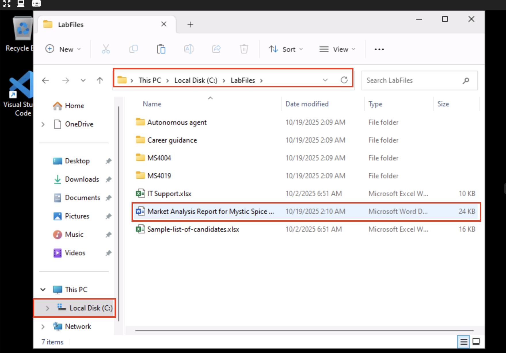

2.  \[**Apps\]** ページで、下にスクロールして **\[Loop\]**
    を見つけ、それを選択します。

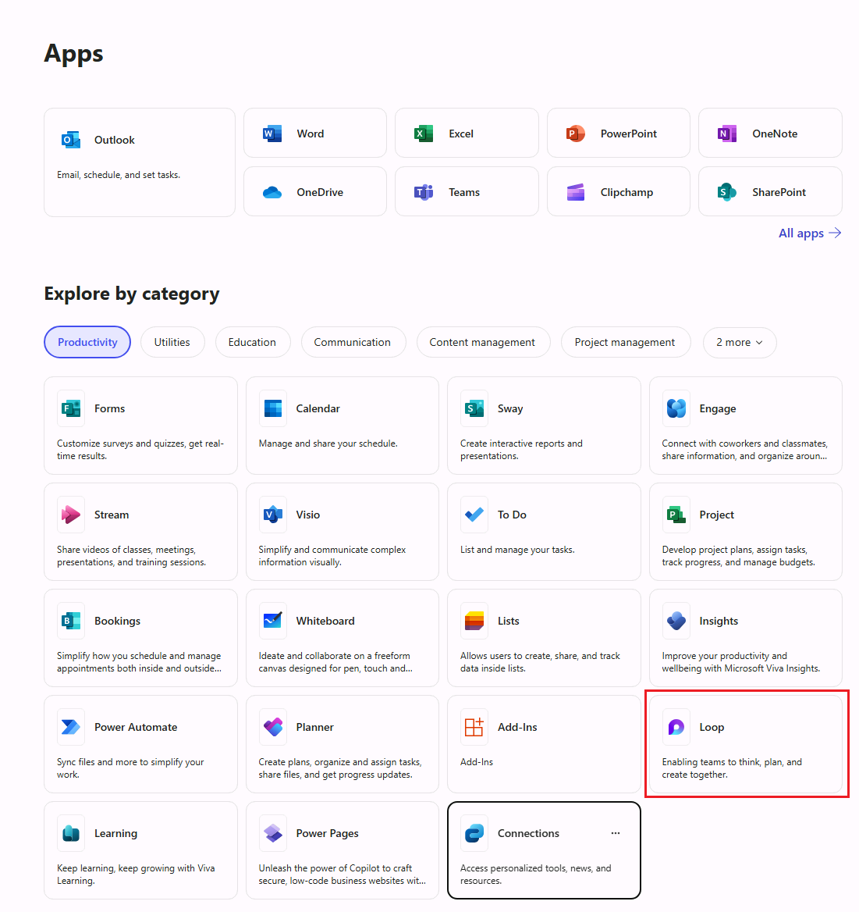

**注**: **\[Apps\] ページに** \[ループ\] が表示されない場合は、\[**All
apps\] を選択します**。

3.  \[**Sign-in\] ボタンが表示されている場合は**、\[**Resource\]
    タブの** \[**Microsoft 365
    Credentials\]で提供されている資格情報を使用してサインイン**します。

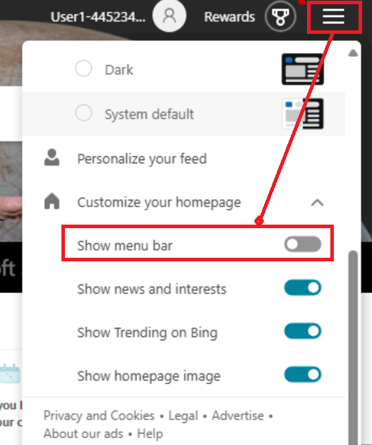

**注**:サインイン後、Loopブラウザウィンドウを閉じ、アプリページからもう一度Loopを開きます。

4.  Microsoft Loop **では**、既定で **\[Workspaces\]**
    タブが表示されます。このプロジェクトの新しいワークスペースを作成する場合は、
    \[**Getting started**\] の横にある左上の **\[+\]** を選択し、 **\[+
    New workspace** \] ボタンを選択します。

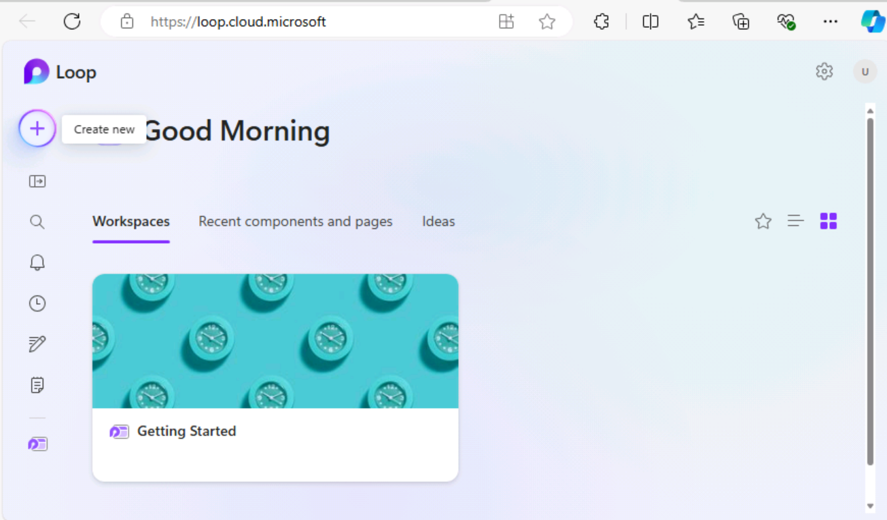

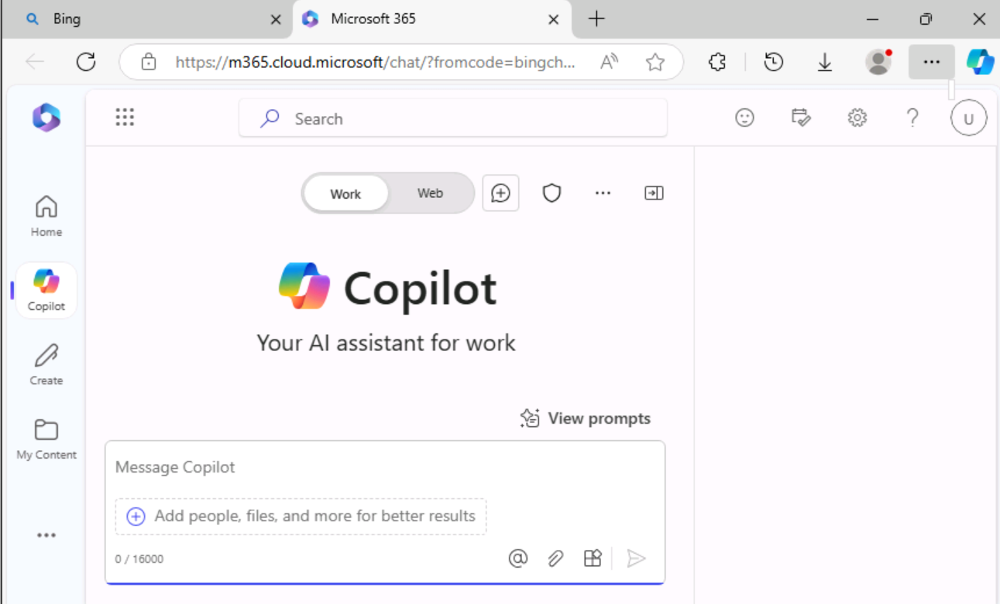

5.  \[**Create a new workspace**\]
    ウィンドウで、ワークスペース名に「+++VanArsdel
    research+++」と入力し、表示される **\[Continue**\] または
    **\[Create**\] ボタンを選択します
    (ループのバージョンによって異なります)。

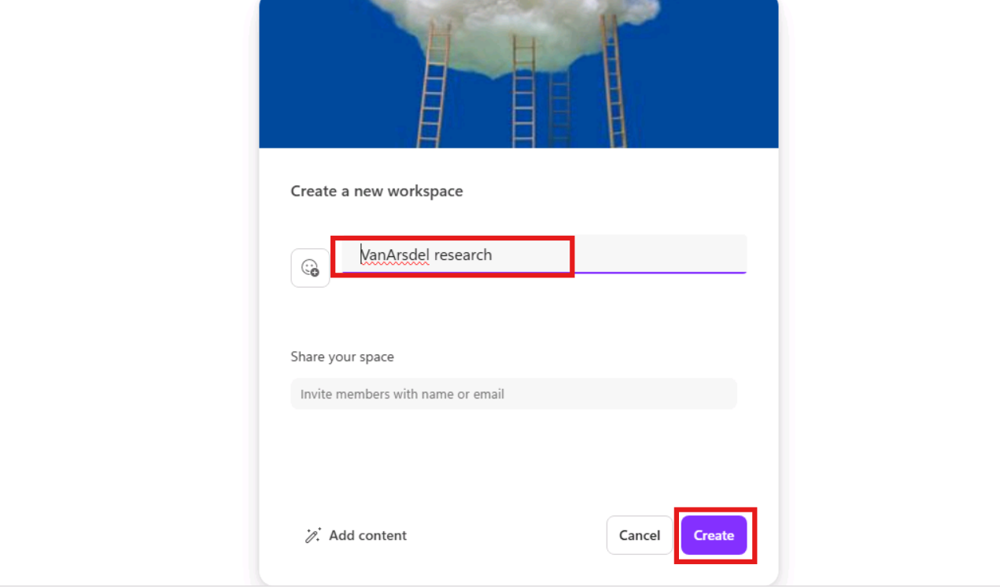

6.  \[**Add files to your workspace** (Loop
    のバージョンによっては、このウィンドウに **\[Workspace Switcher\]**
    と表示される場合があります) で、\[**Create**\] を選択します。

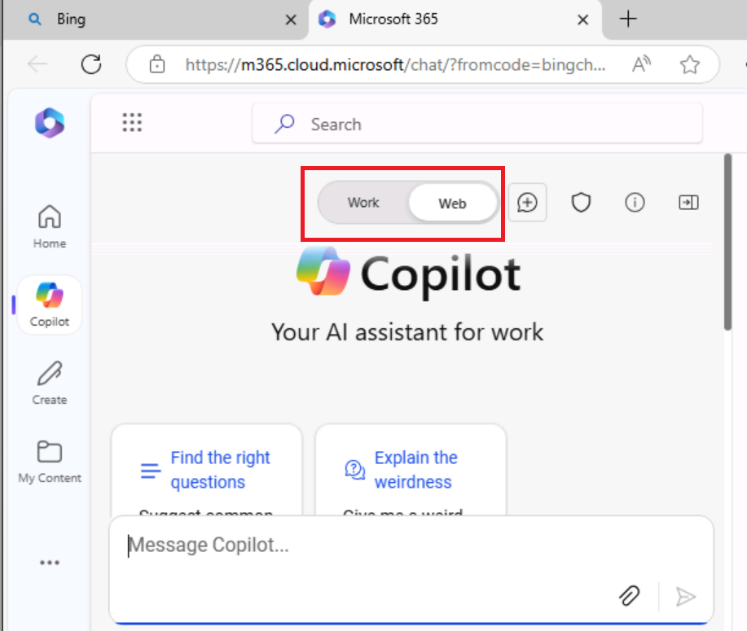

7.  これで、新しいワークスペースの最初のページが表示されます。ページの名前は現在
    **\[Untitled\]** です。ページ (**Untitled**)
    は、左側のナビゲーション
    ウィンドウにも表示されます。ページの本文で、**Untitled**
    フィールドを選択し、ページの名前を **市場調査**
    に変更します。ナビゲーション
    ウィンドウでページ名が自動的に更新されることに注意してください。

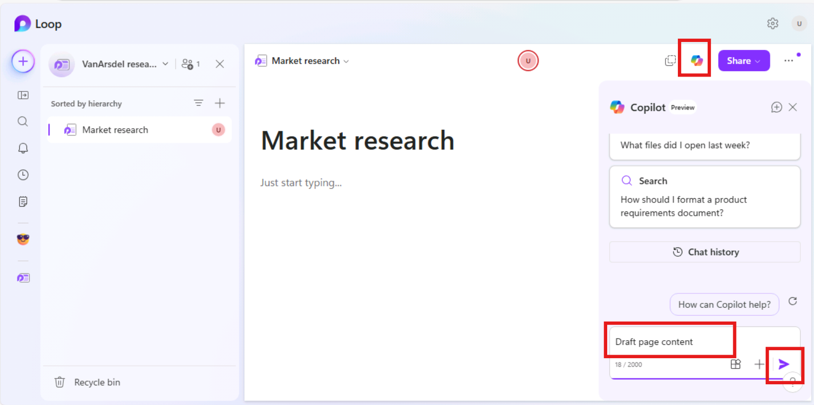

8.  \[**Just start typing...**  フィールドにスラッシュ **(/)
    を入力します**。

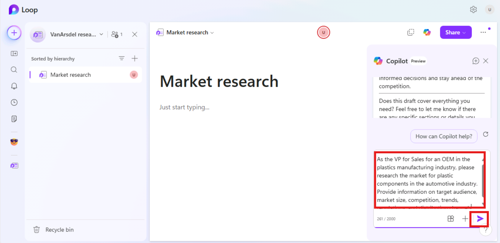

9.  表示されるドロップダウンメニューで、メニュー上部の\[**Copilot**\]セクションで、\[**Draft
    page content\]を選択します**。

10. 表示される **Copilot** ウィンドウで、プロンプト
    フィールドの下に表示されるボタンの列に注意してください。各ボタンを選択します。その際、Copilot
    が支援できるタスクの種類の例がプロンプト
    フィールドに事前に入力される方法に注意してください。

11. 次に、独自のプロンプトを入力します。プロンプトフィールドに次のプロンプトを入力し、\[**Submit\]**アイコンを選択します。

> +++As the VP for Sales for an OEM in the plastics manufacturing
> industry, please research the market for plastic components in the
> automotive industry. Provide information on target audience, market
> size, competition, trends, regulations, and distribution channels.+++

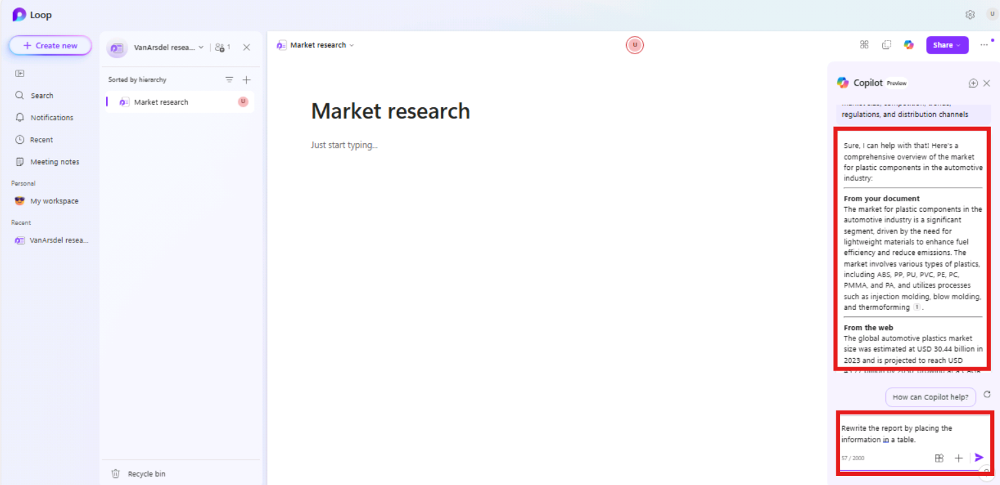

12. 問題が発生したというエラーが表示された場合は、前のプロンプトをコピーして貼り付け、再度送信します。

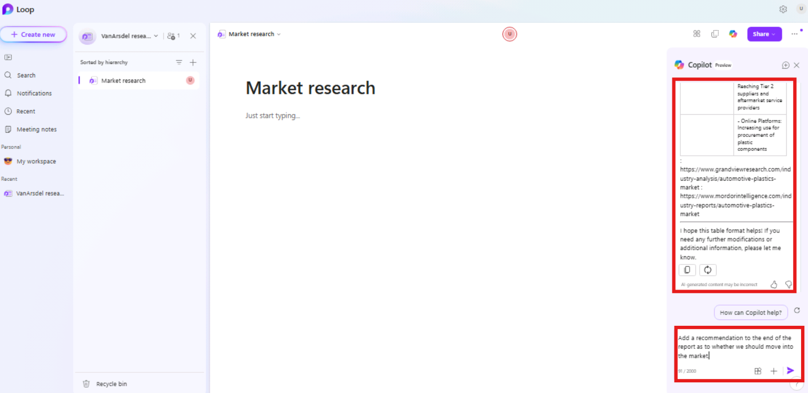

13. 生成されたレポートを確認します。すべての情報を段落形式でまとめるのではなく、表にまとめることを好みます。表示される
    **Copilot ペインで、**Rewrite with Copilot フィールドに
    次のプロンプトを入力し、**Submit** アイコンを選択します。

> +++Rewrite the report by placing the information in a table.+++

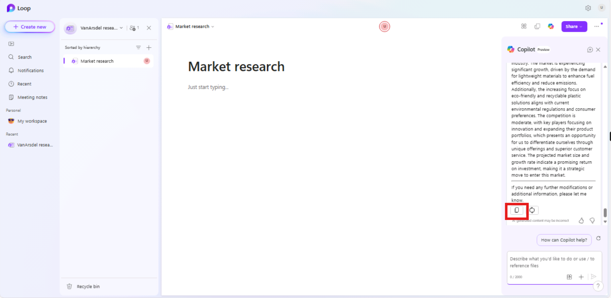

14. Copilot
    によってレポートの書式設定がどのように変更されたかに注目してください。あなたは今、Copilotに、この市場への参入がVanArsdelにとって実行可能な選択肢であるかどうかについて最終的な推奨を行うことを望んでいます。次のプロンプトを入力します:

> +++Add a recommendation to the end of the report as to whether we
> should move into the market.+++

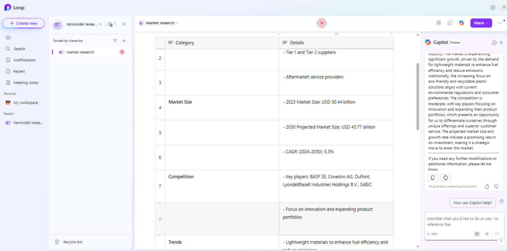

15. レポートの一番下までスクロールし、Copilot の推奨事項を確認します。

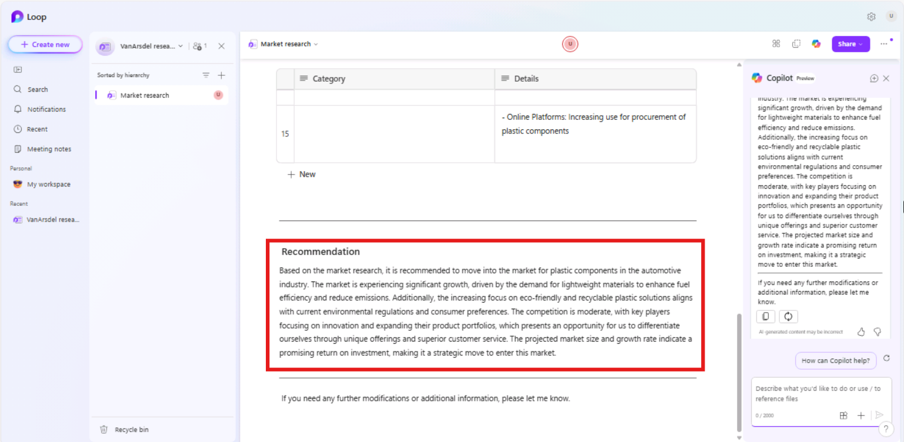

**演習 \#2: PowerPoint で Copilot
を使用して営業プレゼンテーションを作成する**

PowerPoint の Copilot
を使用すると、営業担当者はプレゼンテーションの内容に集中でき、ツールがデザインと書式設定を行います。それはできる:

- 既存の文書を、スピーカーノートとソースを備えたプレゼンテーションデッキに変換

- 新しいプレゼンテーションを簡単なプロンプトまたはアウトラインから開始します。

- プレゼンテーションの要約を支援し、重要なポイントの箇条書きの要約を提供して、プレゼンテーションの内容をすばやく理解したり、主要なアイデアをチームと共有したりします。

Contoso, Ltd. のセールスおよびマーケティング
ディレクターは、同社の最も売れ筋製品である Contoso Protein Plus
シェイクについて、セールス
チームにプレゼンテーションを行う必要があります。プレゼンテーションでは、マーケティング
チームが製品に対して作成した市場トレンド
レポートを分析する必要があります。

この演習では、PowerPoint の Copilot
を使用して、提供されているリンクを使用してダウンロードした **Market
Trend Report - Protein Shake.docx** ファイルの情報に基づいてスライド
プレゼンテーションを作成します。

1.  Microsoft Edge ブラウザーに Microsoft 365 Copilot アプリ
    ページがある場合は、ここで選択します。それ以外の場合は、新しいタブを開き、次の
    URL:
    :+++[https://m365.cloud.microsoft+++](https://m365.cloud.microsoft+++/) を入力して
    Microsoft 365 Copilot アプリのホーム ページに移動します。

**注**: 右側の **\[リソース\] タブ**にある **Microsoft 365
資格情報**を使用してサインインする必要があります
(プロンプトが表示された場合)。

2.  navigation ウィンドウで \[**Apps\] を選択します** 。**OneDrive**
    をクリックして開きます

3.  C:\LabFiles\MS4019 **フォルダーを参照して、Market Trend Report -
    Protein Shake** to **OneDrive**

**注**: 「ラボ実行の準備 **(**ラボ
0)」セクションの説明**に従って**、すべてのラボ アセットを OneDrive
に既にアップロードしている場合は、この手順をスキップできます。

4.  **ファイル Market Trend Report - Protein Shake.docx Update**
    (OneDrive にアップロードしたもの) を開いて閉じ、最近使用した (MRU)
    ファイル リストに入れます。

5.  **Microsoft 365** ナビゲーション ウィンドウで、\[PowerPoint\]
    を選択します。PowerPoint
    で、新しい空白のプレゼンテーションを開きます。

6.  **Copilot** アイコン (スクリーンショットに示すように赤で強調表示)
    を選択します。表示される **Copilot**
    ペインでは、いくつかの事前定義されたプロンプトから選択できます。**\[Create
    presentation from\]** プロンプトを選択します。  
    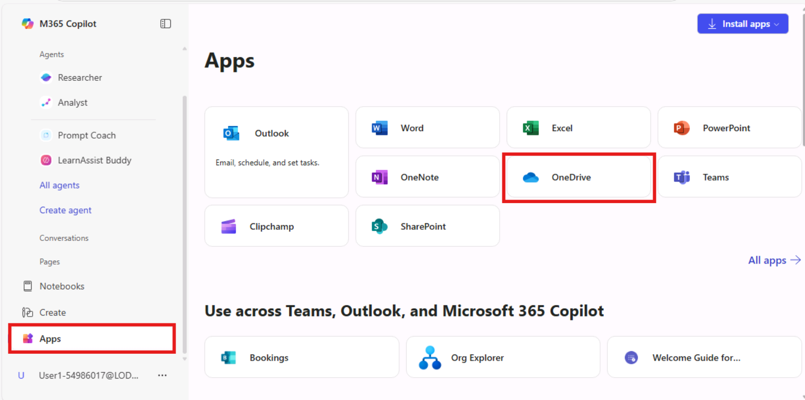

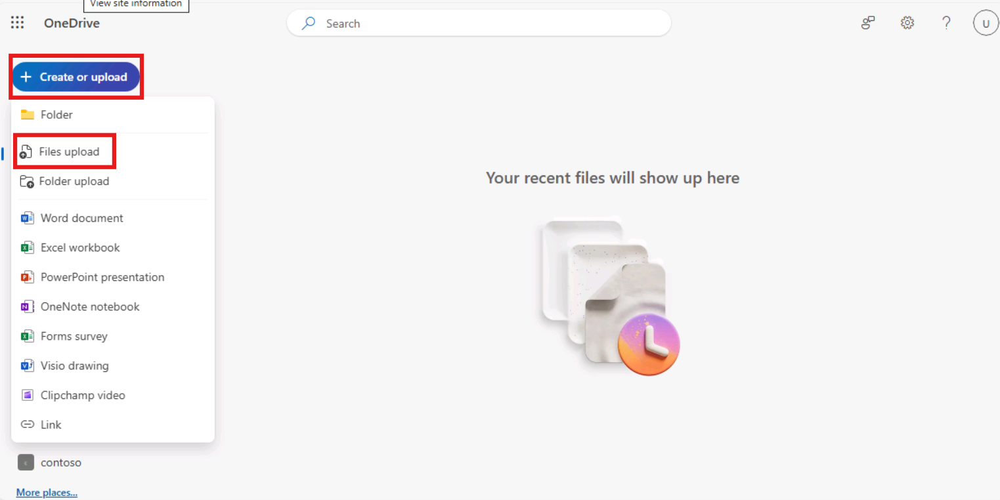

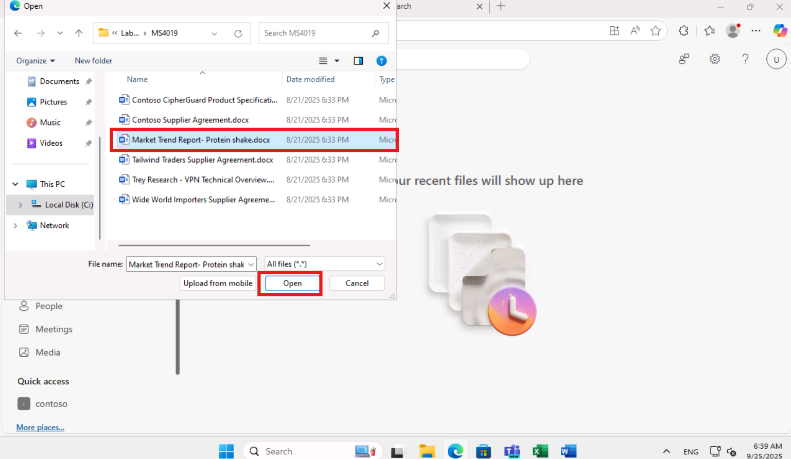

Copilot **ペイン**の下部にあるプロンプト
フィールドの上に**、最近使用した 3 つのファイルを含む \[提案**\]
ウィンドウが表示される場合があります。**MRUリストにMarket Trend Report -
Protein Shake.docx**ファイルが表示されている場合は、それを選択します。

7.  それ以外の場合は、スクリーンショットに示すように、
    クラウドファイルを添付する
    オプション。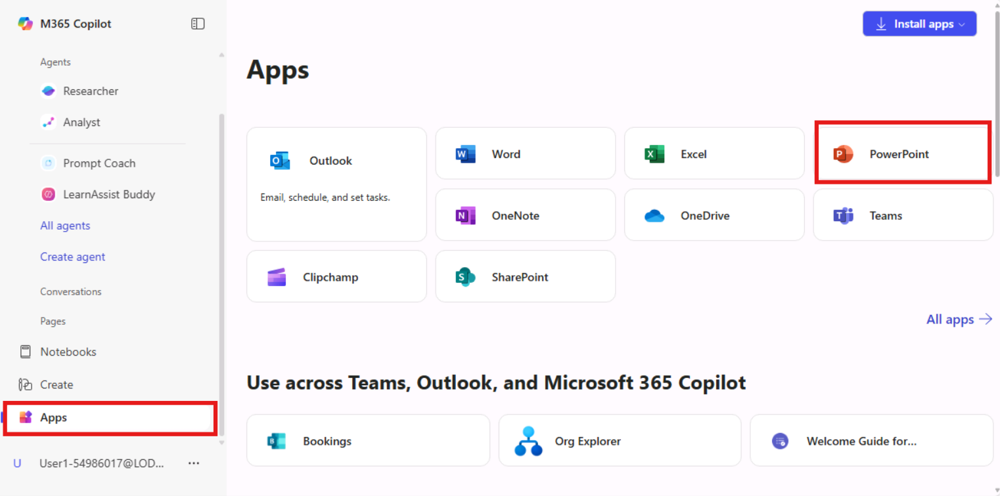

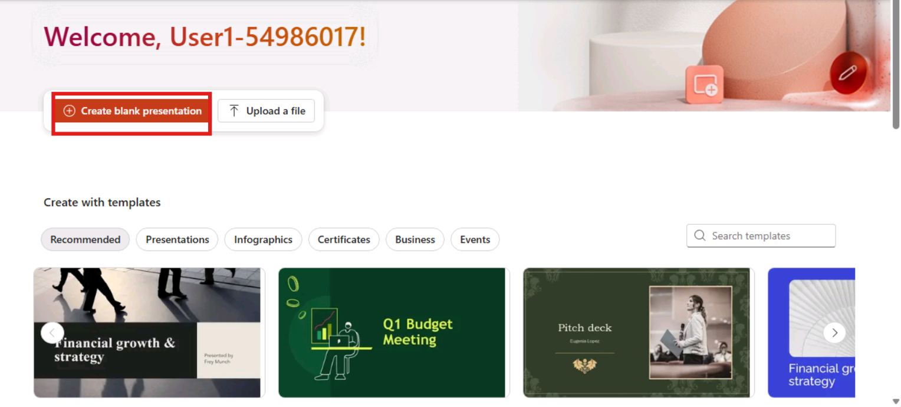

**注**:ドキュメントへのリンクを使用して、参照ドキュメントを添付できます。リンクを取得するには、Word
でファイルを開き、 **リボンの上にある** \[**Share**\]
ボタンを選択し、ドロップダウン メニューから \[**Copy Link\]
オプションを選択し、**PowerPoint の **Copilot** パネルの
**このプロンプト フィールドに**、スラッシュに続くリンクを貼り付けます
(**Create presentation from file /**)。\[**Send\]**
アイコンを選択します。

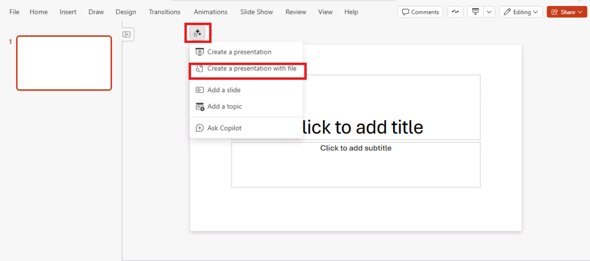

8.  このプロンプトにより、Copilot はドキュメントに基づいてスライド
    プレゼンテーションを作成しました。その際、最初にプレゼンテーションのアウトラインが表示されました。次に、ドキュメントに基づいてプレゼンテーションに加えた一部の変更の箇条書きリストを示す別のウィンドウが表示されました。

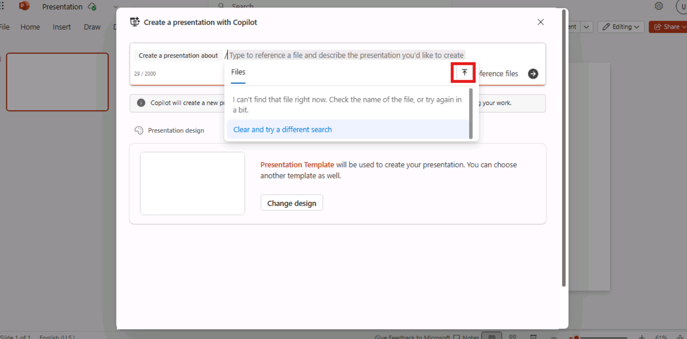

9.  Copilot
    でプレゼンテーションの作成が完了したら、スライドを確認します。スピーカーのノートを確認するには、\[**View**\]
    タブを選択し、\[**Notes**\]
    ボタンがまだ選択されていない場合は選択します。すでに選択されていてノートが表示されない場合は、スライドウインドウの下部を上にドラッグしてノートを表示します。スピーカーノートに、プレゼンテーション中に強調したいポイントが含まれていることを確認します。

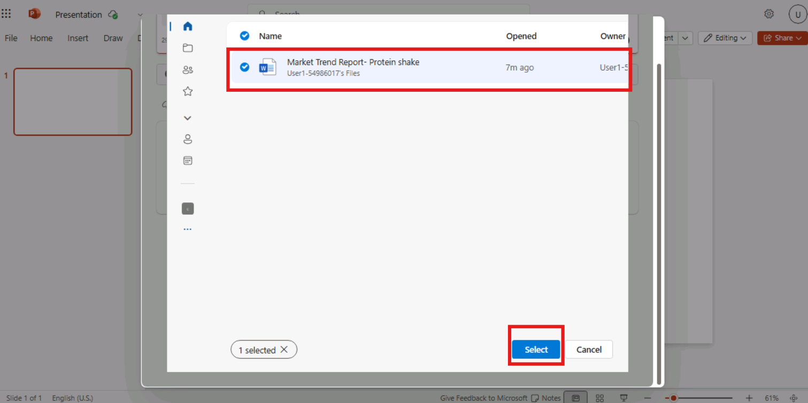

10. \[**Home\]** タブを選択し、\[**Copilot**\] ボタンの左側に表示される
    **\[Designer**\] ボタンを選択します。デザイナー
    ペインには、表示されている現在のスライドのさまざまなデザインのサンプルが表示されます。プレゼンテーション内の別のスライドに変更し、**デザイナー**
    ペインでそのスライドに対して異なるデザイン
    オプションがどのように生成されるかを確認します。

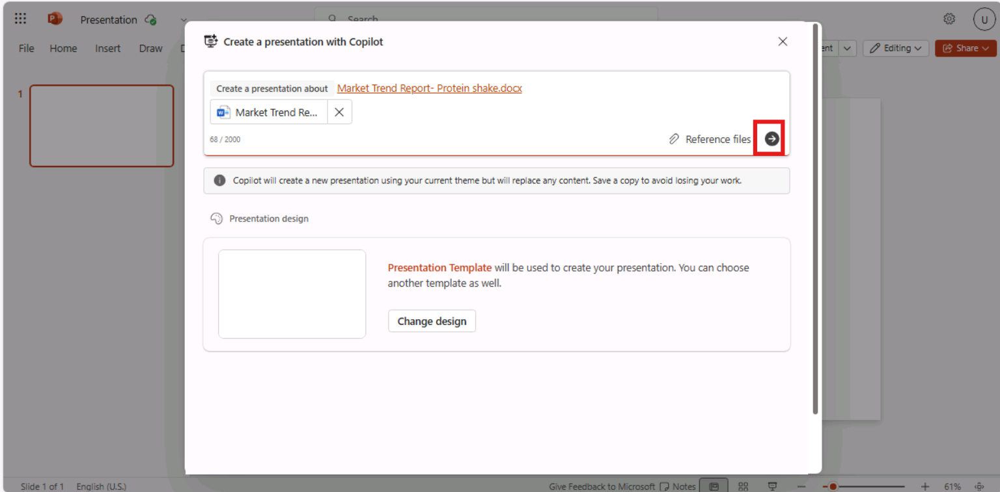

11. デザイン オプションの 1 つを選択して、PowerPoint
    で現在のスライドを新しいデザインに置き換えます。この機能は Copilot
    とは関係ありません。Microsoft 365
    サブスクリプションをお持ちの場合は、PowerPoint で利用できます。

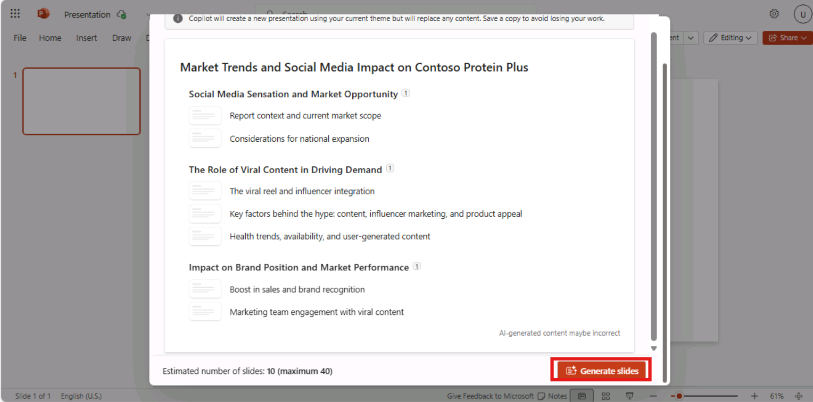

12. では、Copilot で他に何ができるかを見てみましょう。\[**Copilot**\]
    ボタンを選択して \[**Copilot**\]
    ウィンドウを開きます。\[**Copilot**\] ウィンドウで、\[**Here are
    some things you can try**\] というセクションを確認します。Copilot
    には、プレゼンテーションでいくつかのタスクを実行するために使用できる事前作成済みのプロンプトが用意されています。\[**View
    Prompts** **\]** アイコンを選択し、\[**Organize your thoughts**\]
    (赤色の強調表示) を選択します。
    **注:**プロンプトを見つけるには、ゆっくりと下にスクロールする必要があります(スクリーンショットを参照)

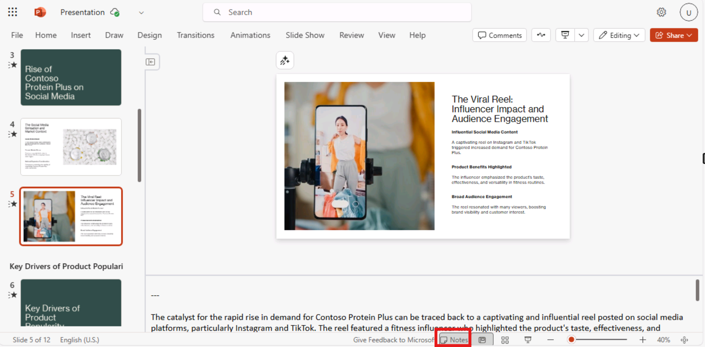

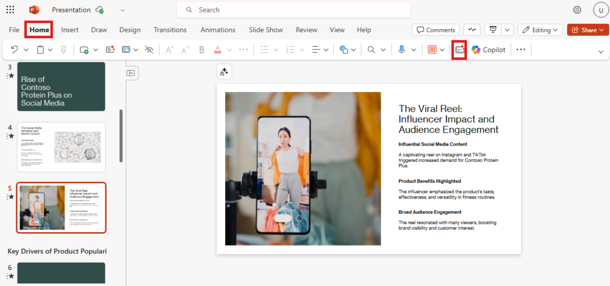

13. プレゼンテーションの整理に Copilot
    が何を行ったかを確認します。たとえば、スライドをセクションにグループ化し、新しいセクション
    タイトル
    スライドを追加したとします。その場合は、作成した新しいスライドを見つけて確認します。

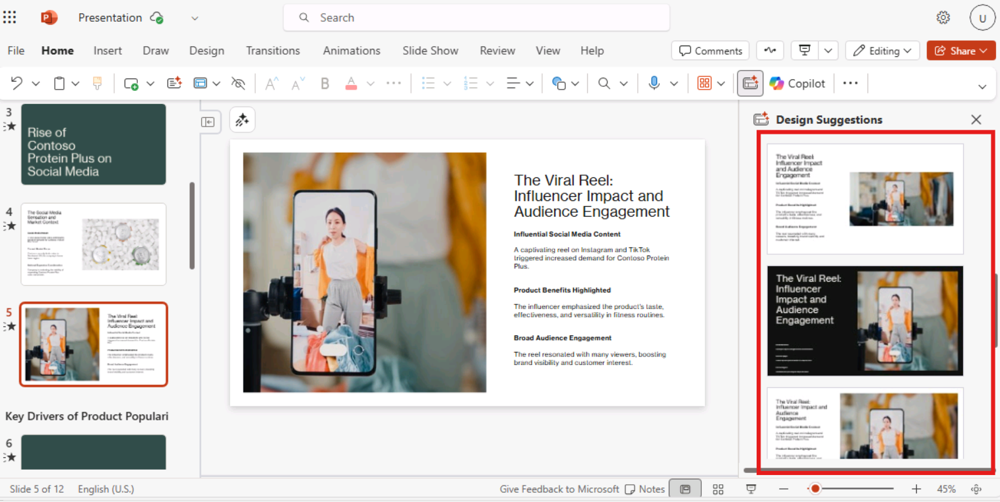

14. プロンプト
    フィールドの上には、プレゼンテーションに関連する質問が表示されます。これらの質問の目的は2つあります。できることは：

    - 質問を選択すると、Copilot
      で回答が生成され、それをコピーして該当するスライドのスピーカーノートに貼り付けることができます。

    - 質問と回答(Q&A)スライドを作成し、これらすべての質問に対する回答をコピーしてスピーカーノートに貼り付けます。

その際、これらの質問と回答を使用して、プレゼンテーションの Q&A
部分の準備をすることができます。たとえば、次のような質問をするボタンがある場合があります:
**What caused the rise in demand for Contoso Protein
Plus**?または、**What are the key factors behind the hype of Contoso
Protein
Plus**?と尋ねるかもしれません。表示された質問を確認し、そのうちの 1
つを選択して何が起こるかを確認します。

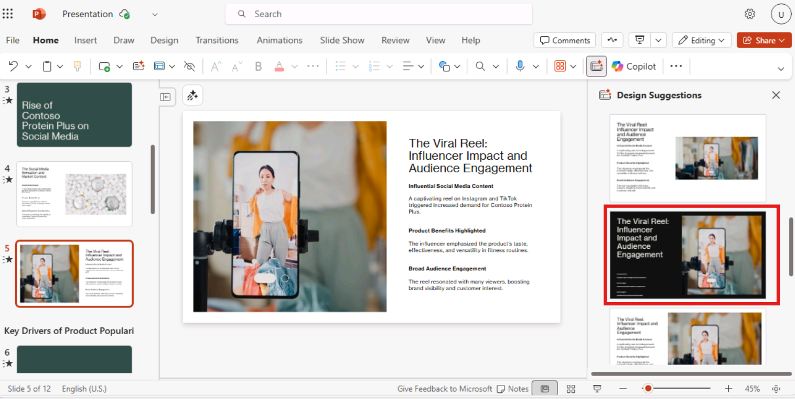

15. これらの質問のいずれかを選択すると、Copilot
    は質問に対する回答を生成し、 回答ウィンドウの下部に \[**Copy**\]
    オプションを提供します。その際、\[**Copy**\]
    オプションを選択し、このテキストが適切なノートを作成するスライドのスピーカー
    ノートにこの回答を貼り付けることができます。今すぐお試しください。質問を選択し、回答をコピーしてから、適切なスライドに移動し、スピーカーノートで
    **Ctrl + V** キーを押してノートを貼り付けます。

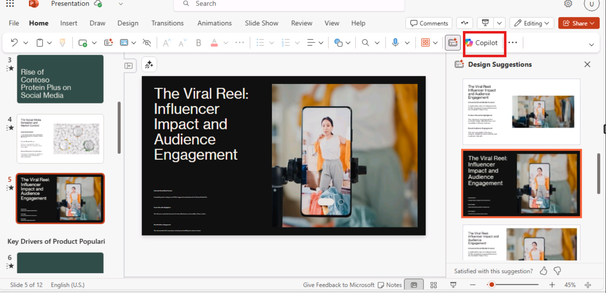

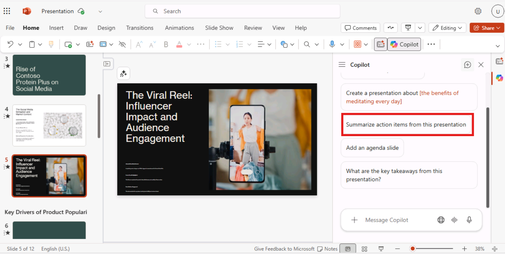

16. 提案された質問とプロンプトフィールドの間に表示される\[**Refresh**\]ボタンに注意してください。この
    **\[Refresh\]** ボタンを選択します。

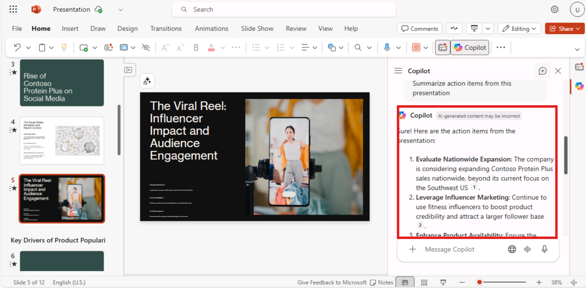

その際、Copilot
が新しい一連の質問をどのように生成したかに注目してください。
プレゼンテーションで対処したい質問が表示されるまで、\[更新\]
ボタンを選択して、質問を更新し続けることができます。その後、質問を選択し、Copilot
で生成された回答をコピーして、選択したスライドのスピーカーノートに貼り付けることができます。Copilot
は、新しい質問が思いつかなくなると、質問のリストを最初から繰り返し始めます。

17. ここで、Copilot でプレゼンテーションの最後に Q&A
    セッションのスライドを作成します。次のプロンプトを入力し、\[**Send\]**
    アイコンを選択します。

> +++Add a slide at the end of the presentation for Q&A.+++

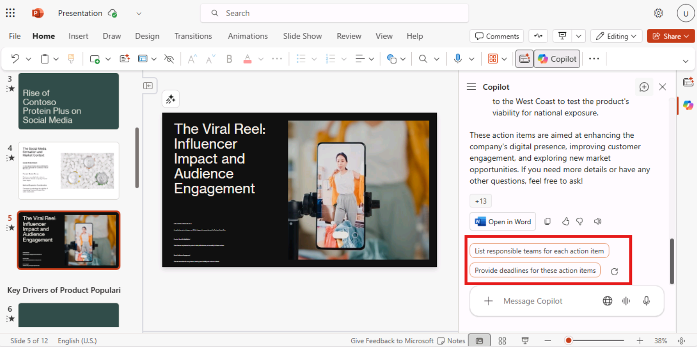

**注**: Copilot では、以下のような例外が表示される場合があります。

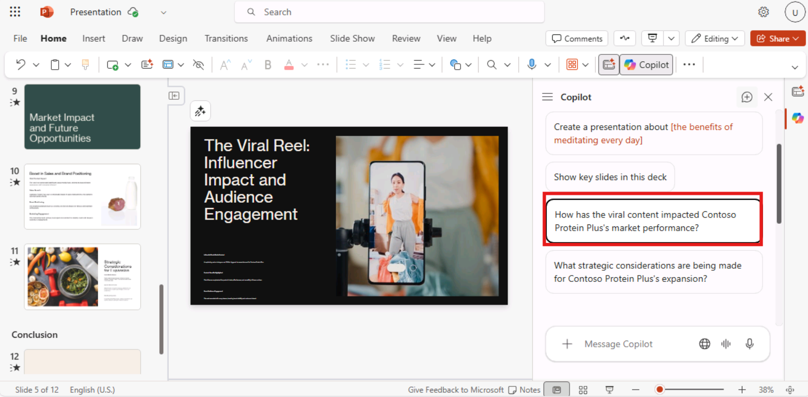

プロンプトを言い換えるか、次のような提案されたプロンプトを使用してください。

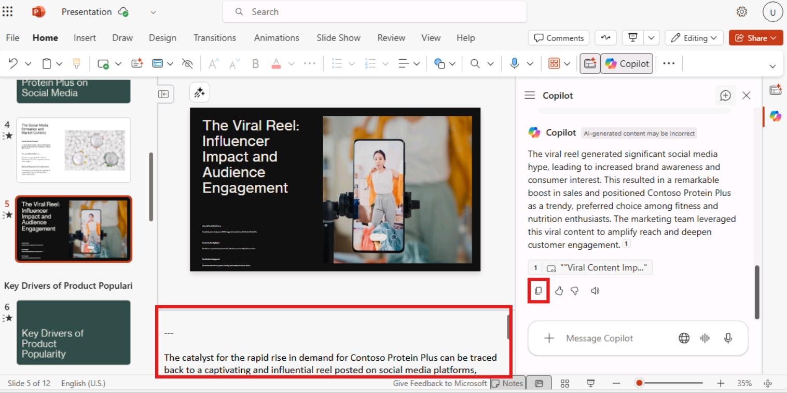

18. \[**Add a slide**\]**コマンドを選択し**
    、プレゼンテーションの最後に次のQ&Aを追加します(スクリーンショットを参照)。

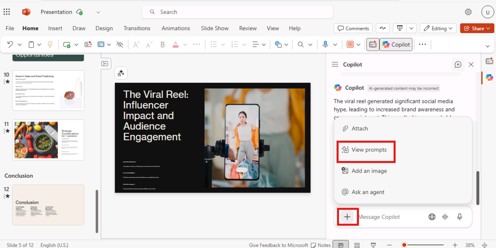

19. \[Send**\] をクリックして** 、何が起こるかを確認します。

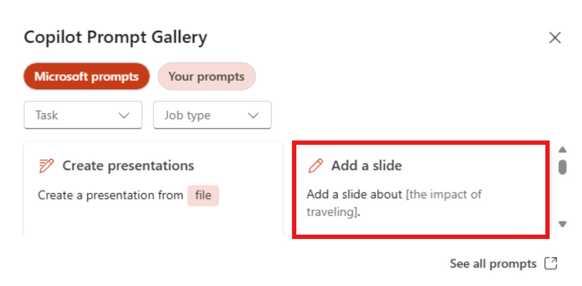

Copilotは指示通りにQ&Aスライドを追加しました。Copilot が作成した Q&A
スライドを確認します。

20. Copilot が作成した Q&A
    スライドを確認します。では、最後にもう1つ試してみてください。Q&A
    セッション中に準備できる可能性のある質問のリストを作成することにしました。次のプロンプトを入力して、Copilot
    が提案したすべての質問を Q&A スライドのスピーカー
    ノートに追加できるかどうかを確認します：

> +++In the speaker notes of the Q&A slide that you just created, add a
> list of possible questions that may be asked regarding this
> presentation.+++

21. Copilot
    がスライドを生成できなかったことを示すメッセージを返した場合は、プロンプトをもう一度入力してみてください。Copilot
    がタスクを完了できない場合は、リクエストを繰り返すことをお勧めします。

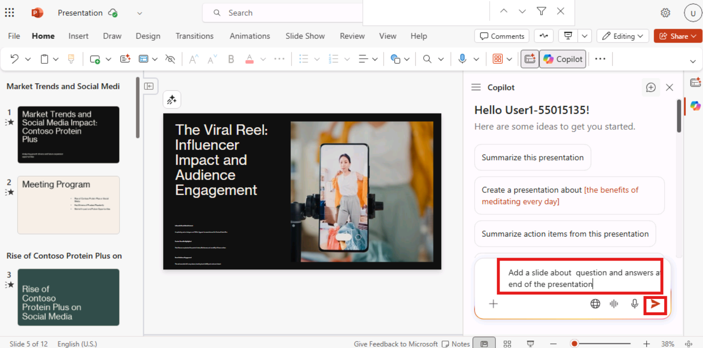

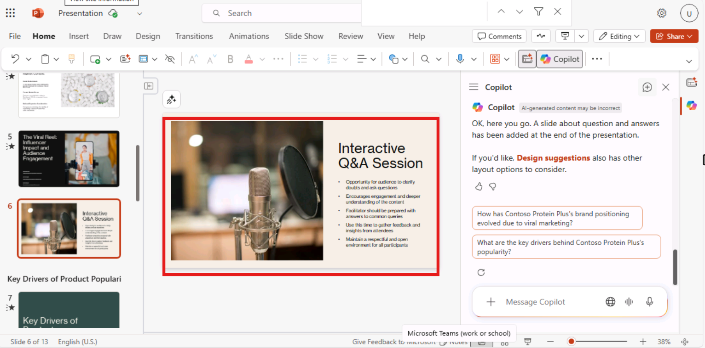

Copilot
がこのタスクを完了できない場合は、この時点で必要なすべてのタスクを完了できない可能性があることを示しています。このシナリオは、Copilot
の制限事項を理解するという、注意すべきベスト プラクティスの別の例です。

22. 次に、この回避策を試してください。次のプロンプトを入力して、質問のリストを生成するように求めます。  
    +++What kind of questions do you think participants may ask during
    the Q&A session?+++  
      
    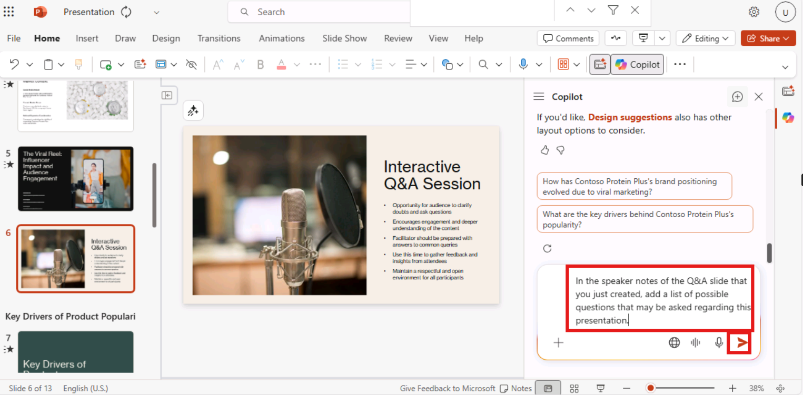

23. Copilot が作成した問題を確認します。 **ウィンドウの下部にある**
    \[**Copy** \] ボタンを選択し、**Q&A スライドのスピーカー
    ノートに**貼り付けます (Ctrl + V)。

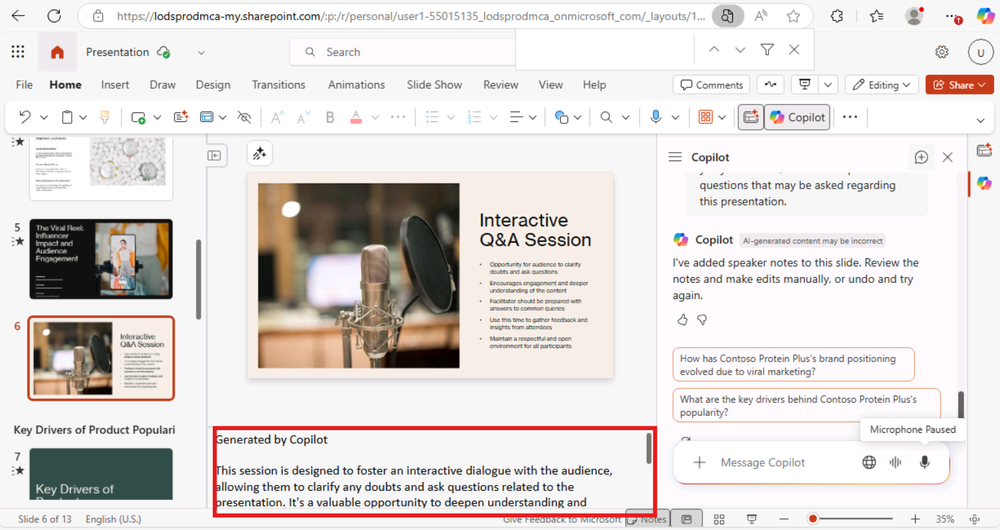

**注**: Copilot
では、一部の例外が表示される場合があります。**ステップ#16**のように、提案されたプロンプトを使用してみてください

このモジュールの残りのトレーニング演習ではこのプレゼンテーションは使用しませんが、後で参照できるようにコピーを保持する場合は、このプレゼンテーションを破棄するか、保存することができます。

**演習 \#3: Word で Copilot を使用してサプライヤー契約を比較する**

営業担当者は、顧客との強固な関係を築き、インサイトに基づいて行動を起こし、より迅速に取引を成立させるために、適切な情報を適切なタイミングで必要としています。Word
の Copilot
は、他のドキュメントから特定の情報をコンテンツに取り込んだり、概要を生成したり、ドキュメントについて質問したり、特定のトピックに関するアイデアを提供したり、テキストを表に変換したり、コンテンツを書き換える方法を提案したりするのに役立ちます。

あなたは、さまざまな食料品や飲料製品のサプライヤーである Northwind
Traders の新しいセールス マネージャーです。あなたは、Northwind
の上位顧客数社と現在締結されているサプライヤー契約について懸念しています。これらの契約は前任者が交渉したため、以前にこれらの顧客と合意した契約条件に精通していません。

この演習では、次のことを行います

- Word の Copilot に 3 つのサプライヤー契約ドキュメントを提供します。

- 各顧客と交渉した契約条件を比較するレポートを作成するように依頼します。

- Copilot
  に依頼して、各契約の再交渉に関する推奨事項を提供してもらいます。

1.  Microsoft Edge ブラウザーに Microsoft 365 Copilot アプリ
    ページがある場合は、ここで選択します。それ以外の場合は、新しいタブを開き、次の
    URL:
    +++[https://m365.cloud.microsoft+++](https://m365.cloud.microsoft+++/) を入力して
    Microsoft 365 Copilot アプリのホーム ページに移動します。

**注**: 右側の **\[リソース\] タブ**にある **Microsoft 365
資格情報**を使用してサインインする必要があります
(プロンプトが表示された場合)。

2.  **C:\LabFiles\MS4019**
    フォルダーを参照して、次のドキュメントのコピーを選択して OneDrive
    にアップロードします。

    - **Contoso サプライヤー契約**

    - **Tailwind Tradersサプライヤー契約**

    - **ワイドワールドインポーターズサプライヤー契約**

**注**:
すべてのドキュメントのコピーをすでにアップロードしている場合は、この手順をスキップできます
(**ラボ 0** の指示に従って、このハンズオン ラボ セッションで
**C:\LabFiles** から使用します)。

3.  この実習では、最近使用したファイルリストからドキュメントにアクセスします。ファイルを
    MRU
    リストに表示するには、各ドキュメントを開いてから閉じます。OneDrive
    アカウント内の 3 つのファイルをそれぞれ開いて閉じます。

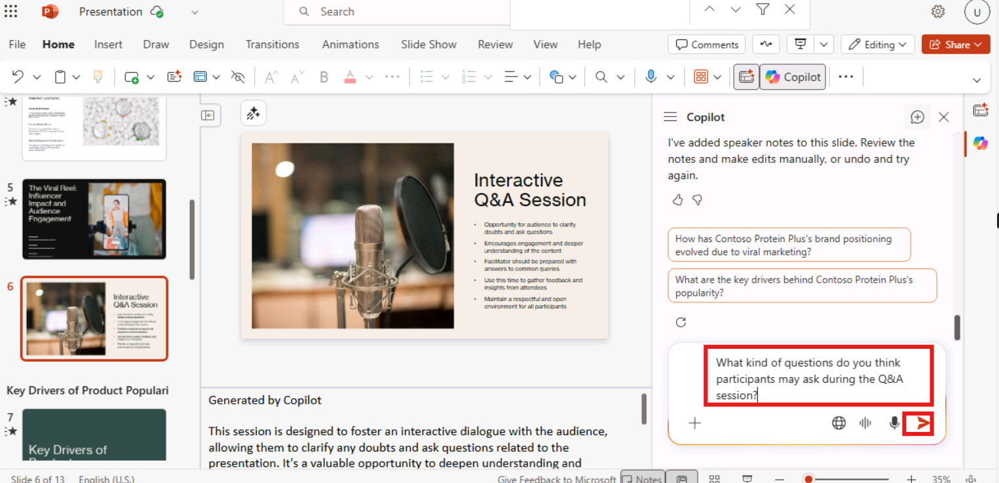

4.  Microsoft 365 **で** Microsoft Word
    **を開き、**新しい空白のドキュメントを開きます。

5.  空白のドキュメントの上部に表示される「**Draft with
    Copilot**」ウィンドウで、次のプロンプトを入力します。

> +++I'm the Sales Manager for Northwind Traders, a supplier of various
> grocery and beverage products. Please create a report that compares
> the supplier agreements for three of our customers. Provide a
> recommendation on contract renewals that can provide Northwind Traders
> with more favorable terms. The supplier agreements for these three
> customers are attached. Thank you!+++

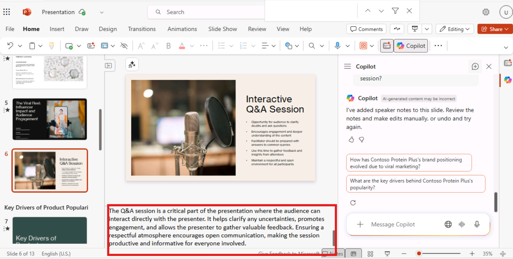

ここで、3
つのサプライヤー契約をプロンプトに添付する必要があります。「**Copilot
によるドラフト**」ウィンドウで、「**Reference your
content**」ボタンを選択します。表示されるドロップダウン
メニューで、ファイルの一覧に **Contoso
サプライヤー契約**が表示されている場合は、それを選択します。それ以外の場合は、
**\[Browse files from cloud\] を選択し、** \[最近使用した**ファイル\]
の一覧** から **Contoso Supplier Agreement**を選択し、 **\[Attach**\]
ボタンを選択します。プロンプトでファイルがどのように表示されるかに注意してください。

Tailwind Traders Supplier Agreement**と**Wide World Importers Supplier
Agreement**の両方について、前の手順を繰り返します**。この時点で、3
つのファイルすべてへのリンクがプロンプトに含まれている必要があります。

6.  \[Generate\] **を選択します**。この時点で、Copilot は 3
    つのサプライヤー契約から関連情報を抽出し、それらを比較するレポートを作成します。

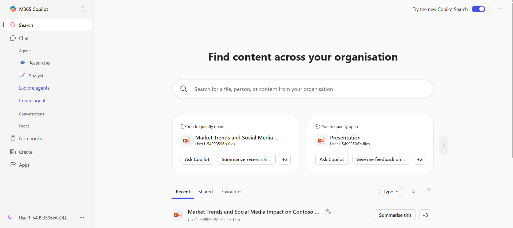

7.  比較ドキュメントを確認した後、結果に満足していません。Copilot
    が再試行して新しいバージョンを生成することを望んでいます。ドキュメントの最後に表示される
    Copilot ウィンドウで、\[**Keep it\] ボタンの横に表示される**
    \[**Regenerate\] ボタン**を選択します。この手順は、Copilot
    が承認するこのレポートのバージョンを作成するまで、必要な回数だけ繰り返すことができます。この演習では、この手順を数回繰り返して、Copilot
    が提供するさまざまな形式を確認します。また、レポートの 1
    つのバージョンには含まれていて、他のバージョンには含まれていない情報がある場合にも注意してください。

> レポートのバージョンに問題がなければ、 **\[Keep it\]**
> ボタンを選択しま  
> す。

8.  このドキュメントを読み終えたら、**OneDrive**に保存して、MicrosoftEdgeブラウザーでこのタブを閉じることができるようにします。

**概要：**

このラボでは、AI を活用したライティング アシスタントとして Copilot for
Microsoft 365 の機能について説明しました。

- Copilot in
  Loopを使用して、データの整理、洞察の生成、まとまりのある有益なレポートの作成を含む詳細な市場調査レポートを作成しました。

- PowerPoint の Copilot
  を活用して、スライドの生成、コンテンツのカスタマイズ、主要なセールス
  メッセージを効果的に伝えるプレゼンテーションのための説得力のあるセールス
  プレゼンテーションをデザインしました。

- Word の Copilot を使用して 3
  つのサプライヤー契約を分析および比較し、契約間の違いを特定し、比較に基づいて推奨されるアクションを提供しました。
