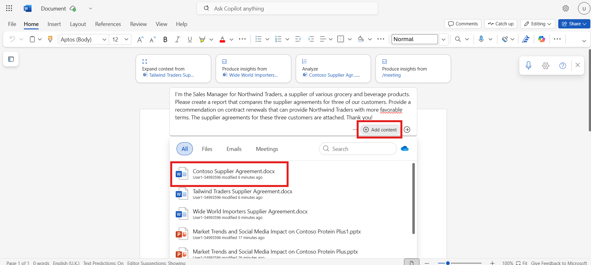
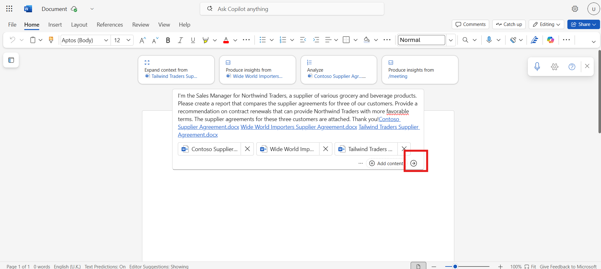

# Lab 04: Empower your sellers with Microsoft 365 Copilot

Copilot for Microsoft 365 serves as an AI-powered writing assistant. It
understands context, suggests phrases, and helps generate content, all
of which can enhance the quality of your work. In this lab, you will

- Use Copilot in Loop to create a market research report.

- Use Copilot in PowerPoint to create and customize a sales
  presentation.

- Use Copilot in Word to compare three supplier agreements, identify the
  differences, and provide recommended actions.

## Exercise 1: Create a market research report using Copilot in Loop

You're the VP of Sales for VanArsdel Ltd, an OEM of plastic components,
whose primary market is the agriculture equipment industry. However,
senior leadership is interested in possibly moving into the automotive
market. Given the heavy competition from existing plastic manufacturers
who already monopolize this sector, you need to determine if there's a
space available for your company to become a viable player.

In this exercise, you will use Copilot in Loop to

- Research a potential new sales market for your company's products and
  create a market research report that outlines its findings.

- Change the format of the report by placing the content in a table.

- Make a final recommendation as to whether your company should move
  into that market.

1.  Open a Microsoft Edge browser and enter the following URL:
    ++https://m365.cloud.microsoft++ to go to the Microsoft 365
    Copilot app (formerly office) home page. Select **Apps** in the left
    navigation pane.

    **Note**: You need to sign-in (if prompted) using the Credentials
    provided under the Resources tab on the right.

    

2.  In the **Apps** page, scroll down to locate **Loop** and then select
    it.

    

    **Note**: If you don't see **Loop** listed in the Apps page,
    select **All apps**.

3.  If you see the **Sign-in** button, sign-in using the credentials
    provided under **Microsoft 365 Credentials** in
    the **Resources** tab.

    

    **Note**: After signing in, close the Loop browser window and once
    again open Loop from the Apps page.

4.  In **Microsoft Loop**, the **Workspaces** tab is displayed by
    default. Create a new workspace for this project, select **+** on
    the top left next to **Getting started**, and then select **+New
    workspace** button.

    

    

5.  In the **Create a new workspace** window, enter ++VanArsdel
    research++ for your workspace name, and then select
    **Create** button.

    

6.  You're now on the first page for your new workspace. The name of the
    page is currently **Untitled**. Note the page (Untitled) also
    appears in the left-hand navigation pane. In the main body of the
    page, select in the **Untitled** field and change the name of the
    page to ++**Market research++**. Note how the page name is
    automatically updated in the navigation pane.

    

7.  Click on the **Copilot** button. Under the **Copilot** section enter
    ++**Draft page content++** in the field and then **Submit** the
    prompt.

    

8.  In the prompt field, enter the following prompt and select
    the **Submit** icon:

    ++As the VP for Sales for an OEM in the plastics manufacturing
    industry, please research the market for plastic components in the
    automotive industry. Provide information on target audience, market
    size, competition, trends, regulations, and distribution channels.++

    

    **Note:** If you receive an error saying that something went wrong,
    copy and paste in the prior prompt and submit it again.

9.  Review the generated report. Rather than having all the information
    in paragraph form, you prefer to summarize it in a table. In
    the **Copilot** pane that appears, enter the following prompt in
    the **Rewrite with Copilot** field and select the **Submit** icon:

    ++Rewrite the report by placing the information in a table.++

    

10. Note how Copilot changed the formatting of the report. You now want
    Copilot to make a final recommendation as to whether moving into
    this market is a viable option for VanArsdel. Enter the following
    prompt:

    ++Add a recommendation to the end of the report as to whether we
    should move into the market.++

    

11. Click on the **Copy** button to copy the content and paste it in the
    empty draft.

    

    

12. Scroll to the bottom of the report and review Copilot's
    recommendation.

    

## Exercise 2: Create a sales presentation using Copilot in PowerPoint

With Copilot in PowerPoint, Sales professionals can focus on the content
of their presentations, while the tool takes care of the design and
formatting. It can

- Transform existing written documents into presentation decks complete
  with speaker notes and sources

- Start a new presentation from a simple prompt or outline.

- Help summarize presentations, providing a bulleted summary of the key
  points to quickly understand the content of a presentation or share
  the main ideas with the team.

As the Sales and Marketing Director at Contoso, Ltd., you need to make a
presentation to your Sales team regarding the company's hottest selling
product, Contoso Protein Plus shake. The presentation should analyse the
market trend report that your Marketing team created for the product.

In this exercise you will use Copilot in PowerPoint to create your slide
presentation based on the information in the **Market Trend Report -
Protein Shake.docx** file, which you download using the provided link.

1.  If you have a Microsoft 365 Copilot App page in your Microsoft Edge
    browser, then select it now; otherwise, open a new tab and enter the
    following
    URL:++[https://m365.cloud.microsoft++](https://m365.cloud.microsoft++/) to
    go to the Microsoft 365 Copilot App home page.

    **Note**: You need to sign-in (if prompted) using the **Microsoft 365
    Credentials** provided under the **Resources** tab on the right.

2.  Select **Apps** in the navigation pane. Click **OneDrive** to open
    it.

    

3.  Click on the **Create or upload** button and select **File upload**.

    

4.  Browse to the **C:\LabFiles\MS4019** folder to select and upload a
    copy of **Market Trend Report - Protein Shake** to **OneDrive**

    

    **Note**: If you have already uploaded all the lab assets
    to **OneDrive** as instructed in **Preparing for the lab
    execution** section (**Lab 0**), you can skip this step.

5.  Open and close the file **Market Trend Report - Protein
    Shake.docx** (which you uploaded to OneDrive) to get it in your Most
    Recently Used (MRU) file list

6.  On the **Microsoft 365** navigation pane, select **PowerPoint**. In
    PowerPoint, Click on **Create new blank presentation**.

    

    

7.  Select the **Copilot** icon (in red highlight as shown in the
    screenshot). In the **Copilot** pane that appears, several
    predefined prompts are available for you to choose from. Select
    the **Create presentation from file** prompt. 

    

    Above the prompt field at the bottom of the **Copilot** pane,
    a **Suggestions** window may appear that contains the three most
    recently used files. If the **Market Trend Report - Protein
    Shake.docx** file appears in the MRU list, then select it.

8.  Otherwise, you can attach the reference document using the Attach
    cloud files option as shown in the screenshot. 

    

    

    

    **Note**: You can also attach the reference document using the link to
    the document. To get the link open the file in **Word**, select
    the **Share** button above the ribbon, select the **Copy Link** option
    from the drop-down menu, and then in this prompt field in
    the **Copilot** pane in **PowerPoint**, paste in the link following
    the forward slash (**Create presentation from file /**). Select
    the **Send** icon.

9.  Click on the **Generate Slides** to create suggested slides.

    

10. Review the slides once Copilot finished creating the presentation.
    To review the speaker notes, select the **View** tab and then select
    the **Notes** button if it isn't selected already. If it's already
    selected and you can't see the notes, then drag the bottom of the
    slide window up to show the notes. Verify the speaker notes include
    the key points that you want to make during the presentation.

    

11. Select the **Home** tab and then select the **Designer** button,
    which appears to the left of the **Copilot** button.

    

12. The **Designer** pane offers samples of different designs for the
    current slide being displayed. Change to a different slide in the
    presentation and note how the **Designer** pane generates different
    design options for that slide.

    

13. Select one of the design options to have PowerPoint replace the
    current slide with the new design. This feature isn't
    Copilot-related. It's available in PowerPoint when you have a
    Microsoft 365 subscription.

    

14. Now let's see what else Copilot can do. Select
    the **Copilot** button to open the **Copilot** pane.

15. In the **Copilot** pane, note the section that says **Need a
    creative spark**. Copilot provides pre-built prompts that you can
    use to perform several tasks on the presentation.

    

16. Select a **suggested prompt**.

    

17. You can review the result.

    

18. Above the prompt field, Copilot displays questions related to the
    presentation. The purpose of these questions is two-fold. You can

    - Select a question and have Copilot generate an answer, which you
      can then copy and paste into the speaker notes for an applicable
      slide.

    - Create a Question and Answer (Q&A) slide and copy and paste in the
      answers to all these questions in the speaker notes.

    In doing so, you can use these questions and answers to prepare for
    the Q&A portion of the presentation. Review the questions that you
    see, and select one of them to see what happens.

    

19. When you select any of these questions, Copilot generates an answer
    to the question and provides a **Copy** option at the bottom of the
    answer window.

    

20. In doing so, you can select the **Copy** option and then paste this
    answer in the speaker notes for any slide in which this text would
    make an appropriate note. Try it now. Select a question, copy the
    answer, then go to an appropriate slide and in the speaker notes,
    enter **Ctrl+V** to paste in the note.

    

21. You now want Copilot to create a slide at the end of the
    presentation for a Q&A session. Select the **+ icon** next to prompt
    box and then click on the **view prompts.** Then select **Add a
    slide** option.

    

    

    

22. Enter the following prompt next to the prompt and then select
    the **Send** icon:

    ++question and answers at end of the presentation ++

    

    Copilot has added a Q&A slide as instructed. Review the Q&A slide that
    Copilot created.

    

23. Review the Q&A slide that Copilot created. Now try one final thing.
    You decide to compile a list of potential questions that you can
    prepare for during the Q&A session. Enter the following prompt to
    see if Copilot can add all of its suggested questions to the speaker
    notes on the Q&A slide:

    ++In the speaker notes of the Q&A slide that you just created, add a
    list of possible questions that may be asked regarding this
    presentation.++

    

24. Review the notes added by copilot.

    

25. Now try this workaround. Enter the following prompt that asks it to
    generate a list of questions:

    ++What kind of questions do you think participants may ask during the
    Q&A session?++

    

26. Review the questions. Questions automatically added into the Q&A
    slide notes.

    

While the remaining training exercises in this module don't use this
presentation, you can either discard it or save it if you to retain a
copy for future reference.

## Exercise 3: Compare supplier agreements using Copilot in Word

Salespeople need right information at the right time to build strong
relationships with their customers, take actions based on insights, and
close deals faster. Copilot in Word can help them bring in specific
information from other documents into their content, generate summaries,
ask questions about their document, provide ideas about specific topics,
and transform text into tables, or provide suggestions for ways to
rewrite content.

You're the new Sales Manager for Northwind Traders, a supplier of
various grocery and beverage products. You're concerned about the
supplier agreements that are currently in place with several of
Northwind's top customers. Your predecessor negotiated these agreements,
so you aren't familiar with the terms and conditions that were
previously agreed upon with these customers.

In this exercise, you will

- Provide Copilot in Word with three supplier agreement documents.

- Ask it to create a report that compares the terms and conditions
  negotiated with each customer.

- Ask Copilot to provide recommendations for renegotiating each
  agreement.

1.  If you have a Microsoft 365 Copilot App page in your Microsoft Edge
    browser, then select it now; otherwise, open a new tab and enter the
    following
    URL:++https://m365.cloud.microsoft++ to
    go to the Microsoft 365 Copilot App home page.

    **Note**: You need to sign-in (if prompted) using the **Microsoft 365
    Credentials** provided under the **Resources** tab on the right.

    

2.  Click on the **Apps** navigate to **OneDrive**.

    

3.  Click on **Create or upload**, select **Files** **upload**.

    

4.  Browse to the **C:\LabFiles\MS4019** folder to select and upload a
    copy of the following documents to OneDrive.

    - **Contoso Supplier Agreement**

    - **Tailwind Traders Supplier Agreement**

    - **Wide World Importers Supplier Agreement**

    

    **Note**: You can skip this step, if you have already uploaded a copy
    of all the documents (that you will be using in this hands-on lab
    session from **C:\LabFiles** as instructed in **Lab 0**).

5.  In **Microsoft 365**, open **Microsoft Word** and then click on the
    **Create blank document**.

    

    

6.  In the **Draft with Copilot** window that appears at the top of the
    blank document, enter the following prompt:

    ++I'm the Sales Manager for Northwind Traders, a supplier of various
    grocery and beverage products. Please create a report that compares
    the supplier agreements for three of our customers. Provide a
    recommendation on contract renewals that can provide Northwind Traders
    with more favorable terms. The supplier agreements for these three
    customers are attached. Thank you!++

    

    You now must attach the three supplier agreements to the prompt. In
    the **Draft with Copilot** window, select the **Add content** button.
    In the drop-down menu that appears, if the **Contoso Supplier
    Agreement** appears in the list of files, select it. Otherwise,
    select **Browse files from cloud**, select the **Contoso Supplier
    Agreement** from the **Recent** file list.

    

    Repeat the prior step for both the **Tailwind Traders Supplier
    Agreement** and the **Wide World Importers Supplier Agreement**. At
    this point, links to all three files should be included in the prompt.

    

7.  Select **Generate icon**. At this point, Copilot extracts the
    pertinent information from the three supplier agreements drafts a
    report comparing them.

    

8.  After reviewing the comparison document, you aren't pleased with the
    results. You would like to see Copilot try again and generate a new
    version. In the Copilot window that appears at the end of the
    document, select the **Regenerate** button, which appears next to
    the **Keep it** button. You can repeat this step as many times as
    necessary until Copilot creates a version of this report that you
    approve. For this exercise, repeat this step several times to see
    the various formats that Copilot delivers. Also note how some
    information may be included in one version of the report that's not
    in others.

    

    Once you're satisfied with a version of the report, select the **Keep
    it** button.

    

9.  The file is automatically saved into your **OneDrive**, so you can
    close this tab in your Microsoft Edge browser.

    

**Summary:**

In this lab, you explored the capabilities of Copilot for Microsoft 365
as an AI-powered writing assistant and

- Utilized Copilot in Loop to draft a detailed market research report
  that involved organizing data, generating insights, and creating a
  cohesive and informative report.

- Leveraged Copilot in PowerPoint to design a compelling sales
  presentation to generate slides, customize content, and ensure that
  the presentation effectively communicates key sales messages.

- Used Copilot in Word to analyze and compare three supplier agreements
  to identify differences between the agreements and provide recommended
  actions based on the comparison.
