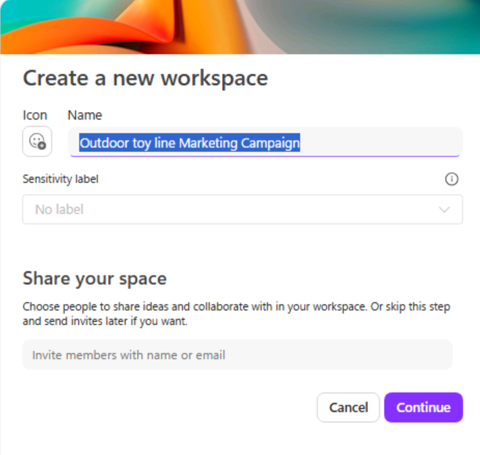
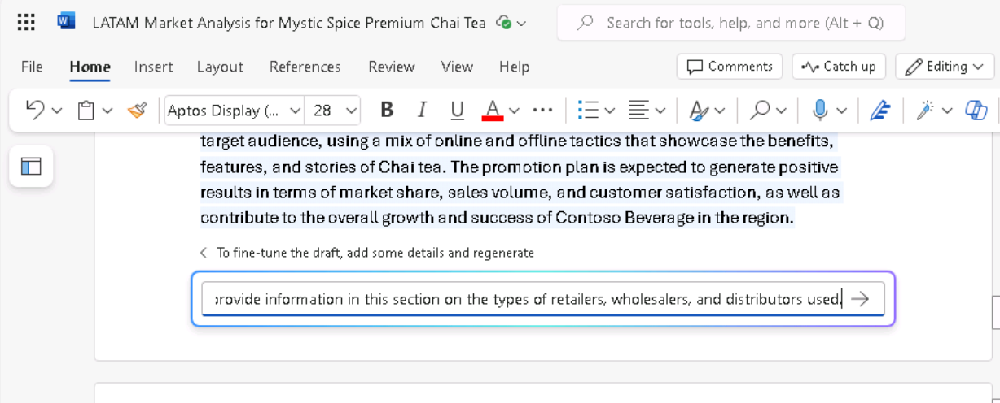
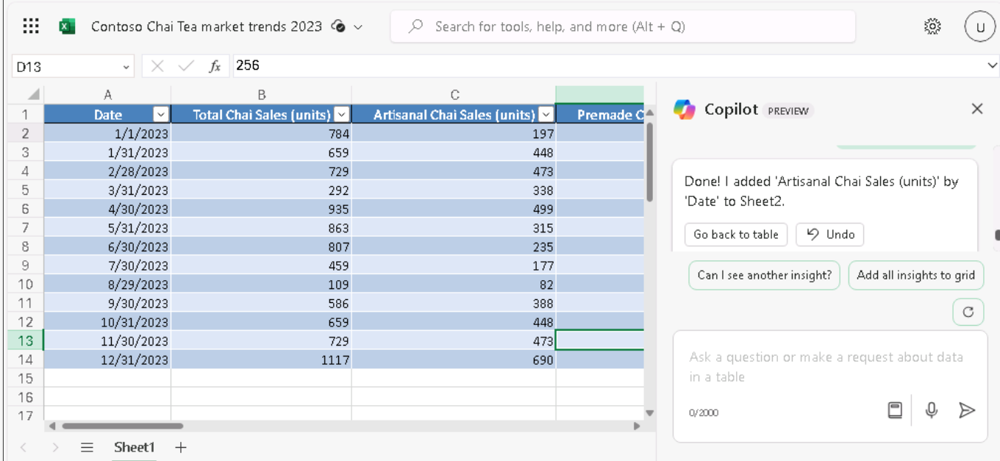

**实验室 04：增强您的员工能力 – Copilot – 营销**

**目的：**

Microsoft Copilot（在 Bing 中）是一种 generative AI 服务，仅基于
Microsoft Bing 搜索索引中来自公共 Web 的数据。它无权访问 Microsoft 365
Graph 中的组织资源或内容。

作为 Tailspin Toys
的市场研究总监，您希望对玩具行业进行市场分析，以提供给公司的高级领导团队
（SLT）。您的目标是确定市场上的最新趋势、消费者偏好和最受欢迎的玩具。

在本练习中，您将利用必应中的 Microsoft Copilot 聊天功能。使用 Microsoft
Copilot
时，在制作提示时提供上下文和资源非常重要。响应的质量取决于您如何通过遵循提示并选择正确的对话风格（More
Creative、More Balanced 或 More Precise）来制作请求。

1.  在 **Microsoft Edge** 中，打开一个新选项卡并输入以下
    URL： +++[**https://bing.com+++**](https://bing.com+++/)

2.  在 **Microsoft Bing** 中，在页面顶部的选项卡列表中，选择
    **Copilot**。这样做将打开 Microsoft Copilot。

**注意：**
如果您在页面顶部没有看到标签页列表，请按照以下步骤查看标签页列表。

- 确保您已使用 **Microsoft 365 凭据**（位于 **Resources** （资源）
  选项卡下） 登录。

- 启用选项 **Show menu bar** （以红色高亮显示）

3.  现在选择 **Copilot**。这样做将打开 Microsoft Copilot。

4.  在 **Copilot** 页面上，请注意页面顶部的切换开关，该开关允许您选择
    **Work** 或 **Web**。虽然您的请求是一项与工作相关的任务，但您需要
    Copilot 访问 Web 以对玩具行业进行市场分析。如有必要，请选择 **Web**
    切换开关。

**请注意：** 上一个 Copilot 版本中的对话语气选择器 **More Creative -
More Balanced- More Precise** 在最新版本中被删除。

5.  在提示字段中，输入以下提示，然后选择 **Submit** 图标：

++**I'm the Director for Market Research for Tailspin Toys, a U.S. based
toy manufacturer. Conduct a market analysis of the toy industry to
identify sales figures, the latest trends, consumer preferences, and the
most popular toys in the market**.++

6.  查看 Copilot
    生成的市场分析。您意识到，您提交的常规请求提供了基本信息，例如市场趋势、消费者偏好和玩具趋势。但是，您也对收集有关玩具行业的数据感兴趣，包括市场份额和消费者反馈。您意识到您在之前的提示中有点太模糊了，因为您没有请求这些特定信息。您还记得之前培训中的最佳实践建议 -
    保持礼貌并迭代、迭代、迭代。输入以下提示以修改市场分析：

++**That analysis was great. However, I'm also interested in including
data on the toy industry, including market share and consumer feedback.
Please amend your prior analysis to include this information.
Thanks**!++

7.  您意识到自己离目标越来越近了，但仍然缺少一些关键信息。在查看之前的提示后，您意识到您向
    Copilot 提供了总体目标、分析范围和所需的数据。但是，您未能要求
    Copilot 分析所有这些信息，以便您可以对 Tailspin Toys
    来年的商业计划做出明智的决定。要更正此缺点，请输入以下提示：

++**I think all the data is complete. With all the information that you
captured, please analyze the data and identify patterns, trends, and
insights that can help me determine what Tailspin Toy's business plan
should be for the upcoming year**++

8.  您真的很喜欢 Copilot 提供的信息。但是，由于该项目是您向公司的 SLT
    提供市场分析报告的第一次机会，因此您不确定您是否涵盖了他们可能感兴趣的所有内容。您决定让
    Copilot 帮助您确定是否遗漏了任何内容。输入以下提示：

++**Please analyze the data in this market analysis and business plan.
Is there any other information that a toy company would typically
request for market analysis and business plans that I failed to request?
If so, can you please amend your responses to include this information.
Thank you**!++

9.  根据 Copilot 提供的信息，您意识到通过让 Copilot
    包括对这些领域的分析，您可以真正最大限度地提高报告的有效性。要对报表进行最后的润色，请输入以下提示：

++**Please amend the market analysis to include an analysis of each of
these areas for the Toy industry. Also update the business plan that you
created for Tailspin Toys based on these insights. Thanks**!++

10. Copilot
    为您生成的市场分析和商业计划基于预定义的对话风格。它非常适合希望在精度和创造力之间取得平衡的用户。

如果您对使用**更具创意**的样式（更具想象力和创意的响应）的报表外观感到好奇，您可以调整提示以手动设置语气或焦点，具体取决于您想要精确、创意还是平衡的输出：

**注意事项：**

- **对于精确响应：**使用清晰、具体且注重细节的提示。表明您需要事实、简洁的答案，并注重准确性。

- **对于创意回答：**使用开放式、探索性或富有想象力的提示。鼓励集思广益或在需要原创性的地方提出解决方案。

- **对于平衡的回答：**使用适度的开放式提示，要求将事实细节与一些创意相结合。您可以要求提供分析和探索性意见。

**导出 Copilot 响应**

当您在 Bing 中使用 Microsoft Copilot
研究不同的事物或回答不同的问题时，您可能会认为某个响应非常好，以至于您想要将其保存以备将来参考。 

在 Copilot 的最终响应底部，选择 “**Copy**”
按钮以复制响应并将复制的响应粘贴到文本编辑器中。如果要将多个响应合并到一个文档中，则需要在文本编辑器中手动复制并粘贴每个响应并保存文件。

**注意：**您将看到一个 **Edit in Pages**
按钮，该按钮提供了更多功能并促进了团队协作。在本练习中，我们不会使用
**Edit in Pages**。实验室 \#06 中包括一个单独的实验室练习。

**练习 \#2：在 Loop 中使用 Copilot 集思广益营销活动创意**

您可以使用 Copilot in Loop
来集思广益新的营销策略、规划活动和开发内容。Loop 中的 Copilot
可以帮助您为博客文章、文章和其他内容类型生成想法。您可以输入主题和所需的内容样式，Copilot
可以建议提示以帮助您入门。

在上一次练习中，Tailspin Toys
对玩具行业进行了市场分析。基于该分析，该公司决定推出一个新的户外玩具系列。作为
Tailspin Toys
的营销项目经理，您的任务是为这一新玩具系列创建营销活动。在本练习中，您将使用
Copilot in Loop 为针对此新产品线的营销活动集思广益。

1.  在 **Microsoft 365** 中，如果它出现在左侧导航窗格中，请选择
    **Loop**。如果它没有出现在那里，请选择 **Mocrosoft 365**
    导航窗格上方左上角的 **App Launcher**，

2.  在 **Apps** （应用程序） 页面中，向下滚动以找到 **Loop**
    （循环），然后选择它。

**注意：**如果您在 Apps 页面中没有看到 **Loop** 列出，请选择 **More
apps**

3.  如果您看到 **Sign-in** （登录） 按钮，请使用用户凭证登录。

**注意：**登录后，关闭 Loop 浏览器窗口，然后再次从 Apps 页面打开 Loop。

4.  在 **Microsoft Loop** 中，默认情况下会显示 **Workspaces**
    选项卡。要为此项目创建新工作区，请选择导航菜单左上角的 +，然后选择
    **+New workspace** 按钮。

5.  在 **Create a new workspace** 窗口中，输入 +++**Outdoor toy line
    Marketing Campaign** +++ 作为您的工作区名称，然后选择出现的
    **Continue** 或 **Create** 按钮（取决于您的 Loop 版本）。

6.  在 **Add files to your workspace** （将文件添加到工作区）
    窗口中（根据您的 Loop 版本，此窗口可能会显示 **Workspace
    Switcher**），选择 **Create** （创建）。

7.  您现在位于新工作区的第一页。页面名称当前为
    **Untitled**。请注意，页面 （Untitled） 也显示在左侧导航窗格中。在  
    页面上，选择 **Untitled** 字段，然后将页面名称更改为 +++**Ideas for
    Outdoor toy
    campaigns**+++。请注意页面名称在导航窗格中的自动更新方式。

8.  在 **Just start typing...**字段中，输入正斜杠 （**/**）。

9.  在显示的下拉菜单中，在菜单顶部的 **Copilot** 部分下，选择 **Draft
    page content**。

10. 在出现的 **Copilot**
    窗口中，请注意提示字段下方显示的一行按钮。选择每个按钮（**Create、Brainstorm、Blueprint**
    和 **Describe**）。执行此作时，请注意它如何使用 Copilot
    可以协助的任务类型的示例预填充提示字段。由于本练习涉及头脑风暴，因此请选择
    **Brainstorm** 按钮。

11. 请注意 Copilot
    如何使用头脑风暴建议预填充提示字段。事实上，请多次选择
    **Brainstorm**
    按钮。请注意它每次都是如何建议新的头脑风暴提示的。Copilot
    循环播放了七个不同的头脑风暴示例，然后重新开始。这些示例的目的是让您了解
    Copilot
    可以帮助您集思广益的不拘一格的事物类型。对于本练习，请输入以下提示字段，然后选择
    **Submit** 图标：

++**Brainstorm 10 ideas for a marketing campaign for a new line of
outdoor toys**.++

12. 查看生成的想法列表。与其将所有信息都放在段落或列表形式中，不如将其汇总到表格中。此外，您还希望
    Copilot 为每个想法提供更具体的详细信息。

13. 在显示的 **Copilot** 窗格中，在 **Rewrite with Copilot**
    字段中输入以下提示，然后选择 **Submit** 图标：

++**That looks good. However, please rewrite the report by placing the
information in a table and provide more specific details for each
idea**.++

14. 请注意 Copilot 如何更改报告的格式。现在，您希望 Copilot
    将另一个概念添加到标题为 **Supermarket store promotions**
    的表中。为此，请输入以下提示：

++**Add an idea for Supermarket store promotions**.++

15. 当您要求 Copilot
    添加新想法时，它可能会将其添加到新表中，或者可能会将其添加到当前表的末尾。无论哪种方式，您在进一步思考后决定在超市推广户外玩具是一个糟糕的主意，并且您不再希望它包含在列表中。那么，您如何撤消刚刚所做的作呢？

在表格的右侧（您的原始表格或仅包含 **Supermarket store
promotions**创意的新表格），请注意 Copilot
如何跟踪您的每个提示。提示按顺序从最近的提示到第一个提示显示。更重要的是，请注意每个提示如何包含一个
**Undo**
图标。如果您对提示的结果不满意，可以撤消该提示以返回到该提示之前的草稿版本。由于您已决定不再希望在表中包括
**Supermarket store promotions**（超市商店促销），因此请选择该提示的
**Undo** （撤消） 图标。

16. 选择 “**Undo**” 图标后，请注意 Copilot
    如何删除提示并将您返回到第二个提示（将想法放在表格中）之后的草稿。此时，您已准备好让
    Copilot 从最好到最差对想法进行排序。输入以下提示以对想法进行排序：

++**Please sort the ideas in the table starting from most effective to
least effective**.++

**注意：**找到出现在概念列表上方图标托盘中的 **Sort**
图标（向上和向下箭头）。此选项只是按字母顺序对想法进行排序。您可以对每个
**Idea** 的名称或每个 **Details** 字段中的第一个单词执行排序。

17. 在查看已排序的想法后，您决定进行最后的更改。您希望 Copilot
    将效果最差的想法替换为名为 **Seasonal Promotions**
    的营销活动事件。您认为它非常适合专注于户外产品的新玩具系列。为此，请输入以下提示：

++**Please replace the final idea in the table with Seasonal
Promotions**.++

18. 当需要展示您在 Copilot in Loop
    的帮助下集思广益的营销活动创意列表时，您可以访问 Loop 自动保存的
    **Ideas for Outdoor toy campaigns** 工作区。

**练习 \#3：在 Word 中使用 Copilot 合并多个营销报告**

Word 中的 Copilot 是一款 AI
驱动的写作助手，可以帮助您重写现有内容，甚至将所选内容转换为表格。

作为 Contoso Beverage（Contoso， Ltd. 的一个部门）的拉丁美洲 （LATAM）
营销总监，您的产品经理向你提供了三个单独的报告，涉及该公司的 Mystic
Spice Premium Chai Tea
饮料。但是，您发现分析信息很困难，因为您不断地在文档之间来回跳转。

您决定将这些报告合并为一份 Mystic Spice Premium Chai Tea
的拉丁美洲市场分析报告。在本练习中，您将使用 Copilot
创建合并报告，对其进行审查，并可能使用 Copilot
可以在拉丁美洲柴茶市场上找到的其他信息对其进行更新。

1.  如果您在 Microsoft Edge 浏览器中打开了 Microsoft 365
    选项卡，请立即选择它; 否则，请打开一个新选项卡并输入以下
    URL：+++[https://www.office.com+++](https://www.office.com+++/) 以转到
    Microsoft 365 主页。

**注意：**您需要使用右侧**“Resources**”选项卡下提供的 **Microsoft 365
凭据**登录（如果出现提示）。

2.  在 **Microsoft 365** 导航窗格中，选择 **OneDrive** 将其打开。

3.  浏览到 **C：\LabFiles** 文件夹，选择以下文档的副本并将其上传到
    OneDrive。

    - **Mystic Spice Premium Chai Tea 产品描述。**

    - **2023 年Contoso Chai Tea 市场趋势。**

    - **Chai Tea 在拉丁美洲的推广计划。**

**注意：**如果您已按照**准备实验室执行**部分中的建议将所有实验室资产上传到
OneDrive，则可以跳过此步骤。

4.  在本练习中，您将从 Most Recently Used file （最近使用的文件）
    列表中访问文档。若要使文件显示在 MRU
    列表中，请打开每个文档，然后将其关闭。打开和关闭 OneDrive
    中的三个文件。

5.  在 **Microsoft 365** 中打开 **Microsoft
    Word**，然后打开一个新的空白文档。

6.  在空白文档顶部显示的 **Draft with Copilot**
    窗口中，输入以下提示，但在将三个文件链接到提示之前，不要选择
    **Generate** 按钮：

+++**I'm the LATAM Marketing Director for Contoso Beverage. Please
create a LATAM Market Analysis report for our Mystic Spice Premium Chai
Tea beverage. Combine the three attached files to create a report that
describes the product, analyzes the market trend for it, and includes a
promotion plan for Latin America**.+++

7.  现在，您必须将这三个文档附加到提示符中。在 **Draft with Copilot**
    窗口中，选择 **Reference your content**
    按钮。在显示的下拉菜单中，如果 **Mystic Spice Premium Chai Tea
    product description.docx**
    文件出现在文件列表中，请选择它。否则，请选择 **Browse files from
    cloud**（从云中浏览文件），从 **Recent** file （最近的文件）
    列表中选择文件，然后选择 **Attach** （附加）
    按钮。请注意文件在提示符中的显示方式。

8.  对 **Contoso Chai Tea market trends 2023.docx** 文件和 **Promotion
    Plan for Chai Tea in Latin America.docx**
    文件重复上一步。此时，提示符中应显示指向所有三个文件的链接。

9.  选择 **Generate** （生成）。这样做后，Copilot
    从三个文件中提取相关信息并起草一份报告，将它们合并为 Mystic Spice
    Premium Chai Tea 的单一市场分析报告。

10. 在查看了市场分析报告的初稿后，您意识到它缺少一些关键信息。您希望看到它包含一个标题为
    **Competitive Analysis** 的部分。您希望 Copilot
    分析竞争对手。为此，请在报告底部的 Copilot
    窗口中输入以下提示，然后选择 **Generate** 箭头：

+++**This report looks good. However, please add a section titled
Competitive Analysis. Review the beverage companies in Latin America
that sell Chai Tea and then provide information in this section on the
strengths and weaknesses of these competitors, their market share, and
their pricing strategies**.+++

11. 在查看了包含新 Competitive Analysis
    部分的报告草稿后，您意识到还缺少最后一件事。您希望 Copilot
    添加有关**分销渠道**的部分。本节应分析用于在拉丁美洲销售柴茶的分销渠道。为此，请在报告底部的
    Copilot 窗口中输入以下提示，然后选择 **Generate** 箭头：

+++**Nice job! One last thing. Please add a section titled Distribution
Channels. Review the distribution channels used to sell Chai Tea in
Latin America and then provide information in this section on the types
of retailers, wholesalers, and distributors used**.+++

12. 在查看了包含新 Distribution Channels
    部分的最新草稿后，您对报告感到满意，并准备保存它。在文档底部的
    Copilot 窗口中，选择 “**Keep it**” 按钮以将其从 Copilot 草稿转换为
    Word 文档。

13. 查看文档。如果您想进行任何手动更改，现在可以进行。对它感到满意后，如果您想保留文档以备将来参考，请随时将文档保存到您的
    OneDrive，或者直接丢弃它。

14. 在 Microsoft Edge 浏览器中关闭此选项卡。

**练习 \#4：在 Excel 中使用 Copilot 分析市场趋势电子表格**

Excel 中的 Copilot
是一个强大的工具，可以帮助营销专业人员轻松创建、编辑、理解和可视化他们的数据，并深入了解他们的业务。

Copilot 的 AI
驱动功能可以通过自动化重复性任务（分析季度业务结果、总结关键趋势、对表格应用颜色编码、创建模型、场景、过滤和排序以及单击鼠标添加图表）并提供有价值的见解来帮助他们做出明智的决策，从而帮助营销专业人员节省时间和精力。

作为 Contoso， Ltd. 的一个部门 Contoso Beverage
的营销总监，您收到了一份市场趋势电子表格，其中显示了 Contoso 的 Chai Tea
产品的每月活动。您希望使用 Excel 中 Copilot
的功能来分析报告并提供每月营销趋势的详细分析。

在本练习中，您将在 Excel 中使用 Copilot 来分析已定义 Excel
表的市场趋势电子表格。

1.  如果您在 Microsoft Edge 浏览器中打开了 Microsoft 365
    选项卡，请立即选择它;否则，请打开一个新选项卡并输入以下
    URL：+++[https://www.office.com+++](https://www.office.com+++/) 以转到
    Microsoft 365 主页。

**注意：**您需要使用右侧 “**Resources**” 选项卡下提供的 **Microsoft 365
凭据**登录（如果出现提示）。

2.  在 **Microsoft 365** 导航窗格中，选择 **OneDrive** 将其打开。

3.  浏览到 C：\LabFiles 文件夹，选择 **Contoso Chai Tea Market trends
    2023** 电子表格的副本并将其上传到
    **OneDrive**，然后打开并关闭该文件以将其放入最近使用的 （MRU）
    文件列表中。

**注意：**如果您已按照**准备实验室执行**中的建议将所有实验室资产上传到
OneDrive，则可以跳过此步骤。

4.  在 **Microsoft 365** 主页上，选择左侧导航窗格中的 **Excel** 图标。

5.  在 **Excel** 中，在 **文件** 页上，从文件列表中选择 **Contoso Chai
    Tea market trends 2023.xlsx**。

6.  选择功能区右侧的 **Copilot** 选项。

7.  在显示的 **Copilot** 窗格中，有几个预定义的提示可供您选择。选择
    **Show data insights** （显示数据见解） 按钮。

8.  请注意它生成的数据透视图。当我们测试此练习时，Copilot
    始终**按日期划分的社交媒体参与度（浏览量）**的折线图。Copilot
    为您创建了什么类型的图表？在 Copilot 为您创建的图表下方，选择 **+Add
    to a new sheet** 按钮。

9.  尽管 Copilot 表示它将图表添加到了第 2 页，但第 2
    页在电子表格中不可见。

10. 尝试使用最大化的 excel 工作表并重复步骤 11。**Add to sheet**
    **（添加到工作表） 功能**现在运行正常。

11. 选择**Sheet 2**。查看 Copilot 创建的新数据表。Copilot
    包括电子表格中的图形和数据列，该电子表格是此图形的基础。将光标悬停在图表上，并注意出现的窗口，该窗口指示
    Copilot 生成的图表类型。

12. 请注意，在 Copilot
    窗格中，预定义提示列表不再显示。出现这种情况是因为 Copilot
    尚不适用于数据透视表（请注意指示此问题的消息）。选择 **Sheet
    1**（工作表 1），这会将您返回到 Excel
    表格。请注意预定义提示的显示方式。

13. 在提示字段上方显示的预定义提示中，选择 **Show suggestions for
    formula columns** （显示公式列的建议） 按钮。

14. 请注意 Copilot 提供的建议。下图显示了 Copilot 在测试期间提供的建议。

15. 在您收到的建议中，选择 **Explain formula**（解释公式）下拉箭头。查看
    Copilot 描述计算的说明。选择 **+Insert Column** 按钮将此列插入到
    Excel 表格中。

16. 请注意 Copilot 如何将此数据列添加到工作**表 1** 中 Excel
    表格的末尾。这个功能让您感兴趣吗？您可能想看看它提供了哪些其他公式建议。再次选择
    **Show suggestions for formula columns** （显示公式列的建议）
    按钮。请注意这个建议。选择 **+Insert Column** 按钮将此建议的列插入到
    Excel 表格中。

17. 在提示字段上方显示的预定义提示中，选择 **How can I highlight，
    filter， and sort data？**按钮。

18. 记下您可以执行的作列表。

19. 此时，您对 Copilot
    显示的预定义提示不再感兴趣。因此，您希望看到一组新的提示。选择提示字段上方显示的
    **Refresh** 按钮。

20. 查看现在显示的预定义提示的修订列表。下图显示了显示的提示示例。

21. 本练习的目的是了解 Copilot
    可以执行的各种类型的预定义作。因此，请选择不同的提示以查看会发生什么。例如：

    - 如果出现 **Sort** 提示，请立即选择它。请注意 Copilot
      如何为您对数据进行排序。

    - 如果出现 **Bold** 提示，请立即选择它。请注意 Copilot
      如何加粗它提到的列中的项目，并保留任何其他非粗体项目。

22. 再次选择提示字段上方显示的 **Refresh** 按钮。

23. 查看它显示的新提示集。多次选择 **Refresh** 按钮以查看 Copilot
    提供的不同类型的提示。

24. 随意选择任何其他提示以查看 Copilot 的作用。完成后，关闭 Microsoft
    Edge 浏览器选项卡。

**总结：**

在此实验室中，您使用了

- Microsoft Copilot（必应/Web 模式）分析市场趋势

- Copilot in Loop 为新产品线生成营销活动创意。

- Word 中的 Copilot，用于将多个营销报告合并为一个有凝聚力的文档。

- Excel 中的 Copilot 用于分析电子表格中的市场趋势。

通过这些活动，您可以简化流程并提高营销活动的整体效果。
