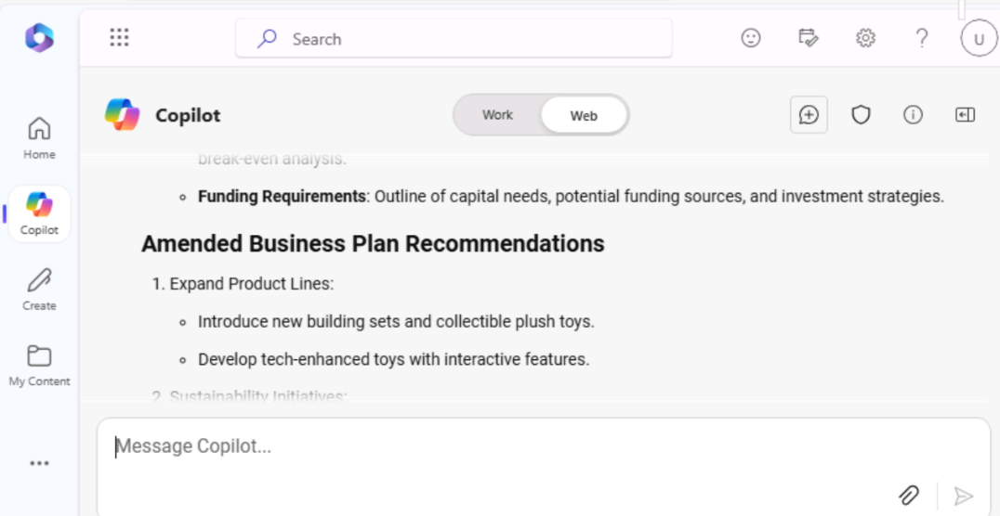

**Lab 04: Potenzia la tua forza lavoro – Copilot – Marketing**

**Obiettivo:**

Microsoft Copilot (all'interno di Bing) è un servizio di intelligenza
artificiale generativa basato sui data del Web pubblico solo nell'indice
di ricerca di Microsoft Bing. Non ha accesso alle risorse o ai contenuti
dell'organizzazione all'interno di Microsoft 365 Graph.

In qualità di direttore delle ricerche di mercato presso Tailspin Toys,
desideri condurre un'analisi di mercato dell'industria dei giocattoli da
fornire al Senior Leadership Team (SLT) dell'azienda. Il suoi obiettivo
è identificare le ultime tendenze, le preferenze dei consumatori e i
giocattoli più popolari sul mercato.

In questo esercizio verrà utilizzata la funzionalità di chat di
Microsoft Copilot in Bing. Quando si usa Microsoft Copilot, è importante
fornire contesto e risorse quando si creano i prompt. La qualità della
risposta dipende dal modo in cui crei la richiesta seguendo i
suggerimenti e scegliendo il giusto stile di conversazione (più
creativo, più equilibrato o più preciso).

1.  In **Microsoft Edge** aprire una nuova scheda e immettere l'URL
    seguente: +++[**https://bing.com+++**](https://bing.com+++/)

2.  In **Microsoft Bing**, nell'elenco delle schede nella parte
    superiore della pagina, selezionare **Copilot**. In questo modo si
    apre Microsoft Copilot.

**Nota:** se non vedi l'elenco delle schede nella parte superiore della
pagina, segui i passaggi seguenti per visualizzare l'elenco delle
schede.

- Assicurarsi di aver effettuato l'accesso utilizzando le di **Microsoft
  365 credentials** (disponibili nella scheda **Resources**).

- Abilita l'opzione **Show menu bar** (evidenziata in rosso)

3.  Ora seleziona **Copilot**. In questo modo si apre Microsoft Copilot.

4.  Nella pagina **Copilot**, notare l'interruttore nella parte
    superiore della pagina che consente di selezionare **Work** o
    **Web**. Sebbene la tua richiesta sia un'attività legata al lavoro,
    hai bisogno di Copilot per accedere al Web per condurre la sua
    analisi di mercato dell'industria dei giocattoli. Se necessario,
    selezionare l' interruttore **Web**.

**Nota**: Il selettore del tono di conversazione **More Creative -More
Balanced- More precise** presente nella versione precedente di Copilot
viene eliminato nell'ultima versione.

5.  Nel campo del prompt, inserisci il seguente prompt e quindi
    seleziona l' icona **Submit**:

++**I'm the Director for Market Research for Tailspin Toys, a U.S. based
toy manufacturer. Conduct a market analysis of the toy industry to
identify sales figures, the latest trends, consumer preferences, and the
most popular toys in the market**.++

6.  Esamina l'analisi di mercato generata da Copilot. Ti rendi conto che
    una richiesta generica come quella che hai inviato fornisce
    informazioni di base come le tendenze del mercato, le preferenze dei
    consumatori e le tendenze dei giocattoli. Tuttavia, sei anche
    interessato a raccogliere data sull'industria dei giocattoli,
    inclusa la quota di mercato e il feedback dei consumatori. Ti sei
    reso conto di essere stato un po' troppo vago nella tua richiesta
    precedente poiché non sei riuscito a richiedere queste informazioni
    specifiche. Ricordi i suggerimenti sulle best practice del suoi
    corso di formazione precedente: sii educato e ripeti, ripeti,
    ripeti. Inserisci il seguente prompt per modificare l'analisi di
    mercato:

++**That analysis was great. However, I'm also interested in including
data on the toy industry, including market share and consumer feedback.
Please amend your prior analysis to include this information.
Thanks**!++

\<

7.  Ti rendi conto che ti stai avvicinando al suoi obiettivo, ma ti
    mancano ancora alcune informazioni chiave. Dopo aver esaminato i
    prompt precedenti, ti sei reso conto di aver fornito a Copilot il
    suoi obiettivo generale, l'ambito dell'analisi e i data di cui avevi
    bisogno. Tuttavia, non hai chiesto a Copilot di analizzare tutte
    queste informazioni in modo da poter prendere decisioni informate
    sul piano aziendale di Tailspin Toys per il prossimo anno. Per
    correggere questa mancanza, immettere il seguente messaggio di
    richiesta:

++**I think all the data is complete. With all the information that you
captured, please analyze the data and identify patterns, trends, and
insights that can help me determine what Tailspin Toy's business plan
should be for the upcoming year**++

8.  Ti piacciono molto le informazioni fornite da Copilot. Tuttavia,
    poiché questo progetto è la tua prima opportunità per fornire un
    rapporto di analisi di mercato all'SLT della tua azienda, non sei
    sicuro di coprire tutto ciò che potrebbe essere di loro interesse.
    Decidi di chiedere a Copilot di aiutarti a determinare se ti manca
    qualcosa. Immettere il seguente messaggio di richiesta:

++**Please analyze the data in this market analysis and business plan.
Is there any other information that a toy company would typically
request for market analysis and business plans that I failed to request?
If so, can you please amend your responses to include this information.
Thank you**!++

9.  Sulla base delle informazioni fornite da Copilot, ci si rende conto
    che è possibile massimizzare l'efficacia dei report includendo
    un'analisi di queste aree. Per dare il tocco finale ai suoii report,
    inserisci il seguente prompt:

++**Please amend the market analysis to include an analysis of each of
these areas for the Toy industry. Also update the business plan that you
created for Tailspin Toys based on these insights. Thanks**!!++

10. L'analisi di mercato e il business plan che Copilot ha generato per
    te si basavano su uno stile di conversazione predefinito. È ideale
    per gli utenti che desiderano un equilibrio tra precisione e
    creatività.

Se sei curioso di sapere come apparirebbero i report utilizzando lo
stile **More Creative** (risposte più fantasiose e creative), puoi
regolare i suoii prompt per impostare manualmente il tono o la messa a
fuoco, a seconda che tu voglia ottenere risultati precisi, creativi o
bilanciati:

**Punti da notare**:

- **Per risposte precise**: utilizza suggerimenti chiari, specifici e
  orientati ai dettagli. Indica che desideri risposte concrete e concise
  con particolare attenzione all'accuratezza.

- **Per le risposte creative**: usa suggerimenti aperti, esplorativi o
  fantasiosi. Incoraggia il brainstorming o suggerisci soluzioni dove è
  necessaria l'originalità.

- **Per risposte equilibrate:** usa suggerimenti moderatamente aperti
  che richiedono un mix di dettagli fattuali con un po' di creatività. È
  possibile richiedere sia input analitici che esplorativi.

**Esportazione di una risposta Copilot**

Quando si utilizza Microsoft Copilot in Bing per ricercare elementi
diversi o rispondere a domande diverse, è possibile decidere che una
risposta è così valida da volerla salvare per riferimento futuro.

Nella parte inferiore della risposta finale di Copilot, selezionare il
pulsante **Copy** per copiare la risposta e incollare la risposta
copiata in un editor di testo. Se si desidera consolidare più risposte
in un unico documento, è necessario copiare e incollare manualmente ogni
risposta in un editor di testo e salvare il file.

**Nota**: vedrai un pulsante **Edit in Pages** che offre più
funzionalità e facilita la collaborazione in team. In questo esercizio
non utilizzeremo **Edit in Pages**. Un esercizio di laboratorio separato
è incluso nel Lab \#06.

**Esercizio \#2: Brainstorming di idee per campagne di marketing
utilizzando Copilot in Loop**

Puoi utilizzare Copilot in Loop per fare brainstorming su nuove
strategie di marketing, pianificare campagne e sviluppare contenuti.
Copilot in Loop può aiutarti a generare idee per post di blog, articoli
e altri tipi di contenuti. È possibile inserire gli argomenti e lo stile
di contenuto desiderato e Copilot può suggerire suggerimenti per
aiutarti a iniziare.

Nell'esercizio precedente, Tailspin Toys ha condotto un'analisi di
mercato dell'industria dei giocattoli. Sulla base di tale analisi,
l'azienda ha deciso di introdurre una nuova linea di giocattoli per
esterni. In qualità di Marketing Program Manager di Tailspin Toys, hai
il compito di creare campagne di marketing per questa nuova linea di
giocattoli. In questo esercizio, utilizzerai Copilot in Loop per fare un
brainstorming di idee per una campagna di marketing mirata a questa
nuova linea di prodotti.

1.  In **Microsoft 365** selezionare **Loop** se viene visualizzato nel
    riquadro di spostamento a sinistra. Se non viene visualizzato,
    seleziona **App Launcher** in alto a sinistra, appena sopra il
    riquadro di navigazione di **Microsoft 365,**

2.  Nella pagina **App**, scorri verso il basso per individuare
    **Loop,** quindi selezionalo.

**Nota**: se non vedi **l'**opzione **Loop** nell'elenco delle app,
seleziona **More apps**

3.  Se viene visualizzato il pulsante **Sign-in**, accedi utilizzando le
    credenziali utente.

**Nota**: dopo aver effettuato l'accesso, chiudi la finestra del browser
Loop e apri nuovamente Loop dalla pagina App.

4.  In **Microsoft Loop**, la scheda **Workspaces** viene visualizzata
    per impostazione predefinita. Si desidera creare una nuova area di
    lavoro per questo progetto, selezionare **+** in alto a sinistra nel
    menu di navigazione, quindi selezionare il pulsante **+New
    workspace.**

5.  Nella finestra **Create a new workspace**, inserisci +++**Outdoor
    toy line Marketing Campaign**+++ per il nome dell'area di lavoro,
    quindi seleziona il pulsante **Continue** o **Create** visualizzato
    (a seconda della versione di Loop).

6.  Nella finestra **Add files to your workspace** (a seconda della
    versione di Loop, questa finestra potrebbe indicare **Workspace
    Switcher**), seleziona **Create**.

7.  A questo punto ci si trova nella prima pagina della nuova area di
    lavoro. Il nome della pagina è attualmente **Untitled**. Si noti che
    la pagina (Senza titolo) viene visualizzata anche nel riquadro di
    navigazione a sinistra. Nel corpo principale della pagina, seleziona
    nel campo **Untitled** e cambia il nome della pagina in +++**Ideas
    for Outdoor toy campaigns**+++. Si noti che il nome della pagina
    viene aggiornato automaticamente nel riquadro di spostamento.

8.  Nella sezione **Just start typing...** , immettere una barra
    **(/).**

9.  Nel menu a discesa visualizzato, nella sezione **Copilot** nella
    parte superiore del menu, selezionare **Draft page content**.

10. Nella finestra di **Copilot** visualizzata, notare la riga di
    pulsanti visualizzata sotto il campo del prompt. Seleziona ciascun
    pulsante (**Create**, **Brainstorm**, **Blueprint** e **Describe**).
    Quando si esegue questa operazione, si noti come precompila il campo
    del prompt con un esempio del tipo di attività in cui Copilot può
    essere assistito. Poiché questo esercizio riguarda il brainstorming,
    seleziona il pulsante **Brainstorm**.

11. Si noti come Copilot precompila il campo del prompt con un
    suggerimento di brainstorming. In effetti, seleziona il pulsante
    **Brainstorm** più volte. Si noti come suggerisce ogni volta un
    nuovo suggerimento di brainstorming. Copilot passa in loop
    attraverso sette diversi esempi di brainstorming e poi ricomincia da
    capo. Lo scopo di questi esempi è darti un'idea dei tipi eclettici
    di cose che Copilot può aiutarti a fare brainstorming. Per questo
    esercizio, immettere il seguente campo di richiesta e selezionare
    l'icona **Submit**:

++**Brainstorm 10 ideas for a marketing campaign for a new line of
outdoor toys**.++

12. Esamina l'elenco di idee generato. Piuttosto che avere tutte le
    informazioni in un paragrafo o in un elenco, si preferisce
    riassumerle in una tabella. Inoltre, vuoi anche che Copilot fornisca
    dettagli più specifici per ogni idea.

13. Nel riquadro **Copilot** visualizzato, immettere il seguente prompt
    nel campo **Rewrite with Copilot** e selezionare l' icona
    **Submit**:

++**That looks good. However, please rewrite the report by placing the
information in a table and provide more specific details for each idea**
**idea**.++

14. Si noti come Copilot ha modificato la formattazione del report. Ora
    vuoi che Copilot aggiunga un'altra idea alla tabella intitolata
    **Supermarket store promotions**. A tale scopo, immettere il
    seguente messaggio di richiesta:

++**Add an idea for Supermarket store promotions**.++

15. Quando si chiede a Copilot di aggiungere una nuova idea, è possibile
    aggiungerla a una nuova tabella o alla fine della tabella corrente.
    In ogni caso, dopo un'ulteriore riflessione, decidi che promuovere i
    giocattoli all'aperto in un supermercato è una pessima idea e non
    vuoi più che siano inclusi nell'elenco. Quindi, come puoi annullare
    ciò che hai appena fatto?

A destra della tabella (la tabella originale o una nuova con solo l'idea
delle promozioni del **Supermarket store promotions**), nota come
Copilot tiene traccia di ciascuno dei suoii prompt. I prompt vengono
visualizzati dal prompt più recente fino al primo, in ordine
sequenziale. Ancora più importante, nota come ogni prompt includa un
'icona **Undo**. Se non sei soddisfatto dei risultati di un prompt, puoi
annullarlo per tornare alla versione della bozza precedente a quel
prompt. Poiché hai deciso di non voler più includere le **Supermarket
store promotions** nella tabella, seleziona l' icona **Undo** per quel
prompt.

16. Dopo aver selezionato l'icona **Undo**, notare come Copilot abbia
    eliminato il prompt e sia tornato alla bozza dopo il secondo prompt
    che ha inserito le idee in una tabella. A questo punto, sei pronto
    per fare in modo che Copilot ordini le idee dal migliore al
    peggiore. Immettere il seguente messaggio di richiesta per ordinare
    le idee:

++**Please sort the ideas in the table starting from most effective to
least effective**.++

**Nota:** individua l'icona **Sort** (le frecce su e giù) che appare
nella barra delle icone sopra l'elenco delle idee. Questa opzione ordina
semplicemente le idee in sequenza alfabetica. È possibile eseguire
l'ordinamento in base al nome di ogni **Idea** o alla prima parola in
ogni campo **Details**.

17. Dopo aver esaminato le idee ordinate, si decide di apportare
    un'ultima modifica. Vuoi che Copilot sostituisca l'idea meno
    efficace con un evento della campagna intitolato **Seasonal
    Promotions.** Pensi che sia una scelta naturale per una nuova linea
    di giocattoli che si concentra sui prodotti per l'outdoor. A tale
    scopo, immettere il seguente messaggio di richiesta:

++**Please replace the final idea in the table with Seasonal
Promotions**.++

18. Quando è il momento di presentare l'elenco delle idee per le
    campagne di marketing che hai raccolto con l'aiuto di Copilot in
    Loop, puoi accedere all'area di lavoro **Ideas for Outdoor toy
    campaigns** che Loop ha salvato automaticamente.

**Esercizio \#3: Consolidare più report di marketing utilizzando Copilot
in Word**

Copilot in Word, un assistente di scrittura basato sull'intelligenza
artificiale, può aiutarti a riscrivere i contenuti esistenti o persino a
trasformare i contenuti selezionati in una tabella.

In qualità di direttore marketing per l'America Latina (LATAM) di
Contoso Beverage, una divisione di Contoso, Ltd., il suoi product
manager ti ha fornito tre report separati relativi alla bevanda Mystic
Spice Premium Chai Tea dell'azienda. Tuttavia, hai difficoltà ad
analizzare le informazioni, poiché salti costantemente avanti e indietro
tra i documenti.

Decidi di combinare i rapporti in un unico rapporto di analisi di
mercato LATAM per Mystic Spice Premium Chai Tea. In questo esercizio
utilizzerai Copilot per creare il report combinato, esaminarlo ed
eventualmente aggiornarlo con altre informazioni che Copilot può trovare
sul mercato del tè Chai in America Latina.

1.  Se hai una scheda di Microsoft 365 aperta nel suoi browser Microsoft
    Edge, selezionala ora; in caso contrario, apri una nuova scheda e
    inserisci il seguente URL:
    +++[https://www.office.com+++](https://www.office.com+++/) per
    andare alla home page di Microsoft 365.

**Nota**: è necessario accedere (se richiesto) utilizzando le di
**Microsoft 365 Credentials** fornite nella scheda **Resources** a
destra.

2.  Nel riquadro di spostamento di **Microsoft 365,** selezionare
    **OneDrive** per aprirlo.

3.  Passare alla cartella **C:\LabFiles** per selezionare e caricare una
    copia dei seguenti documenti in OneDrive.

    - **Mystic Spice Premium Chai Tea product description.**

    - **Contoso Chai Tea market trends 2023.**

    - **Promotion Plan for Chai Tea in Latin America.**

**Nota**: se sono già state caricate tutte le risorse lab in OneDrive,
come suggerito nella sezione **Preparing for lab execution**, è
possibile ignorare questo passaggio.

4.  In questo esercizio, accederai ai documenti dall'elenco dei file
    utilizzati più di recente. Per fare in modo che i file vengano
    visualizzati nell'elenco MRU, aprire ogni documento e quindi
    chiuderlo. Apri e chiudi ciascuno dei tre file in OneDrive.

5.  In **Microsoft 365** aprire **Microsoft Word** e quindi aprire un
    nuovo documento vuoto.

6.  Nella finestra **Draft with Copilot** visualizzata nella parte
    superiore del documento vuoto, immettere il seguente prompt, ma non
    selezionare il pulsante **Generate** fino a quando non si collegano
    i tre file al prompt:

+++**I'm the LATAM Marketing Director for Contoso Beverage. Please
create a LATAM Market Analysis report for our Mystic Spice Premium Chai
Tea beverage. Combine the three attached files to create a report that
describes the product, analyzes the market trend for it, and includes a
promotion plan for Latin America**.+++

7.  A questo punto è necessario allegare i tre documenti al prompt.
    Nella finestra **Draft with Copilot**, selezionare il pulsante
    **Reference your content**. Nel menu a discesa che appare, se il
    file del **Mystic Spice Premium Chai Tea product description.docx**
    appare nell'elenco dei file, selezionalo. In caso contrario,
    selezionare **Browser files from cloud**, selezionare il file dall'
    elenco File **Recent** e quindi selezionare il pulsante **Attach**.
    Si noti come il file viene visualizzato nel prompt.

8.  Ripetere il passaggio precedente sia per il file **Contoso Chai Tea
    market trends 2023.docx** che per il file del **Promotion Plan for
    Chai Tea in Latin America.docx.** A questo punto, i collegamenti a
    tutti e tre i file dovrebbero apparire nel prompt.

9.  Selezionare **Generate**. Dopo averlo fatto, Copilot estrae le
    informazioni pertinenti dai tre file e redige un rapporto che li
    combina in un unico rapporto di analisi di mercato per Mystic Spice
    Premium Chai Tea.

10. Dopo aver esaminato questa prima bozza del rapporto di analisi di
    mercato, riconosci che mancano alcune informazioni critiche.
    Vorresti che includesse una sezione intitolata della **Competitive
    Analysis**. Vuoi che Copilot analizzi la concorrenza. A tale scopo,
    immettere il seguente prompt nella finestra Copilot nella parte
    inferiore del report, quindi selezionare la freccia **Generate:**

+++**This report looks good. However, please add a section titled
Competitive Analysis. Review the beverage companies in Latin America
that sell Chai Tea and then provide information in this section on the
strengths and weaknesses of these competitors, their market share, and
their pricing strategies**.+++

11. Dopo aver esaminato questa seconda bozza del report che contiene la
    nuova sezione Analisi della concorrenza, ci si rende conto che manca
    un'ultima cosa. Si desidera che Copilot aggiunga una sezione sui di
    **Distribution Channels**. Questa sezione dovrebbe analizzare i
    canali di distribuzione utilizzati per vendere il tè Chai in America
    Latina. A tale scopo, immettere il seguente prompt nella finestra
    Copilot nella parte inferiore del report, quindi selezionare la
    freccia **Generate:**

+++**Nice job! One last thing. Please add a section titled Distribution
Channels. Review the distribution channels used to sell Chai Tea in
Latin America and then provide information in this section on the types
of retailers, wholesalers, and distributors used**+++

12. Dopo aver esaminato quest'ultima bozza che contiene la nuova sezione
    Canali di distribuzione, sei soddisfatto del rapporto e sei pronto
    per salvarlo. Nella finestra di Copilot nella parte inferiore del
    documento, selezionare il pulsante **Keep it** per convertirlo da
    una bozza di Copilot a un documento Word.

13. Esamina il documento. Se si desidera apportare modifiche manuali, è
    possibile farlo ora. Una volta che sei soddisfatto, sentiti libero
    di salvare il documento sul suoi OneDrive se desideri conservarlo
    per riferimento futuro o semplicemente di eliminarlo.

14. Chiudi questa scheda nel browser Microsoft Edge.

**Esercizio \#4: Analizzare un foglio di calcolo dell'andamento del
mercato utilizzando Copilot in Excel**

Copilot in Excel è un potente strumento che può aiutare i professionisti
del marketing a creare, modificare, comprendere e visualizzare i propri
data con facilità e ottenere informazioni dettagliate sulla propria
attività.

Le funzionalità basate sull'intelligenza artificiale di Copilot possono
aiutare i professionisti del marketing a risparmiare tempo e fatica
automatizzando le attività ripetitive (analizzare i risultati aziendali
trimestrali, riassumere le tendenze chiave, applicare la codifica a
colori alle tabelle, creare modelli, scenari, filtrare e ordinare e
aggiungere grafici con un clic del mouse) e fornendo preziose
informazioni che possono aiutarli a prendere decisioni informate.

In qualità di direttore marketing di Contoso Beverage, una divisione di
Contoso, Ltd., hai ricevuto un foglio di calcolo delle tendenze di
mercato che mostra l'attività mensile per il prodotto Chai Tea di
Contoso. Si desidera utilizzare le funzionalità di Copilot in Excel per
analizzare il report e fornire un'analisi dettagliata delle tendenze di
marketing mensili.

In questo esercizio, utilizzerai Copilot in Excel per analizzare un
foglio di calcolo delle tendenze di mercato in cui è già definita una
tabella Excel.

1.  Se hai una scheda di Microsoft 365 aperta nel suoi browser Microsoft
    Edge, selezionala ora; in caso contrario, apri una nuova scheda e
    inserisci il seguente URL:
    +++[https://www.office.com+++](https://www.office.com+++/) per
    andare alla home page di Microsoft 365.

**Nota**: è necessario accedere (se richiesto) utilizzando le **di
Microsoft 365 Credentials** fornite nella scheda **Resources** a destra.

2.  Nel riquadro di spostamento di **Microsoft 365,** selezionare
    **OneDrive** per aprirlo.

3.  Passare alla cartella **C:\LabFiles** per selezionare e caricare una
    copia del foglio di calcolo delle tendenze di **Contoso Chai Tea
    market trends 2023** in **OneDrive**, quindi aprire e chiudere il
    file per inserirlo nell'elenco dei file utilizzati più di recente
    (MRU).

**Nota**: se sono già state caricate tutte le risorse lab in OneDrive,
come suggerito in **Preparing for the lab execution**, è possibile
ignorare questo passaggio.

4.  Nella home page di **Microsoft 365** selezionare l' icona di
    **Excel** nel riquadro di spostamento a sinistra.

5.  In **Excel**, nella pagina **File**, selezionare **Contoso Chai Tea
    market trends 2023.xlsx** dall'elenco dei file.

6.  Selezionare l' opzione **Copilot** sul lato destro della barra
    multifunzione.

7.  Nel riquadro **Copilot** visualizzato, sono disponibili diversi
    prompt predefiniti tra cui scegliere. Seleziona il pulsante **Show
    data insights.**

8.  Prendere nota del grafico pivot generato. Quando abbiamo testato
    questo esercizio, Copilot ha sempre creato un grafico a linee del
    **Social Media Engagement (Views) by Date**. Che tipo di grafico ha
    creato Copilot per te? Sotto il grafico creato da Copilot, seleziona
    il pulsante **+Add to a new sheet**.

9.  Sebbene Copilot affermi di aver aggiunto il grafico al foglio 2, il
    foglio 2 non è visibile nel foglio di calcolo.

10. Prova con il foglio excel ingrandito e ripeti il passaggio 11. La
    **Add to sheet function** ora funzionava bene.

11. Selezionare il **Sheet 2**. Esaminare il nuovo foglio data creato da
    Copilot. Copilot ha incluso sia il grafico che la colonna di data
    del foglio di calcolo che era la base di questo grafico. Posiziona
    il cursore sul grafico e osserva la finestra che appare che indica
    il tipo di grafico generato da Copilot.

12. Si noti che nel riquadro Copilot non viene più visualizzato l'elenco
    dei prompt predefiniti. Questa situazione si verifica perché Copilot
    non funziona ancora nelle tabelle pivot (notare il messaggio che
    indica questo problema). Seleziona **Sheet 1**, che ti riporta alla
    tabella di Excel. Si noti come vengono visualizzati i messaggi di
    richiesta predefiniti.

13. Nei prompt predefiniti visualizzati sopra il campo del prompt,
    selezionare il pulsante **Show suggestions for formula columns**.

14. Si noti il suggerimento fornito da Copilot. L'immagine seguente
    mostra il suggerimento fornito da Copilot durante i test.

15. Nel suggerimento ricevuto, seleziona la freccia a discesa **Explain
    formula**. Rivedere la spiegazione di Copilot che descrive il
    calcolo. Seleziona il pulsante **+Insert Column** per inserire
    questa colonna nella tabella di Excel.

16. Si noti come Copilot abbia aggiunto questa colonna di data alla fine
    della tabella Excel nel **Sheet 1**. Questa funzione ti intriga?
    Potresti voler vedere quali altri suggerimenti di formule fornisce.
    Seleziona di nuovo il pulsante **Show suggestions for formula
    columns**. Prendi nota del suggerimento. Seleziona il pulsante
    **+Insert Column** per inserire questa colonna suggerita nella
    tabella di Excel.

17. Nei prompt predefiniti visualizzati sopra il campo del prompt,
    selezionare il pulsante **How can I highlight, filter and sort
    data**?.

18. Prendi nota dell'elenco delle azioni che puoi intraprendere.

19. A questo punto, i prompt predefiniti visualizzati da Copilot non
    sono più interessati. Pertanto, si desidera visualizzare una nuova
    serie di prompt. Seleziona il pulsante **Refresh** che appare sopra
    il campo del prompt.

20. Esaminare l'elenco rivisto dei prompt predefiniti visualizzati.
    L'immagine seguente mostra esempi di prompt visualizzati.

21. Lo scopo di questo esercizio è quello di avere un'idea dei vari tipi
    di azioni predefinite che Copilot può eseguire. Pertanto, seleziona
    diversi prompt per vedere cosa succede. Per esempio:

    - Se viene visualizzato un prompt **Sort,** selezionalo ora. Si noti
      come Copilot ha ordinato i data per l'utente.

    - Se viene visualizzato un messaggio in **Bold**, selezionarlo ora.
      Si noti come Copilot abbia messo in grassetto gli elementi nella
      colonna che menzionava e abbia lasciato tutti gli altri non in
      grassetto.

22. Selezionare nuovamente il pulsante **Refresh** visualizzato sopra il
    campo del prompt.

> 

23. Esaminare il nuovo set di prompt visualizzato. Selezionare più volte
    il pulsante **Refresh** per visualizzare i diversi tipi di prompt
    forniti da Copilot.

24. Sentiti libero di selezionare qualsiasi altro prompt per vedere cosa
    fa Copilot. Al termine, chiudi la scheda del browser Microsoft Edge.

**Sommario:**

In questo laboratorio è stato utilizzato

- Microsoft Copilot (modalità Bing/Web) per analizzare le tendenze del
  mercato

- Copilot in Loop per generare idee per campagne di marketing per una
  nuova linea di prodotti.

- Copilot in Word per combinare più report di marketing in un documento
  coerente.

- Copilot in Excel per analizzare le tendenze del mercato all'interno di
  un foglio di calcolo.

Attraverso queste attività, puoi semplificare i processi e migliorare
l'efficacia complessiva delle tue campagne di marketing.
