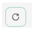

**Laboratorio 04: Empodere a su fuerza de trabajo – Copilot –
Marketing**

**Objetivo:**

Microsoft Copilot (dentro de Bing) es un servicio de IA generativa
basado únicamente en datos de la web pública del índice de búsqueda de
Microsoft Bing. No tiene acceso a recursos ni contenido de
organizaciones dentro de Microsoft 365 Graph.

Como director de investigación de mercado de Tailspin Toys, usted desea
realizar un análisis de mercado de la industria de los juguetes para
proporcionarlo al equipo directivo superior (SLT) de la empresa. Su
objetivo es identificar las últimas tendencias, las preferencias de los
consumidores y los juguetes más populares del mercado.

En este ejercicio, utilizará la función de chat de Microsoft Copilot en
Bing. Cuando utilice Microsoft Copilot, es importante que proporcione
contexto y recursos al redactar sus indicaciones. La calidad de la
respuesta depende de cómo redacte la solicitud siguiendo los consejos y
eligiendo el estilo de conversación adecuado (más creativo, más
equilibrado o más preciso).

1.  En **Microsoft Edge**, abra una nueva pestaña e ingrese la siguiente
    URL: +++[**https://bing.com+++**](https://bing.com+++/)

2.  En **Microsoft Bing**, en la lista de pestañas situada en la parte
    superior de la página, seleccione **Copilot**. Al hacerlo, se abrirá
    Microsoft Copilot.

**Nota:** Si no ve la lista de pestañas en la parte superior de la
página, siga los pasos que se indican a continuación para verla.

- Asegúrese de haber iniciado sesión con las **credenciales de Microsoft
  365** (disponibles en la pestaña **Resources**).

- Active la opción **Show menu bar** (resaltada en rojo).

3.  Ahora seleccione **Copilot**. Al hacerlo, se abrirá Microsoft
    Copilot.

4.  En la página **Copilot**, observe el conmutador situado en la parte
    superior de la página que le permite seleccionar
    entre **Work** o **Web**. Aunque su solicitud es una tarea
    relacionada con el trabajo, necesita que Copilot acceda a la web
    para realizar su análisis de mercado de la industria de los
    juguetes. Si es necesario, seleccione el conmutador **Web**.

**Nota**: El selector de tono conversacional **More Creative -More
Balanced- More Precise** presente en la versión anterior de Copilot se
ha eliminado en la última versión.

5.  En el campo del prompt, ingrese el siguiente prompt y luego
    seleccione el icono **Submit**:

++**I'm the Director for Market Research for Tailspin Toys, a U.S. based
toy manufacturer. Conduct a market analysis of the toy industry to
identify sales figures, the latest trends, consumer preferences, and the
most popular toys in the market**.++

6.  Revise el análisis de mercado generado por Copilot. Se da cuenta de
    que una solicitud general como la que ha enviado proporciona
    información básica, como tendencias del mercado, preferencias de los
    consumidores y tendencias en juguetes. Sin embargo, también le
    interesa recopilar datos sobre la industria de los juguetes,
    incluida la cuota de mercado y los comentarios de los consumidores.
    Se da cuenta de que su solicitud anterior era un poco imprecisa, ya
    que no solicitó esta información específica. Recuerda las
    sugerencias sobre buenas prácticas de su formación anterior, sea
    cortés y repita, repita, repita. Ingrese la siguiente solicitud para
    modificar el análisis de mercado:

++**That analysis was great. However, I'm also interested in including
data on the toy industry, including market share and consumer feedback.
Please amend your prior analysis to include this information.
Thanks**!++

7.  Usted se da cuenta de que está más cerca de su objetivo, pero aún le
    falta información clave. Después de revisar sus indicaciones
    anteriores, se ha dado cuenta de que le ha proporcionado a Copilot
    su objetivo general, el alcance del análisis y los datos que
    necesitaba. Sin embargo, no le ha pedido a Copilot que analice toda
    esta información para que pueda tomar decisiones informadas sobre el
    plan de negocios de Tailspin Toys para el próximo año. Para corregir
    esta deficiencia, ingrese el siguiente prompt:

++**I think all the data is complete. With all the information that you
captured, please analyze the data and identify patterns, trends, and
insights that can help me determine what Tailspin Toy's business plan
should be for the upcoming year**++

8.  Le gusta mucho la información que le ha proporcionado Copilot. Sin
    embargo, dado que este proyecto es la primera oportunidad que tiene
    de presentar un informe de análisis de mercado al equipo directivo
    de su empresa, no está seguro de si ha cubierto todos los aspectos
    que podrían ser de su interés. Decide pedir ayuda a Copilot para
    determinar si se le ha olvidado algo. Ingrese el siguiente prompt:

++**Please analyze the data in this market analysis and business plan.
Is there any other information that a toy company would typically
request for market analysis and business plans that I failed to request?
If so, can you please amend your responses to include this information.
Thank you**!++

9.  Basándose en la información que proporciona Copilot, se da cuenta de
    que realmente puede maximizar la eficacia de sus informes si Copilot
    incluye un análisis de estas áreas. Para dar el toque final a sus
    informes, ingrese el siguiente prompt:

++**Please amend the market analysis to include an analysis of each of
these areas for the Toy industry. Also update the business plan that you
created for Tailspin Toys based on these insights. Thanks**!++

10. El análisis de mercado y el plan de negocio que Copilot ha generado
    para usted se basan en un estilo de conversación predefinido. Es
    ideal para usuarios que buscan un equilibrio entre precisión y
    creatividad.

Si tiene curiosidad por saber cómo se verían los informes utilizando el
estilo **More Creative** (respuestas más imaginativas y creativas),
puede ajustar los prompts para establecer manualmente el tono o el
enfoque, dependiendo de si desea resultados precisos, creativos o
equilibrados.

**Puntos a considerar**:

- **Para obtener respuestas precisas:** Utilice prompts claros,
  específicos y detallados. Indique que desea respuestas objetivas y
  concisas, centradas en la precisión.

- **Para respuestas creativas**: Utilice prompts abiertos, exploratorios
  o imaginativos. Fomente la lluvia de ideas o sugiera soluciones en las
  que se requiera originalidad.

- **Para obtener respuestas equilibradas: **Utilice prompts
  moderadamente abiertos que soliciten una mezcla de detalles objetivos
  con cierta creatividad. Puede solicitar aportaciones tanto analíticas
  como exploratorias.

**Exportar una respuesta de Copilot**

Cuando utiliza Microsoft Copilot en Bing para investigar diferentes
temas o responder a diferentes preguntas, es posible que considere que
una respuesta es tan buena que desea guardarla para consultarla en el
futuro. 

En la parte inferior de la respuesta final de Copilot, seleccione el
botón **Copy** para copiar la respuesta y péguela en un editor de texto.
Si desea consolidar varias respuestas en un solo documento, deberá
copiar y pegar manualmente cada respuesta en un editor de texto y
guardar el archivo.

**Nota:** Verá un botón** Edit in Pages **que ofrece más funcionalidades
y facilita la colaboración en equipo. No utilizaremos** Edit in
Pages **en este ejercicio. Se incluye un ejercicio de laboratorio
independiente en el Laboratorio \#06.

**Ejercicio \#2: Realizar una lluvia de ideas para una campaña de
marketing utilizando Copilot en Loop**

Puede utilizar Copilot en Loop para generar nuevas estrategias de
marketing, planificar campañas y desarrollar contenido. Copilot en Loop
puede ayudarle a generar ideas para entradas de blog, artículos y otros
tipos de contenido. Puede introducir temas y el estilo de contenido
deseado, y Copilot le sugerirá prompts para ayudarle a empezar.

En el ejercicio anterior, Tailspin Toys realizó un análisis de mercado
de la industria de los juguetes. Basándose en ese análisis, la empresa
decidió introducir una nueva línea de juguetes para exterior. Como
director de programas de marketing de Tailspin Toys, se le ha encargado
la creación de campañas de marketing para esta nueva línea de juguetes.
En este ejercicio, utilizará Copilot en Loop para generar ideas para una
campaña de marketing dirigida a esta nueva línea de productos.

1.  En **Microsoft 365**, seleccione **Loop** si aparece en el panel de
    navegación izquierdo. Si no aparece allí, seleccione **App
    Launcher** en la parte superior izquierda, justo encima del panel de
    navegación de **Microsoft 365**.

2.  En la página **Apps**, desplácese hacia abajo hasta
    localizar **Loop** y, a continuación, selecciónelo.

**Nota:** Si no ve **Loop** en la página Apps**,** seleccione **More
apps.**

3.  Si ve el botón **Sign-in**, inicie sesión con las credenciales de
    usuario.

**Nota**: Después de iniciar sesión, cierre la ventana del navegador
Loop y vuelva a abrir Loop desde la página Apps.

4.  En **Microsoft Loop**, la pestaña **Workspaces** se muestra de forma
    predeterminada. Si desea crear un nuevo workspace para este
    proyecto, seleccione **+** en la parte superior izquierda del menú
    de navegación y, a continuación, seleccione el botón **+New
    workspace**.

5.  En la ventana **Create a new workspace**, ingrese +++**Outdoor toy
    line Marketing Campaign**+++ como nombre del workspace y, a
    continuación, seleccione el botón **Continue** o **Create** que
    aparece (dependiendo de su versión de Loop).

6.  En la ventana **Add files to your workspace **(dependiendo de su
    versión de Loop, esta ventana puede aparecer como **Workspace
    Switcher**), seleccione **Create**.

7.  Ahora se encuentra en la primera página de su nuevo workspace. El
    nombre de la página es actualmente **Untitled**. Observe que la
    página (Untitled) también aparece en el panel de navegación de la
    izquierda. En el cuerpo principal de la  
    página, seleccione en el campo **Untitled** y cambie el nombre de la
    página a +++**Ideas for Outdoor toy campaigns**+++. Observe cómo el
    nombre de la página se actualiza automáticamente en el panel de
    navegación.

8.  En el campo **Just start typing…** ingrese una barra diagonal
    **(/)**.

9.  En el menú desplegable que aparece, en la sección **Copilot**, en la
    parte superior del menú, seleccione **Draft page content**.

10. En la ventana **Copilot** que aparece, observe la fila de botones
    que aparece debajo del campo del prompt. Seleccione cada botón
    (**Create**, **Brainstorm**, **Blueprint** y **Describe**). Al
    hacerlo, observe cómo se rellena automáticamente el campo del prompt
    con un ejemplo del tipo de tarea en la que Copilot puede ayudar.
    Dado que este ejercicio trata sobre la lluvia de ideas, seleccione
    el botón **Brainstorm**.

11. Observe cómo Copilot rellena automáticamente el campo de prompt con
    una sugerencia para la lluvia de ideas. De hecho, seleccione el
    botón **Brainstorm** varias veces. Observe cómo sugiere un nuevo
    prompt para la lluvia de ideas cada vez. Copilot repite siete
    ejemplos diferentes de lluvia de ideas y, a continuación, vuelve a
    empezar. El objetivo de estos ejemplos es darle una idea de los
    tipos eclécticos de cosas en las que Copilot puede ayudarle a hacer
    una lluvia de ideas. Para este ejercicio, ingrese el siguiente campo
    de prompt y seleccione el icono **Submit**:

++**Brainstorm 10 ideas for a marketing campaign for a new line of
outdoor toys**.++

12. Revise la lista de ideas generada. En lugar de tener toda la
    información en un párrafo o en forma de lista, prefiere resumirla en
    una tabla. Además, también desea que Copilot proporcione detalles
    más específicos para cada idea.

13. En el panel **Copilot** que aparece, ingrese el siguiente prompt en
    el campo **Rewrite with Copilot** y seleccione el icono **Submit**:

++**That looks good. However, please rewrite the report by placing the
information in a table and provide more specific details for each
idea**.++

14. Observe cómo Copilot ha cambiado el formato del informe. Ahora desea
    que Copilot añada otra idea a la tabla titulada **Supermarket store
    promotions**. Para ello, ingrese el siguiente prompt:

++**Add an idea for Supermarket store promotions**.++

15. Cuando solicita a Copilot que añada una nueva idea, puede que la
    añada a una nueva tabla o que la añada al final de la tabla actual.
    En cualquier caso, tras reflexionar más detenidamente, decide que
    promocionar juguetes para exterior en un supermercado no es una
    buena idea y ya no desea incluirla en la lista. Entonces, ¿cómo
    puede deshacer lo que acaba de hacer?

A la derecha de la tabla (ya sea la tabla original o una nueva con solo
la idea **Supermarket store promotions**), observe cómo Copilot realiza
un seguimiento de cada uno de sus prompts. Los prompts se muestran desde
el más reciente hasta el primero, en orden secuencial. Más importante
aún, observe cómo cada prompt incluye un icono **Undo**. Si no está
satisfecho con los resultados de un prompt, puede deshacerlo para volver
a la versión del borrador anterior a ese prompt. Dado que ha decidido
que ya no desea incluir **Supermarket store promotions** en la tabla,
seleccione el icono **Undo** para ese prompt.

16. Después de seleccionar el icono **Undo**, observe cómo Copilot ha
    eliminado el prompt y le ha devuelto al borrador tras el segundo
    prompt que colocaba las ideas en una tabla. En este punto, ya está
    listo para que Copilot ordene las ideas de mejor a peor. Ingrese el
    siguiente prompt para ordenar las ideas:

++**Please sort the ideas in the table starting from most effective to
least effective**.++

**Nota:** Localice el icono **Sort** (las flechas arriba y abajo) que
aparece en la bandeja de iconos situada encima de la lista de ideas.
Esta opción simplemente ordena las ideas en orden alfabético. Puede
ordenarlas por el nombre de cada **Idea** o por la primera palabra del
campo **Details**.

17. Después de revisar las ideas ordenadas, decide realizar un cambio
    final. Desea que Copilot sustituya la idea menos eficaz por un
    evento de campaña titulado **Seasonal Promotions**. Cree que encaja
    perfectamente con una nueva línea de juguetes centrada en productos
    para actividades al aire libre. Para ello, ingrese el siguiente
    prompt:

++**Please replace the final idea in the table with Seasonal
Promotions**.++

18. Cuando llegue el momento de presentar la lista de ideas para la
    campaña de marketing que ha recopilado con la ayuda de Copilot en
    Loop, puede acceder al workspace **Ideas for Outdoor toy
    campaigns** que Loop ha guardado automáticamente.

**Ejercicio \#3: Consolidar varios informes de marketing utilizando
Copilot en Word**

Copilot en Word, un asistente de redacción con inteligencia artificial,
puede ayudarle a reescribir contenido existente o incluso a transformar
contenido seleccionado en una tabla.

Como director de marketing para Latinoamérica (LATAM) de Contoso
Beverage, una división de Contoso, Ltd., su director de producto le ha
proporcionado tres informes independientes sobre la bebida Mystic Spice
Premium Chai Tea de la empresa. Sin embargo, le resulta difícil analizar
la información, ya que tiene que estar saltando constantemente de un
documento a otro.

Decide combinar los informes en un único informe de análisis de mercado
para LATAM sobre Mystic Spice Premium Chai Tea. En este ejercicio,
utilizará Copilot para crear el informe combinado, revisarlo y,
posiblemente, actualizarlo con otra información que Copilot pueda
encontrar sobre el mercado del té chai en Latinoamérica.

1.  Si tiene abierta una pestaña de Microsoft 365 en su navegador
    Microsoft Edge, selecciónela ahora; de lo contrario, abra una nueva
    pestaña e introduzca la siguiente URL:
    +++[https://www.office.com+++](https://www.office.com+++/) para ir a
    la página de inicio de Microsoft 365.

**Nota**: Debe iniciar sesión (si se le solicita) utilizando
las **credenciales de Microsoft 365** proporcionadas en la
pestaña **Resources** a la derecha.

2.  En el panel de navegación de **Microsoft 365**,
    seleccione **OneDrive** para abrirlo.

3.  Navegue hasta la carpeta **C:\LabFiles** para seleccionar y cargar
    una copia de los siguientes documentos en OneDrive.

    - **Mystic Spice Premium Chai Tea product description.**

    - **Contoso Chai Tea market trends 2023.**

    - **Promotion Plan for Chai Tea in Latin America.**

**Nota**: Si ya ha subido todos los recursos del laboratorio a OneDrive
tal y como se sugiere en la sección **Preparación para la ejecución del
laboratorio**, puede omitir este paso.

4.  En este ejercicio, accederá a los documentos desde la lista de
    archivos usados recientemente. Para que los archivos aparezcan en la
    lista MRU, abra cada documento y, a continuación, ciérrelo. Abra y
    cierre cada uno de los tres archivos de su OneDrive.

5.  En **Microsoft 365**, abra **Microsoft Word** y, a continuación,
    abra un nuevo documento en blanco.

6.  En la ventana **Draft with Copilot** que aparece en la parte
    superior del documento en blanco, ingrese el siguiente prompt, pero
    no seleccione el botón **Generate** hasta después de vincular los
    tres archivos al prompt:

+++**I'm the LATAM Marketing Director for Contoso Beverage. Please
create a LATAM Market Analysis report for our Mystic Spice Premium Chai
Tea beverage. Combine the three attached files to create a report that
describes the product, analyzes the market trend for it, and includes a
promotion plan for Latin America**.+++

7.  Ahora debe adjuntar los tres documentos al prompt. En la
    ventana **Draft with Copilot**, seleccione el botón **Reference your
    content**. En el menú desplegable que aparece, si el
    archivo **Mystic Spice Premium Chai Tea product
    description.docx** aparece en la lista de archivos, selecciónelo. De
    lo contrario, seleccione **Browse files from cloud**, seleccione el
    archivo de la lista **Recent** y, a continuación, seleccione el
    botón **Attach**. Observe cómo se muestra el archivo en el prompt.

8.  Repita el paso anterior tanto para el archivo **Contoso Chai Tea
    market trends 2023.docx** como para el archivo **Promotion Plan for
    Chai Tea in Latin America.docx**. En este punto, deberían aparecer
    en el prompt enlaces a los tres archivos.

9.  Seleccione **Generate**. Al hacerlo, Copilot extrae la información
    pertinente de los tres archivos y redacta un informe que los combina
    en un único informe de análisis de mercado para Mystic Spice Premium
    Chai Tea.

10. Después de revisar este primer borrador del informe de análisis de
    mercado, usted reconoce que falta información importante. Le
    gustaría que se incluyera una sección titulada **Competitive
    Analysis**. Desea que Copilot analice la competencia. Para ello,
    ingrese el siguiente prompt en la ventana Copilot en la parte
    inferior del informe y, a continuación, seleccione la
    flecha **Generate**:

+++**This report looks good. However, please add a section titled
Competitive Analysis. Review the beverage companies in Latin America
that sell Chai Tea and then provide information in this section on the
strengths and weaknesses of these competitors, their market share, and
their pricing strategies**.+++

11. Después de revisar este segundo borrador del informe, que contiene
    la nueva sección Competitive Analysis, se da cuenta de que falta una
    última cosa. Desea que Copilot añada una sección
    sobre **Distribution Channels**. Esta sección debe analizar los
    canales de distribución utilizados para vender Chai Tea en
    Latinoamérica. Para ello, ingrese el siguiente prompt en la ventana
    Copilot en la parte inferior del informe y, a continuación,
    seleccione la flecha **Generate**:

+++**Nice job! One last thing. Please add a section titled Distribution
Channels. Review the distribution channels used to sell Chai Tea in
Latin America and then provide information in this section on the types
of retailers, wholesalers, and distributors used**.+++

12. Después de revisar este último borrador que contiene la nueva
    sección Distribution Channels, está satisfecho con el informe y está
    listo para guardarlo. En la ventana Copilot, en la parte inferior
    del documento, seleccione el botón **Keep it** para convertirlo de
    un borrador de Copilot a un documento de Word.

13. Revise el documento. Si desea realizar cambios manuales, puede
    hacerlo ahora. Una vez que esté satisfecho con el resultado, guarde
    el documento en OneDrive si desea conservarlo para futuras consultas
    o simplemente descártelo.

14. Cierre esta pestaña en su navegador Microsoft Edge.

**Ejercicio \#4: Analizar una hoja de cálculo con tendencias de mercado
utilizando Copilot en Excel**

Copilot en Excel es una herramienta eficaz que puede ayudar a los
profesionales del marketing a crear, editar, comprender y visualizar sus
datos con facilidad, así como a obtener información valiosa sobre su
negocio.

Las características basadas en inteligencia artificial de Copilot pueden
ayudar a los profesionales del marketing a ahorrar tiempo y esfuerzo al
automatizar tareas repetitivas (analizar resultados empresariales
trimestrales, resumir tendencias clave, aplicar códigos de colores a
tablas, crear modelos, escenarios, filtrar y ordenar, y agregar gráficos
con un solo clic) y proporcionar información valiosa que les ayude a
tomar decisiones informadas.

Como director de marketing de Contoso Beverage, una división de Contoso,
Ltd., ha recibido una hoja de cálculo con las tendencias del mercado que
muestra la actividad mensual del producto Chai Tea de Contoso. Desea
utilizar las características de Copilot en Excel para analizar el
informe y proporcionar un análisis detallado de las tendencias de
marketing mensuales.

En este ejercicio, utilizará Copilot en Excel para analizar una hoja de
cálculo con las tendencias del mercado que ya tiene una tabla de Excel
definida.

1.  Si tiene abierta una pestaña de Microsoft 365 en su navegador
    Microsoft Edge, selecciónela ahora; de lo contrario, abra una nueva
    pestaña e ingrese la siguiente URL:
    +++[https://www.office.com+++](https://www.office.com+++/) para ir a
    la página de inicio de Microsoft 365.

**Nota**: Debe iniciar sesión (si se le solicita) utilizando
las **credenciales de Microsoft 365** proporcionadas en la
pestaña **Resources** a la derecha.

2.  En el panel de navegación de **Microsoft 365**,
    seleccione **OneDrive** para abrirlo.

3.  Vaya a la carpeta **C:\LabFiles** para seleccionar y cargar una
    copia de la hoja de cálculo **Contoso Chai Tea market trends
    2023** en **OneDrive** y, a continuación, abra y cierre el archivo
    para que aparezca en la lista de archivos usados recientemente
    (MRU).

**Nota:** Si ya ha cargado todos los recursos del laboratorio en
OneDrive, tal y como se sugiere en** Preparación para la ejecución del
laboratorio**, puede omitir este paso.

4.  En la página de inicio de **Microsoft 365**, seleccione el icono
    de **Excel** en el panel de navegación de la izquierda.

5.  En **Excel**, en la página **File**, seleccione **Contoso Chai Tea
    market trends 2023.xlsx** en la lista de archivos.

6.  Seleccione la opción **Copilot** en la parte derecha de la cinta.

7.  En el panel **Copilot** que aparece, hay varios prompts predefinidos
    entre los que puede elegir. Seleccione el botón **Show data
    insights**.

8.  Observe el gráfico dinámico que se ha generado. Cuando probamos este
    ejercicio, Copilot siempre creó un gráfico de líneas
    del **compromiso en redes sociales (vistas) por fecha**. ¿Qué tipo
    de gráfico ha creado Copilot para usted? Debajo del gráfico que
    Copilot ha creado para usted, seleccione el botón **+Add to a new
    sheet**.

9.  Aunque Copilot indica que ha añadido el gráfico a la hoja 2, esta no
    es visible en la hoja de cálculo.

10. Pruebe con la hoja de Excel maximizada y repita el paso 11. La
    función **Add to sheet **ahora funciona correctamente.

11. Seleccione **Sheet 2**. Revise la nueva hoja de datos que ha creado
    Copilot. Copilot ha incluido tanto el gráfico como la columna de
    datos de la hoja de cálculo en la que se basa este gráfico. Mantenga
    el cursor sobre el gráfico y observe la ventana que aparece, que
    indica el tipo de gráfico que ha generado Copilot.

12. Observe que en el panel Copilot ya no aparece la lista de prompts
    predefinidos. Esto se debe a que Copilot aún no funciona con tablas
    dinámicas (tenga en cuenta el mensaje que indica este problema).
    Seleccione **Sheet 1**, lo que le llevará de vuelta a la tabla de
    Excel. Observe que aparecen los prompts predefinidos.

13. En los prompts predefinidos que aparecen sobre el campo prompt,
    seleccione el botón **Show suggestions for formula columns**.

14. Tenga en cuenta la sugerencia que ofrece Copilot. La siguiente
    imagen muestra la sugerencia que Copilot proporcionó durante
    nuestras pruebas.

15. En la sugerencia que ha recibido, seleccione la flecha
    desplegable **Explain formula**. Revise la explicación de Copilot
    que describe el cálculo. Seleccione el botón **+Insert column **para
    insertar esta columna en su tabla de Excel.

16. Observe cómo Copilot ha añadido esta columna de datos al final de la
    tabla de Excel en la **Sheet 1**. ¿Le parece interesante esta
    función? Quizás desee ver qué otras sugerencias de fórmulas ofrece.
    Seleccione de nuevo el botón **Show suggestions for formula
    columns**. Observe la sugerencia. Seleccione el botón **+Insert
    Column** para insertar esta columna sugerida en la tabla de Excel.

17. En los prompts predefinidos que aparecen sobre el campo de prompt,
    seleccione el botón **How can I highlight, filter, and sort data**?

18. Tome nota de la lista de acciones que puede llevar a cabo.

19. En este punto, los prompts predefinidos que muestra Copilot ya no le
    interesan. Por lo tanto, desea ver un nuevo conjunto de prompts.
    Seleccione el botón **Refresh** que aparece encima del campo de
    prompts.

20. Revise la lista revisada de prompts predefinidos que aparece ahora.
    La siguiente imagen muestra ejemplos de prompts que se mostraban
    anteriormente.

21. El objetivo de este ejercicio es familiarizarse con los distintos
    tipos de acciones predefinidas que puede realizar Copilot. Por lo
    tanto, seleccione diferentes prompts para ver qué sucede. Por
    ejemplo:

    - Si aparece un prompt **Sort**, selecciónelo ahora. Observe cómo
      Copilot ha ordenado los datos por usted.

    - Si aparece un prompt **Bold**, selecciónelo ahora. Observe cómo
      Copilot ha puesto en negrita los elementos de la columna
      mencionada y ha dejado el resto sin negrita.

22. Seleccione nuevamente el botón **Refresh** que aparece sobre el
    campo de prompts.

> 

23. Revise el nuevo conjunto de prompts que se muestra. Seleccione el
    botón **Refresh** varias veces para ver los diferentes tipos de
    prompts que ofrece Copilot.

24. No dude en seleccionar cualquier otro prompt para ver cómo funciona
    Copilot. Cuando haya terminado, cierre la pestaña del navegador
    Microsoft Edge.

**Resumen:**

En este laboratorio utilizó

- Microsoft Copilot (modo Bing/Web) para analizar tendencias de mercado.

- Copilot en Loop para generar ideas de campañas de marketing para una
  nueva línea de productos.

- Copilot en Word para combinar varios informes de marketing en un
  documento coherente.

- Copilot en Excel para analizar las tendencias del mercado en una hoja
  de cálculo.

A través de estas actividades, podrá optimizar los procesos y mejorar la
eficacia general de sus campañas de marketing.
