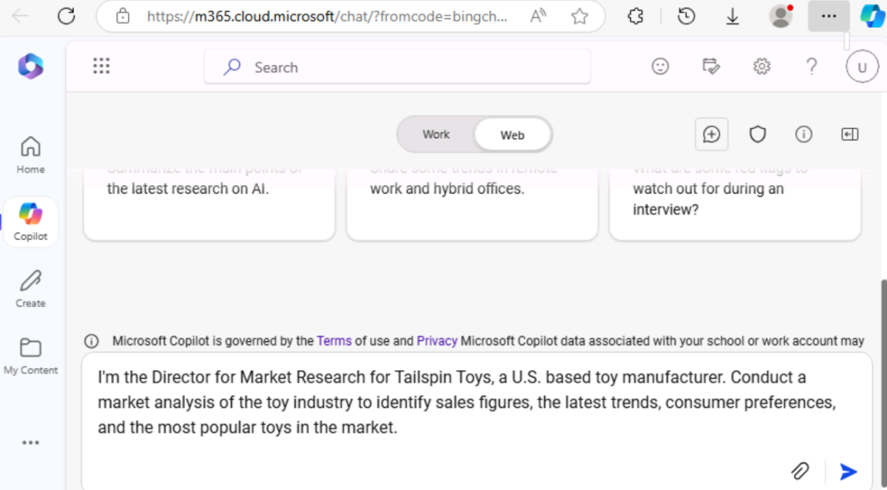

**ラボ 04: 従業員のエンパワーメント – Copilot – マーケティング**

**目的:**

Microsoft Copilot (Bing 内) は、Microsoft Bing
検索インデックス内のパブリック Web データのみを基盤とする生成型 AI
サービスです。Microsoft 365 Graph
内の組織のリソースやコンテンツにはアクセスできません。

Tailspin Toys
の市場調査ディレクターとして、玩具業界の市場分析を実施し、会社のシニア
リーダーシップ チーム (SLT)
に提出したいと考えています。目標は、市場で最新のトレンド、消費者の嗜好、そして最も人気のある玩具を特定することです。

この演習では、Bing の Microsoft Copilot
チャット機能を活用します。Microsoft Copilot
を使用する際は、プロンプトを作成する際にコンテキストとリソースを提供することが重要です。応答の質は、ヒントに従い、適切な会話スタイル
(「よりクリエイティブ」、「よりバランス」、「より正確」)
を選択して、リクエストをどのように作成するかによって決まります。

1.  Microsoft Edge で新しいタブを開き、次の URL を入力します:
    +++https://bing.com+++

2.  Microsoft Bing
    で、ページ上部のタブ一覧から「Copilot」を選択します。Microsoft
    Copilot が開きます。

注:
ページ上部にタブのリストが表示されない場合は、以下の手順に従ってタブのリストを表示してください。

- Microsoft 365 の資格情報 (\[Resources\] タブで利用可能)
  を使用してサインインしていることを確認します。

- Show menu barオプションを有効にする（赤でハイライト表示）

3.  次に「Copilot」を選択します。Microsoft Copilotが開きます。

4.  Copilotページの上部にあるトグルスイッチで「Work」または「Web」を選択できます。リクエストは業務関連のタスクですが、玩具業界の市場分析を行うためにCopilotがWebにアクセスする必要があります。必要に応じて、「Web」トグルスイッチを選択してください。

注: 以前の Copilot バージョンにあった会話トーン セレクター「More
Creative -More Balanced- More
Precise」は最新バージョンでは削除されています。

5.  プロンプト フィールドに次のプロンプトを入力し、\[Submit\]
    アイコンを選択します。

++私は、アメリカの玩具メーカー、テイルスピン・トイズの市場調査ディレクターです。玩具業界の市場分析を行い、売上高、最新トレンド、消費者の嗜好、そして市場で最も人気のある玩具を特定しています。++

6.  Copilot
    が生成した市場分析を確認します。送信したような一般的なリクエストでは、市場動向、消費者の嗜好、玩具のトレンドといった基本的な情報しか得られないことに気づきます。しかし、玩具業界に関するデータ、例えば市場シェアや消費者のフィードバックなども収集したいと考えています。前回の質問では、この具体的な情報を要求していなかったため、少し曖昧すぎたことに気づきました。以前のトレーニングで学んだベストプラクティスのアドバイスを思い出しました。丁寧に、そして繰り返し、繰り返し、繰り返し続けることです。市場分析を修正するために、次の質問を入力します。

++その分析は素晴らしかったです。しかし、玩具業界のデータ、例えば市場シェアや消費者のフィードバックなども含めたいと思っています。この情報を含めるように、以前の分析を修正していただけますでしょうか。ありがとうございます！++

7.  目標に近づいていることに気づきましたが、まだ重要な情報が不足しています。以前のプロンプトを確認したところ、Copilotに全体的な目標、分析の範囲、そして必要なデータを提供していたことに気付きました。しかし、Tailspin
    Toysの次年度の事業計画について十分な情報に基づいた意思決定を行うために必要な情報をすべてCopilotに分析させるように指示し忘れていました。この不足を修正するには、次のプロンプトを入力してください。

++データはすべて揃っていると思います。収集した情報をもとに、データを分析し、パターン、傾向、洞察を特定して、テイルスピン・トイの次年度の事業計画策定に役立ててください。++

8.  Copilotが提供してくれた情報に大変満足しています。しかし、このプロジェクトは社内のSLT（情報技術担当者）に市場分析レポートを提供する初めての機会なので、SLTが関心を持つ可能性のある情報をすべて網羅できているか不安です。そこで、Copilotを使って、何か見落としている点がないか確認することにしました。次のプロンプトを入力してください。

++この市場分析と事業計画のデータを分析してください。玩具会社が市場分析と事業計画に通常要求する情報で、私が要求しなかったものはありますか？もしそうであれば、回答を修正していただき、その情報を含めていただけますか？ありがとうございます！++

9.  Copilot が提供する情報に基づき、これらの領域の分析を Copilot
    に組み込むことでレポートの効果を最大限に高められることがわかりました。レポートの仕上げとして、次のプロンプトを入力します。

++玩具業界におけるこれらの各分野の分析を含めるように市場分析を修正してください。また、これらの洞察に基づいて、Tailspin
Toys向けに作成された事業計画を更新してください。ありがとうございます！++

10. Copilotが生成した市場分析と事業計画は、事前に定義された会話スタイルに基づいています。精度と創造性のバランスを求めるユーザーに最適です。

「よりクリエイティブなスタイル」（より想像力豊かで創造的な回答）を使用した場合のレポートがどのように表示されるか知りたい場合は、正確、創造的、またはバランスのとれた出力のいずれが必要かに応じて、プロンプトを調整して手動でトーンや焦点を設定できます。

注意点:

- 正確な回答を求める場合：明確で具体的、かつ詳細な質問を使用してください。正確性を重視しつつ、事実に基づいた簡潔な回答を求めていることを明確に示してください。

- 創造的な回答を求める場合：自由回答形式、探索的、または想像力豊かな質問を使用してください。独創性が求められる場合は、ブレインストーミングを促したり、解決策を提案したりしてください。

- バランスの取れた回答を求める場合：事実に基づいた詳細とある程度の創造性を織り交ぜた、適度に自由回答形式の質問を使用してください。分析的な回答と探索的な回答の両方を求めることができます。

Copilot の回答をエクスポートする

Bing で Microsoft Copilot
を使用して様々な情報を調べたり、様々な質問に答えたりすると、回答が非常に気に入ったので、後で参照できるように保存しておきたいと思うことがあります。

Copilot
の最終回答の下部にある「Copy」ボタンを選択すると、回答がコピーされ、テキストエディターに貼り付けられます。複数の回答を
1
つのドキュメントにまとめたい場合は、各回答を手動でコピーしてテキストエディターに貼り付け、ファイルを保存する必要があります。

注: 「Edit in
Pages」ボタンが表示されます。このボタンはより高度な機能を提供し、チームの共同作業を容易にします。この演習では「Edit
in Pages」は使用しません。ラボ \#06 には、別の演習が含まれています。

**エクササイズ \#2: Copilot in Loop を使用してマーケティング
キャンペーンのアイデアをブレインストーミングする**

Copilot in Loop
を使用すると、新しいマーケティング戦略のブレインストーミング、キャンペーンの計画、コンテンツの開発を行うことができます。Copilot
in Loop
は、ブログ投稿、記事、その他のコンテンツタイプのアイデア生成に役立ちます。トピックと希望するコンテンツスタイルを入力すると、Copilot
が開始に役立つプロンプトを提案します。

前の演習では、Tailspin Toys
が玩具業界の市場分析を実施しました。その分析に基づき、同社は屋外用玩具の新製品ラインを導入することを決定しました。Tailspin
Toys のマーケティング プログラム
マネージャーとして、あなたはこの新しい玩具ラインのマーケティング
キャンペーンを作成する任務を負っています。この演習では、Copilot in Loop
を使用して、この新しい製品ラインをターゲットにしたマーケティング
キャンペーンのアイデアをブレインストーミングします。

1.  Microsoft
    365で、左側のナビゲーションウィンドウに「Loop」が表示されている場合は選択します。表示されない場合は、Microsoft
    365ナビゲーションウィンドウのすぐ上にある左上の「App
    Launcher」を選択します。

2.  「Apps」ページで下にスクロールして「Loop」を見つけて選択します。

注:
AppsページにLoopが表示されない場合は、その他のアプリを選択してください

3.  \[Sign in\]
    ボタンが表示されたら、ユーザー資格情報を使用してサインインします。

注: サインイン後、Loop ブラウザ ウィンドウを閉じて、アプリ
ページからもう一度 Loop を開きます。

4.  Microsoft Loop
    では、デフォルトで「Workspaces」タブが表示されます。このプロジェクト用に新しいワークスペースを作成するには、ナビゲーションメニューの左上にある「+」を選択し、「+
    New workspace」ボタンを選択します。

5.  \[Create a new workspace\]
    ウィンドウで、ワークスペース名として「+++Outdoor toy line Marketing
    Campaign+++」と入力し、表示される \[Continue\] ボタンまたは
    \[Create\] ボタンを選択します (Loop
    のバージョンによって異なります)。

6.  \[Add files to your workspace\] ウィンドウ (Loop
    のバージョンによっては、このウィンドウに \[Workspace Switcher\]
    と表示されることがあります) で、\[Create\] を選択します。

7.  新しいワークスペースの最初のページが表示されました。ページ名は現在「Untitled」です。左側のナビゲーションペインにもページ（「Untitled」）が表示されています。ページのメインボディで「Untitled」フィールドを選択し、ページ名を「+++Ideas
    for Outdoor toy
    campaigns+++」に変更します。ナビゲーションペインのページ名が自動的に更新されることに注意してください。

8.  「Just start typing...」フィールドにスラッシュ (/) を入力します。

9.  表示されるドロップダウン
    メニューで、メニュー上部の「Copilot」セクションの下にある「Draft
    page content」を選択します。

10. Copilotウィンドウが表示されたら、プロンプトフィールドの下に表示されるボタンの列に注目してください。各ボタン（作成、ブレインストーミング、ブループリント、説明）を選択してください。選択すると、Copilotが支援できるタスクの種類の例がプロンプトフィールドに自動的に入力されます。この演習はブレインストーミングを扱っているので、「Brainstorm」ボタンを選択してください。

11. Copilot
    がプロンプトフィールドにブレインストーミングの提案を自動入力していることに注目してください。実際に「Brainstorm」ボタンを複数回クリックしてみてください。そのたびに新しいブレインストーミングの提案が提示される点に注目してください。Copilot
    は 7
    つの異なるブレインストーミングの例をループ表示し、最初の例に戻ります。これらの例は、Copilot
    がブレインストーミングをどのような種類のテーマで支援できるかをご理解いただくことを目的としています。この演習では、以下のプロンプトフィールドに入力し、「Submit」アイコンを選択してください。

++新しいアウトドア玩具のラインのマーケティング キャンペーンのアイデアを
10 個ブレインストーミングします。++

12. Review the generated list of ideas. Rather than having all the
    information in a paragraph or list form, you prefer to summarize it
    in a table. Plus, you also want Copilot to provide more specific
    details for each idea.

13. 表示される Copilot ペインで、\[Rewrite with Copilot\]
    フィールドに次のプロンプトを入力し、\[Submit\]
    アイコンを選択します。:

++良さそうです。ただし、情報を表にまとめ、それぞれのアイデアについてより具体的な詳細を記載してレポートを書き直してください。++

14. Copilotによってレポートの書式がどのように変更されたかを確認してください。次に、「Supermarket
    store
    promotions」という表に別のアイデアを追加したいとします。そのためには、次のプロンプトを入力します。

++スーパーマーケットの店舗プロモーションのアイデアを追加します。++

15. Copilot
    に新しいアイデアを追加するよう指示すると、新しいテーブルに追加されることもあれば、現在のテーブルの末尾に追加されることもあります。いずれにせよ、よく考えた結果、スーパーマーケットで屋外用おもちゃを宣伝するのは良くないアイデアだと判断したので、リストに追加したくないと判断しました。では、今行った操作を元に戻すにはどうすればよいでしょうか？

表（元の表、またはスーパーマーケット店舗プロモーションのアイデアのみを含む新しい表）の右側で、Copilot
が各プロンプトをどのように追跡しているかを確認してください。プロンプトは、最新のプロンプトから最初のプロンプトまで、順番に表示されます。さらに重要なのは、各プロンプトに「Undi」アイコンが含まれていることです。プロンプトの結果に満足できない場合は、元に戻して、そのプロンプトの前のドラフトバージョンに戻すことができます。スーパーマーケット店舗プロモーションを表に含めないことにしたので、そのプロンプトの「元に戻す」アイコンを選択します。

16. 「Undo」アイコンを選択すると、アイデアを表にまとめる2つ目のプロンプトの後に、Copilotがプロンプトを削除し、下書きに戻る様子を確認できます。これで、Copilotにアイデアを良い順に並べ替えさせる準備が整いました。アイデアを並べ替えるには、次のプロンプトを入力してください。

++表内のアイデアを、効果の高い順に並べ替えてください。++

注:
アイデアリスト上部のアイコントレイに表示される並べ替えアイコン（上下矢印）を見つけてください。このオプションは、アイデアをアルファベット順に並べ替えるだけです。各アイデアの名前、または各詳細フィールドの最初の単語で並べ替えることができます。

17. 分類されたアイデアを確認した後、最後にもう一つ変更を加えることにしました。Copilotを使って、最も効果の低いアイデアを「Seasonal
    Promotions」というキャンペーンイベントに置き換えたいと考えています。これは、アウトドア用品に重点を置いた新しいおもちゃのラインにぴったりだと考えています。そのためには、次のプロンプトを入力してください。

++表の最後のアイデアを季節のプロモーションに置き換えてください。++++

18. Copilot を利用してブレインストーミングしたマーケティング
    キャンペーンのアイデアのリストを Loop で提示するときは、Loop
    によって自動的に保存された「Ideas for Outdoor toy
    campaigns」ワークスペースにアクセスできます。

**エクササイズ \#3: Copilot in Word を使用して複数のマーケティング
レポートを統合する**

Copilot in Word は、AI を活用したライティング
アシスタントです。既存のコンテンツの書き換えや、選択したコンテンツを表形式に変換できます。

Contoso Ltd. 傘下の Contoso Beverage のラテンアメリカ (LATAM)
マーケティング ディレクターとして、製品マネージャーから同社の Mystic
Spice Premium Chai Tea 飲料に関する 3
つの個別のレポートを受け取りました。しかし、複数のドキュメントを頻繁に切り替える必要があるため、情報の分析に苦労しています。

そこで、これらのレポートを 1 つの Mystic Spice Premium Chai Tea の LATAM
市場分析レポートに統合することにしました。この演習では、Copilot
を使用して統合レポートを作成し、レビューを行い、Copilot
がラテンアメリカのチャイティー市場に関して検出したその他の情報に基づいて更新します。

1.  Microsoft Edge ブラウザーで Microsoft 365
    タブを開いている場合は、それを選択します。開いていない場合は、新しいタブを開き、次の
    URL を入力します: +++https://www.office.com+++ して、Microsoft 365
    ホームページに移動します。

注: 右側の \[Resources\] タブに表示される Microsoft 365
資格情報を使用してサインインする必要があります (要求された場合)。

2.  Microsoft 365 ナビゲーション ウィンドウで、OneDrive
    を選択して開きます。

3.  C:\Lab Files
    フォルダーを参照して、次のドキュメントのコピーを選択し、OneDrive
    にアップロードします。

    - ミスティックスパイス プレミアムチャイティー製品説明。

    - コントソチャイティー市場動向 2023年。

    - ラテンアメリカにおけるチャイティーのプロモーション計画。

注: 「Preparing for the lab
execution」セクションで提案されているように、すべてのラボ
アセットをすでに OneDrive
にアップロードしている場合は、この手順をスキップできます。

4.  この演習では、「Most Recently Used
    file」リストからドキュメントにアクセスします。ファイルを「Most
    Recently Used
    file」リストに表示するには、各ドキュメントを開いてから閉じます。OneDrive
    内の 3 つのファイルをそれぞれ開いて閉じます。

5.  Microsoft 365 で Microsoft Word
    を開き、新しい空白のドキュメントを開きます。

6.  空白のドキュメントの上部に表示される \[Draft with Copilot\]
    ウィンドウで、次のプロンプトを入力します。ただし、3
    つのファイルをプロンプトにリンクするまで \[Create\]
    ボタンを選択しないでください。

+++Contoso
Beverageのラテンアメリカ市場マーケティングディレクターです。ミスティックスパイスプレミアムチャイティー飲料のラテンアメリカ市場分析レポートを作成してください。添付の3つのファイルを結合して、製品の説明、市場動向の分析、ラテンアメリカ向けのプロモーションプランを含むレポートを作成してください。+++

7.  3つのドキュメントをプロンプトに添付する必要があります。「Copilotで下書き」ウィンドウで、「コンテンツを参照」ボタンを選択します。表示されるドロップダウンメニューで、ファイルリストにMystic
    Spice Premium Chai
    Teaの製品説明.docxファイルが表示されている場合は選択します。表示されていない場合は、「クラウドからファイルを参照」を選択し、「MRU」リストからファイルを選択して、「Attach」ボタンを選択します。プロンプトでファイルがどのように表示されるかご確認ください。

8.  Contoso Chai Tea market trends 2023.docxファイルとPromotion Plan for
    Chai Tea in Latin
    America.docxファイルの両方に対して、前の手順を繰り返します。この時点で、3つのファイルすべてへのリンクがプロンプトに表示されるはずです。

9.  「Generate」を選択します。すると、Copilot
    は3つのファイルから関連情報を抽出し、それらを統合した Mystic Spice
    Premium Chai Tea の市場分析レポートを作成します。

10. 市場分析レポートの初稿を確認したところ、重要な情報がいくつか欠けていることに気づきました。「Market
    Analysis」というセクションを追加したいと思っています。Copilot
    で競合分析を行いたいのですが、レポート下部の Copilot
    ウィンドウに以下のプロンプトを入力し、「Generate」矢印を選択してください。

+++このレポートは良さそうです。ただし、「Market
Analysis」というセクションを追加してください。ラテンアメリカでチャイティーを販売している飲料会社をレビューし、このセクションでは競合他社の長所と短所、市場シェア、価格戦略に関する情報を提供してください。+++

11. 新しい競合分析セクションを含むレポートの2回目のドラフトを確認した後、最後にもう1つ足りないものがあることに気づきました。Copilotで「流通チャネル」セクションを追加したいのですが、このセクションではラテンアメリカにおけるチャイティーの販売に使用されている流通チャネルを分析する必要があります。そのためには、レポート下部のCopilotウィンドウに次のプロンプトを入力し、「Generate」矢印を選択します。

+++素晴らしいですね！最後にもう一つ。「流通チャネル」というセクションを追加してください。ラテンアメリカにおけるチャイティーの販売に利用されている流通チャネルを確認し、このセクションに小売業者、卸売業者、販売業者の種類に関する情報を記載してください。+++

12. 新しい「Distribution
    Channels」セクションを含む最新の下書きを確認した後、レポートの内容に満足し、保存する準備が整いました。文書下部のCopilotウィンドウで「保存」ボタンを選択し、Copilot下書きからWord文書に変換します。

13. ドキュメントを確認します。手動で変更を加えたい場合は、ここで行うことができます。問題がなければ、今後の参照用にOneDriveに保存するか、破棄してください。

14. Microsoft Edgeブラウザでこのタブを閉じます。

**エクササイズ \#4: Copilot in Excel
を使用して市場トレンドのスプレッドシートを分析する**

Excel 版 Copilot
は、マーケティング担当者がデータを簡単に作成、編集、理解、視覚化し、ビジネスに関する洞察を得るのに役立つ強力なツールです。

Copilot の AI
搭載機能は、反復的なタスク（四半期ごとの業績分析、主要なトレンドの要約、表の色分け、モデルやシナリオの作成、フィルターと並べ替え、マウスをクリックするだけでグラフを追加）を自動化することで、マーケティング担当者の時間と労力を節約し、情報に基づいた意思決定に役立つ貴重な洞察を提供します。

Contoso 社の一部門である Contoso Beverage
のマーケティングディレクターとして、Contoso 社の Chai Tea
製品の月次活動を示す市場トレンドのスプレッドシートを受け取りました。Excel
版 Copilot
の機能を使用してレポートを分析し、月次マーケティングトレンドの詳細な分析を提供したいと考えています。

この演習では、Excel 版 Copilot を使用して、既に Excel
テーブルが定義されている市場トレンドのスプレッドシートを分析します。

1.  Microsoft Edge ブラウザーで Microsoft 365
    タブを開いている場合は、それを選択します。開いていない場合は、新しいタブを開き、次の
    URL を入力します: +++https://www.office.com+++ して、Microsoft 365
    ホームページに移動します。

注: 右側の \[リソース\] タブに表示される Microsoft 365
資格情報を使用してサインインする必要があります (要求された場合)。

2.  Microsoft 365 ナビゲーション ウィンドウで、OneDrive
    を選択して開きます。

3.  C:\Lab Files フォルダーを参照して、Contoso Chai Tea 市場動向 2023
    スプレッドシートのコピーを選択して OneDrive
    にアップロードし、ファイルを開いて閉じると、最近使用したファイル
    (MRU) リストに追加されます。

注: 「Preparing for the lab
execution」で提案されているように、すでにすべてのラボ アセットを
OneDrive にアップロードしている場合は、この手順をスキップできます。

4.  Microsoft 365 ホームページで、左側のナビゲーション ウィンドウで
    Excel アイコンを選択します。

5.  Excel の \[File\] ページで、ファイル リストから「Contoso Chai Tea
    market trends 2023.xlsx」を選択します。

6.  リボンの右側にある \[Copilot\] オプションを選択します。

7.  表示される \[Copilot\]
    ウィンドウで、いくつかの定義済みプロンプトから選択できます。\[Show
    data insights\] ボタンを選択します。

8.  生成されたピボットチャートに注目してください。この演習をテストしたところ、Copilot
    は常に日付別のソーシャルメディアエンゲージメント（閲覧数）の折れ線グラフを作成しました。Copilot
    ではどのような種類のチャートが作成されましたか？Copilot
    が作成したチャートの下にある「+ Add to a new
    sheet」ボタンを選択してください。

9.  Copilot ではチャートがシート 2 に追加されたと表示されますが、シート
    2 はスプレッドシートに表示されません。

10. Excel シートを最大化して手順 11
    を繰り返します。シートに追加機能が正常に動作するようになりました。

11. シート2を選択します。Copilotが作成した新しいデータシートを確認します。Copilotは、グラフと、このグラフの元となったスプレッドシートのデータ列の両方を組み込んでいます。グラフの上にカーソルを置くと、Copilotが生成したグラフの種類を示すウィンドウが表示されます。

12. Copilot
    パネルに、定義済みのプロンプトのリストが表示されていないことに注目してください。これは、Copilot
    がまだピボットテーブルで動作していないために発生します（この問題を示すメッセージにご注意ください）。シート
    1 を選択すると、Excel
    テーブルに戻ります。定義済みのプロンプトがどのように表示されているかに注目してください。

13. プロンプトフィールドの上に表示される定義済みプロンプトで、「Show
    suggestions for formula columns」ボタンを選択します。

14. Copilot が提供する候補に注目してください。次の画像は、テスト中に
    Copilot が提供した候補を示しています。

15. 表示された提案の中から、「Explain
    formula」ドロップダウン矢印を選択します。Copilot
    による計算の説明を確認します。「+ Insert
    Column」ボタンを選択して、この列を Excel テーブルに挿入します。

16. Copilot によって、このデータ列が Sheet 1 の Excel
    テーブルの末尾に追加されたことに注目してください。この機能は興味深いですか？他の数式の候補も確認してみてください。「Show
    suggestions for formula
    columns」ボタンをもう一度選択します。候補が表示されます。「+ Insert
    Column」ボタンを選択して、この列を Excel テーブルに挿入します。

17. プロンプトフィールドの上に表示される定義済みプロンプトで、「How can
    I highlight, filter, and sort data？」ボタンを選択します。

18. 実行できるアクションのリストを書き留めます。

19. この時点で、Copilot
    が表示する定義済みのプロンプトは不要になったため、新しいプロンプトセットを表示する必要があります。プロンプトフィールドの上に表示される「Refresh」ボタンを選択してください。

20. 表示される定義済みプロンプトの修正されたリストを確認します。次の画像は、表示されたプロンプトの例を示しています。

21. このエクササイズの目的は、Copilot
    が実行できる様々な種類の定義済みアクションを実際に体験することです。そのため、様々なプロンプトを選択して、どのような結果になるか確認してみましょう。例えば、

    - 並べ替えプロンプトが表示されたら、今すぐ選択してください。Copilot
      がデータをどのように並べ替えたかを確認してください。

    - 太字プロンプトが表示されたら、今すぐ選択してください。Copilot
      が指定した列の項目を太字にし、その他の項目は太字にしていないことに注意してください。

22. プロンプト フィールドの上に表示される \[Refresh\]
    ボタンをもう一度選択します。

23. 表示される新しいプロンプトセットを確認してください。「Refresh」ボタンを数回クリックして、Copilot
    が提供する様々な種類のプロンプトを確認してください。

24. 他のプロンプトも自由に選択して、Copilot
    の動作を確認してください。完了したら、Microsoft Edge
    ブラウザのタブを閉じてください。

**概要:**

このラボでは

- Microsoft Copilot（Bing/Webモード）で市場動向を分析

- Copilot in
  Loopを使用して、新製品ラインのマーケティングキャンペーンのアイデアを生成します。

- Copilot in
  Wordを使用して、複数のマーケティングレポートを1つのドキュメントにまとめます。

- Copilot in Excelを使用して、スプレッドシート内で市場動向を分析します。

これらの活動を通じて、プロセスを合理化し、マーケティング
キャンペーンの全体的な有効性を向上させることができます。
