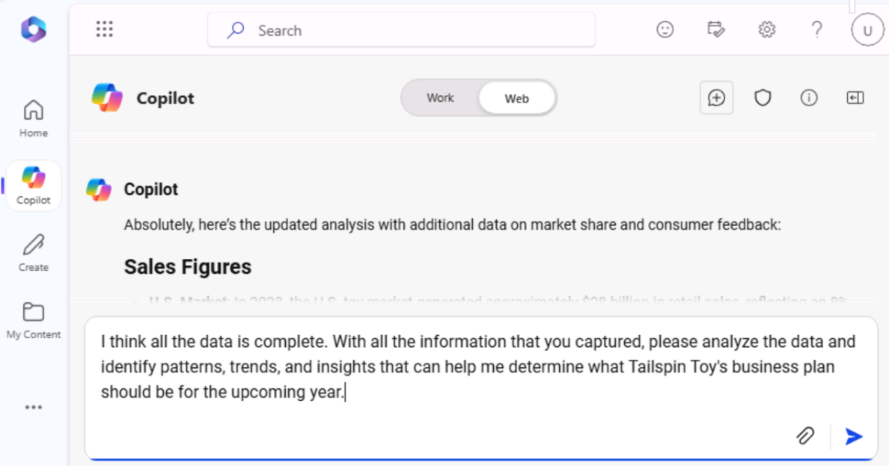

**Lab 04 : Responsabilisez votre personnel – Copilot – Marketing**

**Objectif :**

Microsoft Copilot (au sein de Bing) est un service d'IA générative basé
sur des données provenant du Web public dans l'index de recherche
Microsoft Bing uniquement. Il n'a pas accès aux ressources
organisationnelles ou au contenu dans Microsoft 365 Graph.

En tant que directeur des études de marché chez Tailspin Toys, vous
souhaitez effectuer une analyse de marché de l'industrie du jouet à
fournir à l'équipe de direction de l'entreprise. Votre objectif est
d'identifier les dernières tendances, les préférences des consommateurs
et les jouets les plus populaires sur le marché.

Dans cet exercice, vous allez utiliser la fonctionnalité de chat
Microsoft Copilot dans Bing. Lorsque vous utilisez Microsoft Copilot, il
est important de fournir du contexte et des ressources lorsque vous
rédigez vos invites. La qualité de la réponse dépend de la façon dont
vous rédigez la demande en suivant les conseils et en choisissant le bon
style de conversation (plus créatif, plus équilibré ou plus précis).

1.  Dans **Microsoft Edge**, ouvrez un nouvel onglet et entrez l'URL
    suivante : +++[**https://bing.com+++**](https://bing.com+++/)

2.  Dans **Microsoft Bing**, dans la liste des onglets en haut de la
    page, sélectionnez **Copilot**. Cela ouvre Microsoft Copilot.

**Remarque :** Si vous ne voyez pas la liste des onglets en haut de la
page, veuillez suivre les étapes ci-dessous pour afficher la liste des
onglets.

- Assurez-vous d'être connecté à l'aide de **Microsoft 365 credentials**
  (disponibles sous l'onglet **Resources**).

- Activez l'option Afficher **Show menu bar** (en surbrillance rouge)

3.  Sélectionnez maintenant **Copilot**. Cela ouvre Microsoft Copilot.

4.  Sur la page **Copilot**, notez l'interrupteur à bascule en haut de
    la page qui vous permet de sélectionner **Work** ou **Web**. Bien
    que votre demande soit une tâche liée au travail, vous avez besoin
    que Copilot accède au Web pour effectuer son analyse de marché de
    l'industrie du jouet. Si nécessaire, sélectionnez l' interrupteur à
    bascule Web.

**Remarque** : Le sélecteur de tonalité conversationnelle **More
Creative -More Balanced- More Precise** présent dans la version
précédente de Copilot est supprimé dans la dernière version.

5.  Dans le champ d'invite, entrez l'invite suivante, puis sélectionnez
    l'icône **Submit** :

++**I'm the Director for Market Research for Tailspin Toys, a U.S. based
toy manufacturer. Conduct a market analysis of the toy industry to
identify sales figures, the latest trends, consumer preferences, and the
most popular toys in the market**.++

6.  Examinez l'analyse de marché générée par Copilot. Vous vous rendez
    compte qu'une demande générale telle que celle que vous avez soumise
    fournit des informations de base telles que les tendances du marché,
    les préférences des consommateurs et les tendances en matière de
    jouets. Cependant, vous souhaitez également recueillir des données
    sur l'industrie du jouet, y compris les parts de marché et les
    commentaires des consommateurs. Vous vous êtes rendu compte que vous
    étiez un peu trop vague dans votre question précédente puisque vous
    n'aviez pas demandé cette information spécifique. Vous vous souvenez
    des suggestions de meilleures pratiques de votre formation
    précédente - Soyez poli et itérez, itérez, itérez. Entrez l'invite
    suivante pour modifier l'analyse de marché :

++**That analysis was great. However, I'm also interested in including
data on the toy industry, including market share and consumer feedback.
Please amend your prior analysis to include this information.
Thanks**!++

\<

7.  Vous vous rendez compte que vous vous rapprochez de votre objectif,
    mais il vous manque encore des informations clés. Après avoir
    examiné vos invites précédentes, vous vous êtes rendu compte que
    vous aviez fourni à Copilot votre objectif global, la portée de
    l'analyse et les données dont vous aviez besoin. Cependant, vous
    n'avez pas demandé à Copilot d'analyser toutes ces informations afin
    que vous puissiez prendre des décisions éclairées sur le plan
    d'affaires de Tailspin Toys pour l'année à venir. Pour corriger
    cette lacune, entrez l'invite suivante :

++**I think all the data is complete. With all the information that you
captured, please analyze the data and identify patterns, trends, and
insights that can help me determine what Tailspin Toy's business plan
should be for the upcoming year**++

8.  Vous aimez vraiment les informations fournies par Copilot.
    Cependant, comme ce projet est votre première occasion de fournir un
    rapport d'analyse de marché à l'équipe de votre entreprise, vous
    n'êtes pas sûr de couvrir tout ce qui pourrait l'intéresser. Vous
    décidez de demander à Copilot de vous aider à déterminer s'il vous
    manque quelque chose. Entrez l'invite suivante :

++**Please analyze the data in this market analysis and business plan.
Is there any other information that a toy company would typically
request for market analysis and business plans that I failed to request?
If so, can you please amend your responses to include this information.
Thank you**!++

9.  Sur la base des informations fournies par Copilot, vous vous rendez
    compte que vous pouvez vraiment maximiser l'efficacité de vos
    rapports en faisant en sorte que Copilot inclue une analyse de ces
    domaines. Pour mettre la touche finale à vos rapports, entrez
    l'invite suivante :

++**Please amend the market analysis to include an analysis of each of
these areas for the Toy industry. Also update the business plan that you
created for Tailspin Toys based on these insights. Thanks**!++

10. L'analyse de marché et le plan d'affaires que Copilot a générés pour
    vous étaient basés sur un style de conversation prédéfini. Il est
    idéal pour les utilisateurs qui souhaitent trouver un équilibre
    entre précision et créativité.

Si vous êtes curieux de savoir à quoi ressembleraient les rapports en
utilisant le style **More Creative** (réponses plus imaginatives et
créatives), vous pouvez ajuster vos invites pour définir manuellement le
ton ou l'objectif, selon que vous souhaitez des résultats précis,
créatifs ou équilibrés :

**Points à noter** :

- **Pour des réponses précises** : Utilisez des invites claires,
  spécifiques et axées sur les détails. Indiquez que vous voulez des
  réponses factuelles et concises en mettant l'accent sur l'exactitude.

- **Pour des réponses créatives** : utilisez des invites ouvertes,
  exploratoires ou imaginatives. Encouragez le brainstorming ou proposez
  des solutions où l'originalité est nécessaire.

- **Pour des réponses équilibrées :** Utilisez des questions modérément
  ouvertes qui demandent un mélange de détails factuels et un peu de
  créativité. Vous pouvez demander des commentaires analytiques et
  exploratoires.

**Exporter une réponse Copilot**

Lorsque vous utilisez Microsoft Copilot dans Bing pour effectuer des
recherches ou répondre à différentes questions, vous pouvez décider
qu'une réponse est si bonne que vous souhaitez l'enregistrer pour
référence future.

Au bas de la réponse finale de Copilot, sélectionnez le bouton **Copy**
pour copier la réponse et collez-la copiée dans un éditeur de texte. Si
vous souhaitez regrouper plusieurs réponses en un seul document, vous
devez copier et coller manuellement chaque réponse dans un éditeur de
texte et enregistrer le fichier.

**Remarque** : Vous verrez un bouton **Edit in pages** qui offre plus de
fonctionnalité et facilite la collaboration d'équipe. Nous n'utiliserons
pas **Edit in pages** dans cet exercice. Un exercice de laboratoire
distinct est inclus dans le laboratoire \#06.

**Exercice \#2 : Réfléchir à des idées de campagnes marketing à l'aide
de Copilot in Loop**

Vous pouvez utiliser Copilot in Loop pour réfléchir à de nouvelles
stratégies marketing, planifier des campagnes et développer du contenu.
Copilot in Loop peut vous aider à générer des idées pour des billets de
blog, des articles et d'autres types de contenu. Vous pouvez saisir des
sujets et le style de contenu souhaité, et Copilot peut suggérer des
invites pour vous aider à démarrer.

Dans l'exercice précédent, Tailspin Toys a effectué une analyse de
marché de l'industrie du jouet. Sur la base de cette analyse,
l'entreprise a décidé d'introduire une nouvelle gamme de jouets
d'extérieur. En tant que gestionnaire de programme marketing chez
Tailspin Toys, vous êtes chargé de créer des campagnes de marketing pour
cette nouvelle gamme de jouets. Dans cet exercice, vous allez utiliser
Copilot in Loop pour réfléchir à des idées pour une campagne marketing
ciblée sur cette nouvelle gamme de produits.

1.  Dans **Microsoft 365**, sélectionnez **Loop** s'il apparaît dans le
    volet de navigation de gauche. S'il n'y apparaît pas, sélectionnez
    **App Launcher** en haut à gauche, juste au-dessus du volet de
    navigation de **Microsoft 365**,

2.  Sur la page **Apps**, faites défiler l'écran vers le bas pour
    localiser **Loop**, puis sélectionnez-le.

**Remarque** : Si l'option **Loop** n'est pas répertoriée sur la page
Applications, sélectionnez **More apps**

3.  Si vous voyez le bouton **Sign-in,** sign-in à l'aide des
    informations d'identification de l'utilisateur.

**Remarque** : Une fois connecté, fermez la fenêtre du navigateur Loop
et ouvrez à nouveau Loop à partir de la page Applications.

4.  Dans **Microsoft Loop**, l'onglet **Workspaces** s'affiche par
    défaut. Vous souhaitez créer un nouvel espace de travail pour ce
    projet, sélectionnez **+** en haut à gauche du menu de navigation,
    puis sélectionnez le bouton **+New workspace**.

5.  Dans la fenêtre **Create a new workspace**, saisissez +++**Outdoor
    toy line Marketing Campaign**+++ pour le nom de votre espace de
    travail, puis sélectionnez le bouton **Continue** ou **Create** qui
    s'affiche (selon votre version de Loop).

6.  Dans la fenêtre **Add files to your workspace** (selon votre version
    de Loop, cette fenêtre peut indiquer **Workspace Switcher**),
    sélectionnez **Create**.

7.  Vous êtes maintenant sur la première page de votre nouvel espace de
    travail. Le nom de la page est actuellement **Untitled**. Notez que
    la page (Sans titre) apparaît également dans le volet de navigation
    de gauche. Dans le corps principal de la page, sélectionnez dans le
    champ **Untitled** et remplacez le nom de la page par +++**Ideas for
    Outdoor toy campaigns**+++. Notez que le nom de la page est
    automatiquement mis à jour dans le volet de navigation.

8.  Dans la section **Just start typing...**, entrez une barre oblique
    **(/).**

9.  Dans le menu déroulant qui s'affiche, sous la section **Copilot** en
    haut du menu, sélectionnez **Draft page content**.

10. Dans la fenêtre **Copilot** qui s'affiche, notez la rangée de
    boutons qui apparaît sous le champ d'invite. Sélectionnez chaque
    bouton (**Créer**, **Brainstorming**, **Plan** et **Décrire**). Ce
    faisant, notez comment il pré-remplit le champ d'invite avec un
    exemple du type de tâche pour laquelle Copilot peut aider. Étant
    donné que cet exercice traite du brainstorming, sélectionnez le
    bouton **Brainstorming**.

11. Notez comment Copilot pré-remplit le champ de l'invite avec une
    suggestion de brainstorming. En fait, sélectionnez le bouton
    **Brainstorm** plusieurs fois. Notez qu'il suggère à chaque fois une
    nouvelle invite de brainstorming. Copilot passe en Loop sur sept
    exemples de brainstorming différents, puis recommence. Le but de ces
    exemples est de vous donner une idée des types éclectiques de choses
    auxquelles Copilot peut vous aider à réfléchir. Pour cet exercice,
    entrez le champ d'invite suivant et sélectionnez l'icône **Submit**
    :

++**Brainstorm 10 ideas for a marketing campaign for a new line of
outdoor toys**.++

12. Examinez la liste d'idées générée. Plutôt que d'avoir toutes les
    informations sous forme de paragraphe ou de liste, vous préférez les
    résumer dans un tableau. De plus, vous souhaitez également que
    Copilot fournisse des détails plus spécifiques pour chaque idée.

13. Dans le volet **Copilot** qui s'affiche, entrez l'invite suivante
    dans le champ **Rewrite avec Copilot** et sélectionnez l'icône
    **Submit** :

++**That looks good. However, please rewrite the report by placing the
information in a table and provide more specific details for each
idea**.++

14. Notez comment Copilot a modifié la mise en forme du rapport. Vous
    souhaitez maintenant que Copilot ajoute une autre idée au tableau
    intitulée **Supermarket store promotions**. Pour ce faire, entrez
    l'invite suivante :

++**Add an idea for Supermarket store promotions**.++

15. Lorsque vous demandez à Copilot d'ajouter une nouvelle idée, il se
    peut qu'il l'ajoute dans une nouvelle table ou qu'il l'ajoute à la
    fin de la table actuelle. Quoi qu'il en soit, vous décidez après
    mûre réflexion que la promotion des jouets d'extérieur dans un
    supermarché est une mauvaise idée, et vous ne voulez plus qu'il soit
    inclus dans la liste. Alors, comment pouvez-vous défaire ce que vous
    venez de faire ?

À droite du tableau (soit votre tableau d'origine, soit un nouveau
tableau avec juste l'idée **Supermarket store promotions**), notez
comment Copilot suit chacune de vos invites. Les invites sont affichées
de la plus récente à la première invite, dans un ordre séquentiel. Plus
important encore, notez que chaque invite comprend une icône **Undo**.
Si vous n'êtes pas satisfait des résultats d'une invite, vous pouvez
l'Undo pour revenir à la version du brouillon antérieure à cette invite.
Puisque vous avez décidé de ne plus inclure **Supermarket store
promotions** dans le tableau, sélectionnez l'icône **Undo** pour cette
invite.

16. Après avoir sélectionné l'icône **Undo**, notez comment Copilot a
    supprimé l'invite et vous a renvoyé au brouillon après la deuxième
    invite qui a placé les idées dans un tableau. À ce stade, vous êtes
    prêt à demander à Copilot de trier les idées de la meilleure à la
    pire. Entrez l'invite suivante pour trier les idées :

++**Please sort the ideas in the table starting from most effective to
least effective**.++

**Remarque :** Localisez l'icône **Sort** (les flèches vers le haut et
vers le bas) qui apparaît dans la barre d'icônes au-dessus de la liste
des idées. Cette option trie simplement les idées dans l'ordre
alphabétique. Vous pouvez effectuer le tri sur le nom de chaque **Idea**
ou sur le premier mot de chaque champ **Details**.

17. Après avoir examiné les idées triées, vous décidez d'apporter un
    dernier changement. Vous souhaitez que Copilot remplace l'idée la
    moins efficace par un événement de campagne intitulé **Seasonal
    Promotions**. Vous pensez que c'est un choix naturel pour une
    nouvelle gamme de jouets qui se concentre sur les produits de plein
    air. Pour ce faire, entrez l'invite suivante :

++**Please replace the final idea in the table with Seasonal
Promotions**.++

18. Lorsqu'il est temps de présenter la liste des idées de campagnes
    marketing que vous avez réfléchies à l'aide de Copilot dans Loop,
    vous pouvez accéder à **Ideas for Outdoor toy campaigns** que Loop a
    automatiquement enregistré.

**Exercice \#3 : Consolider plusieurs rapports marketing à l'aide de
Copilot dans Word**

Copilot in Word, un assistant d'écriture alimenté par l'IA, peut vous
aider à réécrire du contenu existant, ou même à transformer le contenu
sélectionné en tableau.

En tant que directeur marketing Amérique latine (LATAM) pour Contoso
Beverage, une division de Contoso, Ltd., votre chef de produit vous a
fourni trois rapports distincts concernant la boisson Mystic Spice
Premium Chai Tea de l'entreprise. Cependant, vous avez du mal à analyser
les informations, car vous faites constamment des allers-retours entre
les documents.

Vous décidez de combiner les rapports en un seul rapport d'analyse de
marché LATAM pour le thé Chai Premium Mystic Spice. Dans cet exercice,
vous utiliserez Copilot pour créer le rapport combiné, l'examiner et
éventuellement le mettre à jour avec d'autres informations que Copilot
peut trouver sur le marché du thé Chai en Amérique latine.

1.  Si un onglet Microsoft 365 est ouvert dans votre navigateur
    Microsoft Edge, sélectionnez-le maintenant ; sinon, ouvrez un nouvel
    onglet et entrez l'URL suivante :
    +++[https://www.office.com+++++](https://www.office.com+++/) pour
    accéder à la page d'accueil de Microsoft 365.

**Remarque** : Vous devez vous connecter (si vous y êtes invité) à
l'aide des **Microsoft 365 Credentials** fournies sous l'onglet
**Resources** à droite.

2.  Dans le volet de navigation **Microsoft 365**, sélectionnez
    **OneDrive** pour l'ouvrir.

3.  Accédez au dossier **C :\LabFiles** pour sélectionner et télécharger
    une copie des documents suivants sur OneDrive.

    - **Mystic Spice Premium Chai Tea product description.**

    - **Contoso Chai Tea market trends 2023.**

    - **Promotion Plan for Chai Tea in Latin America.**

**Remarque** : Si vous avez déjà téléchargé toutes les ressources du
labo sur OneDrive, comme suggéré dans la section **Preparing for the lab
execution,** vous pouvez ignorer cette étape.

4.  Dans cet exercice, vous allez accéder aux documents à partir de la
    liste des fichiers les plus récemment utilisés. Pour que les
    fichiers apparaissent dans la liste MRU, ouvrez chaque document,
    puis fermez-le. Ouvrez et fermez chacun des trois fichiers de votre
    OneDrive.

5.  Dans **Microsoft 365,** ouvrez **Microsoft Word**, puis ouvrez un
    nouveau document vierge.

6.  Dans la fenêtre **Draft with Copilot** qui s'affiche en haut du
    document vierge, entrez l'invite suivante, mais ne sélectionnez pas
    le bouton **Générer** tant que vous n'avez pas lié les trois
    fichiers à l'invite :

+++**I'm the LATAM Marketing Director for Contoso Beverage. Please
create a LATAM Market Analysis report for our Mystic Spice Premium Chai
Tea beverage. Combine the three attached files to create a report that
describes the product, analyzes the market trend for it, and includes a
promotion plan for Latin America**.+++

7.  Vous devez maintenant Attach les trois documents à l'invite. Dans la
    fenêtre **Draft with Copilot**, sélectionnez le bouton **Reference
    your content**. Dans le menu déroulant qui apparaît, si le **Mystic
    Spice Premium Chai Tea product description.docx** apparaît dans la
    liste des fichiers, sélectionnez-le. Sinon, sélectionnez **Browse
    files from cloud**, sélectionnez le fichier dans la liste des
    fichiers **Recents**, puis sélectionnez le bouton **Attach**. Notez
    comment le fichier s'affiche dans l'invite.

8.  Répétez l'étape précédente pour le fichier **Contoso Chai Tea market
    trends 2023.docx** et le fichier **Promotion Plan for Chai Tea in
    Latin America.docx** latine. À ce stade, les liens vers les trois
    fichiers doivent apparaître dans l'invite.

9.  Sélectionnez **Generate**. Ce faisant, Copilot extrait les
    informations pertinentes des trois fichiers et rédige un rapport qui
    les combine en un seul rapport d'analyse de marché pour le thé Chai
    Premium Mystic Spice.

10. Après avoir examiné cette première version du rapport d'analyse de
    marché, vous reconnaissez qu'il manque des informations
    essentielles. Vous aimeriez qu'il inclue une section intitulée
    **Competitive Analysis**. Vous souhaitez que Copilot analyse la
    concurrence. Pour ce faire, entrez l'invite suivante dans la fenêtre
    Copilot en bas du rapport, puis sélectionnez la flèche **Generate**
    :

+++**This report looks good. However, please add a section titled
Competitive Analysis. Review the beverage companies in Latin America
that sell Chai Tea and then provide information in this section on the
strengths and weaknesses of these competitors, their market share, and
their pricing strategies**.+++

11. Après avoir examiné cette deuxième ébauche du rapport qui contient
    la nouvelle section Analyse concurrentielle, vous vous rendez compte
    qu'il manque une dernière chose. Vous souhaitez que Copilot ajoute
    une section sur les **Distribution Channels**. Cette section devrait
    analyser les canaux de distribution utilisés pour vendre le thé Chai
    en Amérique latine. Pour ce faire, entrez l'invite suivante dans la
    fenêtre Copilot en bas du rapport, puis sélectionnez la flèche
    **Generate** :

+++**Nice job! One last thing. Please add a section titled Distribution
Channels. Review the distribution channels used to sell Chai Tea in
Latin America and then provide information in this section on the types
of retailers, wholesalers, and distributors used**.+++

12. Après avoir examiné cette dernière version préliminaire qui contient
    la nouvelle section Canaux de distribution, vous êtes satisfait du
    rapport et vous êtes prêt à l'enregistrer. Dans la fenêtre Copilot
    en bas du document, sélectionnez le bouton **Keep it** pour le
    convertir d'un brouillon Copilot en un document Word.

13. Examinez le document. Si vous souhaitez apporter des modifications
    manuelles, vous pouvez le faire maintenant. Une fois que vous en
    êtes satisfait, n'hésitez pas à enregistrer le document sur votre
    OneDrive si vous souhaitez le conserver pour référence future, ou
    simplement le jeter.

14. Fermez cet onglet dans votre navigateur Microsoft Edge.

**Exercice \#4 : Analyser une feuille de calcul de tendance de marché à
l'aide de Copilot dans Excel**

Copilot dans Excel est un outil puissant qui peut aider les
professionnels du marketing à créer, modifier, comprendre et visualiser
leurs données avec facilité et à obtenir des informations sur leur
entreprise.

Les capacités alimentées par l'IA de Copilot peuvent aider les
professionnels du marketing à économiser du temps et des efforts en
automatisant les tâches répétitives (analyser les résultats commerciaux
trimestriels, résumer les tendances clés, appliquer un codage couleur
aux tableaux, créer des modèles, des scénarios, filtrer et trier, et
ajouter des graphiques en un clic de souris) et en fournissant des
informations précieuses qui peuvent les aider à prendre des décisions
éclairées.

En tant que directeur du marketing pour Contoso Beverage, une division
de Contoso, Ltd., vous avez reçu une feuille de calcul des tendances du
marché montrant l'activité mensuelle du produit Chai Tea de Contoso.
Vous souhaitez utiliser les fonctionnalités de Copilot dans Excel pour
analyser le rapport et fournir une analyse détaillée des tendances
marketing mensuelles.

Dans cet exercice, vous allez utiliser Copilot dans Excel pour analyser
une feuille de calcul de tendance du marché sur laquelle une table Excel
est déjà définie.

1.  Si un onglet Microsoft 365 est ouvert dans votre navigateur
    Microsoft Edge, sélectionnez-le maintenant ; sinon, ouvrez un nouvel
    onglet et entrez l'URL suivante :
    +++[https://www.office.com+++++](https://www.office.com+++/) pour
    accéder à la page d'accueil de Microsoft 365.

**Remarque** : Vous devez vous connecter (si vous y êtes invité) à
l'aide des **Microsoft 365 Credentials** fournies sous l'onglet
**Resources** à droite.

2.  Dans le volet de navigation **Microsoft 365**, sélectionnez
    **OneDrive** pour l'ouvrir.

3.  Accédez au dossier **C :\LabFiles** pour sélectionner et télécharger
    une copie de **Contoso Chai Tea market trends 2023** sur
    **OneDrive**, puis ouvrez et fermez le fichier pour l'obtenir dans
    votre liste de fichiers les plus récemment utilisés (MRU).

**Remarque** : Si vous avez déjà téléchargé toutes les ressources de
labo sur OneDrive, comme suggéré dans **Preparing for the lab
execution,** vous pouvez ignorer cette étape.

4.  Sur la page d'accueil de **Microsoft 365**, sélectionnez l'icône
    **Excel** dans le volet de navigation de gauche.

5.  Dans **Excel**, dans la page **Files**, sélectionnez **Contoso Chai
    Tea market trends 2023.xlsx** dans la liste des fichiers.

6.  Sélectionnez l'option **Copilot** sur le côté droit du ruban.

7.  Dans le volet **Copilot** qui s'affiche, vous pouvez choisir parmi
    plusieurs invites prédéfinies. Sélectionnez le bouton **Show data
    insights**.

8.  Notez le graphique croisé dynamique qu'il a généré. Lorsque nous
    avons testé cet exercice, Copilot a toujours créé un graphique
    linéaire de **Social Media Engagement (views) by Date**. Quel type
    de graphique Copilot a-t-il créé pour vous ? Sous le graphique que
    Copilot a créé pour vous, sélectionnez le bouton **+Add to a new
    sheet**.

9.  Bien que Copilot affirme avoir ajouté le graphique à Sheet 2, Sheet
    2 n'est pas visible dans Sheet de calcul.

10. Essayez avec Sheet Excel agrandie et répétez l'étape 11. La **Add to
    sheet function** fonctionnait correctement maintenant.

11. Sélectionnez la **Sheet 2**. Consultez la nouvelle fiche technique
    créée par Copilot. Copilot a inclus à la fois le graphique et la
    colonne de données de Sheet de calcul qui était à la base de ce
    graphique. Maintenez votre curseur sur le graphique et notez la
    fenêtre qui apparaît et qui indique le type de graphique généré par
    Copilot.

12. Notez que dans le volet Copilot, la liste des invites prédéfinies
    n'apparaît plus. Cette situation se produit parce que Copilot ne
    fonctionne pas encore sur les tableaux croisés dynamiques (notez le
    message indiquant ce problème). Sélectionnez **Sheet 1**, qui vous
    ramène à la table Excel. Notez comment les invites prédéfinies
    s'affichent.

13. Dans les invites prédéfinies qui s'affichent au-dessus du champ
    d'invite, sélectionnez le bouton **Show suggestions for formula
    columns**.

14. Notez la suggestion fournie par Copilot. L'image suivante montre la
    suggestion fournie par Copilot lors de nos tests.

15. Dans la suggestion que vous avez reçue, sélectionnez la flèche
    **Explain formula**. Examinez l'explication de Copilot qui décrit le
    calcul. Sélectionnez le bouton **+Insert une Column** pour insérer
    cette colonne dans votre tableau Excel.

16. Notez comment Copilot a ajouté cette colonne de données à la fin de
    votre tableau Excel dans Sheet **1**. Cette fonctionnalité vous
    intrigue ? Vous voudrez peut-être voir quelles autres suggestions de
    formules il fournit. Sélectionnez à nouveau le bouton **Show
    suggestions for formula columns**. Notez la suggestion. Sélectionnez
    le bouton **+Insérer une Column** pour insérer cette colonne
    suggérée dans votre tableau Excel.

17. Dans les invites prédéfinies qui s'affichent au-dessus du champ
    d'invite, sélectionnez le bouton **How can I highlight, filter, and
    sort data**?.

18. Notez la liste des actions que vous pouvez entreprendre.

19. À ce stade, les invites prédéfinies affichées par Copilot ne vous
    intéressent plus. En tant que tel, vous souhaitez voir un nouvel
    ensemble d'invites. Sélectionnez le bouton **Refresh** qui apparaît
    au-dessus du champ d'invite.

20. Examinez la liste révisée des invites prédéfinies qui s'affichent
    maintenant. L'image suivante montre des exemples d'invites qui ont
    été affichées.

21. Le but de cet exercice est de se faire une idée des différents types
    d'actions prédéfinies que Copilot peut effectuer. Par conséquent,
    sélectionnez différentes invites pour voir ce qui se passe. Par
    exemple:

    - Si une invite de **tri** s'affiche, sélectionnez-la maintenant.
      Notez comment Copilot a trié les données pour vous.

    - Si une invite en **gras** s'affiche, sélectionnez-la maintenant.
      Notez comment Copilot a mis en gras les éléments de la colonne
      qu'il a mentionnée et a laissé tous les autres non en gras.

22. Sélectionnez à nouveau le bouton **Refresh** qui apparaît au-dessus
    du champ d'invite.

> 

23. Passez en revue le nouvel ensemble d'invites qu'il affiche.
    Sélectionnez le bouton **Refresh** plusieurs fois pour voir les
    différents types d'invites fournies par Copilot.

24. N'hésitez pas à sélectionner d'autres invites pour voir ce que fait
    Copilot. Lorsque vous avez terminé, fermez l'onglet de votre
    navigateur Microsoft Edge.

**Résumé :**

Dans cet atelier, vous avez utilisé

- Microsoft Copilot (mode Bing/Web) pour analyser les tendances du
  marché

- Copilot in Loop pour générer des idées de campagnes marketing pour une
  nouvelle gamme de produits.

- Copilot dans Word pour combiner plusieurs rapports marketing en un
  document cohérent.

- Copilot dans Excel pour analyser les tendances du marché au sein d'un
  tableur.

Grâce à ces activités, vous pouvez rationaliser les processus et
améliorer l'efficacité globale de vos campagnes marketing.
