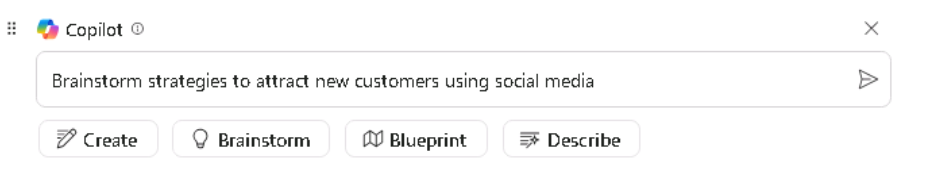
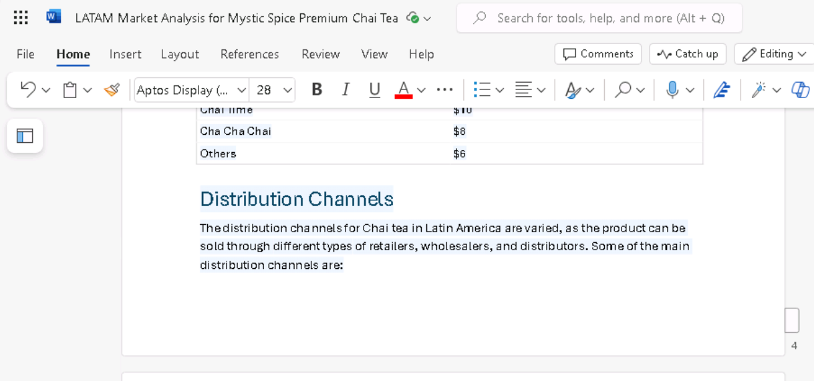

**실습 04: 직원 역량 강화 – Copilot – 마케팅**

**목표:**

Microsoft Copilot(Bing 내)은 Microsoft Bing 검색 인덱스에만 있는 공용
웹의 데이터를 기반으로 하는 generative AI 서비스입니다. Microsoft 365
Graph 내의 조직 리소스 또는 콘텐츠에 액세스할 수 없습니다.

Tailspin Toys의 시장 조사 담당 이사는 회사의 Senior Leadership Team
(SLT)에 제공하기 위해 장난감 산업에 대한 시장 분석을 수행하려고 합니다.
목표는 최신 트렌드, 소비자 선호도 및 시장에서 가장 인기 있는 장난감을
식별하는 것입니다.

이 연습에서는 Bing에서 Microsoft Copilot 채팅 기능을 활용합니다.
Microsoft Copilot을 사용하는 경우 프롬프트를 작성할 때 컨텍스트와
리소스를 제공하는 것이 중요합니다. 응답의 품질은 팁을 따르고 올바른 대화
스타일 (더 창의적, 더 균형 잡힌 또는 더 정확함)을 선택하여 요청을
작성하는 방법에 따라 달라지는 기능입니다.

1.  **Microsoft Edge**에서 새 탭을 열고 다음
    URL: +++[**https://bing.com+++**](https://bing.com+++/)을 입력하세요

2.  **Microsoft Bing**에서 페이지 상단의 탭 목록에서**Copilot**를
    선택하세요. 이렇게 하면Microsoft Copilot이 열립니다.

**참고:** 페이지 상단에 탭 목록이 표시되지 않으면 아래 단계에 따라 탭
목록을 확인하세요.

- **Microsoft 365 credentials** (**Resources **탭에서 사용 가능)을
  사용하여 로그인했는지 확인하세요.

- **Show menu bar**옵션을 활성화하세요.

3.  이제 **Copilot**을 선택하세요. 이렇게 하면 Microsoft Copilot이
    열립니다.

4.  **Copilot** 페이지에서 **Work** 또는 **Web**웹을 선택할 수 있는
    페이지 상단의 토글 스위치를 확인하세요. 귀하의 요청은 업무 관련
    작업이지만 장난감 산업에 대한 시장 분석을 수행하기 위해 웹에
    액세스하려면 Copilot이 필요합니다. 필요한 경우 **Web**토글 스위치를
    선택하세요.

**참고**: 이전 Copilot 버전에 있던 대화 톤 선택기 More Creative -More
Balanced- More **Precise**는 최신 버전에서 삭제되었습니다.

5.  프롬프트 필드에 다음 프롬프트를 입력한 다음 **Submit **아이콘을
    선택하세요:

++**I'm the Director for Market Research for Tailspin Toys, a U.S. based
toy manufacturer. Conduct a market analysis of the toy industry to
identify sales figures, the latest trends, consumer preferences, and the
most popular toys in the market**.++

6.  Copilot이 생성한 시장 분석을 검토하세요. 제출한 것과 같은 일반적인
    요청은 시장 동향, 소비자 선호도 및 장난감 동향과 같은 기본 정보를
    제공한다는 것을 알고 있습니다. 그러나 시장 점유율 및 소비자 피드백을
    포함하여 장난감 산업에 대한 데이터를 수집하는 데에도 관심이
    있습니다. 이 특정 정보를 요청하지 않았기 때문에 이전 프롬프트에서
    너무 모호하다는 것을 깨달았습니다. 이전 교육에서 제안한 모범 사례를
    기억합니다 - 예의 바르게 반복하고, 반복하고, 반복하고, 반복하세요.
    다음 프롬프트를 입력하여 시장 분석을 수정하세요:

++**That analysis was great. However, I'm also interested in including
data on the toy industry, including market share and consumer feedback.
Please amend your prior analysis to include this information.
Thanks**!++

7.  목표에 점점 더 가까워지고 있다는 것을 깨닫지만 여전히 몇 가지 핵심
    정보를 놓치고 있습니다. 이전 프롬프트를 검토한 후 Copilot에 전반적인
    목표, 분석 범위 및 필요한 데이터를 제공했음을 깨달았습니다. 그러나
    다가오는 해에 Tailspin Toys의 사업 계획에 대해 정보에 입각한 결정을
    내릴 수 있도록 이 모든 정보를 분석하도록 Copilot에 요청하지
    않았습니다. 이 단점을 해결하려면 다음 프롬프트를 입력하세요:

++**I think all the data is complete. With all the information that you
captured, please analyze the data and identify patterns, trends, and
insights that can help me determine what Tailspin Toy's business plan
should be for the upcoming year**++

8.  Copilot이 제공한 정보가 정말 마음에 듭니다. 그러나 이 프로젝트는
    회사의 SLT에 시장 분석 보고서를 제공할 수 있는 첫 번째 기회이기
    때문에 그들이 관심을 가질 수 있는 모든 것을 다루고 있는지 확신할 수
    없습니다. Copilot의 도움을 받아 놓친 것이 있는지 확인하기로
    결정했습니다. 다음 프롬프트를 입력하세요:

++**Please analyze the data in this market analysis and business plan.
Is there any other information that a toy company would typically
request for market analysis and business plans that I failed to request?
If so, can you please amend your responses to include this information.
Thank you**!++

9.  Copilot이 제공하는 정보를 기반으로 Copilot에 이러한 영역에 대한
    분석을 포함함으로써 보고서의 효과를 극대화할 수 있다는 것을 알게
    됩니다. 보고서를 마무리하려면 다음 프롬프트를 입력하세요:

++**Please amend the market analysis to include an analysis of each of
these areas for the Toy industry. Also update the business plan that you
created for Tailspin Toys based on these insights. Thanks**!++

10. Copilot이 생성한 시장 분석 및 사업 계획은 사전 정의된 대화 스타일을
    기반으로 했습니다. 정확성과 창의성 사이의 균형을 원하는 사용자에게
    이상적입니다.

**More Creative**스타일(더 상상력이 풍부하고 창의적인 응답**)**을
사용하면 보고서가 어떻게 보일지 궁금 하다면 정확한 출력, 창의적 출력
또는 균형 잡힌 출력을 원하는지에 따라 프롬프트를 조정하여 어조 또는
초점을 수동으로 설정할 수 있습니다:

**주의할 점**:

- **정확한 응답을 위해**: 명확하고 구체적이며 세부 지향적인 프롬프트를
  사용합니다. 정확성에 중점을 두고 사실적이고 간결한 답변을 원한다는
  것을 나타냅니다.

- **창의적인 응답**: 개방형 프롬프트, 탐색적 프롬프트 또는 상상력이
  풍부한 프롬프트를 사용합니다. 브레인스토밍을 장려하거나 독창성이
  필요한 경우 솔루션을 제안합니다.

- **균형 잡힌 응답을 위해:** 사실에 입각한 세부 사항과 약간의 창의성을
  혼합하여 요구하는 적당히 개방적인 프롬프트를 사용합니다. 분석적 입력과
  탐색적 입력을 모두 요청할 수 있습니다.

**Copilot 응답 내보내기**

Bing에서 Microsoft Copilot을 사용하여 다양한 내용을 조사하거나 다른
질문에 답변할 때 응답이 너무 좋아서 나중에 참조하기 위해 저장하기로
결정할 수 있습니다. 

Copilot의 최종 응답 하단에서 **Copy **버튼을 선택하여 응답을 복사하고
복사한 응답을 텍스트 편집기에 붙여넣으세요. 여러 응답을 단일 문서로
통합하려면 텍스트 편집기에서 각 응답을 수동으로 복사하여 붙여넣고 파일을
저장해야 합니다.

**참고**: **Edit in Pages**버튼이 표시되어 더 많은 기능을 제공하고 팀
협업을 용이하게 합니다. 이 연습에서는 **Edit in Pages**을 사용하지
않습니다 . Lab \#06에는 별도의 실습이 포함되어 있습니다.

**연습 \#2: Loop의 Copilot를 사용한 마케팅 캠페인 아이디어
브레인스토밍**

Loop의 Copilot를 사용하여 새로운 마케팅 전략을 브레인스토밍하고,
캠페인을 계획하고, 콘텐츠를 개발할 수 있습니다. Loop의 Copilot는 블로그
게시물, 기사 및 기타 콘텐츠 유형에 대한 아이디어를 생성하는 데 도움이 될
수 있습니다. 주제와 원하는 콘텐츠 스타일을 입력할 수 있으며 Copilot은
시작하는 데 도움이 되는 프롬프트를 제안할 수 있습니다.

이전 연습에서 Tailspin Toys는 장난감 산업에 대한 시장 분석을
수행했습니다. 이러한 분석을 바탕으로 회사는 새로운 아웃도어 장난감
라인을 출시하기로 결정했습니다. Tailspin Toys의 마케팅 프로그램 관리자는
이 새로운 장난감 라인에 대한 마케팅 캠페인을 만드는 임무를 맡고
있습니다. 이 연습에서는 Loop의 Copilot를 사용하여 이 새로운 제품 라인을
대상으로 하는 마케팅 캠페인에 대한 아이디어를 브레인스토밍합니다.

1.  **Microsoft 365**에서 왼쪽 탐색 창에 표시되는 경우 **Loop**를
    선택하세요. 표시되는 않으면 **Microsoft 365** 탐색 창 바로 위의 왼쪽
    상단에서 **App Launcher** 를 선택하세요,

2.  **Apps** 페이지에서 아래로 스크롤하여 **Loop**를 찾은 후 선택하세요.

**참고**: Apps 페이지에 **Loop**가 표시되지 않으면 **More apps**을
선택하세요

3.  **Sign-in** 버튼이 표시되면 사용자 자격 증명을 사용하여
    로그인하세요.

**참고**: 로그인한 후 Loop 브라우저 창을 닫고 Apps 페이지에서 Loop를
다시 여세요.

4.  **Microsoft Loop**에서 **Workspaces** 탭은 기본적으로 이 프로젝트에
    대한 새 workspace을 생성하려면 탐색 메뉴의 왼쪽 위에 있는 **+**를
    선택한 후 **+New workspace** 버튼을 선택하세요.

5.  **Create a new workspace** 창에서 workspace 이름으로 +++**Outdoor
    toy line Marketing Campaign**+++을 입력한 후 표시되는
    **Continue** 또는 **Create** 버튼을 선택하세요 (Loop 버전에 따라).

6.  **Add files to your workspace** 창에서 (Loop 버전에 따라 이 창에
    **Workspace Switcher**가 표시될 수 있습니다) **Create**를
    선택하세요.

7.  이제 새 작업 영역의 첫 번째 페이지에 있습니다. 페이지 이름은 현재
    **Untitled**입니다. 페이지 (Untitled)는 왼쪽 탐색 창에도 나타납니다.
    페이지 본문에서 **Untitled** 필드를 선택하고 페이지 이름을
    +++**Ideas for Outdoor toy campaigns**+++로 변경하세요. 탐색 창에서
    페이지 이름이 자동으로 업데이트되는 방식을 확인하세요.

>

8.  **Just start typing...** 필드에서 슬래시 **(/)** 를 입력하세요.

9.  표시되는 드롭다운 메뉴의 맨 위에 있는 **Copilot** 섹션에서 **Draft
    page content**를 선택하세요.

10. 표시되는 **Copilot** 창에서 프롬프트 필드 아래에 나타나는 버튼 행을
    확인하세요. 각 버튼(**Create**, **Brainstorm, Blueprint** 및
    **Describe**)을 선택하세요. 이 경우 Copilot이 지원할 수 있는 작업
    유형의 예로 프롬프트 필드를 미리 채우는 방법에 유의하십시오. 이
    연습에서는 브레인스토밍을 다루므로 **Blueprint** 버튼을 선택하세요.

11. Copilot이 브레인스토밍 제안으로 프롬프트 필드를 미리 채우는 방법에
    유의하세요. 실제로 **Brainstorm**버튼을 여러 번 선택하세요. 매번
    새로운 브레인스토밍 프롬프트를 제안하는 방법에 유의하세요. Copilot은
    7가지 브레인스토밍 예제를 반복한 후 다시 시작합니다. 이 예제의
    목적은 Copilot이 브레인스토밍에 도움이 될 수 있는 다양한 유형에 대한
    아이디어를 제공하는 것입니다. 이 연습에서는 다음 프롬프트 필드를
    입력하고 **Submit **아이콘을 선택하세요:

++**Brainstorm 10 ideas for a marketing campaign for a new line of
outdoor toys**.++

12. 생성된 아이디어 목록을 검토하세요. 모든 정보를 단락이나 목록
    형식으로 포함하는 것보다 표로 요약하는 것이 좋습니다. 또한 Copilot이
    각 아이디어에 대해 더 구체적인 세부 정보를 제공하기를 원합니다.

13. 표시되는 **Copilot** 창에서 Copilot으로 **Rewrite with Copilot**를
    입력하고 **Submit **아이콘을 선택하세요:

++**That looks good. However, please rewrite the report by placing the
information in a table and provide more specific details for each
idea**.++

14. Copilot이 보고서의 서식을 어떻게 변경했는지 확인합니다. 이제
    Copilot이 **Supermarket store promotions**이라는 제목의 테이블에
    다른 아이디어를 추가하려고 합니다. 이렇게 하려면 다음 프롬프트를
    입력하세요:

++**Add an idea for Supermarket store promotions**.++

15. Copilot에게 새 아이디어를 추가하도록 요청하면 새 테이블에 추가하거나
    현재 테이블의 끝에 추가할 수 있습니다. 어느 쪽이든, 당신은 더 깊이
    생각한 후 슈퍼마켓에서 야외 장난감을 홍보하는 것이 형편없는
    생각이라는 것을 결정하고 더 이상 목록에 포함되기를 원하지 않습니다.
    그렇다면 방금 한 작업을 어떻게 취소할 수 있습니까?

테이블 오른쪽(원래 테이블 또는 **Supermarket store
promotions**아이디어만 있는 새 테이블)에서 Copilot이 각 프롬프트를
추적하는 방법을 확인합니다. 프롬프트는 가장 최근의 프롬프트부터 첫 번째
프롬프트까지 순차적으로 표시됩니다. 더 중요한 것은 각 프롬프트에
**Undo**아이콘이 어떻게 포함되어 있는지 확인하세요. 프롬프트의 결과가
마음에 들지 않으면 실행 취소하여 해당 프롬프트 이전의 초안 버전으로
돌아갈 수 있습니다. 테이블에 **Supermarket store promotions**을 더 이상
포함하지 않기로 결정했으므로 해당 프롬프트에 대한 **Undo**아이콘을
선택합니다 .

16. **Undo** 아이콘을 선택한 후 Copilot이 프롬프트를 삭제하고 아이디어를
    테이블에 넣은 두 번째 프롬프트에 이어 초안으로 되돌려 놓은 방법을
    확인하세요. 이 시점에서 Copilot이 아이디어를 최고에서 최악으로
    정렬하도록 할 준비가 되었습니다. 아이디어를 정렬하기 위해 다음
    프롬프트를 입력하세요:

++**Please sort the ideas in the table starting from most effective to
least effective**.++

**참고:**  아이디어 목록 위의 아이콘 트레이에 나타나는
**Sort** 아이콘(위쪽 및 아래쪽 화살표)을 찾습니다. 이 옵션은 단순히
아이디어를 알파벳 순서로 정렬합니다. 각 **Idea**의 이름 또는 각
**Details** 필드의 첫 번째 단어에 대해 정렬을 수행할 수 있습니다.

17. 정렬된 아이디어를 검토한 후 마지막으로 한 가지 변경을 수행하기로
    결정합니다. Copilot이 가장 비효율적인 아이디어를 **Seasonal
    Promotions**이라는 캠페인 이벤트로 대체하기를 원합니다. 아웃도어
    제품에 중점을 둔 새로운 장난감 라인에 자연스럽게 어울린다고
    생각하시겠죠? 이렇게 하려면 다음 프롬프트를 입력하세요:

++**Please replace the final idea in the table with Seasonal
Promotions**.++

18. Copilot in Loop의 도움을 받아 브레인스토밍한 마케팅 캠페인 아이디어
    목록을 발표할 때, Loop가 자동으로 저장한 **Ideas for Outdoor toy
    campaigns** 작업 공간에 액세스할 수 있습니다.

**연습 #3: Word에서 Copilot을 사용하여 여러 마케팅 보고서를 통합하기**

AI 기반 쓰기 도구인 Word의 Copilot은 기존 콘텐츠를 다시 작성하거나
선택한 콘텐츠를 표로 변환하는 데 도움이 될 수 있습니다.

Contoso, Ltd.의 한 부서인 Contoso Beverage의 라틴 아메리카(LATAM) 마케팅
이사인 제품 관리자는 회사의 Mystic Spice Premium Chai Tea 음료와 관련된
세 가지 별도 보고서를 제공했습니다. 그러나 문서 사이를 끊임없이 왔다
갔다 하기 때문에 정보를 분석하기가 어렵습니다.

보고서를 Mystic Spice Premium Chai Tea에 대한 단일 LATAM 시장 분석
보고서로 결합하기로 결정했습니다. 이 연습에서는 Copilot을 사용하여
결합된 보고서를 작성하고, 검토하고, Copilot이 라틴 아메리카의 Chai Tea
시장에서 찾을 수 있는 다른 정보로 업데이트할 수 있습니다.

1.  Microsoft Edge 브라우저에서 Microsoft 365 탭이 열려 있는 경우 지금
    선택하고, 그렇지 않으면 새 탭을 열고 다음 URL을 입력합니다.
    +++[https://www.office.com+++](https://www.office.com+++/) Microsoft
    365 홈페이지로 이동하세요.

**참고**: 오른쪽의 **Resources 탭** 아래에 제공된 **Microsoft 365
Credentials **사용하여 로그인(메시지가 표시되는 경우)해야 합니다.

2.  **Microsoft 365** 탐색 창에서 열기 위해 OneDrive를 선택하세요.

3.  **C:\LabFiles** 폴더로 이동하여 다음 문서의 복사본을 선택하고
    OneDrive에 업로드하세요.

    - **Mystic Spice Premium Chai Tea product description.**

    - **Contoso Chai Tea market trends 2023.**

    - **Promotion Plan for Chai Tea in Latin America.**

**참고**: **Preparing for the lab execution**섹션에 제안된 대로 모든
실습 자산을 OneDrive에 이미 업로드한 경우 이 단계를 건너뛸 수 있습니다.

4.  이 연습에서는 가장 최근에 사용한 파일 목록에서 문서에 액세스하세요.
    파일을 MRU 목록에 표시하려면 각 문서를 연 후 닫으세요. OneDrive에서
    세 개의 파일을 각각 열고 닫으세요.

5.  **Microsoft 365**에서**Microsoft Word**를 열고 비어 있는 새 문서를
    여세요.

6.  빈 문서의 맨 위에 표시되는 **Draft with Copilot** 창에서 다음
    프롬프트를 입력하되 세 개의 파일을 프롬프트에 연결할 때까지
    **Generate** 버튼을 선택하지 마세요:

+++**I'm the LATAM Marketing Director for Contoso Beverage. Please
create a LATAM Market Analysis report for our Mystic Spice Premium Chai
Tea beverage. Combine the three attached files to create a report that
describes the product, analyzes the market trend for it, and includes a
promotion plan for Latin America**.+++

7.  이제 프롬프트에 세 개의 문서를 첨부해야 합니다. **Draft with
    Copilot** 창에서 **Reference your content** 버튼을 선택하세요.
    표시되는 드롭다운 메뉴에서 **Mystic Spice Premium Chai Tea product
    description.docx** 파일이 파일 목록에 나타나면 선택하세요. 그렇지
    않으면 **Browse files from cloud**를 선택하고 **Recent** 파일
    목록에서 파일을 선택한 후 **Attach** 버튼을 선택하세요. 파일이
    프롬프트에 어떻게 표시되는지 확인하세요.

8.  **Contoso Chai Tea market trends 2023.docx** 파일과 **Promotion Plan
    for Chai Tea in Latin America.docx** 파일 모두에 대해 이전 단계를
    반복하세요. 이 시점에서 세 파일 모두에 대한 링크가 프롬프트에
    나타나야 합니다.

9.  **Generate**를 선택하세요. 이를 통해 Copilot은 세 개의 파일에서 관련
    정보를 추출하고 이를 Mystic Spice Premium Chai Tea에 대한 단일 시장
    분석 보고서로 결합하는 보고서 초안을 작성합니다.

10. 시장 분석 보고서의 첫 번째 초안을 검토한 후 몇 가지 중요한 정보가
    누락되었음을 알게 되었습니다. **Competitive Analysis**이라는 제목의
    섹션이 포함되기를 원합니다. Copilot이 경쟁을 분석하기를 원합니다.
    이렇게 하려면 보고서 아래쪽의 Copilot 창에 다음 프롬프트를 입력한 후
    **Generate **화살표를 선택하세요:

+++**This report looks good. However, please add a section titled
Competitive Analysis. Review the beverage companies in Latin America
that sell Chai Tea and then provide information in this section on the
strengths and weaknesses of these competitors, their market share, and
their pricing strategies**.+++

11. 새로운 경쟁 분석 섹션이 포함된 보고서의 두 번째 초안을 검토한 후
    마지막으로 한 가지 빠진 점이 있음을 깨닫게 되었습니다. Copilot이
    **Distribution Channels**에 대한 섹션을 추가하도록 하려고 합니다. 이
    섹션에서는 라틴 아메리카에서 Chai Tea를 판매하는 데 사용되는 유통
    채널을 분석해야 합니다. 이렇게 하려면 보고서 아래쪽의 Copilot 창에
    다음 프롬프트를 입력한 후 **Generate **화살표를 선택하세요:

+++**Nice job! One last thing. Please add a section titled Distribution
Channels. Review the distribution channels used to sell Chai Tea in
Latin America and then provide information in this section on the types
of retailers, wholesalers, and distributors used**.+++

12. 새로운 배포 채널 섹션이 포함된 이 최신 초안을 검토한 후 보고서에
    만족하고 저장할 준비가 되었습니다. 문서 아래쪽의 Copilot 창에서
    **Keep it** 버튼을 선택하여 Copilot 초안에서 Word 문서로 변환하세요.

13. 문서를 검토하세요. 수동으로 변경하려면 지금 수행할 수 있습니다.
    만족스러우면 나중에 참조할 수 있도록 문서를 OneDrive에 저장하거나
    그냥 버리세요.

14. Microsoft Edge 브라우저에서 이 탭을 닫으세요.

**연습 \#4: Excel에서 Copilot을 사용하여 시장 동향 스프레드시트
분석하기**

Excel의 Copilot은 마케팅 전문가가 데이터를 쉽게 생성, 편집, 이해 및
시각화하고 비즈니스에 대한 통찰력을 얻을 수 있도록 도와주는 강력한
도구입니다.

Copilot의 AI 기반 기능은 마케팅 전문가가 반복적인 작업(분기별 비즈니스
결과 분석, 주요 추세 요약, 테이블에 색상 코딩 적용, 모델, 시나리오 생성,
필터링 및 정렬, 마우스 클릭으로 차트 추가)을 자동화하고 정보에 입각한
결정을 내리는 데 도움이 되는 귀중한 통찰력을 제공함으로써 시간과 노력을
절약하는 데 도움이 될 수 있습니다.

Contoso, Ltd.의 사업부인 Contoso Beverage의 마케팅 이사로서 Contoso의
Chai Tea 제품에 대한 월별 활동을 보여 주는 시장 추세 스프레드시트를
받았습니다. Excel에서 Copilot의 기능을 사용하여 보고서를 분석하고 월별
마케팅 동향에 대한 자세한 분석을 제공하려고 합니다.

이 연습에서는 Excel에서 Copilot을 사용하여 Excel 테이블이 이미 정의된
시장 추세 스프레드시트를 분석합니다.

1.  Microsoft Edge 브라우저에서 Microsoft 365 탭이 열려 있는 경우 지금
    선택하고, 그렇지 않으면 새 탭을 열고 다음 URL
    +++[https://www.office.com+++](https://www.office.com+++/) 을
    입력하고 Microsoft 365 홈페이지로 이동하세요.

**참고**: 오른쪽의 **Resources **탭 아래에 제공된 **Microsoft 365
Credentials **을 사용하여 로그인 (메시지가 표시되는 경우) 해야 합니다.

2.  **Microsoft 365** 탐색 창에서 열기 위해 **OneDrive**를 선택하세요.

3.  **C:\LabFiles** 폴더로 이동하여 **Contoso Chai Tea market trends
    2023** 스프레드시트 복사본을 선택하고 OneDrive에 업로드한 후 파일을
    열고 닫아Most Recently Used (MRU) 파일 목록에 추가하세요.

**참고**: **Preparing for the lab execution**에 제안된 대로 모든 실습
자산을 OneDrive에 이미 업로드한 경우 이 단계를 건너뛸 수 있습니다.

4.  **Microsoft 365** 홈페이지에서 왼쪽 탐색 창에서 **Excel** 아이콘을
    선택하세요.

5.  **Excel**의**File** 페이지에 있는 파일 목록에서 파일 목록에서
    **Contoso Chai Tea market trends 2023.xlsx**를 선택하세요.

6.  리본의 오른쪽에 있는 **Copilot** 옵션을 선택하세요.

7.  표시되는 **Copilot** 창에서 선택할 수 있는 몇 가지 미리 정의된
    프롬프트를 사용할 수 있습니다. **Show data insights**버튼을
    선택하세요.

8.  생성된 피벗 차트를 확인하세요. 이 연습을 테스트했을 때 Copilot은
    항상 **Social Media Engagement (views) by Date**의 선 그래프를
    생성했습니다. Copilot은 어떤 유형의 차트를 만들었나요? Copilot이
    생성한 차트 아래에서 **+Add to a new sheet** 버튼을 선택하세요

9.  Copilot은 시트 2에 차트를 추가했다고 말하지만 시트 2는
    스프레드시트에 표시되지 않습니다.

10. 최대화된 엑셀 시트로 시도하고 11단계를 반복하세요. **Add to sheet
    function**기능이 이제 제대로 작동했습니다.

11. **Sheet 2**를 선택하세요. Copilot에서 생성한 새 데이터 시트를
    검토하세요. Copilot은 이 그래프의 기초가 된 스프레드시트의 그래프와
    데이터 열을 모두 포함했습니다. 차트 위에 커서를 놓고 Copilot이
    생성한 차트 유형을 나타내는 창이 나타나는지 확인하세요.

12. Copilot 창에서 미리 정의된 프롬프트 목록이 더 이상 표시되지 않는
    방식을 확인하세요. 이 상황은 Copilot이 아직 피벗 테이블에서 작동하지
    않기 때문에 발생합니다 (이 문제를 나타내는 메시지 참고). **Sheet
    1**을 선택하면 Excel 테이블로 돌아가세요. 미리 정의된 프롬프트가
    어떻게 나타나는지 확인하세요.

13. 프롬프트 필드 위에 표시되는 미리 정의된 프롬프트에서 **Show
    suggestions for formula columns** 버튼을 선택하세요.

14. Copilot이 제공하는 제안에 유의하세요. 다음 이미지는 테스트 중에
    Copilot이 제공한 제안을 보여줍니다.

15. 받은 제안에서 **Explain formula**드롭다운 화살표를 선택하세요.
    계산을 설명하는 Copilot의 설명을 검토하세요. **+Insert
    Column**버튼을 선택하여 이 열을 Excel 테이블에 삽입하세요.

16. Copilot이 Sheet 1의 Excel 테이블 끝에 이 데이터 열을 어떻게
    추가했는지 확인합니다. 이 기능이 흥미로운가요? 제공하는 다른 수식
    제안을 확인하고 싶을 수 있습니다. ** Show suggestions for formula**
    버튼을 다시 선택하세요. 제안 사항을 참고하세요. **+Insert
    Column**버튼을 선택하여 이 제안된 열을 Excel 테이블에 삽입하세요.

17. 프롬프트 필드 위에 표시되는 사전 정의된 프롬프트에서 **How can I
    highlight, filter, and sort data** 버튼을 선택하세요.

18. 수행할 수 있는 작업 목록을 확인하세요.

19. 이 시점에서 Copilot이 표시하는 미리 정의된 프롬프트는 더 이상 관심을
    끌지 않습니다. 따라서 새로운 프롬프트 집합을 보려고 합니다. 프롬프트
    필드 위에 표시되는 **Refresh** 버튼을 선택하세요.

20. 이제 표시되는 미리 정의된 프롬프트의 수정된 목록을 검토하세요. 다음
    이미지는 표시된 프롬프트의 예를 보여 줍니다.

21. 이 연습의 목적은 Copilot이 수행할 수 있는 다양한 유형의 미리 정의된
    작업에 대한 느낌을 얻는 것입니다. 따라서 다른 프롬프트를 선택하여
    어떤 일이 발생하는지 확인하십시오. 예를 들어:

    - **Sort **프롬프트가 나타나면 지금 선택하세요. Copilot이 데이터를
      정렬한 방법을 확인하세요.

    - **Bold **프롬프트가 나타나면 지금 선택하세요. Copilot이 언급한
      열의 항목을 굵게 표시하고 다른 항목은 굵게 표시하지 않은 방법을
      확인하세요.

22. 다시 프롬프트 필드 위에 나타나는 **Refresh** 버튼을 선택하세요.

23. 표시되는 새 프롬프트 집합을 검토하세요. **Refresh** 버튼을 여러 번
    선택하여 Copilot이 제공하는 다양한 유형의 프롬프트를 확인하세요.

24. 다른 프롬프트를 선택하여 Copilot이 수행하는 작업을 확인하세요.
    완료되면 Microsoft Edge 브라우저 탭을 닫으세요.

**요약:**

이 실습에서는 다음을 사용했습니다.

- 시장 동향을 분석하기 위한 Microsoft Copilot(Bing/웹 모드)

- Copilot in Loop를 사용하여 새로운 제품 라인에 대한 마케팅 캠페인
  아이디어를 생성했습니다.

- 여러 마케팅 보고서를 응집력 있는 문서로 결합하는 Word의 Copilot.

- 스프레드시트 내에서 시장 동향을 분석하기 위한 Excel의 Copilot.

이러한 활동을 통해 프로세스를 간소화하고 마케팅 캠페인의 전반적인 효과를
향상시킬 수 있습니다.
