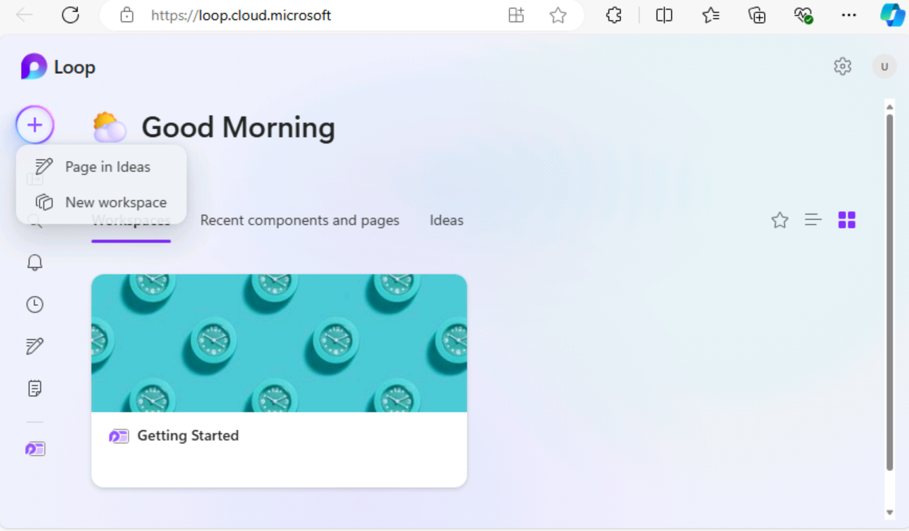

**Laboratório 04: Capacite sua força de trabalho - Copilot - Marketing**

**Objetivo:**

O Microsoft Copilot (no Bing) é um serviço de AI generativo baseado em
dados da Web pública somente no índice de pesquisa do Microsoft Bing.
Ele não tem acesso a recursos organizacionais ou conteúdo no Microsoft
365 Graph.

Como Diretor de Pesquisa de Mercado da Tailspin Toys, você deseja
realizar uma análise de mercado do setor de brinquedos para fornecer à
Senior Leadership Team (SLT) da empresa. Sua meta é identificar as
últimas tendências, as preferências dos consumidores e os brinquedos
mais populares do mercado.

Neste exercício, você utilizará a funcionalidade de chat do Microsoft
Copilot no Bing. Quando você usa o Microsoft Copilot, é importante
fornecer contexto e recursos ao criar suas solicitações. A qualidade da
resposta é uma função de como você elabora a solicitação seguindo as
dicas e escolhendo o estilo de conversa correto (Mais criativo, Mais
equilibrado ou Mais preciso).

1.  No Microsoft Edge, abra uma nova guia e digite a seguinte
    URL: +++**https://bing.com+++**

2.  No **Microsoft Bing**, na lista de guias na parte superior da
    página, selecione Copilot. Isso abre o **Microsoft Copilot**.

**Observação:**se você não vir a lista de guias na parte superior da
página, siga as etapas abaixo para visualizá- las.

- Verifique se você fez login usando as **credenciais do Microsoft 365**
  (disponíveis na guia **Resources**).

- -Ative a opção **Show menu bar **(destacado em vermelho)

3.  Agora, selecione **Copilot**. Isso abrirá o Microsoft Copilot.

4.  Na página do **Copilot**, observe o botão de alternância na parte
    superior da página que permite que você selecione **Work** ou
    **Web**. Embora sua solicitação seja uma tarefa relacionada ao
    trabalho, você precisa que o Copilot acesse a web para realizar a
    análise de mercado do setor de brinquedos. Se necessário, selecione
    o botão de alternância **Web**.

**Observação**: O seletor de tom de conversação **More Creative - More
Balanced - More Precise**, presente na versão anterior do Copilot, foi
abandonado na versão mais recente.

5.  No campo de prompt, digite o seguinte prompt e, em seguida,
    selecione o ícone **Submit**:

++**I'm the Director for Market Research for Tailspin Toys, a U.S. based
toy manufacturer. Conduct a market analysis of the toy industry to
identify sales figures, the latest trends, consumer preferences, and the
most popular toys in the market**.++ .

6.  Revise a análise de mercado gerada pelo Copilot. Você percebe que
    uma solicitação geral, como a que você enviou, fornece informações
    básicas como tendências de mercado, preferências do consumidor e
    tendências de brinquedos. Entretanto, você também está interessado
    em coletar dados sobre o setor de brinquedos, incluindo participação
    de mercado e feedback do consumidor. Você percebeu que foi um pouco
    vago demais em sua solicitação anterior, pois não solicitou essas
    informações específicas. Você se lembra das sugestões de práticas
    recomendadas de seu treinamento anterior - Seja educado e repita,
    repita, repita. Digite o seguinte prompt para alterar a análise de
    mercado:

**++That analysis was great. However, I'm also interested in including
data on the toy industry, including market share and consumer feedback.
Please amend your prior analysis to include this information.
Thanks!++ **

\<

7.  Você percebe que está cada vez mais perto do seu objetivo, mas ainda
    faltam algumas informações essenciais. Após revisar seus prompts
    anteriores, percebeu que forneceu ao Copilot o objetivo geral, o
    escopo da análise e os dados necessários. No entanto, você não
    solicitou que o Copilot analisasse todas essas informações para
    ajudá-lo a tomar decisões informadas sobre o plano de negócios da
    Tailspin Toys para o próximo ano. Para corrigir essa falha, digite o
    seguinte prompt:

**++I think all the data is complete. With all the information that you
captured, please analyze the data and identify patterns, trends, and
insights that can help me determine what Tailspin Toy's business plan
should be for the upcoming year++ **

8.  Você realmente gostou das informações que o Copilot forneceu. No
    entanto, como este é seu primeiro projeto para apresentar um
    relatório de análise de mercado à liderança sênior da empresa (SLT),
    você não tem certeza se está cobrindo todos os pontos importantes
    para eles. Para garantir que não está deixando nada de fora, você
    decide pedir ajuda ao Copilot para identificar eventuais lacunas:

**++Please analyze the data in this market analysis and business plan.
Is there any other information that a toy company would typically
request for market analysis and business plans that I failed to request?
If so, can you please amend your responses to include this information.
Thank you!++ **

9.  Com base nas informações fornecidas pelo Copilot, você percebe que
    pode realmente maximizar a eficácia dos seus relatórios fazendo com
    que o Copilot inclua uma análise dessas áreas. Para dar o toque
    final em seus relatórios, digite o seguinte prompt:

**++Please amend the market analysis to include an analysis of each of
these areas for the Toy industry. Also update the business plan that you
created for Tailspin Toys based on these insights. Thanks!++ **

10. A análise de mercado e o plano de negócios que o Copilot gerou para
    você foram baseados em um estilo de conversa predefinido. É ideal
    para usuários que desejam um equilíbrio entre precisão e
    criatividade.

Se estiver curioso para saber como ficariam os relatórios usando o
estilo **More Creative** (respostas mais imaginativas e criativas), você
poderá ajustar os prompts para definir manualmente o tom ou o foco,
dependendo se deseja resultados precisos, criativos ou equilibrados:

**Pontos a serem observados:**

- **Para respostas precisas**: Use prompts claros, específicos e
  orientados para detalhes. Indique que deseja respostas factuais e
  concisas, com foco na precisão.

- **Para respostas criativas**: Use prompts abertos, exploratórios ou
  imaginativos. Incentive o brainstorm ou sugira soluções onde a
  originalidade seja necessária.

- **Para respostas equilibradas:** Para respostas equilibradas, use
  prompts moderadamente abertos que solicitem uma combinação de detalhes
  factuais com um toque de criatividade. Você pode solicitar uma
  contribuição analítica e exploratória.

**Exportar uma resposta do Copilot**

Quando você usa o Microsoft Copilot no Bing para pesquisar diferentes
assuntos ou responder a diversas perguntas, pode decidir que uma
resposta é tão boa que deseja salvá-la para referência futura. 

Na parte inferior da resposta final do Copilot, selecione o botão
**Copy** para copiar a resposta e cole a resposta copiada em um editor
de texto. Se quiser consolidar várias respostas em um único documento,
será necessário copiar e colar manualmente cada resposta em um editor de
texto e salvar o arquivo.

**Observação**: Você verá um botão **Edit in Pages** que oferece mais
funcionalidades e facilita a colaboração em equipe. Não usaremos o
**Edit in Pages** neste exercício. Um exercício de laboratório separado
está incluído no Laboratório 06.

**Exercício 2: Faça um brainstorm de campanhas de marketing usando o
Copilot in Loop**

Você pode usar o Copilot in Loop para debater ideias, sobre novas
estratégias de marketing, planejar campanhas e desenvolver conteúdo. O
Copilot in Loop pode ajudá-lo a gerar ideias para postagens de blog,
artigos e outros tipos de conteúdo. Você pode inserir tópicos e o estilo
de conteúdo desejado, e o Copilot pode sugerir sugestões para ajudá-lo a
começar.

No exercício anterior, a Tailspin Toys realizou uma análise de mercado
do setor de brinquedos. Com base nessa análise, a empresa decidiu
introduzir uma nova linha de brinquedos para atividades ao ar livre.
Como gerente do programa de marketing da Tailspin Toys, você tem a
tarefa de criar campanhas de marketing para essa nova linha de
brinquedos. Neste exercício, você usará o Copilot in Loop para fazer um
brainstorm para uma campanha de marketing voltada para essa nova linha
de produtos.

1.  No **Microsoft 365**, selecione **Loop** se ele aparecer no painel
    de navegação à esquerda. Se ele não aparecer, selecione **App
    Launcher** na parte superior esquerda, logo acima do painel de
    navegação do **Microsoft 365**,

2.  Na página **Apps**, role para baixo até localizar **Loop** e, em
    seguida, selecione-o.

**Observação**: Se você não vir o **Loop** listado na página
Aplicativos, selecione **More apps.**

3.  Se o botão **Sign-in** for exibido, faça o login usando as
    credenciais de usuário.

**Observação**: Depois de fazer login, feche a janela do navegador do
Loop e abra novamente o Loop na página Aplicativos.

4.  No **Microsoft Loop**, a guia **Workspaces** é exibida por padrão.
    Se quiser criar um novo workspace para esse projeto, selecione **+**
    no canto superior esquerdo do menu de navegação e, em seguida,
    selecione o botão +**New workspace**.

5.  Na janela **Create a new workspace**, digite +++**Outdoor toy line
    Marketing Campaign**+++ como nome de seu workspace e, em seguida,
    selecione a opção disponível **Continue** ou **Create** (dependendo
    da versão do Loop que você usa).

6.  Na janela **Add files to your workspace** (dependendo da sua versão
    do Loop, essa janela pode dizer **Workspace Switcher**), selecione
    **Create**.

7.  Agora você está na primeira página do seu novo workspace. O nome da
    página atualmente é **Untitled**. Observe que a página (Untitled)
    também aparece no painel de navegação à esquerda. No corpo principal
    da página

selecione no campo **Untitled** e altere o nome da página para
+++**Ideas for Outdoor toy campaigns**+++. Observe como o nome da página
é atualizado automaticamente no painel de navegação.

8.  No campo **Just start typing**... insira uma barra (/).

9.  No menu suspenso que aparecer, na seção **Copilot** no topo do menu,
    selecione, **Draft page content**.

10. Na janela do **Copilot** que aparecer, observe a linha de botões
    abaixo do campo de prompt. Selecione cada botão
    (**Create, Brainstorm, Blueprint, and Describe)**. Ao fazer isso,
    note como o campo de prompt é preenchido automaticamente com um
    exemplo do tipo de tarefa que o Copilot pode ajudar a realizar. Como
    este exercício trata-se de um brainstorm, selecione o botão
    **Brainstorm**.

11. Observe como o Copilot preenche automaticamente o campo de prompt
    com uma sugestão de brainstorming. Na verdade, selecione o botão
    **Brainstorm** várias vezes e note como ele sugere um novo prompt de
    brainstorming a cada vez. O Copilot percorre sete exemplos
    diferentes de brainstorming e, depois, reinicia o ciclo. O objetivo
    desses exemplos é mostrar a diversidade de tópicos com os quais o
    Copilot pode ajudar a gerar ideias. Para este exercício, insira o
    seguinte no campo de prompt e selecione o ícone **Submit**

**++Brainstorm 10 ideas for a marketing campaign for a new line of
outdoor
toys.++ **

12. Revise a lista de ideias gerada. Em vez de ter todas as informações
    em forma de parágrafo ou lista, você prefere resumi-las em uma
    tabela. Além disso, você também quer que o Copilot forneça detalhes
    mais específicos para cada ideia.

13. No painel do Copilot exibido, digite o seguinte prompt no campo
    Rewrite with Copilot e selecione o ícone Submit (Enviar):

**++That looks good. However, please rewrite the report by placing the
information in a table and provide more specific details for each idea.++ **

14. Observe como o Copilot alterou a formatação do relatório. Agora você
    deseja que o Copilot adicione outra ideia à tabela intitulada
     **Supermarket store promotions**. Para isso, digite o seguinte
    prompt:

**++Add an idea for Supermarket store promotions.++ **

15. Quando você pede ao Copilot para adicionar uma nova ideia, ele pode
    incluí-la em uma nova tabela ou no final da tabela atual. De
    qualquer forma, após uma reflexão mais aprofundada, você percebe que
    promover brinquedos ao ar livre em um supermercado não é uma boa
    ideia e decide removê-la da lista. Então, como você pode desfazer o
    que acabou de fazer?

À direita da tabela (seja a tabela original ou uma nova que tenha apenas
a ideia de **Supermarket store promotions**), observe como o Copilot
rastreia cada um dos seus prompts. Os prompts são exibidos em ordem
sequencial, do mais recente ao primeiro. Mais importante: cada prompt
inclui um ícone **Undo**. Se não estiver satisfeito com o resultado de
um prompt, você pode desfazer a ação para voltar à versão anterior do
rascunho. Como você decidiu que não deseja mais incluir as **Supermarket
store promotions** na tabela, selecione o ícone **Undo** para esse
prompt.

16. Depois de selecionar o ícone **Undo**, observe como o Copilot
    excluiu o prompt e retornou ao rascunho após o segundo prompt que
    colocou as ideias em uma tabela. Nesse ponto, você está pronto para
    que o Copilot classifique as ideias da melhor para a pior. Digite o
    seguinte prompt para classificar as ideias.

**++Please sort the ideas in the table starting from most effective to
least effective.++ **

**Observação:** Localize o ícone **Sort** (setas para cima e para baixo)
na barra de ícones acima da lista de ideias. Essa opção simplesmente
classifica as ideias em ordem alfabética. Você pode realizar a
classificação pelo nome de cada **Idea** ou pela primeira palavra em
cada campo **Details**.

17. Após revisar as ideias organizadas, você decide fazer uma última
    alteração. Você deseja que o Copilot substitua a ideia menos eficaz
    por um evento de campanha intitulado **Seasonal Promotions**. Parece
    ser uma ótima combinação para a nova linha de brinquedos ao ar
    livre. Para fazer isso, insira o seguinte prompt:

**++Please replace the final idea in the table with Seasonal
Promotions.++ **

18. Quando chegar a hora de apresentar a lista de ideias para a campanha
    de marketing que você brainstorm ou com a ajuda do Copilot in Loop,
    você pode acessar o workspace ** Ideas for Outdoor toy campaigns**,
    que o Loop salvou automaticamente.

**Exercício 3: Consolidar vários relatórios de marketing usando o
Copilot no Word**

O Copilot no Word, um assistente de redação alimentado por AI, pode
ajudar a reescrever conteúdos existentes ou até mesmo transformar textos
selecionados em tabelas.

Como Diretor de Marketing da América Latina (LATAM) da Contoso Beverage,
uma divisão da Contoso, Ltd., seu gerente de produtos lhe forneceu três
relatórios separados sobre a bebida Mystic Spice Premium Chai Tea. No
entanto, você está tendo dificuldades para analisar todas as
informações, pois precisa alternar constantemente entre documentos.

Você decide combinar os relatórios em um único Relatório de Análise de
Mercado LATAM para o Mystic Spice Premium Chai Tea. Neste exercício,
você usará o Copilot para criar o relatório combinado, revisá-lo e
possivelmente atualizá-lo com outras informações que o Copilot possa
encontrar sobre o mercado de Chai Tea na América Latina.

1.  Se você tiver uma guia do Microsoft 365 aberta no navegador
    Microsoft Edge, selecione-a agora; caso contrário, abra uma nova
    guia e digite a seguinte URL:
    +++[https://www.office.com+++](https://www.office.com+++/) para
    acessar a página inicial do Microsoft 365.

**Observação**: Você precisa fazer login (se solicitado) usando as
**Credenciais do Microsoft 365** fornecidas na guia **Resources** à
direita.

2.  No painel de navegação do **Microsoft 365**, selecione **OneDrive**
    para abri-lo.

3.  Navegue até a pasta **C:\LabFiles** para selecionar e carregar uma
    cópia dos seguintes documentos no OneDrive.

    - **Mystic Spice Premium Chai Tea product description.**

    - **Contoso Chai Tea market trends 2023.**

    - **Promotion Plan for Chai Tea in Latin America.**

**Observação**: Se já tiver feito upload de todos os recursos do
laboratório para o OneDrive, conforme sugerido na seção **Preparing for
the lab execution**, você poderá pular esta etapa.

4.  Neste exercício, você acessará os documentos da lista de arquivos
    usados mais recentemente. Para que os arquivos apareçam na lista
    MRU, abra cada documento e, em seguida, feche-o. Abra e feche cada
    um dos três arquivos em seu OneDrive.

5.  No **Microsoft 365**, abra o **Microsoft Word** e, em seguida, abra
    um novo documento em branco.

6.  Na janela **Draft with Copilot** que aparece na parte superior do
    documento em branco, digite o seguinte prompt, mas não selecione o
    botão **Generate** até que você vincule os três arquivos ao prompt:

**+++I'm the LATAM Marketing Director for Contoso Beverage. Please
create a LATAM Market Analysis report for our Mystic Spice Premium Chai
Tea beverage. Combine the three attached files to create a report that
describes the product, analyzes the market trend for it, and includes a
promotion plan for Latin America.+++ **

7.  Agora você deve anexar os três documentos ao prompt. Na janela
    **Draft with Copilot**, selecione o botão **Reference your
    content**. No menu suspenso que aparece, se o arquivo **Mystic Spice
    Premium Chai Tea product description.docx** estiver na lista de
    arquivos, selecione-o. Caso contrário, selecione **Browse files from
    cloud**, selecione o arquivo na lista Arquivos **recents** e, em
    seguida, selecione o botão **Attach**. Observe como o arquivo é
    exibido no prompt.

8.  Repita a etapa anterior tanto para o arquivo **Contoso Chai Tea
    market trends 2023.docx** quanto para o arquivo  **Promotion Plan
    for Chai Tea in Latin America.docx**. Nesse ponto, os links para os
    três arquivos devem aparecer no prompt.

9.  Selecione **Generate**. Ao fazer isso, o Copilot extrai as
    informações pertinentes dos três arquivos e elabora um relatório que
    os combina em um único relatório de análise de mercado para o Mystic
    Spice Premium Chai Tea.

10. Após revisar esse primeiro rascunho do relatório de Análise de
    Mercado, você reconhece que faltam algumas informações essenciais.
    Você gostaria que ele incluísse uma seção intitulada **Análise
    competitiva**. Você deseja que o Copilot analise a concorrência.
    Para isso, digite o seguinte prompt na janela do Copilot, na parte
    inferior do relatório, e selecione a seta **Generate**:

**+++This report looks good. However, please add a section titled
Competitive Analysis. Review the beverage companies in Latin America
that sell Chai Tea and then provide information in this section on the
strengths and weaknesses of these competitors, their market share, and
their pricing strategies.+++ **

11. Após revisar esse segundo rascunho do relatório que contém a nova
    seção de Análise Competitiva, você percebe que falta uma última
    coisa. Você quer que o Copilot adicione uma seção sobre
    **Distribution Channels**. Essa seção deve analisar os canais de
    distribuição usados para vender o Chai Tea na América Latina. Para
    isso, digite o seguinte prompt na janela do Copilot, na parte
    inferior do relatório, e selecione a seta **Generate**:

**+++Nice job! One last thing. Please add a section titled Distribution
Channels. Review the distribution channels used to sell Chai Tea in
Latin America and then provide information in this section on the types
of retailers, wholesalers, and distributors used.+++ **

12. Após revisar esse último rascunho que contém a nova seção
    Distribution Channels, você está satisfeito com o relatório e está
    pronto para salvá-lo. Na janela do Copilot, na parte inferior do
    documento, selecione o botão **Keep it** para convertê-lo de um
    rascunho do Copilot em um documento do Word.

13. Revise o documento. Se quiser fazer alguma alteração manual, você
    pode fazê-lo agora. Quando estiver satisfeito, salve o documento no
    OneDrive se quiser mantê-lo para referência futura ou simplesmente
    descarte-o.

14. Feche essa guia no navegador Microsoft Edge.

**Exercício 4: Analisar uma planilha de tendências de mercado usando o
Copilot no Excel**

O Copilot no Excel é uma ferramenta poderosa que pode ajudar os
profissionais de Marketing a criar, editar, entender e visualizar seus
dados com facilidade e obter insights sobre seus negócios.

Os recursos de AI do Copilot podem ajudar os profissionais de marketing
a economizar tempo e esforço automatizando tarefas repetitivas (analisar
resultados comerciais trimestrais, resumir as principais tendências,
aplicar codificação de cores a tabelas, criar modelos, cenários, filtrar
e classificar e adicionar gráficos com o clique de um mouse) e
fornecendo insights valiosos que podem ajudá-los a tomar decisões
informadas.

Como diretor de marketing da Contoso Beverage, uma divisão da Contoso,
Ltd., você recebeu uma planilha de tendências de mercado que mostra a
atividade mensal do produto Chai Tea da Contoso. Você deseja usar os
recursos do Copilot no Excel para analisar o relatório e fornecer uma
análise detalhada das tendências mensais de marketing.

Neste exercício, você usará o Copilot no Excel para analisar uma
planilha de tendências de mercado que já tem uma tabela do Excel
definida.

1.  Se você tiver uma guia do Microsoft 365 aberta no navegador
    Microsoft Edge, selecione-a agora; caso contrário, abra uma nova
    guia e digite a seguinte URL: +++https://www.office.com+++ para
    acessar a página inicial do Microsoft 365.

**Observação**: Você precisa fazer login (se solicitado) usando as
**Credenciais do Microsoft 365** fornecidas na guia **Resource** à
direita.

2.  No painel de navegação do **Microsoft 365**, selecione **OneDrive**
    para abri-lo.

3.  Navegue até a pasta **C:\LabFiles** para selecionar e carregar uma
    cópia da planilha **Contoso Chai Tea market trends 2023** no
    **OneDrive** e, em seguida, abra e feche o arquivo para colocá-lo na
    lista de arquivos Most Recently Used (MRU).

**Observação**: Se você já tiver feito upload de todos os recursos do
laboratório para o OneDrive, conforme sugerido em **Preparing for the
lab execution**, poderá pular esta etapa.

4.  Na página inicial do **Microsoft 365**, selecione o ícone do
    **Excel** no painel de navegação à esquerda.

5.  No **Excel**, na página **File**, selecione **Contoso Chai Tea
    market trends 2023.xlsx** na lista de arquivos.

6.  Selecione a opção **Copilot** no lado direito da faixa de opções.

7.  No painel do **Copilot** que aparece, há vários prompts predefinidos
    disponíveis para você escolher. Selecione o botão **Show data
    insights**.

8.  Observe o gráfico dinâmico que ele gerou. Quando testamos esse
    exercício, o Copilot sempre criou um gráfico de linhas relativo à
    **Social Media Engagement (views) by Date**. Que tipo de gráfico o
    Copilot criou para você? Abaixo do gráfico que o Copilot criou para
    você, selecione o botão **+Add to a new sheet**.

9.  Embora o Copilot diga que adicionou o gráfico à Planilha 2, a
    Planilha 2 não está visível na planilha.

10. Tente com a planilha do Excel maximizada e repita a etapa 11. A
    **função** **Add to sheet** funcionou bem agora.

11. Selecione **Sheet 2**. Analise a nova planilha de dados que o
    Copilot criou. O Copilot incluiu tanto o gráfico quanto a coluna de
    dados da planilha, que serviu como base para esse gráfico. Passe o
    cursor sobre o gráfico e observe a janela que aparece, indicando o
    tipo de gráfico que o Copilot gerou.

12. Observe que, no painel do Copilot, a lista de prompts predefinidos
    não aparece mais. Isso acontece porque o Copilot ainda não funciona
    com tabelas dinâmicas (observe a mensagem que indica esse problema).
    Selecione **Sheet 1** para retornar à tabela do Excel. Observe como
    os prompts predefinidos reaparecem.

13. Nos prompts predefinidos que aparecem acima do campo de prompt,
    selecione o botão **Show suggestions for formula columns**.

14. Observe a sugestão fornecida pelo Copilot. A imagem a seguir mostra
    a sugestão que o Copilot forneceu durante nossos testes.

15. Na sugestão que você recebeu, selecione a seta suspensa **Explain
    formula**. Revise a explicação do Copilot que descreve o cálculo.
    Selecione o botão **+Insert Column** para inserir essa coluna em sua
    tabela do Excel.

16. Observe como o Copilot adicionou essa coluna de dados ao final de
    sua tabela do Excel na **Sheet 2**. Esse recurso está lhe
    intrigando? Talvez você queira ver quais outras sugestões de
    fórmulas ele oferece. Selecione novamente o botão **Show suggestions
    for formula columns**. Observe a sugestão. Selecione o botão
    **+Insert Column** para inserir essa coluna sugerida em sua tabela
    do Excel.

17. Nos prompts predefinidos que aparecem acima do campo de prompt,
    selecione o botão **How can I highlight, filter, and sort data**?

18. Observe a lista de ações que você pode realizar.

19. Neste ponto, os prompts predefinidos exibidos pelo Copilot não são
    mais do seu interesse. Para visualizar um novo conjunto de prompts:
    Selecione o botão **Refresh** que aparece acima do campo de prompt.

20. Analise a lista revisada de prompts predefinidos que agora são
    exibidas. A imagem a seguir mostra exemplos de prompts que foram
    exibidos.

21. O objetivo deste exercício é entender os diferentes tipos de ações
    predefinidas que o Copilot pode executar. Portanto, selecione
    diferentes prompts para ver o que acontece. Por exemplo:

    - Se aparecer um prompt **Sort**, selecione-o agora e observe como o
      Copilot ordena os dados para você.

    - Se aparecer um prompt **Bold**, selecione-o agora e observe como o
      Copilot coloca os itens mencionados em negrito, deixando os demais
      sem formatação.

22. Selecione novamente o botão **Refresh** que aparece acima do campo
    de prompt.

> 

23. Analise o novo conjunto de prompts que aparecem. Selecione o botão
    **Refresh** várias vezes para visualizar os diferentes tipos de
    prompts que o Copilot fornece.

24. Sinta-se à vontade para selecionar quaisquer outros prompts e
    observar como o Copilot executa as ações. Quando terminar, feche a
    guia do navegador Microsoft Edge.

**Resumo:**

Neste laboratório, você usou

- Microsoft Copilot (modo Bing/Web) para analisar tendências de mercado.

- Copilot in Loop para gerar ideias de campanhas de marketing para uma
  nova linha de produtos.

- Copilot no Word para combinar vários relatórios de marketing em um
  documento coeso.

- Copilot Excel para analisar tendências de mercado em uma planilha.

Por meio dessas atividades, você pode simplificar os processos e
melhorar a eficácia geral de suas campanhas de marketing.
