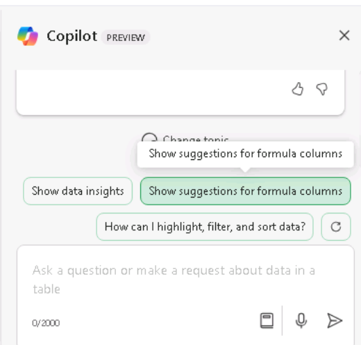

**Lab 04: Stärken Sie Ihre Belegschaft – Copilot – Marketing**

**Ziel:**

Microsoft Copilot (innerhalb von Bing) ist ein generativer KI-Dienst,
der auf Daten aus dem öffentlichen Web basiert, die nur im Microsoft
Bing-Suchindex enthalten sind. Es hat keinen Zugriff auf
organisatorische Ressourcen oder Inhalte innerhalb von Microsoft 365
Graph.

Als Direktor für Marktforschung bei Tailspin Toys möchten Sie eine
Marktanalyse der Spielzeugindustrie durchführen, um sie dem Senior
Leadership Team (SLT) des Unternehmens zur Verfügung zu stellen. Ihr
Ziel ist es, die neuesten Trends, Verbraucherpräferenzen und die
beliebtesten Spielzeuge auf dem Markt zu identifizieren.

In dieser Übung verwenden Sie die Microsoft Copilot-Chatfunktion in
Bing. Wenn Sie Microsoft Copilot verwenden, ist es wichtig, beim
Erstellen Ihrer Eingabeaufforderungen Kontext und Ressourcen
bereitzustellen. Die Qualität der Antwort hängt davon ab, wie Sie die
Anfrage formulieren, indem Sie die Tipps befolgen und den richtigen
Gesprächsstil auswählen (entweder kreativer, ausgewogener oder
präziser).

- Öffnen Sie in **Microsoft Edge** einen neuen Tab und geben Sie die
  folgende URL ein: +++[**https://bing.com+++**](https://bing.com+++/)

- Wählen Sie in **Microsoft Bing** in der Liste der Registerkarten oben
  auf der Seite **Copilot** aus. Dadurch wird Microsoft Copilot
  geöffnet.

**Hinweis:** Wenn Sie die Liste der Registerkarten oben auf der Seite
nicht sehen, führen Sie die folgenden Schritte aus, um die Liste der
Registerkarten anzuzeigen.

- Stellen Sie sicher, dass Sie sich mit dem Microsoft
  **365-Anmeldeinformationen** angemeldet haben (verfügbar auf der
  Registerkarte **Resource**).

- Aktivieren Sie die Option **Show menu bar** (rot hervorgehoben)

3.  Wählen Sie nun **Copilot** aus. Dadurch wird Microsoft Copilot
    geöffnet.

4.  Beachten Sie auf der **Copilot-**Seite den Umschalter oben auf der
    Seite, mit dem Sie entweder **Work oder Web** auswählen können.
    Obwohl es sich bei Ihrer Anfrage um eine arbeitsbezogene Aufgabe
    handelt, benötigen Sie Copilot, um auf das Internet zuzugreifen, um
    seine Marktanalyse der Spielzeugindustrie durchzuführen. Wählen Sie
    bei Bedarf den Umschalter **Web** aus.

**Hinweis**: Der in der vorherigen Copilot-Version wurden vorhandene
Konversationstönwähler, **More Creative -More Balanced- More Precise**
in der neuesten Version weggelassen.

5.  Geben Sie im Eingabeaufforderungsfeld die folgende
    Eingabeaufforderung ein, und wählen Sie dann das Symbol **Send**
    aus:

++**I'm the Director for Market Research for Tailspin Toys, a U.S. based
toy manufacturer. Conduct a market analysis of the toy industry to
identify sales figures, the latest trends, consumer preferences, and the
most popular toys in the market**.++

6.  Überprüfen Sie die Marktanalyse, die Copilot erstellt hat. Sie
    stellen fest, dass eine allgemeine Anfrage wie die von Ihnen
    eingereichte grundlegende Informationen wie Markttrends,
    Verbraucherpräferenzen und Spielzeugtrends enthält. Sie sind aber
    auch daran interessiert, Daten über die Spielwarenindustrie zu
    sammeln, einschließlich Marktanteile und Kundenfeedback. Sie haben
    festgestellt, dass Sie in Ihrer vorherigen Aufforderung etwas zu
    vage waren, da Sie es versäumt haben, diese spezifischen
    Informationen anzufordern. Sie erinnern sich an die
    Best-Practice-Vorschläge aus Ihrem früheren Training - Seien Sie
    höflich und iterieren, iterieren, iterieren. Geben Sie die folgende
    Eingabeaufforderung ein, um die Marktanalyse zu ändern:

++**That analysis was great. However, I'm also interested in including
data on the toy industry, including market share and consumer feedback.
Please amend your prior analysis to include this information.
Thanks**!++

\<

7.  Sie merken, dass Sie dem Ziel näherkommen, aber es fehlen noch
    einige wichtige Informationen. Nachdem Sie Ihre vorherigen
    Eingabeaufforderungen überprüft haben, haben Sie festgestellt, dass
    Sie Copilot Ihr Gesamtziel, den Umfang der Analyse und die
    benötigten Daten zur Verfügung gestellt haben. Sie haben es jedoch
    versäumt, Copilot zu bitten, all diese Informationen zu analysieren,
    damit Sie fundierte Entscheidungen über den Geschäftsplan von
    Tailspin Toys für das kommende Jahr treffen können. Um diesen Mangel
    zu beheben, geben Sie die folgende Eingabeaufforderung ein:

++**I think all the data is complete. With all the information that you
captured, please analyze the data and identify patterns, trends, and
insights that can help me determine what Tailspin Toy's business plan
should be for the upcoming year**++

8.  Sie mögen die Informationen, die Copilot bereitgestellt hat, sehr.
    Da dieses Projekt jedoch Ihre erste Gelegenheit ist, einen
    Marktanalysebericht für die SLT Ihres Unternehmens bereitzustellen,
    sind Sie sich nicht sicher, ob Sie alles abdecken, was für sie von
    Interesse sein könnte. Sie entscheiden sich dafür, dass Copilot
    Ihnen hilft, festzustellen, ob Ihnen etwas fehlt. Geben Sie die
    folgende Eingabeaufforderung ein:

++**Please analyze the data in this market analysis and business plan.
Is there any other information that a toy company would typically
request for market analysis and business plans that I failed to request?
If so, can you please amend your responses to include this information.
Thank you**!++

9.  Basierend auf den Informationen, die Copilot bereitstellt, stellen
    Sie fest, dass Sie die Effektivität Ihrer Berichte wirklich
    maximieren können, indem Sie Copilot eine Analyse dieser Bereiche
    einbeziehen. Um Ihren Berichten den letzten Schliff zu geben, geben
    Sie die folgende Eingabeaufforderung ein:

++**Please amend the market analysis to include an analysis of each of
these areas for the Toy industry. Also update the business plan that you
created for Tailspin Toys based on these insights. Thanks**!++

10. Die Marktanalyse und der Businessplan, die Copilot für Sie erstellt
    hat, basieren auf einem vordefinierten Gesprächsstil. Es ist ideal
    für Benutzer, die ein Gleichgewicht zwischen Präzision und
    Kreativität suchen.

Wenn Sie neugierig sind, wie die Berichte mit dem **More Creative** Stil
(Antworten, die einfallsreicher und kreativer sind) aussehen würden,
können Sie Ihre Eingabeaufforderungen anpassen, um den Ton oder den
Fokus manuell festzulegen, je nachdem, ob Sie präzise, kreative oder
ausgewogene Ausgaben wünschen:

**Zu beachtende Punkte**:

- **Für präzise Antworten**: Verwenden Sie klare, spezifische und
  detailorientierte Aufforderungen. Geben Sie an, dass Sie sachliche,
  prägnante Antworten mit Schwerpunkt auf Genauigkeit wünschen.

- **Für kreative Antworten**: Verwenden Sie offene, explorative oder
  fantasievolle Aufforderungen. Fördern Sie das Brainstorming oder
  schlagen Sie Lösungen vor, bei denen Originalität erforderlich ist.

- **Für ausgewogene Antworten:** Verwenden Sie mäßig offene
  Aufforderungen, die eine Mischung aus sachlichen Details und etwas
  Kreativität erfordern. Sie können sowohl analytischen als auch
  explorativen Input anfordern.

**Exportieren einer Copilot-Antwort**

Wenn Sie Microsoft Copilot in Bing verwenden, um verschiedene Dinge zu
recherchieren oder verschiedene Fragen zu beantworten, entscheiden Sie
möglicherweise, dass eine Antwort so gut ist, dass Sie sie zum späteren
Nachschlagen speichern möchten.

Wählen Sie am unteren Rand der endgültigen Antwort von Copilot die
Schaltfläche **Copy** aus, um die Antwort zu kopieren und die kopierte
Antwort in einen Texteditor einzufügen. Wenn Sie mehrere Antworten in
einem einzigen Dokument konsolidieren möchten, müssen Sie jede Antwort
manuell kopieren und in einen Texteditor einfügen und die Datei
speichern.

**Hinweis**: Sie sehen die Schaltfläche **Edit in Pages,** die mehr
Funktionalität bietet und die Zusammenarbeit im Team erleichtert. In
**Edit in Pages** wird in dieser Übung nicht verwendet. Eine separate
Lab-Übung ist in Lab \#06 enthalten.

**Übung \#2: Brainstorming von Ideen für Marketingkampagnen mit Copilot
in Loop**

Sie können Copilot in Loop verwenden, um neue Marketingstrategien zu
entwickeln, Kampagnen zu planen und Inhalte zu entwickeln. Copilot in
Loop kann Ihnen helfen, Ideen für Blog-Posts, Artikel und andere
Inhaltstypen zu generieren. Sie können Themen und den gewünschten
Inhaltsstil eingeben, und Copilot kann Eingabeaufforderungen
vorschlagen, die Ihnen den Einstieg erleichtern.

In der vorherigen Übung führte Tailspin Toys eine Marktanalyse der
Spielzeugindustrie durch. Auf der Grundlage dieser Analyse beschloss das
Unternehmen, eine neue Linie von Outdoor-Spielzeug einzuführen. Als
Marketing Program Manager bei Tailspin Toys haben Sie die Aufgabe,
Marketingkampagnen für diese neue Spielzeuglinie zu erstellen. In dieser
Übung verwenden Sie Copilot in Loop, um Ideen für eine Marketingkampagne
zu entwickeln, die auf diese neue Produktlinie ausgerichtet ist.

1.  Wählen Sie in **Microsoft 365 Loop** aus**,** wenn sie im linken
    Navigationsbereich angezeigt wird. Wenn es dort nicht angezeigt
    wird, wählen Sie oben links direkt über dem **Microsoft
    365-Navigationsbereich** **App Launcher** aus.

2.  Scrollen Sie auf der Seite **Apps** nach unten, um **Loop** zu
    suchen, und wählen Sie es dann aus.

**Hinweis**: Wenn **Loop** auf der Seite "Apps" nicht aufgeführt ist,
wählen Sie **More Apps** aus**.**

3.  Wenn die Schaltfläche **Sign In** angezeigt wird, melden Sie sich
    mit den Benutzeranmeldeinformationen an.

**Hinweis**: Schließe nach der Anmeldung das Loop-Browserfenster und
öffne Loop erneut auf der Apps-Seite.

4.  In **Microsoft Loop** wird die Registerkarte **Workspaces**
    standardmäßig angezeigt. Wenn Sie einen neuen Arbeitsbereich für
    dieses Projekt erstellen möchten, wählen Sie oben links im
    Navigationsmenü **+** aus, und wählen Sie dann die Schaltfläche
    +**New Workspaces** aus.

5.  Im **Create a new workspace** Fenster, geben Sie+++**Outdoor toy
    line Marketing Campaign**+++ für den Namen Ihres Arbeitsbereichs und
    wählen Sie dann entweder die **Schaltfläche Continue** oder
    **Cretae** aus, die angezeigt wird (abhängig von Ihrer
    Loop-Version).

6.  Wählen Sie im Fenster **Add files to your workspace** (je nach
    Loop-Version wird in diesem Fenster möglicherweise **Workspace
    Switcher** angezeigt) die Option **Create** aus.

7.  Du befindest dich jetzt auf der ersten Seite deines neuen
    Arbeitsbereichs. Der Name der Seite ist derzeit **Untitled**.
    Beachten Sie, dass die Seite (Untitled) auch im linken
    Navigationsbereich angezeigt wird. Wählen Sie im Hauptteil der Seite
    das Feld **Untitled** aus und ändern Sie den Namen der Seite in
    +++**Ideas for Outdoor toy campaigns**+++. Beachten Sie, wie der
    Seitenname im Navigationsbereich automatisch aktualisiert wird.

8.  In der Datei **Just start typing...** einen Schrägstrich ein
    **(/)**.

9.  Wählen Sie im angezeigten Dropdown-Menü unter dem Abschnitt
    **Copilot** oben im Menü die Option **Draft page content**.

10. Beachten Sie im angezeigten Copilot-Fenster die Reihe der
    Schaltflächen, die unter dem Eingabeaufforderungsfeld angezeigt
    werden. Wählen Sie die einzelnen Schaltflächen aus
    (**Create**, **Brainstorm**, **Blueprint**, and **Describe).**
    Beachten Sie dabei, wie das Eingabeaufforderungsfeld mit einem
    Beispiel für die Art der Aufgabe ausgefüllt wird, bei der Copilot
    helfen kann. Da es in dieser Übung um Brainstorming geht, wählen Sie
    die Schaltfläche **Brainstorming** aus.

11. Beachten Sie, wie Copilot das Eingabeaufforderungsfeld mit einem
    Brainstorming-Vorschlag vorausfüllt. Wählen Sie die Schaltfläche
    **Brainstorming** mehrmals aus. Beachten Sie, wie jedes Mal eine
    neue Brainstorming-Aufforderung vorgeschlagen wird. Copilot
    durchläuft sieben verschiedene Brainstorming-Beispiele und beginnt
    dann wieder von vorne. Der Zweck dieser Beispiele besteht darin,
    Ihnen eine Vorstellung davon zu geben, welche vielseitigen Arten von
    Dingen Copilot beim Brainstorming unterstützen kann. Geben Sie für
    diese Übung das folgende Eingabeaufforderungsfeld ein, und wählen
    Sie das Symbol **Send** aus:

++**Brainstorm 10 ideas for a marketing campaign for a new line of
outdoor toys**.++

12. Überprüfen Sie die generierte Liste der Ideen. Anstatt alle
    Informationen in Absatz- oder Listenform zu haben, ziehen Sie es
    vor, sie in einer Tabelle zusammenzufassen. Außerdem möchten Sie,
    dass Copilot für jede Idee spezifischere Details bereitstellt.

13. Geben Sie im angezeigten **Copilot-**Bereich die folgende
    Eingabeaufforderung in das Feld **Rewrite with Copilot** ein, und
    wählen Sie das Symbol **Send** aus**:**

++**That looks good. However, please rewrite the report by placing the
information in a table and provide more specific details for each
idea**.++

14. Beachten Sie, wie Copilot die Formatierung des Berichts geändert
    hat. Sie möchten nun, dass Copilot der Tabelle mit dem Titel
    **Supermarket store promotions** eine weitere Idee hinzufügt. Geben
    Sie dazu die folgende Eingabeaufforderung ein:

++**Add an idea for Supermarket store promotions**.++

15. Wenn Sie Copilot bitten, eine neue Idee hinzuzufügen, wird sie
    möglicherweise in eine neue Tabelle eingefügt oder am Ende der
    aktuellen Tabelle hinzugefügt. In jedem Fall entscheiden Sie nach
    reiflicher Überlegung, dass es eine schlechte Idee ist, für
    Outdoor-Spielzeug in einem Supermarkt zu werben, und Sie möchten es
    nicht mehr in die Liste aufnehmen. Wie können Sie also das
    rückgängig machen, was Sie gerade getan haben?

Beachten Sie rechts neben der Tabelle (entweder Ihre ursprüngliche
Tabelle oder eine neue Tabelle, die nur die Idee **Supermarket store
promotions** enthält), wie Copilot jede Ihrer Eingabeaufforderungen
verfolgt. Die Eingabeaufforderungen werden von der letzten
Eingabeaufforderung bis zur ersten Eingabeaufforderung in sequenzieller
Reihenfolge angezeigt. Noch wichtiger ist, dass jede Eingabeaufforderung
ein **Undo** enthält**.** Wenn Sie mit den Ergebnissen einer
Eingabeaufforderung nicht zufrieden sind, können Sie sie rückgängig
machen, um zur Version des Entwurfs vor dieser Eingabeaufforderung
zurückzukehren. Da Sie sich entschieden haben, dass Sie keine
**Supermarket store promotions** mehr in die Tabelle aufnehmen möchten,
wählen Sie das Symbol **Undo** für diese Eingabeaufforderung aus.

16. Nachdem Sie das Symbol **Undo** ausgewählt haben, beachten Sie, wie
    Copilot die Eingabeaufforderung gelöscht und Sie nach der zweiten
    Eingabeaufforderung, in der die Ideen in einer Tabelle abgelegt
    wurden, zum Entwurf zurückgekehrt sind. An diesem Punkt sind Sie
    bereit, Copilot die Ideen von den besten bis zu den schlechtesten
    sortieren zu lassen. Geben Sie die folgende Eingabeaufforderung ein,
    um die Ideen zu sortieren:

++**Please sort the ideas in the table starting from most effective to
least effective**.++

**Hinweis:** Suchen Sie das Symbol **Sort** (die Pfeile nach oben und
unten), das in der Symbolleiste über der Liste der Ideen angezeigt wird.
Diese Option sortiert die Ideen einfach in alphabetischer Reihenfolge.
Sie können die Sortierung entweder nach dem Namen jeder **Idea** oder
nach dem ersten Wort in jedem **Detailfeld** durchführen.

17. Nachdem Sie die sortierten Ideen überprüft haben, entscheiden Sie
    sich für eine letzte Änderung. Sie möchten, dass Copilot die am
    wenigsten effektive Idee durch ein Kampagnenereignis mit dem Titel
    **Seasonal Promotions** ersetzt. Du denkst, es passt perfekt zu
    einer neuen Spielzeuglinie, die sich auf Outdoor-Produkte
    konzentriert. Geben Sie dazu die folgende Eingabeaufforderung ein:

++**Please replace the final idea in the table with Seasonal
Promotions**.++

18. Wenn es an der Zeit ist, die Liste der Ideen für Marketingkampagnen
    zu präsentieren, die Sie mit Hilfe von Copilot in Loop erstellt
    haben, können Sie auf den **Ideas for Outdoor toy
    campaigns** zugreifen, den Loop automatisch gespeichert hat.

**Übung \#3: Konsolidieren mehrerer Marketingberichte mit Copilot in
Word**

Copilot in Word, ein KI-gestützter Schreibassistent, kann Ihnen dabei
helfen, vorhandene Inhalte neu zu schreiben oder sogar ausgewählte
Inhalte in eine Tabelle umzuwandeln.

Als Marketingdirektor für Lateinamerika (LATAM) bei Contoso Beverage,
einem Geschäftsbereich von Contoso, Ltd., hat Ihnen Ihr Produktmanager
drei separate Berichte zum Mystic Spice Premium Chai Tea-Getränk des
Unternehmens zur Verfügung gestellt. Es fällt Ihnen jedoch schwer, die
Informationen zu analysieren, da Sie ständig zwischen Dokumenten hin-
und herspringen.

Sie entscheiden sich, die Berichte in einem einzigen
LATAM-Marktanalysebericht für Mystic Spice Premium Chai Tea zu
kombinieren. In dieser Übung verwenden Sie Copilot, um den kombinierten
Bericht zu erstellen, ihn zu überprüfen und möglicherweise mit anderen
Informationen zu aktualisieren, die Copilot auf dem Chai-Tee-Markt in
Lateinamerika finden kann.

1.  Wenn Sie ein Microsoft 365-Tab in Ihrem Microsoft Edge-Browser
    geöffnet haben, wählen Sie ihn jetzt aus. Andernfalls öffnen Sie
    einen neuen Tab, und geben Sie die folgende URL ein:
    +++[https://www.office.com+](https://www.office.com+++/)++, um zur
    Microsoft 365-Startseite zu gelangen.

**Hinweis**: Sie müssen sich (wenn Sie dazu aufgefordert werden) mit den
**Microsoft 365-Anmeldeinformationen** anmelden, die auf der
Registerkarte **Resources** auf der rechten Seite bereitgestellt werden.

2.  Wählen Sie im **Microsoft 365-**Navigationsbereich **OneDrive**
    aus**,** um es zu öffnen.

3.  Navigieren Sie zum **Ordner C:\LabFiles**, um eine Kopie der
    folgenden Dokumente auszuwählen und auf OneDrive hochzuladen.

    - **Mystic Spice Premium Chai Tea product description.**

    - **Contoso Chai Tea market trends 2023.**

    - **Promotion Plan for Chai Tea in Latin America.**

**Hinweis**: Wenn Sie bereits alle Lab-Ressourcen auf OneDrive
hochgeladen haben, wie im **Preparing for the lab execution**
vorgeschlagen, können Sie diesen Schritt überspringen.

4.  In dieser Übung greifen Sie auf die Dokumente aus der Liste der
    zuletzt verwendeten Dateien zu. Damit die Dateien in der MRU-Liste
    angezeigt werden, öffnen Sie jedes Dokument, und schließen Sie es
    dann. Öffnen und schließen Sie jede der drei Dateien in Ihrem
    OneDrive.

5.  Öffnen Sie **in** Microsoft 365 **Microsoft Word**, und öffnen Sie
    dann ein neues leeres Dokument.

6.  Geben Sie im Fenster Entwurf mit Copilot, das am oberen Rand des
    leeren Dokuments angezeigt wird, die folgende Eingabeaufforderung
    ein, aber wählen Sie die Schaltfläche **Generate** erst aus, nachdem
    Sie die drei Dateien mit der Eingabeaufforderung verknüpft, haben:

+++**I'm the LATAM Marketing Director for Contoso Beverage. Please
create a LATAM Market Analysis report for our Mystic Spice Premium Chai
Tea beverage. Combine the three attached files to create a report that
describes the product, analyzes the market trend for it, and includes a
promotion plan for Latin America**.+++

7.  Sie müssen nun die drei Dokumente an die Eingabeaufforderung
    anhängen. Im **Draft with Copilot** Fenster, wählen Sie die
    Schaltfläche **Reference your content**. Wählen Sie im angezeigten
    Dropdown-Menü das **Produkt description.docx Datei des Mystic Spice
    Premium Chai Tea-Produkts** in der Liste der Dateien aus. Wählen Sie
    andernfalls **Browse files from cloud**aus, wählen Sie die Datei aus
    der Liste **Recently used** Dateien aus, und klicken Sie dann auf
    die Schaltfläche **Attach**. Beachten Sie, wie die Datei in der
    Eingabeaufforderung angezeigt wird.

8.  Wiederholen Sie den vorherigen Schritt sowohl für die **2023.docx
    Datei "Contoso Chai Tea Market Trends**" als auch für die
    **Promotion Plan for Chai Tea in Latin America.docx**. An dieser
    Stelle sollten Links zu allen drei Dateien in der
    Eingabeaufforderung angezeigt werden.

9.  Wählen Sie **Generate** aus. Daraufhin extrahiert Copilot die
    relevanten Informationen aus den drei Dateien und erstellt einen
    Bericht, der sie zu einem einzigen Marktanalysebericht für Mystic
    Spice Premium Chai Tea zusammenfasst.

10. Nachdem Sie diesen ersten Entwurf des Marktanalyseberichts überprüft
    haben, stellen Sie fest, dass einige wichtige Informationen fehlen.
    Sie möchten, dass es einen Abschnitt mit dem Titel **Competitive
    Analysis** enthält. Sie möchten, dass Copilot die Konkurrenz
    analysiert. Geben Sie dazu die folgende Eingabeaufforderung in das
    Copilot-Fenster am unteren Rand des Berichts ein, und wählen Sie
    dann den Pfeil **Generate** aus:

+++**This report looks good. However, please add a section titled
Competitive Analysis. Review the beverage companies in Latin America
that sell Chai Tea and then provide information in this section on the
strengths and weaknesses of these competitors, their market share, and
their pricing strategies**.+++

11. Nachdem Sie diesen zweiten Entwurf des Berichts überprüft haben, der
    den neuen Abschnitt "Wettbewerbsanalyse" enthält, stellen Sie fest,
    dass noch eine letzte Sache fehlt. Sie möchten, dass Copilot einen
    Abschnitt zu **Distribution Channels** hinzufügt. In diesem
    Abschnitt sollen die Vertriebskanäle analysiert werden, die für den
    Verkauf von Chai-Tee in Lateinamerika verwendet werden. Geben Sie
    dazu die folgende Eingabeaufforderung in das Copilot-Fenster am
    unteren Rand des Berichts ein, und wählen Sie dann den Pfeil
    **Generate** aus:

+++**Nice job! One last thing. Please add a section titled Distribution
Channels. Review the distribution channels used to sell Chai Tea in
Latin America and then provide information in this section on the types
of retailers, wholesalers, and distributors used**.+++

12. Nachdem Sie diesen neuesten Entwurf überprüft haben, der den neuen
    Abschnitt "Vertriebskanäle" enthält, sind Sie mit dem Bericht
    zufrieden und können ihn speichern. Wählen Sie im Copilot-Fenster am
    unteren Rand des Dokuments die Schaltfläche **Keep it** aus, um es
    von einem Copilot-Entwurf in ein Word-Dokument zu konvertieren.

13. Überprüfen Sie das Dokument. Wenn Sie manuelle Änderungen vornehmen
    möchten, können Sie dies jetzt tun. Wenn Sie damit zufrieden sind,
    können Sie das Dokument auf Ihrem OneDrive speichern, wenn Sie es
    zum späteren Nachschlagen aufbewahren oder einfach verwerfen
    möchten.

14. Schließen Sie diese Registerkarte in Ihrem Microsoft Edge-Browser.

**Übung \#4: Analysieren Sie eine Markttrendtabelle mit Copilot in
Excel**

Copilot in Excel ist ein leistungsstarkes Tool, mit dem
Marketingfachleute ihre Daten mühelos erstellen, bearbeiten, verstehen
und visualisieren und Einblicke in ihr Unternehmen gewinnen können.

Die AI-gestützten Funktionen von Copilot können Marketingfachleuten
helfen, Zeit und Mühe zu sparen, indem sie sich wiederholende Aufgaben
automatisieren (vierteljährliche Geschäftsergebnisse analysieren,
wichtige Trends zusammenfassen, Farbcodierungen auf Tabellen anwenden,
Modelle und Szenarien erstellen, filtern und sortieren und Diagramme per
Mausklick hinzufügen) und wertvolle Erkenntnisse liefern, die ihnen
helfen können, fundierte Entscheidungen zu treffen.

Als Director of Marketing für Contoso Beverage, einen Geschäftsbereich
von Contoso, Ltd., haben Sie eine Markttrendtabelle erhalten, in der die
monatlichen Aktivitäten für das Produkt Chai Tea von Contoso aufgeführt
sind. Sie möchten die Funktionen von Copilot in Excel verwenden, um den
Bericht zu analysieren und eine detaillierte Analyse der monatlichen
Marketingtrends bereitzustellen.

In dieser Übung verwenden Sie Copilot in Excel, um eine
Markttrendtabelle zu analysieren, für die bereits eine Excel-Tabelle
definiert ist.

1.  Wenn Sie ein Microsoft 365-Tab in Ihrem Microsoft Edge-Browser
    geöffnet haben, wählen Sie ihn jetzt aus. Andernfalls öffnen Sie
    einen neuen Tab, und geben Sie die folgende URL ein:
    +++[https://www.office.com+](https://www.office.com+++/)++, um zur
    Microsoft 365-Startseite zu gelangen.

**Hinweis**: Sie müssen sich (wenn Sie dazu aufgefordert werden) mit den
**Microsoft 365-Anmeldeinformationen** anmelden, die auf der
Registerkarte **Resources** auf der rechten Seite bereitgestellt werden.

2.  Wählen Sie im **Microsoft 365-Navigationsbereich** **OneDrive** aus,
    um es zu öffnen.

3.  Navigieren Sie zum Ordner **C:\LabFiles**, um eine Kopie der Tabelle
    **Contoso Chai Tea market trends 2023** auszuwählen und auf
    **OneDrive** hochzuladen, und öffnen und schließen Sie dann die
    Datei, um sie in Ihrer Liste der zuletzt verwendeten Dateien (MRU)
    zu erhalten.

**Hinweis**: Wenn Sie bereits alle Labressourcen auf OneDrive
hochgeladen haben, wie unter **Preparing for the lab execution**, können
Sie diesen Schritt überspringen.

4.  Wählen Sie auf der **Microsoft 365-Startseite** das Excel-Symbol im
    Navigationsbereich auf der linken Seite aus.

5.  Wählen Sie in **Excel** auf der Seite **File** die Option **Contoso
    Chai Tea market trends 2023.xlsx** aus der Dateiliste aus.

6.  Wählen Sie die Option **Copilot** auf der rechten Seite des
    Menübands aus.

7.  Im angezeigten Copilot-Bereich stehen mehrere vordefinierte
    Eingabeaufforderungen zur Auswahl. Wählen Sie die Schaltfläche
    **Show Data insights** aus.

8.  Notieren Sie sich das Pivot-Diagramm, das es generiert hat. Als wir
    diese Übung getestet haben, hat Copilot immer ein Liniendiagramm der
    **Social Media Engagement (views) by Date** erstellt. Welche Art von
    Diagramm hat Copilot für Sie erstellt? Wählen Sie unter dem
    Diagramm, das Copilot für Sie erstellt hat, die Schaltfläche **+Add
    to a new sheet**.

9.  Obwohl Copilot sagt, dass das Diagramm zu Sheet 2 hinzugefügt wurde,
    ist Sheet 2 in der Tabelle nicht sichtbar.

10. Versuchen Sie es mit einer maximierten Excel-Tabelle und wiederholen
    Sie Schritt 11. Die Funktion **Add to sheet function** funktionierte
    nun einwandfrei.

11. Wählen Sie **Sheet 2** aus. Lesen Sie das neue Datenblatt, das
    Copilot erstellt hat. Copilot hat sowohl das Diagramm als auch die
    Datenspalte aus der Tabelle eingeschlossen, die die Grundlage für
    dieses Diagramm bildete. Halten Sie den Mauszeiger über das Diagramm
    und beachten Sie das angezeigte Fenster, das den Typ des Diagramms
    anzeigt, das Copilot erstellt hat.

12. Beachten Sie, dass im Copilot-Bereich die Liste der vordefinierten
    Eingabeaufforderungen nicht mehr angezeigt wird. Diese Situation
    tritt auf, weil Copilot noch nicht für PivotTables funktioniert
    (beachten Sie die Meldung, die auf dieses Problem hinweist). Wählen
    Sie **Sheet 1** aus, wodurch Sie zur Excel-Tabelle zurückkehren.
    Beachten Sie, wie die vordefinierten Eingabeaufforderungen angezeigt
    werden.

13. Wählen Sie in den vordefinierten Eingabeaufforderungen, die über dem
    Eingabeaufforderungsfeld angezeigt werden, die Schaltfläche **Show
    suggestions for formula columns** aus.

14. Beachten Sie den Vorschlag, den Copilot bereitstellt. Die folgende
    Abbildung zeigt den Vorschlag, den Copilot während unserer Tests
    gemacht hat.

15. Wählen Sie in dem Vorschlag, den Sie erhalten haben, den
    Dropdown-Pfeil **Explain formula** aus. Lesen Sie die Erklärung von
    Copilot, die die Berechnung beschreibt. Wählen Sie die Schaltfläche
    **+Incert Column**, um diese Spalte in Ihre Excel-Tabelle
    einzufügen.

16. Beachten Sie, wie Copilot diese Datenspalte am Ende Ihrer
    Excel-Tabelle in **Sheet 1** hinzugefügt hat. Fasziniert Sie diese
    Funktion? Vielleicht möchten Sie sehen, welche anderen
    Formelvorschläge es bietet. Wählen Sie die Schaltfläche **Show
    suggestions for formula columns** erneut aus. Notieren Sie sich den
    Vorschlag. Wählen Sie die Schaltfläche **+Incert Column** aus, um
    diese vorgeschlagene Spalte in Ihre Excel-Tabelle einzufügen.

17. Wählen Sie in den vordefinierten Eingabeaufforderungen, die über dem
    Eingabeaufforderungsfeld angezeigt werden, die Schaltfläche **How
    can I highlight, filter, and sort data**? aus.

18. Beachten Sie die Liste der Aktionen, die Sie ausführen können.

19. Zu diesem Zeitpunkt interessieren Sie die vordefinierten
    Eingabeaufforderungen, die Copilot anzeigt, nicht mehr. Daher
    möchten Sie einen neuen Satz von Eingabeaufforderungen sehen. Wählen
    Sie die Schaltfläche **Refresh** aus, die über dem
    Eingabeaufforderungsfeld angezeigt wird.

20. Sehen Sie sich die überarbeitete Liste der vordefinierten
    Eingabeaufforderungen an, die jetzt angezeigt werden. Die folgende
    Abbildung zeigt Beispiele für Eingabeaufforderungen, die angezeigt
    wurden.

21. Der Zweck dieser Übung besteht darin, ein Gefühl für die
    verschiedenen Arten von vordefinierten Aktionen zu bekommen, die
    Copilot ausführen kann. Wählen Sie daher verschiedene
    Eingabeaufforderungen aus, um zu sehen, was passiert. Zum Beispiel:

    - Wenn eine Sortiereingabeaufforderung angezeigt wird, wählen Sie
      diese jetzt aus. Beachten Sie, wie Copilot die Daten für Sie
      sortiert hat.

    - Wenn eine **fettgedruckte** Eingabeaufforderung angezeigt wird,
      wählen Sie sie jetzt aus. Beachten Sie, wie Copilot die Elemente
      in der erwähnten Spalte fett formatiert und alle anderen nicht
      fett gedruckt hat.

22. Wählen Sie erneut die Schaltfläche **Refresh** aus, die über dem
    Eingabeaufforderungsfeld angezeigt wird.

> 

23. Überprüfen Sie die neuen Eingabeaufforderungen, die angezeigt
    werden. Wählen Sie die Schaltfläche **Refresh** mehrmals aus, um die
    verschiedenen Arten von Eingabeaufforderungen anzuzeigen, die
    Copilot bereitstellt.

24. Sie können andere Eingabeaufforderungen auswählen, um zu sehen, was
    Copilot tut. Wenn Sie fertig sind, schließen Sie die Registerkarte
    Ihres Microsoft Edge-Browsers.

**Zusammenfassung:**

In diesem Lab, das Sie:

- Microsoft Copilot (Bing/Web-Modus) zur Analyse von Markttrends

- Copilot in Loop zur Generierung von Ideen für Marketingkampagnen für
  eine neue Produktlinie.

- Copilot in Word, um mehrere Marketingberichte in einem
  zusammenhängenden Dokument zu kombinieren.

- Copilot in Excel zur Analyse von Markttrends in einer Tabelle.

Durch diese Aktivitäten können Sie die Prozesse rationalisieren und die
Gesamteffektivität Ihrer Marketingkampagnen verbessern.
