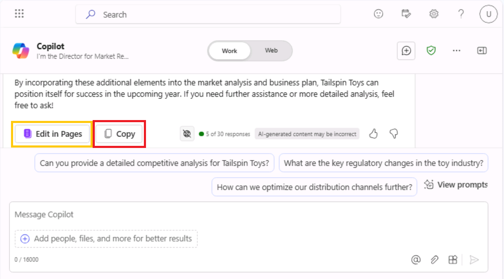

**實驗室 04：增強您的員工能力 – Copilot – 營銷**

**目的：**

Microsoft Copilot（在 Bing 中）是一種 generative AI 服務，僅基於
Microsoft Bing 搜索索引中來自公共 Web 的數據。它無權訪問 Microsoft 365
Graph 中的組織資源或內容。

作為 Tailspin Toys
的市場研究總監，您希望對玩具行業進行市場分析，以提供給公司的高級領導團隊
（SLT）。您的目標是確定市場上的最新趨勢、消費者偏好和最受歡迎的玩具。

在本練習中，您將利用必應中的 Microsoft Copilot 聊天功能。使用 Microsoft
Copilot
時，在製作提示時提供上下文和資源非常重要。響應的質量取決於您如何通過遵循提示並選擇正確的對話風格（More
Creative、More Balanced 或 More Precise）來製作請求。

1.  在 **Microsoft Edge** 中，打開一個新選項卡並輸入以下
    URL： +++[**https://bing.com+++**](https://bing.com+++/)

2.  在 **Microsoft Bing** 中，在頁面頂部的選項卡列表中，選擇
    **Copilot**。這樣做將打開 Microsoft Copilot。

**注意：**
如果您在頁面頂部沒有看到標簽頁列表，請按照以下步驟查看標簽頁列表。

- 確保您已使用 **Microsoft 365 憑據**（位於 **Resources** （資源）
  選項卡下） 登錄。

- 啟用選項 **Show menu bar** （以紅色高亮顯示）

3.  現在選擇 **Copilot**。這樣做將打開 Microsoft Copilot。

4.  在 **Copilot** 頁面上，請注意頁面頂部的切換開關，該開關允許您選擇
    **Work** 或 **Web**。雖然您的請求是一項與工作相關的任務，但您需要
    Copilot 訪問 Web 以對玩具行業進行市場分析。如有必要，請選擇 **Web**
    切換開關。

**請注意：** 上一個 Copilot 版本中的對話語氣選擇器 **More Creative -
More Balanced- More Precise** 在最新版本中被刪除。

5.  在提示字段中，輸入以下提示，然後選擇 **Submit** 圖標：

++**I'm the Director for Market Research for Tailspin Toys, a U.S. based
toy manufacturer. Conduct a market analysis of the toy industry to
identify sales figures, the latest trends, consumer preferences, and the
most popular toys in the market**.++

6.  查看 Copilot
    生成的市場分析。您意識到，您提交的常規請求提供了基本信息，例如市場趨勢、消費者偏好和玩具趨勢。但是，您也對收集有關玩具行業的數據感興趣，包括市場份額和消費者反饋。您意識到您在之前的提示中有點太模糊了，因為您沒有請求這些特定信息。您還記得之前培訓中的最佳實踐建議 -
    保持禮貌並迭代、迭代、迭代。輸入以下提示以修改市場分析：

++**That analysis was great. However, I'm also interested in including
data on the toy industry, including market share and consumer feedback.
Please amend your prior analysis to include this information.
Thanks**!++

7.  您意識到自己離目標越來越近了，但仍然缺少一些關鍵信息。在查看之前的提示後，您意識到您向
    Copilot 提供了總體目標、分析範圍和所需的數據。但是，您未能要求
    Copilot 分析所有這些信息，以便您可以對 Tailspin Toys
    來年的商業計劃做出明智的決定。要更正此缺點，請輸入以下提示：

++**I think all the data is complete. With all the information that you
captured, please analyze the data and identify patterns, trends, and
insights that can help me determine what Tailspin Toy's business plan
should be for the upcoming year**++

8.  您真的很喜歡 Copilot 提供的信息。但是，由於該項目是您向公司的 SLT
    提供市場分析報告的第一次機會，因此您不確定您是否涵蓋了他們可能感興趣的所有內容。您決定讓
    Copilot 幫助您確定是否遺漏了任何內容。輸入以下提示：

++**Please analyze the data in this market analysis and business plan.
Is there any other information that a toy company would typically
request for market analysis and business plans that I failed to request?
If so, can you please amend your responses to include this information.
Thank you**!++

9.  根據 Copilot 提供的信息，您意識到通過讓 Copilot
    包括對這些領域的分析，您可以真正最大限度地提高報告的有效性。要對報表進行最後的潤色，請輸入以下提示：

++**Please amend the market analysis to include an analysis of each of
these areas for the Toy industry. Also update the business plan that you
created for Tailspin Toys based on these insights. Thanks**!++

10. Copilot
    為您生成的市場分析和商業計劃基於預定義的對話風格。它非常適合希望在精度和創造力之間取得平衡的用戶。

如果您對使用**更具創意**的樣式（更具想像力和創意的響應）的報表外觀感到好奇，您可以調整提示以手動設置語氣或焦點，具體取決於您想要精確、創意還是平衡的輸出：

**注意事項：**

- **對於精確響應：**使用清晰、具體且注重細節的提示。表明您需要事實、簡潔的答案，並注重準確性。

- **對於創意回答：**使用開放式、探索性或富有想像力的提示。鼓勵集思廣益或在需要原創性的地方提出解決方案。

- **對於平衡的回答：**使用適度的開放式提示，要求將事實細節與一些創意相結合。您可以要求提供分析和探索性意見。

**導出 Copilot 響應**

當您在 Bing 中使用 Microsoft Copilot
研究不同的事物或回答不同的問題時，您可能會認為某個響應非常好，以至於您想要將其保存以備將來參考。 

在 Copilot 的最終響應底部，選擇 “**Copy**”
按鈕以複製響應並將複製的響應粘貼到文本編輯器中。如果要將多個響應合併到一個文檔中，則需要在文本編輯器中手動複製並粘貼每個響應並保存文件。

**注意：**您將看到一個 **Edit in Pages**
按鈕，該按鈕提供了更多功能並促進了團隊協作。在本練習中，我們不會使用
**Edit in Pages**。實驗室 \#06 中包括一個單獨的實驗室練習。

**練習 \#2：在 Loop 中使用 Copilot 集思廣益營銷活動創意**

您可以使用 Copilot in Loop
來集思廣益新的營銷策略、規劃活動和開發內容。Loop 中的 Copilot
可以幫助您為博客文章、文章和其他內容類型生成想法。您可以輸入主題和所需的內容樣式，Copilot
可以建議提示以幫助您入門。

在上一次練習中，Tailspin Toys
對玩具行業進行了市場分析。基於該分析，該公司決定推出一個新的戶外玩具系列。作為
Tailspin Toys
的營銷項目經理，您的任務是為這一新玩具系列創建營銷活動。在本練習中，您將使用
Copilot in Loop 為針對此新產品線的營銷活動集思廣益。

1.  在 **Microsoft 365** 中，如果它出現在左側導航窗格中，請選擇
    **Loop**。如果它沒有出現在那裡，請選擇 **Mocrosoft 365**
    導航窗格上方左上角的 **App Launcher**，

2.  在 **Apps** （應用程序） 頁面中，向下滾動以找到 **Loop**
    （循環），然後選擇它。

**注意：**如果您在 Apps 頁面中沒有看到 **Loop** 列出，請選擇 **More
apps**

3.  如果您看到 **Sign-in** （登錄） 按鈕，請使用用戶憑證登錄。

**注意：**登錄後，關閉 Loop 瀏覽器窗口，然後再次從 Apps 頁面打開 Loop。

4.  在 **Microsoft Loop** 中，默認情況下會顯示 **Workspaces**
    選項卡。要為此項目創建新工作區，請選擇導航菜單左上角的 +，然後選擇
    **+New workspace** 按鈕。

5.  在 **Create a new workspace** 窗口中，輸入 +++**Outdoor toy line
    Marketing Campaign** +++ 作為您的工作區名稱，然後選擇出現的
    **Continue** 或 **Create** 按鈕（取決於您的 Loop 版本）。

6.  在 **Add files to your workspace** （將文件添加到工作區）
    窗口中（根據您的 Loop 版本，此窗口可能會顯示 **Workspace
    Switcher**），選擇 **Create** （創建）。

7.  您現在位於新工作區的第一頁。頁面名稱當前為
    **Untitled**。請注意，頁面 （Untitled） 也顯示在左側導航窗格中。在  
    頁面上，選擇 **Untitled** 字段，然後將頁面名稱更改為 +++**Ideas for
    Outdoor toy
    campaigns**+++。請注意頁面名稱在導航窗格中的自動更新方式。

8.  在 **Just start typing...**字段中，輸入正斜杠 （**/**）。

9.  在顯示的下拉菜單中，在菜單頂部的 **Copilot** 部分下，選擇 **Draft
    page content**。

10. 在出現的 **Copilot**
    窗口中，請注意提示字段下方顯示的一行按鈕。選擇每個按鈕（**Create、Brainstorm、Blueprint**
    和 **Describe**）。執行此作時，請注意它如何使用 Copilot
    可以協助的任務類型的示例預填充提示字段。由於本練習涉及頭腦風暴，因此請選擇
    **Brainstorm** 按鈕。

11. 請注意 Copilot
    如何使用頭腦風暴建議預填充提示字段。事實上，請多次選擇
    **Brainstorm**
    按鈕。請注意它每次都是如何建議新的頭腦風暴提示的。Copilot
    循環播放了七個不同的頭腦風暴示例，然後重新開始。這些示例的目的是讓您瞭解
    Copilot
    可以幫助您集思廣益的不拘一格的事物類型。對於本練習，請輸入以下提示字段，然後選擇
    **Submit** 圖標：

++**Brainstorm 10 ideas for a marketing campaign for a new line of
outdoor toys**.++

12. 查看生成的想法列表。與其將所有信息都放在段落或列表形式中，不如將其匯總到表格中。此外，您還希望
    Copilot 為每個想法提供更具體的詳細信息。

13. 在顯示的 **Copilot** 窗格中，在 **Rewrite with Copilot**
    字段中輸入以下提示，然後選擇 **Submit** 圖標：

++**That looks good. However, please rewrite the report by placing the
information in a table and provide more specific details for each
idea**.++

14. 請注意 Copilot 如何更改報告的格式。現在，您希望 Copilot
    將另一個概念添加到標題為 **Supermarket store promotions**
    的表中。為此，請輸入以下提示：

++**Add an idea for Supermarket store promotions**.++

15. 當您要求 Copilot
    添加新想法時，它可能會將其添加到新表中，或者可能會將其添加到當前表的末尾。無論哪種方式，您在進一步思考後決定在超市推廣戶外玩具是一個糟糕的主意，並且您不再希望它包含在列表中。那麼，您如何撤消剛剛所做的作呢？

在表格的右側（您的原始表格或僅包含 **Supermarket store
promotions**創意的新表格），請注意 Copilot
如何跟蹤您的每個提示。提示按順序從最近的提示到第一個提示顯示。更重要的是，請注意每個提示如何包含一個
**Undo**
圖標。如果您對提示的結果不滿意，可以撤消該提示以返回到該提示之前的草稿版本。由於您已決定不再希望在表中包括
**Supermarket store promotions**（超市商店促銷），因此請選擇該提示的
**Undo** （撤消） 圖標。

16. 選擇 “**Undo**” 圖標後，請注意 Copilot
    如何刪除提示並將您返回到第二個提示（將想法放在表格中）之後的草稿。此時，您已準備好讓
    Copilot 從最好到最差對想法進行排序。輸入以下提示以對想法進行排序：

++**Please sort the ideas in the table starting from most effective to
least effective**.++

**注意：**找到出現在概念列表上方圖標託盤中的 **Sort**
圖標（向上和向下箭頭）。此選項只是按字母順序對想法進行排序。您可以對每個
**Idea** 的名稱或每個 **Details** 字段中的第一個單詞執行排序。

17. 在查看已排序的想法後，您決定進行最後的更改。您希望 Copilot
    將效果最差的想法替換為名為 **Seasonal Promotions**
    的營銷活動事件。您認為它非常適合專注於戶外產品的新玩具系列。為此，請輸入以下提示：

++**Please replace the final idea in the table with Seasonal
Promotions**.++

18. 當需要展示您在 Copilot in Loop
    的幫助下集思廣益的營銷活動創意列表時，您可以訪問 Loop 自動保存的
    **Ideas for Outdoor toy campaigns** 工作區。

**練習 \#3：在 Word 中使用 Copilot 合併多個營銷報告**

Word 中的 Copilot 是一款 AI
驅動的寫作助手，可以幫助您重寫現有內容，甚至將所選內容轉換為表格。

作為 Contoso Beverage（Contoso， Ltd. 的一個部門）的拉丁美洲 （LATAM）
營銷總監，您的產品經理向你提供了三個單獨的報告，涉及該公司的 Mystic
Spice Premium Chai Tea
飲料。但是，您發現分析信息很困難，因為您不斷地在文檔之間來回跳轉。

您決定將這些報告合併為一份 Mystic Spice Premium Chai Tea
的拉丁美洲市場分析報告。在本練習中，您將使用 Copilot
創建合併報告，對其進行審查，並可能使用 Copilot
可以在拉丁美洲柴茶市場上找到的其他信息對其進行更新。

1.  如果您在 Microsoft Edge 瀏覽器中打開了 Microsoft 365
    選項卡，請立即選擇它; 否則，請打開一個新選項卡並輸入以下
    URL：+++[https://www.office.com+++](https://www.office.com+++/) 以轉到
    Microsoft 365 主頁。

**注意：**您需要使用右側**“Resources**”選項卡下提供的 **Microsoft 365
憑據**登錄（如果出現提示）。

2.  在 **Microsoft 365** 導航窗格中，選擇 **OneDrive** 將其打開。

3.  瀏覽到 **C：\LabFiles** 文件夾，選擇以下文檔的副本並將其上傳到
    OneDrive。

    - **Mystic Spice Premium Chai Tea 產品描述。**

    - **2023 年Contoso Chai Tea 市場趨勢。**

    - **Chai Tea 在拉丁美洲的推廣計劃。**

**注意：**如果您已按照**準備實驗室執行**部分中的建議將所有實驗室資產上傳到
OneDrive，則可以跳過此步驟。

4.  在本練習中，您將從 Most Recently Used file （最近使用的文件）
    列表中訪問文檔。若要使文件顯示在 MRU
    列表中，請打開每個文檔，然後將其關閉。打開和關閉 OneDrive
    中的三個文件。

5.  在 **Microsoft 365** 中打開 **Microsoft
    Word**，然後打開一個新的空白文檔。

6.  在空白文檔頂部顯示的 **Draft with Copilot**
    窗口中，輸入以下提示，但在將三個文件鏈接到提示之前，不要選擇
    **Generate** 按鈕：

+++**I'm the LATAM Marketing Director for Contoso Beverage. Please
create a LATAM Market Analysis report for our Mystic Spice Premium Chai
Tea beverage. Combine the three attached files to create a report that
describes the product, analyzes the market trend for it, and includes a
promotion plan for Latin America**.+++

7.  現在，您必須將這三個文檔附加到提示符中。在 **Draft with Copilot**
    窗口中，選擇 **Reference your content**
    按鈕。在顯示的下拉菜單中，如果 **Mystic Spice Premium Chai Tea
    product description.docx**
    文件出現在文件列表中，請選擇它。否則，請選擇 **Browse files from
    cloud**（從雲中瀏覽文件），從 **Recent** file （最近的文件）
    列表中選擇文件，然後選擇 **Attach** （附加）
    按鈕。請注意文件在提示符中的顯示方式。

8.  對 **Contoso Chai Tea market trends 2023.docx** 文件和 **Promotion
    Plan for Chai Tea in Latin America.docx**
    文件重複上一步。此時，提示符中應顯示指向所有三個文件的鏈接。

9.  選擇 **Generate** （生成）。這樣做後，Copilot
    從三個文件中提取相關信息並起草一份報告，將它們合併為 Mystic Spice
    Premium Chai Tea 的單一市場分析報告。

10. 在查看了市場分析報告的初稿後，您意識到它缺少一些關鍵信息。您希望看到它包含一個標題為
    **Competitive Analysis** 的部分。您希望 Copilot
    分析競爭對手。為此，請在報告底部的 Copilot
    窗口中輸入以下提示，然後選擇 **Generate** 箭頭：

+++**This report looks good. However, please add a section titled
Competitive Analysis. Review the beverage companies in Latin America
that sell Chai Tea and then provide information in this section on the
strengths and weaknesses of these competitors, their market share, and
their pricing strategies**.+++

11. 在查看了包含新 Competitive Analysis
    部分的報告草稿後，您意識到還缺少最後一件事。您希望 Copilot
    添加有關**分銷渠道**的部分。本節應分析用於在拉丁美洲銷售柴茶的分銷渠道。為此，請在報告底部的
    Copilot 窗口中輸入以下提示，然後選擇 **Generate** 箭頭：

+++**Nice job! One last thing. Please add a section titled Distribution
Channels. Review the distribution channels used to sell Chai Tea in
Latin America and then provide information in this section on the types
of retailers, wholesalers, and distributors used**.+++

12. 在查看了包含新 Distribution Channels
    部分的最新草稿後，您對報告感到滿意，並準備保存它。在文檔底部的
    Copilot 窗口中，選擇 “**Keep it**” 按鈕以將其從 Copilot 草稿轉換為
    Word 文檔。

13. 查看文檔。如果您想進行任何手動更改，現在可以進行。對它感到滿意後，如果您想保留文檔以備將來參考，請隨時將文檔保存到您的
    OneDrive，或者直接丟棄它。

14. 在 Microsoft Edge 瀏覽器中關閉此選項卡。

**練習 \#4：在 Excel 中使用 Copilot 分析市場趨勢電子表格**

Excel 中的 Copilot
是一個強大的工具，可以幫助營銷專業人員輕鬆創建、編輯、理解和可視化他們的數據，並深入瞭解他們的業務。

Copilot 的 AI
驅動功能可以通過自動化重複性任務（分析季度業務結果、總結關鍵趨勢、對表格應用顏色編碼、創建模型、場景、過濾和排序以及單擊鼠標添加圖表）並提供有價值的見解來幫助他們做出明智的決策，從而幫助營銷專業人員節省時間和精力。

作為 Contoso， Ltd. 的一個部門 Contoso Beverage
的營銷總監，您收到了一份市場趨勢電子表格，其中顯示了 Contoso 的 Chai Tea
產品的每月活動。您希望使用 Excel 中 Copilot
的功能來分析報告並提供每月營銷趨勢的詳細分析。

在本練習中，您將在 Excel 中使用 Copilot 來分析已定義 Excel
表的市場趨勢電子表格。

1.  如果您在 Microsoft Edge 瀏覽器中打開了 Microsoft 365
    選項卡，請立即選擇它;否則，請打開一個新選項卡並輸入以下
    URL：+++[https://www.office.com+++](https://www.office.com+++/) 以轉到
    Microsoft 365 主頁。

**注意：**您需要使用右側 “**Resources**” 選項卡下提供的 **Microsoft 365
憑據**登錄（如果出現提示）。

2.  在 **Microsoft 365** 導航窗格中，選擇 **OneDrive** 將其打開。

3.  瀏覽到 C：\LabFiles 文件夾，選擇 **Contoso Chai Tea Market trends
    2023** 電子表格的副本並將其上傳到
    **OneDrive**，然後打開並關閉該文件以將其放入最近使用的 （MRU）
    文件列表中。

**注意：**如果您已按照**準備實驗室執行**中的建議將所有實驗室資產上傳到
OneDrive，則可以跳過此步驟。

4.  在 **Microsoft 365** 主頁上，選擇左側導航窗格中的 **Excel** 圖標。

5.  在 **Excel** 中，在 **文件** 頁上，從文件列表中選擇 **Contoso Chai
    Tea market trends 2023.xlsx**。

6.  選擇功能區右側的 **Copilot** 選項。

7.  在顯示的 **Copilot** 窗格中，有幾個預定義的提示可供您選擇。選擇
    **Show data insights** （顯示數據見解） 按鈕。

8.  請注意它生成的數據透視圖。當我們測試此練習時，Copilot
    始終**按日期劃分的社交媒體參與度（瀏覽量）**的折線圖。Copilot
    為您創建了什麼類型的圖表？在 Copilot 為您創建的圖表下方，選擇 **+Add
    to a new sheet** 按鈕。

9.  儘管 Copilot 表示它將圖表添加到了第 2 頁，但第 2
    頁在電子表格中不可見。

10. 嘗試使用最大化的 excel 工作表並重複步驟 11。**Add to sheet**
    **（添加到工作表） 功能**現在運行正常。

11. 選擇**Sheet 2**。查看 Copilot 創建的新數據表。Copilot
    包括電子表格中的圖形和數據列，該電子表格是此圖形的基礎。將光標懸停在圖表上，並注意出現的窗口，該窗口指示
    Copilot 生成的圖表類型。

12. 請注意，在 Copilot
    窗格中，預定義提示列表不再顯示。出現這種情況是因為 Copilot
    尚不適用於數據透視表（請注意指示此問題的消息）。選擇 **Sheet
    1**（工作表 1），這會將您返回到 Excel
    表格。請注意預定義提示的顯示方式。

13. 在提示字段上方顯示的預定義提示中，選擇 **Show suggestions for
    formula columns** （顯示公式列的建議） 按鈕。

14. 請注意 Copilot 提供的建議。下圖顯示了 Copilot 在測試期間提供的建議。

15. 在您收到的建議中，選擇 **Explain formula**（解釋公式）下拉箭頭。查看
    Copilot 描述計算的說明。選擇 **+Insert Column** 按鈕將此列插入到
    Excel 表格中。

16. 請注意 Copilot 如何將此數據列添加到工作**表 1** 中 Excel
    表格的末尾。這個功能讓您感興趣嗎？您可能想看看它提供了哪些其他公式建議。再次選擇
    **Show suggestions for formula columns** （顯示公式列的建議）
    按鈕。請注意這個建議。選擇 **+Insert Column** 按鈕將此建議的列插入到
    Excel 表格中。

17. 在提示字段上方顯示的預定義提示中，選擇 **How can I highlight，
    filter， and sort data？**按鈕。

18. 記下您可以執行的作列表。

19. 此時，您對 Copilot
    顯示的預定義提示不再感興趣。因此，您希望看到一組新的提示。選擇提示字段上方顯示的
    **Refresh** 按鈕。

20. 查看現在顯示的預定義提示的修訂列表。下圖顯示了顯示的提示示例。

21. 本練習的目的是瞭解 Copilot
    可以執行的各種類型的預定義作。因此，請選擇不同的提示以查看會發生什麼。例如：

    - 如果出現 **Sort** 提示，請立即選擇它。請注意 Copilot
      如何為您對數據進行排序。

    - 如果出現 **Bold** 提示，請立即選擇它。請注意 Copilot
      如何加粗它提到的列中的項目，並保留任何其他非粗體項目。

22. 再次選擇提示字段上方顯示的 **Refresh** 按鈕。

23. 查看它顯示的新提示集。多次選擇 **Refresh** 按鈕以查看 Copilot
    提供的不同類型的提示。

24. 隨意選擇任何其他提示以查看 Copilot 的作用。完成後，關閉 Microsoft
    Edge 瀏覽器選項卡。

**總結：**

在此實驗室中，您使用了

- Microsoft Copilot（必應/Web 模式）分析市場趨勢

- Copilot in Loop 為新產品線生成營銷活動創意。

- Word 中的 Copilot，用於將多個營銷報告合併為一個有凝聚力的文檔。

- Excel 中的 Copilot 用於分析電子表格中的市場趨勢。

通過這些活動，您可以簡化流程並提高營銷活動的整體效果。
