# ラボ05: Copilot Pagesでチームのコラボレーションとコンテンツ制作を強化

**目標：**

このラボでは、Microsoft 365 Apps 内で Microsoft 365 Copilot を使用して
、次の操作を行います

- コンテンツの生成と編集。

- Microsoft 365 Copilot Pages
  **機能を使用して**、生成されたコンテンツを絞り込み、強化します。

- Microsoft 365 Copilot Pages
  **でチームと共有し、共同作業**を行うことで、シームレスな生産性を実現します。

- Microsoft 365 Copilot **の Pages**
  モジュールからページに再アクセスして管理します。

**シナリオ**: あなたは Fabrikam の IT コンサルティング
チームの一員です。急成長中の製薬研究会社であるTrey
Researchは、従業員とパートナーの安全なリモートアクセスを改善するために、仮想プライベートネットワーク(VPN)の実装に関するガイダンスを求めています。Trey
Researchはグローバルに事業を展開しており、業界の規制に準拠しながら機密性の高い研究データを保護するスケーラブルなソリューションを必要としています。

あなたの仕事は、Trey Research の VPN 要件、潜在的な解決策、および
Contoso が推奨する VPN
アーキテクチャを採用する主な利点をまとめたエグゼクティブ概要ドキュメントを提供することです。

**ラボで探索する主な機能:**

- **永続コンテンツ**: Copilot Pages を使用して、AI
  が生成した応答の耐久性と編集性を高める方法を理解します。

- **共同編集**: チーム
  メンバーがコンテンツを操作する際のリアルタイムの変更を観察し、マルチプレイヤー機能を実演します。

- **「/」メニューによるコンテンツ構造化**:**「/」メニュー**を使用して、見出し、表、画像などのさまざまなコンテンツタイプを追加し、ドキュメントを効果的に構造化します。

**注**: **Trey Research**が共有するリファレンスドキュメントとして、Trey
Research - VPN技術概要ドキュメントを使用します。

**演習 \#1: Copilot ページを作成する**

Trey Researchが共有するリファレンスドキュメントには、Trey
Researchの運用、既存のITインフラストラクチャ、およびVPNのニーズに関する重要な情報が含まれています。インフラストラクチャ
ソリューション
コンサルタントは、このドキュメントを参照して提案書を作成します。

**タスク 1: 最近使用した (MRU)
ファイルの一覧に記載されている参照ドキュメントを取得します。**

1.  Microsoft Edge ブラウザーに Microsoft 365 Copilot アプリ
    ページがある場合は、ここで選択します。そうでない場合は、新しいタブを開き、URL
    +++<https://m365.cloud.microsoft>+++ を入力して Microsoft 365
    Copilot アプリのホーム ページに移動します。

**注**: 右側の **\[リソース\] タブ**の下にある **Microsoft 365
資格情報**を使用してサインインする必要があります
(プロンプトが表示された場合)。

2.  \[**Apps\] を選択し** 、\[**OneDrive\]** をクリックして開きます。

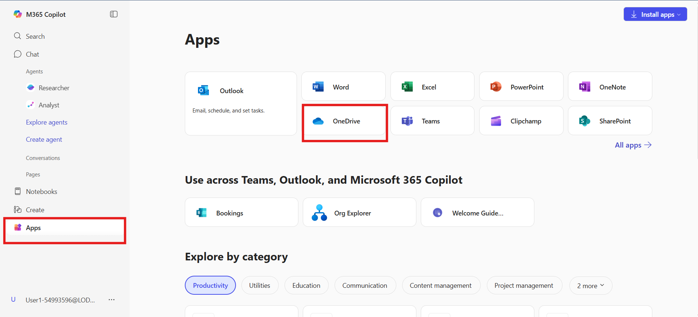

3.  C:\LabFiles\MS4019 **フォルダーを参照して、Trey Research - VPN
    Technical Overviewドキュメント** のコピーを選択して **OneDrive
    にアップロードします**。

**注**:
ラボ実行の準備セクションで**提案されているように**、すべてのラボ資産を既に
OneDrive にアップロードしている場合は 、この手順をスキップできます。

4.  **Trey Research - VPN Technical Overview.docx** ファイル (OneDrive
    にアップロードした) を開いて閉じ、最近使用した (MRU) ファイル
    リストに入れます。

**タスク 2: Copilot にアクセスして会話を開始する**

1.  Microsoft Edge ブラウザーに Microsoft 365 Copilot アプリ
    ページがある場合は、ここで選択します。それ以外の場合は、新しいタブを開き、次の
    URL:
    +++[https://m365.cloud.microsoft+++](https://m365.cloud.microsoft+++/) を入力して
    Microsoft 365 Copilot アプリのホーム ページに移動します。

2.  \[**Apps\] を選択し** 、\[**Teams\]** をクリックして開きます。

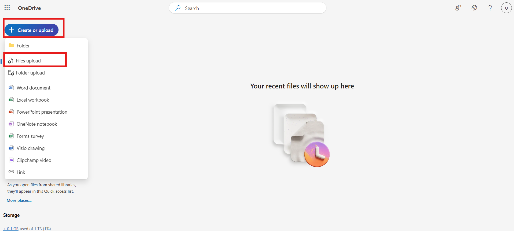

セットアッププロセスが完了するまでお待ちください。

3.  \[Chat**\] を選択して** Copilot **を開きます**

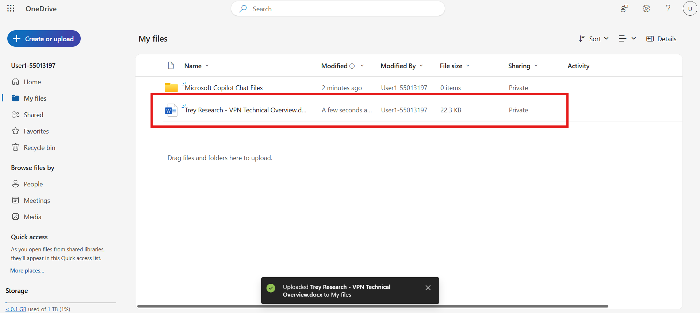

4.  Copilot **とのチャットを開始するには**
    、次のプロンプトを入力します。

++Trey
Researchの主要なVPNニーズをまとめ、安全なリモートアクセスと業界標準への準拠に焦点を当てます。

注: **Copilot** ページでは、ページ上部の **Work/Web** トグル
スイッチで、**デフォルトで Work** が選択されます。

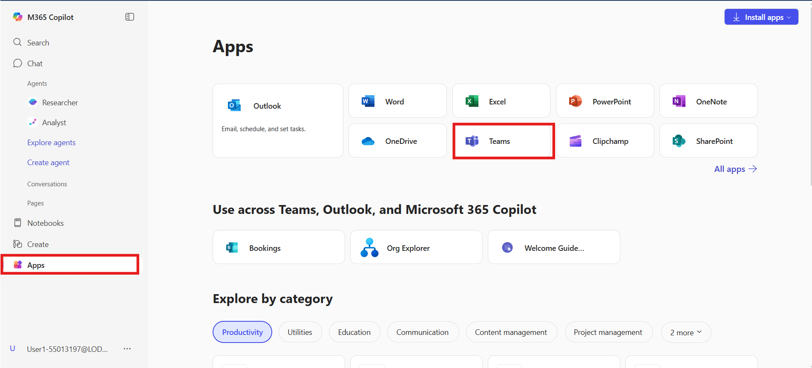

5.  次に、Trey
    Researchが共有する参照ドキュメントを添付して、エグゼクティブサマリーのコンテンツの作成を開始します。**\[Attach**\]
    (ペーパー クリップ) アイコンを選択して、ドキュメントを参照します。

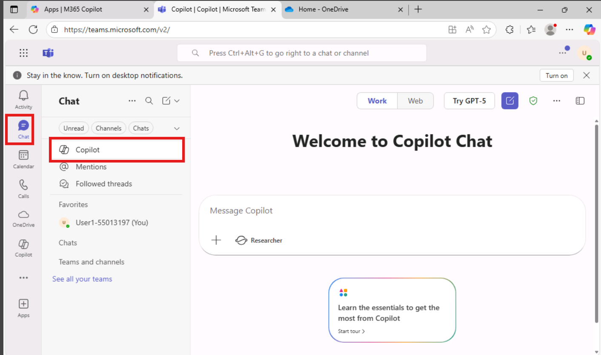

6.  ドキュメント「**Trey Research – VPN Technical
    Overview」**を選択します。

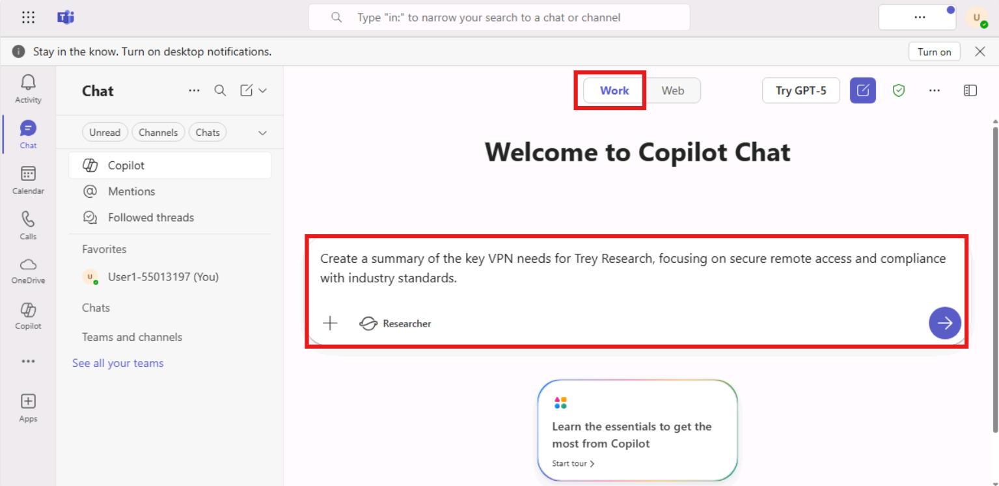

**注**:ファイルがポップアップリストにリストされていない場合は、\[**Attach**\]アイコンを選択して再試行してください

7.  選択したドキュメントが\[**Prompt**\]**ボックスに添付されているのがわかります**
    。\[**Send**\] アイコンをクリックすると、Copilot
    がコンテンツの生成を開始します。

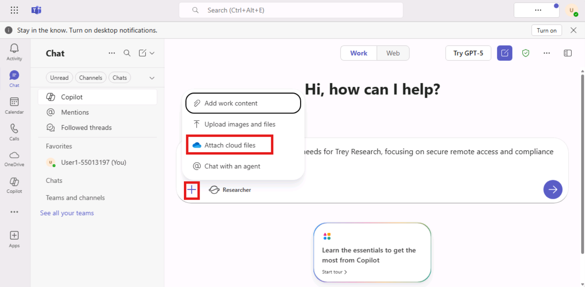

8.  Copilot
    は参照ドキュメントをくまなく調べ、コンテンツの生成を開始します。

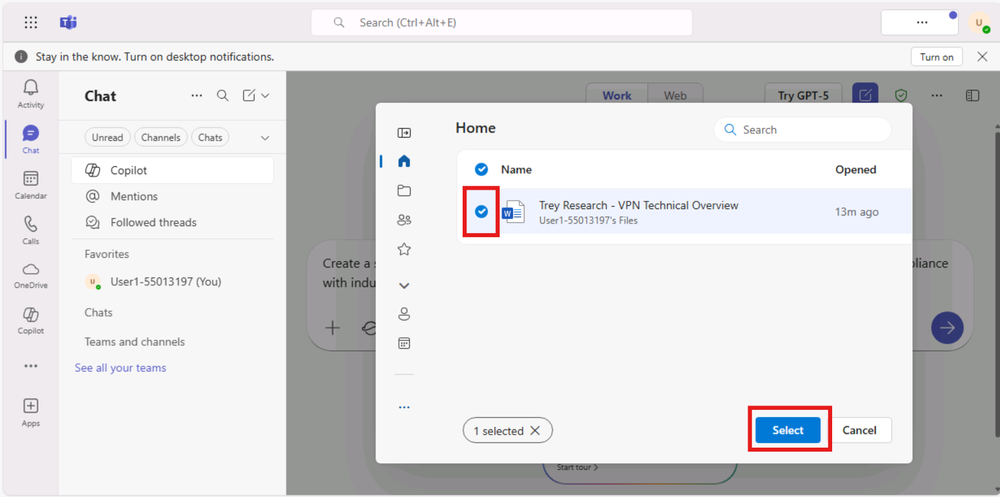

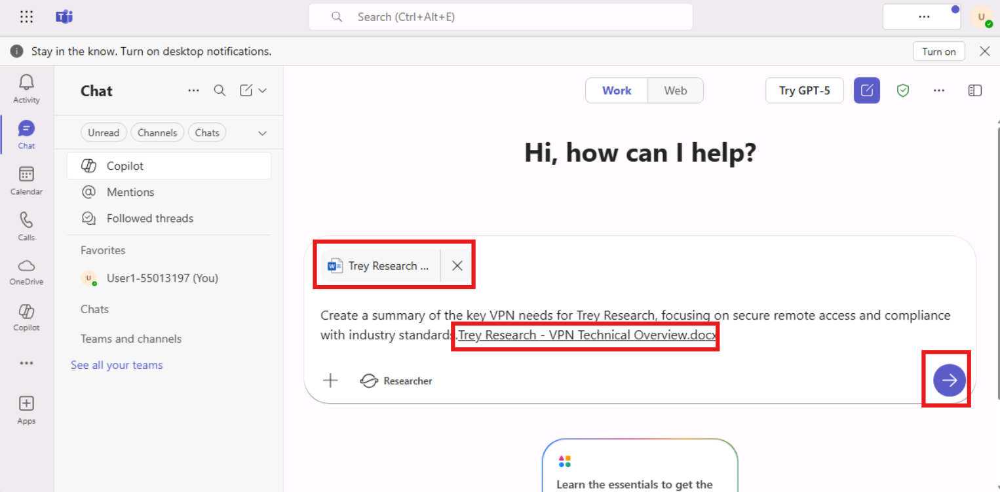

9.  Copilot がドラフト コンテンツの生成を完了すると、
    **生成されたコンテンツの最後に** \[**Edit in Pages**\]
    ボタンが表示されます。

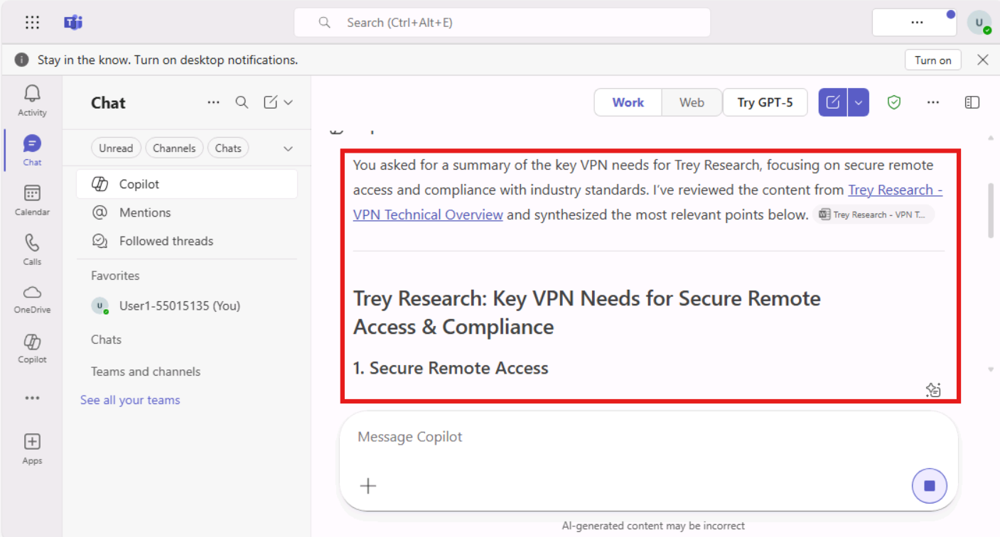

10. この新しい**Copilot
    Page**への参照は、簡単にアクセスできるようにチャットに自動的に追加されます。

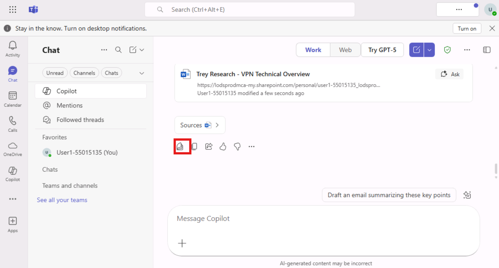

**タスク 3: ページ機能の確認**

1.  必要に応じてチャットの名前を変更できます。

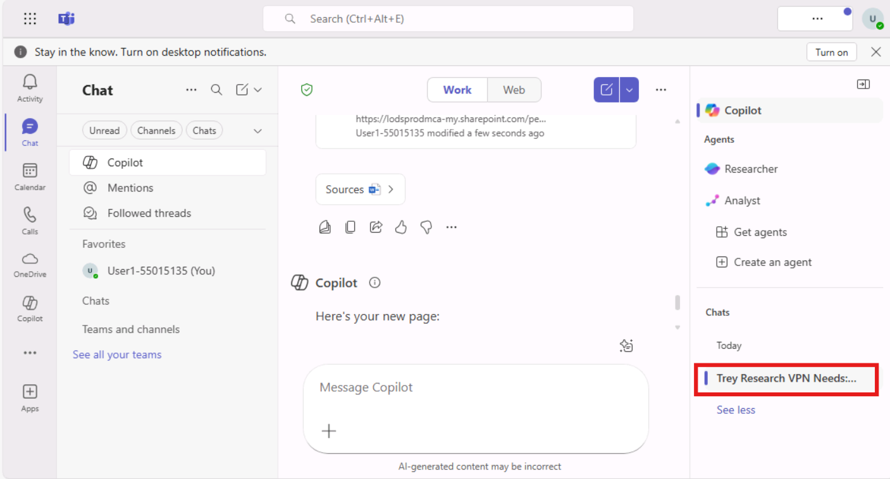

**注**: Copilot のチャット名は 30 文字以内にする必要があります。

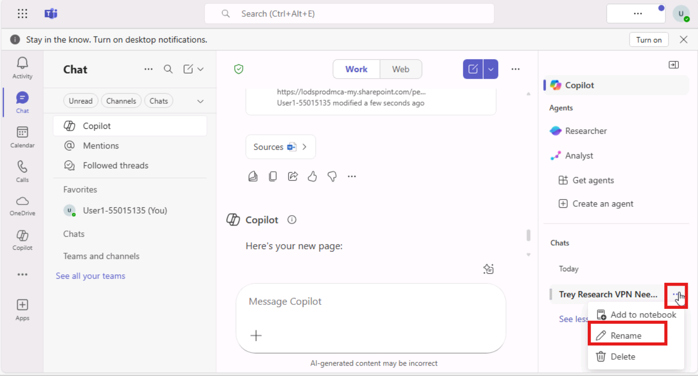

2.  **Panel** (折りたたみ/展開) アイコンをクリックすると、Copilot
    チャット
    ウィンドウが展開され、別のセクションでコンテンツを表示するスペースを確保できます。ページが右側に開き、チャット
    ウィンドウと並んで開くことを確認します。応答は自動的にコピーされ、リンクのプレビューやコードブロックなど、フォーマットされます。

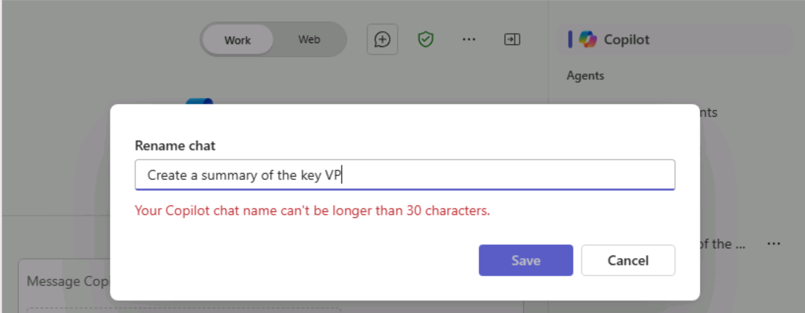

3.  「**Edit in
    Pages**」ボタンをクリックすると、生成されたコンテンツが右側の別のセクションに表示されます。

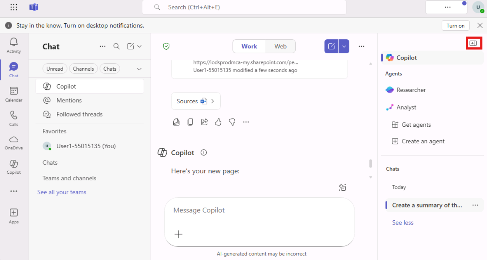

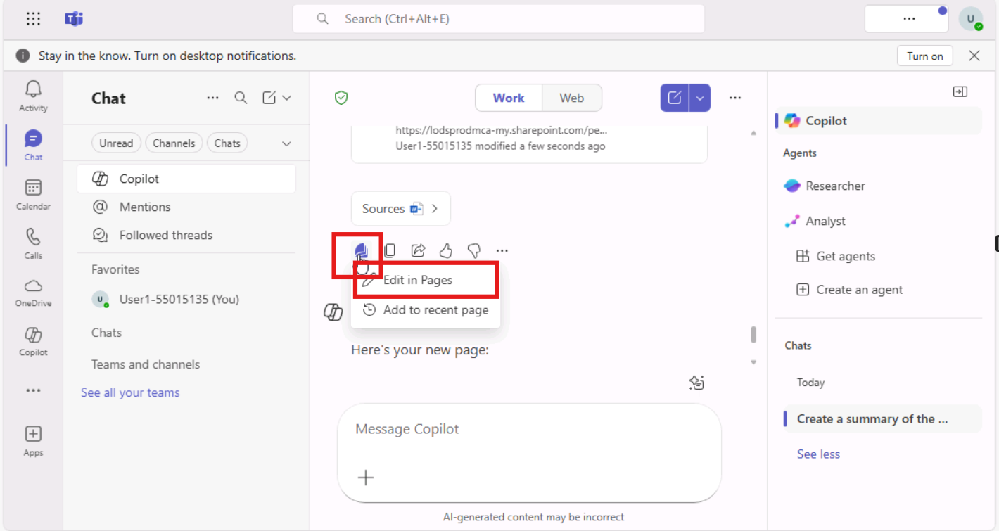

**演習 #2: ページ上のコンテンツの追加と調整**

この演習では、チャットで Copilot
と対話し続けます。新しいインサイトが生成されたら、\[**Edit in Pages**\]
をクリックして現在のページに追加します。これらの更新は、ページの下部
(チャット ウィンドウの右側に表示) に追加されます

**タスク 1: チャットで会話を続ける**

1.  チャットウィンドウで、コンテンツを絞り込むための詳細な手順を提供します。次に、Copilotに3つのVPNテクノロジーを比較してもらい、Trey
    Researchのニーズに関連する長所と短所に焦点を当てます。次のプロンプトを入力し、\[**Send**\]
    をクリックします**。**

> ++Compare three VPN technologies based on scalability, security, and
> cost-effectiveness.++

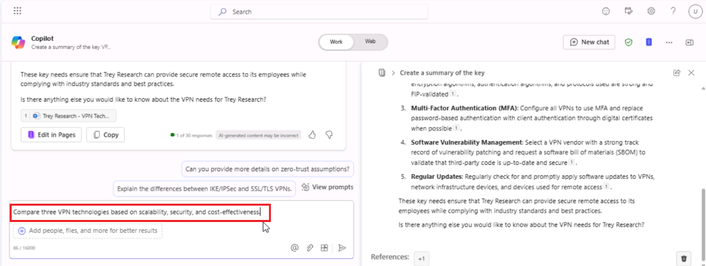 **注**:次のプロンプトで試すこともできます。

++Create a table comparing three VPN technologies (e.g., MPLS VPN, SSL
VPN, IPsec VPN) based on scalability, security features, ease of
deployment, and cost.++

2.  Copilot
    は、比較の詳細を使用して新しい分析情報を生成します。
    
    

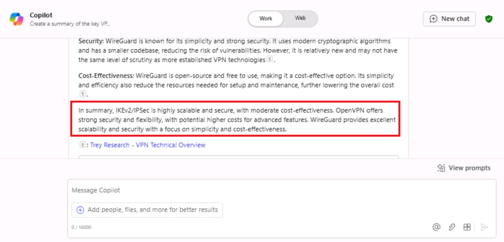

3.  「**Edit in Pages」をクリックして**
    、この比較の詳細を既存のページに追加します。
    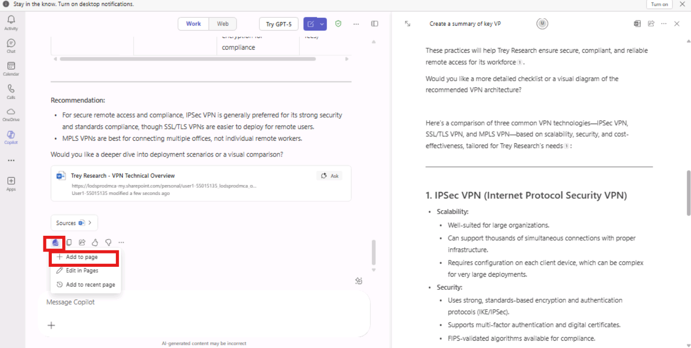

**タスク 2: ページ上で直接編集する**

1.  ページ上の任意の場所をクリックして、コンテンツの入力と絞り込みを開始します。**「/」**と入力すると、見出し、箇条書き、表、画像などのコンテンツオプションのメニューが開き、より構造化された魅力的なレイアウトになります。
    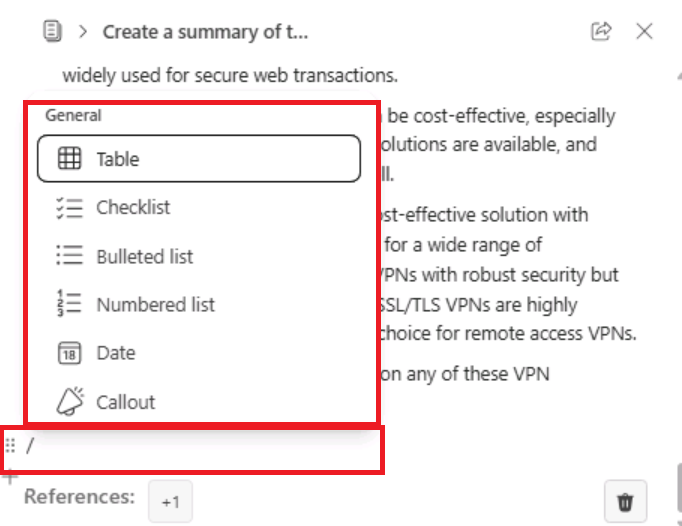

2.  コンテンツブロックの上にマウスを置き、ケバブメニュー(平行に並んだ3つの垂直ドット–串刺しのアイテムに似ています)を選択すると、ページリンクのコピー、ブロックの移動、および削除のオプションが表示されます。  
    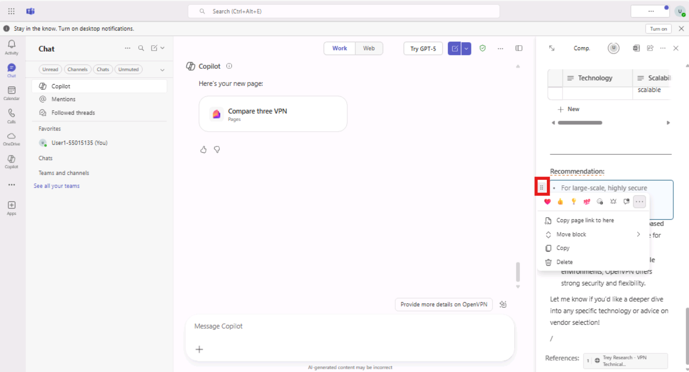

**タスク 3: チーム メンバーとの共同作業**

1.  ページがチーム入力の準備ができたら、
    右上隅にある共有アイコンをクリックし**、\[Copy
    component\]**を選択します。

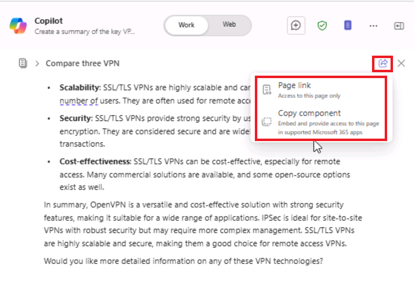

2.  このリンクを **Teams Channel**または **Outlook**
    メールに貼り付けると、チーム
    メンバーがページにアクセスして共同作業できるようになります。

**注**:
このラボ環境は、機能が制限された状態でデプロイされています。そのため、企業ネットワークで行うような共同作業でTeamsとOutlookを使用することはできません。

**演習 \#3: 保存したページを再訪してアクセスする**

いつでも、Copilot Page リンクが最初に作成された元のチャット
メッセージに戻ることができます。

**タスク 1: Microsoft365.com でページを見つける**

1.  Microsoft365.com **の\[Pages\]**タブに移動します。

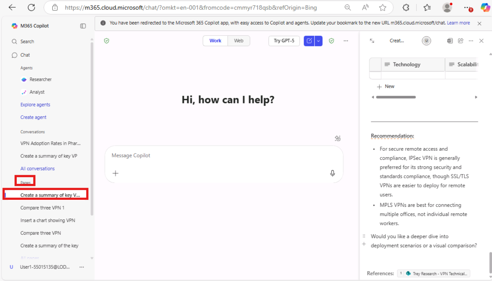

2.  ここには、作成したすべての**Copilotページ**が、簡単にアクセスできるように整理されて表示されます。
    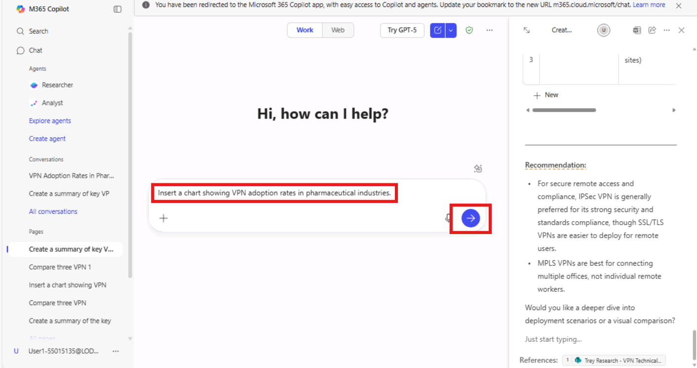

**タスク 2: 追加の編集または更新の共有**

保存したページを開いて、さらに編集を行ったり、更新を追加したり、ページリンクを再共有したりして、新規または既存のチームメンバーとの継続的なコラボレーションを行います。

1.  テキストコンテンツにカーソルを合わせると、**ケバブ**メニューと**チャット**アイコンが表示されます。

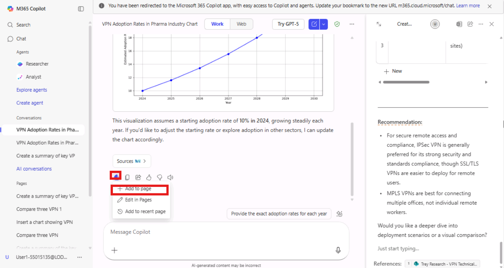

2.  次に、ページを直接編集します。ページをクリックし、コンテンツを追加または変更するために入力します。次に、次のプロンプトを入力し(VPNの採用率を示すグラフを挿入します)、\[Send\]をクリックします。

> ++Insert a chart showing VPN adoption rates in pharmaceutical
> industries.++

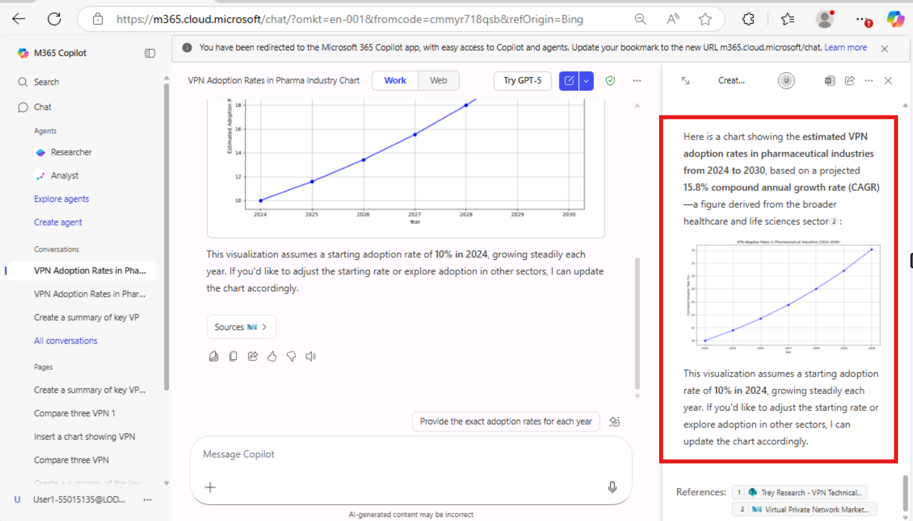

3.  Copilot は、コード スニペットを使用してグラフを生成して表示します。

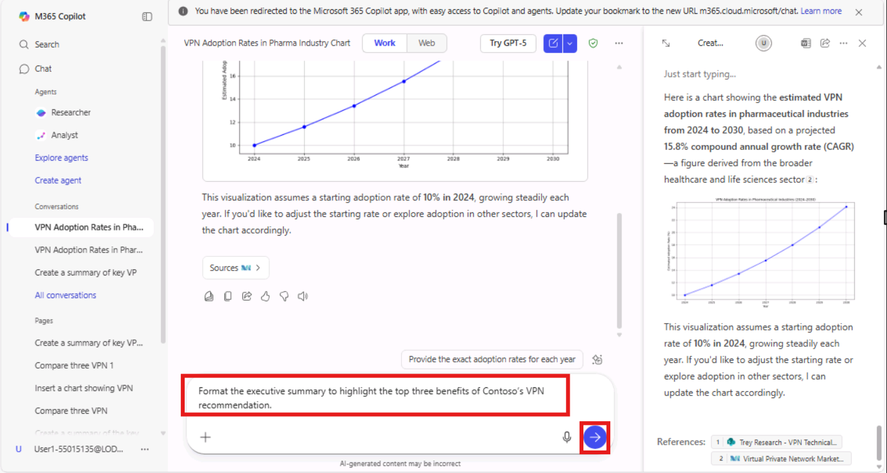

4.  Copilot チャット **ウィンドウを閉じ** 、\[**Preview**\]
    を選択して先に進みます。
    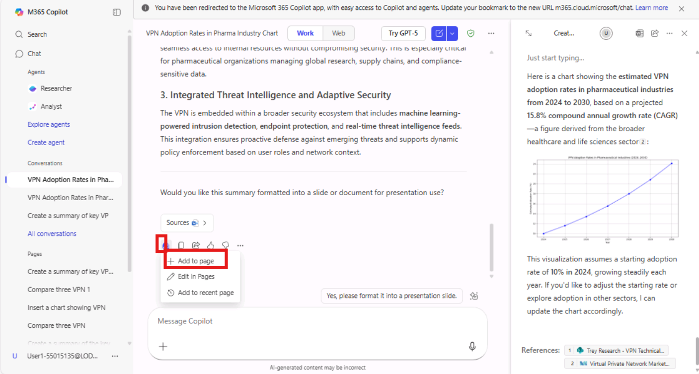

5.  次に、ドラフトを完成させて、Trey Research のリーダーシップ
    チームの準備を整えます。

次のプロンプトを使用して、ドキュメントを確定します。

++Format the executive summary to highlight the top three benefits of
Contoso’s VPN recommendation.++

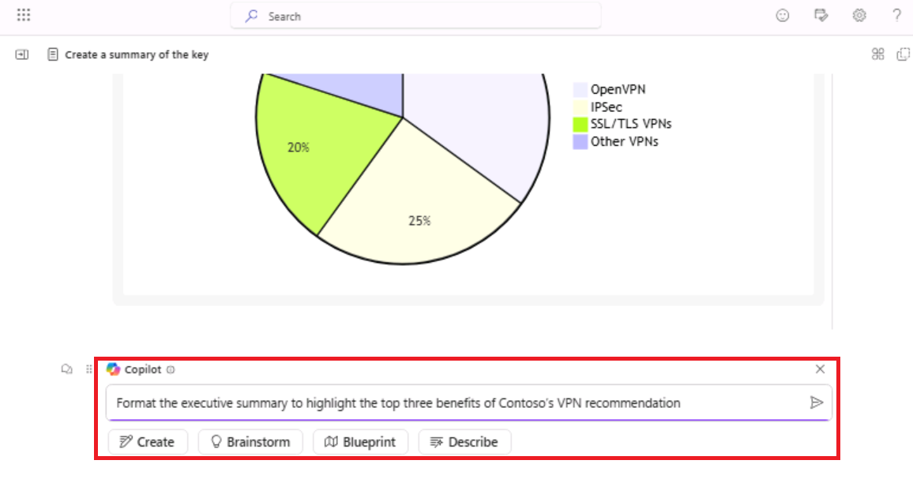

6.  すべての編集が完了していることを確認し、プレゼンテーションや共有の準備が整った適切な名前でページを保存します。

**概要：**

このラボでは、次のスキルを適用しました：

- Copilot を使用して、コンテンツを効果的に作成、調整、共有します。

- M365ページのインタラクティブでコラボレーション機能を活用して、チームワークを強化します。

Microsoft 365 Copilot
を日常のワークフローに統合して生産性とコラボレーションを実現することで、実際のシナリオに活用できます。
