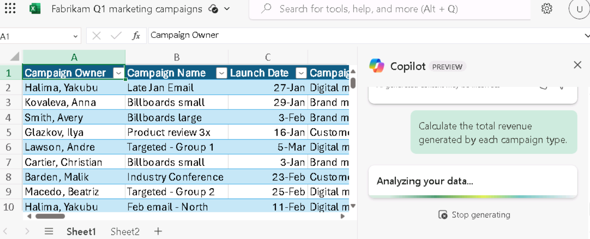

**실습05: 직원 역량 강화 – Copilot – 재무**

**목표:**

재무 전문가는 Microsoft 365용 Copilot을 사용하여 반복적인 재무 작업을
자동화하고, 재무 데이터에 대한 인사이트를 얻고, 수동 작업을 자동화하여
시간을 절약하고, 더 효과적으로 공동 작업할 수 있습니다

이 실습에서는 재무 전문가로서 다음을 사용합니다:

- Outlook의 Copilot을 사용하여 회사의 보험사에 보낼 새 이메일을 생성하여
  의료 보험료의 엄청난 인상에 대해 논의하기.

- Excel의 Copilot을 사용하여 Q1 마케팅 캠페인에 대한 예상 수익이 포함된
  스프레드시트를 분석한 다음 새로운 계산 및 차트를 추가하여 데이터를
  시각화.

- Word의 Copilot을 사용하여 회사의 Q1 마케팅 캠페인 스프레드시트를
  기반으로 마케팅 캠페인 보고서를 생성하기.

- Word의 Copilot를 사용하여 지난 5년 동안 회사의 재무 결과를 요약하기.

**연습 \#1: Outlook에서 Copilot을 사용하여 보험 회사에 보내는 전자 메일
초안 작성하기**

Copilot을 사용하면 몇 시간을 할애하고 작성하는 데 시간을 할애할 필요
없이 Copilot이 특정 요구 사항에 맞게 조정하는 이메일 초안을 빠르게
생성할 수 있습니다. 이 연습에서는 Outlook의 Copilot을 사용하여 일련의
사용자 제공 프롬프트에 따라 새 전자 메일의 초안을 작성합니다.

**참고**: Outlook의 Copilot 시나리오는 사용자의 기본 사서함에서만 사용할
수 있습니다. 사용자의 보관 사서함, 그룹 사서함 또는 사용자가 액세스할 수
있는 공유 및 위임 사서함에서는 사용할 수 없습니다.

- Microsoft는 Exchange Online 호스트되는 사서함의 Outlook에서만
  Copilot을 지원합니다.

- Outlook의 Copilot은 Microsoft 365 회사 또는 학교 계정 및 특정 전자
  메일 도메인이 있는 Microsoft 계정에서만 지원됩니다.

- Microsoft Entra ID 계정을 사용하는 Microsoft 365용 Copilot과 MSA
  계정을 사용하는 Copilot Pro를 통해 모두 지원됩니다.

Northwind Traders의 CFO는 Outlook의 Copilot을 사용하여 회사의 건강
보험사인 Humongous Insurance에 보낼 전자 메일 초안을 작성하려고 합니다.
최근 보험 대리인으로부터 Northwind의 건강 보험료가 전반적으로 인상될
것이라는 통지를 받았습니다(개인 보험의 경우 9% 이상, 가족 보험의 경우
15% 이상). 이 증가율은 업계 평균보다 상당히 높습니다.

이 이메일의 목적은 두 가지입니다:

- 증가 수준에 대한 우려를 표명하기.

- 문제를 논의하고 대안을 모색하기 위해 보험사 팀과의 회의를 요청하기.

1.  **Microsoft 365**에서**Outlook**를 여세요.

2.  **New** 이메일을 여세요.

3.  열리는 **Message** 탭의 리본에서 Copilot을 선택하세요. 표시되는
    드롭다운 메뉴에서 **Draft with Copilot**을 선택하세요.

4.  메시지 보문에 **Draft with Copilot** 창이 나타납니다. 프롬프트
    필드에 메시지가 포함됩니다: **What do you want this email to say**?
    필드 아래쪽에는 **Generation options** 아이콘이 있습니다. 이메일을
    작성할 때 Copilot에서 제공하는 옵션을 보려면 이 아이콘을 선택하세요.

5.  나타나는 드롭다운 메뉴에서 이메일의 Tone과 Length를 변경할 수 있음을
    알 수 있습니다. 먼저 **Tone**을 **Formal**로 설정하고 **Length**를
    **Long**으로 설정하세요. 지금 이 옵션을 선택하세요.

6.  **What do you want this email to say?** 필드에 다음 프롬프트를
    입력한 후 **Generate** 버튼을 선택하세요:

++**I'm the CFO for Northwind Traders. Draft an email to our insurance
carrier, Humongous Insurance, expressing my concern for the level of
increases in our company's health insurance premiums for the coming
year. Request a meeting with the insurance carrier’s team to discuss the
proposed increases and explore alternative options**.++

7.  초안을 스크롤하여 검토합니다. 메시지 맨 위에 Copilot은 방금 입력한
    프롬프트의 시작 부분을 표시합니다(즉, **"** **I'm the CFO for
    Northwind Traders...**"). 프롬프트의 이 섹션을 선택하여 어떤 일이
    발생하는지 확인하세요.

8.  Copilot은 이전 프롬프트를 편집하고 완전히 새로운 메시지를 다시
    생성할 수 있는 **Rewrite with Copilot**창을 표시합니다. 이 시점에서
    메시지는 만족스럽지만 다른 어조와 길이를 사용할 때 메시지가 어떻게
    변경되는지 확인하려고 합니다. 프롬프트 아래에 표시되는 **Generation
    options**아이콘을 선택하세요. **Tone**을 **Direct**로 변경하고
    Length를 **Medium**으로 변경한 후 **Generate** 버튼을 선택하세요.

9.  수정된 초안을 검토하세요. **Rewrite with Copilot**상단에서 " **I'm
    the CFO for Northwind Traders...**" 링크를 확인하세요. 또한
    Copilot이 이 초안이 "**2 of 2**"임을 나타내는 방법에 유의하십시오.
    이는 두 개의 Copilot 초안 중 두 번째 초안을 보고 있음을 의미합니다.
    뒤로 화살표(\<)를 선택하여 이전 Copilot 초안으로 돌아갈 수 있으며,
    이 경우 **Formal** 톤과 **Long** 길이가 있는 첫 번째 초안입니다..

이 연습에서 수행하는 것처럼 여러 Copilot 초안을 생성하는 경우 이러한
화살표를 사용하여 초안 사이를 앞뒤로 이동하여 원하는 초안을 찾을 수
있습니다. 원하는 초안을 찾으면 사용 가능한 버튼 중 하나를 선택하여
**Keep it**하거나 동일한 톤과 길이로 새 초안을 **Regenerate** 할 수
있습니다. 인사말과 보완적인 닫기, 이 Direct 초안에 대한 메시지의
전반적인 어조, Length의 변경에 유의하세요. 요점으로 바로 들어가고 싶지만
**Direct** 어조가 너무 비인간적이라고 느껴져 다른 어조로 새 초안을
생성하려고 합니다.

10. 창 맨 위에 있는 링크된 프롬프트("**I'm the CFO for Northwind
    Traders...**")를 클릭하여 **Rewrite with Copilot**창으로 돌아가세요.
    **Generation options** 아이콘을 선택하고 이번에는 **Tone**을
    **Casual**로 변경하고 **Length**를 다시 **Long**으로 변경합니다.
    **Generate**을 선택하세요.

11. 새 초안을 검토하세요. 이 시점에서, 당신은 초안 번호 2의 **Direct**
    톤과 **Medium** **length**를 좋아하지 않는다는 것을 깨닫게 됩니다.
    그러나 더 긴 길이를 선호한다는 것은 확실하지만 **Formal** **톤**을
    선호하는지 **Casual**한 톤을 선호하는지 결정할 수는 없습니다.

    - **Casual**초안이 현재 표시되어 있기 때문에 인사말이 "안녕하세요"
      또는 "안녕하세요"와 같이 약간 비공식적이라는 점에 유의하세요.

    - **Formal**톤을 사용했을 때 정확한 인사말은 기억나지 않지만, "Dear
      so and so"와 같은 라인이었습니다.

    - 또한 **Formal** 톤을 사용한 첫 번째 초안의 보완 종결 구문 (예:
      Sincerely/Best regards/Thank you 등)을 기억할 수 없습니다.

12. 인사말 외에 두 메시지가 어떻게 나타났는지 기억나지 않는 경우 이전
    지침에 따라 뒤로 화살표를 선택하여 **Formal**톤이 있는 첫 번째
    초안으로 돌아가세요. 어떤 초안을 선호하는지 결정할 수 없는 경우
    앞으로 및 뒤로 화살표를 사용하여 첫 번째 초안(Formal)과 세 번째
    초안(Casual)을 비교하세요. 사용할 초안을 결정한 후 다음 단계로
    진행하세요.

13. 이 시점에서 선호하는 초안이 Copilot 창에 나타나야 합니다. 이전에
    만든 톤과 길이의 변화를 넘어서; 이메일 메시지가 약간 드문 드문
    보이는 것 같습니다. 요금 인상에 대한 자세한 정보를 제공하지 않으며
    적어도 개인 및 가족 계획별로 분류되지 않았습니다. **Anything you'd
    like to change?** 필드에 다음 프롬프트를 입력한 후 필드 끝에 있는
    화살표 아이콘을 선택하세요:

++**Please compare the level of premium increases being proposed for
Northwind Traders in comparison to industry-wide premium increases. Our
individual policy premiums increased over 9%, and family policies
increased over 15%. Mention how our increases far exceed the industry
averages of 6% and 10% increases, respectively**.++

14. 이 최신 프롬프트를 기반으로 이메일을 업데이트하려고 했을 때 어떤
    일이 발생했습니까? 다음과 같은 오류 메시지가 표시되었을 가능성이
    있습니다. "**Sorry, something went wrong. Copilot is working on
    it**." 이 오류가 발생한 이유는 초안에 변경 요청을 제출할 때
    Copilot이 현재 프롬프트당 한 번에 하나의 변경 사항만 수락하기
    때문입니다. 이 경우 두 가지 변경을 요청했습니다 - ++**compare the
    plan increases to industry averages and specify the specific rate
    increases**.++

다음은 Outlook용 Copilot에서 작업할 때 프롬프트와 관련된 현재 경험
법칙입니다:

1.  초기 프롬프트를 제출할 때 여러 요청을 포함할 수 있습니다. 예를 들어
    Copilot에게 A, B 및 C에 대한 정보를 포함하도록 지시할 수 있습니다.
    이 경우 세 가지 항목이 모두 포함된 초안을 생성합니다.

- 그러나 초기 프롬프트 이후에 초안을 수정하라는 후속 프롬프트에는
  프롬프트당 하나의 변경 요청만 포함될 수 있습니다.

15. 이 요구 사항을 고려하여 이전 요청을 두 부분으로 나누기로 결정합니다.
    이번에는 1부인 다음 프롬프트를 입력하세요:

++**Please mention that our individual policy premiums increased by over
9%, and family policies increased over 15**%.++

16. 업데이트된 초안을 검토합니다. 이제 2부인 업계 평균에 대한 다음
    프롬프트를 입력하세요:

++**Please mention that average industry premium increases are 6% for
individual policies and 10% for family policies**.++

17. 이 초안이 더 좋아 보입니다. 그러나 높은 공제액/낮은 보험료 플랜에
    대한 변경 가능성에 대해 마지막으로 한 가지 메모를 추가하기로
    결정했습니다. 다음 프롬프트를 입력하세요:

++**Please mention that we should discuss converting to high-deductible,
low premium policies**.++

18. 이 최신 반복을 검토한 후 초안이 만족스 러우므로 **Keep it** 버튼을
    선택하세요.

19. Copilot 창이 없는 이메일 본문에 메시지가 어떻게 표시되는지
    확인합니다. 실제 시나리오에서는 이메일을 있는 그대로 보내거나 최종
    변경 사항을 수동으로 수행합니다. Copilot 초안을 **keep**한 후에는
    직접 수동으로 추가 변경을 수행해야 합니다. 해당 메시지와 함께
    Copilot 초안 모드로 돌아갈 수 없습니다.

20. 이 이메일을 보내지 않을 것이므로 이메일 화면의 오른쪽 상단 모서리에
    있는 휴지통(**Discard**) 아이콘을 선택한 후 메시지를 삭제할 것인지
    확인하세요.

**연습 \#2: Excel에서 Copilot을 사용하여 재무 스프레드시트 분석하기**

재무 전문가를 위해 Excel의 Copilot은 수식이 아닌 자연어로 데이터 세트에
대해 질문할 수 있는 기능을 제공합니다. 이 도구는 상관 관계를 표시하고,
what-if 시나리오를 제안하고, 쿼리를 기반으로 강력한 시각화를 만들 수
있습니다.

Fabrikam의 재무 담당 이사는 회사의 1분기 마케팅 캠페인이 얼마나
효과적이었는지 분석하려고 합니다. 마케팅 이사는 회사가 1분기 동안 참여한
각 마케팅 캠페인을 식별하는 스프레드시트를 제공했습니다. 스프레드시트는
기본 예산 및 수익 수치와 타겟팅 및 참여 사용자 수를 제공합니다.

이 연습에서는 Excel에서 Copilot을 사용하여 Excel 스프레드시트 **Fabrikam
Q1 marketing campaigns.xlsx**에 이미 있는 시장 추세를 분석합니다.
Copilot의 사전 구축된 많은 기능과 프롬프트를 검토하게 됩니다.

1.  Microsoft Edge 브라우저에서 Microsoft 365 탭이 열려 있는 경우 지금
    선택하십시오. 그렇지 않으면 새 탭을 열고 다음 URL을 입력하세요:
    +++[https://www.office.com+++](https://www.office.com+++/)

**참고**: 오른쪽의 **Resources** 탭 아래에 제공된 **Microsoft 365
Credentials**을 사용하여 로그인(메시지가 표시되는 경우)해야 합니다.

2.  **Microsoft 365** 탐색 창에서 **OneDrive**를 선택하고 여세요.

3.  **OneDrive**에 업로드하기 위해 **C:\LabFiles** 폴더로 이동하여
    **Fabrikam Q1 marketing campaigns.xlsx** 스프레드시트 사본을
    선택하세요.

**팁**: 파일을 열고 닫아 Most Recently Used (MRU) 파일 목록에
추가하세요.

**참고**: **Preparing for the lab execution**섹션에 제안된 대로 모든 랩
자산을 OneDrive에 이미 업로드한 경우 이 단계를 건너뛸 수 있습니다.

4.  **Microsoft 365** 홈페이지에서 왼쪽 탐색 창에서 **Excel** 아이콘을
    선택하세요.

5.  **Excel**의 **File** 페이지에서 파일 리스트에서**Fabrikam Q1
    marketing campaigns**를 선택하세요.

6.  리본의 오른쪽에 있는 **Copilot** 옵션을 선택하세요.

7.  표시되는 **Copilot** 창에서 프롬프트 필드 위에 표시되는 미리 정의된
    프롬프트를 확인하세요. 분석을 개선하기 위해 이러한 미리 정의된
    프롬프트를 선택하기 전에 먼저 Copilot이 스프레드시트에 몇 가지 특정
    변경 사항을 적용하도록 해야 합니다. 우선, Copilot이 가장 수익성이
    높은 캠페인 유형을 식별하려고 합니다. 이렇게 하려면 다음 프롬프트를
    입력하세요:

++**Create a pivot table to analyze the total revenue generated by each
campaign type**.++

8.  이 프롬프트의 결과를 검토합니다. Copilot은 두 개의 응답 창을
    표시했습니다. 첫 번째 응답에는 캠페인 유형별 총 수익을 요약한 피벗
    테이블이 포함되었습니다. 두 번째 응답에는 첫 번째 응답에서 수행한
    작업에 대한 설명이 포함되었습니다. 이 테이블이 포함된 첫 번째
    응답에서 **+Add to a new sheet**버튼을 선택하세요. 이렇게 하면 이
    테이블이 이 스프레드시트의 **Sheet 2**에 추가 되고 Copilot이
    열립니다.

**참고**: **Add to new sheet**버튼이 표시되지 않으면 버튼을 보려면
확대/축소로 테스트해야 합니다 (115%의 확대/축소 수준이 세부 정보를
표시하는 것 같습니다.)

9.  **Sheet 2**를 보면 Copilot이 피벗 테이블과 함께 사용할 차트를
    생성하지 않았음을 알 수 있습니다. 제출한 프롬프트를 살펴보면 피벗
    테이블을 생성하도록 요청했을 뿐이며 차트에 대해 아무 것도 언급하지
    않았다는 것을 알 수 있습니다. 이 데이터의 시각화를 보고 싶기 때문에
    Copilot에게 **Sheet 2**의 피벗 테이블과 함께 사용할 차트를
    생성하도록 요청하는 프롬프트를 입력하려고 합니다. 그러나 **Sheet
    2**에 있는 동안에는 프롬프트 필드가 비활성화되어 있습니다.

**참고**: 프롬프트 필드는 Excel 테이블이 있는 시트에서만 활성화됩니다.
이 스프레드시트의 경우 **Shee**t **1**입니다. 이 연습을 계속 진행하면서
Copilot이 새 시트에 데이터를 추가할 때마다 **Sheet** **1**로 돌아가서
추가 변경을 요청해야 합니다.

10. **Sheet 1**을 선택하고 다음 프롬프트를 입력하세요:

**In Sheet 2, you created a pivot table to analyze the total revenue
generated by each campaign type. Create a chart in Sheet 2 to visualize
this data**.

11. 결과를 검토하세요. Copilot이 캠페인 유형별 수익을 보여주는 차트를
    생성한 경우 다음 단계로 진행합니다. 그러나 Copilot이 Excel 테이블이
    있는 원래 시트 이외의 시트에서 작업하도록 요청할 수 없다는 메시지를
    표시한 경우 이전 프롬프트를 단순화해야 합니다. 이 경우 다음
    프롬프트를 입력하세요:

**Calculate the total revenue generated by each campaign type**.

**참고**: 다음과 같이 프롬프트를 단순화한 후에도 각 캠페인 유형별로
생성된 총 수익을 계산하고 Copilot이 총 수익을 생성하지 못하면 계속해서
시도하십시오(네 번째 시도에서만 테스트에서 시트에 채팅을 삽입하는 옵션과
함께 피벗 차트가 생성됨)

12. Copilot이 생성한 캠페인 유형별 수익을 보여주는 차트를 검토하세요. 이
    결과는 원하는 결과이므로 창 아래쪽에 있는 **+Add to a new
    sheet**버튼을 선택하세요. 이렇게 하면 이 차트 가 이 스프레드시트의
    **Sheet 3**에 추가됩니다.

13. **Sheet 3**을 보면 Copilot이 차트와 함께 피벗 테이블을 어떻게
    포함했는지 알 수 있습니다. **Sheet 2**에는 동일한 피벗 테이블이 있고
    **Sheet 3**에는 테이블과 차트가 있습니다 . 테이블과 차트가 모두 있는
    **Sheet 3**을 원하므로 향후 혼동을 피하기 위해 **Sheet** 2를
    제거하기로 결정합니다. **Sheet 2**를 삭제하려면 마우스 오른쪽 버튼을
    클릭하고 나타나는 메뉴에서 **Delete**를 선택한 후 **OK**을 선택하여
    삭제를 확인하세요. 이렇게 하면 Sheet 1과 Sheet 3이 남습니다.

14. 더 많은 변경을 원하므로 **Sheet 1**을 선택하여 피벗 테이블이 있는
    시트로 돌아가세요.

15. 이제 어떤 캠페인이 가장 효과적이었는지 파악하려고 합니다. 이렇게
    하려면 Copilot이 각 캠페인에 대한 Return on Investment (ROI)을
    계산하도록 해야 합니다. ROI를 계산하려면 다음 프롬프트를 입력하세요:

++**Calculate the ROI for each campaign**.++

16. 이 프롬프트의 결과를 검토하세요. Copilot은 계산을 표시하고, ROI
    계산에 대한 설명을 위해 수식 **Explain formula**을 선택할 수
    있습니다.

17. Copilot이 스프레드시트에 ROI를 추가하도록 하려면 창 아래쪽에
    나타나는 **+Insert column**버튼을 선택하세요.

18. 결과를 기록해 두세요. Copilot은 각 개별 캠페인에 대한 ROI가 포함된
    새 열을 추가했습니다. 그래도 괜찮지만 각 캠페인 유형에 대한 ROI를
    결정하려고 합니다. 이전 프롬프트를 검토했을 때 실수를 깨달았습니다.
    Copilot에게 각 캠페인에 대한 ROI를 계산하도록 요청했지만 실제로는 각
    캠페인 유형에 대한 ROI를 계산하려고 했습니다. 각 캠페인 유형에 대한
    ROI를 계산하기 위해 다음 프롬프트를 입력하세요.:

++**That change looks good. However, I would like you to also calculate
the ROI for each campaign type**.++

19. 결과를 검토하세요. Copilot은 캠페인 유형별 ROI를 보여주는 그래프를
    생성했습니다. 창 아래쪽에서 새 시트에 **+Add to a new sheet**을
    선택하세요. 이렇게 하면 이 테이블이 이 스프레드시트의 새 **Sheet
    2**에 추가됩니다. 생성한 클러스터형 막대 차트 (차트 위에 커서를
    올리면 차트 유형을 볼 수 있음) 외에도 캠페인 유형별 ROI가 포함된
    피벗 테이블도 생성했습니다. 이 데이터 검토를 완료한 후 **Sheet 1**을
    선택하세요.

20. 이제 Copilot에서 사용자 참여에 가장 효과적인 캠페인을 결정하려고
    합니다. 이 데이터를 시각화하는 가장 좋은 방법은 Copilot이 총 타겟
    사용자와 참여한 총 사용자 간의 관계를 보여주는 차트를 만들도록 하는
    것입니다. 이렇게 하려면 다음 프롬프트를 입력하세요:

++**Create a chart that shows which campaign was most effective at
engaging users**.++

21. 결과를 검토하세요. Copilot은 **Engaged Users by Campaign Name**막대
    차트를 생성하세요.

22. 그러나 Copilot이 캠페인별로 참여한 총 사용자 수를 요약했다면 정확히
    원하는 것이 아닙니다. 이 결과를 수정하려면 다음 프롬프트를
    입력하세요:

++**That type of chart isn't what I was looking for. Please create a
chart that shows the relationship between total users targeted and total
users engaged**.++

23. 결과를 검토하세요. 테스트에서 Copilot은 이 데이터로 분산형 차트를
    생성할 수 없다고 표시했습니다.

1.  그러나 생성된 피벗 테이블에 대해 설명했습니다. 지금은 결과가
    충분하다고 생각되므로 피벗 테이블 창 하단의 **+Add to a new
    sheet**을 선택하세요. 이렇게 하면 이 테이블이 이 스프레드시트의
    **Sheet 4**에 추가됩니다. 이 데이터 검토를 마쳤으면 **Sheet 1**을
    선택하세요.

24. Copilot이 제공하기를 원하는 마지막 데이터가 있습니다. Copilot이
    생성된 수익을 기반으로 가장 성과가 좋은 캠페인을 식별하려고 합니다.
    이 정보를 사용하여 가장 수익성이 높은 캠페인을 식별할 수 있습니다.
    다음 프롬프트를 입력하세요:

++**Identify the top-performing campaigns based on revenue
generated**.++

25. 결과를 검토하세요. Copilot은 캠페인 이름별 수익을 보여주는 그래프를
    생성하세요. 창 아래쪽에서 **+Add to a new sheet**옵션을 선택하세요.
    이렇게 하면 이 테이블이 이 스프레드시트의 **Sheet 5**에 추가됩니다.
    생성한 클러스터형 막대 차트 외에도 캠페인별 총 수익을 표시하는 피벗
    테이블도 생성했습니다. 이 데이터 검토를 마쳤으면 **Sheet 1**을
    선택하세요.

26. 이것으로 Copilot이 분석하기를 원했던 데이터가 완성되었습니다. 그러나
    캠페인 데이터를 추가로 분석하기 위해 Copilot이 제공할 수 있는 다른
    제안이 무엇인지 궁금합니다. 프롬프트 필드 위에 나타나는 미리 정의된
    프롬프트 목록에서 **Show suggestions for formula columns**라는
    제목의 제안을 찾으세요. 이 제안 사항이 표시되면 지금 선택하십시오.
    그러나 이 제안 사항이 표시되지 않으면 프롬프트 필드에 수동으로
    입력하새요.

27. 열 제안을 검토하세요. 스프레드시트에 추가하려면 **+Insert
    column**버튼을 선택하세요.

**Give me another suggestion**이라는 미리 정의된 프롬프트가 나타나면
지금 선택하세요. 그러나 이 미리 정의된 프롬프트가 나타나지 않으면
프롬프트 필드에 수동으로 입력하세요 (테스트에서 이 미리 정의된
프롬프트는 열을 삽입하기 전에 나타나지만 열이 삽입된 후 사라짐).

28. 이전 단계를 몇 번 반복하여 Copilot이 다른 계산을 제안하도록 합니다.
    마음에 드는 것은 삽입하고 그렇지 않은 것은 건너뛰세요.

29. 이제 Copilot에서 다양한 유형의 데이터를 시각화하는 몇 가지 차트를 더
    표시하려고 합니다. 미리 정의된 프롬프트 목록에서 **Show data
    insights**버튼을 선택하세요.

30. 결과를 검토하세요. 이 차트에 관심이 있는 경우 **+Add to a new
    sheet**버튼을 선택한 후 **Sheet 1**로 돌아가세요.

31. **Can I see another insight**? 버튼을 선택하고 이 차트에 관심이 있는
    경우 **+Add to a new sheet** 버튼을 선택한 후 **Sheet 1**로
    돌아가세요.

32. 처음 두 차트를 보고 나면 Copilot이 제공하는 다양한 차트가 마음에
    든다는 것을 알게 됩니다. 더 많은 차트를 하나씩 살펴보는 대신
    Copilot이 데이터를 기반으로 생성할 수 있는 모든 통찰력을
    스프레드시트에 추가하기를 원합니다. 미리 정의된 프롬프트에서 **Add
    all insights to grid**프롬프트를 선택하세요.

33. 결과를 검토하세요. Copilot은 최종 시트에 여러 피벗 테이블과 함께
    여러 차트를 생성했습니다.

34. Excel의 Copilot이 제공한 모든 데이터를 고려하여 분석이 완료되었다고
    판단합니다. Excel에서 파일을 자동으로 저장했으므로 Microsoft Edge
    브라우저 탭을 닫으세요.

**연습 #3: Word의 Copilot을 사용하여 재무 분석 보고서를 생성하기**

재무 분석가로서 회사의 성과에 대한 보고서를 작성해야 하는 경우 Word에서
Copilot을 사용하여 보고서 초안을 작성하고 Copilot Chat에 질문을 하여
추가할 콘텐츠를 조사, 아이디어 구상 또는 반복할 수 있습니다.

이 연습에서는 이전 연습에서 분석하고 업데이트한 Fabrikam Q1 마케팅
캠페인 스프레드시트의 데이터를 기반으로 새 보고서를 작성하도록 Word의
Copilot에 지시합니다. 그러나 Excel 스프레드시트를 사용하는 대신 모든
스프레드시트 데이터가 포함된 Word 문서를 사용하게 됩니다.

**참고**: Word의 Copilot은 스프레드시트를 기반으로 보고서를 생성할 수
있습니다. 그러나 Word 내에서 Excel 파일을 직접 참조할 수는 없습니다.
대신 Excel 파일의 데이터를 복사하여 Word 문서에 붙여넣어야 합니다.

Fabrikam의 재무 담당 이사로서 이전 연습에서 Excel의 Copilot을 사용하여
회사의 Q1 마케팅 캠페인의 효과를 분석했습니다. 이 연습에서는 Word에서
Copilot을 사용하여 해당 데이터의 분석을 요약하는 보고서를 생성합니다.
스프레드시트는 첫 번째 단계에서 다운로드할 Word 문서 **Fabrikam Q1
marketing campaign data.docx**에 복사하여 붙여넣었습니다.

1.  Microsoft Edge 브라우저에서 Microsoft 365 탭이 열려 있는 경우 지금
    선택하세요. 그렇지 않으면 새 탭을 열고 다음 URL
    [**https://www.office.com**](https://www.office.com/) 을 입력하고
    Microsoft 365 홈페이지로 이동하세요

**참고**: 오른쪽의**Resources** 탭 아래에 제공된 **Microsoft 365
Credentials **을 사용하여 로그인(메시지가 표시되는 경우)해야 합니다.

2.  **Microsoft 365** 탐색 창에서**OneDrive**를 선택하고 여세요.

3.  **C:\LabFiles** 폴더로 이동하여 **Fabrikam Q1 marketing campaign
    data.docx**문서의 복사본을 선택하고 **OneDrive**에 업로드하세요.
    **팁**: 파일을 열고 닫아 Most Recently Used (MRU) 파일 목록에
    가져오세요

**참고**: **Preparing for the lab execution** 섹션에 제안된 대로 모든 랩
자산을 OneDrive에 이미 업로드한 경우 이 단계를 건너뛸 수 있습니다.

4.  In **Microsoft 365**에서 **Microsoft Word**를 열고 비어 있는 문서를
    여세요.

5.  빈 문서의 맨 위에 표시되는 **Draft with Copilot** 창에서 다음
    프롬프트를 입력하되 다음 단계에서 프롬프트에 파일을 연결할 때까지
    **Generate** 버튼을 선택하지 마세요:

++**I'm the Director of Finance for Fabrikam. Please create a Q1
Marketing Campaign Analysis report based on the attached file, which
provides data on our Q1 marketing campaigns. Include the following
sections in the report: Executive Summary, Data Analysis, and
Recommendations**.++

6.  이제 다운로드한 **Fabrikam Q1 marketing campaign data.docx**파일을
    프롬프트에 첨부해야 합니다. **Draft with Copilot** 창에서
    **Reference your content** 버튼을 선택하세요

7.  표시되는 드롭다운 메뉴에서 **Fabrikam Q1 marketing campaigns
    data.docx**파일이 파일 목록에 나타나면 해당 파일을 선택하세요.
    그렇지 않으면 **Browse files from cloud**를 선택하세요.

8.  **Recent** 파일 목록에서 파일을 선택한 후 **Attach** 버튼을
    선택하세요. 파일이 **Recent file** 목록에 표시되지 않으면 **Pick a
    file** 창의 탐색 창 맨 위에 있는 **My files** 을 선택하고, 파일을
    저장한 폴더로 이동하고, 파일을 선택한 후 **Attach** 를 선택하세요.
    파일이 프롬프트에 어떻게 표시되는지 확인하세요

9.  **Generate**를 선택하세요. 이를 통해 Copilot은 파일에서 관련 정보를
    추출하고 데이터를 분석하는 보고서의 초안을 작성합니다.

<

10. 결과를 검토하세요. **Executive Summary**  섹션의 데이터가 글머리
    기호 목록에 표시되는 경우 다음 프롬프트를 입력하고 replace **{table
    or bulleted list}** 을 **table**로 바꾸세요

11. **Executive Summary** 데이터가 글머리 기호 목록 형식이 아닌 경우
    다음 프롬프트를 입력하고 **{table or bulleted list}**을 **bulleted
    list**으로 바꾸세요:

++**Please convert the information in the Executive Summary section into
a {table or bulleted list} format**.++

12. **Executive Summary** 데이터가 글머리 기호 목록 형식이지만 테이블
    형식으로 원하는 경우 다음 프롬프트를 입력하고 **{table or bulleted
    list}**을 **table**로 바꾸세요.

++**Please convert the information in the Executive Summary section into
a {table or bulleted list} format**.++

13. **Data Analysis**섹션이 이미 테이블 형식인 경우 다음 단계로
    진행하세요.

**참고**: 글머리 기호 목록 형식입니다.데이터를 더 쉽게 읽을 수 있도록
테이블에 배치하기 위해 다음 프롬프트를 입력하세요:

++**Please convert the information in the Data Analysis section into a
table format**.++

14. **Data Analysis**섹션에서 데이터 테이블을 검사하세요.

15. Copilot이 테이블에서 데이터 열을 제거할 수 있는지 살펴보겠습니다.
    다음 프롬프트를 입력하고 {heading}을 제거하려는 열의 이름으로
    바꾸세요:

++**In the table of data in the Data Analysis section, please remove the
{heading} column**.++

16. **Recommendations**이 마음에 들지만 Copilot이 데이터를 중요도 순으로
    표시하면 더 가치가 있을 것이라고 생각합니다. Copilot이 이 변경을
    수행하도록 하려면 다음 프롬프트를 입력하세요.:

++**In the Recommendations section, display the items in order of
importance, starting with the most important item**.++

17. 이 최신 초안을 검토한 후 보고서에 만족하고 저장할 준비가 되었습니다.
    문서 아래쪽의 Copilot 창에서 **Keep it** 버튼을 선택하여 Copilot
    초안에서 Word 문서로 변환하세요.

18. 문서를 검토하세요. 만족스러우면 문서를 버리거나 나중에 참조할 수
    있도록 OneDrive에 저장할 수 있습니다.

19. Microsoft Edge 브라우저에서 이 탭을 닫으세요.

**연습 \#4: Word에서 Copilot을 사용하여 재무 결과 요약하기**

이전 연습에서는 Word에서 Copilot을 사용하여(프롬프트에 첨부한 파일을
기반으로 분석) 데이터 테이블을 만든 다음 해당 파일의 정보를 요약한
보고서를 생성했습니다. 이 연습에서는 회사의 5년간의 재무 결과가 포함된
테이블이 포함된 파일을 열고 Word의 Copilot(파일의 Copilot 창 내)에
테이블에 표시되는 재무 결과를 요약하도록 요청합니다.

1.  Microsoft Edge 브라우저에 Microsoft 365 탭이 열려 있는 경우 지금
    선택하고, 그렇지 않으면 새 탭을 열고 +++[https://www.office.com+++
    URL을 입력하여](https://www.office.com+++/) **Microsoft 365**
    홈페이지로 이동하세요.

**참고**: 오른쪽의 **Resources **탭 아래에 제공된 **Microsoft 365
Credentials **을 사용하여 로그인 (메시지가 표시되는 경우)해야 합니다.

2.  **Microsoft 365** 탐색 창에서 **OneDrive**를 선택하고 여세요.

3.  **C:\LabFiles** 폴더로 이동하여 **Adatum 5 Year Financial
    Results.docx**  사본을 선택하고 **OneDrive**에 업로드하세요.

**팁**: 파일을 열고 닫아 Most Recently Used (MRU) 파일 목록에
추가하세요.

**참고**:  **Preparing for the lab execution**섹션에 제안된 대로 모든 랩
자산을 OneDrive에 이미 업로드한 경우 이 단계를 건너뛸 수 있습니다.

4.  **Microsoft 365** 탐색 창에서 **Microsoft Word**를 선택하세요.
    **OneDrive**에 업로드한 **Adatum 5 Year Financial Results.docx**
    파일을 여세요.

5.  **Microsoft Word** 리본에서 **Copilot**를 선택하세요.

6.  표시되는 **Copilot** 창에서 미리 정의된 몇 가지 작업이 맨 위에
    표시됩니다. Copilot이 Adatum 5 Year Financial Results 문서의 내용을
    요약하도록 하려면 **Summarize this doc** 타일을 선택하세요.

7.  결과를 검토하세요. 이 과정에서 Word가 각 영역에 대해 제공하는 합계를
    지원하기 위해 더 많은 세부 정보를 추가하려고 합니다. 프롬프트에서
    수행하도록 요청하거나 Word에서 프롬프트 필드 위에 표시하는 미리
    정의된 작업을 활용할 수 있습니다. **Include more details in the
    summary 프롬프트가** 나타나면 지금 선택하세요. 그렇지 않으면
    프롬프트 필드 위에 표시되는 **Refresh** 아이콘을 선택합니다. 이
    프롬프트 또는 이와 유사한 메시지가 표시될 때까지 **Refresh**
    아이콘을 계속 선택하면 이 것을 선택하세요. 그러나 미리 정의된
    프롬프트가 재생되어 반복되기 시작하고**Include more details in the
    summary** 이 나타나지 않으면 프롬프트 필드에 이 요청을 입력하세요.

8.  Copilot이 자세한 내용이 포함된 새 요약 재생성을 완료하면 결과를
    검토하세요. 이전 요약과 현재 요약을 비교하세요. Copilot이 각
    영역에서 합계를 지원하기 위해 보고서의 특정 재무 메트릭을 어떻게
    표시했는지 확인하세요.

9.  미리 정의된 다양한 프롬프트를 시도하여 Copilot이 합계를 개선하기
    위해 무엇을 할 수 있는지 확인하세요.

10. 요약에 만족하지만 지난 5년 동안 회사가 어떻게 실적해 왔는지에 대한
    명확한 설명을 보고 싶을 것입니다. 다음 프롬프트를 입력하고 **Send**
    아이콘을 선택하세요:

++**Based on the information in this document, how would you rate
Adatum's financial performance over the past five years? Is it getting
better or worse**?++

11. Review the results. You now want to see if there are any poorly
    performing areas that need attention. Enter the following prompt and
    select the **Send** icon:

++**Is there any area that's performing poorly that should be
addressed**?++

12. 결과를 검토하세요. Copilot을 사용하여 회사의 이전 5년간의 재무
    결과를 분석했습니다. 또한 회사의 수익성을 개선하기 위해 집중해야
    하는 운영 영역을 식별했습니다.

13. 이 요약을 Word에 열려 있는 현재 문서에 유지하려고 합니다. Copilot
    창에서 자세한 메트릭이 포함된 전체 합계를 표시하는 창까지 위로
    스크롤하세요. 창 아래쪽에서 **Copy** 버튼을 선택하세요. 문서의
    테이블 아래에 커서를 놓고 클립보드의 내용을 붙여넣으세요
    (**Ctrl+V**).

14. 회사의 실적이 더 좋거나 나빠졌는지 여부를 나타내는 창과 개선이
    필요한 영역을 표시하는 창 모두에 대해 이전 단계를 반복하세요. 이제
    나중에 참조할 수 있도록 문서의 모든 정보를 캡처했습니다.

15. 이 Word 문서가 포함된 Microsoft Edge 브라우저에서 탭을 닫으세요.

**요약:**

이 실습에서는 다음을 수행했습니다:

- Outlook에서 Copilot을 사용하여 공급업체에 보낼 전문 전자 메일의 초안을
  작성했습니다.

- 마케팅 데이터를 분석하고 Excel에서 Copilot을 사용하여 데이터를
  시각화하는 차트를 생성했습니다.

- Word에서 Copilot을 사용하여 포괄적인 마케팅 캠페인 보고서를
  개발했습니다.

- 이해 관계자에게 명확하고 간결한 개요를 제공하기 위해 회사의 재무
  결과를 요약했습니다.
