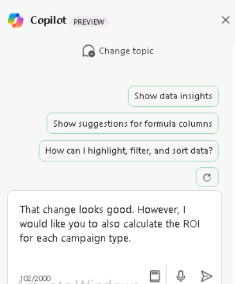
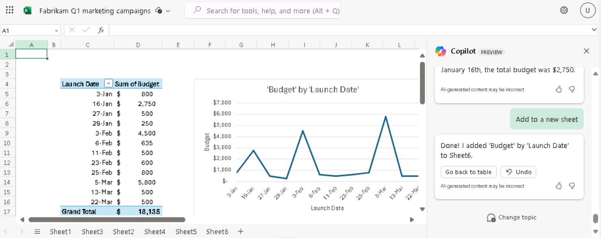

**实验 05：增强您的员工能力 – Copilot – 财务**

**目的：**

通过使用适用于 Microsoft 365 的
Copilot，财务专业人员可以自动执行重复的财务任务，深入了解他们的财务数据，通过自动执行手动任务来节省时间并更有效地协作

在本实验中，作为财务专业人员，您将使用：

- Copilot 在 Outlook
  中创建一封发送给公司保险公司的新电子邮件，以讨论其医疗保险费的过高上涨。

- Excel 中的
  Copilot，用于分析包含第一季度营销活动预计收入的电子表格，然后添加新的计算和图表以可视化数据。

- Word 中的 Copilot，用于根据公司的第 1
  季度营销活动电子表格创建营销活动报告。

- Word 中的 Copilot，用于总结公司过去五年的财务业绩。

**练习 \#1：使用 Outlook 中的 Copilot 起草发送给保险公司的电子邮件**

使用 Copilot，您可以快速生成 Copilot
根据您的特定需求量身定制的电子邮件草稿，而无需花费数小时编写和编辑它们。在本练习中，您将使用
Outlook 中的 Copilot 根据用户提供的一系列提示起草新电子邮件。

**注意：**Outlook 中的 Copilot
方案仅在用户的主邮箱上可用。它们在用户的存档邮箱、组邮箱或用户有权访问的共享邮箱和代理邮箱上不可用。

- Microsoft 仅支持 Outlook 中 Exchange Online 上托管的邮箱的 Copilot。

- Outlook 中的 Copilot 仅在 Microsoft 365
  工作或学校帐户以及具有特定电子邮件域的 Microsoft 帐户中受支持。

- 它通过带有您的 Microsoft Entra ID 帐户的 Microsoft 365 的 Copilot
  和带有您的 MSA 帐户的 Copilot Pro 来支持。

作为 Northwind Traders 的首席财务官，您希望在 Outlook 中使用 Copilot
起草一封发送给该公司的健康保险公司 Humongous Insurance
的电子邮件。您的保险代理人最近通知您，Northwind 的健康保险费将全面上涨 -
个人保单将超过 9%，家庭保单超过 15%。这一增长率远高于行业平均水平。

这封电子邮件的目的有两个：

- 表达您对涨价水平的担忧。

- 要求与保险公司的团队会面，讨论此事并探索替代选择。

1.  在 **Microsoft 365** 中，打开 **Outlook**。

2.  打开 **New** email （新建电子邮件）。

3.  在打开的 **Message** 选项卡上，选择 功能区中的
    **Copilot**。在显示的下拉菜单中，选择 **Draft with Copilot**。

4.  在消息正文中，将显示 **Draft with Copilot**
    窗口。提示字段包含消息：**What do you want this email to say?**
    字段底部是 **Generation options** 图标。选择此图标可查看 Copilot
    在创建电子邮件时提供的选项。

5.  在出现的下拉菜单中，您可以看到您可以更改电子邮件的 Tone 和
    Length。您决定首先将 **Tone** 设置为 **Formal** 并将 **Length**
    设置为 **Long**。立即选择这些选项。

6.  在 **What do you want this email to say？**
    （您希望此电子邮件说什么？字段，然后选择 **Generate** 按钮：

++**I'm the CFO for Northwind Traders. Draft an email to our insurance
carrier, Humongous Insurance, expressing my concern for the level of
increases in our company's health insurance premiums for the coming
year. Request a meeting with the insurance carrier’s team to discuss the
proposed increases and explore alternative options**.++

7.  滚动浏览草稿以进行审核。在消息的顶部，Copilot
    会显示您刚刚输入的提示的开头（即 “**I'm the CFO for Northwind
    Traders...**” ）。选择提示的此部分以查看会发生什么情况.

8.  Copilot 将显示一个 **Rewrite with Copilot**
    窗口，通过该窗口，您可以编辑之前的提示并重新生成全新的消息。此时，您对消息感到满意，但您想了解在使用不同的语气和长度时它会如何变化。选择提示下方显示的
    **Generation options** 图标。将 **音调** 更改为 **直接** 和 **长度**
    到 **中等**，然后选择 **Generate** 按钮。

9.  查看修订后的草稿。在 **Rewrite with Copilot** 窗口的顶部，请注意
    “**I'm the CFO for Northwind Traders...**” 链接。另请注意 Copilot
    如何指示此草稿是 “**2 of 2**” ，这意味着您正在查看两个 Copilot
    草稿中的第二个。您可以选择后退箭头 （\<） 返回上一个 Copilot
    草稿，在本例中，该草稿是具有 **Formal** （正式） 音调和 **Long**
    length （长长度） 的第一个草稿。

如果您生成多个 Copilot
草稿，就像您将在本练习中所做的那样，您可以使用这些箭头在草稿之间来回切换，以找到您喜欢的草稿。如果找到所需的草稿，可以选择其中一个可用按钮以
**Keep it** （保留它） 或 **Regenerate** a new draft
（重新生成具有相同色调和长度的新草稿）。请注意称呼和补充结束语、此
Direct draft 消息的整体语气以及
Length（长度）的变化。虽然你想直截了当，但你觉得 **Direct**
语气太没有人情味了，所以你想生成一个具有不同语气的新草稿。

10. 选择窗口顶部的链接提示（ “**I'm the CFO for Northwind Traders...**”
    ）以返回到 “**Rewrite with Copilot**” 窗口。选择 **Generation
    options** 图标，这次将 **Tone** 更改为 **Casual** 和 **Length** 回到
    **Long**。选择 **Generate** （生成）。

11. 查看新草稿。此时，您意识到您不喜欢第二稿中的 **Direct** 音调和
    **Medium**
    长度。但是，您确定您更喜欢较长的长度，但您无法决定您更喜欢
    **Formal** 还是 **Casual** 音调。

    - 由于当前显示的是 **Casual** 草稿，因此您注意到称呼有点非正式，例如
      “Hi there” 或只是 “Hello” 。

    - 你记不清你使用 **Formal** 语气时的确切称呼，但它是类似于 “Dear
      某某” 的意思。

    - 您也不记得初稿中使用 **Formal**
      语气的补充结尾的措辞（例如，Sincerely/Best regards/Thank you
      等）。

12. 如果您不记得这两条消息在问候语之外是如何显示的，请按照前面的说明选择后退箭头以返回到初稿，该草稿具有
    **Formal**
    语气。如果您无法决定更喜欢哪种草稿，请使用前进和向后箭头比较第一稿
    （Formal） 和第三稿 （Casual）。决定要使用的草稿后，请继续下一步。

13. 此时，您的首选草稿应显示在 Copilot
    窗口中。除了你之前对语气和长度所做的更改;您发现电子邮件消息似乎有点稀疏。您注意到它没有提供有关费率上涨的任何详细信息，至少没有按个人和家庭计划进行细分。在
    **Anything you'd like to change?**
    字段中，输入以下提示，然后选择字段末尾的箭头图标：

++**Please compare the level of premium increases being proposed for
Northwind Traders in comparison to industry-wide premium increases. Our
individual policy premiums increased over 9%, and family policies
increased over 15%. Mention how our increases far exceed the industry
averages of 6% and 10% increases, respectively**.++

14. 当您尝试根据此最新提示更新电子邮件时，刚刚发生了什么情况？您可能会收到一条错误消息，指示
    “**Sorry, something went wrong. Copilot is working on
    it**。”您收到此错误的原因是，当您向草稿提交更改请求时，Copilot
    当前每个提示一次只接受一项更改。在本例中，您要求进行两项更改 -
    ++**将计划增加与行业平均水平进行比较，**并**指定具体的费率增加。**++

以下是在 Copilot for Outlook 中工作时涉及提示的当前经验法则：

- 提交初始提示时，您可以包含多个请求。例如，您可以指示 Copilot 包含有关
  A、B 和 C 的信息。在这种情况下，它将生成包含所有三个项目的草稿。

- 但是，在该初始提示 AFTER
  之后修改草稿的任何后续提示只能包含每个提示的一个更改请求。

15. 鉴于此要求，您决定将之前的请求分为两部分。这一次，输入以下提示，这是第一部分：

++**Please mention that our individual policy premiums increased by over
9%, and family policies increased over 15**%.++

16. 查看更新的草稿。现在输入以下关于行业平均值的提示，这是第二部分：

++**Please mention that average industry premium increases are 6% for
individual policies and 10% for family policies**.++

17. 这个草稿看起来更好。但是，您决定添加关于高免赔额/低保费计划可能更改的最后一点说明。输入以下提示：

++**Please mention that we should discuss converting to high-deductible,
low premium policies**.++

18. 查看此最新迭代后，您对草稿感到满意，因此请选择 **Keep it** （保留）
    按钮。

19. 请注意该消息在没有 Copilot
    窗口的电子邮件正文中的显示方式。在实际场景中，您可以按原样发送电子邮件，或者手动进行任何最终更改。**保留**
    Copilot
    草稿后，您必须自己手动进行任何进一步的更改。您无法使用该消息返回
    Copilot 草稿模式。

20. 由于您不会发送此电子邮件，请选择电子邮件屏幕右上角的垃圾桶
    （**Discard**） 图标，然后确认您要丢弃该邮件。

**练习 \#2：在 Excel 中使用 Copilot 分析财务电子表格**

对于财务专业人士，Excel 中的 Copilot
能够以自然语言而不仅仅是公式询问有关数据集的问题。该工具可以揭示相关性，建议假设场景，并根据您的查询创建强大的可视化效果。

作为 Fabrikam 的财务总监，您希望分析公司第 1
季度营销活动的效果如何。您的营销总监为您提供了一份电子表格，其中列出了公司在第一季度开展的每项营销活动。该电子表格提供基本的预算和收入数据，以及目标用户和参与用户的数量。

在本练习中，您将使用 Excel 中的 Copilot 来分析 Excel 电子表格 **Fabrikam
Q1 marketing campaigns.xlsx** 中已有的市场趋势。您将检查 Copilot
的许多预构建函数和提示。

1.  如果您在 Microsoft Edge 浏览器中打开了 Microsoft 365
    选项卡，请立即选择它;否则，请打开一个新选项卡并输入以下 URL：
    +++[https://www.office.com+++](https://www.office.com+++/)

**注意：**您需要使用右侧 “**Resources**” 选项卡下提供的 **Microsoft 365
凭据**登录（如果出现提示）。

2.  在 **Microsoft 365** 导航窗格中，选择 **OneDrive** 将其打开。

3.  浏览到 **C：\LabFiles** 文件夹，选择 **Fabrikam Q1 marketing
    campaigns.xlsx** 电子表格的副本并将其上传到 **OneDrive**

**提示：** 打开并关闭文件以将其放入 Most Recently Used （MRU）
文件列表中。

**注意：**如果您已按照**准备实验室执行**部分中的建议将所有实验室资产上传到
OneDrive，则可以跳过此步骤。

4.  在 **Microsoft 365** 主页上，选择左侧导航窗格中的 **Excel** 图标。

5.  在 **Excel** 中，在 **File** 页面上，从文件列表中选择 **Fabrikam Q1
    marketing campaigns**。

6.  选择功能区右侧的 **Copilot** 选项。

7.  在显示的 **Copilot**
    窗格中，请注意提示字段上方显示的预定义提示。在选择这些预定义提示中的任何一个来改进分析之前，您首先希望
    Copilot 对电子表格进行一些特定更改。首先，您希望 Copilot
    确定哪些活动类型最有利可图。为此，请输入以下提示：

++**Create a pivot table to analyze the total revenue generated by each
campaign type**.++

8.  查看此提示的结果。Copilot
    显示两个响应窗口。第一个响应包括一个数据透视表，该表按促销活动类型汇总了总收入。第二个响应包括对它在第一个响应中的作用的解释。在包含此表的第一个响应中，选择
    **+Add to a new sheet** 按钮。这样做会将此表添加到此电子**表格的第
    2** 页中，然后 Copilot 会为您打开该表。

**备注：**如果 **Add to new sheet**
按钮不可见，则需要通过放大/缩小测试才能看到该按钮（缩放比例为 115%
似乎会显示详细信息）

9.  在查看**表 2** 时，您注意到 Copilot
    没有创建图表来与数据透视表一起。在查看您提交的提示时，您意识到您只是要求它创建一个数据透视表 -
    您从未提及有关图表的任何内容。您希望看到此数据的可视化效果，因此您需要输入一个提示，要求
    Copilot 生成一个图表，以配合工作**表 2**
    中的数据透视表。但是，请注意，当您在工作**表 2**
    中时，提示字段处于禁用状态。

**注意：**提示字段仅在具有 Excel 表格的工作表中启用。对于此电子表格，即
**Sheet 1。**当您继续完成此练习时，每次 Copilot
将数据添加到新工作表时，您都必须返回到工作**表 1** 以请求更多更改。

10. 选择 **Sheet 1**，然后输入以下提示：

**In Sheet 2, you created a pivot table to analyze the total revenue
generated by each campaign type. Create a chart in Sheet 2 to visualize
this data**.

11. 查看结果。如果 Copilot
    创建了一个图表，按活动类型显示收入，请继续执行下一步。但是，如果
    Copilot 显示一条消息，指示您不能要求它在具有 Excel
    表的原始工作表以外的工作表上工作，则必须简化之前的提示。在这种情况下，请输入以下提示符：

**Calculate the total revenue generated by each campaign type**.

**注意：**即使像下面这样简化了提示 计算每种活动类型产生的总收入，如果
Copilot
未能产生总收入，请继续一次又一次地尝试（在我们的测试中，仅在第四次尝试时，它生成了数据透视图以及将聊天插入工作表的选项）

12. 查看 Copilot
    创建的图表，其中按活动类型显示收入。此结果就是您想要的，因此请选择窗口底部的
    **+Add to a new sheet**
    按钮。这样做会将此图表添加到此电子表格的工作**表 3** 中。

13. 在查看**Sheet 3** 时，您注意到 Copilot
    如何将数据透视表与图表一起包括在内。您意识到 **Sheet 2**
    具有相同的数据透视表，而 **Sheet 3**
    具有表格和图表。由于您希望工作**Sheet 3**
    同时包含表格和图表，因此您决定删除工作**Sheet 2**
    以避免将来出现任何混淆。要删除工作**Sheet
    2**，请右键单击它，从出现的菜单中选择 **Delete**，然后选择 **OK**
    确认删除。这样做会留下 Sheets 1 和 3。

14. 由于您要进行更多更改，请选择 **Sheet 1**
    以返回到带有数据透视表的工作表。

15. 您现在想要确定哪些推广活动最有效。为此，您希望 Copilot
    计算每个广告系列的投资回报率 （ROI）。要计算 ROI，请输入以下提示：

++**Calculate the ROI for each campaign**.++

16. 查看此提示的结果。Copilot 向您显示计算，您可以选择 **Explain
    formula**（解释公式）选项来解释 ROI 计算。

17. 您希望 Copilot 将 ROI 添加到您的电子表格中，因此请选择窗口底部显示的
    **+Insert column** 按钮。

18. 请注意结果。Copilot 添加了一个新列，其中包含每个活动的
    ROI。虽然这很好，但您希望它确定每种推广活动的
    ROI。您在查看之前的提示时意识到了自己的错误。您要求 Copilot
    计算每个广告系列的投资回报率，而实际上，您想计算每种广告系列类型的投资回报率。输入以下提示以计算每种推广活动的
    ROI：

++**That change looks good. However, I would like you to also calculate
the ROI for each campaign type**.++

19. 查看结果。Copilot 创建了一个图表，按活动类型显示
    ROI。选择窗口底部的选项 **+Add to a new
    sheet**（添加到新工作表）。这样做会将此表添加到此电子表格的新工作
    **Sheet 2**
    中。除了创建的簇状条形图（将光标悬停在图表上可查看图表类型）之外，它还创建了一个数据透视表，其中包含按推广活动类型划分的
    ROI。查看完此数据后，选择 **Sheet 1**。

20. 您现在希望 Copilot
    确定哪些活动在吸引用户方面最有效。您认为可视化此数据的最佳方法是让
    Copilot
    创建一个图表，以显示目标用户总数与参与用户总数之间的关系。为此，请输入以下提示：

++**Create a chart that shows which campaign was most effective at
engaging users**.++

21. 查看结果。Copilot 创建了一个按市场**Campaign Name**
    **划分的参与用户**条形图。

22. 但是，如果 Copilot
    只是按活动汇总了参与用户总数，那并不完全是您想要的。要更正此结果，请输入以下提示：

++**That type of chart isn't what I was looking for. Please create a
chart that shows the relationship between total users targeted and total
users engaged**.++

23. 查看结果。在我们的测试中，Copilot 表示它无法使用这些数据创建散点图。

24. 但是，它确实解释了它创建的数据透视表。您觉得结果现在已经足够好了，因此请选择数据透视表窗口底部的
    **+Add to a new sheet** 按钮。这样做会将此表添加到此电子表格的
    **Sheet 4** 页中。查看完此数据后，选择 **Sheet 1**。

25. 您有希望 Copilot 提供的最后一条数据。您希望 Copilot
    根据产生的收入确定效果最好的活动。然后，您可以使用此信息来确定哪些促销活动最有利可图。输入以下提示：

++**Identify the top-performing campaigns based on revenue
generated**.++

26. 查看结果。Copilot 创建了一个图表，按活动名称显示
    Revenue。选择窗口底部的选项 **+Add to a new
    sheet**（添加到新工作表）。这样做会将此表添加到此电子表格的**Sheet
    5**
    页中。除了创建的簇状条形图之外，它还创建了一个数据透视表，按促销活动显示总收入。查看完此数据后，选择
    **Sheet 1**。

27. 这样就完成了您希望 Copilot 为您分析的数据。但是，您很好奇 Copilot
    可能还有哪些其他建议来进一步分析您的活动数据。在提示字段上方显示的预定义提示列表中，查找标题为
    **Show suggestions for formula columns** （显示公式列的建议）
    的建议。如果您看到此建议，请立即选择它。但是，如果您没有看到此建议，请在提示字段中手动输入。

28. 查看列建议。如果要将其添加到电子表格中，请选择 **+Insert column**
    按钮。

如果出现预定义的提示，显示 **Give me another
suggest**（给我另一个建议），然后立即选择它。但是，如果此预定义提示未出现，则在提示字段中手动输入它（在我们的测试中，此预定义提示有时在插入列之前出现，但在插入列后消失）。

29. 重复上一步几次，让 Copilot
    建议不同的计算。插入你喜欢的那些，跳过你不喜欢的那些。

30. 您现在希望 Copilot
    向您展示更多可视化各种类型数据的图表。在预定义提示列表中，选择
    **Show data insights** （显示数据见解） 按钮。

31. 查看结果。如果您对此图表感兴趣，请选择 **+Add to a new sheet**
    按钮，然后返回到 **Sheet 1**。

32. 然后选择 **Can I see another
    insight？**按钮。同样，如果您对此图表感兴趣，请选择 **+Add to a new
    sheet** 按钮，然后返回到 **Sheet 1**。

33. 看到前两个图表后，您意识到您喜欢 Copilot 提供的各种图表。您希望
    Copilot
    将它可以根据您的数据创建的所有见解添加到您的电子表格中，而不是一一查看更多图表。在预定义的提示中，选择
    **Add all insights to grid** 提示。

34. 查看结果。Copilot 在最终工作表中创建了多个图表，以及几个数据透视表。

35. 根据 Excel 中的 Copilot 提供的所有数据，您确定您的分析已完成。由于
    Excel 会自动保存您的文件，因此请关闭 Microsoft Edge 浏览器选项卡。

**练习 \#3：在 Word 中使用 Copilot 创建财务分析报告**

如果您是金融分析师并且需要撰写有关公司业绩的报告，您可以在 Word 中使用
Copilot 起草报告并询问 Copilot Chat
问题以研究、构思或迭代可能添加的内容。

在本练习中，您将指示 Word 中的 Copilot 根据您在上一个练习中分析和更新的
Fabrikam Q1
营销活动电子表格中的数据编写新报表。但是，您将使用包含所有电子表格数据的
Word 文档，而不是 Excel 电子表格。

**备注：**Word 中的 Copilot 可以根据电子表格创建报告。但是，您不能直接从
Word 中引用 Excel 文件。相反，您必须将 Excel 文件中的数据复制并粘贴到
Word 文档中。

作为 Fabrikam 的财务总监，您在 Excel 中使用 Copilot
在上一个练习中分析了公司第 1 季度营销活动的有效性。在本练习中，您将在
Word 中使用 Copilot
生成一份报告，该报告汇总了该数据的分析。电子表格已为您复制并粘贴到 Word
文档 **Fabrikam Q1 marketing campaign data.docx**
中，您将在第一步中下载该文档。

1.  如果您在 Microsoft Edge 浏览器中打开了 Microsoft 365
    选项卡，请立即选择它; 否则，请打开一个新选项卡并输入以下
    URL：[**https://www.office.com**](https://www.office.com/) 转到
    Microsoft 365 主页。

**注意：**您需要使用右侧 “**Resources**” 选项卡下提供的 **Microsoft 365
凭据**登录（如果出现提示）。

2.  在 **Microsoft 365** 导航窗格中，选择 **OneDrive** 将其打开。

3.  浏览到 **C：\LabFiles** 文件夹，选择 **Fabrikam Q1 marketing
    campaign data.docx** 文档的副本并将其上传到 **OneDrive**。**提示**：
    打开并关闭文件以将其放入 Most Recently Used （MRU） 文件列表中。

**注意：**如果您已按照**准备实验室执行**部分中的建议将所有实验室资产上传到
OneDrive，则可以跳过此步骤。

4.  在 **Microsoft 365** 中，打开 **Microsoft
    Word**，然后打开一个空白文档。

5.  在空白文档顶部显示的 **Draft with Copilot** （使用 Copilot 起草）
    窗口中，输入以下提示，但不要选择 **Generate** （生成）
    按钮，直到在下一步中将文件链接到提示后：

++**I'm the Director of Finance for Fabrikam. Please create a Q1
Marketing Campaign Analysis report based on the attached file, which
provides data on our Q1 marketing campaigns. Include the following
sections in the report: Executive Summary, Data Analysis, and
Recommendations**.++

6.  现在，您必须将下载的 **Fabrikam Q1 marketing campaign data.docx**
    文件附加到提示中。在**使用 Copilot 起草**窗口中，选择 **Reference
    your content** 按钮。

7.  在显示的下拉菜单中，如果 **Fabrikam Q1 marketing campaigns
    data.docx** 文件显示在文件列表中，请选择它。否则，请选择 **Browse
    files from cloud**（从云中浏览文件）。

8.  从 **Recent** file （最近打开的文件） 列表中选择文件，然后选择
    **Attach** （附加） 按钮。如果文件未显示在 **Recent file**
    （最近打开的文件） 列表中，请在 **Pick a file** （选取文件）
    窗口中选择导航窗格顶部的 **My files**
    （我的文件），导航到存储文件的文件夹，选择该文件，然后选择
    **Attach** （附加）。请注意文件在提示符中的显示方式。

9.  选择 **Generate** （生成）。执行此作后，Copilot
    会从文件中提取相关信息并起草一份分析数据的报告。

10. 查看结果。如果 **Executive Summary**
    部分中的数据以项目符号列表显示，则输入以下提示并将 {**table or
    bulleted list**} 替换为 **table**。

11. 如果 **Executive Summary**
    数据不是项目符号列表格式，则输入以下提示并将 {**table or bulleted
    list**} 替换为**bulleted list**：

++**Please convert the information in the Executive Summary section into
a {table or bulleted list} format**.++

12. 如果 **Executive Summary**
    数据采用项目符号列表格式，但您希望采用表格格式，则输入以下提示并将
    {**table or bulleted list**} 替换为 **table**。

++**Please convert the information in the Executive Summary section into
a {table or bulleted list} format**.++

13. 如果 **Data Analysis** （数据分析）
    部分已采用表格格式，请继续执行下一步。

**注：**
它采用项目符号列表格式。输入以下提示以将数据放入表中，以便于阅读：

++**Please convert the information in the Data Analysis section into a
table format**.++

14. 检查 **Data Analysis** 部分中的数据表。

15. 让我们看看 Copilot 是否可以从表中删除一列数据。输入以下提示，并将
    {heading} 替换为要删除的列的名称：

++**In the table of data in the Data Analysis section, please remove the
{heading} column**.++

16. 您喜欢这些**建议**，但您认为如果 Copilot
    按重要性顺序显示数据，它们会更有价值。输入以下提示，让 Copilot
    进行此更改：

++**In the Recommendations section, display the items in order of
importance, starting with the most important item**.++

17. 查看此最新草稿后，您对报表感到满意，并可以保存它。在文档底部的
    Copilot 窗口中，选择“**Keep it**”按钮以将其从 Copilot 草稿转换为
    Word 文档。

18. 查看文档。对它感到满意后，您可以丢弃该文档或将其保存到 OneDrive
    以备将来参考。

19. 在 Microsoft Edge 浏览器中关闭此选项卡。

**练习 \#4：在 Word 中使用 Copilot 总结财务结果**

在上一个练习中，您在 Word 中使用了
Copilot（基于您在分析提示中附加的文件）一个数据表，然后创建一个报告来汇总该文件中的信息。在本练习中，您将打开一个包含公司五年财务结果的表格的文件，并在
Word 中要求 Copilot（在文件的 Copilot 窗格中）汇总表格中显示的财务结果。

1.  如果您在 Microsoft Edge 浏览器中打开了 Microsoft 365
    选项卡，请立即选择它; 否则，请打开一个新选项卡并输入以下
    URL：+++[https://www.office.com+++](https://www.office.com+++/) 以转到
    **Microsoft 365** 主页。

**注意：**您需要使用右侧 “**Resources**” 选项卡下提供的 **Microsoft 365
凭据**登录（如果出现提示）。

2.  在 **Microsoft 365** 导航窗格中，选择 **OneDrive** 将其打开。

3.  浏览到 **C：\LabFiles** 文件夹，选择 **Adatum 5 Year Financial
    Results.docx** 的副本并将其上传到 **OneDrive**。

**提示：** 打开并关闭文件以将其放入 Most Recently Used （MRU）
文件列表中。

**注意：**如果您已按照**准备实验室执行**部分中的建议将所有实验室资产上传到
OneDrive，则可以跳过此步骤。

4.  在 **Microsoft 365** 导航窗格中，选择 **Microsoft
    Word**。打开您上传到 **OneDrive** 的 **Adatum 5 Year Financial
    Results.docx** 文件。

5.  在 **Microsoft Word** 功能区上，选择 **Copilot**。

6.  在出现的 **Copilot** 窗格中，几个预定义的任务显示在顶部。您希望
    Copilot 总结 Adatum 5 年财务结果文档的内容，因此请选择 “**Summarize
    this doc**” 磁贴。

7.  查看结果。在此过程中，您希望看到 Word
    添加更多详细信息，以支持它为每个区域提供的求和。您可以请求在提示中执行此作，也可以利用
    Word 在提示字段上方显示的预定义任务。如果出现 **Include more details
    in the summary** （在摘要中包含更多详细信息）
    提示，请立即选择它。否则，请选择提示字段上方显示的 **Refresh**
    图标。继续选择 **Refresh** （刷新）
    图标，直到您看到此提示或类似内容，然后选择它。但是，如果预定义的提示循环播放并开始重复，并且未显示
    **Include more details in the summary
    prompt**（在摘要提示中包含更多详细信息）未显示，则在提示字段中输入此请求。

8.  Copilot
    重新生成包含更多详细信息的新摘要后，请查看结果。将上一个摘要与当前摘要进行比较。请注意
    Copilot 如何显示报告中的特定财务指标以支持其在每个领域的汇总。

9.  尝试不同的预定义提示，看看 Copilot 还可以做些什么来改进其求和。

10. 虽然您对摘要感到满意，但您希望看到有关公司过去五年表现如何的明确声明。输入以下提示，然后选择
    **Send** 图标：

++**Based on the information in this document, how would you rate
Adatum's financial performance over the past five years? Is it getting
better or worse**?++

11. 查看结果。您现在想要查看是否有任何性能不佳的区域需要注意。输入以下提示，然后选择
    **Send** 图标：

++**Is there any area that's performing poorly that should be
addressed**?++

12. 查看结果。您使用 Copilot
    分析了公司前五年的财务业绩。您还确定了必须关注的运营领域，以提高公司的盈利能力。

13. 您希望将此汇总保留在 Word 中打开的当前文档中。在 Copilot
    窗格中，向上滚动到显示包含详细指标的完整汇总的窗口。在窗口底部，选择
    **Copy** 按钮。将光标放在文档中的表格下方，然后粘贴到剪贴板的内容中
    （**Ctrl+V**）。

14. 对指示公司表现是更好还是更差的窗口，以及显示需要改进的领域的窗口重复上一步。现在，您已经捕获了文档中的所有信息以供将来参考。

15. 关闭 Microsoft Edge 浏览器中包含此 Word 文档的选项卡。

**总结：**

在本实验中，您将：

- 使用 Outlook 中的 Copilot 起草了一份发送给供应商的专业电子邮件。

- 在 Excel 中使用 Copilot 分析营销数据并创建图表以可视化数据

- 使用 Word 中的 Copilot 开发全面的营销活动报告

- 总结公司的财务结果，为利益相关者提供清晰简洁的概述。
