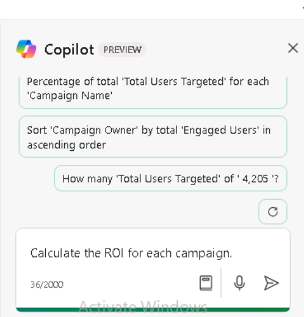

**ラボ 05: 従業員のエンパワーメント – Copilot – 財務**

**目的:**

Copilot for Microsoft 365
を使用することで、財務担当者は反復的な財務タスクを自動化し、財務データから洞察を得て、手作業のタスクを自動化することで時間を節約し、より効果的にコラボレーションすることができます。

このラボでは、財務担当者として以下のツールを活用します。

- Copilot in Outlook
  を使用して、会社の保険会社に医療保険料の法外な値上げについて話し合うための新しいメールを作成します。

- Copilot in Excel を使用して、第 1 四半期のマーケティング
  キャンペーンの予測収益を含むスプレッドシートを分析し、新しい計算とグラフを追加してデータを視覚化します。

- Copilot in Word を使用して、会社の第 1 四半期のマーケティング
  キャンペーン スプレッドシートに基づいてマーケティング キャンペーン
  レポートを作成します。

- Copilot in Wordを使用して、会社の過去 5 年間の財務結果を要約します。

**エクササイズ#1: Outlook の Copilot
を使用して保険会社へのメールを作成します**

Copilot
を使えば、何時間もかけて作成・編集することなく、特定のニーズに合わせてカスタマイズしたメールの下書きを素早く作成できます。この演習では、Outlook
で Copilot
を使用して、ユーザーが入力した一連のプロンプトに基づいて新しいメールの下書きを作成します。

注: Outlook の Copilot
シナリオは、ユーザーのプライマリメールボックスでのみ利用できます。アーカイブメールボックス、グループメールボックス、またはユーザーがアクセスできる共有メールボックスと代理人メールボックスでは利用できません。

- Microsoft は、Exchange Online でホストされているメールボックスの
  Outlook でのみ Copilot をサポートします。

- Outlook での Copilot は、Microsoft 365
  の職場または学校アカウント、および特定のメールドメインを持つ Microsoft
  アカウントでのみサポートされます。

- Microsoft Entra ID アカウントを使用した Copilot for Microsoft 365
  と、MSA アカウントを使用した Copilot Pro の両方でサポートされます。

Northwind
Traders社のCFOとして、OutlookのCopilotを使って、同社の健康保険会社であるHumongous
Insurance社宛てのメールを作成したいと考えています。先日、保険代理店から、Northwind社の健康保険料が全面的に値上げされることが通知されました。個人向け保険は9%以上、家族向け保険は15%以上値上げされます。この値上げ率は業界平均を大幅に上回っています。

このメールの目的は2つあります。

- 値上げ額に対する懸念を表明する。

- 保険会社の担当者と面談し、問題について話し合い、代替案を検討する。

1.  Microsoft 365 で Outlook を開きます。

2.  新しいメールを開きます。

3.  開いた「Message」タブで、リボンから「Copilot」を選択します。表示されるドロップダウンメニューで、「Copilot
    で下書き」を選択します。

4.  メッセージ本文に「Draft with
    Copilot」ウィンドウが表示されます。プロンプトフィールドには、「このメールの内容は何ですか？」というメッセージが表示されます。フィールドの下部には「生成オプション」アイコンがあります。このアイコンを選択すると、Copilot
    がメール作成時に提供するオプションが表示されます。

5.  表示されるドロップダウンメニューで、メールのトーンと長さを変更できます。まずはトーンを「Formal」、長さを「Long」に設定することにします。これらのオプションを選択します。

6.  \[What do you want this email to say\]
    フィールドに次のプロンプトを入力し、\[Generate\]
    ボタンを選択します。

++Northwind TradersのCFOです。保険会社であるHumongous
Insurance宛てに、来年度の健康保険料の値上げ幅に対する懸念を伝えるメールを作成してください。保険会社の担当者と面談し、提案された値上げについて話し合い、代替案を検討してください。++

7.  下書きをスクロールして確認します。メッセージの上部に、Copilot
    は先ほど入力したプロンプト（「私は Northwind Traders の CFO
    です…」）の冒頭部分を表示します。この部分を選択して、何が起こるか確認します。

8.  Copilot は「Rewrite with
    Copilot」ウィンドウを表示します。このウィンドウでは、以前のプロンプトを編集して全く新しいメッセージを再生成できます。この時点でメッセージは完成していますが、トーンと長さを変えた場合にどのような変化が見られるかを確認したいとします。プロンプトの下に表示される生成オプションアイコンを選択します。トーンを「Direct」に、長さを「Medium」に変更し、「Generate」ボタンを選択します。

9.  修正後の草稿を確認します。「Copilotで書き直す」ウィンドウの上部に「私はNorthwind
    TradersのCFOです…」というリンクがあります。また、Copilotではこの草稿が「2/2」と表示されていることにも注目してください。これは、2つのCopilot草稿のうちの2番目の草稿であることを意味します。戻る矢印（\<）を選択すると、前のCopilot草稿（この場合はフォーマルなトーンと長い文体の最初の草稿）に戻ることができます。

この演習のように、複数のCopilotドラフトを作成する場合は、これらの矢印を使ってドラフト間を行き来し、気に入ったものを見つけることができます。気に入ったドラフトが見つかったら、利用可能なボタンのいずれかを選択して「保存」するか、「同じトーンと長さで新しいドラフトを再生成」するかを選択できます。このDirectドラフトの挨拶と結びの言葉、メッセージ全体のトーン、そして長さの変化に注目してください。要点を簡潔に伝えたいのですが、Directのトーンはあまりにも非人間的だと感じたので、トーンを変えた新しいドラフトを作成したいと思います。

10. ウィンドウ上部のリンクされたプロンプト（「私はNorthwind
    TradersのCFOです…」）を選択して、「Rewrite with
    Copilot」ウィンドウに戻ります。「生成オプション」アイコンを選択し、「トーン」を「カジュアル」に、「長さ」を「ロング」に戻します。「生成」を選択します。

11. 新しい下書きを見直します。この時点で、2番目の下書きのダイレクトなトーンとミディアムの長さが気に入らないことに気づきました。しかし、長めの長さの方が好みであることは確かです。しかし、フォーマルなトーンとカジュアルなトーンのどちらが好みか決めかねています。

    - 現在表示されているのはカジュアルな下書きですが、挨拶文が「こんにちは」や「こんにちは」など、少しくだけた表現になっていることに気づきました。

    - フォーマルなトーンで書いた時の挨拶文を正確には思い出せませんが、「拝啓　○○様」といった感じだったと思います。

    - また、最初の下書きでフォーマルなトーンで書いた結びの言葉（例えば、「敬具」「敬具」「ありがとう」など）も思い出せません。

12. 挨拶文以外の2つのメッセージがどのように表示されたか思い出せない場合は、前の手順に従って戻る矢印を選択し、フォーマルなトーンで書かれた最初の下書きに戻ってください。どちらの下書きが好みか決めかねる場合は、進む矢印と戻る矢印を使用して、最初の下書き（フォーマル）と3番目の下書き（カジュアル）を比較してください。どちらの下書きを使用するかが決まったら、次のステップに進んでください。

13. この時点で、Copilot
    ウィンドウに希望通りの下書きが表示されるはずです。先ほど変更した文面と長さを除けば、メールの内容が少し物足りないように感じます。料金の値上げに関する詳細情報、少なくとも個人プランとファミリープランごとの内訳が記載されていないことに気づきます。「変更したい点はありますか？」フィールドに以下のプロンプトを入力し、フィールドの端にある矢印アイコンを選択します。

++ノースウィンド・トレーダーズに提案されている保険料の値上げ幅を、業界全体の保険料の値上げ幅と比較してください。個人向け保険の保険料は9%以上、家族向け保険の保険料は15%以上値上げされました。当社の値上げ幅が、それぞれ業界平均の6%と10%を大きく上回っている理由を述べてください。++

14. この最新のプロンプトに基づいてメールを更新しようとした際に何が起こりましたか？おそらく、「申し訳ございません。問題が発生しました。Copilot
    が対応中です」というエラーメッセージが表示されたのではないでしょうか。このエラーが発生する理由は、ドラフトに変更リクエストを送信した場合、Copilot
    は現在、1つのプロンプトにつき1つの変更しか受け付けないためです。今回のケースでは、2つの変更をリクエストしました。「プランの増額を業界平均と比較し、具体的な料金の増額を明記してください」です。

Copilot for Outlook
で作業する際のプロンプトに関する現在の経験則は次のとおりです。

- 最初のプロンプトを送信する際、複数のリクエストを含めることができます。例えば、Copilot
  に A、B、C に関する情報を含めるように指示できます。その場合、3
  つの項目すべてを含む下書きが生成されます。

- ただし、最初のプロンプトの後に下書きを修正するための後続のプロンプトでは、1
  つのプロンプトにつき 1 つの変更リクエストのみを含めることができます。

15. この要件を踏まえ、前回のリクエストを2つの部分に分割することにしました。今回は、次のプロンプト（パート1）を入力します。

++個人保険料は9%以上、家族保険料は15%以上増加したことをお伝えください。++

16. 更新された下書きを確認します。次に、業界平均に関する次のプロンプトを入力します（パート2）。

++業界平均の保険料の値上げは、個人保険の場合は6%、家族保険の場合は10%であることをお伝えください。++

17. この草稿は改善されたようですが、高額自己負担・低額保険料プランへの変更の可能性について最後に補足することにしました。次のプロンプトを入力してください。

++免責額が高く保険料が低い保険への変更について話し合う必要があることをお伝えください。++

18. この最新のイテレーションを確認し、下書きに満足したら「Save」ボタンを選択します。

19. Copilot
    ウィンドウが表示されていない状態で、メール本文にメッセージがどのように表示されているかを確認してください。実際のシナリオでは、そのままメールを送信するか、最終的な変更を手動で行うことになります。Copilot
    の下書きを保存したら、それ以降の変更は手動で行う必要があります。そのメッセージで
    Copilot の下書きモードに戻ることはできません。

20. このメールは送信しないので、メール画面の右上にあるゴミ箱（破棄）アイコンを選択し、メッセージを破棄することを確認します。

**エクササイズ#2: Excel の Copilot
を使用して財務スプレッドシートを分析する**

財務担当者にとって、Excel の Copilot
は、数式だけでなく自然言語でデータセットに関する質問をする機能を提供します。このツールは、クエリに基づいて相関関係を明らかにし、仮説シナリオを提案し、強力な視覚化を作成できます。

Fabrikam 社の財務ディレクターとして、あなたは同社の第 1
四半期のマーケティングキャンペーンの効果を分析したいと考えています。マーケティングディレクターから、第
1
四半期に実施された各マーケティングキャンペーンを識別したスプレッドシートが提供されました。このスプレッドシートには、基本的な予算と収益の数値、ターゲットユーザーとエンゲージメントユーザーの数が記載されています。

この演習では、Excel の Copilot を使用して、Excel
スプレッドシート「Fabrikam Q1 marketing
campaigns.xlsx」に既に入力されている市場動向を分析します。Copilot
にあらかじめ用意されている多くの関数とプロンプトを検証します。

1.  1\. Microsoft Edge ブラウザーで Microsoft 365
    タブを開いている場合は、それを選択します。そうでない場合は、新しいタブを開いて次の
    URL を入力します: +++https://www.office.com+++

注: 右側の \[Resources\] タブに表示される Microsoft 365
資格情報を使用してサインインする必要があります (要求された場合)。

2.  Microsoft 365 ナビゲーション ウィンドウで、OneDrive
    を選択して開きます。

3\. C:\Lab Files フォルダに移動し、Fabrikam Q1 marketing campaigns.xlsx
スプレッドシートのコピーを選択して OneDrive にアップロードします。

ヒント: ファイルを開いて閉じると、最近使用したファイル (MRU)
リストに追加されます。

注: 「Preparing for the ラボ
execution」セクションで推奨されているように、ラボのすべてのアセットを既に
OneDrive にアップロードしている場合は、この手順を省略できます。

4\. Microsoft 365 ホームページで、左側のナビゲーション ウィンドウで
Excel アイコンを選択します。

5\. Excel の \[File\] ページで、ファイル リストから「Fabrikam Q1
マーケティング キャンペーン」を選択します。

6\. リボンの右側にある \[Copilot\]
オプションを選択します。

7\.
表示されるCopilotパネルで、プロンプトフィールドの上に表示される定義済みのプロンプトに注目してください。これらの定義済みプロンプトを選択して分析を改善する前に、まずCopilotでスプレッドシートに特定の変更を加えます。まず、どのキャンペーンタイプが最も収益性が高いかをCopilotに特定させます。そのためには、次のプロンプトを入力します。

++各キャンペーンタイプで生成された総収益を分析するためのピボットテーブルを作成します。++

> 8.このプロンプトの結果を確認します。Copilot は 2
> つのレスポンスウィンドウを表示しました。最初のレスポンスには、キャンペーンタイプ別の総収益をまとめたピボットテーブルが含まれていました。2
> 番目のレスポンスには、最初のレスポンスで実行した操作の説明が含まれていました。このテーブルを含む最初のレスポンスで、「+
> Add to a new
> sheet」ボタンを選択します。これにより、このテーブルがこのスプレッドシートのシート
> 2 に追加され、Copilot によって自動的に開きます。

注: 「Add to new
sheet」ボタンが表示されない場合は、ズームイン/ズームアウトしてボタンが表示されるかテストする必要があります
(ズームレベル 115% で詳細が表示されるようです)

> 9.シート2を見ると、Copilot
> がピボットテーブルに付随するチャートを作成していないことに気づきます。送信したプロンプトを確認すると、ピボットテーブルの作成を指示しただけで、チャートについては何も言及していないことに気づきます。このデータの視覚化を確認したいので、シート2のピボットテーブルに付随するチャートを生成するようにCopilotに指示するプロンプトを入力します。しかし、シート2を開いている間は、プロンプトフィールドが無効になっていることに注意してください。

注: プロンプトフィールドは、Excel
テーブルを含むシートでのみ有効になります。このスプレッドシートでは、シート
1 が該当します。この演習を進める中で、Copilot
が新しいシートにデータを追加するたびに、シート 1
に戻って変更を要求する必要があります。

10\. シート 1 を選択し、次のプロンプトを入力します。

シート 2 では、各キャンペーン
タイプで生成された総収益を分析するためのピボット
テーブルを作成しました。シート 2
にグラフを作成して、このデータを視覚化します。

5\.
結果を確認します。キャンペーンタイプ別の収益を示すグラフがCopilotによって作成された場合は、次のステップに進みます。ただし、Excelテーブルを含む元のシート以外のシートではCopilotを操作できないことを示すメッセージが表示された場合は、前のプロンプトを簡素化する必要があります。この場合、次のプロンプトを入力します。

各キャンペーンタイプで生成された総収益を計算します。

注:
プロンプトを「各キャンペーンタイプで発生した総収益を計算してください」のように簡素化した後でも、Copilot
が総収益を生成できない場合は、何度でも試してください（テストでは、4回目の試行でのみ、ピボットチャートが生成され、チャットをシートに挿入するオプションも表示されました）。

5\. Copilot
によって作成された、キャンペーンタイプ別の収益を示すチャートを確認します。この結果が目的のものであるため、ウィンドウ下部の「+
Add to a new
sheet」ボタンを選択します。これにより、このチャートがこのスプレッドシートのシート3に追加されます。

3.  シート3を見ると、Copilot
    がグラフに加えてピボットテーブルも追加していることに気づきます。シート2にも同じピボットテーブルが含まれていますが、シート3にはピボットテーブルとグラフが含まれています。シート3にはピボットテーブルとグラフの両方が含まれている必要があるため、今後の混乱を避けるためにシート2を削除することにしました。シート2を削除するには、シート2を右クリックし、表示されるメニューから「Delete」を選択し、「OK」をクリックして削除を確定します。これでシート1とシート3が残ります。

6\.
さらに変更を加えたい場合は、シート1を選択してピボットテーブルのあるシートに戻ります。

7\.
次に、どのキャンペーンが最も効果的だったかを特定します。そのためには、Copilot
を使って各キャンペーンの投資収益率 (ROI) を計算します。ROI
を計算するには、次のプロンプトを入力します。

++各キャンペーンの ROI を計算します。++

8\. このプロンプトの結果を確認します。Copilot
が計算結果を表示し、「数式の説明」オプションを選択すると、ROI
計算の説明が表示されます。

4.  Copilot で ROI
    をスプレッドシートに追加するには、ウィンドウの下部に表示される
    \[+Insert column\] ボタンを選択します。

5\. 結果を確認してください。Copilot によって、各キャンペーンの ROI
を含む新しい列が追加されました。これは問題ありませんが、キャンペーンタイプごとに
ROI
を計算したいと考えていました。以前のプロンプトを確認したところ、間違いに気づきました。Copilot
に各キャンペーンの ROI
を計算するように指示していたのですが、実際にはキャンペーンタイプごとに
ROI を計算したかったのです。キャンペーンタイプごとに ROI
を計算するには、次のプロンプトを入力してください。

++この変更は良さそうです。ただし、キャンペーンタイプごとに ROI
も計算してもらいたいと思います。++

5.  Review the results. Copilot created a graph showing the ROI by
    campaign type. Select the option at the bottom of the window
    to **+Add to a new sheet**. Doing so adds this table to a
    new **Sheet 2** of this spreadsheet. In addition to the clustered
    bar chart that it created (hover your cursor over the chart to see
    the chart type), it also created a pivot table containing the ROI by
    campaign type. After you finish reviewing this data, select **Sheet
    1**.

6\. Copilot
を使って、どのキャンペーンがユーザーエンゲージメントに最も効果的だったかを判断したいとします。このデータを視覚化する最適な方法は、ターゲットユーザー総数とエンゲージメントユーザー総数の関係を示すチャートを
Copilot
で作成することだと考えました。そのためには、次のプロンプトを入力します。

++ユーザーエンゲージメントに最も効果的だったキャンペーンを示すチャートを作成します。++

> 7.結果を確認します。Copilot
> はキャンペーン名別のエンゲージメントユーザー数の棒グラフを作成しました。

8\. しかし、Copilot
がキャンペーンごとにエンゲージしたユーザーの合計数を集計しただけでは、期待どおりの結果にはなりません。この結果を修正するには、次のプロンプトを入力してください。

++そのようなグラフは求めていません。ターゲットユーザーの合計数とエンゲージしたユーザーの合計数の関係を示すグラフを作成してください。++

9\. 結果を確認します。テストでは、Copilot
はこのデータで散布図を作成できないと表示されました。

10\.
ただし、作成されたピボットテーブルの説明はありました。今のところはこれで十分だと思うので、ピボットテーブルウィンドウの下部にある「+
Add to a new
sheet」ボタンを選択します。これにより、このテーブルがこのスプレッドシートのシート4に追加されます。データの確認が終わったら、シート1を選択します。

11\. Copilot
に提供してほしい最後のデータがあります。収益に基づいて、最もパフォーマンスの高いキャンペーンを特定したいとします。この情報を使用して、どのキャンペーンが最も収益性が高いかを特定できます。次のプロンプトを入力します。

++収益に基づいて、最もパフォーマンスの高いキャンペーンを特定します。++

> 12\. 結果を確認してください。Copilot
> はキャンペーン名別の収益を示すグラフを作成しました。ウィンドウ下部の「+
> Add to a new
> sheet」オプションを選択してください。すると、この表がこのスプレッドシートのシート5に追加されます。作成された集合棒グラフに加えて、キャンペーン別の総収益を示すピボットテーブルも作成されています。データの確認が終わったら、シート1を選択してください。

> 13\. これで、Copilot
> に分析させたいデータの分析が完了しました。キャンペーンデータをさらに分析するために、Copilot
> が他にどのような提案をしてくれるのか知りたいですよね。プロンプトフィールドの上に表示される定義済みプロンプトのリストで、「Show
> suggestions for formula
> columns」という提案を探してください。この提案が表示されている場合は、今すぐ選択してください。この提案が表示されない場合は、プロンプトフィールドに手動で入力してください。

> 14.列の提案を確認します。スプレッドシートに追加したい場合は、「+
> Insert column」ボタンを選択します。.

「Give me another
suggestion」という定義済みプロンプトが表示された場合は、それを選択します。ただし、この定義済みプロンプトが表示されない場合は、プロンプトフィールドに手動で入力します（テストでは、列を挿入する前にこの定義済みプロンプトが表示されることがありましたが、列を挿入すると表示されなくなりました）。

15\. 前の手順を数回繰り返して、Copilot
にさまざまな計算を提案してもらいます。気に入った計算を挿入し、気に入らない計算はスキップします。

16\.
次に、さまざまな種類のデータを視覚化するチャートをいくつか表示します。定義済みプロンプトのリストで、「Show
data
insights」ボタンを選択します。

> 17.結果を確認します。このグラフに興味がある場合は、「+ Add to a new
> sheet」ボタンを選択し、シート1に戻ります。

> 18.次に、「Can I see another
> insight？」ボタンを選択します。このグラフに興味がある場合は、「+ Add
> to a new sheet」ボタンを選択し、シート1に戻ります。

> 19.最初の2つのグラフを見て、Copilotが提供する様々なグラフが気に入りました。グラフを一つずつ確認するのではなく、Copilotがデータに基づいて生成できるすべてのインサイトをスプレッドシートに追加したいと考えました。定義済みのプロンプトで、「Add
> all insights to grid prompt」を選択します。

> 20.結果を確認します。Copilot
> は最終シートに複数のグラフとピボットテーブルを作成しました。

> 21.ExcelのCopilotから提供されたすべてのデータに基づいて分析が完了したと判断します。Excelはファイルを自動的に保存したので、Microsoft
> Edgeブラウザのタブを閉じます。

**エクササイズ#3: Copilot in Word を使用して財務分析レポートを作成する**

財務アナリストとして企業の業績レポートを作成する必要がある場合、Copilot
in Wordを使用してレポートの下書きを作成し、Copilot Chat
で質問して調査、アイデア出し、または追加可能なコンテンツの反復作業を行うことができます。

この演習では、前回の演習で分析および更新した Fabrikam 社の第 1
四半期マーケティング キャンペーン
スプレッドシートのデータに基づいて、Copilot in
Wordに新しいレポートを作成するよう指示します。ただし、Excel
スプレッドシートではなく、スプレッドシートのすべてのデータを含む Word
文書を使用します。

注: Copilot in
Wordでは、スプレッドシートに基づいてレポートを作成できます。ただし、Word
内から Excel ファイルを直接参照することはできません。Excel
ファイルからデータをコピーして Word 文書に貼り付ける必要があります。

Fabrikam 社の財務ディレクターとして、前回の演習では Copilot in
Excelを使用して同社の第 1 四半期マーケティング
キャンペーンの効果を分析しました。この演習では、Copilot in
Wordを使用して、そのデータの分析結果をまとめたレポートを生成します。スプレッドシートはコピーされ、最初の手順でダウンロードする
Word 文書 Fabrikam Q1 マーケティング キャンペーン データ.docx
に貼り付けられます。

1.  Microsoft Edge ブラウザーで Microsoft 365
    タブを開いている場合は、それを選択します。開いていない場合は、新しいタブを開き、次の
    URL を入力します: https://www.office.com 、Microsoft 365
    ホームページに移動します。

注: 右側の「リソース」タブに表示される Microsoft 365
資格情報を使用してサインインする必要があります（要求された場合）。

2\. Microsoft 365 ナビゲーション ウィンドウで、OneDrive
を選択して開きます。

3\. C:\LabFiles フォルダーを参照し、Fabrikam Q1 マーケティング
キャンペーン データ.docx ドキュメントのコピーを選択して OneDrive
にアップロードします。ヒント:
ファイルを開いて閉じると、最近使用したファイル (MRU)
リストに追加されます。

注:
「ラボ実行の準備」セクションで示されているように、ラボアセットをすべて
OneDrive にアップロード済みの場合は、この手順を省略できます。

4\. Microsoft 365 で Microsoft Word
を開き、空白のドキュメントを開きます。

5\. 空白のドキュメントの上部に表示される「Draft with
Copilot」ウィンドウで、次のプロンプトを入力します。ただし、次の手順でファイルをプロンプトにリンクするまで、「Generate」ボタンは選択しないでください。

++Fabrikam の財務部長です。添付ファイルに基づいて、第 1
四半期のマーケティングキャンペーンに関するデータを提供する第 1
四半期のマーケティングキャンペーン分析レポートを作成してください。レポートには、エグゼクティブサマリー、データ分析、推奨事項の各セクションを含めてください。++

6\. ダウンロードした Fabrikam 第 1
四半期のマーケティングキャンペーンデータ.docx
ファイルをプロンプトに添付する必要があります。「Draft with
Copilot」ウィンドウで、「Reference your
content」ボタンを選択します。

7\. 表示されるドロップダウンメニューで、Fabrikam Q1
マーケティングキャンペーンデータ.docx
ファイルがファイルリストに表示されている場合は選択します。表示されていない場合は、「Browse
files from
cloud」を選択します。

8\. 「Recent
file」リストからファイルを選択し、「Attach」ボタンを選択します。ファイルが「Recent
file」リストに表示されない場合は、「Pick a
file」ウィンドウのナビゲーションペイン上部にある「My
files」を選択し、ファイルを保存したフォルダに移動してファイルを選択し、「Attach」を選択します。プロンプトにファイルがどのように表示されるかご確認ください。

9\. 「Generate」を選択します。すると、Copilot
はファイルから関連情報を抽出し、データを分析したレポートを作成します。

10\.
結果を確認します。エグゼクティブサマリーセクションのデータが箇条書きで示されている場合は、次のプロンプトを入力し、{table
or bulleted
list}をtableに置き換えます。

11\.
エグゼクティブサマリーのデータが箇条書き形式でない場合は、次のプロンプトを入力し、「{表または箇条書き}」を「箇条書き」に置き換えてください。

++エグゼクティブサマリーセクションの情報を{表または箇条書き}形式に変換してください。++

12\.
エグゼクティブサマリーのデータが箇条書き形式になっているが、表形式にしたい場合は、次のプロンプトを入力し、「{表または箇条書き}」を「表」に置き換えてください。

++エグゼクティブサマリーセクションの情報を{表または箇条書き}形式に変換してください。++

13\. Data
Analysisセクションがすでに表形式になっている場合は、次の手順に進みます。

注:
箇条書き形式になっています。読みやすくするために、データを表形式にするには、次のプロンプトを入力してください。

++データ分析セクションの情報を表形式に変換してください。++

14\. Data Analysisセクションのデータ
テーブルを調べます。

15\. Copilot
でテーブルからデータ列を削除できるかどうか確認してみましょう。次のプロンプトを入力し、{heading}
を削除したい列名に置き換えてください。

++データ分析セクションのデータテーブルで、{heading}
列を削除してください。++

16\. 推奨事項は気に入っていますが、Copilot
がデータを重要度順に表示してくれたら、もっと役立つと思います。Copilot
にこの変更を実行させるには、次のプロンプトを入力してください。

++「Recommendations」セクションで、最も重要な項目から順に項目を表示します。++

17\.
最新の下書きを確認し、レポートに満足したら保存する準備が整いました。文書下部のCopilotウィンドウで「Keep
it」ボタンを選択すると、Copilotの下書きからWord文書に変換されます。

18\.
ドキュメントを確認します。問題がなければ、ドキュメントを破棄するか、後で参照できるようにOneDriveに保存します。

19\. Microsoft Edgeブラウザでこのタブを閉じます。

**エクササイズ#4: Copilot in Word を使用して財務結果を要約する**

前回の演習では、Word の Copilot
を使用して（プロンプトに添付したファイルに基づいて）データ表を分析し、そのファイル内の情報をまとめたレポートを作成しました。今回の演習では、ある企業の
5 年間の財務実績表を含むファイルを開き、Word の Copilot（ファイルの
Copilot ペイン内）を使用して、表に表示されている財務実績をまとめます。

1\. Microsoft Edge ブラウザーで Microsoft 365
タブを開いている場合は、ここでそれを選択します。開いていない場合は、新しいタブを開き、次の
URL を入力します: +++https://www.office.com+++ で Microsoft 365
ホームページに移動します。

注: 右側の \[リソース\] タブに表示される Microsoft 365
資格情報を使用して（プロンプトが表示された場合）サインインする必要があります。

2\. Microsoft 365 ナビゲーション ウィンドウで、OneDrive
を選択して開きます。

3\. C:\ラボFiles フォルダを参照し、Adatum 5 Year Financial Results.docx
のコピーを選択して OneDrive にアップロードします。

ヒント: ファイルを開いて閉じると、最近使用したファイル (MRU)
リストに追加されます。

注:
「ラボ実行の準備」セクションで推奨されているように、ラボアセットをすべて
OneDrive にアップロード済みの場合は、この手順を省略できます。

4\. Microsoft 365 ナビゲーション ウィンドウで、Microsoft Word
を選択します。OneDrive にアップロードした Adatum 5 Year Financial
Results.docx ファイルを開きます。

5\. Microsoft Word リボンで、「Copilot」を選択します。

6\. 表示される Copilot
ウィンドウの上部に、いくつかの定義済みタスクが表示されます。Copilot で
Adatum 5 Year Financial Results
ドキュメントの内容を要約したいので、「Summarize this
doc」タイルを選択します。

7\.
結果を確認します。その際、各領域で提供される集計を補足するために、Word
に詳細情報を追加してもらいたいと思います。プロンプトで追加を要求するか、プロンプトフィールドの上に表示される定義済みタスクを利用することができます。「概要に詳細情報を含める」プロンプトが表示された場合は、すぐに選択します。表示されない場合は、プロンプトフィールドの上に表示される「更新」アイコンを選択します。このプロンプトまたは同様のプロンプトが表示されるまで「更新」アイコンを選択し続け、表示されたら選択します。ただし、定義済みプロンプトが循環して繰り返し表示され、「概要に詳細情報を含める」プロンプトが表示されない場合は、プロンプトフィールドにこの要求を入力します。

8\. Copilot
がより詳細な情報を含む新しいサマリーを再生成し終えたら、結果を確認します。以前のサマリーと現在のサマリーを比較してみましょう。各領域における集計結果を裏付けるために、レポートから具体的な財務指標が表示されている点に注目してください。

9\. 様々な定義済みプロンプトを試して、Copilot
で集計結果を改善できる点を確認してください。

10\. 要約には満足していますが、過去 5
年間の会社の業績に関する明確な見解を確認したいとします。次のプロンプトを入力し、送信アイコンを選択してください。

++この文書の情報に基づいて、Adatum の過去 5
年間の財務実績をどのように評価しますか？改善していますか、それとも悪化していますか？++

11\.
結果を確認します。次に、パフォーマンスが低い、対処が必要な領域があるかどうかを確認します。次のプロンプトを入力し、送信アイコンを選択します。

++パフォーマンスが低い、対処が必要な領域はありますか？++

12\. 結果を確認します。Copilot を使用して、会社の過去 5
年間の財務実績を分析しました。また、会社の収益性を向上させるために注力すべき業務領域を特定しました。

13\. この集計結果を、現在開いている Word 文書に保持します。Copilot
ペインで、詳細な指標を含む完全な集計結果が表示されているウィンドウまで上にスクロールします。ウィンドウの下部にある「Copy」ボタンを選択します。文書内の表の下にカーソルを置き、クリップボードの内容を貼り付けます
(Ctrl+V)。

14\.
会社の業績が好調か不調かを示すウィンドウと、改善が必要な領域を示すウィンドウの両方で、前の手順を繰り返します。これで、今後の参考のためにドキュメント内のすべての情報が取得されました。

15\. Microsoft Edgeブラウザで、このWord文書を含むタブを閉じます。

**概要:**

このラボでは次のことが行えます。

•
OutlookでCopilotを使用し、ベンダーへのプロフェッショナルなメールを作成しました。

•
ExcelでCopilotを使用し、マーケティングデータを分析し、データを視覚化するグラフを作成しました。

•
WordでCopilotを使用し、包括的なマーケティングキャンペーンレポートを作成しました。

• 会社の財務結果を要約し、関係者に明確かつ簡潔な概要を提供しました。
