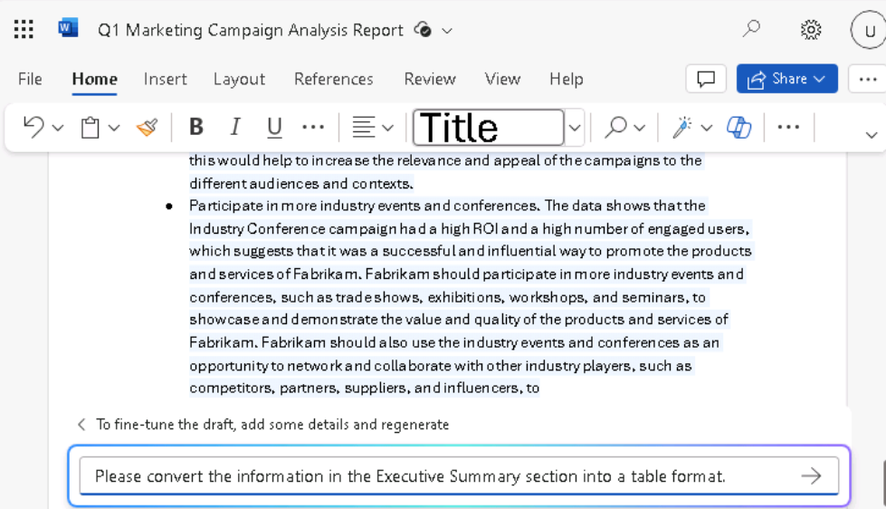

**Laboratório 05: Capacite sua força de trabalho – Copilot – Finanças**

**Objetivo:**

Ao usar o Copilot for Microsoft 365, os profissionais de finanças podem
automatizar tarefas financeiras repetitivas, obter insights sobre seus
dados financeiros, economizar tempo automatizando tarefas manuais e
colaborar com mais eficiência

Neste laboratório, como profissional de finanças, você usará:

- Copilot no Outlook para criar um novo e-mail para a seguradora da
  empresa para discutir os aumentos exorbitantes em seus prêmios de
  seguro médico.

- Copilot no Excel para analisar uma planilha contendo receita projetada
  para campanhas de marketing do 1º trimestre e, em seguida, adicionar
  novos cálculos e gráficos para visualizar os dados.

- Copilot no Word para criar um relatório de campanha de marketing com
  base na planilha de campanha de marketing do 1º trimestre da empresa.

- Copilot no Word para resumir os resultados financeiros de uma empresa
  nos últimos cinco anos.

**Exercício 1: Elaborar um e-mail para sua seguradora usando o Copilot
no Outlook**

Com o Copilot, você pode gerar rapidamente rascunhos de e-mail que o
Copilot adapta às suas necessidades específicas, sem ter que passar
horas escrevendo-os e editando-os. Neste exercício, você usará o Copilot
no Outlook para redigir um novo e-mail com base em uma série de prompts
fornecidos pelo usuário.

**Observação:** Os recursos do Copilot no Outlook estão disponíveis
exclusivamente na caixa de entrada principal do usuário. Não estão
acessíveis em caixas de correio de arquivo, caixas de correio de grupo
ou em caixas de correio compartilhadas e delegadas às quais o usuário
tem acesso.

- A Microsoft oferece suporte ao Copilot no Outlook apenas em caixas de
  correio hospedadas no Exchange Online.

- O Copilot no Outlook é compatível apenas com contas corporativas ou
  escolares do Microsoft 365 e contas Microsoft com domínios de e-mail
  específicos.

- Ele é compatível tanto por meio do Copilot para Microsoft 365 com sua
  conta do Microsoft Entra ID quanto do Copilot Pro com sua conta MSA.

Como CFO da Northwind Traders, você deseja usar o Copilot no Outlook
para redigir um e-mail para a operadora do seguro saúde da empresa,
Humongous Insurance. Você foi recentemente informado pelo seu agente de
seguros que os prêmios do seguro saúde da Northwind seriam aumentados em
toda a linha – mais de 9% para apólices individuais e mais de 15% para
apólices familiares. Este aumento de taxa é consideravelmente superior
às médias do setor.

O objetivo deste e-mail é duplo:

- Expressar sua preocupação com o nível de aumentos.

- Solicitar uma reunião com a equipe da operadora de seguros para
  discutir o assunto e explorar opções alternativas.

1.  No **Microsoft 365**, abra o **Outlook**.

2.  Abra um **Novo** email.

3.  Na guia **Message** que se abre, selecione **Copilot** na faixa de
    opções. No menu suspenso que aparece, selecione **Draft with
    Copilot**.

4.  No corpo da mensagem, uma janela **Draft with Copilot** aparece. O
    campo de prompt contém a mensagem: **What do you want this email to
    say?** Na parte inferior do campo, há um ícone de **Generation
    options**. Selecione esse ícone para ver as opções que o Copilot
    oferece ao criar um e-mail.

5.  No menu suspenso que aparece, você vê que pode alterar o Tone e o
    Length do e-mail. Você decide começar definindo o **Tone** como
    **Formal** e o **Length** como **Long**. Selecione essas opções
    agora.

6.  Insira o seguinte prompt no campo **What do you want this email to
    say?** e, em seguida, selecione o botão **Generate**:

++**I'm the CFO for Northwind Traders. Draft an email to our insurance
carrier, Humongous Insurance, expressing my concern for the level of
increases in our company's health insurance premiums for the coming
year. Request a meeting with the insurance carrier’s team to discuss the
proposed increases and explore alternative options**.++

7.  Role para baixo para revisar o rascunho. No topo da mensagem, **o
    Copilot** exibe o início do prompt que você acabou de inserir (ou
    seja, **"I'm the CFO for Northwind Traders..."**). Selecione essa
    seção do prompt para ver o que acontece.

8.  O Copilot exibe uma janela **Rewrite with Copilot** que permite
    editar o prompt anterior e gerar uma nova mensagem completamente.
    Neste momento, você está satisfeito com a mensagem, mas deseja ver
    como ela mudaria ao usar um tom e um comprimento diferentes.
    Selecione o ícone **Generation options** que aparece abaixo do
    prompt. Altere o **Tone** para **Direct** e o **Length** para
    **Medium**, e depois selecione o botão **Generate**.

9.  Revise o rascunho atualizado. No topo da janela **Rewrite with
    Copilot**, observe o link **"I'm the CFO for Northwind
    Traders..."**. Note também como o Copilot indica que este rascunho é
    **"2 of 2"**, o que significa que você está visualizando o segundo
    de dois rascunhos gerados pelo Copilot. Você pode selecionar a seta
    para trás (**\<**) para retornar ao rascunho anterior, que, neste
    caso, é o primeiro rascunho com um tom **Formal** e um comprimento
    **Long**.

Se você gerar vários rascunhos com o Copilot, como fará neste exercício,
poderá usar essas setas para alternar entre os rascunhos e encontrar um
que goste. Se encontrar um rascunho que deseja manter, pode selecionar
um dos botões disponíveis para **Keep it** ou **Regenerate** um novo
rascunho com o mesmo Tone e Length. Observe a saudação e o fechamento
complementar, o tom geral da mensagem para este rascunho Direct, e a
alteração no Length. Embora você queira ser direto ao ponto, sente que o
tom **Direct** é muito impessoal, então deseja gerar um novo rascunho
com um tom diferente.

10. Selecione o prompt vinculado na parte superior da janela (**"I'm the
    CFO for Northwind Traders..."**) para retornar à janela **Rewrite
    with Copilot**. Selecione o ícone **Generation options** e, desta
    vez, altere o **Tone** para **Casual** e o **Length** de volta para
    **Long**. Selecione **Generate**.

11. Revise o novo rascunho. Neste ponto, você percebe que não gosta do
    tom **Direct** e do comprimento **Medium** no segundo rascunho. No
    entanto, tem certeza de que prefere o comprimento Long, mas não
    consegue decidir se prefere o tom **Formal** ou **Casual**.

    - Como o rascunho **Casual** está sendo exibido, você nota que a
      saudação é um pouco informal, como "Hi there" ou apenas "Hello."

    - Você não consegue lembrar exatamente a saudação que usou no tom
      **Formal**, mas era algo como "Dear so and so."

    - Você também não consegue lembrar da formulação do fechamento
      complementar no primeiro rascunho que usava o tom **Formal** (por
      exemplo, Sincerely/Best regards/Thank you, etc.).

12. Se você não consegue lembrar como as duas mensagens apareciam além
    das saudações, siga as instruções anteriores para selecionar a seta
    para trás e retornar ao primeiro rascunho, que tinha um tom
    **Formal**. Se não conseguir decidir qual rascunho prefere, use as
    setas para frente e para trás para comparar o primeiro rascunho
    (Formal) e o terceiro rascunho (Casual). Prossiga para a próxima
    etapa assim que decidir qual rascunho deseja usar.

13. Neste ponto, seu rascunho preferido deve aparecer na janela do
    Copilot. Além das mudanças no Tone e no Length que você fez
    anteriormente, percebe que a mensagem do e-mail parece um pouco
    superficial. Você nota que não fornece informações detalhadas sobre
    os aumentos das taxas, pelo menos não divididas entre planos
    individuais e familiares. No campo **Anything you'd like to
    change?**, insira o seguinte prompt e, em seguida, selecione o ícone
    de seta no final do campo:

++**Please compare the level of premium increases being proposed for
Northwind Traders in comparison to industry-wide premium increases. Our
individual policy premiums increased over 9%, and family policies
increased over 15%. Mention how our increases far exceed the industry
averages of 6% and 10% increases, respectively**.++

14. O que aconteceu quando você tentou atualizar o e-mail com esse
    último prompt? Provavelmente, você recebeu uma mensagem de erro
    informando **"Sorry, something went wrong. Copilot is working on
    it."** Isso aconteceu porque, ao enviar uma solicitação de alteração
    para um rascunho, o Copilot atualmente aceita apenas uma alteração
    por prompt. Neste caso, você solicitou duas mudanças - ++**compare
    the plan increases to industry averages** and **specify the specific
    rate increases**.++

Aqui está a regra geral para prompts ao trabalhar com o Copilot for
Outlook:

- Quando você envia seu prompt inicial, pode incluir várias
  solicitações. Por exemplo, você pode pedir ao Copilot para incluir
  informações sobre A, B e C. Nesse caso, ele geraria um rascunho com
  todos os três itens.

- No entanto, qualquer prompt subsequente para modificar um rascunho
  APÓS o prompt inicial pode conter apenas uma solicitação de alteração
  por prompt.

15. Dado esse requisito, você decide dividir sua solicitação anterior em
    duas partes. Desta vez, insira o seguinte prompt, que é a parte um:

++**Please mention that our individual policy premiums increased by over
9%, and family policies increased over 15**%.++

16. Revise o rascunho atualizado. Agora insira o seguinte prompt sobre
    as médias do setor, que é a parte dois:

++**Please mention that average industry premium increases are 6% for
individual policies and 10% for family policies**.++

17. Este rascunho parece melhor. No entanto, você decide adicionar uma
    última observação sobre uma possível mudança para planos de franquia
    alta e prêmios baixos. Insira o seguinte prompt:

++**Please mention that we should discuss converting to high-deductible,
low premium policies**.++

18. Após revisar esta última versão, você está satisfeito com o
    rascunho, então selecione o botão **Keep it**.

19. Observe como a mensagem aparece no corpo do e-mail sem a janela do
    Copilot. Em um cenário real, você poderia enviar o e-mail como está
    ou fazer quaisquer alterações finais manualmente. Depois de **keep**
    um rascunho do Copilot, qualquer mudança adicional deve ser feita
    manualmente. Você não pode voltar ao modo de rascunho do Copilot com
    essa mensagem.

20. Como você não enviará este e-mail, selecione o ícone da lixeira
    (**Discard**) no canto superior direito da tela do e-mail e confirme
    que deseja descartar a mensagem.

**Exercício 2: Analisar uma planilha financeira usando o Copilot no
Excel**

Para profissionais de finanças, o Copilot in Excel oferece a capacidade
de fazer perguntas sobre seu conjunto de dados em linguagem natural, em
vez de apenas fórmulas. A ferramenta pode revelar correlações, sugerir
cenários hipotéticos e criar visualizações poderosas com base em suas
consultas.

Como Director of Finance da Fabrikam, você deseja analisar a eficácia
das campanhas de marketing da empresa no primeiro trimestre. O Director
of Marketing forneceu uma planilha que identifica cada campanha de
marketing realizada pela empresa durante o primeiro trimestre. A
planilha contém informações básicas sobre orçamento, receita e o número
de usuários segmentados e engajados.

Neste exercício, você usará o Copilot NO Excel para analisar a tendência
do mercado que já está na planilha **Fabrikam Q1 marketing
campaigns.xlsx**. Você examinará várias funções e prompts
pré-construídos do Copilot.

1.  Se você tiver uma guia do Microsoft 365 aberta no seu navegador
    Microsoft Edge, selecione-a agora; caso contrário, abra uma nova
    guia e digite a seguinte URL:
    +++[https://www.office.com+++](https://www.office.com+++/)

**Observação**: Você precisará fazer login (se solicitado) usando as
**credenciais do Microsoft 365** fornecidas na guia **Resources** à
direita.

2.  No painel de navegação do **Microsoft 365**, selecione **OneDrive**
    para abri-lo.

3.  Navegue até a pasta **C:\LabFiles** para selecionar e fazer o upload
    de uma cópia da planilha **Fabrikam Q1 marketing campaigns.xlsx**
    para o **OneDrive**

Dica: Abra e feche o arquivo para que ele apareça na sua lista de
arquivos Most Recently Used (MRU).

**Observação**: Se você já fez o upload de todos os ativos do
laboratório para o OneDrive, conforme sugerido na seção **Preparing for
the lab execution**, pode pular esta etapa.

4.  Na página inicial do **Microsoft 365**, selecione o ícone do
    **Excel** no painel de navegação à esquerda.

5.  No **Excel**, na página **File**, selecione **Fabrikam Q1 marketing
    campaigns** na lista de arquivos.

6.  Selecione a opção **Copilot** no lado direito da ribbon.

7.  No painel do **Copilot** que aparece, observe os prompt predefinidos
    exibidos acima do campo de prompt. Antes de selecionar qualquer um
    desses prompt predefinidos para aprimorar sua análise, você primeiro
    deseja que o Copilot faça algumas alterações específicas na
    planilha. Para começar, você quer que o Copilot identifique quais
    tipos de campanha são mais lucrativos. Para isso, insira o seguinte
    prompt:

++**Create a tabela dinâmica to analyze the total revenue generated by
each campaign type**.++

8.  Revise os resultados deste prompt. O Copilot exibiu duas janelas de
    resposta. A primeira resposta incluiu uma tabela dinâmica que
    resumiu a receita total por tipo de campanha. A segunda resposta
    incluiu uma explicação sobre o que foi feito na primeira resposta.
    Na primeira resposta que contém essa table, selecione o botão **+Add
    to a new sheet**. Ao fazer isso, essa table será adicionada à
    **Sheet 2** desta planilha, que o Copilot então abriu para você.

**Observação**: Se o botão **Add to new sheet** não estiver visível,
você precisa testar com zoom in/out para vê-lo (um nível de zoom de 115%
parece exibir os detalhes).

9.  Observando a **Sheet 2**, você percebe que o Copilot não criou um
    gráfico para acompanhar a tabela dinâmica. Ao revisar o prompt que
    você enviou, percebe que apenas pediu para criar uma tabela
    dinâmica—você nunca mencionou nada sobre um gráfico. Você gostaria
    de ver uma visualização desses dados, então deseja inserir um prompt
    pedindo ao Copilot para gerar um gráfico para acompanhar a tabela
    dinâmica na **Sheet 2**. No entanto, observe que, enquanto estiver
    na **Sheet 2**, o campo de prompt está desativado.

**Observação**: O campo de prompt só é ativado na sheet que contém a
Excel table. Para esta planilha, essa é a **Sheet 1**. Conforme você
avança neste exercício, cada vez que o Copilot adiciona dados a uma nova
sheet, você deve retornar à **Sheet 1** para solicitar mais alterações.

10. Selecione **Sheet 1** e, em seguida, insira o seguinte prompt:

**In Sheet 2, you created a tabela dinâmica to analyze the total revenue
generated by each campaign type. Create a chart in Sheet 2 to visualize
this data**.

11. Revise o resultado. Se o Copilot criou um gráfico mostrando a
    receita por tipo de campanha, então prossiga para a próxima etapa.
    No entanto, se o Copilot exibiu uma mensagem indicando que você não
    pode pedir para ele trabalhar em uma sheet diferente da original
    sheet que contém a Excel table, então você deve simplificar seu
    prompt anterior. Neste caso, insira o seguinte prompt:

**Calculate the total revenue generated by each campaign type**.

**Observação:** Mesmo depois de simplificar o prompt como o seguinte:
Calculate the total revenue generated by each campaign type, se o
Copilot não conseguir gerar a receita total, continue tentando várias
vezes. (Em nossos testes, somente na quarta tentativa ele gerou o
Gráfico dinâmico juntamente com a opção de inseri-lo em uma sheet.)

12. Revise o gráfico que o Copilot criou mostrando a receita por tipo de
    campanha. Este é o resultado que você queria, então selecione o
    botão **+Add to a new sheet** na parte inferior da janela. Ao fazer
    isso, este gráfico será adicionado à **Sheet 3** desta planilha.

13. Observando a **Sheet 3**, você nota que o Copilot incluiu a tabela
    dinâmica junto com o gráfico. Você percebe que a **Sheet 2** tem a
    mesma tabela dinâmica, enquanto a **Sheet 3** possui a table e o
    gráfico. Como você prefere a **Sheet 3**, que contém ambos, decide
    remover a **Sheet 2** para evitar qualquer confusão futura. Para
    excluir a **Sheet 2**, clique com o botão direito sobre ela,
    selecione **Delete** no menu que aparece e, em seguida, selecione
    **OK** para confirmar a exclusão. Ao fazer isso, você ficará apenas
    com as **Sheets 1** e **3**.

14. Como você deseja fazer mais alterações, selecione **Sheet 1** para
    retornar à sua sheet com a tabela dinâmica.

15. Agora você deseja identificar quais campanhas foram mais eficazes.
    Para isso, você quer que o Copilot calcule o Return on Investment
    (ROI) de cada campanha. Para calcular o ROI, insira o seguinte
    prompt:

++**Calculate the ROI for each campaign**.++

16. Revise os resultados deste prompt. O Copilot exibe o cálculo, e você
    pode selecionar a opção **Explain formula** para obter uma
    explicação do cálculo do ROI.

17. Você quer que o Copilot adicione o ROI à sua planilha, então
    selecione o botão **+Insert column** que aparece na parte inferior
    da janela.

18. Observe os resultados. O Copilot adicionou uma nova coluna contendo
    o ROI para cada campanha individual. Embora isso esteja correto,
    você quer que ele determine o ROI para cada tipo de campanha. Você
    percebeu seu erro ao revisar seu prompt anterior. Você pediu ao
    Copilot para calcular o ROI de cada campanha, quando, na verdade,
    queria calcular o ROI de cada campaign type:

++**That change looks good. However, I would like you to also calculate
the ROI for each campaign type**.++

19. Revise os resultados. O Copilot criou um graph mostrando o ROI por
    campaign type. Selecione a opção na parte inferior da janela para
    **+Add to a new sheet**. Ao fazer isso, esta table será adicionada a
    uma nova **Sheet 2** desta planilha. Além do clustered gráfico de
    barras que foi criado (passe o cursor sobre o gráfico para ver o
    tipo de gráfico), o Copilot também gerou uma tabela dinâmica
    contendo o ROI por campaign type. Após terminar de revisar esses
    dados, selecione a **Sheet 1**.

20. Agora você deseja que o Copilot determine quais campanhas foram mais
    eficazes em engajar usuários. Você acredita que a melhor maneira de
    visualizar esses dados é pedir ao Copilot para criar um gráfico que
    mostre a relação entre total users targeted e total users engaged.
    Para isso, insira o seguinte prompt:

++**Create a chart that shows which campaign was most effective at
engaging users**.++

21. Analise os resultados. O Copilot criou um gráfico de barras
    **Engaged Users by Campaign Name**

22. No entanto, se o Copilot apenas resumiu o total de usuários
    envolvidos por campanha, isso não é exatamente o que você queria.
    Para corrigir esse resultado, digite o seguinte prompt:

++**That type of chart isn't what I was looking for. Please create a
chart that shows the relationship between total users targeted and total
users engaged**.++

23. Analise os resultados. Em nossos testes, o Copilot indicou que não
    poderia criar um gráfico de dispersão com esses dados.

24. No entanto, ele explicou a tabela dinâmica que foi criada. Você
    sente que este resultado é suficiente por enquanto, então selecione
    o botão **+Add to a new sheet** na parte inferior da janela da
    tabela dinâmica. Ao fazer isso, esta table será adicionada à **Sheet
    4** desta planilha.

25. Você tem um último dado que gostaria que o Copilot fornecesse. Você
    deseja que o Copilot identifique as campanhas de melhor desempenho
    com base na receita gerada. Assim, poderá usar essas informações
    para identificar quais campanhas são mais lucrativas. Insira o
    seguinte prompt:

++**Identify the top-performing campaigns based on revenue
generated**.++

26. Analise os resultados. O Copilot criou um gráfico que mostra a
    receita por nome de campanha. Selecione a opção na parte inferior da
    janela para **+Add to a new sheet**. Ao fazer isso, adiciona essa
    tabela à **Sheet 5** desta planilha. Além do gráfico de barras
    agrupadas que ele criou, ele também criou uma tabela dinâmica que
    exibe a receita total por campanha. Quando terminar de revisar esses
    dados, selecione **Sheet 1**.

27. Isso conclui a análise dos dados que você queria que o Copilot
    realizasse para você. No entanto, você está curioso para saber quais
    outras sugestões o Copilot pode ter para aprofundar a análise dos
    dados da campanha. Na lista de prompt predefinidos que aparecem
    acima do campo de prompt, procure uma sugestão intitulada **Show
    suggestions for formula columns**. Se encontrar essa sugestão,
    selecione-a agora. No entanto, se essa sugestão não aparecer,
    insira-a manualmente no campo de prompt.

28. Revise a sugestão de coluna. Se quiser adicioná-la à sua planilha,
    selecione o botão **+Insert column**.

Se aparecer um prompt predefinido que diz **Give me another
suggestion**, selecione-o agora. No entanto, se esse prompt predefinido
não aparecer, insira-o manualmente no campo de prompt. (Em nossos
testes, esse prompt predefinido às vezes aparecia antes de inserir a
coluna, mas desaparecia após a coluna ser inserida.).

29. Repita a etapa anterior algumas vezes para que o Copilot sugira
    cálculos diferentes. Insira os que você gosta e pule os que não
    gosta.

30. Agora você quer que o Copilot mostre alguns gráficos adicionais que
    visualizem vários tipos de dados. Na lista de prompt predefinidos,
    selecione o botão **Show data insights**.

31. Revise os resultados. Se este chart for de seu interesse, selecione
    o botão **+Add to a new sheet** e, em seguida, retorne à **Sheet
    1**.

32. Em seguida, selecione o botão **Can I see another insight?**
    Novamente, se este gráfico for de seu interesse, selecione o botão
    **+Add to a new sheet** e, em seguida, retorne à **Sheet 1**.

33. Depois de ver esses dois primeiros gráficos, você percebe que gosta
    dos diversos gráficos que o Copilot fornece. Em vez de analisar mais
    gráficos um por um, você deseja que o Copilot adicione à sua
    planilha todos os insights que ele pode criar com base nos seus
    dados. Na lista de prompt predefinidos, selecione o **Add all
    insights to grid prompt**.

34. Revise os resultados. O Copilot criou vários gráficos na final
    sheet, juntamente com várias tabelas dinâmicas.

35. Você determina que sua análise está completa, considerando todos os
    dados que o Copilot no Excel forneceu. Como o Excel salvou
    automaticamente seu arquivo, feche a guia do seu Microsoft Edge
    browser.

**Exercício 3: Crie um relatório de análise financeira usando o Copilot
no Word**

Se você é um analista financeiro e precisa escrever um relatório sobre o
desempenho de uma empresa, pode usar o Copilot no Word para redigir o
relatório e fazer perguntas no Copilot Chat para pesquisar, criar ideias
ou revisar possíveis conteúdos para adicionar.

Neste exercício, você instruirá o Copilot no Word a escrever um novo
relatório com base nos dados da planilha Fabrikam Q1 Marketing Campaign,
que você analisou e atualizou no exercício anterior. No entanto, em vez
de usar a planilha do Excel, você usará um documento do Word que contém
todos os dados da planilha.

**Observação:** O Copilot no Word pode criar um relatório com base em
uma planilha. Entretanto, não é possível fazer referência direta a um
arquivo do Excel no Word. Em vez disso, é necessário copiar e colar os
dados do arquivo do Excel em um documento do Word.

Como Diretor de Finanças da Fabrikam, você usou o Copilot no Excel para
analisar a eficácia das campanhas de marketing do primeiro trimestre da
empresa no exercício anterior. Neste exercício, você usará o Copilot no
Word para gerar um relatório que resuma a análise desses dados. A
planilha foi copiada e colada para você em um documento do Word chamado
**Fabrikam Q1 marketing campaign data.docx,** que você fará o download
na primeira etapa.

1.  Se você tiver uma guia do Microsoft 365 aberta em seu navegador
    Microsoft Edge, selecione-a agora; caso contrário, abra uma nova
    guia e digite a seguinte URL:
    [https://www.office.com](https://www.office.com/) para acessar a
    página inicial do Microsoft 365.

**Observação**: Você precisa fazer sign-in (se solicitado) usando as
**credenciais do** **Microsoft 365** fornecidas na guia **Resources** à
direita.

2.  No painel de navegação do **Microsoft 365**, selecione **OneDrive**
    para abri-lo.

3.  Navegue até a pasta **C:\LabFiles** para selecionar e **upload** uma
    cópia do documento **Fabrikam Q1 marketing campaign data.docx** para
    o **OneDrive**. **Dica:** Abra e feche o arquivo para que ele
    apareça na sua lista de arquivos Most Recently Used (MRU).

**Observação**: Se você já carregou todos os ativos de laboratório no
OneDrive, conforme sugerido na seção **Preparing for the lab
execution**, ignore esta etapa.

4.  No **Microsoft 365**, abra o **Microsoft Word** e, em seguida, abra
    um documento em branco.

5.  Na janela **Draft with Copilot** que aparece na parte superior do
    documento em branco, insira o seguinte prompt, mas não selecione o
    botão **Generate** até que você vincule o arquivo ao prompt na
    próxima etapa:

++**I'm the Director of Finance for Fabrikam. Please create a Q1
Marketing Campaign Analysis relatório based on the attached file, which
provides data on our Q1 marketing campaigns. Include the following
sections in the relatório: Executive Summary, Data Analysis, and
Recommendations**.++

6.  Agora, você deve anexar ao prompt o arquivo **Fabrikam Q1 marketing
    campaign data.docx** que você baixou. Na janela **Draft with
    Copilot**, selecione o botão **Reference your content**.

7.  No menu suspenso exibido, se o arquivo **Fabrikam Q1 marketing
    campaigns data.docx** estiver na lista de arquvivos, selecione-o.
    Caso contrário, selecione **Browse files from cloud.**

8.  Selecione o arquivo na lista de arquivos **Recent** e, em seguida,
    selecione o botão **Attach**. Se o arquivo não aparecer na lista
    **Recent file**, selecione **My files** na parte superior do painel
    de navegação na janela **Pick a file**, navegue até a pasta em que o
    arquivo foi armazenado, selecione o arquivo e, em seguida, selecione
    **Attach**. Observe como o arquivo é exibido no prompt.

9.  Selecione **Generate**. Ao fazer isso, o Copilot extrai as
    informações pertinentes do arquivo e elabora um relatório que
    analisa os dados.

10. Revise os resultados. Se os dados na seção **Executive Summary**
    forem apresentados em uma lista com marcadores, digite o seguinte
    prompt e substitua **{table or bulleted list}** por **table**.

11. Se os dados da seção **Executive Summary** não estiverem no formato
    de lista com marcadores, insira o seguinte prompt e substitua
    **{table or bulleted list}** por **bulleted list**:

++**Please convert the information in the Executive Summary section into
a {table or bulleted list} format**.++

12. Se os dados da seção **Executive Summary** estiverem em um formato
    de lista com marcadores, mas você quiser isso em formato de tabela,
    insira o seguinte prompt e substitua **{table or bulleted list}**
    por **table.**

++**Please convert the information in the Executive Summary section into
a {table or bulleted list} format**.++

13. Se a seção **Data Analysis** já estiver em um formato de tabela,
    prossiga para a próxima etapa.

**Observação:** está no formato de lista com marcadores. Digite o
seguinte prompt para colocar os dados em uma tabela para facilitar a
leitura:

++**Please convert the information in the Data Analysis section into a
table format**.++

14. Examine a tabela de dados na seção **Data Analysis**.

15. Vamos ver se o Copilot pode remover uma coluna de dados de uma
    tabela. Digite o prompt a seguir e substitua {heading} pelo nome da
    coluna que você deseja remover:

++**In the table of data in the Data Analysis section, please remove the
{heading} column**.++

16. Você gosta das **Recommendations**, mas acha que elas seriam mais
    valiosas se o Copilot exibisse os dados em ordem de importância.
    Digite o prompt a seguir para que o Copilot faça essa alteração:

++**In the Recommendations section, display the items in order of
importance, starting with the most important item**.++

17. Após revisar esse último rascunho, você está satisfeito com o
    relatório e está pronto para salvá-lo. Na janela do Copilot, na
    parte inferior do documento, selecione o botão **Keep it** para
    convertê-lo de um rascunho do Copilot em um documento do Word.

18. Revise o documento. Quando estiver satisfeito, você poderá descartar
    o documento ou salvá-lo no OneDrive para referência futura.

19. Feche esta guia em seu navegador Microsoft Edge.

**Exercício 4: Resumir os resultados financeiros usando o Copilot no
Word**

No exercício anterior, você usou o Copilot no Word (com base em um
arquivo que anexou no prompt para analisar) uma tabela de dados e, em
seguida, criou um relatório que resumia as informações desse arquivo.
Neste exercício, você abre um arquivo que contém uma tabela com cinco
anos de resultados financeiros de uma empresa e pede ao Copilot no Word
(no painel Copilot do arquivo) para resumir os resultados financeiros
que aparecem na tabela.

1.  Se você tiver uma guia do Microsoft 365 aberta no navegador
    Microsoft Edge, selecione-a agora; caso contrário, abra uma nova
    guia e digite a seguinte URL:
    +++[https://www.office.com+++](https://www.office.com+++/) para
    acessar a página inicial do **Microsoft 365**.

**Observação:** Você precisa fazer login (se solicitado) usando as
**Credenciais do Microsoft 365** fornecidas na guia **Resources** à
direita.

2.  No painel de navegação do **Microsoft 365**, selecione **OneDrive**
    para abri-lo.

3.  Navegue até a pasta **C:\LabFiles** para selecionar e carregar uma
    cópia de **Adatum 5 Year Financial Results.docx** em seu
    **OneDrive**.

**Dica:** Abra e feche o arquivo para colocá-lo em sua lista de arquivos
Most Recently Used (MRU).

**Observação:** Se já tiver feito upload de todos os recursos do
laboratório para o OneDrive, conforme sugerido na seção **Preparing for
the lab execution,** você poderá pular esta etapa.

4.  No painel de navegação do **Microsoft 365**, selecione **Microsoft
    Word**. Abra o arquivo **Adatum 5 Year Financial Results.docx** que
    você fez upload no seu **OneDrive**

5.  Na faixa de opções do **Microsoft Word**, selecione **Copilot**.

6.  No painel do **Copilot** que é exibido, tarefas predefinidas
    aparecem na parte superior. Você deseja que o Copilot resuma o
    conteúdo do documento Adatum 5 Year Financial Results, então
    selecione o bloco **Summarize this doc.**

7.  Analise os resultados. Ao fazer isso, você gostaria que o Word
    adicionasse mais detalhes para apoiar o somatório que ele fornece
    para cada área. Você pode solicitar que ele faça isso em um prompt
    ou pode aproveitar as tarefas predefinidas que o Word exibe acima do
    campo de prompt. Se for exibido um prompt **Include more details in
    the summary prompt**, selecione-o agora. Caso contrário, selecione o
    ícone **Refresh** que aparece acima do campo de prompt. Continue
    selecionando o ícone **Refresh** até que você veja esse prompt ou
    algo semelhante, e então selecione-o. No entanto, se os prompt
    predefinidos começarem a se repetir e o **Include more details in
    the summary prompt** não aparecer, então insira essa solicitação no
    campo de prompt.

8.  Quando o Copilot terminar de gerar novamente um novo resumo com mais
    detalhes, analise os resultados. Compare o resumo anterior com o
    atual. Observe como o Copilot exibiu métricas financeiras
    específicas do relatório para apoiar o resumo em cada área.

9.  Experimente diferentes prompts predefinidos para ver o que mais o
    Copilot pode fazer para melhorar sua soma.

10. Embora esteja satisfeito com o resumo, você deseja ver uma
    declaração definitiva sobre o desempenho da empresa nos últimos
    cinco anos. Digite o seguinte prompt e selecione o ícone **Send**:

++**Based on the information in this document, how would you rate
Adatum's financial performance over the past five years? Is it getting
better or worse**?++

11. Analise os resultados. Agora você deseja verificar se há alguma área
    com desempenho ruim que precise de atenção. Digite o seguinte prompt
    e selecione o ícone **Send**:

++**Is there any area that's performing poorly that should be
addressed**?++

12. Analise os resultados. Você usou o Copilot para analisar os
    resultados financeiros dos cinco anos anteriores da empresa. Você
    também identificou as áreas de sua operação nas quais deve se
    concentrar para melhorar a lucratividade da empresa.

13. Você deseja manter esse resumo no documento atual que está aberto no
    Word. No painel Copilot, role para cima até a janela que mostra o
    resumo completo que contém as métricas detalhadas. Na parte inferior
    da janela, selecione o botão Copiar. Coloque o cursor abaixo da
    tabela no documento e cole o conteúdo da área de transferência
    (**Ctrl+V**).

14. Repita a etapa anterior para a janela que indica se a empresa está
    se saindo melhor ou pior e para a janela que mostra a área que
    precisa ser melhorada. Agora você capturou todas as informações no
    documento para referência futura.

15. Feche a guia em seu navegador Microsoft Edge que contém esse
    documento do Word.

**Resumo:**

Neste laboratório, você::

- Redigiu um e-mail profissional para o fornecedor usando o Copilot no
  Outlook.

- Analisou dados de marketing e criou gráficos para visualizar os dados
  usando o Copilot no Excel

- Desenvolveu um relatório abrangente de campanha de marketing usando o
  Copilot no Word

- Resumiu os resultados financeiros de uma empresa para fornecer uma
  visão geral clara e concisa às partes interessadas.
