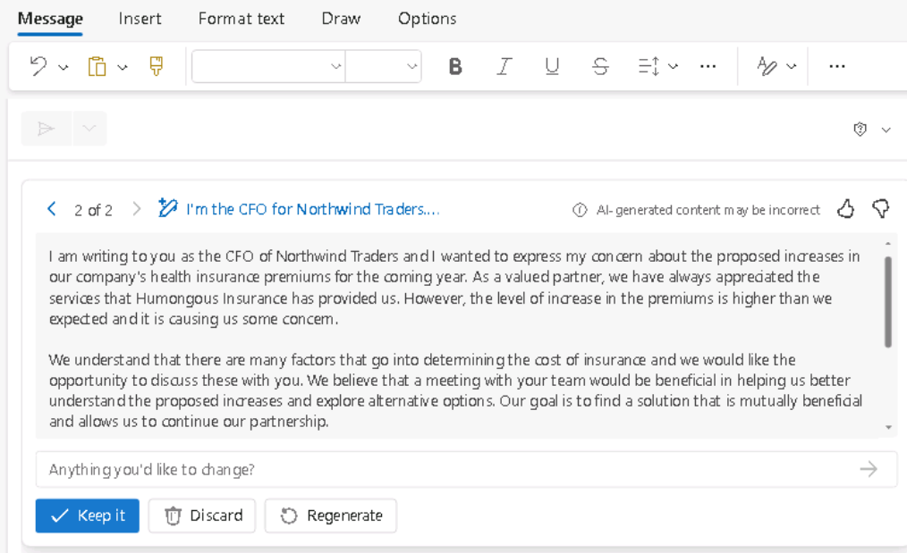

**Lab 05 : Responsabilisez votre personnel – Copilot – Finance**

**Objectif :**

En utilisant Copilot pour Microsoft 365, les professionnels de la
finance peuvent automatiser les tâches financières répétitives, obtenir
des informations sur leurs données financières, gagner du temps en
automatisant les tâches manuelles et collaborer plus efficacement

Dans cet atelier, en tant que professionnel de la finance, vous
utiliserez :

- Copilot dans Outlook pour créer un nouvel e-mail à l'intention de la
  compagnie d'assurance de l'entreprise afin de discuter des
  augmentations exorbitantes de ses primes d'assurance médicale.

- Copilotr dans Excel pour analyser une feuille de calcul contenant les
  revenus prévisionnels des campagnes marketing du 1er trimestre, puis
  ajouter de nouveaux calculs et graphiques pour visualiser les données.

- Copilot dans Word pour créer un rapport de campagne marketing basé sur
  la feuille de calcul de la campagne marketing du 1er trimestre de
  l'entreprise.

- Copilot dans Word pour résumer les résultats financiers d'une
  entreprise au cours des cinq dernières années.

**Exercice \#1 : Rédigez un e-mail à votre compagnie d'assurance à
l'aide de Copilot dans Outlook**

Avec Copilot, vous pouvez générer rapidement des brouillons d'e-mails
que Copilot adapte à vos besoins spécifiques, sans avoir à passer des
heures à les rédiger et à les modifier. Dans cet exercice, vous allez
utiliser Copilot dans Outlook pour rédiger un nouvel e-mail en fonction
d'une série d'invites fournies par l'utilisateur.

**Remarque :** Les scénarios Copilot dans Outlook ne sont disponibles
que sur la boîte aux lettres principale d'un utilisateur. Elles ne sont
pas disponibles sur la boîte aux lettres d'archivage d'un utilisateur,
les boîtes aux lettres de groupe ou les boîtes aux lettres partagées et
déléguées auxquelles l'utilisateur a accès.

- Microsoft prend uniquement en charge Copilot dans Outlook sur les
  boîtes aux lettres hébergées sur Exchange Online.

- Copilot dans Outlook n'est pris en charge que dans les comptes
  professionnels ou scolaires Microsoft 365 et les comptes Microsoft
  avec des domaines de messagerie spécifiques.

- Il est pris en charge à la fois par Copilot pour Microsoft 365 avec
  votre compte Microsoft Entra ID et par Copilot Pro avec votre compte
  MSA.

En tant que directeur financier de Northwind Traders, vous souhaitez
utiliser Copilot dans Outlook pour rédiger un e-mail à l'intention de la
compagnie d'assurance maladie de l'entreprise, Humongous Insurance.
Votre agent d'assurance vous a récemment informé que les primes
d'assurance maladie de Northwind augmenteraient dans tous les domaines -
plus de 9 % pour les polices individuelles et plus de 15 % pour les
polices familiales. Ce taux d'augmentation est considérablement plus
élevé que les moyennes de l'industrie.

L'objectif de cet e-mail est double :

- Pour exprimer votre préoccupation quant au niveau des augmentations.

- Pour demander une rencontre avec l'équipe de la compagnie d'assurance
  afin de discuter de la question et d'explorer d'autres options.

1.  Dans **Microsoft 365**, ouvrez **Outlook**.

2.  Ouvrez un **New** e-mail.

3.  Dans l'onglet **Message** qui s'ouvre, sélectionnez **Copilot** dans
    le ruban. Dans le menu déroulant qui s'affiche, sélectionnez **Draft
    with Copilot**.

4.  Dans le corps du message, une fenêtre **Draft with Copilot**
    s'affiche. Le champ d'invite contient le message: **What do you want
    this email to say**? En bas du champ se trouve une icône
    **Generation options**. Sélectionnez cette icône pour voir les
    options que Copilot propose lors de la création d'un e-mail.

5.  Dans le menu déroulant qui apparaît, vous voyez que vous pouvez
    modifier le ton et la longueur de l'e-mail. Vous décidez de
    commencer en configurant **Tone** à **Formal** et **Length** à
    **Long**. Sélectionnez ces options maintenant.

6.  Entrez l'invite suivante dans le champ **What do you want this email
    to say**? puis sélectionnez le bouton **Generate** :

++**I'm the CFO for Northwind Traders. Draft an email to our insurance
carrier, Humongous Insurance, expressing my concern for the level of
increases in our company's health insurance premiums for the coming
year. Request a meeting with the insurance carrier’s team to discuss the
proposed increases and explore alternative options**.++

7.  Faites défiler le brouillon pour l'examiner. En haut du message,
    Copilot affiche le début de l'invite que vous venez de saisir
    (c'est-à-dire "**I'm the CFO for Northwind Traders...**").
    Sélectionnez cette section de l'invite pour voir ce qui se passe.

8.  Copilot affiche une fenêtre **Rewrite with Copilot** qui vous permet
    de modifier l'invite précédente et de régénérer un message
    entièrement nouveau. À ce stade, vous êtes satisfait du message,
    mais vous voulez voir comment il changerait si vous utilisiez un ton
    et une durée différents. Sélectionnez l’icône **Generation options**
    qui s'affiche sous l'invite. Définissez la **Tone** sur **Direct**
    et **Length** sur **Medium**, puis sélectionnez le bouton
    **Generate**.

9.  Examinez l'ébauche révisée. En haut de la fenêtre **Rewrite with
    Copilot**, notez le message "**I'm the CFO for Northwind
    Traders...**". Notez également que Copilot indique que ce brouillon
    est « **2 sur 2** », ce qui signifie que vous regardez le deuxième
    des deux brouillons Copilot. Vous pouvez sélectionner la flèche de
    retour (\<) pour revenir au brouillon Copilot précédent, qui dans ce
    cas est le premier brouillon avec un ton **formel (Formal)** et une
    longueur **longue (Long)**.

Si vous générez plusieurs brouillons Copilot, comme vous allez le faire
dans cet exercice, vous pouvez utiliser ces flèches pour passer d'un
brouillon à l'autre afin d'en trouver un qui vous plaît. Si vous trouvez
un brouillon que vous voulez, vous pouvez sélectionner l'un des boutons
disponibles pour **Keep it** ou **Regenerate** un nouveau brouillon avec
le même ton et la même longueur. Notez la salutation et la conclusion
complémentaire, le ton général du message pour ce brouillon Direct et le
changement de longueur. Bien que vous vouliez aller droit au but, vous
pensez que le ton **Direct** est beaucoup trop impersonnel, vous voulez
donc générer un nouveau brouillon avec un ton différent.

10. Sélectionnez l'invite liée en haut de la fenêtre ("**I'm the CFO for
    Northwind Traders...**") pour revenir à la fenêtre **Rewrite with
    Copilot**. Sélectionnez l'icône **des Generation options**, et cette
    fois-ci, changez **Tone** en **Casual** et la **Lenght** en
    **Long**. Sélectionnez **Generate**.

11. Examinez la nouvelle ébauche. À ce stade, vous vous rendez compte
    que vous n'aimez pas le ton **Direct** et la longueur **Medium**
    dans le brouillon numéro deux. Cependant, vous êtes sûr de préférer
    la longueur la plus longue, mais vous n'arrivez pas à décider si
    vous préférez le ton **Formal** ou **Casual**.

    - Étant donné que le brouillon **Casual** est actuellement affiché,
      vous remarquez que la salutation est un peu informelle, comme «
      Salut » ou simplement « Bonjour ».

    - Vous ne vous souvenez pas exactement de la salutation lorsque vous
      avez utilisé le ton **Formal**, mais c'était quelque chose du
      genre « Cher untel ».

    - Vous ne vous souvenez pas non plus de la formulation de la fin
      complémentaire dans le premier jet qui utilisait le ton **Formal**
      (par exemple, Cordialement/Meilleures salutations/Merci, etc.).

12. Si vous ne vous souvenez pas comment les deux messages
    apparaissaient au-delà des salutations, suivez les instructions
    précédentes pour sélectionner la flèche de retour afin de revenir au
    premier brouillon, qui avait un ton **Formal**. Si vous n'arrivez
    pas à décider quel brouillon vous préférez, utilisez les flèches
    vers l'avant et vers l'arrière pour comparer le premier brouillon
    (formel) et le troisième brouillon (occasionnel). Passez à l'étape
    suivante une fois que vous avez décidé quel brouillon vous souhaitez
    utiliser.

13. À ce stade, le brouillon de votre choix devrait apparaître dans la
    fenêtre Copilot. Au-delà des modifications du ton et de la durée que
    vous avez précédemment apportées ; Ce qui vous frappe, c'est que le
    message électronique semble un peu clairsemé. Vous remarquez qu'il
    ne fournit pas d'informations détaillées sur les augmentations de
    taux, du moins pas ventilées par plans individuels et familiaux.
    Dans le champ **Anything you'd like to change**?, entrez l'invite
    suivante, puis sélectionnez l'icône en forme de flèche à la fin du
    champ :

++**Please compare the level of premium increases being proposed for
Northwind Traders in comparison to industry-wide premium increases. Our
individual policy premiums increased over 9%, and family policies
increased over 15%. Mention how our increases far exceed the industry
averages of 6% and 10% increases, respectively**.++

14. Que s'est-il passé lorsque vous avez essayé de mettre à jour
    l'e-mail en fonction de cette dernière invite ? Il y a de fortes
    chances que vous ayez reçu un message d'erreur indiquant "**Sorry,
    something went wrong. Copilot is working on it**.". La raison pour
    laquelle vous avez reçu cette erreur est que lorsque vous soumettez
    une demande de modification à un brouillon, Copilot n'accepte
    actuellement qu'une seule modification à la fois par invite. Dans ce
    cas, vous avez demandé deux modifications - ++**compare the plan
    increases to industry averages** and **specify the specific rate
    increases**.++

Voici la règle empirique actuelle concernant les invites lors de
l'utilisation de Copilot pour Outlook :

- Lorsque vous soumettez votre invite initiale, vous pouvez inclure
  plusieurs demandes. Par exemple, vous pouvez demander à Copilot
  d'inclure des informations sur A, B et C. Dans ce cas, il générerait
  un brouillon avec les trois éléments.

- Toutefois, toute invite ultérieure de modification d'un brouillon
  APRÈS cette invite initiale ne peut inclure qu'une seule demande de
  modification par invite.

15. Compte tenu de cette exigence, vous décidez de scinder votre demande
    précédente en deux parties. Cette fois, entrez l'invite suivante,
    qui est la première partie :

++**Please mention that our individual policy premiums increased by over
9%, and family policies increased over 15**%.++

16. Examinez l'ébauche mise à jour. Entrez maintenant l'invite suivante
    concernant les moyennes de l'industrie, qui est la deuxième partie :

++**Please mention that average industry premium increases are 6% for
individual policies and 10% for family policies**.++

17. Ce brouillon a l'air mieux. Cependant, vous décidez d'ajouter une
    dernière note concernant un éventuel changement vers des régimes à
    franchise élevée ou à faible prime. Entrez l'invite suivante :

++**Please mention that we should discuss converting to high-deductible,
low premium policies**.++

18. Après avoir examiné cette dernière itération, vous êtes satisfait du
    brouillon, alors sélectionnez le bouton **Keep it**.

19. Notez comment le message apparaît dans le corps de l'e-mail sans la
    fenêtre Copilot. Dans un scénario réel, vous enverriez l'e-mail tel
    quel ou apporteriez les modifications finales manuellement. Une fois
    que vous **keep** un brouillon Copilot, vous devez effectuer
    manuellement les modifications ultérieures vous-même. Vous ne pouvez
    pas revenir en mode brouillon Copilot avec ce message.

20. Étant donné que vous n'enverrez pas cet e-mail, sélectionnez l'icône
    de la corbeille (**Discard**) dans le coin supérieur droit de
    l'écran de l'e-mail, puis confirmez que vous souhaitez supprimer le
    message.

**Exercice \#2 : Analyser une feuille de calcul financière à l'aide de
Copilot dans Excel**

Pour les professionnels de la finance, Copilot dans Excel offre la
possibilité de poser des questions sur votre ensemble de données en
langage naturel plutôt que de simples formules. L'outil peut révéler des
corrélations, suggérer des scénarios de simulation et créer des
visualisations puissantes en fonction de vos requêtes.

En tant que directeur financier de Fabrikam, vous souhaitez analyser
l'efficacité des campagnes marketing de l'entreprise au 1er trimestre.
Votre directeur du marketing vous a fourni une feuille de calcul qui
identifie chacune des campagnes de marketing auxquelles l'entreprise
s'est livrée au cours du premier trimestre. La feuille de calcul fournit
des chiffres de base sur le budget et les revenus, ainsi que le nombre
d'utilisateurs ciblés et engagés.

Dans cet exercice, vous allez utiliser Copilot dans Excel pour analyser
la tendance du marché qui se trouve déjà dans une feuille de calcul
Excel **Fabrikam Q1 marketing campaigns.xlsx**. Vous examinerez de
nombreuses fonctions et invites prédéfinies de Copilot.

1.  Si un onglet Microsoft 365 est ouvert dans votre navigateur
    Microsoft Edge, sélectionnez-le maintenant ; sinon, ouvrez un nouvel
    onglet et entrez l'URL suivante :
    +++[https://www.office.com+++++](https://www.office.com+++/)

**Remarque** : Vous devez vous connecter (si vous y êtes invité) à
l'aide des **Microsoft 365 Credentials** fournies sous l'onglet
**Resources** à droite.

2.  Dans le volet de navigation **Microsoft 365**, sélectionnez
    **OneDrive** pour l'ouvrir.

3.  Accédez au dossier **C :\LabFiles** pour sélectionner et télécharger
    une copie de la feuille de calcul **de Fabrikam Q1 marketing
    campaigns.xlsx** sur **OneDrive**

**Astuce** : Ouvrez et fermez le fichier pour l'importer dans votre
liste de fichiers les plus récemment utilisés (MRU).

**Remarque** : Si vous avez déjà téléchargé toutes les ressources du
labo sur OneDrive, comme suggéré dans la section **Preparing for the lab
execution,** vous pouvez ignorer cette étape.

4.  Sur la page d'accueil de **Microsoft 365**, sélectionnez l'icône
    **Excel** dans le volet de navigation de gauche.

5.  Dans **Excel**, sur la page **File**, sélectionnez **Fabrikam Q1
    marketing campaigns.xlsx** dans la liste des fichiers.

6.  Sélectionnez l'option **Copilot** sur le côté droit du ruban.

7.  Dans le volet **Copilot** qui s'affiche, notez les invites
    prédéfinies qui s'affichent au-dessus du champ d'invite. Avant de
    sélectionner l'une de ces invites prédéfinies pour améliorer votre
    analyse, vous souhaitez d'abord que Copilot apporte des
    modifications spécifiques à la feuille de calcul. Pour commencer,
    vous souhaitez que Copilot identifie les types de campagnes les plus
    rentables. Pour ce faire, entrez l'invite suivante :

++**Create a pivot table to analyze the total revenue generated by each
campaign type**.++

8.  Examinez les résultats de cette invite. Copilot a affiché deux
    fenêtres de réponse. La première réponse comprenait un tableau
    croisé dynamique résumant les revenus totaux par type de campagne.
    La deuxième réponse comprenait une explication de ce qu'il avait
    fait dans la première réponse. Dans la première réponse contenant
    cette table, sélectionnez le bouton **+Add to a new sheet**. Ce
    faisant, ce tableau est ajouté à la **Sheet 2** de cette feuille de
    calcul, que Copilot a ensuite ouverte pour vous.

**Remarque** : Si le bouton **Add to new sheet** n'est pas visible, vous
devez tester avec un zoom avant/arrière pour voir le bouton (un niveau
de zoom de 115 % semble afficher les détails)

9.  En regardant **Sheet 2**, vous remarquez que Copilot n'a pas créé de
    graphique pour accompagner le tableau croisé dynamique. En regardant
    l'invite que vous avez soumise, vous vous rendez compte que vous
    venez de lui demander de créer un tableau croisé dynamique - vous
    n'avez jamais rien mentionné à propos d'un graphique. Vous souhaitez
    voir une visualisation de ces données, vous devez donc entrer une
    invite demandant à Copilot de générer un graphique pour accompagner
    le tableau croisé dynamique de la **Sheet 2**. Toutefois, notez que
    lorsque vous êtes dans **la Sheet 2**, le champ d'invite est
    désactivé.

**Remarque** : Le champ d'invite n'est activé que dans la feuille
contenant le tableau Excel. Pour cette feuille de calcul, il s'agit de
la **Sheet 1**. Au fur et à mesure que vous progressez dans cet
exercice, chaque fois que Copilot ajoute des données à une nouvelle
feuille, vous devez revenir à **la Sheet 1** pour demander d'autres
modifications.

10. Sélectionnez **Sheet 1**, puis entrez l'invite suivante :

**In Sheet 2, you created a pivot table to analyze the total revenue
generated by each campaign type. Create a chart in Sheet 2 to visualize
this data**..

11. Examinez le résultat. Si Copilot a créé un graphique montrant les
    revenus par type de campagne, passez à l'étape suivante. Cependant,
    si Copilot a affiché un message indiquant que vous ne pouvez pas lui
    demander de travailler sur une feuille autre que la feuille
    d'origine qui contient le tableau Excel, vous devez simplifier votre
    invite précédente. Dans ce cas, entrez l'invite suivante :

**Calculate the total revenue generated by each campaign type**.

**Remarque** : Même après avoir simplifié l'invite comme suit : Calculez
le revenu total généré par chaque type de campagne, si Copilot ne
parvient pas à générer le revenu total, continuez à essayer encore et
encore (dans nos tests seulement à la quatrième tentative, il a généré
le graphique croisé dynamique avec la possibilité d'insérer le chat dans
une feuille)

12. Consultez le graphique créé par Copilot et indiquant les revenus par
    type de campagne. Ce résultat correspond à ce que vous vouliez,
    alors sélectionnez le bouton **+Add to a new sheet** en bas de la
    fenêtre. Ce faisant, ce graphique est ajouté à **la Sheet 3** de
    cette feuille de calcul.

13. En regardant la **Sheet 3**, vous remarquez comment Copilot a inclus
    le tableau croisé dynamique avec le graphique. Vous vous rendez
    compte que **la Sheet 2** a le même tableau croisé dynamique, tandis
    que **la Sheet 3** a le tableau et le graphique. Puisque vous voulez
    que **la Sheet 3** contienne à la fois le tableau et le graphique,
    vous décidez de supprimer **la Sheet 2** pour éviter toute confusion
    future. Pour supprimer **la Sheet 2**, cliquez dessus avec le bouton
    droit de la souris, sélectionnez **Delete** dans le menu qui
    s'affiche, puis sélectionnez **OK** pour confirmer la suppression.
    Cela vous laisse avec les feuilles 1 et 3.

14. Puisque vous souhaitez apporter d'autres modifications, sélectionnez
    **Sheet 1** pour revenir à votre feuille avec le tableau croisé
    dynamique.

15. Vous devez maintenant identifier les campagnes qui ont été les plus
    efficaces. Pour ce faire, vous souhaitez que Copilot calcule le
    retour sur investissement (ROI) de chaque campagne. Pour calculer le
    retour sur investissement, entrez l'invite suivante :

++**Calculate the ROI for each campaign**.++

16. Examinez les résultats de cette invite. Copilot vous montre le
    calcul et vous pouvez sélectionner l'option **Explain formula** pour
    une explication du calcul du retour sur investissement.

17. Vous souhaitez que Copilot ajoute le retour sur investissement à
    votre feuille de calcul, alors sélectionnez le bouton **+Insert
    column** qui apparaît en bas de la fenêtre.

18. Notez les résultats. Copilot a ajouté une nouvelle colonne contenant
    le retour sur investissement de chaque campagne individuelle. Bien
    que ce ne soit pas grave, vous voulez qu'il détermine le retour sur
    investissement de chaque type de campagne. Vous vous êtes rendu
    compte de votre erreur en examinant votre invite précédente. Vous
    avez demandé à Copilot de calculer le retour sur investissement de
    chaque campagne, alors qu'en fait, vous vouliez calculer le retour
    sur investissement de chaque type de campagne. Entrez l'invite
    suivante pour calculer le retour sur investissement de chaque type
    de campagne :

++**That change looks good. However, I would like you to also calculate
the ROI for each campaign type**.++

19. Examinez les résultats. Copilot a créé un graphique montrant le
    retour sur investissement par type de campagne. Sélectionnez
    l'option en bas de la fenêtre **+Add to a new sheet**. Ce faisant,
    ce tableau est ajouté à une nouvelle **Sheet 2** de cette feuille de
    calcul. En plus du graphique à barres groupées qu'il a créé (passez
    votre curseur sur le graphique pour voir le type de graphique), il a
    également créé un tableau croisé dynamique contenant le retour sur
    investissement par type de campagne. Une fois que vous avez terminé
    d'examiner ces données, sélectionnez **Sheet 1**.

20. Vous souhaitez maintenant que Copilot détermine quelles campagnes
    ont été les plus efficaces pour attirer les utilisateurs. Vous
    pensez que la meilleure façon de visualiser ces données est de
    demander à Copilot de créer un graphique qui montre la relation
    entre le nombre total d'utilisateurs ciblés et le nombre total
    d'utilisateurs engagés. Pour ce faire, entrez l'invite suivante :

++**Create a chart that shows which campaign was most effective at
engaging users**.++

21. Examinez les résultats. Copilot a créé un graphique à barres
    **Engaged Users by Campaign Name**.

22. Cependant, si Copilot se contentait de résumer le nombre total
    d'utilisateurs engagés par campagne, ce n'est pas exactement ce que
    vous vouliez. Pour corriger ce résultat, entrez l'invite suivante :

++**That type of chart isn't what I was looking for. Please create a
chart that shows the relationship between total users targeted and total
users engaged**.++

23. Examinez les résultats. Lors de nos tests, Copilot a indiqué qu'il
    ne pouvait pas créer de graphique en nuage de points avec ces
    données.

24. Cependant, il a expliqué le tableau croisé dynamique qu'il a créé.
    Vous estimez que le résultat est suffisant pour l'instant, alors
    sélectionnez le bouton **+Add to a new sheet** en bas de la fenêtre
    du tableau croisé dynamique. Ce faisant, ce tableau est ajouté à la
    **Sheet 4** de cette feuille de calcul. Lorsque vous avez terminé
    d'examiner ces données, sélectionnez **Sheet 1**.

25. Vous avez un dernier élément de données que vous souhaitez que
    Copilot fournisse. Vous souhaitez que Copilot identifie les
    campagnes les plus performantes en fonction des revenus générés.
    Vous pouvez ensuite utiliser ces informations pour identifier les
    campagnes les plus rentables. Entrez l'invite suivante :

++**Identify the top-performing campaigns based on revenue
generated**.++

26. Examinez les résultats. Copilot a créé un graphique montrant les
    revenus par nom de campagne. Sélectionnez l'option en bas de la
    fenêtre **+Add to a new sheet**. Ce faisant, ce tableau est ajouté à
    la **Sheet 5** de cette feuille de calcul. En plus du graphique à
    barres groupées qu'il a créé, il a également créé un tableau croisé
    dynamique affichant le revenu total par campagne. Lorsque vous avez
    terminé d'examiner ces données, sélectionnez **Sheet 1**.

27. Cela complète les données que vous souhaitez que Copilot analyse
    pour vous. Cependant, vous êtes curieux de savoir quelles autres
    suggestions Copilot pourrait avoir pour analyser plus en détail les
    données de votre campagne. Dans la liste des invites prédéfinies qui
    s'affiche au-dessus du champ d'invite, recherchez une suggestion
    intitulée **Show suggestions for formula columns.** Si vous voyez
    cette suggestion, sélectionnez-la maintenant. Toutefois, si vous ne
    voyez pas cette suggestion, saisissez-la manuellement dans le champ
    d'invite.

28. Consultez la suggestion de colonne. Si vous souhaitez l'ajouter à
    votre feuille de calcul, sélectionnez le bouton **+Insert column**.

Si une invite prédéfinie s'affiche et qu'elle indique **+Insert
column+Insert column**, sélectionnez-la maintenant. Cependant, si cette
invite prédéfinie n'apparaît pas, saisissez-la manuellement dans le
champ de l'invite (lors de nos tests, cette invite prédéfinie
apparaissait parfois avant l'insertion de la colonne, mais disparaissait
ensuite après l'insertion de la colonne).

29. Répétez l'étape précédente plusieurs fois pour que Copilot suggère
    différents calculs. Insérez ceux que vous aimez et sautez ceux que
    vous n'aimez pas.

30. Vous souhaitez maintenant que Copilot vous montre d'autres
    graphiques qui visualisent différents types de données. Dans la
    liste des invites prédéfinies, sélectionnez le bouton **Show data
    insights**.

31. Examinez les résultats. Si ce graphique vous intéresse, sélectionnez
    le bouton **Show data insights**, puis revenez à **la Sheet 1**.

32. Sélectionnez ensuite le bouton **Can I see another insight**? Encore
    une fois, si ce graphique vous intéresse, sélectionnez le bouton
    **+Add to a new sheet**, puis revenez à **la Sheet 1**.

33. Après avoir vu ces deux premiers graphiques, vous vous rendez compte
    que vous aimez les différents graphiques fournis par Copilot. Au
    lieu de parcourir plusieurs graphiques un par un, vous souhaitez que
    Copilot ajoute à votre feuille de calcul toutes les informations
    qu'il peut créer sur la base de vos données. Dans les invites
    prédéfinies, sélectionnez l’invite **Add all insights to grid**.

34. Examinez les résultats. Copilot a créé plusieurs graphiques dans la
    feuille finale, ainsi que plusieurs tableaux croisés dynamiques.

35. Vous déterminez que votre analyse est complète compte tenu de toutes
    les données fournies par Copilot dans Excel. Étant donné qu'Excel a
    automatiquement enregistré votre fichier, fermez l'onglet de votre
    navigateur Microsoft Edge.

**Exercice \#3 : Créer un rapport d'analyse financière à l'aide de
Copilot dans Word**

Si vous êtes un analyste financier et que vous devez rédiger un rapport
sur les performances d'une entreprise, vous pouvez utiliser Copilot dans
Word pour rédiger le rapport et poser des questions Copilot Chat pour
rechercher, imaginer ou itérer pour trouver du contenu à ajouter.

Dans cet exercice, vous allez demander à Copilot dans Word d'écrire un
nouveau rapport basé sur les données de la feuille de calcul Fabrikam Q1
Marketing Campaign que vous avez analysées et mises à jour dans
l'exercice précédent. Toutefois, au lieu d'utiliser la feuille de calcul
Excel, vous utiliserez un document Word qui contient toutes les données
de la feuille de calcul.

**Remarque** : Copilot dans Word peut créer un rapport basé sur une
feuille de calcul. Toutefois, vous ne pouvez pas référencer directement
un fichier Excel à partir de Word. Au lieu de cela, vous devez copier et
coller les données du fichier Excel dans un document Word.

En tant que directeur financier de Fabrikam, vous avez utilisé Copilot
dans Excel pour analyser l'efficacité des campagnes marketing du 1er
trimestre de l'entreprise lors de l'exercice précédent. Dans cet
exercice, vous allez utiliser Copilot dans Word pour générer un rapport
qui résume l'analyse de ces données. La feuille de calcul a été copiée
et collée pour vous dans un document Word **Fabrikam Q1 campagne
marketing data.docx**, que vous téléchargerez dans un premier temps.

1.  Si un onglet Microsoft 365 est ouvert dans votre navigateur
    Microsoft Edge, sélectionnez-le maintenant ; sinon, ouvrez un nouvel
    onglet et entrez l'URL suivante :
    [**https://www.office.com**](https://www.office.com/) d'accéder à la
    page d'accueil de Microsoft 365.

**Remarque** : Vous devez vous connecter (si vous y êtes invité) à
l'aide des **Microsoft 365 Credentials** fournies sous l'onglet
**Resources** à droite.

2.  Dans le volet de navigation **Microsoft 365**, sélectionnez
    **OneDrive** pour l'ouvrir.

3.  Accédez au dossier **C :\LabFiles** pour sélectionner et télécharger
    une copie de **Fabrikam Q1 marketing campaign data.docx** document
    sur **OneDrive**. **Astuce** : Ouvrez et fermez le fichier pour
    l'importer dans votre liste de fichiers les plus récemment utilisés
    (MRU).

**Remarque** : Si vous avez déjà téléchargé toutes les ressources de
labo sur OneDrive, comme suggéré dans la section **Preparing for the lab
execution**, vous pouvez ignorer cette étape.

4.  Dans **Microsoft 365**, ouvrez **Microsoft Word**, puis ouvrez un
    document vierge.

5.  Dans la fenêtre **Draft with Copilot** qui s'affiche en haut du
    document vierge, entrez l'invite suivante, mais ne sélectionnez pas
    le bouton **Generate** tant que vous n'avez pas lié le fichier à
    l'invite à l'étape suivante :

++**I'm the Director of Finance for Fabrikam. Please create a Q1
Marketing Campaign Analysis report based on the attached file, which
provides data on our Q1 marketing campaigns. Include the following
sections in the report: Executive Summary, Data Analysis, and
Recommendations**.++

6.  Vous devez maintenant joindre à l'invite le fichier **Fabrikam Q1
    marketing campaign data.docx** que vous avez téléchargé. Dans la
    fenêtre **Draft with Copilot**, sélectionnez le bouton **Reference
    your content**.

7.  Dans le menu déroulant qui s'affiche, si le fichier **Fabrikam Q1
    marketing campaigns data.docx** apparaît dans la liste des fichiers,
    sélectionnez-le. Sinon, sélectionnez **Browse files from cloud.**

8.  Sélectionnez le fichier dans la liste Fichiers **Recent**, puis
    sélectionnez le bouton **Attach**. Si le fichier n'apparaît pas dans
    la liste **Recent file**, sélectionnez **My files** en haut du volet
    de navigation dans la fenêtre **Pick file**, accédez au dossier dans
    lequel vous avez stocké le fichier, sélectionnez le fichier, puis
    sélectionnez **Attach**. Notez comment le fichier s'affiche dans
    l'invite.

9.  Sélectionnez **Generate**. Ce faisant, Copilot extrait les
    informations pertinentes du fichier et rédige un rapport qui analyse
    les données.

10. Examinez les résultats. Si les données de la section **Executive
    Summary** sont présentées dans une liste à puces, entrez l'invite
    suivante et remplacez **{table or bulleted list}** par **table**.

11. Si les données du **Executive Summary** ne sont pas au format de
    liste à puces, entrez l'invite suivante et remplacez **{table or
    bulleted list}** par **bulleted list** :

++Veuillez convertir les informations de la section Résumé dans un
format {tableau ou liste à puces}.++

12. Si les données du **Executive Summary** sont sous forme de liste à
    puces, mais que vous les souhaitez sous forme de tableau, entrez
    l'invite suivante et remplacez **{table or bulleted list}** par
    **table.**

++**Please convert the information in the Executive Summary section into
a {table or bulleted list} format**.++

13. Si la section **Data Analysis** est déjà sous forme de tableau,
    passez à l'étape suivante.

**Remarque** : Il s'agit d'une liste à puces. Entrez l'invite suivante
pour placer les données dans une table afin qu'elle soit plus facile à
lire :

++**Please convert the information in the Data Analysis section into a
table format**.++

14. Examinez le tableau de données dans la section **Data Analysis**.

15. Voyons si Copilot peut supprimer une colonne de données d'une table.
    Entrez l'invite suivante et remplacez {heading} par le nom d'une
    colonne que vous souhaitez supprimer :

++**In the table of data in the Data Analysis section, please remove the
{heading} column**.++

16. Vous aimez les **Recommandations**, mais vous pensez qu'elles
    auraient plus de valeur si Copilot affichait les données par ordre
    d'importance. Entrez l'invite suivante pour que Copilot effectue
    cette modification :

++**In the Recommendations section, display the items in order of
importance, starting with the most important item**.++

17. Après avoir examiné cette dernière version, vous êtes satisfait du
    rapport et vous êtes prêt à l'enregistrer. Dans la fenêtre Copilot
    en bas du document, sélectionnez le bouton **Keep it** pour le
    convertir d'un brouillon Copilot en un document Word.

18. Examinez le document. Une fois que vous en êtes satisfait, vous
    pouvez soit supprimer le document, soit l'enregistrer sur votre
    OneDrive pour référence future.

19. Fermez cet onglet dans votre navigateur Microsoft Edge.

**Exercice \#4 : Résumer les résultats financiers à l'aide de Copilot
dans Word**

Dans l'exercice précédent, vous avez utilisé Copilot dans Word (sur la
base d'un fichier que vous avez joint dans l'invite pour analyser) une
table de données, puis vous avez créé un rapport résumant les
informations de ce fichier. Dans cet exercice, vous ouvrez un fichier
contenant un tableau avec cinq années de résultats financiers pour une
société, et vous demandez à Copilot dans Word (dans le volet Copilot du
fichier) de résumer les résultats financiers qui apparaissent dans le
tableau.

1.  Si vous avez un onglet Microsoft 365 ouvert dans votre navigateur
    Microsoft Edge, sélectionnez-le maintenant ; sinon, ouvrez un nouvel
    onglet et entrez l'URL suivante :
    +++[https://www.office.com+++++](https://www.office.com+++/) pour
    accéder à la page d'accueil de **Microsoft 365**.

**Remarque** : Vous devez vous connecter (si vous y êtes invité) à
l'aide des **Microsoft 365 Credentials** fournies sous l'onglet
**Resources** à droite.

2.  Dans le volet de navigation **Microsoft 365**, sélectionnez
    **OneDrive** pour l'ouvrir.

3.  Accédez au dossier **C :\LabFiles** pour sélectionner et télécharger
    une copie de **Adatum 5 Year Financial Results.docx** sur votre
    **OneDrive**.

**Astuce** : Ouvrez et fermez le fichier pour l'importer dans votre
liste de fichiers les plus récemment utilisés (MRU).

**Remarque** : Si vous avez déjà téléchargé toutes les ressources du
labo sur OneDrive, comme suggéré dans **la section Préparation de
l'exécution du labo,** vous pouvez ignorer cette étape.

4.  Dans le volet de navigation **Microsoft 365**, sélectionnez
    **Microsoft Word**. Ouvrez le fichier **Adatum 5 Year Financial
    Results.docx** que vous avez téléchargé sur votre **OneDrive**.

5.  Dans le ruban **Microsoft Word**, sélectionnez **Copilot**.

6.  Dans le volet **Copilot** qui s'affiche, plusieurs tâches
    prédéfinies apparaissent vers le haut. Si vous souhaitez que Copilot
    résume le contenu du document Résultats financiers à 5 ans d'Adatum,
    sélectionnez la vignette **Summarize this doc**.

7.  Examinez les résultats. Ce faisant, vous souhaitez que Word ajoute
    plus de détails pour prendre en charge la somme qu'il fournit pour
    chaque zone. Vous pouvez soit lui demander de le faire dans une
    invite, soit tirer parti des tâches prédéfinies que Word affiche
    au-dessus du champ d'invite. Si l'invite **Include more details in
    the summary** s'affiche, sélectionnez-la maintenant. Sinon,
    sélectionnez l'icône **Refresh** qui apparaît au-dessus du champ
    d'invite. Continuez à sélectionner l'icône **Refresh** jusqu'à ce
    que vous voyiez cette invite ou quelque chose de similaire, puis
    sélectionnez-la. Toutefois, si les invites prédéfinies sont
    recyclées et commencent à se répéter et que l'option **Include more
    details in the summary** n'apparaît pas, saisissez cette demande
    dans le champ d'invite.

8.  Une fois que Copilot a terminé de régénérer un nouveau résumé avec
    plus de détails, examinez les résultats. Comparez le résumé
    précédent à celui actuel. Remarquez comment Copilot a affiché des
    indicateurs financiers spécifiques du rapport pour étayer sa
    sommation dans chaque domaine.

9.  Essayez différentes invites prédéfinies pour voir ce que Copilot
    peut faire d'autre pour améliorer sa sommation.

10. Bien que vous soyez satisfait du résumé, vous souhaitez voir une
    déclaration définitive sur les performances de l'entreprise au cours
    des cinq dernières années. Entrez l'invite suivante et sélectionnez
    l'icône **Send** :

++**Based on the information in this document, how would you rate
Adatum's financial performance over the past five years? Is it getting
better or worse**?++

11. Examinez les résultats. Vous voulez maintenant voir s'il y a des
    zones peu performantes qui nécessitent une attention particulière.
    Entrez l'invite suivante et sélectionnez l' icône **Send**:

++**Is there any area that's performing poorly that should be
addressed**?++

12. Examinez les résultats. Vous avez utilisé Copilot pour analyser les
    résultats financiers de l'entreprise au cours des cinq dernières
    années. Vous avez également identifié les domaines de votre
    opération sur lesquels vous devez vous concentrer pour améliorer la
    rentabilité de l'entreprise.

13. Vous souhaitez conserver cette somme dans le document actuel ouvert
    dans Word. Dans le volet Copilot, faites défiler jusqu'à la fenêtre
    affichant la somme complète qui contient les mesures détaillées. En
    bas de la fenêtre, sélectionnez le bouton **Copy**. Placez votre
    curseur sous le tableau dans le document et collez-le dans le
    contenu du presse-papiers (**Ctrl+V**).

14. Répétez l'étape précédente pour la fenêtre qui indique si
    l'entreprise se porte mieux ou moins bien, et la fenêtre qui montre
    le domaine qui doit être amélioré. Vous avez maintenant saisi toutes
    les informations contenues dans le document pour référence future.

15. Fermez l'onglet de votre navigateur Microsoft Edge contenant ce
    document Word.

**Résumé :**

Dans cet atelier, vous allez :

- Rédaction d'un e-mail professionnel à l'intention du fournisseur à
  l'aide de Copilot dans Outlook.

- Analyse des données marketing et création de graphiques pour
  visualiser les données à l'aide de Copilot dans Excel

- Développement d'un rapport complet de campagne marketing à l'aide de
  Copilot dans Word

- Résumé des résultats financiers d'une entreprise afin de fournir une
  vue d'ensemble claire et concise aux parties prenantes.
