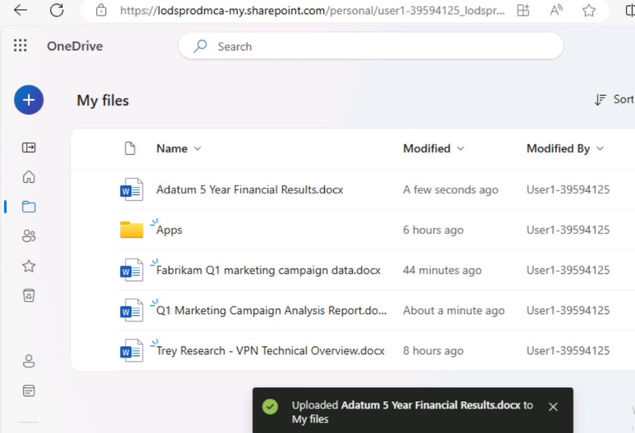

**實驗 05：增強您的員工能力 – Copilot – 財務**

**目的：**

通過使用適用於 Microsoft 365 的
Copilot，財務專業人員可以自動執行重複的財務任務，深入瞭解他們的財務數據，通過自動執行手動任務來節省時間並更有效地協作

在本實驗中，作為財務專業人員，您將使用：

- Copilot 在 Outlook
  中創建一封發送給公司保險公司的新電子郵件，以討論其醫療保險費的過高上漲。

- Excel 中的
  Copilot，用於分析包含第一季度營銷活動預計收入的電子表格，然後添加新的計算和圖表以可視化數據。

- Word 中的 Copilot，用於根據公司的第 1
  季度營銷活動電子表格創建營銷活動報告。

- Word 中的 Copilot，用於總結公司過去五年的財務業績。

**練習 \#1：使用 Outlook 中的 Copilot 起草發送給保險公司的電子郵件**

使用 Copilot，您可以快速生成 Copilot
根據您的特定需求量身定制的電子郵件草稿，而無需花費數小時編寫和編輯它們。在本練習中，您將使用
Outlook 中的 Copilot 根據用戶提供的一系列提示起草新電子郵件。

**注意：**Outlook 中的 Copilot
方案僅在用戶的主郵箱上可用。它們在用戶的存檔郵箱、組郵箱或用戶有權訪問的共享郵箱和代理郵箱上不可用。

- Microsoft 僅支持 Outlook 中 Exchange Online 上託管的郵箱的 Copilot。

- Outlook 中的 Copilot 僅在 Microsoft 365
  工作或學校帳戶以及具有特定電子郵件域的 Microsoft 帳戶中受支持。

- 它通過帶有您的 Microsoft Entra ID 帳戶的 Microsoft 365 的 Copilot
  和帶有您的 MSA 帳戶的 Copilot Pro 來支持。

作為 Northwind Traders 的首席財務官，您希望在 Outlook 中使用 Copilot
起草一封發送給該公司的健康保險公司 Humongous Insurance
的電子郵件。您的保險代理人最近通知您，Northwind 的健康保險費將全面上漲 -
個人保單將超過 9%，家庭保單超過 15%。這一增長率遠高於行業平均水平。

這封電子郵件的目的有兩個：

- 表達您對漲價水平的擔憂。

- 要求與保險公司的團隊會面，討論此事並探索替代選擇。

1.  在 **Microsoft 365** 中，打開 **Outlook**。

2.  打開 **New** email （新建電子郵件）。

3.  在打開的 **Message** 選項卡上，選擇 功能區中的
    **Copilot**。在顯示的下拉菜單中，選擇 **Draft with Copilot**。

4.  在消息正文中，將顯示 **Draft with Copilot**
    窗口。提示字段包含消息：**What do you want this email to say?**
    字段底部是 **Generation options** 圖標。選擇此圖標可查看 Copilot
    在創建電子郵件時提供的選項。

5.  在出現的下拉菜單中，您可以看到您可以更改電子郵件的 Tone 和
    Length。您決定首先將 **Tone** 設置為 **Formal** 並將 **Length**
    設置為 **Long**。立即選擇這些選項。

6.  在 **What do you want this email to say？**
    （您希望此電子郵件說什麼？字段，然後選擇 **Generate** 按鈕：

++**I'm the CFO for Northwind Traders. Draft an email to our insurance
carrier, Humongous Insurance, expressing my concern for the level of
increases in our company's health insurance premiums for the coming
year. Request a meeting with the insurance carrier’s team to discuss the
proposed increases and explore alternative options**.++

7.  滾動瀏覽草稿以進行審核。在消息的頂部，Copilot
    會顯示您剛剛輸入的提示的開頭（即 “**I'm the CFO for Northwind
    Traders...**” ）。選擇提示的此部分以查看會發生什麼情況.

8.  Copilot 將顯示一個 **Rewrite with Copilot**
    窗口，通過該窗口，您可以編輯之前的提示並重新生成全新的消息。此時，您對消息感到滿意，但您想瞭解在使用不同的語氣和長度時它會如何變化。選擇提示下方顯示的
    **Generation options** 圖標。將 **音調** 更改為 **直接** 和 **長度**
    到 **中等**，然後選擇 **Generate** 按鈕。

9.  查看修訂後的草稿。在 **Rewrite with Copilot** 窗口的頂部，請注意
    “**I'm the CFO for Northwind Traders...**” 鏈接。另請注意 Copilot
    如何指示此草稿是 “**2 of 2**” ，這意味著您正在查看兩個 Copilot
    草稿中的第二個。您可以選擇後退箭頭 （\<） 返回上一個 Copilot
    草稿，在本例中，該草稿是具有 **Formal** （正式） 音調和 **Long**
    length （長長度） 的第一個草稿。

如果您生成多個 Copilot
草稿，就像您將在本練習中所做的那樣，您可以使用這些箭頭在草稿之間來回切換，以找到您喜歡的草稿。如果找到所需的草稿，可以選擇其中一個可用按鈕以
**Keep it** （保留它） 或 **Regenerate** a new draft
（重新生成具有相同色調和長度的新草稿）。請注意稱呼和補充結束語、此
Direct draft 消息的整體語氣以及
Length（長度）的變化。雖然你想直截了當，但你覺得 **Direct**
語氣太沒有人情味了，所以你想生成一個具有不同語氣的新草稿。

10. 選擇窗口頂部的鏈接提示（ “**I'm the CFO for Northwind Traders...**”
    ）以返回到 “**Rewrite with Copilot**” 窗口。選擇 **Generation
    options** 圖標，這次將 **Tone** 更改為 **Casual** 和 **Length** 回到
    **Long**。選擇 **Generate** （生成）。

11. 查看新草稿。此時，您意識到您不喜歡第二稿中的 **Direct** 音調和
    **Medium**
    長度。但是，您確定您更喜歡較長的長度，但您無法決定您更喜歡
    **Formal** 還是 **Casual** 音調。

    - 由於當前顯示的是 **Casual** 草稿，因此您注意到稱呼有點非正式，例如
      “Hi there” 或只是 “Hello” 。

    - 你記不清你使用 **Formal** 語氣時的確切稱呼，但它是類似於 “Dear
      某某” 的意思。

    - 您也不記得初稿中使用 **Formal**
      語氣的補充結尾的措辭（例如，Sincerely/Best regards/Thank you
      等）。

12. 如果您不記得這兩條消息在問候語之外是如何顯示的，請按照前面的說明選擇後退箭頭以返回到初稿，該草稿具有
    **Formal**
    語氣。如果您無法決定更喜歡哪種草稿，請使用前進和向後箭頭比較第一稿
    （Formal） 和第三稿 （Casual）。決定要使用的草稿後，請繼續下一步。

13. 此時，您的首選草稿應顯示在 Copilot
    窗口中。除了你之前對語氣和長度所做的更改;您發現電子郵件消息似乎有點稀疏。您注意到它沒有提供有關費率上漲的任何詳細信息，至少沒有按個人和家庭計劃進行細分。在
    **Anything you'd like to change?**
    字段中，輸入以下提示，然後選擇字段末尾的箭頭圖標：

++**Please compare the level of premium increases being proposed for
Northwind Traders in comparison to industry-wide premium increases. Our
individual policy premiums increased over 9%, and family policies
increased over 15%. Mention how our increases far exceed the industry
averages of 6% and 10% increases, respectively**.++

14. 當您嘗試根據此最新提示更新電子郵件時，剛剛發生了什麼情況？您可能會收到一條錯誤消息，指示
    “**Sorry, something went wrong. Copilot is working on
    it**。”您收到此錯誤的原因是，當您向草稿提交更改請求時，Copilot
    當前每個提示一次只接受一項更改。在本例中，您要求進行兩項更改 -
    ++**將計劃增加與行業平均水平進行比較，**並**指定具體的費率增加。**++

以下是在 Copilot for Outlook 中工作時涉及提示的當前經驗法則：

- 提交初始提示時，您可以包含多個請求。例如，您可以指示 Copilot 包含有關
  A、B 和 C 的信息。在這種情況下，它將生成包含所有三個項目的草稿。

- 但是，在該初始提示 AFTER
  之後修改草稿的任何後續提示只能包含每個提示的一個更改請求。

15. 鑒於此要求，您決定將之前的請求分為兩部分。這一次，輸入以下提示，這是第一部分：

++**Please mention that our individual policy premiums increased by over
9%, and family policies increased over 15**%.++

16. 查看更新的草稿。現在輸入以下關於行業平均值的提示，這是第二部分：

++**Please mention that average industry premium increases are 6% for
individual policies and 10% for family policies**.++

17. 這個草稿看起來更好。但是，您決定添加關於高免賠額/低保費計劃可能更改的最後一點說明。輸入以下提示：

++**Please mention that we should discuss converting to high-deductible,
low premium policies**.++

18. 查看此最新迭代後，您對草稿感到滿意，因此請選擇 **Keep it** （保留）
    按鈕。

19. 請注意該消息在沒有 Copilot
    窗口的電子郵件正文中的顯示方式。在實際場景中，您可以按原樣發送電子郵件，或者手動進行任何最終更改。**保留**
    Copilot
    草稿後，您必須自己手動進行任何進一步的更改。您無法使用該消息返回
    Copilot 草稿模式。

20. 由於您不會發送此電子郵件，請選擇電子郵件屏幕右上角的垃圾桶
    （**Discard**） 圖標，然後確認您要丟棄該郵件。

**練習 #2：在 Excel 中使用 Copilot 分析財務電子表格**

對於財務專業人士，Excel 中的 Copilot
能夠以自然語言而不僅僅是公式詢問有關數據集的問題。該工具可以揭示相關性，建議假設場景，並根據您的查詢創建強大的可視化效果。

作為 Fabrikam 的財務總監，您希望分析公司第 1
季度營銷活動的效果如何。您的營銷總監為您提供了一份電子表格，其中列出了公司在第一季度開展的每項營銷活動。該電子表格提供基本的預算和收入數據，以及目標用戶和參與用戶的數量。

在本練習中，您將使用 Excel 中的 Copilot 來分析 Excel 電子表格 **Fabrikam
Q1 marketing campaigns.xlsx** 中已有的市場趨勢。您將檢查 Copilot
的許多預構建函數和提示。

1.  如果您在 Microsoft Edge 瀏覽器中打開了 Microsoft 365
    選項卡，請立即選擇它;否則，請打開一個新選項卡並輸入以下 URL：
    +++[https://www.office.com+++](https://www.office.com+++/)

**注意：**您需要使用右側 “**Resources**” 選項卡下提供的 **Microsoft 365
憑據**登錄（如果出現提示）。

2.  在 **Microsoft 365** 導航窗格中，選擇 **OneDrive** 將其打開。

3.  瀏覽到 **C：\LabFiles** 文件夾，選擇 **Fabrikam Q1 marketing
    campaigns.xlsx** 電子表格的副本並將其上傳到 **OneDrive**

**提示：** 打開並關閉文件以將其放入 Most Recently Used （MRU）
文件列表中。

**注意：**如果您已按照**準備實驗室執行**部分中的建議將所有實驗室資產上傳到
OneDrive，則可以跳過此步驟。

4.  在 **Microsoft 365** 主頁上，選擇左側導航窗格中的 **Excel** 圖標。

5.  在 **Excel** 中，在 **File** 頁面上，從文件列表中選擇 **Fabrikam Q1
    marketing campaigns**。

6.  選擇功能區右側的 **Copilot** 選項。

7.  在顯示的 **Copilot**
    窗格中，請注意提示字段上方顯示的預定義提示。在選擇這些預定義提示中的任何一個來改進分析之前，您首先希望
    Copilot 對電子表格進行一些特定更改。首先，您希望 Copilot
    確定哪些活動類型最有利可圖。為此，請輸入以下提示：

++**Create a pivot table to analyze the total revenue generated by each
campaign type**.++

8.  查看此提示的結果。Copilot
    顯示兩個響應窗口。第一個響應包括一個數據透視表，該表按促銷活動類型匯總了總收入。第二個響應包括對它在第一個響應中的作用的解釋。在包含此表的第一個響應中，選擇
    **+Add to a new sheet** 按鈕。這樣做會將此表添加到此電子**表格的第
    2** 頁中，然後 Copilot 會為您打開該表。

**備註：**如果 **Add to new sheet**
按鈕不可見，則需要通過放大/縮小測試才能看到該按鈕（縮放比例為 115%
似乎會顯示詳細信息）

9.  在查看**表 2** 時，您注意到 Copilot
    沒有創建圖表來與數據透視表一起。在查看您提交的提示時，您意識到您只是要求它創建一個數據透視表 -
    您從未提及有關圖表的任何內容。您希望看到此數據的可視化效果，因此您需要輸入一個提示，要求
    Copilot 生成一個圖表，以配合工作**表 2**
    中的數據透視表。但是，請注意，當您在工作**表 2**
    中時，提示字段處於禁用狀態。

**注意：**提示字段僅在具有 Excel 表格的工作表中啟用。對於此電子表格，即
**Sheet 1。**當您繼續完成此練習時，每次 Copilot
將數據添加到新工作表時，您都必須返回到工作**表 1** 以請求更多更改。

10. 選擇 **Sheet 1**，然後輸入以下提示：

**In Sheet 2, you created a pivot table to analyze the total revenue
generated by each campaign type. Create a chart in Sheet 2 to visualize
this data**.

11. 查看結果。如果 Copilot
    創建了一個圖表，按活動類型顯示收入，請繼續執行下一步。但是，如果
    Copilot 顯示一條消息，指示您不能要求它在具有 Excel
    表的原始工作表以外的工作表上工作，則必須簡化之前的提示。在這種情況下，請輸入以下提示符：

**Calculate the total revenue generated by each campaign type**.

**注意：**即使像下面這樣簡化了提示 計算每種活動類型產生的總收入，如果
Copilot
未能產生總收入，請繼續一次又一次地嘗試（在我們的測試中，僅在第四次嘗試時，它生成了數據透視圖以及將聊天插入工作表的選項）

12. 查看 Copilot
    創建的圖表，其中按活動類型顯示收入。此結果就是您想要的，因此請選擇窗口底部的
    **+Add to a new sheet**
    按鈕。這樣做會將此圖表添加到此電子表格的工作**表 3** 中。

13. 在查看**Sheet 3** 時，您注意到 Copilot
    如何將數據透視表與圖表一起包括在內。您意識到 **Sheet 2**
    具有相同的數據透視表，而 **Sheet 3**
    具有表格和圖表。由於您希望工作**Sheet 3**
    同時包含表格和圖表，因此您決定刪除工作**Sheet 2**
    以避免將來出現任何混淆。要刪除工作**Sheet
    2**，請右鍵單擊它，從出現的菜單中選擇 **Delete**，然後選擇 **OK**
    確認刪除。這樣做會留下 Sheets 1 和 3。

14. 由於您要進行更多更改，請選擇 **Sheet 1**
    以返回到帶有數據透視表的工作表。

15. 您現在想要確定哪些推廣活動最有效。為此，您希望 Copilot
    計算每個廣告系列的投資回報率 （ROI）。要計算 ROI，請輸入以下提示：

++**Calculate the ROI for each campaign**.++

16. 查看此提示的結果。Copilot 向您顯示計算，您可以選擇 **Explain
    formula**（解釋公式）選項來解釋 ROI 計算。

17. 您希望 Copilot 將 ROI 添加到您的電子表格中，因此請選擇窗口底部顯示的
    **+Insert column** 按鈕。

18. 請注意結果。Copilot 添加了一個新列，其中包含每個活動的
    ROI。雖然這很好，但您希望它確定每種推廣活動的
    ROI。您在查看之前的提示時意識到了自己的錯誤。您要求 Copilot
    計算每個廣告系列的投資回報率，而實際上，您想計算每種廣告系列類型的投資回報率。輸入以下提示以計算每種推廣活動的
    ROI：

++**That change looks good. However, I would like you to also calculate
the ROI for each campaign type**.++

19. 查看結果。Copilot 創建了一個圖表，按活動類型顯示
    ROI。選擇窗口底部的選項 **+Add to a new
    sheet**（添加到新工作表）。這樣做會將此表添加到此電子表格的新工作
    **Sheet 2**
    中。除了創建的簇狀條形圖（將光標懸停在圖表上可查看圖表類型）之外，它還創建了一個數據透視表，其中包含按推廣活動類型劃分的
    ROI。查看完此數據後，選擇 **Sheet 1**。

20. 您現在希望 Copilot
    確定哪些活動在吸引用戶方面最有效。您認為可視化此數據的最佳方法是讓
    Copilot
    創建一個圖表，以顯示目標用戶總數與參與用戶總數之間的關係。為此，請輸入以下提示：

++**Create a chart that shows which campaign was most effective at
engaging users**.++

21. 查看結果。Copilot 創建了一個按市場**Campaign Name**
    **劃分的參與用戶**條形圖。

22. 但是，如果 Copilot
    只是按活動匯總了參與用戶總數，那並不完全是您想要的。要更正此結果，請輸入以下提示：

++**That type of chart isn't what I was looking for. Please create a
chart that shows the relationship between total users targeted and total
users engaged**.++

23. 查看結果。在我們的測試中，Copilot 表示它無法使用這些數據創建散點圖。

24. 但是，它確實解釋了它創建的數據透視表。您覺得結果現在已經足夠好了，因此請選擇數據透視表窗口底部的
    **+Add to a new sheet** 按鈕。這樣做會將此表添加到此電子表格的
    **Sheet 4** 頁中。查看完此數據後，選擇 **Sheet 1**。

25. 您有希望 Copilot 提供的最後一條數據。您希望 Copilot
    根據產生的收入確定效果最好的活動。然後，您可以使用此信息來確定哪些促銷活動最有利可圖。輸入以下提示：

++**Identify the top-performing campaigns based on revenue
generated**.++

26. 查看結果。Copilot 創建了一個圖表，按活動名稱顯示
    Revenue。選擇窗口底部的選項 **+Add to a new
    sheet**（添加到新工作表）。這樣做會將此表添加到此電子表格的**Sheet
    5**
    頁中。除了創建的簇狀條形圖之外，它還創建了一個數據透視表，按促銷活動顯示總收入。查看完此數據後，選擇
    **Sheet 1**。

27. 這樣就完成了您希望 Copilot 為您分析的數據。但是，您很好奇 Copilot
    可能還有哪些其他建議來進一步分析您的活動數據。在提示字段上方顯示的預定義提示列表中，查找標題為
    **Show suggestions for formula columns** （顯示公式列的建議）
    的建議。如果您看到此建議，請立即選擇它。但是，如果您沒有看到此建議，請在提示字段中手動輸入。

28. 查看列建議。如果要將其添加到電子表格中，請選擇 **+Insert column**
    按鈕。

如果出現預定義的提示，顯示 **Give me another
suggest**（給我另一個建議），然後立即選擇它。但是，如果此預定義提示未出現，則在提示字段中手動輸入它（在我們的測試中，此預定義提示有時在插入列之前出現，但在插入列後消失）。

29. 重複上一步幾次，讓 Copilot
    建議不同的計算。插入你喜歡的那些，跳過你不喜歡的那些。

30. 您現在希望 Copilot
    向您展示更多可視化各種類型數據的圖表。在預定義提示列表中，選擇
    **Show data insights** （顯示數據見解） 按鈕。

31. 查看結果。如果您對此圖表感興趣，請選擇 **+Add to a new sheet**
    按鈕，然後返回到 **Sheet 1**。

32. 然後選擇 **Can I see another
    insight？**按鈕。同樣，如果您對此圖表感興趣，請選擇 **+Add to a new
    sheet** 按鈕，然後返回到 **Sheet 1**。

33. 看到前兩個圖表後，您意識到您喜歡 Copilot 提供的各種圖表。您希望
    Copilot
    將它可以根據您的數據創建的所有見解添加到您的電子表格中，而不是一一查看更多圖表。在預定義的提示中，選擇
    **Add all insights to grid** 提示。

34. 查看結果。Copilot 在最終工作表中創建了多個圖表，以及幾個數據透視表。

35. 根據 Excel 中的 Copilot 提供的所有數據，您確定您的分析已完成。由於
    Excel 會自動保存您的文件，因此請關閉 Microsoft Edge 瀏覽器選項卡。

**練習 \#3：在 Word 中使用 Copilot 創建財務分析報告**

如果您是金融分析師並且需要撰寫有關公司業績的報告，您可以在 Word 中使用
Copilot 起草報告並詢問 Copilot Chat
問題以研究、構思或迭代可能添加的內容。

在本練習中，您將指示 Word 中的 Copilot 根據您在上一個練習中分析和更新的
Fabrikam Q1
營銷活動電子表格中的數據編寫新報表。但是，您將使用包含所有電子表格數據的
Word 文檔，而不是 Excel 電子表格。

**備註：**Word 中的 Copilot 可以根據電子表格創建報告。但是，您不能直接從
Word 中引用 Excel 文件。相反，您必須將 Excel 文件中的數據複製並粘貼到
Word 文檔中。

作為 Fabrikam 的財務總監，您在 Excel 中使用 Copilot
在上一個練習中分析了公司第 1 季度營銷活動的有效性。在本練習中，您將在
Word 中使用 Copilot
生成一份報告，該報告匯總了該數據的分析。電子表格已為您複製並粘貼到 Word
文檔 **Fabrikam Q1 marketing campaign data.docx**
中，您將在第一步中下載該文檔。

1.  如果您在 Microsoft Edge 瀏覽器中打開了 Microsoft 365
    選項卡，請立即選擇它; 否則，請打開一個新選項卡並輸入以下
    URL：[**https://www.office.com**](https://www.office.com/) 轉到
    Microsoft 365 主頁。

**注意：**您需要使用右側 “**Resources**” 選項卡下提供的 **Microsoft 365
憑據**登錄（如果出現提示）。

2.  在 **Microsoft 365** 導航窗格中，選擇 **OneDrive** 將其打開。

3.  瀏覽到 **C：\LabFiles** 文件夾，選擇 **Fabrikam Q1 marketing
    campaign data.docx** 文檔的副本並將其上傳到 **OneDrive**。**提示**：
    打開並關閉文件以將其放入 Most Recently Used （MRU） 文件列表中。

**注意：**如果您已按照**準備實驗室執行**部分中的建議將所有實驗室資產上傳到
OneDrive，則可以跳過此步驟。

4.  在 **Microsoft 365** 中，打開 **Microsoft
    Word**，然後打開一個空白文檔。

5.  在空白文檔頂部顯示的 **Draft with Copilot** （使用 Copilot 起草）
    窗口中，輸入以下提示，但不要選擇 **Generate** （生成）
    按鈕，直到在下一步中將文件鏈接到提示後：

++**I'm the Director of Finance for Fabrikam. Please create a Q1
Marketing Campaign Analysis report based on the attached file, which
provides data on our Q1 marketing campaigns. Include the following
sections in the report: Executive Summary, Data Analysis, and
Recommendations**.++

6.  現在，您必須將下載的 **Fabrikam Q1 marketing campaign data.docx**
    文件附加到提示中。在**使用 Copilot 起草**窗口中，選擇 **Reference
    your content** 按鈕。

7.  在顯示的下拉菜單中，如果 **Fabrikam Q1 marketing campaigns
    data.docx** 文件顯示在文件列表中，請選擇它。否則，請選擇 **Browse
    files from cloud**（從雲中瀏覽文件）。

8.  從 **Recent** file （最近打開的文件） 列表中選擇文件，然後選擇
    **Attach** （附加） 按鈕。如果文件未顯示在 **Recent file**
    （最近打開的文件） 列表中，請在 **Pick a file** （選取文件）
    窗口中選擇導航窗格頂部的 **My files**
    （我的文件），導航到存儲文件的文件夾，選擇該文件，然後選擇
    **Attach** （附加）。請注意文件在提示符中的顯示方式。

9.  選擇 **Generate** （生成）。執行此作後，Copilot
    會從文件中提取相關信息並起草一份分析數據的報告。

10. 查看結果。如果 **Executive Summary**
    部分中的數據以項目符號列表顯示，則輸入以下提示並將 {**table or
    bulleted list**} 替換為 **table**。

11. 如果 **Executive Summary**
    數據不是項目符號列表格式，則輸入以下提示並將 {**table or bulleted
    list**} 替換為**bulleted list**：

++**Please convert the information in the Executive Summary section into
a {table or bulleted list} format**.++

12. 如果 **Executive Summary**
    數據採用項目符號列表格式，但您希望採用表格格式，則輸入以下提示並將
    {**table or bulleted list**} 替換為 **table**。

++**Please convert the information in the Executive Summary section into
a {table or bulleted list} format**.++

13. 如果 **Data Analysis** （數據分析）
    部分已採用表格格式，請繼續執行下一步。

**注：**
它採用項目符號列表格式。輸入以下提示以將數據放入表中，以便於閱讀：

++**Please convert the information in the Data Analysis section into a
table format**.++

14. 檢查 **Data Analysis** 部分中的數據表。

15. 讓我們看看 Copilot 是否可以從表中刪除一列數據。輸入以下提示，並將
    {heading} 替換為要刪除的列的名稱：

++**In the table of data in the Data Analysis section, please remove the
{heading} column**.++

16. 您喜歡這些**建議**，但您認為如果 Copilot
    按重要性順序顯示數據，它們會更有價值。輸入以下提示，讓 Copilot
    進行此更改：

++**In the Recommendations section, display the items in order of
importance, starting with the most important item**.++

17. 查看此最新草稿後，您對報表感到滿意，並可以保存它。在文檔底部的
    Copilot 窗口中，選擇“**Keep it**”按鈕以將其從 Copilot 草稿轉換為
    Word 文檔。

18. 查看文檔。對它感到滿意後，您可以丟棄該文檔或將其保存到 OneDrive
    以備將來參考。

19. 在 Microsoft Edge 瀏覽器中關閉此選項卡。

**練習 \#4：在 Word 中使用 Copilot 總結財務結果**

在上一個練習中，您在 Word 中使用了
Copilot（基於您在分析提示中附加的文件）一個數據表，然後創建一個報告來匯總該文件中的信息。在本練習中，您將打開一個包含公司五年財務結果的表格的文件，並在
Word 中要求 Copilot（在文件的 Copilot 窗格中）匯總表格中顯示的財務結果。

1.  如果您在 Microsoft Edge 瀏覽器中打開了 Microsoft 365
    選項卡，請立即選擇它; 否則，請打開一個新選項卡並輸入以下
    URL：+++[https://www.office.com+++](https://www.office.com+++/) 以轉到
    **Microsoft 365** 主頁。

**注意：**您需要使用右側 “**Resources**” 選項卡下提供的 **Microsoft 365
憑據**登錄（如果出現提示）。

2.  在 **Microsoft 365** 導航窗格中，選擇 **OneDrive** 將其打開。

3.  瀏覽到 **C：\LabFiles** 文件夾，選擇 **Adatum 5 Year Financial
    Results.docx** 的副本並將其上傳到 **OneDrive**。

**提示：** 打開並關閉文件以將其放入 Most Recently Used （MRU）
文件列表中。

**注意：**如果您已按照**準備實驗室執行**部分中的建議將所有實驗室資產上傳到
OneDrive，則可以跳過此步驟。

4.  在 **Microsoft 365** 導航窗格中，選擇 **Microsoft
    Word**。打開您上傳到 **OneDrive** 的 **Adatum 5 Year Financial
    Results.docx** 文件。

5.  在 **Microsoft Word** 功能區上，選擇 **Copilot**。

6.  在出現的 **Copilot** 窗格中，幾個預定義的任務顯示在頂部。您希望
    Copilot 總結 Adatum 5 年財務結果文檔的內容，因此請選擇 “**Summarize
    this doc**” 磁貼。

7.  查看結果。在此過程中，您希望看到 Word
    添加更多詳細信息，以支持它為每個區域提供的求和。您可以請求在提示中執行此作，也可以利用
    Word 在提示字段上方顯示的預定義任務。如果出現 **Include more details
    in the summary** （在摘要中包含更多詳細信息）
    提示，請立即選擇它。否則，請選擇提示字段上方顯示的 **Refresh**
    圖標。繼續選擇 **Refresh** （刷新）
    圖標，直到您看到此提示或類似內容，然後選擇它。但是，如果預定義的提示循環播放並開始重複，並且未顯示
    **Include more details in the summary
    prompt**（在摘要提示中包含更多詳細信息）未顯示，則在提示字段中輸入此請求。

8.  Copilot
    重新生成包含更多詳細信息的新摘要後，請查看結果。將上一個摘要與當前摘要進行比較。請注意
    Copilot 如何顯示報告中的特定財務指標以支持其在每個領域的匯總。

9.  嘗試不同的預定義提示，看看 Copilot 還可以做些什麼來改進其求和。

10. 雖然您對摘要感到滿意，但您希望看到有關公司過去五年表現如何的明確聲明。輸入以下提示，然後選擇
    **Send** 圖標：

++**Based on the information in this document, how would you rate
Adatum's financial performance over the past five years? Is it getting
better or worse**?++

11. 查看結果。您現在想要查看是否有任何性能不佳的區域需要注意。輸入以下提示，然後選擇
    **Send** 圖標：

++**Is there any area that's performing poorly that should be
addressed**?++

12. 查看結果。您使用 Copilot
    分析了公司前五年的財務業績。您還確定了必須關注的運營領域，以提高公司的盈利能力。

13. 您希望將此匯總保留在 Word 中打開的當前文檔中。在 Copilot
    窗格中，向上滾動到顯示包含詳細指標的完整匯總的窗口。在窗口底部，選擇
    **Copy** 按鈕。將光標放在文檔中的表格下方，然後粘貼到剪貼板的內容中
    （**Ctrl+V**）。

14. 對指示公司表現是更好還是更差的窗口，以及顯示需要改進的領域的窗口重複上一步。現在，您已經捕獲了文檔中的所有信息以供將來參考。

15. 關閉 Microsoft Edge 瀏覽器中包含此 Word 文檔的選項卡。

**總結：**

在本實驗中，您將：

- 使用 Outlook 中的 Copilot 起草了一份發送給供應商的專業電子郵件。

- 在 Excel 中使用 Copilot 分析營銷數據並創建圖表以可視化數據

- 使用 Word 中的 Copilot 開發全面的營銷活動報告

- 總結公司的財務結果，為利益相關者提供清晰簡潔的概述。
