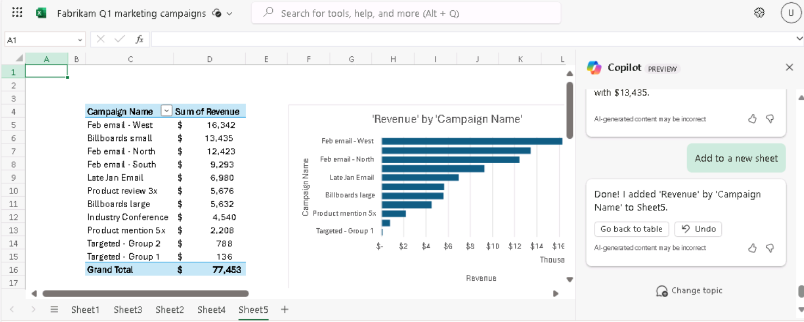
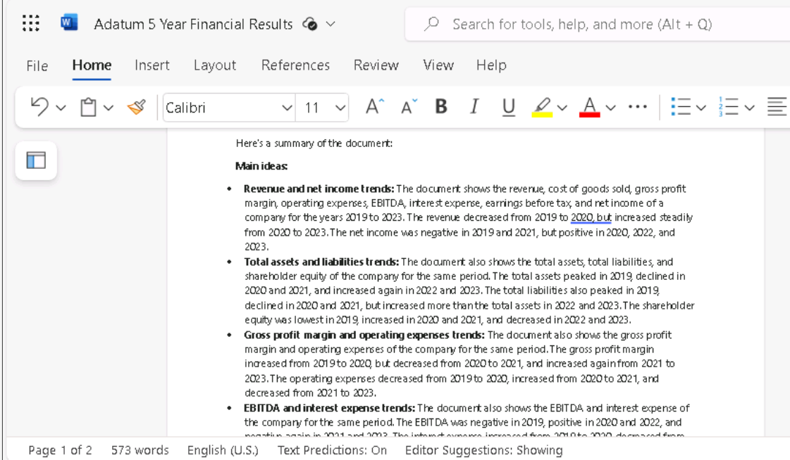

**Lab 05: Stärken Sie Ihre Mitarbeiter – Copilot – Finanzen**

**Ziel:**

Durch den Einsatz von Copilot für Microsoft 365 können Finanzfachleute
sich wiederholende Finanzaufgaben automatisieren, Einblicke in ihre
Finanzdaten gewinnen, Zeit sparen, indem sie manuelle Aufgaben
automatisieren und effektiver zusammenarbeiten

In diesem Lab verwenden Sie als Finanzexperte:

- Copilot in Outlook, um eine neue E-Mail an den Versicherungsträger des
  Unternehmens zu erstellen, um die exorbitanten Erhöhungen der
  Krankenversicherungsprämien zu besprechen.

- Copilot in Excel, um eine Tabelle mit dem prognostizierten Umsatz für
  Marketingkampagnen im 1. Quartal zu analysieren und dann neue
  Berechnungen und Diagramme hinzuzufügen, um die Daten zu
  visualisieren.

- Copilot in Word, um einen Marketingkampagnenbericht basierend auf der
  Q1-Marketingkampagnentabelle des Unternehmens zu erstellen.

- Copilot in Word, um die Finanzergebnisse eines Unternehmens der
  letzten fünf Jahre zusammenzufassen.

**Übung \#1: Verfassen Sie eine E-Mail an Ihre Versicherungsgesellschaft
mit Copilot in Outlook**

Mit Copilot können Sie schnell E-Mail-Entwürfe erstellen, die Copilot
auf Ihre spezifischen Bedürfnisse zuschneidet, ohne stundenlang
schreiben und bearbeiten zu müssen. In dieser Übung verwenden Sie
Copilot in Outlook, um eine neue E-Mail zu entwerfen, die auf einer
Reihe von Eingabeaufforderungen basiert, die vom Benutzer bereitgestellt
werden.

**Hinweis**: Copilot-Szenarien in Outlook sind nur für das primäre
Postfach eines Benutzers verfügbar. Sie sind nicht für das
Archivpostfach, Gruppenpostfächer oder freigegebene Postfächer und
Stellvertretungspostfächer eines Benutzers verfügbar, auf die der
Benutzer Zugriff hat.

- Microsoft unterstützt Copilot in Outlook nur für Postfächer, die auf
  Exchange Online gehostet werden.

- Copilot in Outlook wird nur in Microsoft 365 Geschäfts-, Schul- oder
  Unikonten und Microsoft-Konten mit bestimmten E-Mail-Domänen
  unterstützt.

- Es wird sowohl über Copilot für Microsoft 365 mit Ihrem Microsoft
  Entra ID-Konto als auch über Copilot Pro mit Ihrem MSA-Konto
  unterstützt.

Als CFO von Northwind Traders möchten Sie Copilot in Outlook verwenden,
um eine E-Mail an die Krankenkasse des Unternehmens, Humongous
Insurance, zu verfassen. Sie wurden kürzlich von Ihrem
Versicherungsvertreter darüber informiert, dass die
Krankenversicherungsprämien von Northwind auf breiter Front steigen
würden - mehr als 9 % für Einzelpolicen und mehr als 15 % für
Familienpolicen. Diese Steigerungsrate liegt deutlich über dem
Branchendurchschnitt.

Diese E-Mail dient zwei Zwecken:

- Um Ihre Besorgnis über die Höhe der Erhöhungen zum Ausdruck zu
  bringen.

- Fordern Sie ein Treffen mit dem Team des Versicherungsträgers an, um
  die Angelegenheit zu besprechen und alternative Optionen zu erkunden.

1.  Öffnen Sie in **Microsoft 365 Outlook**.

2.  Öffnen Sie eine **New** E-Mail.

3.  Wählen Sie auf der sich öffnenden Registerkarte **Message** im
    Menüband **Copilot** aus. Wählen Sie im angezeigten Dropdown-Menü
    die Option **Draft with Copilot** aus.

4.  Im Hauptteil der Meldung wird das Fenster **Draft with
    Copilot** angezeigt. Das Eingabeaufforderungsfeld enthält die
    Meldung: **What do you want this email to say**? Am unteren Rand des
    Feldes befindet sich ein Symbol für die **Generation Options.**
    Wählen Sie dieses Symbol aus, um die Optionen anzuzeigen, die
    Copilot beim Erstellen einer E-Mail bereitstellt.

5.  Im angezeigten Dropdown-Menü sehen Sie, dass Sie den Ton und die
    Länge der E-Mail ändern können. Sie entscheiden sich, zunächst
    **Tone** auf **Formal** und die **Length** auf **Long** zu setzen.
    Wählen Sie jetzt diese Optionen aus.

6.  Geben Sie die folgende Eingabeaufforderung in das Feld **What do you
    want this email to say**? ein und wählen Sie dann die Schaltfläche
    **Generate** aus:

++**I'm the CFO for Northwind Traders. Draft an email to our insurance
carrier, Humongous Insurance, expressing my concern for the level of
increases in our company's health insurance premiums for the coming
year. Request a meeting with the insurance carrier’s team to discuss the
proposed increases and explore alternative options**.++

7.  Scrollen Sie durch den Entwurf, um ihn zu überprüfen. Oben in der
    Meldung zeigt Copilot den Anfang der Eingabeaufforderung an, die Sie
    gerade eingegeben haben (z. B. "**I'm the CFO for Northwind
    Traders...**"). Wählen Sie diesen Abschnitt der Eingabeaufforderung
    aus, um zu sehen, was passiert.

8.  Copilot zeigt das Fenster **Rewrite with Copilot** an, in dem Sie
    die vorherige Eingabeaufforderung bearbeiten und eine völlig neue
    Nachricht neu generieren können. Zu diesem Zeitpunkt sind Sie mit
    der Botschaft zufrieden, möchten aber sehen, wie sie sich ändern
    würde, wenn Sie einen anderen Ton und eine andere Länge verwenden.
    Wählen Sie das Symbol für die **Generation options** aus, das unter
    der Eingabeaufforderung angezeigt wird. Ändern Sie den
    **Tone** in **Direct** und die **Length** in **Medium**, und wählen
    Sie dann die Schaltfläche **Generate** aus.

9.  Überprüfen des überarbeiteten Entwurfs. Beachten Sie am oberen Rand
    des Fensters **Rewrite wit Copilot** den Link "**I'm the CFO for
    Northwind Traders...**". Beachten Sie auch, dass Copilot angibt,
    dass dieser Entwurf "**2 von 2" ist**, was bedeutet, dass Sie den
    zweiten von zwei Copilot-Entwürfen betrachten. Sie können den
    Zurück-Pfeil (\<) auswählen, um zum vorherigen Copilot-Entwurf
    zurückzukehren, der in diesem Fall der erste Entwurf mit einem
    **formellen** Ton und einer **langen** Länge ist.

Wenn Sie mehrere Copilot-Entwürfe generieren, wie Sie es in dieser Übung
tun werden, können Sie diese Pfeile verwenden, um zwischen den Entwürfen
hin und her zu wechseln, um einen zu finden, der Ihnen gefällt. Wenn Sie
einen Entwurf finden, den Sie möchten, können Sie eine der verfügbaren
Schaltflächen auswählen, um ihn entweder **keep it** oder einen neuen
Entwurf mit demselben Ton und derselben Länge zu **regenerieren**.
Beachte die Anrede und den ergänzenden Schluss, den allgemeinen Ton der
Nachricht für diesen Direct-Entwurf und die Änderung der Länge. Obwohl
Sie direkt auf den Punkt kommen wollen, haben Sie das Gefühl, dass der
**Direct** Ton viel zu unpersönlich ist, sodass Sie einen neuen Entwurf
mit einem anderen Ton erstellen möchten.

10. Wählen Sie die verknüpfte Eingabeaufforderung oben im Fenster aus
    ("**I'm the CFO for Northwind Traders...**"), um zum Fenster
    **Rewrite with Copilot** zurückzukehren. Wählen Sie das Symbol für
    die **Generation Option** aus, und ändern Sie diesmal den **Ton** in
    **Casual** und die **Lenght** wieder in **Long**. Wählen Sie
    **Generate** aus.

11. Überprüfen Sie den neuen Entwurf. An diesem Punkt stellen Sie fest,
    dass Ihnen der **Direct** Ton und die **Medium** Länge in Entwurf
    Nummer zwei nicht gefallen. Du bist dir aber sicher, dass du die
    längere Länge bevorzugst, kannst du dich aber nicht entscheiden, ob
    du den **Formal** oder **Casual** Ton bevorzugst.

    - Da der **Casual**-Entwurf gerade angezeigt wird, stellen Sie fest,
      dass die Anrede etwas informell ist, z. B. "Hi there" oder einfach
      nur "Hello".

    <!-- -->

    - Sie können sich nicht an die genaue Anrede erinnern, wenn Sie den
      **formellen** Ton verwendeten, aber es war etwas in der Art von
      "Lieber so und so".

    - Sie können sich auch nicht an die Formulierung des ergänzenden
      Schlussworts im ersten Entwurf erinnern, in dem der **formelle**
      Ton verwendet wurde (z. B. Mit freundlichen Grüßen/Vielen Dank
      usw.).

12. Wenn Sie sich nicht erinnern können, wie die beiden Nachrichten nach
    den Anreden angezeigt wurden, befolgen Sie die vorherigen
    Anweisungen, um den Zurück-Pfeil auszuwählen, um zum ersten Entwurf
    zurückzukehren, der einen **formellen** Ton hatte. Wenn Sie sich
    nicht entscheiden können, welchen Entwurf Sie bevorzugen, verwenden
    Sie die Vorwärts- und Rückwärtspfeile, um den ersten Entwurf
    (formell) und den dritten Entwurf (Casual) zu vergleichen. Fahren
    Sie mit dem nächsten Schritt fort, sobald Sie sich entschieden
    haben, welchen Entwurf Sie verwenden möchten.

13. An dieser Stelle sollte Ihr bevorzugter Entwurf im Copilot-Fenster
    angezeigt werden. Abgesehen von den Änderungen am Ton und der Länge,
    die Sie zuvor vorgenommen haben; Es fällt Ihnen auf, dass die
    E-Mail-Nachricht etwas spärlich erscheint. Sie stellen fest, dass es
    keine detaillierten Informationen über die Tariferhöhungen gibt,
    zumindest nicht aufgeschlüsselt nach Einzel- und Familienplänen.
    Geben Sie im Feld **" Anything you'd like to change?"** die folgende
    Eingabeaufforderung ein, und wählen Sie dann das Pfeilsymbol am Ende
    des Felds aus:

++**Please compare the level of premium increases being proposed for
Northwind Traders in comparison to industry-wide premium increases. Our
individual policy premiums increased over 9%, and family policies
increased over 15%. Mention how our increases far exceed the industry
averages of 6% and 10% increases, respectively**.++

14. Was ist gerade passiert, als Sie versucht haben, die E-Mail
    basierend auf dieser letzten Eingabeaufforderung zu aktualisieren?
    Wahrscheinlich haben Sie eine Fehlermeldung erhalten, die besagt,
    dass "**Sorry, something went wrong. Copilot is working on it**."
    Der Grund, warum Sie diesen Fehler erhalten haben, ist, dass Copilot
    beim Senden einer Änderungsanforderung an einen Entwurf derzeit nur
    eine Änderung gleichzeitig pro Eingabeaufforderung akzeptiert. In
    diesem Fall haben Sie zwei Änderungen angefordert - ++**compare the
    plan increases to industry averages** and **specify the specific
    rate increases**.++

Hier ist die aktuelle Faustregel für Eingabeaufforderungen bei der
Arbeit in Copilot für Outlook:

- Wenn Sie Ihre erste Eingabeaufforderung senden, können Sie mehrere
  Anforderungen einschließen. Sie können Copilot z. B. anweisen,
  Informationen zu A, B und C einzuschließen. In diesem Fall wird ein
  Entwurf mit allen drei Elementen generiert.

<!-- -->

- Alle nachfolgenden Eingabeaufforderungen zur Änderung eines Entwurfs
  NACH dieser ersten Eingabeaufforderung können jedoch nur eine
  Änderungsanforderung pro Eingabeaufforderung enthalten.

15. Angesichts dieser Anforderung entscheiden Sie sich, Ihre vorherige
    Anfrage in zwei Teile zu unterteilen. Geben Sie dieses Mal die
    folgende Eingabeaufforderung ein, die Teil eins ist:

++**Please mention that our individual policy premiums increased by over
9%, and family policies increased over 15**%.++

16. Überprüfen Sie den aktualisierten Entwurf. Geben Sie nun die
    folgende Eingabeaufforderung zu Branchendurchschnitten ein, der Teil
    zwei ist:

++**Please mention that average industry premium increases are 6% for
individual policies and 10% for family policies**.++

17. Dieser Entwurf sieht besser aus. Sie entscheiden sich jedoch, einen
    letzten Hinweis zu einer möglichen Änderung zu Plänen mit hohem
    Selbstbehalt / niedriger Prämie hinzuzufügen. Geben Sie die folgende
    Eingabeaufforderung ein:

++**Please mention that we should discuss converting to high-deductible,
low premium policies**.++

18. Nachdem Sie diese neueste Iteration überprüft haben, sind Sie mit
    dem Entwurf zufrieden, also wählen Sie die Schaltfläche **Keep it**
    aus.

19. Beachten Sie, wie die Nachricht im Text der E-Mail ohne das
    Copilot-Fenster angezeigt wird. In einem realen Szenario würden Sie
    die E-Mail entweder so senden, wie sie ist, oder letzte Änderungen
    manuell vornehmen. Sobald Sie einen Copilot-Entwurf **beibehalten**
    haben, müssen Sie alle weiteren Änderungen manuell selbst vornehmen.
    Sie können mit dieser Nachricht nicht in den Copilot-Entwurfsmodus
    zurückkehren.

20. Da Sie diese E-Mail nicht senden werden, wählen Sie das
    Papierkorbsymbol (**Discard**) in der oberen rechten Ecke des
    E-Mail-Bildschirms aus, und bestätigen Sie dann, dass Sie die
    Nachricht verwerfen möchten.

**Übung \#2: Analysieren Sie eine Finanztabelle mit Copilot in Excel**

Für Finanzexperten bietet Copilot in Excel die Möglichkeit, Fragen zu
Ihrem Datensatz in natürlicher Sprache und nicht nur in Formeln zu
stellen. Das Tool kann Korrelationen aufdecken, Was-wäre-wenn-Szenarien
vorschlagen und leistungsstarke Visualisierungen basierend auf Ihren
Abfragen erstellen.

Als Director of Finance bei Fabrikam möchten Sie analysieren, wie
effektiv die Marketingkampagnen des Unternehmens im 1. Quartal waren.
Ihr Marketingleiter hat Ihnen eine Tabelle zur Verfügung gestellt, in
der jede der Marketingkampagnen aufgeführt ist, an denen das Unternehmen
im ersten Quartal beteiligt war. Die Tabelle enthält grundlegende
Budget- und Umsatzzahlen sowie die Anzahl der gezielten und engagierten
Benutzer.

In dieser Übung verwenden Sie Copilot in Excel, um den Markttrend zu
analysieren, der bereits in einer Excel-Tabelle **von Fabrikam Q1
Marketing campaigns.xlsx vorhanden ist**. Sie werden viele der
vorgefertigten Funktionen und Eingabeaufforderungen von Copilot
untersuchen.

1.  Wenn Sie einen Microsoft 365-Tab in Ihrem Microsoft Edge-Browser
    geöffnet haben, wählen Sie ihn jetzt aus. Andernfalls öffnen Sie
    einen neuen Tab und geben Sie die folgende URL ein:
    +++[https://www.office.com+++](https://www.office.com+++/)

**Hinweis**: Sie müssen sich (wenn Sie dazu aufgefordert werden) mit den
**Microsoft 365-Anmeldeinformationen** anmelden, die auf der
Registerkarte **Resources** auf der rechten Seite bereitgestellt werden.

2.  Wählen Sie im **Microsoft 365-**Navigationsbereich **OneDrive**
    aus**,** um es zu öffnen.

3.  Navigieren Sie zum Ordner **C:\LabFiles**, um eine Kopie der
    **Marketing-campaigns.xlsx-Tabelle** von Fabrikam Q1 auszuwählen und
    auf **OneDrive** hochzuladen.

**Tipp**: Öffnen und schließen Sie die Datei, um sie in die Liste der
zuletzt verwendeten Dateien (MRU) aufzunehmen.

**Hinweis**: Wenn Sie bereits alle Lab-Ressourcen auf OneDrive
hochgeladen haben, wie im Abschnitt **Preparing for the lab
execution** vorgeschlagen, können Sie diesen Schritt überspringen.

4.  Wählen Sie auf der **Microsoft 365-Startseite** das Excel-Symbol im
    Navigationsbereich auf der linken Seite aus.

5.  Wählen Sie in **Excel** auf der Seite **Files** die Option
    **Fabrikam Q1-Marketingkampagnen** aus der Dateiliste aus.

6.  Wählen Sie die Option **Copilot** auf der rechten Seite des
    Menübands aus.

7.  Notieren Sie sich im angezeigten **Copilot**-Bereich die
    vordefinierten Eingabeaufforderungen, die über dem
    Eingabeaufforderungsfeld angezeigt werden. Bevor Sie eine dieser
    vordefinierten Eingabeaufforderungen auswählen, um Ihre Analyse zu
    verbessern, sollten Sie zunächst einige spezifische Änderungen an
    der Tabelle vornehmen. Zunächst möchten Sie, dass Copilot ermittelt,
    welche Kampagnentypen am profitabelsten sind. Geben Sie dazu die
    folgende Eingabeaufforderung ein:

++**Create a pivot table to analyze the total revenue generated by each
campaign type**.++

8.  Überprüfen Sie die Ergebnisse dieser Eingabeaufforderung. Copilot
    zeigte zwei Antwortfenster an. Die erste Antwort enthielt eine
    Pivot-Tabelle, in der der Gesamtumsatz nach Kampagnentyp
    zusammengefasst war. Die zweite Antwort enthielt eine Erklärung
    dafür, was sie in der ersten Antwort getan hat. Wählen Sie in der
    ersten Antwort, die diese Tabelle enthält, die Schaltfläche **+Add
    to a new sheet** aus. Dadurch wird diese Tabelle zu **Sheet 2**
    dieser Tabelle hinzugefügt, die Copilot dann für Sie geöffnet hat.

**Hinweis**: Wenn die Schaltfläche **Add to new sheet** nicht sichtbar
ist, müssen Sie mit "Vergrößern/Verkleinern" testen, um die Schaltfläche
anzuzeigen (eine Zoomstufe von 115 % scheint die Details anzuzeigen)

9.  Wenn Sie sich **Sheet 2** ansehen, stellen Sie fest, dass Copilot
    kein Diagramm für die Pivot-Tabelle erstellt hat. Wenn Sie sich die
    von Ihnen eingereichte Eingabeaufforderung ansehen, stellen Sie
    fest, dass Sie sie gerade gebeten haben, eine Pivot-Tabelle zu
    erstellen - Sie haben nie etwas über ein Diagramm erwähnt. Sie
    möchten eine Visualisierung dieser Daten sehen und daher eine
    Eingabeaufforderung eingeben, in der Copilot aufgefordert wird, ein
    Diagramm zu erstellen, das mit der Pivot-Tabelle in **Sheet 2**
    übereinstimmt. Beachten Sie jedoch, dass das
    Eingabeaufforderungsfeld in **Sheet 2** deaktiviert ist.

**Hinweis**: Das Eingabeaufforderungsfeld ist nur in dem Blatt
aktiviert, das die Excel-Tabelle enthält. Für diese Tabelle ist das
**Sheet** **1**. Im weiteren Verlauf dieser Übung müssen Sie jedes Mal,
wenn Copilot Daten zu einem neuen Blatt hinzufügt, zu **Sheet 1**
zurückkehren, um weitere Änderungen anzufordern.

10. Wählen Sie **Sheet1** aus, und geben Sie dann die folgende
    Eingabeaufforderung ein:

**In Sheet 2, you created a pivot table to analyze the total revenue
generated by each campaign type. Create a chart in Sheet 2 to visualize
this data**.

11. Überprüfen Sie das Ergebnis. Wenn Copilot ein Diagramm erstellt hat,
    das den Umsatz nach Kampagnentyp anzeigt, fahren Sie mit dem
    nächsten Schritt fort. Wenn Copilot jedoch eine Meldung anzeigt, die
    darauf hinweist, dass Sie es nicht anfordern können, an einem
    anderen Blatt als dem ursprünglichen Blatt mit der Excel-Tabelle zu
    arbeiten, müssen Sie die vorherige Eingabeaufforderung vereinfachen.
    Geben Sie in diesem Fall die folgende Eingabeaufforderung ein:

**Calculate the total revenue generated by each campaign type**.

**Hinweis**: Auch nach der Vereinfachung der Eingabeaufforderung wie
folgt Berechnen Sie den von jedem Kampagnentyp generierten Gesamtumsatz,
wenn Copilot den Gesamtumsatz nicht generiert, versuchen Sie es immer
wieder (In unseren Tests wurde nur beim vierten Versuch das
Pivot-Diagramm zusammen mit der Option zum Einfügen des Chats in ein
Blatt generiert)

12. Sehen Sie sich das von Copilot erstellte Diagramm an, in dem der
    Umsatz nach Kampagnentyp angezeigt wird. Dieses Ergebnis ist das,
    was Sie wollten, also wählen Sie die Schaltfläche **+ +Add to a new
    sheet** am unteren Rand des Fensters aus. Dadurch wird dieses
    Diagramm zu **Sheet 3** dieser Tabelle hinzugefügt.

13. Wenn Sie sich **Sheet 3** ansehen, sehen Sie, wie Copilot die
    Pivot-Tabelle zusammen mit dem Diagramm eingefügt hat. Sie stellen
    fest, dass **Sheet 2** die gleiche Pivot-Tabelle hat, während
    **Sheet 3** die Tabelle und das Diagramm enthält. Da Sie **Blatt 3**
    mit der Tabelle und dem Diagramm verwenden möchten, entfernen Sie
    **Blatt 2,** um zukünftige Verwirrungen zu vermeiden. Um **Sheet 2**
    zu löschen, klicken Sie mit der rechten Maustaste darauf, wählen Sie
    im angezeigten Menü die Option **Delete** aus, und wählen Sie dann
    **OK** aus, um den Löschvorgang zu bestätigen. Auf diese Weise
    bleiben Sheet 1 und 3 übrig.

14. Da Sie weitere Änderungen vornehmen möchten, wählen Sie **Sheet 1**
    aus, um mit der Pivot-Tabelle zu Ihrem Blatt zurückzukehren.

15. Sie möchten nun ermitteln, welche Kampagnen am effektivsten waren.
    Zu diesem Zweck soll Copilot den Return on Investment (ROI) für jede
    Kampagne berechnen. Um den ROI zu berechnen, geben Sie die folgende
    Eingabeaufforderung ein:

++**Calculate the ROI for each campaign**.++

16. Überprüfen Sie die Ergebnisse dieser Eingabeaufforderung. Copilot
    zeigt Ihnen die Berechnung an, und Sie können die Option **Explain
    formula** auswählen, um eine Erläuterung der ROI-Berechnung zu
    erhalten.

17. Sie möchten, dass Copilot den ROI zu Ihrer Tabelle hinzufügt, also
    wählen Sie die **Schaltfläche +Insert column** aus, die am unteren
    Rand des Fensters angezeigt wird.

18. Notieren Sie sich die Ergebnisse. Copilot hat eine neue Spalte
    hinzugefügt, die den ROI für jede einzelne Kampagne enthält. Das ist
    zwar in Ordnung, aber Sie möchten, dass es den ROI für jeden
    Kampagnentyp bestimmt. Sie haben Ihren Fehler erkannt, als Sie Ihre
    vorherige Eingabeaufforderung überprüft haben. Sie haben Copilot
    gebeten, den ROI für jede Kampagne zu berechnen, obwohl Sie
    eigentlich den ROI für jeden Kampagnentyp berechnen wollten. Geben
    Sie die folgende Eingabeaufforderung ein, um den ROI für jeden
    Kampagnentyp zu berechnen:

++**That change looks good. However, I would like you to also calculate
the ROI for each campaign type**.++

19. Überprüfen Sie die Ergebnisse. Copilot hat ein Diagramm erstellt,
    das den ROI nach Kampagnentyp zeigt. Wählen Sie die Option am
    unteren Rand des Fensters aus, um **+ +Add to a new sheet** zu
    klicken. Dadurch wird diese Tabelle zu einem neuen **Sheet 2**
    dieser Tabelle hinzugefügt. Zusätzlich zu dem erstellten gruppierten
    Balkendiagramm (bewegen Sie den Mauszeiger über das Diagramm, um den
    Diagrammtyp anzuzeigen) wurde auch eine Pivot-Tabelle erstellt, die
    den ROI nach Kampagnentyp enthält. Nachdem Sie diese Daten überprüft
    haben, wählen Sie **Sheet 1** aus.

20. Sie möchten nun, dass Copilot ermittelt, welche Kampagnen am
    effektivsten waren, um Benutzer zu binden. Sie sind der Meinung,
    dass der beste Weg, diese Daten zu visualisieren, darin besteht,
    dass Copilot ein Diagramm erstellt, das die Beziehung zwischen der
    Gesamtzahl der Zielbenutzer und der Gesamtzahl der engagierten
    Benutzer zeigt. Geben Sie dazu die folgende Eingabeaufforderung ein:

++**Create a chart that shows which campaign was most effective at
engaging users**.++

21. Überprüfen Sie die Ergebnisse. Copilot hat ein Balkendiagramm
    **Engaged Users by Campaign Name** erstellt.

22. Wenn Copilot jedoch nur die Gesamtzahl der engagierten Nutzer pro
    Kampagne zusammenfasst, ist das nicht genau das, was Sie wollten. Um
    dieses Ergebnis zu korrigieren, geben Sie die folgende
    Eingabeaufforderung ein:

++**That type of chart isn't what I was looking for. Please create a
chart that shows the relationship between total users targeted and total
users engaged**.++

23. Überprüfen Sie die Ergebnisse. In unseren Tests gab Copilot an, dass
    es mit diesen Daten kein Punktdiagramm erstellen konnte.

24. Es wurde jedoch die Pivot-Tabelle erläutert, die es erstellt hat.
    Sie sind der Meinung, dass dieses Ergebnis vorerst gut genug ist,
    also wählen Sie die Schaltfläche **+Add to a new sheet** am unteren
    Rand des Pivot-Tabellenfensters aus. Dadurch wird diese Tabelle zu
    **Sheet 4** dieser Tabelle hinzugefügt. Wenn Sie mit der Überprüfung
    dieser Daten fertig sind, wählen Sie **Sheet 1** aus.

25. Sie haben noch ein letztes Datenelement, das Copilot bereitstellen
    soll. Sie möchten, dass Copilot die leistungsstärksten Kampagnen auf
    der Grundlage des generierten Umsatzes identifiziert. Anhand dieser
    Informationen können Sie dann ermitteln, welche Kampagnen am
    profitabelsten sind. Geben Sie die folgende Eingabeaufforderung ein:

++**Identify the top-performing campaigns based on revenue
generated**.++

26. Überprüfen Sie die Ergebnisse. Copilot hat ein Diagramm erstellt,
    das den Umsatz nach Kampagnenname anzeigt. Wählen Sie die Option am
    unteren Rand des Fensters aus, um **+Add to a new sheet** zu
    klicken. Dadurch wird diese Tabelle zu **Sheet 5** dieser Tabelle
    hinzugefügt. Zusätzlich zu dem erstellten gruppierten Balkendiagramm
    wurde auch eine Pivot-Tabelle erstellt, in der der Gesamtumsatz pro
    Kampagne angezeigt wird. Wenn Sie mit der Überprüfung dieser Daten
    fertig sind, wählen Sie **Sheet 1** aus.

27. Damit sind die Daten abgeschlossen, die Copilot für Sie analysieren
    soll. Sie sind jedoch neugierig, welche anderen Vorschläge Copilot
    zur weiteren Analyse Ihrer Kampagnendaten haben könnte. Suchen Sie
    in der Liste der vordefinierten Eingabeaufforderungen, die über dem
    Eingabeaufforderungsfeld angezeigt werden, nach einem Vorschlag mit
    dem Titel **Show suggestions for formula columns** anzeigen. Wenn
    Sie diesen Vorschlag sehen, wählen Sie ihn jetzt aus. Wenn Sie
    diesen Vorschlag jedoch nicht sehen, geben Sie ihn manuell in das
    Eingabeaufforderungsfeld ein.

28. Überprüfen Sie den Spaltenvorschlag. Wenn Sie es zu Ihrer Tabelle
    hinzufügen möchten, wählen Sie die Schaltfläche **+Insert
    column** aus.

Wenn eine vordefinierte Eingabeaufforderung mit der Aufschrift **Give me
another suggestion** angezeigt wird, wählen Sie sie jetzt aus. Wenn
diese vordefinierte Eingabeaufforderung jedoch nicht angezeigt wird,
geben Sie sie manuell in das Eingabeaufforderungsfeld ein (in unseren
Tests erschien diese vordefinierte Eingabeaufforderung manchmal vor dem
Einfügen der Spalte, verschwand dann aber nach dem Einfügen der Spalte).

29. Führen Sie den vorherigen Schritt einige Male aus, damit Copilot
    andere Berechnungen vorschlägt. Geben Sie diejenigen ein, die Ihnen
    gefallen, und überspringen Sie diejenigen, die Ihnen nicht gefallen.

30. Sie möchten nun, dass Copilot Ihnen einige weitere Diagramme zeigt,
    die verschiedene Datentypen visualisieren. Wählen Sie in der Liste
    der vordefinierten Eingabeaufforderungen die Schaltfläche **Show
    Data Insights** anzeigen aus.

31. Überprüfen Sie die Ergebnisse. Wenn dieses Diagramm für Sie von
    Interesse ist, wählen Sie die Schaltfläche **+Add to a new
    sheet** aus, und kehren Sie dann zu **Sheet 1** zurück.

32. Wählen Sie dann **Can I see another insight**? Wenn dieses Diagramm
    für Sie von Interesse ist, wählen Sie erneut die Schaltfläche **+Add
    a new sheet** aus, und kehren Sie dann zu **Sheet 1** zurück.

33. Nachdem Sie diese ersten beiden Diagramme gesehen haben, stellen Sie
    fest, dass Ihnen die verschiedenen Diagramme, die Copilot
    bereitstellt, gefallen. Anstatt mehrere Diagramme nacheinander
    durchzusehen, möchten Sie, dass Copilot Ihrer Tabelle alle
    Erkenntnisse hinzufügt, die es auf der Grundlage Ihrer Daten
    erstellen kann. Wählen Sie in den vordefinierten
    Eingabeaufforderungen die Eingabeaufforderung **Add all insights to
    grid** aus.

34. Überprüfen Sie die Ergebnisse. Copilot erstellte mehrere Diagramme
    im endgültigen Blatt sowie mehrere Pivot-Tabellen.

35. Sie stellen fest, dass Ihre Analyse anhand aller Daten, die Copilot
    in Excel bereitgestellt hat, vollständig ist. Da Excel Ihre Datei
    automatisch gespeichert hat, schließen Sie die Registerkarte Ihres
    Microsoft Edge-Browsers.

**Übung \#3: Erstellen Sie einen Finanzanalysebericht mit Copilot in
Word**

Wenn Sie ein Finanzanalyst sind und einen Bericht über die Leistung
eines Unternehmens schreiben müssen, können Sie Copilot in Word
verwenden, um den Bericht zu erstellen und Copilot Chat Fragen zu
stellen, um zu recherchieren, Ideen zu entwickeln oder mögliche Inhalte
hinzuzufügen.

In dieser Übung weisen Sie Copilot in Word an, einen neuen Bericht zu
schreiben, der auf den Daten aus der Tabelle "Fabrikam Q1 Marketing
Campaign" basiert, die Sie in der vorherigen Übung analysiert und
aktualisiert haben. Anstatt jedoch die Excel-Tabelle zu verwenden,
verwenden Sie ein Word-Dokument, das alle Tabellenkalkulationsdaten
enthält.

**Hinweis**: Copilot in Word kann einen Bericht basierend auf einer
Tabelle erstellen. Sie können jedoch nicht direkt in Word auf eine
Excel-Datei verweisen. Stattdessen müssen Sie die Daten aus der
Excel-Datei kopieren und in ein Word-Dokument einfügen.

Als Director of Finance von Fabrikam haben Sie Copilot in Excel
verwendet, um die Effektivität der Marketingkampagnen des Unternehmens
im 1. Quartal in der vorherigen Übung zu analysieren. In dieser Übung
verwenden Sie Copilot in Word, um einen Bericht zu generieren, in dem
die Analyse dieser Daten zusammengefasst wird. Die Tabelle wurde für Sie
kopiert und in ein Word-Dokument **Fabrikam Q1 Marketing Campaign
data.docx eingefügt**, dass Sie im ersten Schritt herunterladen.

1.  Wenn Sie ein Microsoft 365-Registerkarte in Ihrem Microsoft
    Edge-Browser geöffnet haben, wählen Sie sie jetzt aus. Andernfalls
    öffnen Sie eine neue Registerkarte, und geben Sie die folgende URL
    ein: [**https://www.office.com**](https://www.office.com/), um zur
    Microsoft 365-Startseite zu wechseln.

**Hinweis**: Sie müssen sich (wenn Sie dazu aufgefordert werden) mit den
**Microsoft 365-Anmeldeinformationen** anmelden, die auf der
Registerkarte **Resources** auf der rechten Seite bereitgestellt werden.

2.  Wählen Sie im **Microsoft 365-Navigationsbereich** **OneDrive**
    aus**,** um es zu öffnen.

3.  Navigieren Sie zum Ordner **C:\LabFiles**, um eine Kopie der
    **Fabrikam Q1 marketing campaign data.docx** des Dokuments
    auszuwählen und auf **OneDrive** hochzuladen. **Tipp**: Öffnen und
    schließen Sie die Datei, um sie in die Liste der zuletzt verwendeten
    Dateien (MRU) aufzunehmen.

**Hinweis**: Wenn Sie bereits alle Lab-Ressourcen auf OneDrive
hochgeladen haben, wie im **Preparing for the lab
execution** vorgeschlagen, können Sie diesen Schritt überspringen.

4.  Öffnen Sie **in** Microsoft 365 **Microsoft Word,** und öffnen Sie
    dann ein leeres Dokument.

5.  Geben Sie im Fenster **Draft with Copilot**, das am oberen Rand des
    leeren Dokuments angezeigt wird, die folgende Eingabeaufforderung
    ein, aber wählen Sie die Schaltfläche **Generate** erst aus, nachdem
    Sie die Datei im nächsten Schritt mit der Eingabeaufforderung
    verknüpft, haben:

++**I'm the Director of Finance for Fabrikam. Please create a Q1
Marketing Campaign Analysis report based on the attached file, which
provides data on our Q1 marketing campaigns. Include the following
sections in the report: Executive Summary, Data Analysis, and
Recommendations**.++

6.  Sie müssen jetzt die **Fabrikam Q1 marketing campaign data.docx**,
    die Sie heruntergeladen haben, an die Eingabeaufforderung anfügen.
    Im **Draft with Copilot** Fenster, wählen Sie die Schaltfläche
    **Reference your content** aus.

7.  Wenn im angezeigten Dropdownmenü die Datei **Fabrikam Q1 Marketing
    Campaigns data.docx** in der Liste der Dateien angezeigt wird,
    wählen Sie sie aus. Andernfalls wählen Sie **Browse files from
    cloud** aus**.**

8.  Wählen Sie die Datei aus der Liste **Recent File** aus, und klicken
    Sie dann auf die Schaltfläche **Attach**. Wenn die Datei nicht in
    der **Recent file** Liste erscheint, wählen Sie **My
    files** Navigieren Sie oben im Navigationsbereich im Fenster **Pick
    a file** zu dem Ordner, in dem Sie die Datei gespeichert haben,
    wählen Sie die Datei aus, und wählen Sie dann **Attach** aus.
    Beachten Sie, wie die Datei in der Eingabeaufforderung angezeigt
    wird.

9.  Wählen Sie **Generate**. Daraufhin extrahiert Copilot die relevanten
    Informationen aus der Datei und erstellt einen Bericht, in dem die
    Daten analysiert werden.

10. Überprüfen Sie die Ergebnisse. Wenn die Daten im Abschnitt
    **Executive Summary** in einer Aufzählung angezeigt werden, geben
    Sie die folgende Eingabeaufforderung ein, und ersetzen Sie **{{table
    or bulleted list}** durch **Table**.

11. Wenn die Daten der **Executive Summary** nicht im Format einer
    Aufzählung vorliegen, geben Sie die folgende Eingabeaufforderung
    ein, und ersetzen Sie **{table or bulleted list}** durch **eine
    Bulletlist**:

++**Please convert the information in the Executive Summary section into
a {table or bulleted list} format**.++

12. Wenn die Executive **Summary** in einem Aufzählungsformat vorliegen,
    Sie diese jedoch im Tabellenformat haben möchten, geben Sie die
    folgende Eingabeaufforderung ein, und ersetzen Sie **{table or
    bulleted list}** durch **Table.**

++**Please convert the information in the Executive Summary section into
a {table or bulleted list} format**.++

13. Wenn der Abschnitt **Data Analysis** bereits in einem Tabellenformat
    vorliegt, fahren Sie mit dem nächsten Schritt fort.

**Hinweis**: Es handelt sich um eine Aufzählung. Geben Sie die folgende
Eingabeaufforderung ein, um die Daten in einer Tabelle zu platzieren,
damit sie leichter zu lesen sind:

++**Please convert the information in the Data Analysis section into a
table format**.++

14. Untersuchen Sie die Datentabelle im Abschnitt **Data Analysis**.

15. Sehen wir uns an, ob Copilot eine Datenspalte aus einer Tabelle
    entfernen kann. Geben Sie die folgende Eingabeaufforderung ein, und
    ersetzen Sie {heading} durch den Namen einer Spalte, die Sie
    entfernen möchten:

++**In the table of data in the Data Analysis section, please remove the
{heading} column**.++

16. Ihnen gefallen die **Recommendations**, aber Sie sind der Meinung,
    dass sie wertvoller wären, wenn Copilot die Daten in der Reihenfolge
    ihrer Wichtigkeit anzeigen würde. Geben Sie die folgende
    Eingabeaufforderung ein, damit Copilot diese Änderung vornimmt:

++**In the Recommendations section, display the items in order of
importance, starting with the most important item**.++

17. Nachdem Sie diesen neuesten Entwurf überprüft haben, sind Sie mit
    dem Bericht zufrieden und können ihn speichern. Wählen Sie im
    Copilot-Fenster am unteren Rand des Dokuments die Schaltfläche
    **Keep it** aus, um es von einem Copilot-Entwurf in ein
    Word-Dokument zu konvertieren.

18. Überprüfen Sie das Dokument. Wenn Sie damit zufrieden sind, können
    Sie das Dokument entweder verwerfen oder es zum späteren
    Nachschlagen auf Ihrem OneDrive speichern.

19. Schließen Sie diese Registerkarte in Ihrem Microsoft Edge-Browser.

**Übung #4: Zusammenfassen von Finanzergebnissen mit Copilot in Word**

In der vorherigen Übung haben Sie Copilot in Word (basierend auf einer
Datei, die Sie in der Eingabeaufforderung angehängt haben, um zu
analysieren) verwendet, um eine Datentabelle zu erstellen und dann einen
Bericht zu erstellen, in dem die Informationen in dieser Datei
zusammengefasst sind. In dieser Übung öffnen Sie eine Datei, die eine
Tabelle mit den Finanzergebnissen für fünf Jahre für ein Unternehmen
enthält, und bitten Copilot in Word (im Copilot-Bereich der Datei), die
in der Tabelle angezeigten Finanzergebnisse zusammenzufassen.

1.  Wenn Sie ein Microsoft 365-Tab in Ihrem Microsoft Edge-Browser
    geöffnet haben, wählen Sie ihn jetzt aus. Andernfalls öffnen Sie
    einen neuen Tab, und geben Sie die folgende URL ein:
    +++[https://www.office.com+++](https://www.office.com+++/), um zur
    **Microsoft 365-Startseite** zu gelangen.

**Hinweis**: Sie müssen sich (wenn Sie dazu aufgefordert werden) mit den
**Microsoft 365-Anmeldeinformationen** anmelden, die auf der
Registerkarte **Resources** auf der rechten Seite bereitgestellt werden.

2.  Wählen Sie im **Microsoft 365-Navigationsbereich** **OneDrive** aus,
    um es zu öffnen.

3.  Navigieren Sie zum Ordner **C:\LabFiles**, um eine Kopie von
    **Adatum 5 Year Financial Results.docx** auszuwählen und auf Ihr
    **OneDrive** hochzuladen.

**Tipp**: Öffnen und schließen Sie die Datei, um sie in die Liste der
zuletzt verwendeten Dateien (MRU) aufzunehmen.

**Hinweis**: Wenn Sie bereits alle Lab-Ressourcen auf OneDrive
hochgeladen haben, wie im Abschnitt **Preparing for the lab
execution** vorgeschlagen, können Sie diesen Schritt überspringen.

4.  Wählen Sie im **Microsoft 365-Navigationsbereich** \> **Microsoft
    Word** aus. Öffnen Sie die **Adatum 5 Year Financial**
    **Results.docx-Datei**, die Sie auf Ihr **OneDrive** hochgeladen
    haben.

5.  Wählen Sie im **Microsoft Word-**Menüband **Copilot** aus.

6.  Im angezeigten **Copilot**-Bereich werden oben mehrere vordefinierte
    Aufgaben angezeigt. Wenn Sie möchten, dass Copilot den Inhalt des
    Dokuments "5-Jahres-Finanzergebnisse" von Adatum zusammenfasst,
    wählen Sie daher die Kachel **Summarize this doc** aus.

7.  Überprüfen Sie die Ergebnisse. Auf diese Weise möchten Sie, dass
    Word weitere Details hinzufügt, um die Summierung zu unterstützen,
    die für jeden Bereich bereitgestellt wird. Sie können dies entweder
    in einer Eingabeaufforderung anfordern, oder Sie können die
    vordefinierten Aufgaben nutzen, die Word über dem
    Eingabeaufforderungsfeld anzeigt. Wenn die Eingabeaufforderung
    **Include more details in the summary** angezeigt wird, wählen Sie
    sie jetzt aus. Wählen Sie andernfalls das Symbol **Refresh** aus,
    das über dem Eingabeaufforderungsfeld angezeigt wird. Wählen Sie so
    lange das Symbol **Refresh** aus, bis entweder diese
    Eingabeaufforderung oder etwas Ähnliches angezeigt wird, und wählen
    Sie es dann aus. Wenn die vordefinierten Eingabeaufforderungen
    jedoch wiederverwendet werden und sich wiederholen und diese
    Eingabeaufforderung **Include more details in the summary** nicht
    angezeigt wird, geben Sie diese Anforderung in das
    Eingabeaufforderungsfeld ein.

8.  Sobald Copilot die Neugenerierung einer neuen Zusammenfassung mit
    weiteren Details abgeschlossen hat, überprüfen Sie die Ergebnisse.
    Vergleichen Sie die vorherige Zusammenfassung mit der aktuellen.
    Beachten Sie, wie Copilot bestimmte Finanzkennzahlen aus dem Bericht
    anzeigte, um die Zusammenfassung in jedem Bereich zu unterstützen.

9.  Probieren Sie verschiedene vordefinierte Eingabeaufforderungen aus,
    um zu sehen, was Copilot sonst noch tun kann, um die Summierung zu
    verbessern.

10. Während Sie mit der Zusammenfassung zufrieden sind, möchten Sie eine
    endgültige Aussage darüber sehen, wie sich das Unternehmen in den
    letzten fünf Jahren entwickelt hat. Geben Sie die folgende
    Eingabeaufforderung ein und wählen Sie das Symbo**l Send** aus:

++**Based on the information in this document, how would you rate
Adatum's financial performance over the past five years? Is it getting
better or worse**?++

11. Überprüfen Sie die Ergebnisse. Sie möchten nun sehen, ob es Bereiche
    mit schlechter Leistung gibt, die Aufmerksamkeit erfordern. Geben
    Sie die folgende Eingabeaufforderung ein und wählen Sie das Symbol
    **Send** aus:

++**Is there any area that's performing poorly that should be
addressed**?++

12. Überprüfen Sie die Ergebnisse. Sie haben Copilot verwendet, um die
    Finanzergebnisse des Unternehmens in den letzten fünf Jahren zu
    analysieren. Sie haben auch die Bereiche Ihres Betriebs
    identifiziert, auf die Sie sich konzentrieren müssen, um die
    Rentabilität des Unternehmens zu verbessern.

13. Sie möchten diese Zusammenfassung im aktuellen Dokument beibehalten,
    das in Word geöffnet ist. Scrollen Sie im Copilot-Bereich nach oben
    zu dem Fenster mit der vollständigen Summe, die die detaillierten
    Metriken enthält. Wählen Sie am unteren Rand des Fensters die
    Schaltfläche **Copy** aus. Platzieren Sie den Cursor unterhalb der
    Tabelle im Dokument und fügen Sie den Inhalt der Zwischenablage ein
    (**Strg+V**).

14. Wiederholen Sie den vorherigen Schritt sowohl für das Fenster, das
    angibt, ob das Unternehmen besser oder schlechter abschneidet, als
    auch für das Fenster, das den verbesserungswürdigen Bereich anzeigt.
    Sie haben nun alle Informationen in dem Dokument zum späteren
    Nachschlagen erfasst.

15. Schließen Sie die Registerkarte in Ihrem Microsoft Edge-Browser, die
    dieses Word-Dokument enthält.

**Zusammenfassung:**

In diesem Lab führen Sie folgende Schritte aus:

- Verfasste eine professionelle E-Mail an den Anbieter mit Copilot in
  Outlook.

- Analyse von Marketingdaten und Erstellung von Diagrammen zur
  Visualisierung der Daten mit Copilot in Excel

- Entwicklung eines umfassenden Marketingkampagnenberichts mit Copilot
  in Word

- Zusammengefasste Finanzergebnisse eines Unternehmens, um den
  Stakeholdern einen klaren und prägnanten Überblick zu geben.
