**Laboratorio 06: Empodere la colaboración en equipo y la creación de
contenido con Copilot Pages**

**Objetivo:**

En este laboratorio, utilizará Microsoft Copilot dentro de **Microsoft
365 Apps** para

- Generar y editar contenido.

- Perfeccionar y mejorar el contenido generado utilizando las
  características de **Microsoft 365 Pages**.

- Compartir y colaborar en **Microsoft 365 Pages** con un equipo para
  una productividad ininterrumpida.

- Volver a acceder y gestionar páginas desde el módulo Pages
  de **Microsoft 365**.

**Escenario**: Usted forma parte del equipo de consultoría informática
de Fabrikam. Trey Research, una empresa de investigación farmacéutica de
rápido crecimiento, ha solicitado asesoramiento sobre la implementación
de una red privada virtual (VPN) para mejorar el acceso remoto seguro de
sus empleados y socios. Trey Research opera en todo el mundo, por lo que
necesita soluciones escalables que protejan los datos confidenciales de
la investigación y, al mismo tiempo, garanticen el cumplimiento de las
normativas de la industria.

Su tarea consiste en entregar un documento de descripción general
ejecutiva que resuma los requisitos de VPN de Trey Research, las
posibles soluciones y las ventajas clave de adoptar la arquitectura de
VPN recomendada por Contoso.

**Características clave a explorar durante el laboratorio:**

- **Contenido persistente**: Comprenda cómo Copilot Pages le permite
  hacer que las respuestas generadas por la IA sean más duraderas y
  editables.

- **Edición colaborativa**: Observe los cambios en tiempo real a medida
  que los miembros del equipo interactúan con el contenido, lo que
  demuestra las características multijugador.

- **Estructuración de contenido con el menú "/”**: Utilice el **menú
  "/"** para añadir distintos tipos de contenido, como encabezados,
  tablas e imágenes, que le ayudarán a estructurar el documento de forma
  efectiva.

**Nota**: Utilizará el documento **Trey Research - VPN Technical
Overview** como documento de referencia compartido por Trey Research.

**Ejercicio \#1: Crear una página de Copilot**

El documento de referencia compartido por Trey Research contiene
información clave sobre las operaciones de Trey Research, la
infraestructura informática existente y las necesidades de VPN. Como
consultor de soluciones de infraestructura, hará referencia a este
documento para redactar la propuesta.

**Tarea 1: Obtener el documento de referencia que figura en la lista de
archivos usados recientemente (MRU).**

1.  Si tiene una pestaña de Microsoft 365 abierta en su navegador
    Microsoft Edge, selecciónela ahora; de lo contrario, abra una nueva
    pestaña e ingrese la siguiente URL: +++ para ir a la página de
    inicio de Microsoft 365.

**Nota**: Debe iniciar sesión (si se le solicita) utilizando
las **credenciales de Microsoft 365** proporcionadas en la
pestaña **Resources** de la derecha.

2.  En el panel de navegación de **Microsoft 365**,
    seleccione **OneDrive** para abrirlo.

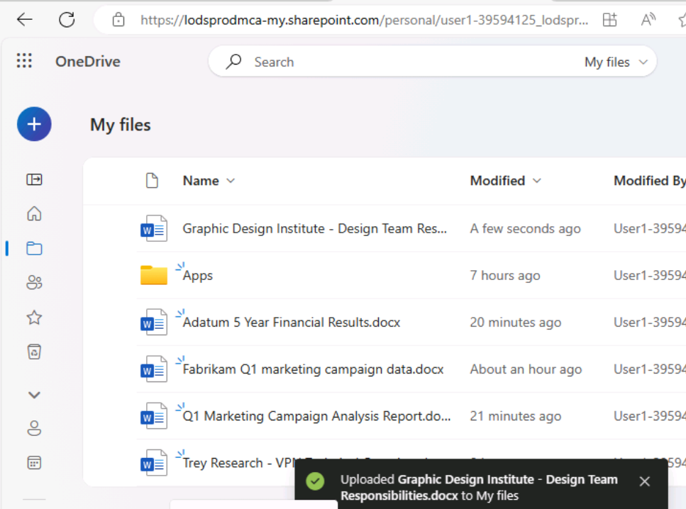

3.  Vaya a la carpeta **C:\LabFiles** para seleccionar y cargar una
    copia del documento **Trey Research - VPN Technical
    Overview** en **OneDrive**.

**Nota**: Si ya ha cargado todos los activos del laboratorio
en **OneDrive**, como se sugiere en la sección **Preparación para la
ejecución del laboratorio**, puede omitir este paso.

4.  Abra y cierre el archivo **Trey Research - VPN Technical
    Overview.docx** (que cargó en OneDrive) para que aparezca en su
    lista de archivos usados recientemente (MRU).

**Tarea 2: Acceder a Copilot e iniciar una conversación**

1.  Si tiene una pestaña de Microsoft 365 abierta en su navegador
    Microsoft Edge, selecciónela ahora; de lo contrario, abra una nueva
    pestaña e ingrese la siguiente URL:
    +++[https://www.office.com+++](https://www.office.com+++/) para ir a
    la página de inicio de **Microsoft 365**.

2.  En el panel de navegación de **Microsoft 365**,
    seleccione **Teams** para abrirlo.

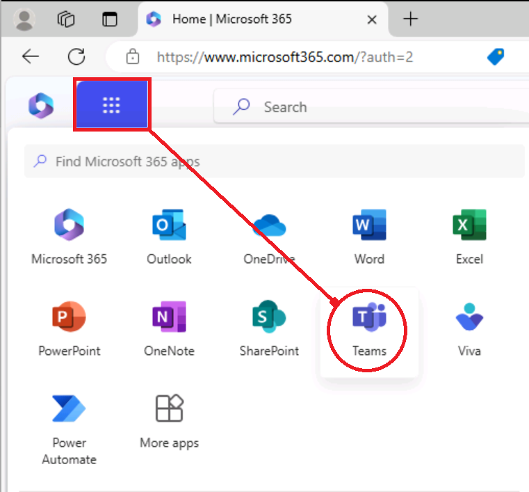

Por favor, espere mientras se completa el proceso de configuración.

3.  Seleccione \*\*Chat\*\* y abra \*\*Copilot\*\*

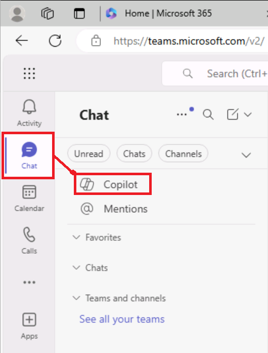

4.  Inicie un chat con **Copilot** introduciendo el siguiente prompt.

++Create a summary of the key VPN needs for Trey Research, focusing on
secure remote access and compliance with industry standards.++

Nota: En la página de **Copilot**, en el conmutador **Work/Web** situado
en la parte superior de la página, se seleccionará de forma
predeterminada **Work**.

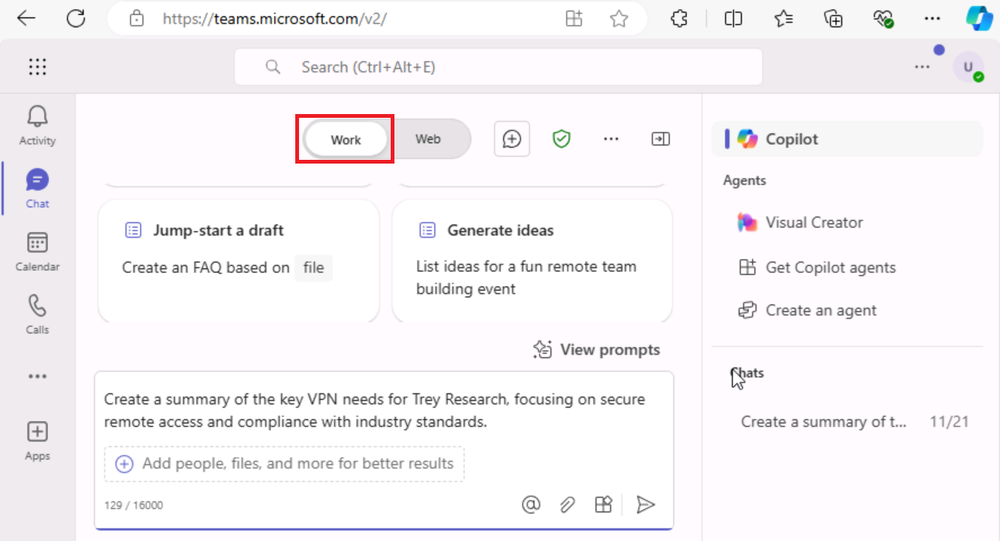

5.  Ahora adjuntará el documento de referencia compartido por Trey
    Research para comenzar a redactar el contenido del resumen
    ejecutivo. Seleccione el icono **Attach** (clip) para hacer
    referencia al documento.

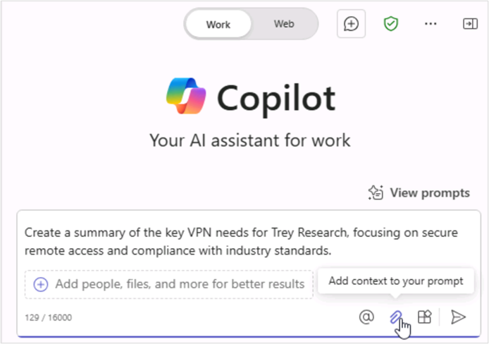

6.  Seleccione el documento **Trey Research – VPN Technical Overview.**

**Nota**: Si el archivo no aparece en la lista emergente, inténtelo de
nuevo seleccionando el icono **Attach**.

7.  Verá el documento seleccionado adjunto en el cuadro **Prompt**. Haga
    clic en el icono **Send** para que Copilot comience a generar el
    contenido.

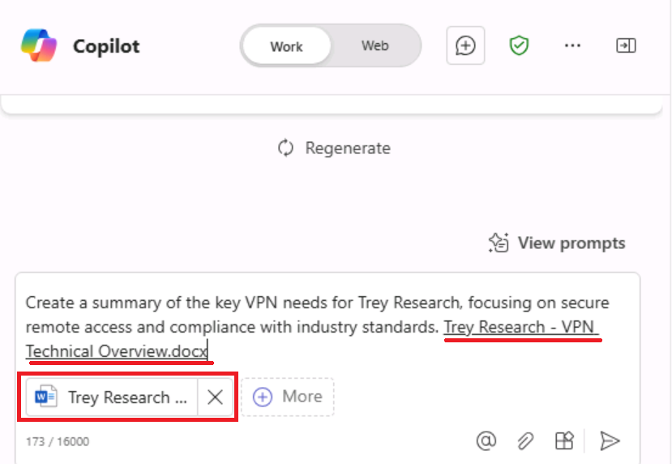

8.  Copilot analizará minuciosamente el documento de referencia y
    comenzará a generar el contenido.

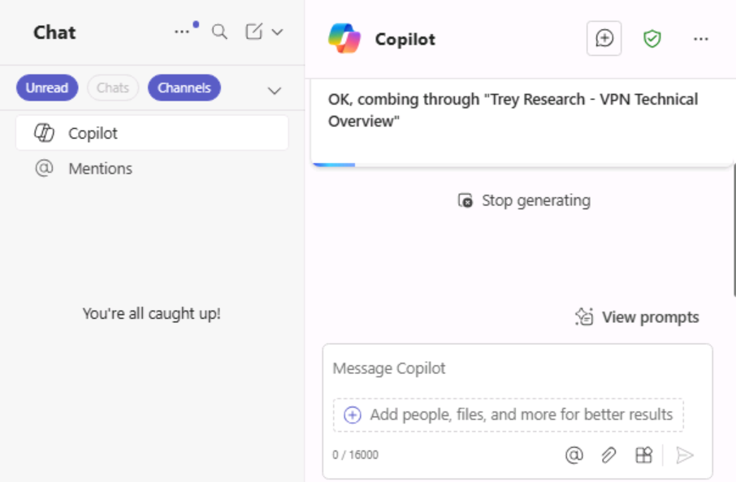

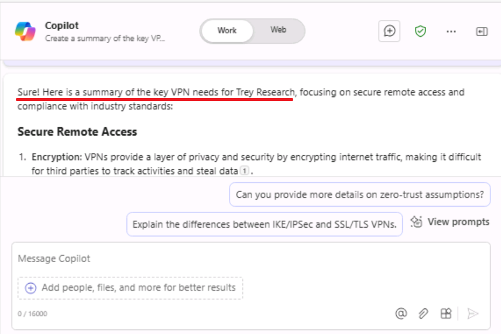

9.  Una vez que Copilot haya completado la generación del contenido
    preliminar, verá el botón **Edit in Pages** al final del contenido
    generado.

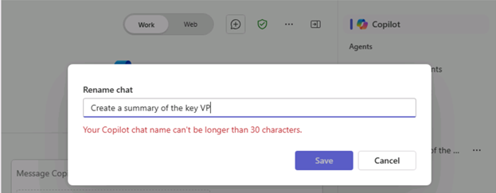

10. Se añade automáticamente una referencia a esta nueva **Copilot
    Page** en el chat para facilitar el acceso.

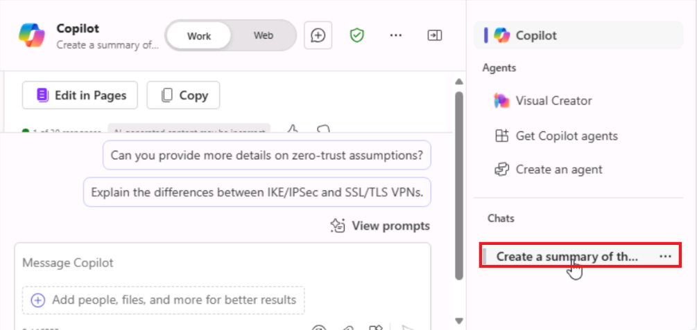

**Tarea 3: Explore las características de la página**

1.  Puede cambiar el nombre del chat según sus necesidades.

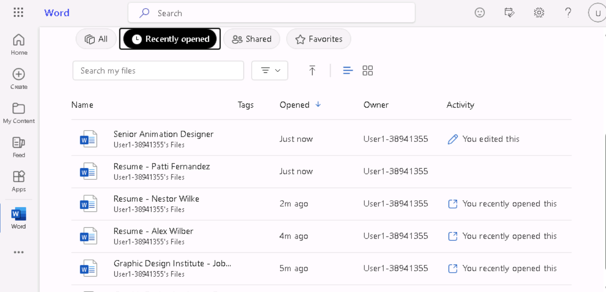

**Nota**: El nombre del chat de Copilot no puede tener más de 30
caracteres.

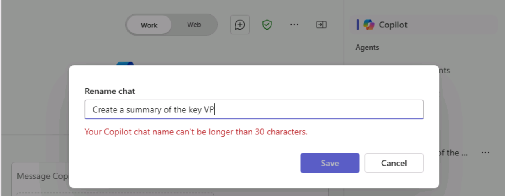

2.  Puede hacer clic en el icono **Panel** (Contraer/Expandir) para
    expandir el panel de chat de Copilot y dejar espacio para ver el
    contenido en una sección separada. Verifique que la página se abre a
    la derecha, junto al panel de chat. La respuesta se copia y formatea
    automáticamente, incluyendo cualquier vista previa de enlaces o
    bloques de código.

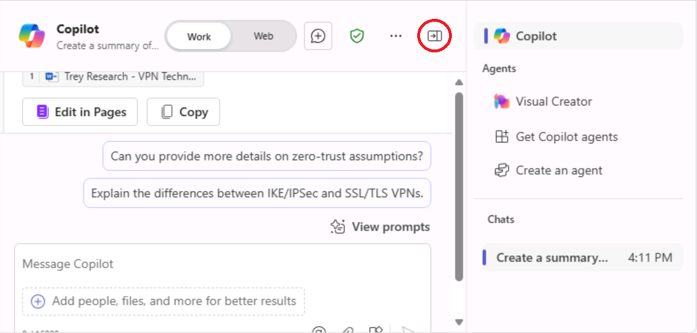

3.  Haga clic en el botón **Edit in Pages** para ver el contenido
    generado en una sección separada a la derecha.

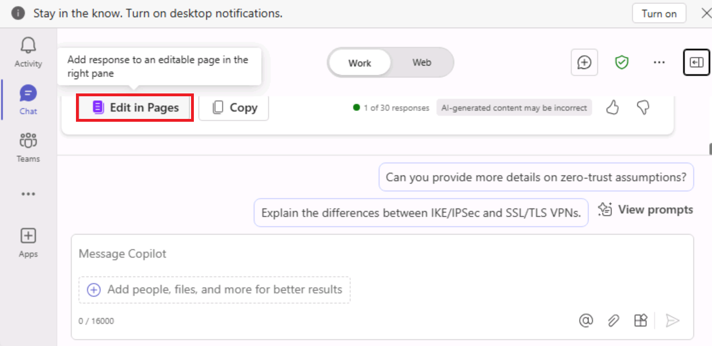

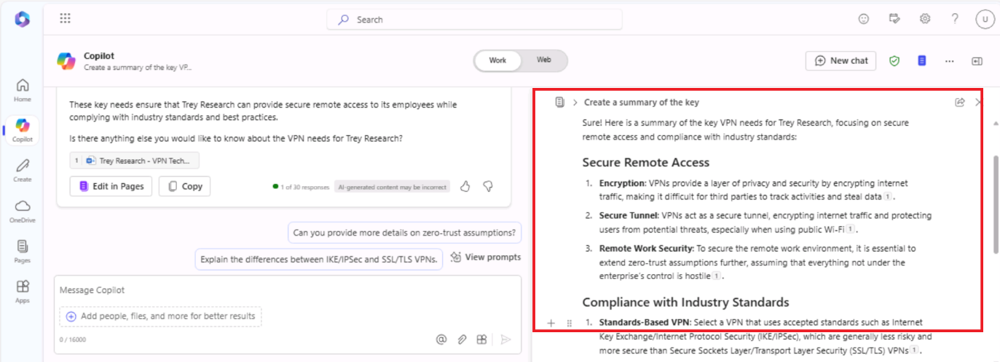

**Ejercicio \#2: Agregar y perfeccionar el contenido de la página**

En este ejercicio, seguirá interactuando con Copilot en el chat. Cuando
se generen nuevos conocimientos, haga clic en **Edit in Pages** para
añadirlos a la página actual. Estas actualizaciones se añadirán al final
de la página (que está viendo en la parte derecha del panel de chat)

**Tarea 1: Continúe la conversación en el chat**

1.  En la ventana de chat, proporcione más instrucciones para refinar el
    contenido. Ahora le pedirá a Copilot que compare tres tecnologías
    VPN centrándose en sus ventajas y desventajas en relación con las
    necesidades de Trey Research. Ingrese el siguiente prompt y haga
    clic en **Send.**

++Compare three VPN technologies based on scalability, security, and
cost-effectiveness.++

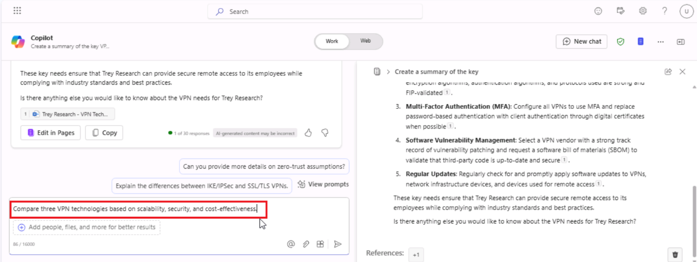

 **Nota**:
También puede probar con el siguiente prompt.

++Create a table comparing three VPN technologies (e.g., MPLS VPN, SSL
VPN, IPsec VPN) based on scalability, security features, ease of
deployment, and cost.++

2.  Copilot generará nuevas perspectivas con los detalles de la
    comparación. 
    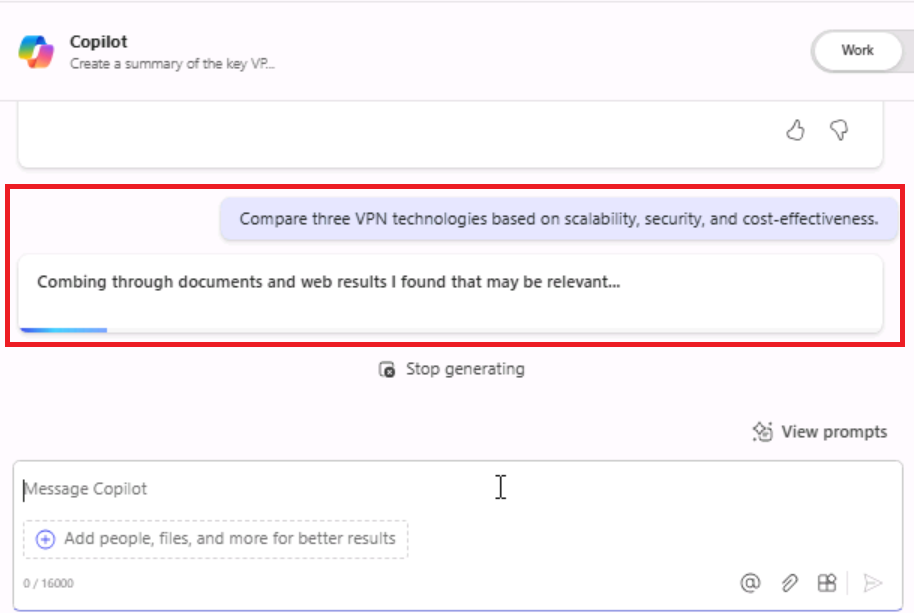

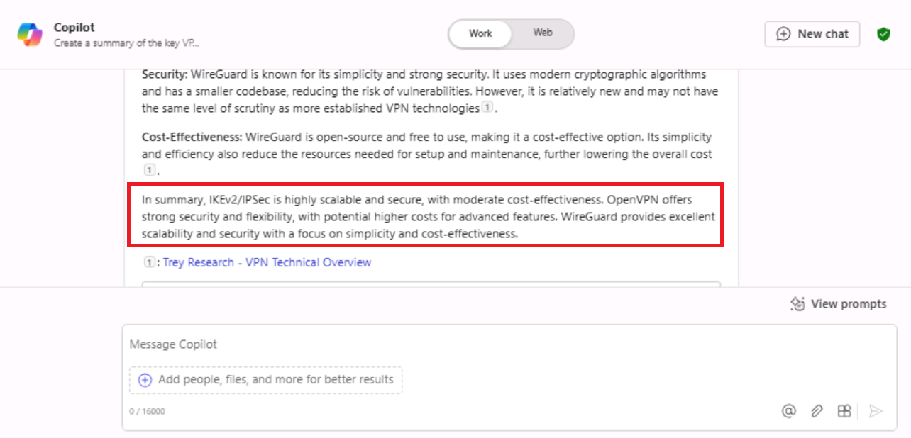

3.  Haga clic en **Edit in Pages** para añadir los detalles de esta
    comparación a la página
    existente. 
    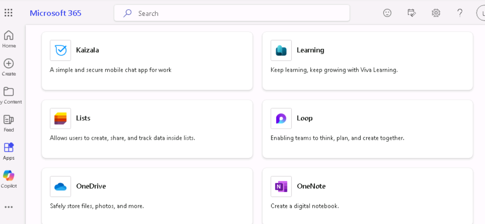

**Tarea 2: Editar directamente en la página**

1.  Haga clic en cualquier lugar de la página para comenzar a escribir y
    refinar el contenido. Escriba **“/”** para abrir un menú de opciones
    de contenido, como encabezados, viñetas, tablas o imágenes, y lograr
    así un diseño más estructurado y atractivo.

> 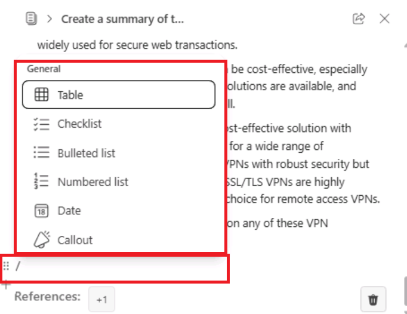

2.  Pase el cursor por encima de un bloque de contenido y seleccione el
    menú Kebab (tres puntos verticales alineados en paralelo, que se
    asemejan a un pincho) para ver las opciones Copy page link, Move
    block, y
    Delete. 
    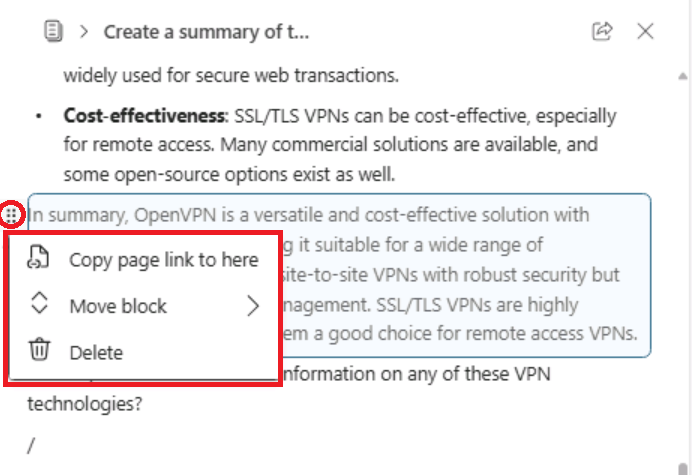

**Tarea 3: Colaborar con los miembros de Teams**

1.  Cuando su página esté lista para que el equipo pueda aportar sus
    comentarios, haga clic en el **icono Share** situado en la esquina
    superior derecha y seleccione **‘Copy component’**.

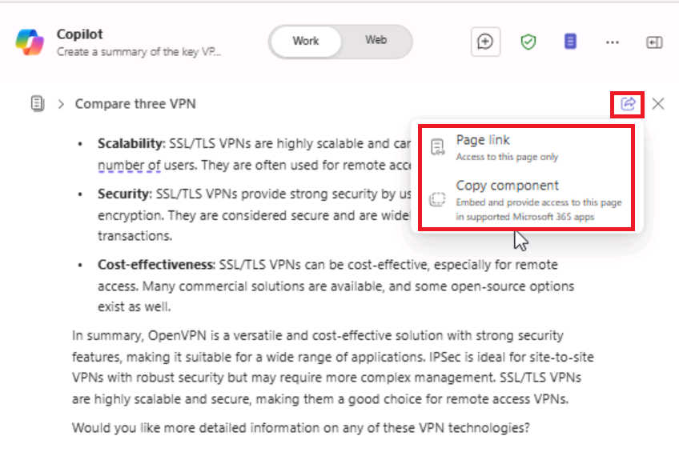

2.  Pegue este enlace en un **canal de Teams** o en un correo
    electrónico de **Outlook** para que los miembros del equipo puedan
    acceder a la página y colaborar con usted.

**Nota**: Este entorno de laboratorio se implementa con funcionalidad
restringida. Por lo tanto, no podrá utilizar Teams y Outlook de forma
colaborativa como lo haría en una red corporativa.

**Ejercicio \#3: Volver a visitar y acceder páginas guardadas**

En cualquier momento, puede regresar al mensaje de chat original donde
se creó por primera vez el enlace a la página de Copilot.

**Tarea 1: Localizar su página en Microsoft365.com**

1.  Vaya a la pestaña **Pages** en **Microsoft365.com**.

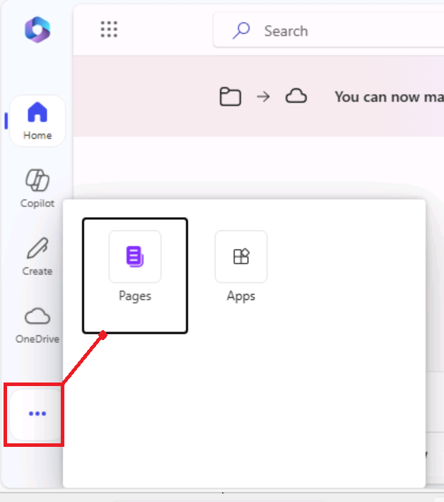

2.  Aquí podrá ver todas las **Copilot Pages** que ha creado,
    organizadas para facilitar el acceso.

>  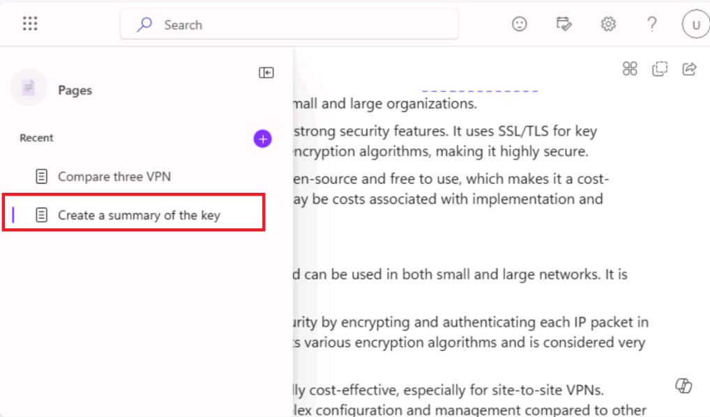

**Tarea 2: Realizar ediciones adicionales o compartir actualizaciones**

Abra la página guardada para realizar más modificaciones, añadir
actualizaciones o volver a compartir el enlace de la página para
continuar colaborando con miembros nuevos o existentes del equipo.

1.  Al pasar el cursor sobre el contenido textual, aparecerá el menú
    **Kebab** y el icono **Chat**.\*\*.\*\*

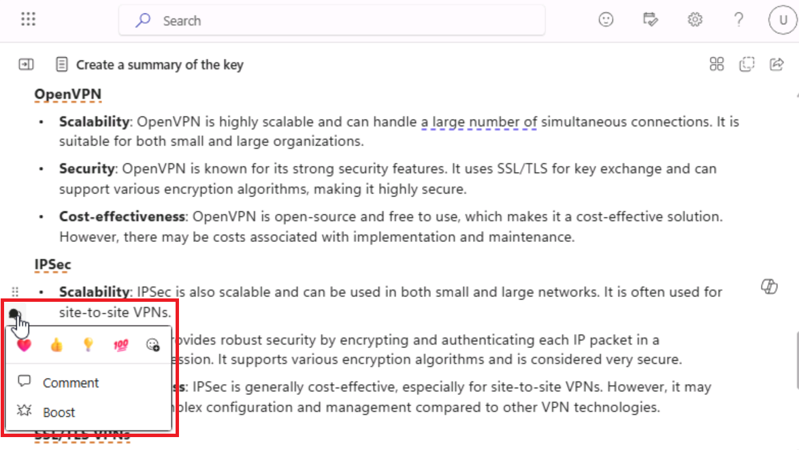

2.  Ahora edite la página directamente. Haga clic en la página y escriba
    para añadir o cambiar contenido. Aparecerá el siguiente prompt (para
    insertar un gráfico que muestre las tasas de adopción de VPN) y haga
    clic en **Send**.

++Insert a chart showing VPN adoption rates in pharmaceutical
industries.++

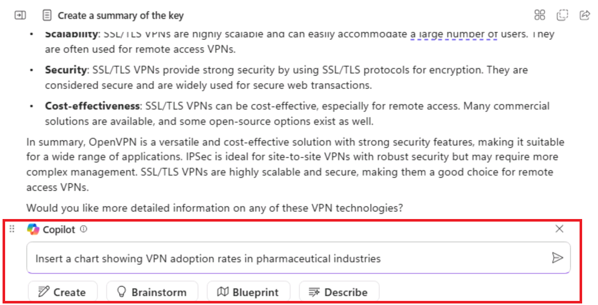

3.  Copilot generará y mostrará el gráfico con el fragmento de código.

4.  Cierre la ventana **Copilot chat** y seleccione **Preview** para
    continuar.

>  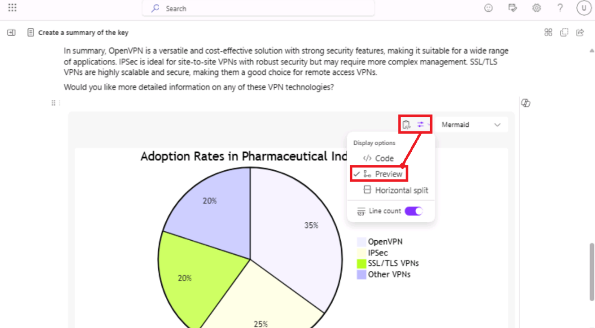

5.  Ahora finalizará el borrador para que esté listo para el equipo de
    liderazgo de Trey Research.

Utilizará el siguiente prompt para finalizar el documento.

++Format the executive summary to highlight the top three benefits of
Contoso’s VPN recommendation.++

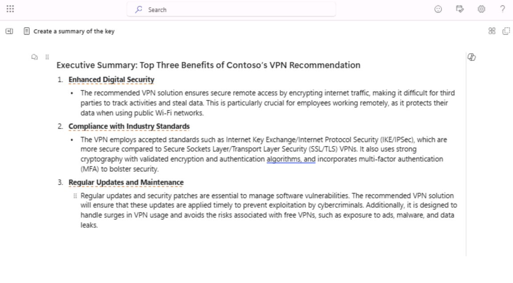

6.  Se asegurará de que todas las modificaciones estén completas y
    guardará la página con un nombre adecuado, lista para su
    presentación o para compartirla.

**Resumen:**

En este laboratorio, ha aplicado las siguientes habilidades:

- Ha utilizado Copilot para crear, perfeccionar y compartir contenido de
  manera efectiva.

- Ha utilizado las características interactivas y colaborativas de M365
  Pages para mejorar el trabajo en equipo.

a situaciones reales mediante la integración de Microsoft 365 Copilot en
los flujos de trabajo diarios para mejorar la productividad y la
colaboración.
