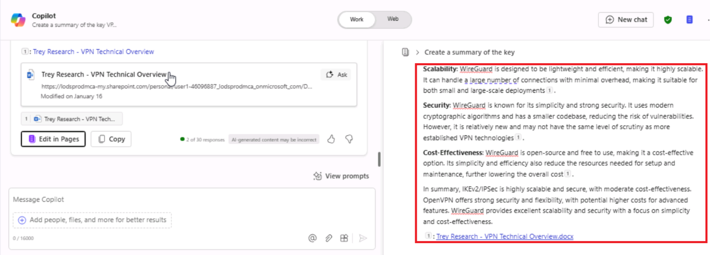

# Lab 06: Empower Team collaboration and content creation with Copilot Pages

**Objectives:**

In this lab, you will learn to use Microsoft Copilot within **Microsoft 365 Pages** to

- Interact with Copilot to generate and edit content.
- Refine and enhance generated content using **Microsoft 365 Pages** features.
- Share and collaborate on **Microsoft 365 Pages** with a team for
  seamless productivity.
- Re-access and manage pages from the Pages module in **Microsoft 365**.

**Scenario**: You are part of Fabrikam's IT consulting team. Trey
Research, a fast-growing pharmaceutical research company, has reached
out for guidance on implementing a Virtual Private Network (VPN) to
improve secure remote access for its employees and partners. Trey
Research operates globally, requiring scalable solutions that protect
sensitive research data while ensuring compliance with industry
regulations.

Your task is to deliver an Executive Overview Document summarizing Trey
Research’s VPN requirements, potential solutions, and key benefits of
adopting Contoso’s recommended VPN architecture.

**Key Features to explore during the lab:**

- **Persistent Content**: Understand how Copilot Pages allow you to make
  AI-generated responses more durable and editable.
- **Collaborative Editing**: Observe real-time changes as team members
  interact with the content, demonstrating the multiplayer capabilities.
- **Content Structuring with "/" Menu**: Use the **"/" menu** to add
  different content types like headings, tables, and images, helping
  structure the document effectively.

**Note**: You will be using **Trey Research - VPN Technical
Overview** document as a base reference the document shared by Trey
Research.

## Exercise #1: Create a Copilot Page

The reference document shared by Trey Research contains key information
about Trey Research's operations, existing IT infrastructure, and VPN
needs. As an Infrastructure solution consultant, you will reference this
document to draft the proposal.

### Task 1: Get the reference document listed in the Most Recently Used (MRU) file list.

1.  If you have a Microsoft 365 tab open in your Microsoft Edge browser,
    then select it now; otherwise, open a new tab and enter the
    following URL: +++https://www.office.com+++ to go to the Microsoft 365 home page.

    **Note**: You need to sign-in (if prompted) using the **Microsoft 365 Credentials** provided under   
    the **Resources** tab on the right.

2.  On the **Microsoft 365** navigation pane, select **OneDrive** to
    open it.

   

3.  Browse to the **C:\LabFiles** folder to select and upload a copy
    of **Trey Research - VPN Technical Overview** document
    to **OneDrive**.

   **Note**: If you have already uploaded all the lab assets to **OneDrive** as suggested in **Preparing 
   for the lab execution** section you can skip this step.

4.  Open and close the file **Trey Research - VPN Technical
    Overview.docx** (which you uploaded to  
    OneDrive) to get it in your Most Recently Used (MRU) file list.

### Task 2: Access Copilot and Start a Conversation

1.  If you have a Microsoft 365 tab open in your Microsoft Edge browser,
    then select it now; otherwise, open a new tab and enter the
    following URL: +++https://www.office.com+++ to go to the **Microsoft 365** home page.

2.  On the **Microsoft 365** navigation pane, select **Teams** to open
    it.

   

    Please wait while the setup process completes.

3.  Select \*\*Chat\*\* and open \*\*Copilot\*\*

    

4.  Begin a chat with **Copilot** by entering the following prompt.

    ++Create a summary of the key VPN needs for Trey Research, focusing on
    secure remote access and compliance with industry standards.++

    Note: On the **Copilot** page, in the **Work/Web** toggle switch at
    the top of the page, **Work** will be selected by default.

   

5.  Now you will attach the reference document shared by Trey Research
    to start drafting the content for Executive summary. Select the
    **Attach** (Paper clip) icon to reference the document.

    

6.  Select the document **Trey Research – VPN Technical Overview.**

    

    **Note**: If the file is not listed in the popup list, try again by
    selecting the **Attach** icon

7.  You will see the selected document attached in the **Prompt** box.
    Click **Send** icon to trigger Copilot start generating the content.

    

8.  Copilot will comb through the reference document and start
    generating the content.

    

    

9.  Once Copilot completes generating the draft content, you will see
    the **Edit in Pages** button at the end of the generated content.

    

10. A reference to this new **Copilot Page** is automatically added in
    the chat for easy access.

    

### Task 3: Explore Page Features

1.  You can rename the chat as per your requirement.

    

    **Note**: Copilot chat name cannot be more than 30 characters.

   

2. You can click the **Panel** (Collapse/Expand) icon to expand the
   Copilot chat pane to make room to view the content in a separate
   section. Verify that the page opens on the right, side-by-side with
   the chat pane. The response is automatically copied and formatted,
   including any link previews or code blocks.

    

3.  Click the **Edit in Pages** button to view the generated content in
    a separate section on the right.

    

    

## Exercise #2: Add and Refine Content on the Page

In this exercise, you will keep interacting with Copilot in the chat.
When new insights are generated, click **Edit in Pages** to add them to
the current page. These updates will be appended to the bottom of the
page (that you are viewing on the right side of chat pane)

### Task 1: Continue the Conversation in Chat

1.  In the chat window, provide further instructions to refine the
    content. Now you will ask Copilot to compare three VPN technologies
    focusing on their pros and cons in relation to Trey Research’s
    needs. Enter the following prompt and click **Send.**

    ++Compare three VPN technologies based on scalability, security, and
    cost-effectiveness.++

    
    **Note**: You can also try with the following prompt.

    ++Create a table comparing three VPN technologies (e.g., MPLS VPN, SSL
    VPN, IPsec VPN) based on scalability, security features, ease of
    deployment, and cost.++

2.  Copilot will generate new insights with the comparison details.
   

   

3.  Click **Edit in Pages** to append this comparison details to the
    existing page.
   

### Task 2: Edit Directly on the Page

1.  Click anywhere on the page to start typing and refining the content.
    Type **"/"** to open a menu of content options, such as headings,
    bullet points, tables, or images, for a more structured and engaging
    layout.
    

2.  Hover your mouse over a content block and select the Kebab menu (3
    vertical dots in parallel array – resembling a skewered item) to see
    the options to Copy Page link, Move block, and Delete.
    

### Task 3: Collaborate with Team Members

1.  When your page is ready for team input, click the **Share icon** in
    the upper-right corner and select **‘Copy component’**.

    

2.  Paste this link in a **Teams channel** or **Outlook** email,
    allowing team members to access the page and collaborate with you.

    **Note**: This lab environment is deployed with restricted
    functionality. So, you will not be able to use Teams and Outlook in a
    collaborative way which you will otherwise do in a corporate network.

## Exercise #3: Revisiting and accessing Saved Pages

At any time, you can go back to the original chat message where the
Copilot Page link was first created.

### Task 1: Locate Your Page in Microsoft365.com

1.  Go to the **Pages** tab on **Microsoft365.com**.

    

2.  Here, you’ll see all the **Copilot Pages** you’ve created, organized
    for easy access.
    

### Task 2: Make additional Edits or Share updates

Open the saved page to make further edits, add updates, or re-share the
page link for continued collaboration with new or existing team members.

1.  When you hover over the textual content, you will see the **Kebab**
    menu and **Chat** icon**.**

    

2.  Now edit the page directly. Click on the page and type to add or
    change content. You will now enter the following prompt (to insert a
    chart depicting VPN adoption rates) and click **Send**.

    ++Insert a chart showing VPN adoption rates in pharmaceutical
    industries.++

    

3.  Copilot will generate and display the chart with the code snippet.

    

4.  Close the **Copilot chat** window and select **Preview** to proceed
    further.
   

5.  Now you will finalize the draft to make it ready for Trey Research’s
    Leadership team.

    You will use the following prompt to finalize the document.

    ++Format the executive summary to highlight the top three benefits of
    Contoso’s VPN recommendation.++

    

    

6.  You will ensure all edits are complete and save the page with an
    appropriate name ready for presentation or sharing.

## Summary:

In this lab, you applied the following skills:

- Use Copilot to create, refine, and share content effectively.

- Utilize the interactive and collaborative features of M365 Pages to
  enhance teamwork.

to real-world scenarios by integrating Microsoft 365 Copilot into daily
workflows for productivity and collaboration.
